<center><h1>
    Docker实战指南
</h1></center>
[TOC]

## 目录

- [一、Docker基础](#一Docker基础)

- [二、Docker快速入门](#二Docker快速入门)

- [三、Docker数据管理](#三Docker数据管理)

- [四、Docker容器互联](#四Docker容器互联)

- [五、实战练习](#五实战练习)

- [六、Docker进阶](#六Docker进阶)

- [七、Docker Compose](#七DockerCompose)

- [八、Docker Swarm](#八DockerSwarm)

  

# 一、Docker基础

## 1、为什么是Docker？

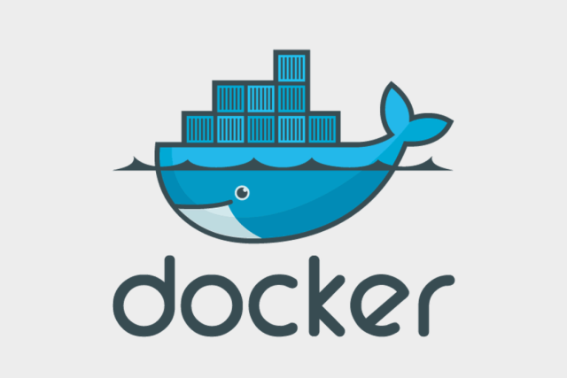

Docker 是一个开源的应用容器引擎，基于 [Go 语言](https://www.runoob.com/go/go-tutorial.html) 并遵从 Apache2.0 协议开源。

### 1、Docker解决了什么问题

- 快速交付和部署（镜像与容器）
- 资源的高效利用和隔离（高密度部署）
- 轻松的迁移和扩展（一次封装，到处运行）

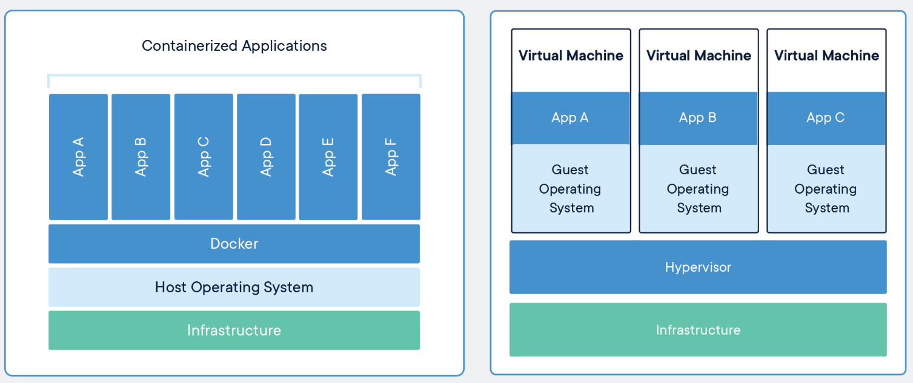

### 2、Docker使用步骤

- 安装Docker（安装应用商店）
- 寻找/下载镜像（寻找/下载app）
- 启动容器（启动应用）
- 移植（别的手机安装应用商店，继续以前流程）

容器化对比虚拟机

| 对比属性     | Container          | VM                 |
| ------------ | ------------------ | ------------------ |
| 隔离性       | 基于进程隔离       | 提供资源的完全隔离 |
| 启动时间     | 秒级               | 分钟级             |
| 内核         | 共用宿主机内核     | 使用独立内核       |
| 占用资源     | MB级               | GB级               |
| 系统支持容量 | 单机支持上千个容器 | 一般几十个         |

## 2、核心概念


### 1、Docker 镜像

Docker镜像类似于虚拟机镜像，可以将他理解为一个只读的模板。

### 2、Docker 容器

Docker容器类似于一个轻量级的沙箱，Docker利用容器来运行和隔离应用。容器是从镜像创建来的。容器可以启动、停止、删除，容器之间彼此隔离，互不可见。

可以把容器看做是一个简易版的Linux系统环境（包括root用户权限、进程空间、用户空间和网络空间等）以及运行在其中的应用程序打包而成的盒子

### 3、Docker 仓库

Docker仓库是存储镜像的仓库。可以有Public（公有仓库）和Private（私有仓库）。最大的公有仓库是[Docker Hub](https://hub.docker.com/)

| Docker | 面向对象 |
| :----: | :------: |
|  镜像  |    类    |
|  容器  |   对象   |

## 3、安装启动

### 1、阿里云安装

```shell
yum install docker
systemctl enable docker
systemctl start docker

docker -v
docker info
```

### 2、标准方式安装

```shell
#移除旧版本
yum remove docker \
                  docker-client \
                  docker-client-latest \
                  docker-common \
                  docker-latest \
                  docker-latest-logrotate \
                  docker-logrotate \
                  docker-engine
```

```sh
#安装Docker其他依赖
yum install -y yum-utils \
  device-mapper-persistent-data \
  lvm2
#设置Docker yum源
yum-config-manager \
    --add-repo \
    https://download.docker.com/linux/centos/docker-ce.repo
```

```shell
#安装Docker CE
yum install docker-ce docker-ce-cli containerd.io

#安装指定版本的Docker
yum list docker-ce --showduplicates | sort -r
yum install docker-ce-<VERSION_STRING> docker-ce-cli-<VERSION_STRING> containerd.io
```

```shell
#启动Docker
systemctl enable docker
systemctl start docker
```


# 二、Docker快速入门

> 我们以使用Docker的方式安装MySQL为例，快速体会Docker的基本操作

## 1、镜像操作

### 1、下载镜像  docker pull mysql

```shell
#我们应该先去Docker Hub寻找我们感兴趣的镜像
docker pull image_name[:Tag]
#1、tag一般为镜像的版本，不指定默认下载latest版本
#2、默认镜像是从Docker Hub下载，国内比较慢，推荐使用自己的阿里云加速
sudo mkdir -p /etc/docker
sudo tee /etc/docker/daemon.json <<-'EOF'
{
  "registry-mirrors": ["https://82m9ar63.mirror.aliyuncs.com"]
}
EOF
sudo systemctl daemon-reload
sudo systemctl restart docker
```

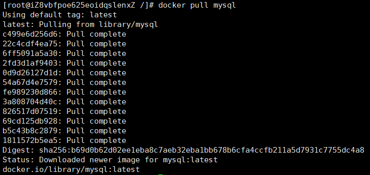

- 以上下载过程看出，镜像是分层的（Layer）。c499e6d256d6是当前层的唯一id（完整的id为256bit，64个十六进制字符组成）。
- 不同的镜像如果有相同的层，本地只会存储一份，减小了存储空间
- 严格说，下载镜像需要制定指定仓库名称，不过从Docker Hub下载的可以忽略前缀。如
  - docker pull **docker.io/library/**mysql:5.7


### 2、列出镜像 docker images

```shell
docker images
```

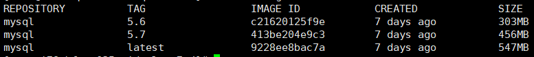

REPOSITORY：来源于哪个仓库

TAG：镜像版本标签信息

 IMAGE ID ：镜像唯一id

CREATED：镜像最后更新时间

SIZE：镜像大小

### 3、查看详情 docker inspect

```shell
docker inspect image_name[:tag]
docker inspect image_id  
```

### 4、删除镜像 docker rmi

```shell
docker rmi image_name[:tag] 或者 docker rmi image_id
```

## 2、容器操作

### 1、启动容器

```shell
#docker run [OPTIONS] IMAGE [COMMAND] [ARG...] 常用选项
-d　　守护态运行
-p　　Publish a container's port(s) to the host ( container和host端口映射)
-i　　以交互模式运行容器，通常与 -t 同时使用
-t　　为容器重新分配一个伪输入终端，通常与 -i 同时使用
--name="nginx-lb"　　为容器指定一个名称
-v, --volume value　　Bind mount a volume (default [])
```

```shell
docker run -d -p 3306:3306 -e MYSQL_ROOT_PASSWORD=123456 --name hello-mysql mysql:5.7

#查看所有运行中的容器
docker ps 
#查看所有容器
docker ps -a
```

```shell
#docker create 和 docker run的区别
docker create -p 3306:3306 -e MYSQL_ROOT_PASSWORD=123456 --name hello-mysql mysql:5.7
#create新建容器，run新建并启动。create相当于 run -d设置
```


### 2、进入容器

```shell
#docker exec  [OPTIONS] CONTAINER COMMAND [ARG...]
#Run a command in a running container
docker exec -it hello-mysql /bin/bash	
#尝试连接MySQL
mysql -uroot -p123456
```

```shell
#扩展
docker exec -d hello-mysql touch /hello.txt
docker exec -it hello-mysql mysql -uroot -p

#删除
docker rm container_id/container_name
#查看运行日志
docker logs container_id/container_name
```

## 3、其他命令

[Docker 命令手册](https://docs.docker.com/engine/reference/commandline/docker/)

## 5、可视化

- Portainer（先用这个）

```shell
docker run -d -p 8088:9000 \
--restart=always -v /var/run/docker.sock:/var/run/docker.sock --privileged=true portainer/portainer
```

- Rancher（CI/CD再用这个）

```shell
#安装rancher-server
docker run --name rancher-server -p 8000:8080 -v /etc/localtime:/etc/localtime:ro  -d  rancher/server
#安装agent
docker run --rm --privileged -v /var/run/docker.sock:/var/run/docker.sock -v /var/lib/rancher:/var/lib/rancher rancher/agent:v1.2.11 http://39.101.191.131:8000/v1/scripts/D3DBD43F263109BB881F:1577750400000:7M0yBzCw4XSxJklD7TpysYIpI
```


# 三、Docker数据管理

使用Docker过程中，往往需要对数据进行持久化，或者多个容器之间进行数据共享，这就需要我们熟悉容器的数据管理操作


容器中管理数据主要的两种方式：

- 数据卷（Data Volumes）:容器内数据直接映射到本地主机环境
- 数据卷容器（Data Volumes Containers）：使用特定容器维护数据

## 1、数据卷

将主机操作系统目录直接映射进容器，类似于Linux中的mount。数据卷很好的解耦了容器应用和数据。对数据卷内数据的操作（无论是在本地主机还是容器内），都会立即生效。

```shell
docker run -d -p 3307:3306 -v /my/custom:/etc/mysql/conf.d \
-v /my/own/datadir:/var/lib/mysql --restart always --name mysql01 mysql:5.7
```

`-v hostDir:containerDir`：hostDir不存在会自动创建，默认权限是rw，也可以改为ro，这样容器内部就无法对数据卷的数据进行修改了。

```shell
docker run -d -p 3307:3306 -v /my/custom:/etc/mysql/conf.d:ro \
-v /my/own/datadir:/var/lib/mysql --restart always --name mysql01 mysql:5.7
```

```shell
#数据卷创建
docker volume create [OPTIONS] [VOLUME]
docker volume create hello
docker run -d -p 3307:3306 -v hello:/etc/mysql/conf.d \
-v /my/own/datadir:/var/lib/mysql --restart always --name mysql01 mysql:5.7

#数据卷列表
docker volume ls

#数据卷详情
docker volume inspect hello
```

```json
[
    {
        "CreatedAt": "2020-04-08T06:43:08Z",
        "Driver": "local",
        "Labels": {},
        "Mountpoint": "/var/lib/docker/volumes/hello/_data",
        "Name": "hello",
        "Options": {},
        "Scope": "local"
    }
]
```


```shell
#docker cp 用于容器与主机之间的数据拷贝
docker cp [OPTIONS] CONTAINER:SRC_PATH DEST_PATH|-
docker cp [OPTIONS] SRC_PATH|- CONTAINER:DEST_PATH
```

- `SRC_PATH` 指定为一个文件
  - `DEST_PATH` 不存在：文件名为 `DEST_PATH`，内容为SRC的内容
  - `DEST_PATH` 不存在并且以 `/` 结尾：报错
  - `DEST_PATH` 存在并且是文件：目标文件内容被替换为SRC_PATH的文件内容。
  - `DEST_PATH` 存在并且是目录：文件复制到目录内，文件名为SRC_PATH指定的名字
- `SRC_PATH` 指定为一个目录
  - `DEST_PATH` 不存在：`DEST_PATH`创建文件夹，复制源文件夹内的所有内容
  - `DEST_PATH` 存在是文件：报错
  - `DEST_PATH` 存在是目录
    - `SRC_PATH` 不以 `/.` 结束：源文件夹复制到目标里面
    - `SRC_PATH` 以 `/.` 结束：源文件夹里面的内容复制到目标里面


## 2、数据卷容器

如果需要在多个容器之间共享一些持续更新的数据，最简单的方式是使用数据卷容器。数据卷容器也是一个容器，但他专门用来提供数据卷供其他容器挂载。

```shell
docker run -it -v /idata --name idata ubuntu

docker run -it --volumes-from idata --name d01 ubuntu
docker run -it --volumes-from idata --name d02 ubuntu
#使用--volumes-from参数所挂载的数据卷容器本身不需要保持在运行状态
```


# 四、Docker容器互联

## 1、端口映射

```shell
docker create -p 3306:3306 -e MYSQL_ROOT_PASSWORD=123456 --name hello-mysql mysql:5.7
```

`-p HostPort:ContainerPort | IP:HostPort:ContainerPort | HostPort:ContainerPort`

- 查看端口映射
  - docker port hello-mysql

## 2、容器互联

`--link name:alias`，name连接容器的名称，alias连接的别名

场景：我们无需暴露mysql的情况下，让web应用使用mysql；

```shell
docker run -d -e MYSQL_ROOT_PASSWORD=123456 --name mysql01 mysql:5.7
docker run -d --link mysql01:mysql --name tomcat tomcat:7

docker exec -it tomcat bash
cat /etc/hosts
```


# 五、实战练习

## 1、安装MySQL

```shell
docker run -p 3306:3306 --name mysql \
-v /idata/mysql/log:/var/log/mysql \
-v /idata/mysql/data:/var/lib/mysql \
-v /idata/mysql/conf:/etc/mysql \
-e MYSQL_ROOT_PASSWORD=root \
-d mysql:5.7

docker exec -it mysql mysql -uroot -proot
```

```shell
#配置MySQL主从复制 
#创建master
docker run -p 3306:3306 --name mysql-master \
-v /idata/mysql/log:/var/log/mysql \
-v /idata/mysql/data:/var/lib/mysql \
-v /idata/mysql/conf:/etc/mysql \
-e MYSQL_ROOT_PASSWORD=root \
-d mysql:5.7
##配置文件
vim /idata/mysql/conf/my.cnf

[client]
default-character-set=utf8
 
[mysql]
default-character-set=utf8
 
[mysqld]
init_connect='SET collation_connection = utf8_unicode_ci'
init_connect='SET NAMES utf8'
character-set-server=utf8
collation-server=utf8_unicode_ci
skip-character-set-client-handshake
skip-name-resolve

server_id=1
log-bin=mysql-bin
read-only=0
binlog-do-db=icoding_test

replicate-ignore-db=mysql
replicate-ignore-db=sys
replicate-ignore-db=information_schema
replicate-ignore-db=performance_schema

#创建Slaver，和master一致，配置文件修改如下即可
server_id=2
log-bin=mysql-bin
read-only=1
binlog-do-db=icoding_test

replicate-ignore-db=mysql
replicate-ignore-db=sys
replicate-ignore-db=information_schema
replicate-ignore-db=performance_schema

#配置matser
1、添加用来同步的用户
       GRANT REPLICATION SLAVE ON *.* to 'backup'@'%' identified by '123456';
2、查看master状态
   show master status\G;
 
#配置slaver
1、change master to master_host='mysql-master',master_user='backup',master_password='123456',master_log_file='mysql-bin.000003',master_log_pos=0,master_port=3306;
2、start slave;
3、show slave status\G;
```


## 2、安装Redis

```shell
mkdir -p /idata/redis/conf
touch /idata/redis/conf/redis.conf

docker run -p 6379:6379 --name redis -v /idata/redis/data:/data \
-v /idata/redis/conf:/etc/redis \
-d redis redis-server /etc/redis/redis.conf
```

redis 自描述文件：
https://raw.githubusercontent.com/antirez/redis/4.0/redis.conf

```shell
#安装redis-cluster；3主3从方式，从为了同步备份，主进行slot数据分片
##单机情况下可以这样做。
for port in $(seq 7001 7006); \
do \
mkdir -p /mydata/redis/node-${port}/conf
touch /mydata/redis/node-${port}/conf/redis.conf
cat << EOF >/mydata/redis/node-${port}/conf/redis.conf
port ${port}
cluster-enabled yes
cluster-config-file nodes.conf
cluster-node-timeout 5000
cluster-announce-ip 192.168.56.10
cluster-announce-port ${port}
cluster-announce-bus-port 1${port}
appendonly yes
EOF
docker run -p ${port}:${port} -p 1${port}:1${port} --name redis-${port} \
-v /mydata/redis/node-${port}/data:/data \
-v /mydata/redis/node-${port}/conf/redis.conf:/etc/redis/redis.conf \
-d redis:5.0.7 redis-server /etc/redis/redis.conf; \
done
docker stop $(docker ps -a |grep redis-700 | awk '{ print $1}')
docker rm $(docker ps -a |grep redis-700 | awk '{ print $1}')

##建立集群
docker exec -it redis-7001 bash
redis-cli --cluster create 192.168.56.10:7001 192.168.56.10:7002 192.168.56.10:7003 192.168.56.10:7004 192.168.56.10:7005 192.168.56.10:7006 --cluster-replicas 1
```


## 3、安装ElasticSearch

```shell
mkdir -p /idata/es/config
mkdir -p /idata/es/data
echo "http.host: 0.0.0.0" >> /idata/es/config/elasticsearch.yml
chmod -R 777 /idata/es/ 保证权限
docker run --name elasticsearch -p 9200:9200 -p 9300:9300 \
-e "discovery.type=single-node" \
-e ES_JAVA_OPTS="-Xms64m -Xmx512m" \
-v /idata/es/config/elasticsearch.yml:/usr/share/elasticsearch/config/elasticsearch.yml \
-v /idata/es/data:/usr/share/elasticsearch/data \
-v /idata/es/plugins:/usr/share/elasticsearch/plugins \
-d elasticsearch:7.4.2
```

```shell
docker run --name kibana -e ELASTICSEARCH_HOSTS=http://192.168.0.10:9200 -p 5601:5601 \
-d kibana:7.4.2
```


```shell
#安装Es集群
##集群配置文件
cluster.name: my-es #集群的名称，同一个集群该值必须设置成相同的
node.name: es-master #该节点的名字,每个节点需要写自己的
node.master: true #该节点有机会成为master节点
node.data: false #该节点可以存储数据
network.host: 0.0.0.0 
http.host: 0.0.0.0 #所有http均可访问
http.port: 9200
transport.tcp.port: 9300
#discovery.zen.minimum_master_nodes: 2 #设置这个参数来保证集群中的节点可以知道其它N个有master资格的节点。官方推荐（N/2）+1
discovery.zen.ping_timeout: 10s #设置集群中自动发现其他节点时ping连接的超时时间
discovery.seed_hosts: ["172.18.12.21:9300", "172.18.12.22:9300", "172.18.12.23:9300"] #设置集群中的Master节点的初始列表，可以通过这些节点来自动发现其他新加入集群的节点，es7的新增配置
cluster.initial_master_nodes: ["172.18.12.21"] #新集群初始时的候选主节点，es7的新增配置

#启动
docker run --name elasticsearch \
-p 9200:9200 -p 9300:9300 \
-e ES_JAVA_OPTS="-Xms300m -Xmx300m" \
-v /idata/es/config/elasticsearch.yml:/usr/share/elasticsearch/config/elasticsearch.yml \
-v /idata/es/data:/usr/share/elasticsearch/data \
-v /idata/es/plugins:/usr/share/elasticsearch/plugins \
-d elasticsearch:7.4.2
##可以启动3master，3data，3client
node.master: false #该节点有机会成为master节点
node.data: true #该节点可以存储数据
```


```shell
#也可以使用自定义Docker网络的方式
docker network create --driver bridge --subnet 172.21.0.0/16 --gateway 172.21.0.1 mynet
#运行容器的时候，使用 --ip --network指定网络
```


## 4、安装Nginx

- 随便启动一个 nginx 实例， 只是为了复制出配置

  `docker run -p 80:80 --name nginx -d nginx:1.10`

  

- 将容器内的配置文件拷贝到当前目录：

  - mkdir -p /idata/nginx/conf
  - docker container cp nginx:/etc/nginx/. /idata/nginx/conf

- 创建新的 nginx； 执行以下命令
  docker run -p 80:80 --name nginx \
  -v /idata/nginx/html:/usr/share/nginx/html \
  -v /idata/nginx/logs:/var/log/nginx \
  -v /idata/nginx/conf:/etc/nginx \
  -d nginx:1.10

- 给 nginx 的 html 下面放的所有资源可以直接访问； 


## 5、安装RabbitMQ

```shell
#简单安装
docker run -d --name rabbitmq -p 5671:5671 -p 5672:5672 -p 4369:4369 -p
25672:25672 -p 15671:15671 -p 15672:15672 -v /idata/rabbitmq:/var/lib/rabbitmq rabbitmq:management

4369, 25672 (Erlang发现&集群端口)
5672, 5671 (AMQP端口)
15672 (web管理后台端口)
61613, 61614 (STOMP协议端口)
1883, 8883 (MQTT协议端口)
https://www.rabbitmq.com/networking.html
```

```shell
#安装RabbitMQ镜像集群
#三台机器分别运行
mkdir -p /idata/rabbitmq
vi /idata/rabbitmq/hosts
192.168.0.48 rabbit1 rabbit1
192.168.0.47 rabbit2 rabbit2
192.168.0.46 rabbit3 rabbit3

#注意修改每个-h 参数，修改为正确的hostname
docker run -d --name rabbitmq -h rabbit1 -v /idata/rabbitmq:/var/lib/rabbitmq -v /idata/rabbitmq/hosts:/etc/hosts -p 5671:5671 -p 5672:5672 -p 4369:4369 -p 25672:25672 -p 15671:15671 -p 15672:15672 -e RABBITMQ_ERLANG_COOKIE='icodingedu' rabbitmq:management

#RABBITMQ_ERLANG_COOKIE 节点认证作用，部署集成时 需要同步该值

#节点加入集群
#初始化第一个节点
docker exec -it rabbitmq /bin/bash
rabbitmqctl stop_app
rabbitmqctl reset
rabbitmqctl start_app
Exit

#设置集群内的其他节点
docker exec -it rabbitmq /bin/bash
rabbitmqctl stop_app
rabbitmqctl reset
rabbitmqctl join_cluster --ram rabbit@rabbit1 #master的ip
rabbitmqctl start_app
exit

#实现镜像集群
#进入主节点进行操作
docker exec -it rabbitmq bash
rabbitmqctl set_policy -p / ha "^" '{"ha-mode":"all","ha-sync-mode":"automatic"}'

可以使用 rabbitmqctl list_policies -p /；查看vhost/下面的所有policy
在cluster中任意节点启用策略，策略会自动同步到集群节点
rabbitmqctl set_policy -p / ha-all "^" '{"ha-mode":"all"}'
策略模式 all 即复制到所有节点，包含新增节点，策略正则表达式为 “^” 表示所有匹配所有队列名称。“^hello”表示只匹配名为hello开始的队列
```


# 六、Docker进阶


## 1、Docker仓库（私有仓库）

### 1、阿里云

**开通阿里云容器镜像服务**

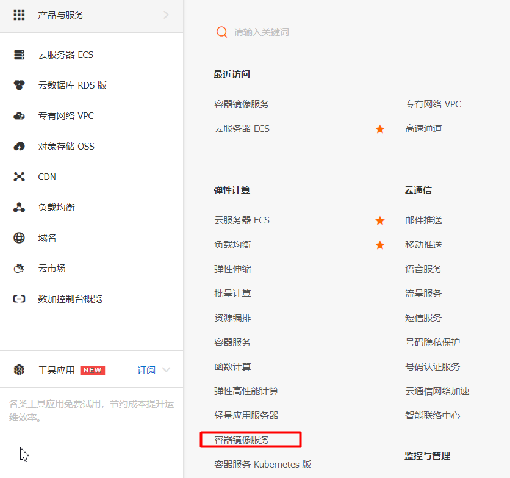


```shell
#阿里云下载镜像，需要填写前缀
docker pull registry.cn-shenzhen.aliyuncs.com/ali/mysql:[镜像版本号]

ali：命名空间
mysql：镜像仓库
```

- 创建命名空间
- 创建镜像仓库

### 2、Harbor


## 2、网络高级

Docker使用Linux桥接，在宿主机虚拟一个Docker容器网桥(docker0)，Docker启动一个容器时会根据Docker网桥的网段分配给容器一个IP地址，称为Container-IP，同时Docker网桥是每个容器的默认网关。因为在同一宿主机内的容器都接入同一个网桥，这样容器之间就能够通过容器的Container-IP直接通信。

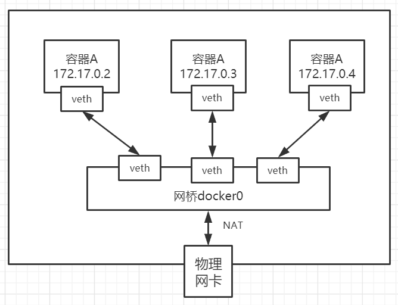

​														Linux虚拟网络技术。

Docker容器网络就很好的利用了Linux虚拟网络技术，在本地主机和容器内分别创建一个虚拟接口，并让他们彼此联通（这样一对接口叫veth pair）；

Docker中的网络接口默认都是虚拟的接口。虚拟接口的优势就是转发效率极高（因为Linux是在内核中进行数据的复制来实现虚拟接口之间的数据转发，无需通过外部的网络设备交换），对于本地系统和容器系统来说，虚拟接口跟一个正常的以太网卡相比并没有区别，只是他的速度快很多。

### 1、网络的创建过程

Docker创建一个容器的时候，会具体执行以下操作：

1. 创建一对虚拟接口，分别放到本地主机和新容器的命名空间中
2. 本地主机一段的虚拟接口连接到默认的docker0网桥或者指定网桥上，并具有一个以veth开头的唯一名字
3. 容器一段的虚拟接口将放到新创建的容器中，并修改名字为eth0。这个接口只在容器的命名空间可见
4. 从网桥的可用地址段中获取一个空闲的地址分配给容器的eth0（如：172.17.0.2/16）,并配置默认路由网关为docker0网卡的内部接口docker0的IP地址（如：172.17.42.1/16）

完成以上，容器就可以使用它所能看到的eth0虚拟网卡来连接其他容器和访问外部网络。

### 2、网络模式

| 网络模式      | 配置                    | 说明                                                         |
| ------------- | ----------------------- | ------------------------------------------------------------ |
| bridge模式    | --net=bridge            | 默认值，在Docker网桥docker0上为容器创建新的网络栈            |
| none模式      | --net=none              | 不配置网络，用户可以稍后进入容器，自行配置                   |
| container模式 | --net=container:name/id | 容器和另外一个容器共享Network namespace。<br /> kubernetes中的pod就是多个容器共享一个Network namespace。 |
| host模式      | --net=host              | 容器和宿主机共享Network namespace                            |
| 用户自定义    | --net=自定义网络        | 用户自己使用network相关命令定义网络，<br />创建容器的时候可以指定为自己定义的网络 |

### 3、实验测试网络互连

- 大家重点理解veth pair技术
- --link是容器在默认网络模式下，可以互相使用容器名ping通的
- 如果容器创建时使用自定义网络，不使用--link也是可以ping通相互的容器名

- --link 生产一般不用，我们可以使用自定义网络的方式
- docker network connect


## 3、Dockerfile

Dockerfile指南：https://docs.docker.com/engine/reference/builder/

### 1、Docker进阶操作

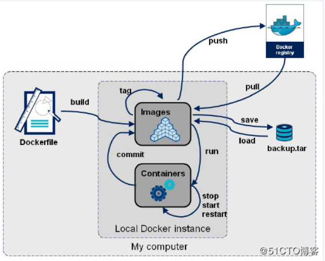

1、创建项目dockerfile

2、上传项目到服务器。

3、进入项目，构建镜像到本地仓库；

- `docker build -t nginx:1.0 -f ./Dockerfile .`  别忘了最后的小数点。
- docker images 查看镜像
- docker exec -it 容器id /bin/bash；进入容器，修改容器
- docker commit -a “icoding” -m “nginxxx” 容器id mynginx:2.0
  - docker commit [OPTIONS] CONTAINER [REPOSITORY[:TAG]]
  - OPTIONS说明：
    - -a :提交的镜像作者；
    - -c :使用Dockerfile指令来创建镜像；
    - -m :提交时的说明文字；
    - -p :在commit时，将容器暂停。
-  docker login : 登陆到一个Docker镜像仓库，如果未指定镜像仓库地址，默认为官方仓库 Docker Hub
  - docker login -u 用户名 -p 密码
- docker logout : 登出一个Docker镜像仓库，如果未指定镜像仓库地址，默认为官方仓库 Docker Hub

4、推送镜像到docker hub

- 标记镜像，docker tag local-image:tagname username/new-repo:tagname
- 上传镜像，docker push username/new-repo:tagname 

5、保存镜像，加载镜像

- 可以保存镜像为tar，使用u盘等设备复制到任意docker主机，再次加载镜像
- 保存：docker save spring-boot-docker -o /home/spring-boot-docker.tar
- 加载：docker load -i spring-boot-docker.tar

6、阿里云操作

- 登录阿里云，密码就是开通镜像仓库时 的密码
  - docker login --username=icoding registry.cn-hangzhou.aliyuncs.com
- 拉取镜像
  - docker pull registry.cn-hangzhou.aliyuncs.com/icoding/i-nginx:v1.0
- 推送镜像
  - docker tag [ImageId] registry.cn-hangzhou.aliyuncs.com/icoding/icoding-nginx:v2
  - docker push registry.cn-hangzhou.aliyuncs.com/icoding/icoding-nginx:v2

### 2、Dockerfile详解

Dockerfile由一行行命令语句组成，并且支持以#开头的注释行。

一般而言，Dockerfile可以分为四部分

`基础镜像信息` `维护者信息` `镜像操作指令` `启动时执行指令`

| 指令           | 说明                                                         |
| -------------- | ------------------------------------------------------------ |
| **FROM**       | 指定基础镜像                                                 |
| **MAINTAINER** | 指定维护者信息，已经过时，可以使用LABEL maintainer=xxx 来替代 |
| **RUN**        | 运行命令                                                     |
| **CMD**        | 指定启动容器时默认的命令                                     |
| **LABEL**      | 指定生成镜像的元数据标签信息                                 |
| **EXPOSE**     | 声明镜像内服务监听的端口                                     |
| **ENV**        | 指定环境变量                                                 |
| **ADD**        | 复制指定的src路径下的内容到容器中的dest路径下，src可以为url会自动下载，可以为tar文件，会自动解压 |
| **COPY**       | 复制本地主机的src路径下的内容到镜像中的dest路径下，但不会自动解压等 |
| **ENTRYPOINT** | 指定镜像的默认入口                                           |
| **VOLUME**     | 创建数据卷挂载点                                             |
| **USER**       | 指定运行容器时的用户名或UID                                  |
| **WORKDIR**    | 配置工作目录                                                 |
| **ARG**        | 指定镜像内使用的参数（如版本号信息等）                       |
| OBBUILD        | 配置当创建的镜像作为其他镜像的基础镜像是，所指定的创建操作指令 |
| STOPSIGNAL     | 容器退出的信号值                                             |
| HEALTHCHECK    | 健康检查                                                     |
| SHELL          | 指定使用shell时的默认shell类型                               |

> 1、RUN、CMD、ENTRYPOINT区别
>
> 1. RUN 执行命令并创建新的镜像层RUN 经常用于安装软件包（在构建镜像时运行的）。
> 2. CMD 设置容器启动后默认执行的命令及其参数但 CMD 能够被 `docker run` 后面跟的命令行参数替换。
> 3. ENTRYPOINT 配置容器启动时运行的命令。
> 4. 以上命令都可以使用shell或者exec方式执行
> 5. `CMD ["executable","param1","param2"]` (*exec* form, this is the preferred form)
> 6. `CMD ["param1","param2"]` (as *default parameters to ENTRYPOINT*)
> 7. `CMD command param1 param2` (*shell* form)

> 2、shell和exec方式
>
> 	1.  shell 是  /bin/sh -c <command>的方式，
>
>  	2.  exec ["/bin/sh","-c",command] 的方式== shell方式

```shell
eg：shell方式

ENV name icoding  
ENTRYPOINT echo "Hello, $name" 
#输出 Hello icoding

ENTRYPOINT ["/bin/echo", "Hello, $name"]
#输出 Hello $name

ENTRYPOINT ["/bin/sh", "-c", "echo Hello, $name"]
#输出 Hello icoding

##建议：CMD 和 ENTRYPOINT 推荐使用 Exec 格式因为指令可读性更强更容易理解。RUN 则两种格式都可以。exec的时候要获取环境变量等值，就用/bin/sh -c 即可。
```

|                                | No ENTRYPOINT              | ENTRYPOINT exec_entry p1_entry | ENTRYPOINT [“exec_entry”, “p1_entry”]          |
| :----------------------------- | :------------------------- | :----------------------------- | ---------------------------------------------- |
| **No CMD**                     | *error, not allowed*       | /bin/sh -c exec_entry p1_entry | exec_entry p1_entry                            |
| **CMD [“exec_cmd”, “p1_cmd”]** | exec_cmd p1_cmd            | /bin/sh -c exec_entry p1_entry | exec_entry p1_entry exec_cmd p1_cmd            |
| **CMD [“p1_cmd”, “p2_cmd”]**   | p1_cmd p2_cmd              | /bin/sh -c exec_entry p1_entry | exec_entry p1_entry p1_cmd p2_cmd              |
| **CMD exec_cmd p1_cmd**        | /bin/sh -c exec_cmd p1_cmd | /bin/sh -c exec_entry p1_entry | exec_entry p1_entry /bin/sh -c exec_cmd p1_cmd |

### 3、实战Dockerfile


### 4、idea快速整合使用

#### 1、 Docker开启远程访问

```shell
#修改该Docker服务文件
vi /lib/systemd/system/docker.service
#修改ExecStart这行,将原来注释，加上这个命令
ExecStart=/usr/bin/dockerd -H tcp://0.0.0.0:2375 -H unix:///var/run/docker.sock
#重新加载配置文件
systemctl daemon-reload
#重启服务
systemctl restart docker.service
#查看端口是否开启
netstat -nlpt #如果找不到netstat命令，可进行安装。yum install net-tools
#直接curl看是否生效
curl http://127.0.0.1:2375/info
```

#### 2、IDEA安装Docker插件 

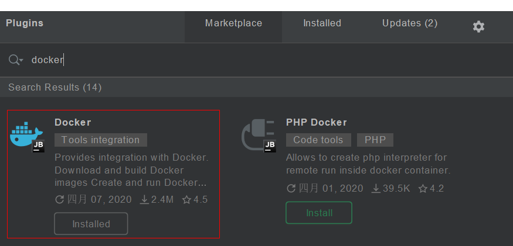

#### 3、IDEA配置docker 

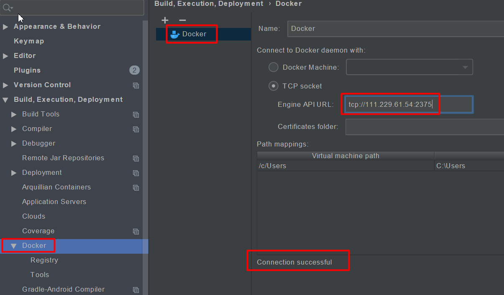

#### 4、也可以整合自己的私有镜像仓库

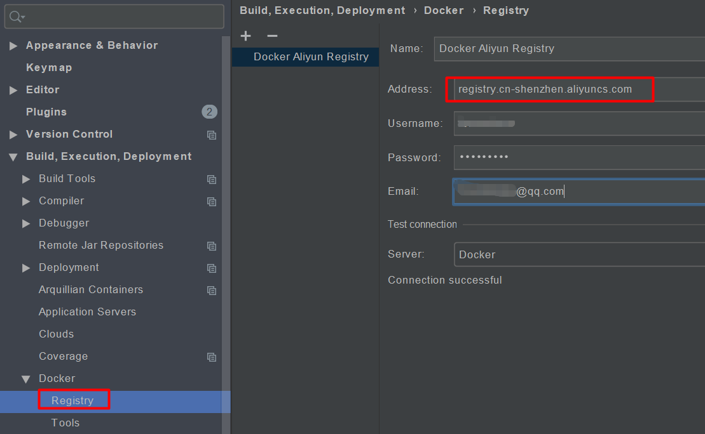


==可以提供非常方便的部署功能==

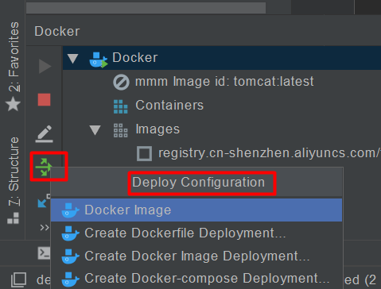

#### 5、docker-maven-plugin

市面上docker-maven-plugin太多，我们推荐一个 [docker-maven-plugin](https://dmp.fabric8.io/#introduction)，照着文档使用就行。不管使用哪一种docker插件来构造image，都比不上直接用Dockerfile编写简单，而且可复用，不用学习不同插件不同的构造规则。

> 最好给自己的Docker服务器配置阿里云镜像加速，否则经常导致镜像下载不来的情况

fabric8io的有两大功能:

1. 构造并推送Docker镜像
2. 启动和停止Docker容器

```xml
<plugin>
    <groupId>io.fabric8</groupId>
    <artifactId>docker-maven-plugin</artifactId>
    <version>0.33.0</version>

    <!--全局配置-->
    <configuration>
        <!--这一部分是为了实现对远程docker容器的控制-->
        <!--docker主机地址,用于完成docker各项功能,注意是tcp不是http!-->
        <dockerHost>tcp://公网IP:2376</dockerHost>
        <!--docker远程访问所需证书地址,如果docker远程主机没有启用TLS验证则不需要配证书-->
        <certPath>${project.basedir}/docker/ssh</certPath>

        <!--这一部分是为了实现docker镜像的构建和推送-->
        <!--registry地址,用于推送,拉取镜像,我这里用的是阿里的registry-->
        <registry>registry.cn-shenzhen.aliyuncs.com</registry>
        <!--认证配置,用于私有registry认证,如果忘记了可以去阿里的registry查看-->
        <authConfig>
            <push>
                <username>这里填registry的用户名</username>
                <password>这里填registry的密码</password>
            </push>
        </authConfig>

        <!--镜像相关配置,支持多镜像-->
        <images>
            <!-- 单个镜像配置 -->
            <image>
                <!--镜像名(含版本号)-->
                <name>命名空间/仓库名称:镜像版本号</name>
                <!--别名:用于容器命名和在docker-compose.yml文件只能找到对应名字的配置-->
                <alias>${project.name}</alias>
                <!--镜像build相关配置-->
                <build>
                    <!--使用dockerFile文件-->
                    <dockerFile>${project.basedir}/docker/${project.name}</dockerFile>
                </build>
                <!--配置docker-compose文件-->
                <external>
                    <type>compose</type>
                    <basedir>${project.basedir}/docker</basedir>
                    <composeFile>docker-compose.yml</composeFile>
                </external>
                <!--容器run相关配置-->
                <run>
                    <!--配置运行时容器命名策略为:别名,如果不指定则默认为none,即使用随机分配名称-->
                    <namingStrategy>alias</namingStrategy>
                </run>
            </image>
        </images>
    </configuration>
</plugin>
```

| maven指令            | 功能                                  |
| -------------------- | ------------------------------------- |
| docker:start         | 创建和启动容器                        |
| docker:stop          | 停止并销毁容器                        |
| docker:build         | 构建镜像                              |
| docker:watch         | 自动进行重建和重启                    |
| docker:push          | 将镜像推送到registry                  |
| docker:remove        | 从本地docker主机删除镜像              |
| docker:logs          | 显示容器日志                          |
| docker:source        | 将docker build archive附加到Maven项目 |
| docker:save          | 将镜像保存到文件                      |
| docker:volume-create | 创建卷以在容器之间共享数据            |
| docker:volume-remove | 删除创建的卷                          |

```shell
#打包到容器运行的完整流程
mvn clean package docker:stop docker:remove docker:build docker:run 
#不是每一次运行都要推送镜像,如果要的话可以单独调用docker:push
mvn docker:push
```

```xml
#示例配置
<plugin>
    <groupId>io.fabric8</groupId>
    <artifactId>docker-maven-plugin</artifactId>
    <version>0.33.0</version>

    <configuration>
        <dockerHost>tcp://111.229.61.54:2375</dockerHost>
        <registry>registry.cn-shenzhen.aliyuncs.com</registry>
        <authConfig>
            <push>
                <username>forsumlove</username>
                <password>Lfy123456</password>
            </push>
        </authConfig>
        <images>
            <image>
                <name>lfy/icoding-docker:v1.2</name>
                <build>
<!--使用dockerFile文件 <dockerFile>${project.basedir}/docker/${project.name}</dockerFile>-->
                    <dockerFile>${project.basedir}/Dockerfile</dockerFile>
                </build>
                <run>
                    <ports>
                        <port>8080:8080</port>
                    </ports>
                </run>
            </image>
        </images>
    </configuration>
</plugin>
```

```dockerfile
FROM java:8
LABEL maintainer=icoding
ADD target/*.jar /app.jar
EXPOSE 8080
CMD ["java","-jar","app.jar"]
```

```java
@RestController
public class HelloController {

    @Value("${project.version}")
    String ver;
    @Value("${project.name}")
    String name;

    @GetMapping("/")
    public String hello(){
        return "Hello Docker!"+ver+"=>"+name;
    }
}
```

```properties
#获取maven pom对象的相关属性值。在springboot中获取如下
project.version=@project.version@
project.name=@project.name@
#在pom文件中直接使用${project.xxxx}，按照对象属性关系获取即可
```


# 七、Docker Compose

https://docs.docker.com/compose/


前面我们使用 Docker 的时候，定义 Dockerfile 文件，然后使用 docker build、docker run 等命令操作容器。然而微服务架构的应用系统一般包含若干个微服务，每个微服务一般都会部署多个实例，如果每个微服务都要手动启停，那么效率之低，维护量之大可想而知

**使用 Docker Compose 可以轻松、高效的管理容器，它是一个用于定义和运行多容器 Docker 的应用程序工具**

Using Compose is basically a three-step process:

1. Define your app’s environment with a `Dockerfile` so it can be reproduced anywhere.
2. Define the services that make up your app in `docker-compose.yml` so they can be run together in an isolated environment.
3. Run `docker-compose up` and Compose starts and runs your entire app.


## 1、安装

```shell
sudo curl -L "https://github.com/docker/compose/releases/download/1.25.4/docker-compose-$(uname -s)-$(uname -m)" -o /usr/local/bin/docker-compose

sudo chmod +x /usr/local/bin/docker-compose

docker-compose version
```

## 2、体验

### 1、创建一个测试应用

```shell
#1、Create a directory for the project:

mkdir composetest
cd composetest

#2、Create a file called app.py in your project directory and paste this in:
```

```python
import time

import redis
from flask import Flask

app = Flask(__name__)
cache = redis.Redis(host='redis', port=6379)


def get_hit_count():
    retries = 5
    while True:
        try:
            return cache.incr('hits')
        except redis.exceptions.ConnectionError as exc:
            if retries == 0:
                raise exc
            retries -= 1
            time.sleep(0.5)


@app.route('/')
def hello():
    count = get_hit_count()
    return 'Hello World! I have been seen {} times.\n'.format(count)
```

```shell
#3、Create another file called requirements.txt in your project directory and paste this in:
flask
redis
```

### 2、创建Dockerfile

```shell
#In your project directory, create a file named Dockerfile and paste the following:
FROM python:3.7-alpine
WORKDIR /code
ENV FLASK_APP app.py
ENV FLASK_RUN_HOST 0.0.0.0
RUN apk add --no-cache gcc musl-dev linux-headers
COPY requirements.txt requirements.txt
RUN pip install -r requirements.txt
COPY . .
CMD ["flask", "run"]
```

### 3、在Compose file里定义服务

```yaml
#Create a file called docker-compose.yml in your project directory and paste the following:
version: '3'
services:
  web:
    build: .
    ports:
      - "5000:5000"
  redis:
    image: "redis:alpine"
```

### 4、Compose构建和运行应用

```shell
docker-compose up
#访问 http://localhost:5000/ 测试效果
```


详情：https://docs.docker.com/compose/compose-file/#reference-and-guidelines

# 八、Docker Swarm

https://docs.docker.com/swarm/overview/

## 1、架构

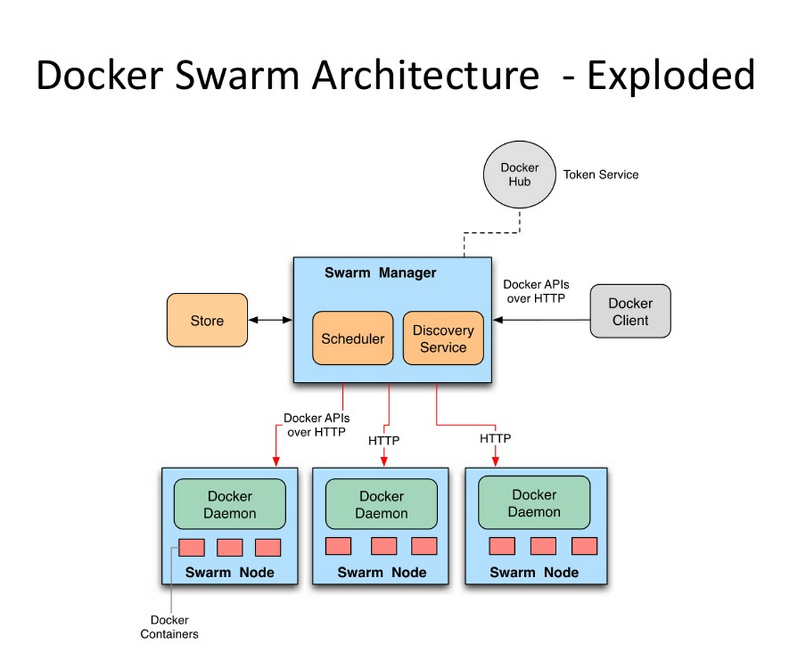

## 2、进阶

### 1、Swarm集群（2manager-3worker）

 In Docker 1.12 and higher;Swarm已经内置了，无需安装

在所有docker主机上，选定一个主节点。运行`docker swarm init --advertise-addr ip地址`，初始化一个manager

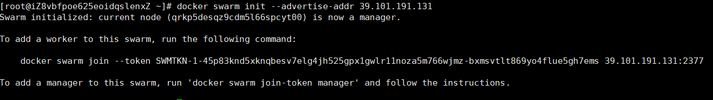

剩下节点使用docker swarm join即可；

在主节点

```shell
docker swarm join-token manager
#可以生成Manager节点的join信息，再选中一个节点，运行命令就可以作为manager加入

docker node ls #查看节点信息
```

### 2、基本概念

```
1.Swarm
集群的管理和编排是使用嵌入docker引擎的SwarmKit，可以在docker初始化时启动swarm模式或者加入已存在的swarm
```

```
2.Node
一个节点是docker引擎集群的一个实例。您还可以将其视为Docker节点。您可以在单个物理计算机或云服务器上运行一个或多个节点，但生产群集部署通常包括分布在多个物理和云计算机上的Docker节点。
要将应用程序部署到swarm，请将服务定义提交给 管理器节点。管理器节点将称为任务的工作单元分派 给工作节点。
Manager节点还执行维护所需群集状态所需的编排和集群管理功能。Manager节点选择单个领导者来执行编排任务。
工作节点接收并执行从管理器节点分派的任务。默认情况下，管理器节点还将服务作为工作节点运行，但您可以将它们配置为仅运行管理器任务并且是仅管理器节点。代理程序在每个工作程序节点上运行，并报告分配给它的任务。工作节点向管理器节点通知其分配的任务的当前状态，以便管理器可以维持每个工作者的期望状态。
```

```
3.Service
一个服务是任务的定义，管理机或工作节点上执行。它是群体系统的中心结构，是用户与群体交互的主要根源。创建服务时，你需要指定要使用的容器镜像。
```

```
4.Task
任务是在docekr容器中执行的命令，Manager节点根据指定数量的任务副本分配任务给worker节点
```

```
------------------------------------------使用方法-------------------------------------
docker swarm：集群管理，子命令有init, ``join``, leave, update。（docker swarm --help查看帮助）
docker service：服务创建，子命令有create, inspect, update, remove, tasks。（docker service--help查看帮助）
docker node：节点管理，子命令有accept, promote, demote, inspect, update, tasks, ``ls``, ``rm``。（docker node --help查看帮助）
```

### 3、Swarm的工作模式

#### 1. Node


#### 2.Service

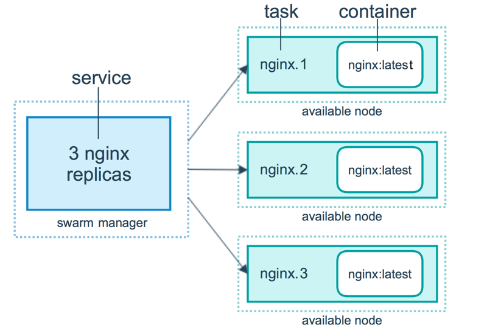

#### 3.任务与调度

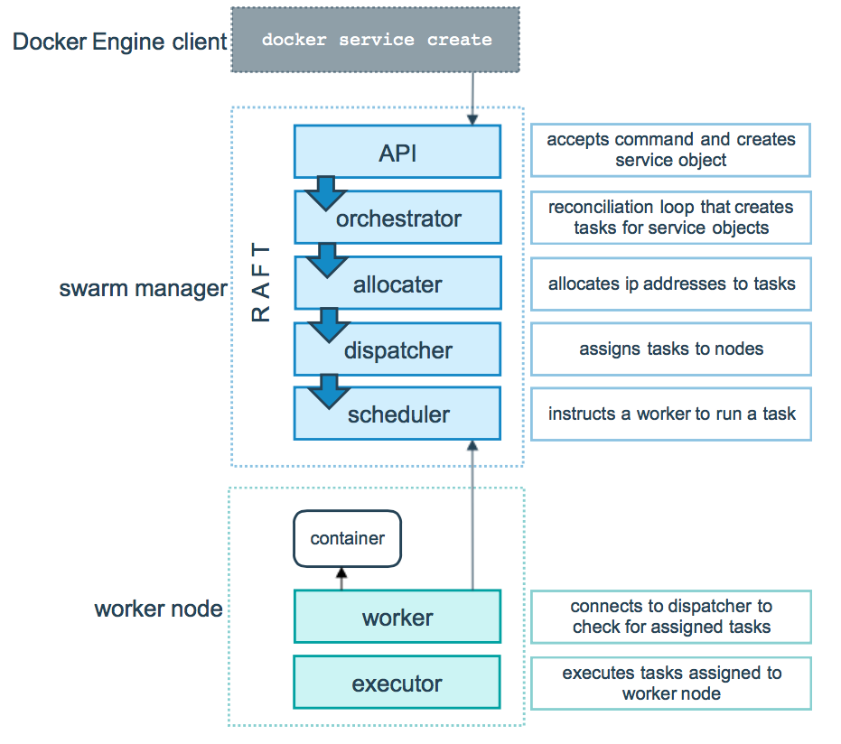

#### 4.服务副本与全局服务

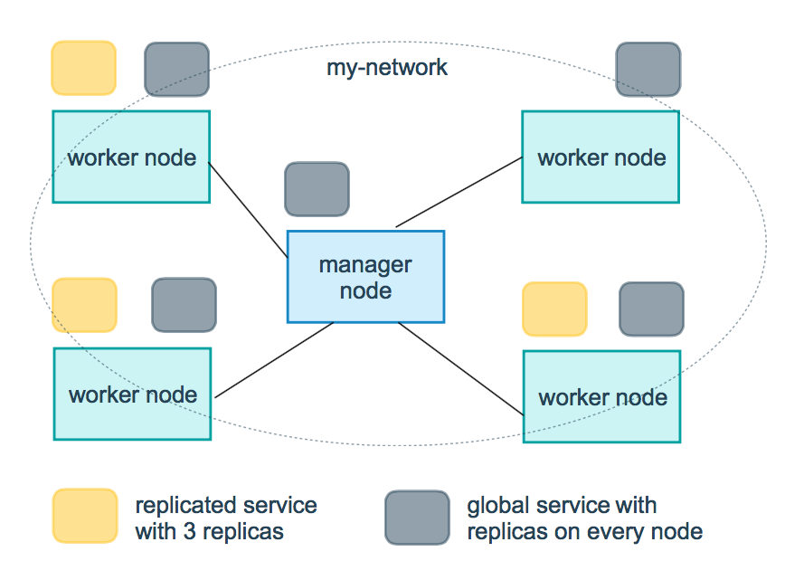

## 3、测试

在Swarm中部署服务(nginx为例)

```shell
#1、可以创建网络
docker network create -d overlay nginx_net
#2、部署service
docker service create --replicas 1 --network nginx_net --name my_nginx -p 80:80 nginx    # 就创建了一个具有一个副本（--replicas 1 ）的nginx服务，使用镜像nginx
docker service ls
docker service inspect --pretty my_nginx
docker service ps my_nginx
#3、扩容
docker service scale my_nginx=4
docker service ps my_nginx
#4、模拟宕机查看效果
systemctl stop docker
docker node ls
docker service ps my_nginx
#5、Swarm 动态缩容服务(scale)
docker service scale my_nginx=1
#6、update扩缩容
docker service update --replicas 3 my_nginx
#7、update镜像升级
docker service update --image nginx:latest my_nginx
#8、服务移除
docker service rm my_nginx
```


