[TOC]

##  目录

- [一、分布式搜索引擎ElasticSearch基础](#一分布式搜索引擎ElasticSearch基础)
  - [1. 什么是分布式搜索引擎,搜索引擎对比选型分析](#1-什么是分布式搜索引擎,搜索引擎对比选型分析)
  - [2. ElastchSearch核心术语学习](#2-ElastchSearch核心术语学习)
  - [3. 什么是倒排索引](#3-什么是倒排索引)
  - [4. ElasticSearch单机部署安装](#4-ElasticSearch单机部署安装)
  - [5. 界面插件ElasticSearch-Head/Kibana使用](#5-界面插件ElasticSearch-Head/Kibana使用)
  - [6. 索引创建的基本操作](#6-索引创建的基本操作)
  - [7. mappings自定义创建设置与analyze](#7-mappings自定义创建设置与analyze)
  - [8. document文档增删改查与乐观锁](#8-document文档增删改查与乐观锁)
  - [9. ES中的分词类型，添加中文分词器](#9-ES中的分词类型，添加中文分词器)
- [二、分布式搜索引擎ElasticSearch查询](#二分布式搜索引擎ElasticSearch查询)
  - [1. Elasticsearch进行基础数据搭建及QueryString查询](#1-Elasticsearch进行基础数据搭建及QueryString查询)
  - [2. Elasticsearch的DSL查询语法](#2-Elasticsearch的DSL查询语法)
  - [3. DSL查询所有数据及分页&文档ID搜索](#3-DSL查询所有数据及分页&文档ID搜索)
  - [4. DSL的term&math&terms匹配查询](#4-DSL的term&math&terms匹配查询)
  - [5. DSL的match相关搜索查询及boost权重设置](#5-DSL的match相关搜索查询及boost权重设置)
  - [6. DSL之布尔查询&为指定语句加权](#6-DSL之布尔查询&为指定语句加权)
  - [7. DSL搜索过滤器&搜索排序&搜索结果高亮](#7-DSL搜索过滤器&搜索排序&搜索结果高亮)
  - [8. 其他DSL查询方式](#8-其他DSL查询方式)
- [三、分布式搜索引擎ElasticSearch分词与分页](#三分布式搜索引擎ElasticSearch分词与分页)
  - [1. ES如何对一个字段同时使用中文和拼音分词器](#1-ES如何对一个字段同时使用中文和拼音分词器)
  - [2. Elasticsearch深度分页问题分析与解决](#2-Elasticsearch深度分页问题分析与解决)
  - [3. Elasticsearch进行批量文档操作](#3-Elasticsearch进行批量文档操作)
  - [4. Elasticsearch集群构建及分片原理分析](#4Elasticsearch集群构建及分片原理分析)
- [四、分布式搜索引擎ElasticSearch分析与优化](#四分布式搜索引擎ElasticSearch分析与优化)
  - [1. Elasticsearch集群脑裂问题分析](#1-Elasticsearch集群脑裂问题分析)
  - [2. Elasticsearch集群中文档读写原理](#2-Elasticsearch集群中文档读写原理)
  - [3. 如何合理设置集群中分片数和副本数](#3-如何合理设置集群中分片数和副本数)
  - [4. ES集群分片容灾的机制](#4-ES集群分片容灾的机制)
  - [5. search template使用](#5-search template使用)
  - [6. field增加分词器update by query](#6-field增加分词器update by query)
  - [7. reindex&index alias功能分析使用](#7-reindex&index alias功能分析使用)
  - [8. 什么是Elasticsearch聚合功能](#8-什么是Elasticsearch聚合功能)
  - [9. 聚合桶实例功能使用和分析](#9-聚合桶实例功能使用和分析)
- [五、分布式搜索引擎ElasticSearch聚合](#五分布式搜索引擎ElasticSearch聚合)
  - [1. ES桶聚合后相关指标分析&text字段聚合方式](#1-ES桶聚合后相关指标分析&text字段聚合方式)
  - [2. 桶range计算](#2-桶range计算)
  - [3. Pipeline聚合计算](#3-Pipeline聚合计算)
  - [4. Springboot整合Elasticsearch进行索引操作](#4-Springboot整合Elasticsearch进行索引操作)
  - [5. Springboot对ES文档进行操作](#5-Springboot对ES文档进行操作)
  - [6. Springboot对ES文档进行分页查询](#6-Springboot对ES文档进行分页查询)
  - [7. Springboot对ES文档实现高亮查询](#7-Springboot对ES文档实现高亮查询)
  - [8. Springboot对ES文档进行数据排序](#8-Springboot对ES文档进行数据排序)
- [六、Logstash数据通道应用](#六Logstash数据通道应用)
  - [1. 通过Logstash将数据从DB同步进ES](#1-通过Logstash将数据从DB同步进ES)
  - [2. 自定义Logstash的mapping模版](#2-自定义Logstash的mapping模版)
  - [3. 整体看一下Elasticsearch都学习了哪些内容](#3-整体看一下Elasticsearch都学习了哪些内容)


# 一、分布式搜索引擎ElasticSearch基础

## 1. 什么是分布式搜索引擎,搜索引擎对比选型分析

### 1.1. 搜索引擎

比如网络爬虫，检索排序，网页处理，大数据技术相关，都要使用到搜索引擎，对于文件信息内容进行检索，通过搜索引擎提供快速，高相关性的信息服务。

### 1.2. 分布式存储与搜索

分布式就是通过多个节点构成的服务，可以横向扩张，所扩展的节点可以进行请求的分摊，以及存储的扩展

### 1.3. Lucene VS solr VS elasticsearch

- Lucene是一个基于Java开发的全文搜索引擎，不是一个应用程序而是一个类库，有很多的API可以调用来实现我们的业务需要，本质上就是一个jar包，本身就不具备分布式、集群、HA等服务特性，如果你要自己通过Luncen实现分布式就比较复杂

- Solr是基于Lucene开发的一个搜索引擎应用，是Apache开源项目，也是Java开发，需要独立部署在tomcat上，可以实现集群和分片，自身不支持集群结构，需要zookeeper来进行集群的支持提供服务注册，进行分布式索引查询，也是可以自己实现故障转移的（3组节点，每组2个solr，互为主从）

  - 最大的问题是建立索引的过程中，索引效率下降的及其严重，实时搜索效率不高
    - 搭建两套solr集群，用集群互相主备，升级A的时候，使用B，A升级完了切换到A再升级B

  - 如果不考虑索引创建的同时，索引更新频率不高的情况下，solr的查询速度是略高于ES
  - 支持添加多种数据格式到引擎中的

- Elasticsearch也是基于lucene的分布式搜索引擎，对外提供了很多restful风格的接口，数据交互使用json格式

  可以支持PB级别的搜索，提供进实时的查询，ELK（Elasticsearch、Logstash、Kibana）早期常用于进行日志分析系统的搭建

**搜索引擎的选型**

- Lucene肯定是要使用到的，但都让solr或者ES给封装了，所以我不直接使用Lucene
- solr和es，肯定选择elasticsearch
- 除了自己搭建服务以外，也可以ES的云服务，目前的云服务都还是v6.x，ES最新的版本v7.6

## 2. ElastchSearch核心术语学习

### 2.1. 术语学习

- 索引index
  - 我们可以和数据库去类比，整个的ES就相当于一个数据库服务
  - 我们数据库中的表就是ES中的index
- 类型type
  - 相当于一个逻辑类型
  - 比如商品的分类：食品、服饰、电子产品
  - ESv7.x以后就不再使用type了，5.x/6.x还有
- 文档document（doc）
  - 相当于一个数据库表里的一行一行的数据
  - 就是索引中一条一条的数据
- 字段field
  - 数据行的某一列
- 映射的mappings
  - 相当于表结构的类型定义
- NRT
  - Near Real Time
  - ES中新的文档被加入后可查询的时间间隔非常微弱，接近实时

- shard
  - 数据分片的概念，需要进行水平扩展服务节点只需要加入新的机器到集群中即可
  - 集群的每个数据节点都是HA的
    - 主分片：承担数据写入的访问的作用
    - replica备份分片：除了做备份以外，还承担了读数据的水平负载作用

- replica：备份分片

### 2.2. type为什么会去掉

1、为什么会有type？

​	 index库-->type表-->doc记录

​	 如果要对记录进行分组，只需要给doc加一个分组的记录field即可，然后使用ES的分组桶来统计

2、因此在7.x完全去掉type的概念了

## 3. 什么是倒排索引

场景概念

我们不使用搜索引擎可不可以？

Redis在查询的时候：key-value？是通过key来找到的value，是否可以通过value来找key？通过value找到和这个value相似度极高的内容？

倒排索引（Inverted Index）：比如通过歌词来查歌名，通过内容检索名称，而这个名称在系统中其实就是一个索引，通过歌来找歌词这是正排索引

比如拿课程学习举例：

文档编号     文档内容

1                 艾编程架构师之路

2     			艾编程Java成长之路（分词：艾编程   Java  成长   之路）      

3				 ES成长学习入门

搜索的分词		这个分词在哪个文档中出现				文档编号:次数:位置

成长     							2,3  												2:1:<3>,3:1:<2>

## 4. ElasticSearch单机部署安装

```shell
# 下载地址
# 官方网站进行下载：https://www.elastic.co/cn/downloads/elasticsearch
# https://artifacts.elastic.co/downloads/elasticsearch/elasticsearch-7.5.2-linux-x86_64.tar.gz

# elasticsearch-7.5.2-linux-x86_64.tar.gz
# ES整体的生态强依赖于ES的主版本，如果要安装logstash、kibana、中文分词器
# 创建两个文件夹 
mkdir /usr/local/elasticsearch/esdata
mkdir /usr/local/elasticsearch/eslogs
# 修改ES config目录下的elasticsearch.yml
vi elasticsearch.yml
cluster.name: icoding-es #给集群设置一个名字，如果是集群，所有在这个集群中的节点集群名都要一样
node.name: es-node-1 #如果是集群，集群中每个节点的名字都不能一样
path.data: /usr/local/elasticsearc/mkdata
path.logs: /usr/local/elasticsearc/mklogs
network.host: 0.0.0.0
http.port: 9200  #服务端口，通信端口是9300
cluster.initial_master_nodes: ["es-node-1"] #master节点服务发现，和上面的节点名一致
```

启动elasticsearch

```shell
# 在bin目录下
# org.elasticsearch.bootstrap.StartupException: java.lang.RuntimeException: can not run elasticsearch as root
# 不能用root启动
adduser esuser
# 给esuser授权 /usr/local/elasticsearch 目录的权限
chown -R esuser:esuser /usr/local/elasticsearch/
su esuser
./elasticsearch
# ERROR: [1] bootstrap checks failed
# [1]: max virtual memory areas vm.max_map_count [65530] is too low, increase to at least [262144]
# 修改一下内容需要root用户
vi /etc/secuirty/limits.conf
* soft nofile 65536
* hard nofile 65536
* soft nproc 2048
* hard nproc 4096
vi /etc/sysctl.conf
vm.max_map_count=262145
sysctl -p
su esuser
./elasticsearch #在线启动
./elasticsearch -d
```

9200：http协议，用于外部通信，提供服务

9300：Tcp协议，ES集群之间及内部服务通信的端口

## 5. 界面插件ElasticSearch-Head/Kibana使用

### 5.1. head安装

```shell
# 需要node 环境
wget xxx #下载编译的压缩包
tar xvf xxx #解压缩
#创建软连接(任意地方都可以使用)
ln -s /usr/local/nodedir/bin/node /usr/local/bin
ln -s /usr/local/nodedir/bin/npm /usr/local/bin
```


elasticsearch-head

GitHub: https://github.com/mobz/elasticsearch-head

```shell
cd elasticsearch-head
npm install --registry=https://registry.npm.taobao.org
npm run start
# 启动后本地访问及端口：http://localhost:9100
```

安装完毕后访问会提升不允许跨域

```shell
# No 'Access-Control-Allow-Origin'
# 在elasticsearch.yaml里加入
http.cors.enabled: true
http.cors.allow-origin: "*"
```

### 5.2. kibana安装

```shell
# 下载地址
https://artifacts.elastic.co/downloads/kibana/kibana-7.5.2-linux-x86_64.tar.gz

vi kibana.yml
server.host: "0.0.0.0"
elasticsearch.hosts: ["http://192.168.0.143:9200"]
# 进入bin目录
# Kibana should not be run as root.  Use --allow-root to continue.
# chown -R esuser:esuser /usr/local/software/kibana-7.5.2-linux-x86_64
# 端口默认是5601
./kibana
nohup ./kibana & #后台启动
```

## 6. 索引创建的基本操作

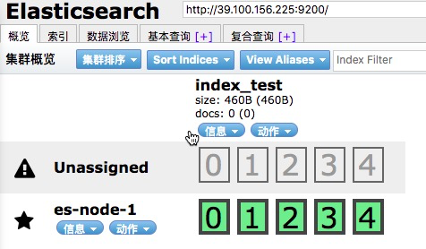

创建了5个分片，每个分片1个备份jiedian

获取集群健康值

```json
GET http://127.0.0.1/_cluster/health

{
  "cluster_name": "icoding-es",
  "status": "green",
  "timed_out": false,
  "number_of_nodes": 1,
  "number_of_data_nodes": 1,
  "active_primary_shards": 1,
  "active_shards": 1,
  "relocating_shards": 0,
  "initializing_shards": 0,
  "unassigned_shards": 0,
  "delayed_unassigned_shards": 0,
  "number_of_pending_tasks": 0,
  "number_of_in_flight_fetch": 0,
  "task_max_waiting_in_queue_millis": 0,
  "active_shards_percent_as_number": 100
}
```

删除索引

```shell
DELETE /index_test
```

创建索引

```json
PUT /index_test1
{
    "settings": {
        "index": {
            "number_of_shards": "3",
            "number_of_replicas": "0"
        }
    }
}
```

查询索引的相关信息

```shell
GET http://39.100.156.225:9200/_cat/indices?v
```

## 7. mappings自定义创建设置与analyze

**mappings自定义创建**

```shell
PUT /index_test2
{
    "settings": {
        "index": {
            "number_of_shards": "3",
            "number_of_replicas": "0"
        }
    },
    "mappings": {
    	"properties": {
    		"username": {
    			"type": "text",
    			"index": true
    		},
    		"password": {
    			"type": "keyword",
    			"index": false
    		}
    	}
    }
}
```

**analyze分词器的使用**

```shell
GET /index_test2/_analyze
{
	"field": "text",
	"text": "icoding is very well!"
}
```

**mappings映射的type的类型都有哪些**

- text，keywork
- long，integer，short，byte
- double，float
- boolean
- date

**字符串**

- text：文字类型，内容需要被分词被倒排索引
- keyword：文字类型，不会被分词，精确匹配，比如qq号，微信号

如果在创建完索引后没有创建mapping，可以后续添加

```shell
POST /index_test3/_mapping
{
    "properties": {
        "username": {
            "type": "text",
            "index": true
        },
        "password": {
            "type": "keyword",
            "index": false
        }
    }
}
```

## 8. document文档增删改查与乐观锁

```shell
# 作为索引来讲，他更关心的是doc，而mapping没有，他会默认方式来添加
POST /index_test3/_doc/2
{
	"id": 1001,
	"name": "icoding-elasticsearch",
	"desc": "艾编程非常不错，很好",
	"create_date": "2020-2-15"
}

# 查询
GET /index_test3/_doc/2

# 删除
DELETE /index_test3/_doc/2

# 更新
POST /index_test3/_doc/1/_update
{
    "doc": {
        "desc": "架构师课程非常不错"
    }
}
```

查询的元数据类型

```shell
"_index": "index_test3", #属于哪个索引
"_type": "_doc", #type类型，7.x固定是_doc
"_id": "1", #文档的唯一标识
"_version": 2, #数据版本
"_seq_no": 1, 
"_primary_term": 1,
"found": true, #是否查询到
_score: #查询的相关度
```

```shell
# 返回需要的数据列
GET /index_test3/_doc/1?_source=name,id
# 查询某个具体值是否存在
HEAD /index_test3/_doc/1
httpcode：200 存在 404不存在
```

**乐观锁**

按照乐观锁的操作，我们应该先拿到版本，写入时再比对一下

```shell
GET /index_test3/_doc/1?version=2
# 通过version来进行处理
```

## 9. ES中的分词类型，添加中文分词器

```shell
POST /_analyze
{
	"analyzer": "standard",
	"text": "Icoding is Very Well 1234 5678"
}
```

分词器类型

- standard：默认分词器，大写转小写，按照空格拆分
- simple：按照非字母分词，大写转小写
- whitespace：按照空格拆分，不进行大小写转换
- stop：按照空格分词，去除无意义单词：a an is
- keyword：不分词

中文分词器：IK分词器

Github：https://github.com/medcl/elasticsearch-analysis-ik/releases/download/v7.5.2/elasticsearch-analysis-ik-7.5.2.zip

```shell
# 下载完解压到elasticsearch的plugin/ik目录下
unzip elasticsearch-analysis-ik-7.5.2.zip -d /usr/local/elasticsearch/elasticsearch-7.5.2/plugins/ik
```

- ik_max_word：最细粒度的分词，会在词上再次拆分
- ik_smart：只拆分一次

```shell
# 自定义词库
cd /{es-root}/plugins/ik/config
vi IKAnalyzer.cfg.xml 
# 修改 <entry key="ext_dict">customer.dic</entry>
# 在同目录下创建customer.dic
# 可以添加自定义词语了
# 加完重启ES
```


# 二、分布式搜索引擎ElasticSearch查询

## 1. Elasticsearch进行基础数据搭建及QueryString查询

### 1.1. 基础数据的准备

- 所有的数据都要在index这个容器下

- 就要录入document，_id:是文档的id，他和你内容数据id是没有关系

- 比如说操作商品数据（product，variants，images，tags）还是以商品id作为业务主键

  ```shell
  /_doc/1/_update #我们不能为这个_id再保存一个关系到数据库，所以一般_id和我们的业务主键一致
  ```

- 比如图片路径不用索引：index:false

- 比如需要精确查询的内容：type:keyword

- 一定要手工创建mapping，设置你需要的**类型**和**分词器**

```shell
POST /index_customer/_mapping
{
    "properties": {
        "id": {
            "type": "long"
        },
        "age": {
            "type": "integer"
        },
        "username": {
            "type": "keyword"
        },
        "nickname": {
            "type": "text",
            "analyzer": "ik_max_word"
        },
        "consume": {
            "type": "float"
        },
        "desc": {
            "type": "text",
            "analyzer": "ik_max_word"
        },
        "sex": {
            "type": "byte"
        },
        "borthday": {
            "type": "date"
        },
        "faceimg": {
            "type": "text",
            "index": false
        }
    }
}

# 回忆一下分词器的概念
POST /index_customer/_analyze
{
	"field": "nickname",
	"text": "今晚路上的车非常通畅，我提前到公司了"
}
```

录入数据

```json
# POST /index_customer/_doc/1001
{
    "id": 1001,
    "age": 24,
    "username": "kingliu",
    "nickname": "飞上天空做太阳",
    "consume": 1289.88,
    "desc": "我在艾编程学习java和vue，学习到了很多知识",
    "sex": 1,
    "birthday": "1996-12-24",
    "faceimg": "https://www.icodingedu.com/img/customers/1001/logo.png"
}
# POST /index_customer/_doc/1002
{
    "id": 1002,
    "age": 26,
    "username": "lucywang",
    "nickname": "夜空中最亮的星",
    "consume": 6699.88,
    "desc": "我在艾编程学习VIP课程，非常打动我",
    "sex": 0,
    "birthday": "1994-02-24",
    "faceimg": "https://www.icodingedu.com/img/customers/1002/logo.png"
}
# POST /index_customer/_doc/1003
{
    "id": 1003,
    "age": 30,
    "username": "kkstar",
    "nickname": "照亮你的星",
    "consume": 7799.66,
    "desc": "老师们授课风格不同，但结果却是异曲同工，讲的很不错，值得推荐",
    "sex": 1,
    "birthday": "1990-12-02",
    "faceimg": "https://www.icodingedu.com/img/customers/1003/logo.png"
}
# POST /index_customer/_doc/1004
{
    "id": 1004,
    "age": 31,
    "username": "alexwang",
    "nickname": "骑着老虎看日出",
    "consume": 9799.66,
    "desc": "课程内容充实，有料，很有吸引力，赞一个",
    "sex": 1,
    "birthday": "1989-05-09",
    "faceimg": "https://www.icodingedu.com/img/customers/1004/logo.png"
}
# POST /index_customer/_doc/1005
{
    "id": 1005,
    "age": 32,
    "username": "jsonzhang",
    "nickname": "我是你的神话",
    "consume": 12789.66,
    "desc": "需要抽时间把所有内容都学个遍，太给力料",
    "sex": 1,
    "birthday": "1988-07-19",
    "faceimg": "https://www.icodingedu.com/img/customers/1005/logo.png"
}
# POST /index_customer/_doc/1006
{
    "id": 1006,
    "age": 27,
    "username": "abbyli",
    "nickname": "好甜的棉花糖",
    "consume": 10789.86,
    "desc": "还不错，内容超过我的预期值，钱花的值",
    "sex": 0,
    "birthday": "1993-10-11",
    "faceimg": "https://www.icodingedu.com/img/customers/1006/logo.png"
}
# POST /index_customer/_doc/1007
{
    "id": 1007,
    "age": 33,
    "username": "jacktian",
    "nickname": "船长jack",
    "consume": 9789.86,
    "desc": "一直想抽时间学习，这下有时间整了，给力",
    "sex": 1,
    "birthday": "1987-09-16",
    "faceimg": "https://www.icodingedu.com/img/customers/1007/logo.png"
}
# POST /index_customer/_doc/1008
{
    "id": 1008,
    "age": 23,
    "username": "feifei",
    "nickname": "我爱篮球",
    "consume": 6689.86,
    "desc": "虽然又一些不太懂，但只要有时间，相信一定能学好的",
    "sex": 1,
    "birthday": "1997-04-18",
    "faceimg": "https://www.icodingedu.com/img/customers/1008/logo.png"
}
# POST /index_customer/_doc/1009
{
    "id": 1009,
    "age": 25,
    "username": "daisyzhang",
    "nickname": "一起看日出",
    "consume": 6680,
    "desc": "学习起来还是很有意思的，值得我多次学习",
    "sex": 0,
    "birthday": "1995-03-27",
    "faceimg": "https://www.icodingedu.com/img/customers/1009/logo.png"
}
# POST /index_customer/_doc/1010
{
    "id": 1010,
    "age": 29,
    "username": "ethenhe",
    "nickname": "旋风小子",
    "consume": 6699.99,
    "desc": "课程严谨，知识丰富，讲解到位，编程给力",
    "sex": 1,
    "birthday": "1991-06-22",
    "faceimg": "https://www.icodingedu.com/img/customers/1010/logo.png"
}
# POST /index_customer/_doc/1011
{
    "id": 1011,
    "age": 27,
    "username": "lydiazheng",
    "nickname": "跳芭蕾的小妮",
    "consume": 8899.99,
    "desc": "自己一直都没有动力去系统学习，这次有了老师和大家的督促，非常不错，终于坚持下来了",
    "sex": 0,
    "birthday": "1993-08-27",
    "faceimg": "https://www.icodingedu.com/img/customers/1011/logo.png"
}
# POST /index_customer/_doc/1012
{
    "id": 1012,
    "age": 37,
    "username": "draglong",
    "nickname": "飞龙在天",
    "consume": 18899.99,
    "desc": "技术宅，就喜欢研究技术，和大家碰撞感觉很好",
    "sex": 1,
    "birthday": "1983-11-22",
    "faceimg": "https://www.icodingedu.com/img/customers/1012/logo.png"
}
```

**QueryString的查询方式**

```shell
/index_customer/_search?q=desc:艾编程&q=age:24
```

## 2. Elasticsearch的DSL查询语法

QueryString实际业务中使用非常少，一旦需要复杂的查询条件，就需要DSL来进行查询

- Domain Specific Language
- 特定领域的语言
- 内容是基于json
- 查询灵活方便，有利于复杂查询

```json
POST /index_customer/_doc/_search
{
    "query": {
        "match": {
            "desc": "艾编程"
        }
    }
}
POST /index_customer/_doc/_search #判断字段是否存在，如果存在将字段相关的所有数据展示
{
    "query": {
        "exists": {
            "field": "desc"
        }
    }
}
```

## 3. DSL查询所有数据及分页&文档ID搜索

```json
# 查询所有数据并进行filter过滤
POST /index_customer/_doc/_search
{
	"query": {
		"match_all":{}
	},
	"_source": ["id","nickname","age"]
}
# 分页 from从第几个开始，0开始节点
POST /index_customer/_doc/_search
{
	"query": {
		"match_all":{}
	},
	"_source": ["id","nickname","age"],
  "from": 0,
  "size": 5
}
```

**DSL进行文档ID的精确搜索**

```json
GET /index_customer/_doc/1001
GET /index_customer/_doc/1002?_source=id,nickname,age
# 我们要通过DSL一次查询出多个ID
POST /index_customer/_search
{
	"query":{
		"ids": {
			"type": "_doc",
			"values": ["1001","1010","1012"]
		}
	},
	"_source": ["id","username","nickname","desc"]
}
```

## 4. DSL的term&math&terms匹配查询

```json
# term查询,将条件里的词不进行分词来查询
POST /index_customer/_search
{
	"query":{
		"term": {
			"desc": "艾编程"
		}
	}
}

# match查询,将条件里的词使用这个field的分词器进行分词后和field里的分词逐一匹配
POST /index_customer/_search
{
	"query":{
		"match": {
			"desc": "艾编程"
		}
	}
}

# terms查询,将条件里的词不进行分词来查询,但可以设置多个
POST /index_customer/_search
{
	"query":{
		"terms": {
			"desc": ["艾编程","编程"]
		}
	}
}
```

## 5. DSL的match相关搜索查询及boost权重设置

### 5.1. math_phrase

match对查询条件分词后只要有匹配，哪怕是一个词，也会返回

math_phrase：分词结果必须都包含，并且是相邻（搜索比较严格）

如果有这么一篇文章

```shell
# springboot elasticsearch dsl
1、springboot 安装使用
2、elasticsearch 安装使用
3、es的DSL查询使用
# 其实你心里的想法是springboot下如何操作elasticsearch进行DSL查询
```

**短语匹配**

```json
# query里的词必须都匹配，而且还要相邻
# slop: 允许词语间跳过的数量，默认可以不写，不写是挨着的没有跳数
{
    "query": {
        "match_phrase": {
            "desc": {
                "query": "艾编程 知识",
                "slop": 9
            }
        }
    }
}
```

### 5.2. mach扩展：operator

- or：搜索的分词内容，只要有一个词语匹配就展示
- and：搜索的分词内容必须全部匹配

```json
POST /index_customer/_search
{
    "query": {
        "match": {
        	"desc": {
        		"query": "我在艾编程",
        		"operator": "and"
        	}
        }
    }
}
# or就是常规match查询
{
	"query":{
		"match": {
			"desc": "艾编程"
		}
	}
}
```

### 5.3. mach扩展：minimum_should_match

minimum_should_match：最低匹配精度，配置有两种，一种是占比：60%，只要有任意 6个词就展示出结果 6/10个分词=60%，还有一种绝对值：可以直接写数字：6，至少要6个词都匹配

```json
POST /index_customer/_search
{
    "query": {
        "match": {
        	"desc": {
        		"query": "我在艾编程学习",
        		"minimum_should_match": "40%"
        	}
        }
    }
}
```

### 5.4. multi_match

```json
POST /index_customer/_search
{
    "query": {
        "multi_match": {
            "query": "我在艾编程学习神话",
            "fields": [
                "desc",
                "nickname"
            ]
        }
    }
}
```

### 5.5. 修改默认的排序权重

权重，为某个字段设置查询权重，权重越高，文档相关性越高_score越高，查询结果约靠前

```json
# "nickname^10" 代表在这个列上如果查询到数据，就会将相关性放大10倍
POST /index_customer/_search
{
    "query": {
        "multi_match": {
            "query": "我在艾编程学习神话",
            "fields": [
                "desc",
                "nickname^10"
            ]
        }
    }
}
```

## 6. DSL之布尔查询&为指定语句加权

布尔查询就是bool，其实就是多条件组合查询，可以在不同列上进行

- must：查询必须匹配所有搜索条件，类似and
- should：查询只要匹配一个搜索条件即可，类似or
- must_not：不匹配搜索条件的内容，一个都不要满足，类似not

 这里要注意的点

```shell
# must、should、must_not虽然语法可以并列
# must和should同时写，只有must生效
# must和must_not同时写，会在must符合后进行must_not条件剔除
```

业务场景描述：

desc里有：日出，并且username是jacktian或nickname里有学习的数据

```json
# 解决方案一
{
    "query": {
        "bool": {
            "must": [
                {
                    "match": {
                        "desc": "学习"
                    }
                }
            ],
            "should": [
                {
                    "match": {
                        "nickname": "日出"
                    }
                },
                {
                    "term": {
                        "username": "jacktian"
                    }
                }
            ],
            "minimum_should_match": 1
        }
    }
}
# 方案二
# desc='学习' and (nickname='日出' or username='jacktian')
{
    "query": {
        "bool": {
            "must": [
                {
                    "match": {
                        "desc": "学习"
                    }
                },
                {
                    "bool": {
                        "should": [
                            {
                                "match": {
                                    "nickname": "日出"
                                }
                            },
                            {
                                "term": {
                                    "username": "jacktian"
                                }
                            }
                        ]
                    }
                }
            ]
        }
    }
}
# 方案三
# (desc='学习' and nickname='日出') or (desc='学习' and username='jacktian')
{
    "query": {
        "bool": {
            "should": [
                {
                    "bool": {
                        "must": [
                            {
                                "match": {
                                    "nickname": { 
                                    	"query": "日出",
                                    	"boost": 10
                                    }
                                }
                            },
                            {
                                "match": {
                                    "desc": "学习"
                                }
                            }
                        ]
                    }
                },
                {
                    "bool": {
                        "must": [
                            {
                                "match": {
                                    "desc": "学习"
                                }
                            },
                            {
                                "term": {
                                    "username": "jacktian"
                                }
                            }
                        ]
                    }
                }
            ]
        }
    }
}
# "boost": 10 就是给字段增加权重的方式
```

## 7. DSL搜索过滤器&搜索排序&搜索结果高亮

- query：是根据用户搜索条件检索匹配记录
- post_filter：用于查询后，对结果数据进行筛选

```json
# gte : 大于等于
# lte : 小于等于
# gt  : 大于
# lt  : 小于
POST /index_customer/_search
{
    "query": {
        "match": {
            "desc": "我在艾编程学习"
        }
    },
    "post_filter": {
        "range": {
            "consume": {
                "gt": 10000,
                "lt": 20000
            }
        }
    }
}

# 过滤也可以在query的结果基础上再做其他field的分词
POST /index_customer/_search
{
    "query": {
        "match": {
            "desc": "我在艾编程学习"
        }
    },
    "post_filter": {
        "match": {
            "nickname": "太阳"
        }
    }
}
```

**排序**

```shell
POST /index_customer/_search
{
    "query": {
        "match": {
            "desc": "我在艾编程学习"
        }
    },
    "sort": [
        {
            "consume": "desc"
        },
        {
            "age": "asc"
        }
    ]
}
# 注意：sort是不能给text排序，但可以给keyword排序，因为text会做分词所以无法给多个分词进行排序，keyword不会分词所以可以
# 一般也不会给文本类型进行排序，doc默认排序规格是按照：文档搜索的相关度打分_score，按照分数降序
# 权重是影响_score分数的因子
```

**结果高亮显现**

```json
# 高亮其实就是把我们搜索匹配到的关键字进行颜色突出显示，html<span></span>
POST /index_customer/_search
{
    "query": {
        "match": {
            "desc": "我在艾编程学习"
        }
    },
    "highlight": {
        "pre_tags": [
            "<span>"
        ],
        "post_tags": [
            "</span>"
        ],
        "fields": {
                "desc": {}
        }
    }
}
```

## 8. 其他DSL查询方式

```shell
# prefix : 根据前缀去查询
# fuzzy : 搜索引擎自动纠错的功能，icodinng.com 把帮我们纠错成icoding.com
# wildcard : 占位符查询
	? : 1个字符
	* : N个字符
{
    "query": {
        "wildcard": {
            "desc": "?艾编程*"
        }
    }
}
```


# 三、分布式搜索引擎ElasticSearch分词与分页

## 1. ES如何对一个字段同时使用中文和拼音分词器

- 拼音分词器
- ik中文分词

```json
# 下载拼音分词器
# elasticsearch-analysis-pinyin-7.5.2.zip
# Github: elasticsearch-analysis-pinyin
wget https://github.com/medcl/elasticsearch-analysis-ik/releases/download/v7.5.2/elasticsearch-analysis-ik-7.5.2.zip

unzip elasticsearch-analysis-pinyin-7.5.2.zip -d /usr/local/elasticsearch/elasticsearch-7.5.2/plugins/pinyin

GET /_analyze
{
	"text":"艾编程",
	"analyzer":"pinyin"
}
# 需求场景：我们需要对一个字段既可以进行中文搜索，也可以进行拼音搜索
# index的常规设置mapping
# 一个字段可以给自己设置子字段来增加新的type和分词器
POST /index_customer/_doc/_mapping
{
    "properties": {
        "id": {
            "type": "long"
        },
        "age": {
            "type": "integer"
        },
        "username": {
            "type": "keyword"
        },
        "nickname": {
            "type": "text",
            "analyzer": "ik_max_word",
          	"fields": {
              "pinyin": {
                "type": "text",
                "analyzer": "pinyin"
              },
              "keyword":{
                "type":"keyword",
                "ignore_above": 256
              }
            }
        },
        "consume": {
            "type": "float"
        },
        "desc": {
            "type": "text",
            "analyzer": "ik_max_word"
        },
        "sex": {
            "type": "byte"
        },
        "birthday": {
            "type": "date"
        },
      	"city": {
          	"type": "keyword"
        },
        "faceimg": {
            "type": "text",
            "index": false
        }
    }
}
# 搜索的时候同时支持中文，拼音
GET /index_customer/_search
{
	"query":{
		"multi_match":{
			"query": "chuanzhang",
			"fields":["nickname","nickname.pinyin"]
		}
	}
}
# 在前端调用声明分词器
GET /index_customer/_search
{
    "query": {
        "match": {
            "nickname": {
                "query": "太阳",
                "analyzer": "ik_max_word"
            }
        }
    }
}
```

看elasticsearch里安装成功的插件

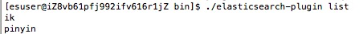

## 2. Elasticsearch深度分页问题分析与解决

### 2.1. 什么是深度分页

深度分页就是我们搜索的深浅度，比如第1页，第2页，第100页都是比较浅的，如果第1w页，第2w页这就比较深。

先看一下MySQL

```sql
select * from im_order limit 100000,30;
```

这样就会非常慢，这就涉及深度分页，就会比较慢

慢的原因是什么：MySQL的limit m,n的工作原理是先读取符合where条件的m+n的记录，要把这些数据全拿到内存中，然后抛弃前m条，返回后面的n条，所以m越大，偏移量就越大，性能就越差，大部分ORM框架都是如此

```sql
select * from im_order where id>100000 limit 30;
```

但前提是：

- 主键id一定要连续，否则数据就会出现不连贯的情况
- 不好进行总页数的计算了，只能进行上一页和下一页的操作了
- 进行这样的优化，需要记住上次的点位

解决方案

上一页 1 2 3 4 5 6 7 8 9 10 下一页

### 2.2. Elasticsearch中深度分页的问题如何处理

```json
GET /index_customer/_search
{
    "query": {
        "match_all": {}
    },
    "from":0,
    "size":12
}
GET /index_customer/_search
{
    "query": {
        "match_all": {}
    },
    "from":9999,
    "size":10
}
# Result window is too large, from + size must be less than or equal to: [10000] but was [10009]. See the scroll api for a more efficient way to request large data sets. This limit can be set by changing the [index.max_result_window] index level setting.
```

**elasticsearch默认也不允许你查询10000条以后的数据**

- ES中每个分片存储不同的数据，所有分片总和是这个集群的完整数据
- 去每个分片上都要拿10009条，然后集合在一起，如果3个分片：3*10009条数据，针对30027进行排序_score，最终取到你想要的10条
- 因此ES默认不支持10000条以上的查询

如果恰巧你的数据就只有12000条

```json
# 先看下这个属性
GET /index_customer/_settings
# 修改深度
PUT /index_customer/_settings
{
	"index.max_result_window": "20000"
}
# 注意，这种方式救急可以，但不要拿来常用，这是缓兵之计
```

### 2.3. 滚动搜索scroll

介绍一个滚动搜索

- scroll可以先查询出一些数据，然后依次往下查询
- 在第一次查询的时候会有一个滚动id，这个id就是一个锚标记，每次都需要记录和使用这个锚标记
- 每次搜索都是基于历史的数据快照，查询数据期间，如果数据有变更，快照数据不变

如何使用

```json
# 这个m就是滚动查询的上下文时间，m是分钟的意思
# 这是第一次查询，第一次查询需要设置偏移量：size就是页容量
POST /index_customer/_search?scroll=1m
{
    "query": {
        "match_all": {}
    },
	"sort": ["_doc"],
	"size": 3
}
```

第二次，第三次

```json
# 第二次第三次滚动需要将每次返回的_scroll_id填入当次
# 滚动过程不用写查询条件了
# 不要写index名，直接写_search
# 1m是滚动数据的过期时间，每次都要设置，单位是m分钟
POST /_search/scroll
{
	"scroll": "1m",
	"scroll_id": "DXF1ZXJ5QW5kRmV0Y2gBAAAAAAAAABcWc2d3clU2QzRSMXFvVjIySHdzZmgzUQ=="
}
```

**如果请求指定了聚合数据（aggregation），仅第一次数据才会包含聚合结果**

## 3. Elasticsearch进行批量文档操作

### 3.1. 批量查询doc

```json
# 只查一个
GET /index_customer/_doc/1001
# 通过DSL可以进行批量查询
POST /index_customer/_search
{
	"query":{
		"ids":{
			"type":"_doc",
			"values":["1001","1009","1010"]
		}
	},
	"_source":["id","username","nickname","desc"]
}
```

使用_mget来进行查询

```json
POST /index_customer/_doc/_mget
{
    "ids": ["1001","1009","1010"]
}
```

### 3.2. 批量操作bulk

**基本语法**

```json
{ action: { metadata}}\n
{ request body       }\n
{ action: { metadata}}\n
{ request body       }\n
{ action: { metadata}}\n
{ request body       }\n
...
```

- { action: { metadata}}：代表批量操作的类型，可以新增，删除，修改
- \n：每行必须是回车换行，不要用json解析器来格式
- { request body       }：就是你的具体doc数据

**批量操作的类型**

action必须是以下选项之一

- create：文档不存在则创建，存在则报错，但发生异常不会影响其他行的数据导入
- index：文档不存在则创建，存在则覆盖
- update：部分更新一个文档
- delete：批量删除

### 3.3. create/index操作

```json
# 不用加索引名，直接在路径里写_bulk
POST /_bulk
{"create":{"_index":"index_customer","_type":"_doc","_id":"1013"}}
{"id":1013,"age":30,"username":"wangge","nickname":"大哥就是棒","consume":16899.99,"desc":"就喜欢研究技术，非常喜欢和大家交流","sex":1,"birthday":"1990-10-22","city":"杭州","faceimg":"https://www.icodingedu.com/img/customers/1013/logo.png"}
{"create":{"_index":"index_customer","_type":"_doc","_id":"1014"}}
{"id":1014,"age":28,"username":"lichangming","nickname":"永远光明","consume":14899.99,"desc":"非常喜欢和大家交流Java技术和架构心得","sex":1,"birthday":"1992-09-22","city":"北京","faceimg":"https://www.icodingedu.com/img/customers/1014/logo.png"}

# 注意最后一行也必须有回车

POST /_bulk
{"index":{"_index":"index_customer","_type":"_doc","_id":"1013"}}
{"id":1013,"age":30,"username":"wangge","nickname":"大哥就是棒","consume":16899.99,"desc":"就喜欢研究技术，非常喜欢和大家交流","sex":1,"birthday":"1990-10-22","city":"杭州","faceimg":"https://www.icodingedu.com/img/customers/1013/logo.png"}
{"index":{"_index":"index_customer","_type":"_doc","_id":"1014"}}
{"id":1014,"age":28,"username":"lichangming","nickname":"永远光明","consume":14899.99,"desc":"非常喜欢和大家交流Java技术和架构心得","sex":1,"birthday":"1992-09-22","city":"北京","faceimg":"https://www.icodingedu.com/img/customers/1014/logo.png"}

```

也可以在index资源路径下来进行操作

```json
POST /index_customer/_doc/_bulk
{"index":{"_id":"1013"}}
{"id":1013,"age":30,"username":"wangge","nickname":"大哥就是棒","consume":16899.99,"desc":"就喜欢研究技术，非常喜欢和大家交流","sex":1,"birthday":"1990-10-22","city":"杭州","faceimg":"https://www.icodingedu.com/img/customers/1013/logo.png"}
{"index":{"_id":"1014"}}
{"id":1014,"age":28,"username":"lichangming","nickname":"永远光明","consume":14899.99,"desc":"非常喜欢和大家交流Java技术和架构心得","sex":1,"birthday":"1992-09-22","city":"北京","faceimg":"https://www.icodingedu.com/img/customers/1014/logo.png"}

```

### 3.4. update/delete操作

批量更新

```json
POST /index_customer/_doc/_bulk
{"update":{"_id":"1013"}}
{"doc":{"nickname":"一只花骨朵"}}
{"update":{"_id":"1014"}}
{"doc":{"desc":"对架构师课程感兴趣，所以报名艾编程学习"}}

```

批量删除

```json
POST /index_customer/_doc/_bulk
{"delete":{"_id":"1013"}}
{"delete":{"_id":"1014"}}

```

**所有批量的操作：create、index、update、delete都可以放在一起执行**

需要注意的点

- 由于批量操作是加载到内存中的，如果值比较多，会比较慢
- 所有操作在一起只需符合语法规则，内容可以多样

## 4. Elasticsearch集群构建及分片原理分析 ##

分布式搜索引擎，如果是单机，那既不能HA，也不能实现分布式

- HA
- 海量数据的水平扩展
- 高并发访问

**分片机制**

- 通俗来讲就是一个放数据的盒子

- 每个索引都会被分片
- 创建索引的时候会要求制定主分片和副本分片的数量

**分片的逻辑**

- 副本分片不允许和主分片在同一个机器上
- 主分片挂了，还有副本分片来进行数据访问
- 所以单机的时候，副本分片不会制定机器

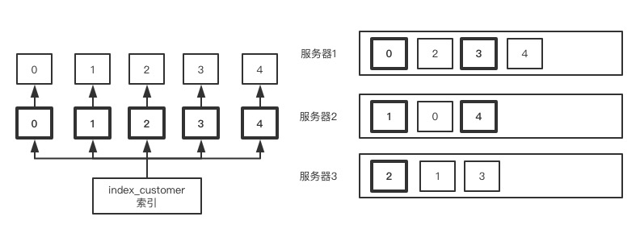

### 4.1. ES集群搭建

在elasticsearch.yml里进行配置

```shell
# elasticsearch.ymk
# 是我们的集群名称，每个集群的机器如果要加入同一个集群，这个名字必须一样
cluster.name: icoding-es
# 节点名，这个必须都不一样
node.name: es-node-1
# 存储路径
path.data: /usr/local/elasticsearch/esdata
path.logs: /usr/local/elasticsearch/eslogs
http.port:9200
# 主节点，设置后在主节点挂掉后有机会升级为master
node.master: true
# 数据节点
node.data: true
# 可以配置ip和域名，配置后ES会通过9300-9305的端口进行数据连接
discovery.seed_hosts: ["192.168.0.146", "192.168.0.147", "192.168.0.148"]
# 集群初始化设置的master节点
cluster.initial_master_nodes: ["es-node-1"]
```

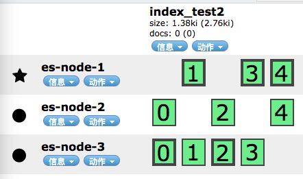

星：代表主节点

圆圈：代表从节点

```yml
 # 问题，，如果是不同云服务器会出现不能访问的问题
 # 解决方案：
 	# 在elasticsearch.yml 里面配置本机IP
network.publish_host: localhost
```


### 4.2. ES集群节点宕机测试

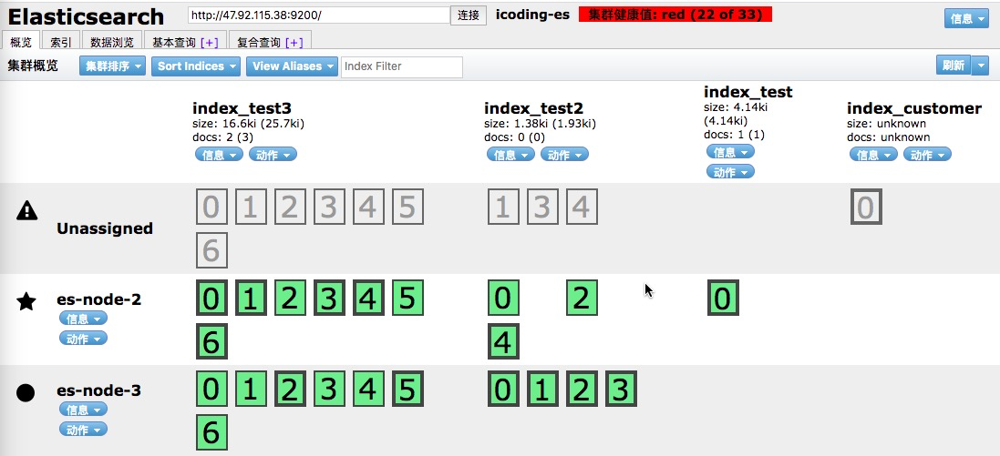


# 四、分布式搜索引擎ElasticSearch分析与优化

## 1. Elasticsearch集群脑裂问题分析

集群中有一个master节点：相当于一个管理节点

Node：elasticsearch的服务节点，安装ES的机器（主，从）

Index：是我们数据的一个逻辑集合，他拥有数据的结构，以及提前做好的分词内容，主要用来搜索的的对象

Shard：物理分片，进行数据的实际物理存储和管理的地方（主分片数不能修改，但副本分片可以增加）


当原来的Master因为网络问题无法和其他slave链接，就出现了其他slave选举出新的master的情况

- 只要最小投票人数1个就能把节点投为master
- 由于和其他节点连接不上，这个节点就把自己投成master

脑裂的解决方案

master主节点应该要经过多个有资格成为master（node.master=true）的节点选举后才能成为新的节点，不是你一个人自己选自己就能决定

- discovery.zen.minimum_master_nodes=(N/2)+1
  - N就是有资格成为master的节点数
  - 这个值默认是1
  - 在ES7.x以前是这样的
- 在ES7.x版本中，这个参数已经被移除了，这块的内容完全由ES自身做管理，避免了多个脑裂的情况，选举也非常快

## 2. Elasticsearch集群中文档读写原理

### 2.1. 文档的写原理

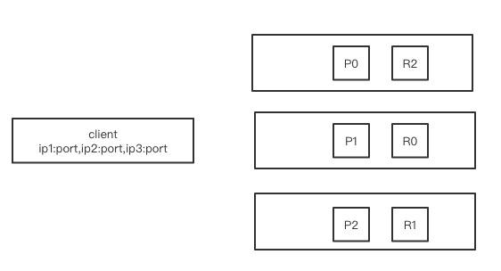

- 客户端连接的时候，首先要连接一个协调节点controller node
- 协调节点会根据客户端写入的数据来hash判断是写入P0还是P1，P2，只要主分片才能写入数据
- 如果hash后写入到P2分片，会由协调节点来路由转发数据到P2分片
- P2分片数据写入完成后会同步到R2备份分片，会将完成写入的响应返回到协调节点
- 协调节点收到完成操作后返回给客户端，完成了这次写入的操作了
- 客户端每次连接的协调节点controller node可能会变

### 2.2. 文档的读原理

- 客户端读请求会先选择一个协调节点
- 由协调节点根据数据的请求hash得知是放在哪个分片上的
- 由于数据在主从分片上都有，并且数据一模一样，读取操作在主从上是采用轮询的方式
- 因此副本分片多了后会提升分片的负载能力
- 数据查询完毕后返回给协调节点，协调节点返回客户端

## 3. 如何合理设置集群中分片数和副本数

**当你在Elasticsearch中将index的分片设置好后，主分片数量在集群中是不能进行修改的，即便是你发现主分片数量不合理也无法调整，那怎么办？**

- 分配分片时主要要考虑的问题
  - 数据集的增长趋势
  - 很多用户认为提前放大分配好分片的量就能确保以后不会出现新的问题，比如分1000个分片
- 要知道分配的每个分片都是由额外的成本的
  - 每个分片其实都是要存数据的，并且都是一个lucene的索引，会消耗文件句柄已经CPU和内存资源
  - 当你进行数据访问时，我们的index就会去到所有的分片上去取数据
  - 如果要取100条，如果你有100个分片，就会从100个分片上各取出100个数据然后进行排序给出最终的排序结果，取了100*100条数据
- 主分片数据到底多少为宜呢？
  - 根据你的节点数来进行分片，3个Node，N*(1.5-3)
  - 我们现在3个节点，主分片数据：5-9个分片

**总结**

- 分片是有相依消耗的，并且持续投入
- 当index拥有多个分片时，ES会查询所有分片然后进行数据合并排序
- 分片数量建议：node*(1.5-3)

```json
# 创建索引过程中进行分片设置
PUT /index_test
{
    "settings": {
        "number_of_shards": 5,
        "number_of_replicas": 1
    }
}
# 修改副本分片数量
# 副本分片如果过多在写入的时候会消耗更多时间来复制数据
PUT /index_test/_settings
{
    "number_of_replicas": 2
}
```

## 4. ES集群分片容灾的机制

集群所有Node都启动的状态

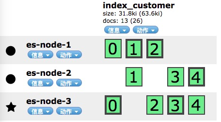

我要kill掉es-node-1，es-node-2和es-node-3上的副本分片就升级为主分片

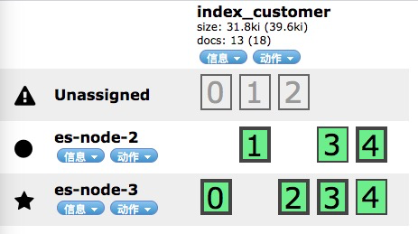

过了一会，刚升级的主分片复制出副本分片

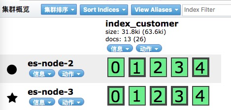

启动刚刚kill掉的es-node-1，数据还没有复制过来

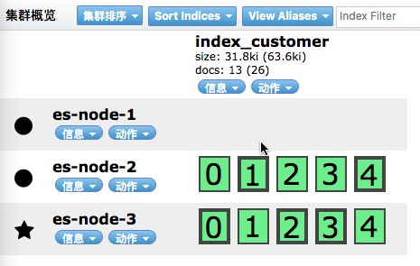

过了一会数据进行了移动，通过9300内部通信端口进行数据的传输的

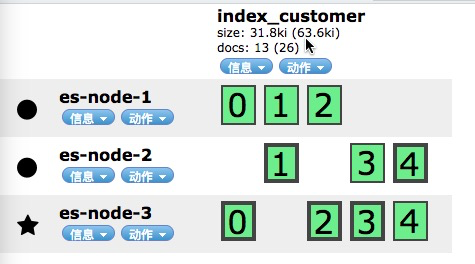

## 5. search template使用

什么是查询模版？

对于ES来说，你可以把它理解为一个NoSQL的容器，应用来访问和调用的过程，对于搜索引擎来讲，你的所有业务搜索场景是不是都是相对明确的？

能不能做到ES的业务处理，由ES来做，前端不关心ES的json的语法格式来做到搜索引擎和前端解耦

```json
# 模版结构可以应用到所有的索引上
# 所以创建的时候不加索引,tpnick是模版名，可以自定义
POST /_scripts/tpnick
{
    "script": {
        "lang": "mustache",
        "source": {
            "query": {
                "match": {
                    "nickname": {
                        "query": "{{nick_value}}",
                        "analyzer": "{{nick_analyzer}}"
                    }
                }
            }
        }
    }
}
# 获得模版
GET /_scripts/tpnick
# 删除模版
DELETE /_scripts/tpnick
# 调用模版进行查询
GET /index_customer/_search/template
{
    "id": "tpnick",
    "params": {
        "nick_value": "太阳",
        "nick_analyzer": "ik_max_word"
    }
}
```

## 6. field增加分词器update by query

```json
# 场景1: 一个field在使用了一段时间后，发现需要增加新的分词器，比如原来是中文，后面要加pinyin
POST /index_customer/_mapping
{
    "properties": {
        "nickname": {
            "type": "text",
            "analyzer": "ik_max_word",
            "fields": {
                "pinyin": {
                    "type": "text",
                    "analyzer": "pinyin"
                }
            }
        }
    }
}
# 添加分词器后就进行搜索，是搜不到数据的
# 分词器在数据加入后增加的，对前面的数据无法进行分词搜索
GET /index_customer/_search
{
    "query": {
        "match": {
            "nickname.pinyin": "taiyang"
        }
    }
}
# 就要对现有index进行自更新
POST /index_customer/_update_by_query
# 场景2:中文分词器里面，会在数据已经导入后加入新的分词，这个时候这个分词就搜不到以前的数据
# 不是ik分词器的问题，是因为你没有更新索引

# 这里需要注意的点
# ES索引中的数据，是在导入是就进行了分词，而不是在查询的时候才进行分词
```

## 7. reindex&index alias功能分析使用

### 7.1. reindex

场景描述**

- 我们一个index在创建好mapping后不能对type进行修改，原来是keyword我想改成text？
- 比如我们的存储不够了，加入了新的机器进入集群，主分片我想增加怎么办？

```json
# 这个时候就需要使用reindex
# 相当于索引复制的概念
# 如果你的新索引没有手工创建mapping，那么ES会根据数据来自动生成mapping
POST /_reindex
{
    "source": {
        "index": "index_customer"
    },
    "dest": {
        "index": "index_test"
    }
}
# 如果新的index里本来就有数据，希望设定为没有才写，有的话版本冲突
POST /_reindex
{
    "source": {
        "index": "index_customer"
    },
    "dest": {
        "index": "index_test",
      	"op_type": "create"
    }
}
# 如果跨集群进行索引复制
# 将索引从集群A复制到集群B，这个要在B集群上执行
# 要给soure设置白名单，在B集群的elasticsearch.yml文件里
# reindex.remote.whitelist: "192.168.0.100:9200,192.168.0.101:9200"
POST /_reindex
{
    "source": {
        "remote": {
            "host": "http://192.168.0.100:9200"
        },
        "index": "index_customer",
        "query": {
            "match": {
                "desc": "艾编程"
            }
        },
        "size": 100
    },
    "dest": {
        "index": "index_test1",
        "op_type": "create"
    }
}

# reindex还可以支持异步操作
POST /_reindex?wait_for_completion=false
# 会返回一个taskId
```

### 7.2. index alias

**场景描述**

- 如果在ES中会横向以时间为维度创建很多索引，比如index_0201,index_0202
- 这个时候前端应用不能因为ES名字改了就修改索引名，这个时候就可以通过别名来统一
- 一个别名节点可以关联多个索引
- 别名也不能和现有索引重复，如果别名重复，数据就合并到一起了

```json
# 添加别名
POST /_aliases
{
    "actions": [
        {
            "add": {
                "index": "index_customer",
                "alias": "index_user",
              	"filter": {
                  	"range": {
                      	"consume": {
                          	"gte": 2000
                        }
                    }
                }
            }
        }
    ]
}
# 同时创建多个别名,相当于做个了一个逻辑合并，可以支持分词和相关搜索
{
    "actions": [
        {
            "add": {
                "index": "index_test",
                "alias": "index_user"
            }
        },
        {
            "add": {
                "index": "index_test1",
                "alias": "index_user"
            }
        }
    ]
}
# 删除别名
{
    "actions": [
        {
            "remove": {
                "index": "index_test",
                "alias": "index_user"
            }
        },
        {
            "remove": {
                "index": "index_test1",
                "alias": "index_user"
            }
        }
    ]
}
```

## 8. 什么是Elasticsearch聚合功能

类型数据的分组，ES中聚合是对查询出来的数据结果进行分组

ES中的聚合命令是aggregation

- Bucket Aggregation：一些列满足特定条件的的文档集合
- Metric Aggregation：一些数学运算，可以对文档字段进行统计分析
- Pipeline Aggregation：对聚合结果进行二次聚合
- Matrix Aggregation：支持对多个字段的操作并提供一个结果矩阵

```sql
select count(brand) #这个就相当于上面的Metric
from cars
group by brand #这个就相当于上面的bucket
```

大多数Metric都是输出一个值

- min / max / sum / avg / cardinality

部分metric支持多个数值

- stats / percentiles / percentiles_ranks

**注意**：聚合分桶只能对keyword字段进行，对text进行是不行的

如果想要在text字段上进行聚合分桶如何做

- 第一种方式：加个keyword的子字段 nickname.keyword
- 第二种方式：就对text分词进行分桶

```json
# 在ES中默认对fielddata是false的
# 因为开启text的fielddata后对内存占用高
# 开启后该field进行分词后桶合并
"nickname": {
  	"type": "text",
  	"fielddata": true
}
```

## 9. 聚合桶实例功能使用和分析

### 9.1. 使用terms分桶加metric数学运算

```json
# 场景1: 对查询结果进行聚合，得出不同城市的学员数
{
    "query": {
        "match_all": {}
    },
    "aggs": {
        "city_count": {
            "terms": {
                "field": "city"
            }
        }
    }
}
# 场景2: 对查询结果进行聚合，得出不同城市的学员数,并得出各个城市学员消费的最大最小平均
# 关键字： terms / aggs / min / max / avg 
# aggs下面的第一个key是你的分组名
{
    "query": {
        "match_all": {}
    },
    "size": 0,
    "aggs": {
        "city_count": {
            "terms": {
                "field": "city"
            },
            "aggs": {
                "avg_consume": {
                    "avg": {
                        "field": "consume"
                    }
                },
                "max_consume": {
                    "max": {
                        "field": "consume"
                    }
                },
                "min_consume": {
                    "min": {
                        "field": "consume"
                    }
                }
            }
        }
    }
}
# 场景3: 对查询结果进行聚合，得出不同城市的学员数,城市的平均消费水平,该城市学院的性别分布
{
    "query": {
        "match_all": {}
    },
    "size": 0,
    "aggs": {
        "city_count": {
            "terms": {
                "field": "city"
            },
            "aggs": {
                "avg_consume": {
                    "avg": {
                        "field": "consume"
                    }
                },
                "sex_count": {
                    "terms": {
                        "field": "sex"
                    }
                }
            }
        }
    }
}
# 将场景3修改为stats的多输出metric
{
    "query": {
        "match_all": {}
    },
    "size": 0,
    "aggs": {
        "city_count": {
            "terms": {
                "field": "city"
            },
            "aggs": {
                "avg_stats": {
                    "stats": {
                        "field": "consume"
                    }
                },
                "sex_count": {
                    "terms": {
                        "field": "sex"
                    }
                }
            }
        }
    }
}
# 场景4：统计一下各个城市学员，年龄最大排前2的并返回信息
{
    "query": {
        "match_all": {}
    },
    "size": 0,
    "aggs": {
        "city_count": {
            "terms": {
                "field": "city"
            },
            "aggs": {
                "age_top": {
                    "top_hits": {
                        "size": 2,
                        "sort": [
                            {
                                "age": "desc"
                            }
                        ]
                    }
                }
            }
        }
    }
}
```

### 9.2. 基础数据

**Elasticsearch安装时要提前把ik分词器，pinyin分词器安装好**

**mapping**

```json
# POST  /index_customer/_mapping
{
    "properties": {
        "id": {
            "type": "long"
        },
        "age": {
            "type": "integer"
        },
        "username": {
            "type": "keyword"
        },
        "nickname": {
            "type": "text",
            "analyzer": "ik_max_word",
            "fields": {
                "pinyin": {
                    "type": "text",
                    "analyzer": "pinyin"
                }
            }
        },
        "consume": {
            "type": "float"
        },
        "desc": {
            "type": "text",
            "analyzer": "ik_max_word"
        },
        "sex": {
            "type": "byte"
        },
        "birthday": {
            "type": "date"
        },
      	"city": {
          	"type": "keyword"
        },
        "faceimg": {
            "type": "text",
            "index": false
        }
    }
}
```

**document**

```json
# POST /index_customer/_doc/1001
{
    "id": 1001,
    "age": 24,
    "username": "kingliu",
    "nickname": "飞上天空做太阳",
    "consume": 1289.88,
    "desc": "我在艾编程学习java和vue，学习到了很多知识",
    "sex": 1,
    "birthday": "1996-12-24",
  	"city": "北京",
    "faceimg": "https://www.icodingedu.com/img/customers/1001/logo.png"
}
# POST /index_customer/_doc/1002
{
    "id": 1002,
    "age": 26,
    "username": "lucywang",
    "nickname": "夜空中最亮的星",
    "consume": 6699.88,
    "desc": "我在艾编程学习VIP课程，非常打动我",
    "sex": 0,
    "birthday": "1994-02-24",
    "city": "北京",
    "faceimg": "https://www.icodingedu.com/img/customers/1002/logo.png"
}
# POST /index_customer/_doc/1003
{
    "id": 1003,
    "age": 30,
    "username": "kkstar",
    "nickname": "照亮你的星",
    "consume": 7799.66,
    "desc": "老师们授课风格不同，但结果却是异曲同工，讲的很不错，值得推荐",
    "sex": 1,
    "birthday": "1990-12-02",
    "city": "北京",
    "faceimg": "https://www.icodingedu.com/img/customers/1003/logo.png"
}
# POST /index_customer/_doc/1004
{
    "id": 1004,
    "age": 31,
    "username": "alexwang",
    "nickname": "骑着老虎看日出",
    "consume": 9799.66,
    "desc": "课程内容充实，有料，很有吸引力，赞一个",
    "sex": 1,
    "birthday": "1989-05-09",
    "city": "上海",
    "faceimg": "https://www.icodingedu.com/img/customers/1004/logo.png"
}
# POST /index_customer/_doc/1005
{
    "id": 1005,
    "age": 32,
    "username": "jsonzhang",
    "nickname": "我是你的神话",
    "consume": 12789.66,
    "desc": "需要抽时间把所有内容都学个遍，太给力料",
    "sex": 1,
    "birthday": "1988-07-19",
    "city": "上海",
    "faceimg": "https://www.icodingedu.com/img/customers/1005/logo.png"
}
# POST /index_customer/_doc/1006
{
    "id": 1006,
    "age": 27,
    "username": "abbyli",
    "nickname": "好甜的棉花糖",
    "consume": 10789.86,
    "desc": "还不错，内容超过我的预期值，钱花的值",
    "sex": 0,
    "birthday": "1993-10-11",
    "city": "上海",
    "faceimg": "https://www.icodingedu.com/img/customers/1006/logo.png"
}
# POST /index_customer/_doc/1007
{
    "id": 1007,
    "age": 33,
    "username": "jacktian",
    "nickname": "船长jack",
    "consume": 9789.86,
    "desc": "一直想抽时间学习，这下有时间整了，给力",
    "sex": 1,
    "birthday": "1987-09-16",
    "city": "深圳",
    "faceimg": "https://www.icodingedu.com/img/customers/1007/logo.png"
}
# POST /index_customer/_doc/1008
{
    "id": 1008,
    "age": 23,
    "username": "feifei",
    "nickname": "我爱篮球",
    "consume": 6689.86,
    "desc": "虽然又一些不太懂，但只要有时间，相信一定能学好的",
    "sex": 1,
    "birthday": "1997-04-18",
    "city": "深圳",
    "faceimg": "https://www.icodingedu.com/img/customers/1008/logo.png"
}
# POST /index_customer/_doc/1009
{
    "id": 1009,
    "age": 25,
    "username": "daisyzhang",
    "nickname": "一起看日出",
    "consume": 6680,
    "desc": "学习起来还是很有意思的，值得我多次学习",
    "sex": 0,
    "birthday": "1995-03-27",
    "city": "深圳",
    "faceimg": "https://www.icodingedu.com/img/customers/1009/logo.png"
}
# POST /index_customer/_doc/1010
{
    "id": 1010,
    "age": 29,
    "username": "ethenhe",
    "nickname": "旋风小子",
    "consume": 6699.99,
    "desc": "课程严谨，知识丰富，讲解到位，编程给力",
    "sex": 1,
    "birthday": "1991-06-22",
    "city": "广州",
    "faceimg": "https://www.icodingedu.com/img/customers/1010/logo.png"
}
# POST /index_customer/_doc/1011
{
    "id": 1011,
    "age": 27,
    "username": "lydiazheng",
    "nickname": "跳芭蕾的小妮",
    "consume": 8899.99,
    "desc": "自己一直都没有动力去系统学习，这次有了老师和大家的督促，非常不错，终于坚持下来了",
    "sex": 0,
    "birthday": "1993-08-27",
    "city": "广州",
    "faceimg": "https://www.icodingedu.com/img/customers/1011/logo.png"
}
# POST /index_customer/_doc/1012
{
    "id": 1012,
    "age": 37,
    "username": "draglong",
    "nickname": "飞龙在天",
    "consume": 18899.99,
    "desc": "技术宅，就喜欢研究技术，和大家碰撞感觉很好",
    "sex": 1,
    "birthday": "1983-11-22",
    "city": "广州",
    "faceimg": "https://www.icodingedu.com/img/customers/1012/logo.png"
}
```


# 五、分布式搜索引擎ElasticSearch聚合

## 1. ES桶聚合后相关指标分析&text字段聚合方式

如果想要对text类型的字段进行分桶

1、给field增加keyword的子字段

```json
POST /index_customer/_mapping
{
    "properties": {
        "nickname": {
            "analyzer": "ik_max_word",
            "type": "text",
            "fields": {
                "pinyin": {
                    "analyzer": "pinyin",
                    "type": "text"
                },
                "keyword": {
                    "ignore_above": 256,
                    "type": "keyword"
                }
            }
        }
    }
}
# 在数据添加后增加子字段需要将index进行更新
POST /index_customer/_update_by_query
```

2、给field增加fielddata

```json
# fielddata是对text文本进行分词后的桶聚合
# 默认是false，打开会比较占内存，所以没有必要的情况
POST /index_customer/_mapping
{
    "properties": {
        "nickname": {
            "analyzer": "ik_max_word",
            "type": "text",
            "fielddata": true,
            "fields": {
                "pinyin": {
                    "analyzer": "pinyin",
                    "type": "text",
                    "fielddata": true
                },
                "keyword": {
                    "ignore_above": 256,
                    "type": "keyword"
                }
            }
        }
    }
}
```

分桶返回的参数分析

- doc_count_error_upper_bound：可能存在潜在的结果是聚合后结果排行第二的值

- sum_other_doc_count：表示本次聚合中还有多少没有统计展示出
  - 桶默认聚合展示10条
  - 可以使用size来调整条目数
  - 只能指定条目数，不能分页
- buckets：会根据结果的统计降序排列

size进行桶查询的展示

```json
POST /index_customer/_search
{
    "query": {
        "match_all": {}
    },
    "size": 0,
    "aggs": {
        "nickname_term": {
            "terms": {
                "field": "nickname",
                "size": 20
            }
        }
    }
}
```

当doc频繁有数据加入到文档中，并且这个field会频繁进行分桶，需要添加一个缓存配置

```json
# 频繁聚合查询，索引不断有新的doc加入
# "eager_global_ordinals": true
POST /index_customer/_mapping
{
    "properties": {
        "nickname": {
            "analyzer": "ik_max_word",
            "type": "text",
            "fielddata": true,
          	"eager_global_ordinals": true,
            "fields": {
                "pinyin": {
                    "analyzer": "pinyin",
                    "type": "text",
                    "fielddata": true,
                  	"eager_global_ordinals": true
                },
                "keyword": {
                    "ignore_above": 256,
                    "type": "keyword"
                }
            }
        }
    }
}
```

**分组基数查询**

```json
# cardinality统计桶分词的基数
POST /index_customer/_search
{
    "query": {
        "match_all": {}
    },
    "size": 0,
    "aggs": {
        "nickname_term": {
            "cardinality": {
                "field": "nickname"
            }
        }
    }
}
```

## 2. 桶range计算

就是一个区间值的查询

```json
POST POST /index_customer/_search
{
    "query": {
        "match_all": {}
    },
    "size": 0,
    "sort": [
        {
            "consume": "desc"
        }
    ],
    "aggs": {
        "city_count": {
            "terms": {
                "field": "city"
            }
        },
        "consume_range": {
            "range": {
                "field": "consume",
                "ranges": [
                    {
                        "to": 3000
                    },
                    {
                        "from": 3000,
                        "to": 6000
                    },
                    {
                        "from": 6000,
                        "to": 9000
                    },
                    {
                        "from": 9000
                    }
                ]
            }
        }
    }
}
```

直方图的聚合

```json
POST /index_customer/_search
{
    "query": {
        "match_all": {}
    },
    "size": 0,
    "sort": [
        {
            "consume": "desc"
        }
    ],
    "aggs": {
        "city_count": {
            "terms": {
                "field": "city"
            }
        },
        "consume_histogram": {
            "histogram": {
                "field": "consume",
                "interval": 2000,
                "extended_bounds": {
                    "min": 0,
                    "max": 20000
                }
            }
        }
    }
}
```

## 3. Pipeline聚合计算

pipeline就是对聚合分析再做一次聚合分析

```json
# 场景：从所有城市的平均消费中，拿出最低的那个城市
GET /index_customer/_search
{
    "query": {
        "match_all": {}
    },
    "size": 0,
    "sort": [
        {
            "consume": "desc"
        }
    ],
    "aggs": {
        "city_count": {
            "terms": {
                "field": "city"
            },
            "aggs": {
                "avg_consume": {
                    "avg": {
                        "field": "consume"
                    }
                }
            }
        },
        "min_consume_by_city": {
            "min_bucket": {
                "buckets_path": "city_count>avg_consume"
            }
        }
    }
}
# min_bucket / buckets_path 是关键字
# max_bucket / min_bucket / avg_bucket / sum_bucket / stats_bucket
```

## 4. Springboot整合Elasticsearch进行索引操作

POM中增加依赖

```xml
<dependency>
    <groupId>org.springframework.boot</groupId>
    <artifactId>spring-boot-starter-data-elasticsearch</artifactId>
</dependency>
```

yaml配置

```yaml
# 端口一定要9300
spring:
  data:
    elasticsearch:
      cluster-name: icoding-es
      cluster-nodes: 47.92.163.109:9300
```

创建映射的po

```java
package com.icodingedu.po;

import lombok.Data;
import org.springframework.data.annotation.Id;
import org.springframework.data.elasticsearch.annotations.Document;
import org.springframework.data.elasticsearch.annotations.Field;

//indexName相当于给索引明名
//type相当于文档类型
@Data
@Document(indexName = "index_user",type = "_doc",shards = 3,replicas = 1)
public class UserBo {
    //index的doc的id和数据的id一致
    @Id
    private String id;

    //默认不是存储节点，要声明
    @Field(store = true,index = true,analyzer = "ik_max_word",searchAnalyzer = "ik_max_word")
    private String nickname;

    @Field(store = true)
    private Integer sex;

    @Field(store = true)
    private Double consume;

    @Field(store = true,index = true,analyzer = "ik_max_word",searchAnalyzer = "ik_max_word")
    private String review;
}
```

**创建索引的controller**

```java
package com.icodingedu.controller;

import com.icodingedu.po.UserBo;
import org.springframework.beans.factory.annotation.Autowired;
import org.springframework.data.elasticsearch.core.ElasticsearchTemplate;
import org.springframework.data.elasticsearch.core.query.IndexQuery;
import org.springframework.data.elasticsearch.core.query.IndexQueryBuilder;
import org.springframework.stereotype.Controller;
import org.springframework.web.bind.annotation.GetMapping;
import org.springframework.web.bind.annotation.ResponseBody;

@Controller
public class ESUserController {

    @Autowired
    ElasticsearchTemplate elasticsearchTemplate;

    @GetMapping("/create_index")
    @ResponseBody
    public String createIndex(){
        UserBo userBo = new UserBo();
        userBo.setId("1001");
        userBo.setConsume(1899.66);
        userBo.setNickname("空中雄鹰");
        userBo.setReview("icoding edu 艾编程课程非常不错，学起来很给力");
        userBo.setSex(1);

        IndexQuery indexQuery = new IndexQueryBuilder()
                .withObject(userBo)
                .build();
        elasticsearchTemplate.index(indexQuery);
        return "index/mapping/document 一起创建完成";
    }
}
```

**更新索引的mapping**

```java
// 只需要在po里加上字段既可以
// 创建的时候给赋值
// 更新的时候elasticsearchTemplate会根据po的变化判断是否更新
// 在elasticsearchTemplate.index(indexQuery)操作时如果没有index则新建，如果有就创建数据
```

**删除index**

```java
@GetMapping("/delete-index")
@ResponseBody
public String deleteIndex(){
  elasticsearchTemplate.deleteIndex(UserBo.class);
  return "删除成功";
}
```

**ElasticsearchTemplate一般用于对文档数据进行检索应用**

- 对于index的mapping还是使用json来创建
- ET的部分注解不一定生效

## 5. Springboot对ES文档进行操作

更新document

```java
    @GetMapping("/update")
    @ResponseBody
    public String updateIndex(){

        Map<String,Object> data = new HashMap<String,Object>();
        data.put("username","jackwang");
        data.put("consume",7888.99);

        IndexRequest indexRequest = new IndexRequest();
        indexRequest.source(data);

        UpdateQuery updateQuery = new UpdateQueryBuilder()
                .withClass(UserBo.class)
                .withId("1001")
                .withIndexRequest(indexRequest)
                .build();

        elasticsearchTemplate.update(updateQuery);
        return "更新成功";
    }
```

删除document

```java
    @GetMapping("/delete/{id}")
    @ResponseBody
    public String deleteDocument(@PathVariable("id") String uid){
        elasticsearchTemplate.delete(UserBo.class,uid);
        return "删除id:"+uid;
    }
```

根据id获得doc数据

```java
    @GetMapping("/get/{id}")
    @ResponseBody
    public String getIndex(@PathVariable("id") String uid){

        GetQuery query = new GetQuery();
        query.setId(uid);

        UserBo userBo = elasticsearchTemplate.queryForObject(query,UserBo.class);
        return userBo.toString();
    }
```

## 6. Springboot对ES文档进行分页查询

```java
// ES中已有的index映射对象
package com.icodingedu.po;

import lombok.Data;
import org.springframework.data.annotation.Id;
import org.springframework.data.elasticsearch.annotations.Document;
import org.springframework.data.elasticsearch.annotations.Field;

@Data
@Document(indexName = "index_customer",type = "_doc")
public class CustomerPo {
    @Id
    private String id;

    @Field(store=true)
    private Integer age;

    @Field(store=true)
    private String username;

    @Field(store=true)
    private String nickname;
    @Field(store=true)
    private Float consume;

    @Field(store=true)
    private String desc;

    @Field(store=true)
    private Integer sex;

    @Field(store=true)
    private String birthday;

    @Field(store=true)
    private String city;

    @Field(store=true)
    private String faceimg;
}
```

查询分页的controller

```java
    @GetMapping("/list")
    @ResponseBody
    public String getList(){
        //3.定义分页
        Pageable pageable = PageRequest.of(0,2);
        //2.定义query对象
        SearchQuery query = new NativeSearchQueryBuilder()
                .withQuery(QueryBuilders.matchQuery("desc","艾编程 学习"))
                .withPageable(pageable)
                .build();
        //1.先写查询
        AggregatedPage<CustomerPo> customerPos = elasticsearchTemplate.queryForPage(query,CustomerPo.class);
        System.out.println("总页数："+customerPos.getTotalPages());
        System.out.println("总记录数："+customerPos.getTotalElements());
        List<CustomerPo> customerPoList = customerPos.getContent();
        for (CustomerPo customerPo:customerPoList) {
            System.out.println(customerPo.toString());

        }
        return "查询完成";
    }
```

## 7. Springboot对ES文档实现高亮查询

```java
//目前已加入高亮的字符，但会报错，无法获得值
    @GetMapping("/listhiglight")
    @ResponseBody
    public String getListHighLight(){
        //4.定义高亮的字符
        String preTag = "<font color='red'>";
        String postTag = "</font>";
        //3.定义分页
        Pageable pageable = PageRequest.of(0,2);
        //2.定义query对象
        SearchQuery query = new NativeSearchQueryBuilder()
                .withQuery(QueryBuilders.matchQuery("desc","艾编程 学习"))
                .withHighlightFields(new HighlightBuilder.Field("desc").preTags(preTag).postTags(postTag))
                .withPageable(pageable)
                .build();
        //1.先写查询,参数里增加高亮的实现
        AggregatedPage<CustomerPo> customerPos = elasticsearchTemplate.queryForPage(query, CustomerPo.class, new SearchResultMapper() {
            @Override
            public <T> AggregatedPage<T> mapResults(SearchResponse searchResponse, Class<T> aClass, Pageable pageable) {
                return null;
            }

            @Override
            public <T> T mapSearchHit(SearchHit searchHit, Class<T> aClass) {
                return null;
            }
        });
        System.out.println("总页数："+customerPos.getTotalPages());
        System.out.println("总记录数："+customerPos.getTotalElements());
        List<CustomerPo> customerPoList = customerPos.getContent();
        for (CustomerPo customerPo:customerPoList) {
            System.out.println(customerPo.toString());

        }
        return "查询完成";
    }
```

实现高亮完整代码

```java
    @GetMapping("/listhiglight")
    @ResponseBody
    public String getListHighLight(){
        //4.定义高亮的字符
        String preTag = "<font color='red'>";
        String postTag = "</font>";
        //3.定义分页
        Pageable pageable = PageRequest.of(0,2);
        //2.定义query对象
        SearchQuery query = new NativeSearchQueryBuilder()
                .withQuery(QueryBuilders.matchQuery("desc","艾编程 学习"))
                .withHighlightFields(new HighlightBuilder.Field("desc").preTags(preTag).postTags(postTag))
                .withPageable(pageable)
                .build();
        //1.先写查询,参数里增加高亮的实现
        AggregatedPage<CustomerPo> customerPos = elasticsearchTemplate.queryForPage(query, CustomerPo.class, new SearchResultMapper() {
            @Override
            public <T> AggregatedPage<T> mapResults(SearchResponse searchResponse, Class<T> aClass, Pageable pageable) {
                List<CustomerPo> customerPoList = new ArrayList<CustomerPo>();
                SearchHits searchHits = searchResponse.getHits();
                for (SearchHit h: searchHits) {
                    HighlightField highlightField = h.getHighlightFields().get("desc");
                    String desc = highlightField.fragments()[0].toString();
                    CustomerPo customerPoHighlight = new CustomerPo();
                    customerPoHighlight.setAge((Integer)h.getSourceAsMap().get("age"));
                    customerPoHighlight.setBirthday(h.getSourceAsMap().get("birthday").toString());
                    customerPoHighlight.setCity(h.getSourceAsMap().get("city").toString());
                    customerPoHighlight.setConsume(Float.valueOf(h.getSourceAsMap().get("consume").toString()));
                    customerPoHighlight.setDesc(desc);//这就是把高亮的字段替换给原字段
                    customerPoHighlight.setFaceimg(h.getSourceAsMap().get("faceimg").toString());
                    customerPoHighlight.setId(h.getSourceAsMap().get("id").toString());
                    customerPoHighlight.setNickname(h.getSourceAsMap().get("nickname").toString());
                    customerPoHighlight.setSex((Integer)h.getSourceAsMap().get("sex"));
                    customerPoHighlight.setUsername(h.getSourceAsMap().get("username").toString());
                    customerPoList.add(customerPoHighlight);
                }
                if(customerPoList.size()>0){
                    return new AggregatedPageImpl<>((List<T>) customerPoList);
                }
                return null;
            }

            @Override
            public <T> T mapSearchHit(SearchHit searchHit, Class<T> aClass) {
                return null;
            }
        });
        System.out.println("总页数："+customerPos.getTotalPages());
        System.out.println("总记录数："+customerPos.getTotalElements());
        List<CustomerPo> customerPoList = customerPos.getContent();
        for (CustomerPo customerPo:customerPoList) {
            System.out.println(customerPo.toString());

        }
        return "查询完成";
    }
```

## 8. Springboot对ES文档进行数据排序

只需要加入排序的构建就ok了

```java
    @GetMapping("/list")
    @ResponseBody
    public String getList(){
        //4.加入排序构建
        SortBuilder sortBuilder1 = new FieldSortBuilder("consume")
                .order(SortOrder.DESC);
        SortBuilder sortBuilder2 = new FieldSortBuilder("age")
                .order(SortOrder.ASC);

        //3.定义分页
        Pageable pageable = PageRequest.of(0,6);
        //2.定义query对象
        SearchQuery query = new NativeSearchQueryBuilder()
                .withQuery(QueryBuilders.matchQuery("desc","学习"))
                .withPageable(pageable)
                .withSort(sortBuilder1)
                .withSort(sortBuilder2)
                .build();
        //1.先写查询
        AggregatedPage<CustomerPo> customerPos = elasticsearchTemplate.queryForPage(query,CustomerPo.class);
        System.out.println("总页数："+customerPos.getTotalPages());
        System.out.println("总记录数："+customerPos.getTotalElements());
        List<CustomerPo> customerPoList = customerPos.getContent();
        for (CustomerPo customerPo:customerPoList) {
            System.out.println(customerPo.toString());

        }
        return "查询完成";
    }
```


# 六、Logstash数据通道应用

## 1. 通过Logstash将数据从DB同步进ES

### 1.1. 什么是Logstash

思考一个场景：

我们现在要对一些数据统一采集并加入到ES中，怎么做？

- 通过手动逐条写入
- 通过Java的程序或其他代码中间件来批量操作

如果这个时候有一个数据通道能帮我们来做数据的导入，就非常不错

ELK（elasticsearch+logstash+kibana）

logstash是一个数据导入的通道

- 数据库：MySQL/SqlServer/Oracle
- 文件：可以将文件日志进行导入
- Redis：可以导入redis的数据
- MQ：RabbitMQ里的数据进行导入

logstash除了初始化的数据导入以外，还**支持增量的自动更新**

### 1.2. 如果要对数据库进行数据导入，需要准备的内容

- logstash需要数据库的驱动支持
- logstash要和elasticsearch的版本保持一致
- 安装好jdk来提供代码驱动支持
- 提前要把索引创建好，可以只创建一个空index（没有mapping）

### 1.3. Logstash数据的同步配置

#### 1.3.1. 下载安装包

```shell
wget https://artifacts.elastic.co/downloads/logstash/logstash-7.5.2.tar.gz
```

#### 1.3.2. 安装jdk

配置环境变量

```shell
vi /etc/profile
export JAVA_HOME=/usr/java/jdk1.8.0_65
export PATH=$JAVA_HOME/bin:$PATH 
export CLASSPATH=.:$JAVA_HOME/lib/dt.jar:$JAVA_HOME/lib/tools.jar
source /etc/profile
```

#### 1.3.3. 进行文件配置

```shell
# 解压安装包，在根目录创建sync文件
mkdir /usr/local/logstash/logstash-7.5.2/sync
# 创建一个数据同步的配置文件：logstash-db-product-sync.conf
```

现在来看一下上面创建的配置文件要放什么

```shell
input {
    jdbc {
        # 设置 MySql/MariaDB 数据库url以及数据库名称
        jdbc_connection_string => "jdbc:mysql://127.0.0.1:3306/icoding_mall?useUnicode=true&characterEncoding=UTF-8&autoReconnect=true"
        # 用户名和密码
        jdbc_user => "root"
        jdbc_password => "123456"
        # 数据库驱动所在位置，可以是绝对路径或者相对路径
        jdbc_driver_library => "/usr/local/logstash/logstash-7.5.2/sync/mysql-connector-java-5.1.9.jar"
        # 驱动类名
        jdbc_driver_class => "com.mysql.jdbc.Driver"
        # 开启分页
        jdbc_paging_enabled => "true"
        # 分页每页数量，可以自定义
        jdbc_page_size => "1000"
        # 执行的sql文件路径
        statement_filepath => "/usr/local/logstash/logstash-7.5.2/sync/icoding-product-task.sql"
        # 设置定时任务间隔  含义：分、时、天、月、年，全部为*默认含义为每分钟跑一次任务
        schedule => "* * * * *"
        # 索引类型
        type => "_doc"
        # 是否开启记录上次追踪的结果,也就是上次更新的时间,这个会记录到last_run_metadata_path的文件
        use_column_value => true
        # 记录上一次追踪的结果值
        last_run_metadata_path => "/usr/local/logstash/logstash-7.5.2/sync/track_time"
        # 如果 use_column_value 为true， 配置本参数，追踪的column名，可以是自增id或者时间
        # 同步更新SQL的那个update的字段是什么就写什么
        tracking_column => "update_time"
        # tracking_column 对应字段的类型
        tracking_column_type => "timestamp"
        # 是否清除 last_run_metadata_path 的记录，true则每次都从头开始查询所有的数据库记录
        clean_run => false
        # 数据库字段名称大写转小写
        lowercase_column_names => false
    }
}
output {
    elasticsearch {
        # es地址
        hosts => ["192.168.0.146:9200"]
        # 同步的索引名
        index => "index_products"
        # 设置_doc ID和数据相同,如果注释掉就自动生成_doc的ID
        document_id => "%{product_id}"
    }
    # 这里输出调试，正式运行时可以注释掉
    stdout {
        codec => json_lines
    }
}
```

- tracking_column_type
  - numeric（默认）
  - timestamp：时间字段一定要用这个

```sql
/** update_time>= :sql_last_value 就是每次更新大于最后一次执行的时间变量 **/
select 
	product_id,
	product_title,
	url_handle,
	first_image_src,
	second_image_src,
	original_price,
	sale_price,spu,
	short_description,
	detail_description,
	version,
	is_delete,
	create_emp,
	update_emp,
	create_time,
	update_time
from im_product
where 
	`status`=1 
	and 
	is_delete=0
	and
	update_time>= :sql_last_value
```

#### 1.3.4. 开始只从logstash

```shell
./logstash -f /usr/local/logstash/logstash-7.5.2/sync/logstash-db-product-sync.conf
```

#### 1.3.5. Logstash的数据更新验证

- 根据你自己的数据入库的更新频率修改logstash同步时间频率
- 如果你在数据库中物理删除了记录，是不会同步到ES中
- 可用通过逻辑删除字段的状态来更新数据

## 2. 自定义Logstash的mapping模版

- 首先获取一下logstash当前的模版是什么

```json
# 在ES中获取
GET /_template/logstash
```

获取到模版后我们修改一下

```json
# 这里将order设置大一些，在加载mapping时就会从大到小应用模版
{
    "order": 9,
    "version": 1,
    "index_patterns": [
        "*"
    ],
    "settings": {
        "index": {
            "number_of_shards": "1",
            "refresh_interval": "5s"
        }
    },
    "mappings": {
        "dynamic_templates": [
            {
                "message_field": {
                    "path_match": "message",
                    "mapping": {
                        "norms": false,
                        "type": "text"
                    },
                    "match_mapping_type": "string"
                }
            },
            {
                "string_fields": {
                    "mapping": {
                        "norms": false,
                        "type": "text",
                        "analyzer": "ik_max_word",
                        "fields": {
                            "keyword": {
                                "ignore_above": 256,
                                "type": "keyword"
                            },
                            "pinyin": {
                                "type": "text",
                                "analyzer": "pinyin"
                            }
                        }
                    },
                    "match_mapping_type": "string",
                    "match": "*"
                }
            }
        ],
        "properties": {
            "@timestamp": {
                "type": "date"
            },
            "geoip": {
                "dynamic": true,
                "properties": {
                    "ip": {
                        "type": "ip"
                    },
                    "latitude": {
                        "type": "half_float"
                    },
                    "location": {
                        "type": "geo_point"
                    },
                    "longitude": {
                        "type": "half_float"
                    }
                }
            },
            "@version": {
                "type": "keyword"
            }
        }
    },
    "aliases": {}
}
```

将创建的模版放到一个配置文件里

```json
vi logstash-ik.json
```

配置中增加相关模版信息

```shell
# 模版的自定义名字
template_name => "my-logstash-ik"
# 模版所在位置
template => "/usr/local/logstash/logstash-7.5.2/sync/logstash-ik.json"
# 重写模版项
template_overwrite => true
# false是关闭logstash的自动模版管理，true为按照上面的配置创建mapping模版
manage_template => true
# 这里改为true表示给ES创建一个新模版，这个模版将应用于所有ES的新建索引中(无论是不是logstash创建的)
```

更新完毕后要重新启动logstash才能加载新的mapping

正常情况下应该是在后台执行这个命令

```shell
nohup ./logstash -f /usr/local/logstash/logstash-7.5.2/sync/logstash-db-product-sync.conf &
```

## 3. 整体看一下Elasticsearch都学习了哪些内容

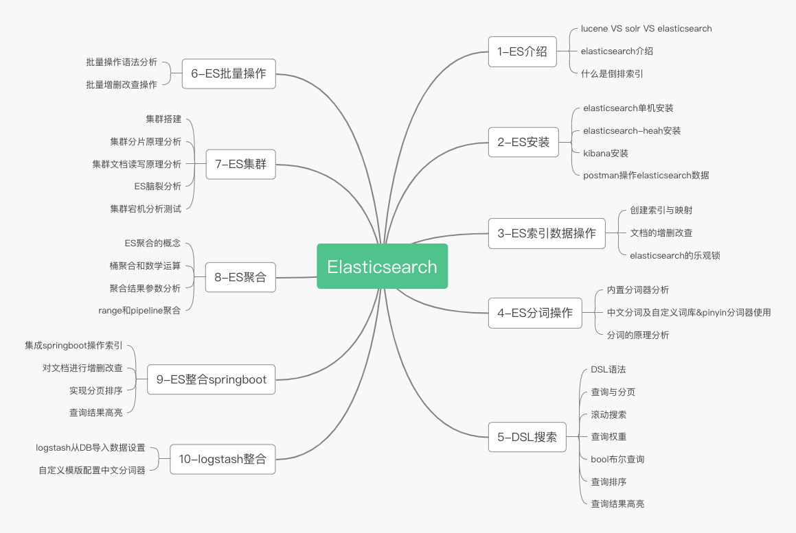

