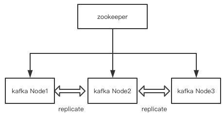
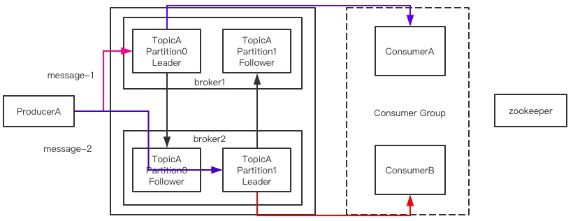
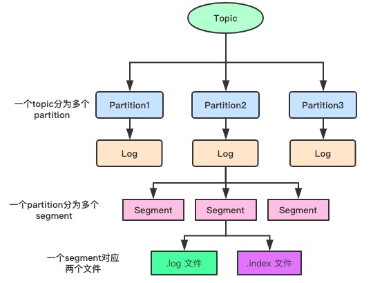
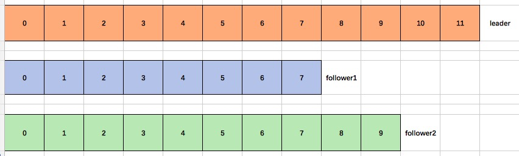
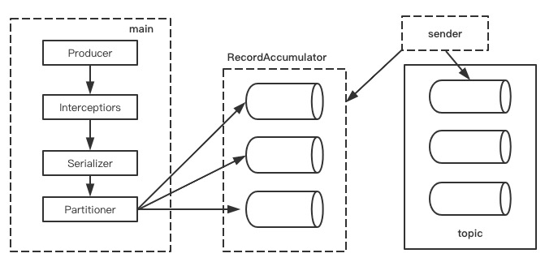
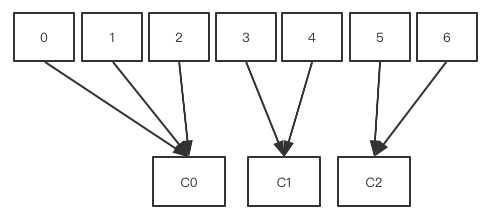
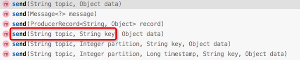
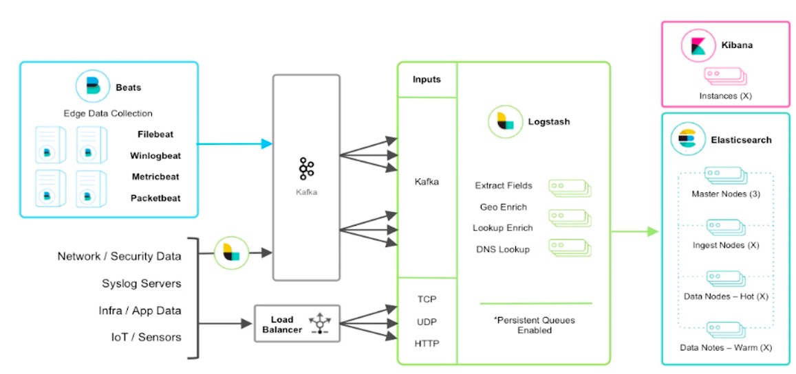
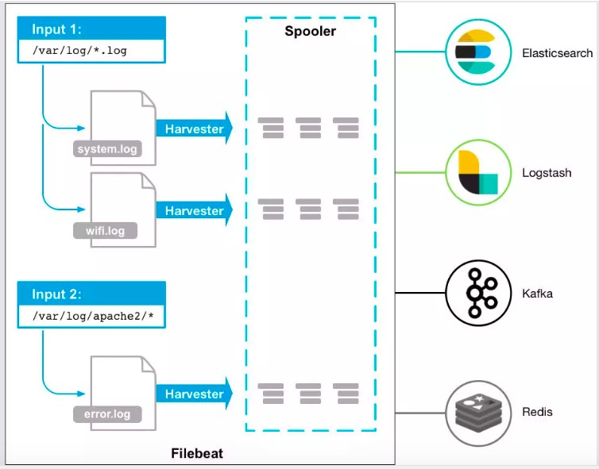

[TOC]

##  目录

- [kafka消息队列应用实战-分析与安装](#kafka消息队列应用实战-分析与安装)
  - [1. kafka的主要特点分析](#1-kafka的主要特点分析)
  - [2. kafka的架构模型分析](#2-kafka的架构模型分析)
  - [3. kafka的内部设计特点](#3-kafka的内部设计特点)
  - [4. kafka的应用场景分析](#4-kafka的应用场景分析)
  - [5. kafka安装部署](#5-kafka安装部署)
  - [6. kafka内部命令使用](#6-kafka内部命令使用)
  - [7. kafka内部文件存储结构](#7-kafka内部文件存储结构)
- [kafka消息队列应用实战-生产与消费](#kafka消息队列应用实战-生产与消费)
  - [1. kafka生产者分析](#1-kafka生产者分析)
  - [2. Kafka生产者的ACK机制（可靠性）](#2-Kafka生产者的ACK机制可靠性)
  - [3. Kafka分布式保存数据一致性问题](#3-Kafka分布式保存数据一致性问题)
  - [4. Kafka的Exactly Once实现](#4-Kafka的ExactlyOnce实现)
  - [5. Kafka生产者的事务机制](#5-Kafka生产者的事务机制)
  - [6. Kafka发送消息的流程](#6-Kafka发送消息的流程)
  - [7. Kafka消费方式分析](#7-Kafka消费方式分析)
  - [8. Kafka消费分区访问策略](#8-Kafka消费分区访问策略)
  - [9. Springboot整合Kafka进行消息收发](#9-Springboot整合Kafka进行消息收发)
  - [10. 搭建kafka的集群](#10-搭建kafka的集群)
  - [11. Springboot整合Kafka进行消息收发](#11-Springboot整合Kafka进行消息收发)
  - [12. kafka消费进度分析以及消费应答](#12-kafka消费进度分析以及消费应答)
  - [13. 程序中指定分区和key的读写方式实现](#13-程序中指定分区和key的读写方式实现)
  - [14. 在程序中consumer如何重新消费](#14-在程序中consumer如何重新消费)
- [kafka监控及日志平台实战](#kafka监控及日志平台实战)
  - [1. Kafka监控服务平台Eagle的使用](#1-Kafka监控服务平台Eagle的使用)
  - [2. 大数据日志平台服务搭建设计](#2-大数据日志平台服务搭建设计)
  - [3. 使用filebeat将日志收集进kafka](#3-使用filebeat将日志收集进kafka)
  - [4. 通过logstash提取kafka数据进入ES](#4-通过logstash提取kafka数据进入ES)


# kafka消息队列应用实战-分析与安装

## 1. kafka的主要特点分析

kafka是一个**分布式**的发布订阅消息系统，由linkedin开发，现在成为了apache的项目一部分

- 同时可以为发布和订阅提供高吞吐量的访问，kafka每秒可以生产25万消息（50MB），每秒可以处理55万消息（110MB）
- 可以进行持久化的操作。将消息持久化大磁盘，因此可以进行批量消息的处理，还提供replaction防止数据丢失
- 分布式系统，易于向外扩展，所有的producer、broker、consumer都会有多个，这些都是分布式的，无需停机就可以进行扩展（zookeeper）
- 消息的处理的状态是在consumer端维护，不是在server端维护，失败的时候能够自动平衡
- 支持online和offline场景

## 2. kafka的架构模型分析

kafka的整体架构非常简单，是一种显示分布式架构，数据是从producer发送到broker，broker承担了一个中间缓存的分发的作用，分发给注册到broker的consumer

**集群结构是什么样的？**

整个集群是通过zookeeper进行节点的发现和注册，kafka节点间进行数据的复制备份



- 基本概念：
  - Topic：是消息的一个分类，你可以理解为他就是不同的队列，kafka是以topic进行消费分类的
  - Partition：topic是一个逻辑上的概念，而partition是topic物理上的一个分组/分区，一个topic可以分为多个partition，每个partition也都是有序的队列，partition中的每个消息都会被分配一个有序的id（offset）
  - message：消息体本身
  - Producers：消息的生产者
  - Consumers：消息的消费者
  - Broker：就是kafka的服务本身，缓存代理
- 发送消息的流程
  - producer发送一个message给到指定的topic
  - topic会将接收到消息分配给他的partition进行保存（partition数量是你自己指定的）
  - 如果你设置了follower分区，并且有多个节点的情况下，所有的主分区不在一条机器上
  - consumer是进行数据消费的，一个partition只能同时被一个consumer group中的消费者消费，这就可以提升消费能力
  - 在v0.9版本之前消费的offset是放在zookeeper中，后面放在自己的磁盘上了



## 3. kafka的内部设计特点

- 高吞吐能力：为了实现高吞吐能力做了以下设计
  - 内存访问，使用pagecache来进行高效缓存
  - zero-copy：减少I/O的操作
  - 对消息的处理是支持批量发送和压缩的
  - topic分区，将消息文件分散多个机器上进行存储，这就能利用好分布式的优势，存储也能水平扩展了
- 负载均衡
  - producer可以根据用户指定的算法（如果没有指定就是roundrabin），将消息发送到指定的partition 中
  - 每个partition都有自己的replica，replicat分布在不同的broker节点上
  - zookeeper可以动态的加入新的broker节点
- 消息拉取
  - 数据是通过broker来进行pull的方式
  - consumer可以根据消费能力自主控制消息的拉取速度
- 可扩展性：broker可以通过zookeeper动态增加

## 4. kafka的应用场景分析

- 消息队列：大规模消息处理应用解决方案，在消息队列领域，kafka足以媲美ActiveMQ、RabbitMQ
- 行为跟踪
- 元信息监控
- 日志收集
- 流处理
- 事件源
- 持久性日志

## 5. kafka安装部署

安装的前置条件：JDK、zookeeper

```shell
# 由于kafka的服务协调是基于zookeeper实现的，所以要先下载安装zookeeper
wget https://archive.apache.org/dist/zookeeper/zookeeper-3.5.7/apache-zookeeper-3.5.7-bin.tar.gz
# 解压在conf里修改zoo_sample.cfg为zoo.cfg进行修改
# 提前把data和logs文件创建好
dataDir=/usr/local/zookeeper-cluster/zookeeper1/data
dataLogDir=/usr/local/zookeeper-cluster/zookeeper1/logs
clientPort=2181 # 每个机器的端口不能一样
# 增加通信内容三台机器一样：server.服务编号=服务地址:LF通信端口:选举端口
server.1=127.0.0.1:2881:3881
server.2=127.0.0.1:2882:3882
server.3=127.0.0.1:2883:3883
# 在三台机器的data目录dataDir=/usr/local/zookeeper-cluster/zookeeper1/data
# 创建文件myid，分别写入1/2/3
data里创建文件myid，三台分别写入值1、2、3
# 创建的sh文件统一启动zookeeper，zookeeper-start.sh
/usr/local/zookeeper-cluster/zookeeper1/bin/zkServer.sh start
/usr/local/zookeeper-cluster/zookeeper2/bin/zkServer.sh start
/usr/local/zookeeper-cluster/zookeeper3/bin/zkServer.sh start
# 批处理文件授权
chmod 777 zookeeper-start.sh
# 启动zookeeper集群
./zookeeper-start.sh
#关闭服务
/usr/local/zookeeper-cluster/zookeeper3/bin/zkServer.sh stop
#查看服务状态
/usr/local/zookeeper-cluster/zookeeper3/bin/zkServer.sh status
```

安装kafka并进行基础配置

```shell
# 下载kafka
wget http://mirror.bit.edu.cn/apache/kafka/2.4.0/kafka_2.13-2.4.0.tgz
# 解压后进入config目录，修改server.properties
# kafka的broker编号，必须是一个整数，服务编号，在集群中不能一样
broker.id=11
# topic允许删除的，如果你设置成false，删除topic对kafka是无效的，默认就是true
delete.topic.enable=true
port=9092
# 处理网络请求的线程数量
num.network.threads=3
# 磁盘IO的线程数量
num.io.threads=8
# 发送socket的缓冲区大小
socket.send.buffer.bytes=102400
# 接收socket的缓冲区大小
socket.receive.buffer.bytes=102400
# 请求socket的缓冲区大小
socket.request.max.bytes=104857600
# 是保存消息日志的文件目录,data目录要提前创建好
log.dirs=/usr/local/kafka/data
# topic在创建时默认多少个分区
num.partitions=1
# 我们的消息数据默认保存时间长度，单位是小时
log.retention.hours=168
# 一个log文件的大小，这里默认是1G，如果超过1G就再创建一个新文件
log.segment.bytes=1073741824
# zookeeper的集群地址
zookeeper.connect=127.0.0.1:2181,127.0.0.1:2182,127.0.0.1:2183
```

启动和关闭服务

```shell
# 启动服务命令
/usr/local/kafka/bin/kafka-server-start.sh -daemon /usr/local/kafka/config/server.properties
# 关闭服务命令
/usr/local/kafka/bin/kafka-server-stop.sh /usr/local/kafka/config/server.properties
```

单机已经启动了，集群只需要我们和单机一样将新的kafka加入到同一个zookeeper里即可，但broker.id需要和其他机器不一样

## 6. kafka内部命令使用

```shell
# 0.查看topics命令帮助
kafka-topics.sh --help
# 1.查看当前服务器中所有的topic
kafka-topics.sh --zookeeper 127.0.0.1:2181 --list
# 2.创建topic
kafka-topics.sh --zookeeper 127.0.0.1:2181 --create --partitions 3 --replication-factor 1 --topic topicfirst
# Error while executing topic command : Replication factor: 2 larger than available brokers: 1.
--topic # topic名称
--partitions # 定义分区数,partition的命名规则<topicName-partiton序号>
--replication-factor # 副本数量,1代表就是当前主分区没有副本,2代表每个主分区有一个副本分区
# 3.删除topic
# Note: This will have no impact if delete.topic.enable is not set to true.
kafka-topics.sh --zookeeper 127.0.0.1:2181 --delete --topic topicfirst
# 4.查看topic的详情
kafka-topics.sh --zookeeper 127.0.0.1:2181 --describe --topic topicfirst
# 5.修改topic分区数
kafka-topics.sh --zookeeper 127.0.0.1:2181 -alter --topic topicfirst --partitions 5
```

发送和接收消息

```shell
# 发送消息
kafka-console-producer.sh --topic topicfirst --broker-list 127.0.0.1:9092
# 接收消息
# --from-beginning 如果加收了会从topic头来接收消息
kafka-console-consumer.sh --topic topicfirst --from-beginning --bootstrap-server 127.0.0.1:9092
```

## 7. kafka内部文件存储结构

在kafka的v0.9版本前，是通过zookeeper来保存我们的消费offset数据的，但zookeeper的读写操作会影响kafka性能，所以在新版本就把消费的offset数据保存到本地的data目录里，这个data目录是你自己指定的

```shell
__consumer_offsets-0       __consumer_offsets-22  __consumer_offsets-36  __consumer_offsets-5
__consumer_offsets-1       __consumer_offsets-23  __consumer_offsets-37  __consumer_offsets-6
__consumer_offsets-10      __consumer_offsets-24  __consumer_offsets-38  __consumer_offsets-7
__consumer_offsets-11      __consumer_offsets-25  __consumer_offsets-39  __consumer_offsets-8
__consumer_offsets-12      __consumer_offsets-26  __consumer_offsets-4   __consumer_offsets-9
```

发送的消息数据到底是存放在哪个文件里的？

```shell
00000000000000000000.index  # 保存的消息的顺序编号
00000000000000000000.log    # 实际保存消息数据的
```



由于生产者生产数据的时候是会不断将数据追加到log文件的末尾，为了防止文件过大，数据定位的效率低下，kafka采用了分片和索引机制，将每个partition分为了多个segment，每个segment对应了两个文件index文件和log文件，这些文件都在一个文件夹下

- log文件是具体保存数据的，如果文件超过大小就会生成第二个，文件命名是这样的
  - 0000000000000000000.log 这里的0就是文件的offset的起点
  - 0000000000000013938.log 这里的13938就是上个文集end_offset+1
- index文件是具体存放消息索引信息的，如果consumer刚消费时跨了两个log文件，就需要index支持定位了，log和index是成对出现的


# kafka消息队列应用实战-生产与消费

## 1. kafka生产者分析

### 1.1. 生产者分区的原则

为什么要分区

- 提升了水平扩展能力
- 提供并发能力

分区的原则

- 指明partition的情况下，直降将指明的值作为partition的值（指定存放分区）
- 没有指明partition，但有key的情况下，会将key的hash值与topic的partition数量进行取余得到partition值
- 什么都没有指定，在第一发消息的时候，系统会随机生成一个整数来对topic的partition数量进行取余得到partition值，后面每次都对这个已经生成的随机数进行+1，这就得到了round-robin算法了

### 1.2. Kafka副本的复制方案

#### 1.2.1. 副本的复制方式分析

Kafka内部发送响应的机制：为了保证producer的数据能够可靠的发送并保存到topic上，topic的每个partition收到发送的数据后，都需要向生产者发送ACK，如果生产者收到ACK，就会进行下一轮发送，如果没有收到就会重新发送

副本的复制是如何复制的？

Producer--->leader（follower1，follower2）

这个情况下应该如何向Producer发送ACK

方案一：确保半数以上的follower完成同步，就发送ACK，优点是延迟低，在选举新的leader的时候，如果容忍n台节点故障，就需要2n+1个副本

方案二：完成全部follower的同步，才发送ACK，缺点是延迟高，在选举新的leader的时候，如果容忍n台节点故障，只就需要n+1个副本

kafka使用方案二作为follower的同步方式

- 如果选择方案一：虽然网络延迟低，但数据一致性无法保障，而且需要2n+1个副本，副本过多就会导致数据冗余过大，造成很大浪费
- 虽然方案二延迟高，但对于kafka来说影响不大

#### 1.2.2. 通过ISR优化副本同步

先看一下topic的详细信息

```shell
Topic: topicfirst       PartitionCount: 5       ReplicationFactor: 1    Configs: 
Topic: topicfirst       Partition: 0    Leader: 11      Replicas: 11    Isr: 11
Topic: topicfirst       Partition: 1    Leader: 11      Replicas: 11    Isr: 11
Topic: topicfirst       Partition: 2    Leader: 11      Replicas: 11    Isr: 11
Topic: topicfirst       Partition: 3    Leader: 11      Replicas: 11    Isr: 11
Topic: topicfirst       Partition: 4    Leader: 11      Replicas: 11    Isr: 11
```

在kafka采用第二种方案进行副本复制后进行ACK响应，会等待所有follower完成同步，这个时候如果有一个follower因为某种原因无法访问，这个时候leader就要一直等着这个follower来完成同步才能发ACK给producer

**Kafka的解决方案：Leader维护了一个动态的in-sync replica set（ISR）**

- 副本同步机制

  - 作用是和leader保持同步的follower集合
  - 当ISR中的follower完成数据同步之后，leader就会给follower发送ack（数据是由folloer主动从leader那里拉取过来的）

- ISR是一个动态同步集合：从ISR中移除follower的条件是当follower长时间未向leader拉取数据，该follower就会被剔除出ISR，时间阀值由：replica.lag.time.max.ms=10000 决定 单位ms

  > replica.lag.max.messages 这个是leader和follower的消息数的差，超过就剔除出ISR，这个参数在0.9版本已经移除

- 当leader发生故障了，就会从ISR中选举新leade


## 2. Kafka生产者的ACK机制（可靠性）

ACK（在rabbitmq里面，我们producer和broker的一个反馈是什么？callback，return）

对于kafka不太重要的数据是不是就不需要可靠性很高了

副本机制 主分片--副本分片

producer发送给broker-->partition(leader)-->replication(2)

这个时候，我们思考一个生产者的ACK机制，p roducer通过一个配置项目ACKS

- acks = 0 : producer只要给到broker就返回ack，当broker接收到数据后，如果broker故障导致数据丢失
- acks =1 : partition的leader落盘成功后才返回ACK，不关心follower，当我们的partition的leader挂掉后数据就无法同步到follower（leader挂了，要选举生成新的leader）
- acks = -1 : 所有ISR中的分区都同步成功才会返回ACK给producer

kafka的producer在没有接收到ACK后会重试，这个重试是有次数的，这个次数是你配置的

## 3. Kafka分布式保存数据一致性问题

producer有一个重试机制，如果数据没有接收到ACK的情况下，重新再次发送

场景分析：如果有一个leader，两个follower，当leader宕机了



LEO（Log End Offset）：每个副本最后一个offset

HW（High Watermark）：所有副本中最小的那个LEO（7）

数据一致性的执行细节：

1、follower故障

follower发生故障就会被剔除出ISR，待follower恢复后，follower会读取本次磁盘上上次记录的HW（7），将log文件中高于HW部分截取掉，从HW开始向leader进行同步，待follower的LEO大于等于Partition副本的HW，当follower追上leader以后，就可以重入ISR

2、leader故障

leader故障之后，会从ISR中选一个follower成为leader，为保证多个副本间的数据一致，将所有的副本各自的高于HW的数据部分截取掉，从新的leader同步数据

注意：这个只能保证数据一致性，不能保证数据不丢失或者不重复

## 4. Kafka的Exactly Once实现

将producer的ack设置为-1，保证数据producer到partitons的数据不丢失，就是At Least Once，如果将ack设置为0，可以保证每条消息只会发送一次，即At Most Once

At Least Once可以保证数据不丢失，但不能保证数据不重复，At Most Once可以保证数据不重复，但不能保证数据不丢失

Exactly Once = At Least Once + 幂等性

At Least Once 可以通过Producer的ACKS设置为-1来解决，在kafka的v0.11(含)之后引入了一个新特性：producer端的幂等性，无论Producer发给broker多少次，只要数据重复，broker只会持久化一条给到topic

在Producer端通过参数 enable.idempotence 设置为true即可，相当于开起了producer端的幂等性：Producer在初始化的时候会被分配一个PID，发往同一个Partition的消息会附带Sequence Number。broker端会对

<PID,Partition,Sequence Number>做主键缓存，当有相同主键信息只会持久化一条了

但是：系统只要重启就会更新PID，在不同的Partition上会有不同的主键，**所以Producer的幂等无法保证跨分区跨会话的Exactly Once**

## 5. Kafka生产者的事务机制

kafka的数据可以有很多的partition

场景：当producer个p0，p1，p2写入数据，0-10，1-15，正要给2分区写数据broker挂了，如果acks=1，有主分区没有写入完成，producer会重试发送

在kafka的v0.11版本引入了transactionID，将transactionID和PID绑定并保存事务状态到一个内部的topic中，当服务重启后该事务状态还能获取

## 6. Kafka发送消息的流程

kafka的producer发送消息采用的是异步发送模式，一个main一个sender还有一个线程共享变量(RecordAccumulator)



batch.size : 数据积累到多大以后，sender才会发送

linger.ms : 如果一直没有达到batch.size，sender会等待linger.ms时间后就发送

## 7. Kafka消费方式分析

kafka里consumer采用的是pull的方式从broker里取数据

- push推的方式很难适应消费速率不同的消费者，消息发送速率是有broker决定的，典型的问题表现是消费端拒绝访问和网络堵塞
- pull的方式的消费速率是由consumer来确定，如果kafka的topic里没有数据，consumer会长期获取空数据，kafka会在消费时传入一个timeout，如果拉取没有数据，就会等待timeout时长后再返回

## 8. Kafka消费分区访问策略

一个consumer group中有多个consumer，一个topic里有多个partition，这就涉及了partition的分配问题，确定那个partition由哪个consumer来消费

kafka有三种分配策略：range（范围模式，默认的），roundrobin（均衡），sticky（粘性方式v0.11新增）

- range：默认的分区消费策略

  无论多少个分区，只有一个消费者，那么所有分区都分配给这个消费者

  每次新的消费者加入消费者组都会触发新的分配

  分配策略：

  - 按照topic进行一组来分配给订阅了这个topic的consumer group中的consumer

  - n=分区数/消费者数量，m=分区数%消费者数量，第一个消费者分配n+m个分区，后面的分配n个分区

    

```shell
# 例1，假设消费者组有两个消费者c0，c1，都订阅了t0和t1，每个topic都有4个分区
c0: t0p0,t0p1,t1p0,t1p1 
c1: t0p2,t0p3,t1p2,t1p3
# 例2，假设消费者组有两个消费者c0，c1，都订阅了t0和t1，每个topic都有3个分区
c0: t0p0,t0p1,t1p0,t1p1
c1: t0p2,t1p2
```

- roundrobin：负载均衡的方式

  按照消费者组里的消费者进行平均分配

  可以通过配置：partition.assignment.strategy

  class org.apache.kafka.clients.consumer.RoundRobinAssignor

  负载均衡也要看是否订阅了这个topic

  每次新的消费者加入消费者组都会触发新的分配

```shell
# 例1: 假设消费者组有两个消费者c0，c1，都订阅了t0和t1，每个topic都有3个分区
c0: t0p0,t0p2,t1p1
c1: t0p1,t1p0,t1p2
# 例2: 3个消费者c0,c1,c2, 有三个topic，每个topic有3个分区，对于消费者而言，c0订阅的t0，c1订阅的t0和t1，c2订阅的t0，t1，t2
c0: t0p0
c1: t0p1,t1p0,t1p2
c2: t0p2,t1p1,t2p0,t2p1,t2p2
```

- Sticky：粘性策略

  kafka的v0.11版本引入的：class org.apache.kafka.clients.consumer.StickyAssignor

  主要实现的目录

  - 分区的分配要尽可能的均匀
  - 分区的分配尽可能的和上次分配保持一致
  - 当两者冲突时，第一个目标优先第二个目标

```shell
# 例1:三个消费者c0，c1，c2，都订阅了4个主题，t0，t1，t2，t3，每个topic有两个分区
c0: t0p0,t1p1,t3p0
c1: t0p1,t2p0,t3p1
c2: t1p0,t2p1
# 这个分配很像负载均衡
```

如果c1退出消费者组

```shell
# roundrobin策略下
c0: t0p0,t1p0,t2p0,t3p0
c2: t0p1,t1p1,t2p1,t3p1
# sticky策略下
c0: t0p0,t1p1,t3p0,t2p0
c2: t1p0,t2p1,t0p1,t3p1
```

## 9. Springboot整合Kafka进行消息收发

### 9.1. Producer发送端

首先引入POM依赖

```xml
		<dependency>
			<groupId>org.springframework.kafka</groupId>
			<artifactId>spring-kafka</artifactId>
		</dependency>
```

配置producer的yaml

```yaml
spring:
  kafka:
    bootstrap-servers: 39.99.222.44:9092
    producer:
      retries: 3 #发送消息的重试次数
      batch-size: 16384
      acks: 1 #等待partition leader落盘完成
      buffer-memory: 33554432 #设置生产者内存缓存的大小
      key-serializer: org.apache.kafka.common.serialization.StringSerializer
      value-serializer: org.apache.kafka.common.serialization.StringSerializer
```

发送代码编写

```java
import org.springframework.kafka.core.KafkaTemplate;
import org.springframework.kafka.support.SendResult;
import org.springframework.stereotype.Component;
import org.springframework.util.concurrent.ListenableFuture;
import org.springframework.util.concurrent.ListenableFutureCallback;

import javax.annotation.Resource;

@Component
public class KafkaProducerService {

    @Resource
    private KafkaTemplate<String,Object> kafkaTemplate;

    public void sendMessage(String topic,String key,Object object){
        ListenableFuture<SendResult<String,Object>> future = kafkaTemplate.send(topic,0,key,object);
        future.addCallback(new ListenableFutureCallback<SendResult<String, Object>>() {
            @Override
            public void onFailure(Throwable throwable) {
                System.out.println("********消息发送成功："+throwable.toString());

            }
            @Override
            public void onSuccess(SendResult<String, Object> result) {
                System.out.println("=========消息发送成功："+result.toString());
            }
        });
    }
}
```

调用测试

```java
import org.junit.jupiter.api.Test;
import org.springframework.beans.factory.annotation.Autowired;
import org.springframework.boot.test.context.SpringBootTest;
import com.icodingedu.producter.service.KafkaProducerService;

@SpringBootTest
class KafkaProducterApplicationTests {

	@Autowired
	KafkaProducerService kafkaProducerService;

	@Test
	void contextLoads() {
		String topic = "topicfirst";
		for(int i=0;i<10;i++){
			kafkaProducerService.sendMessage(topic,"key:"+i,"hello kafka "+i);
		}
		System.out.println("======发送完成======");
	}
}
```

在没有设置分区和key的情况下，按照轮询方式写入数据，消费结果如下

```shell
# 读取的值
hello kafka 1
hello kafka 6
hello kafka 2
hello kafka 7
hello kafka 3
hello kafka 8
hello kafka 4
hello kafka 9
hello kafka 0
hello kafka 5
Partition： 0    1    2    3    4 
           1 6  2 7  3 8  4 9  0 5
```


## 10. 搭建kafka的集群

**kafka集群搭建的前提：jdk，zookeeper**

使用springboot通过外网访问kafka需要开通一个监听如下，如果是集群的话需要给每台机器设置自己的IP

advertised.listeners=PLAINTEXT://39.99.195.49:9092

Topic: topicName        PartitionCount: 5       ReplicationFactor: 3    Configs: 
        Topic: topicName        Partition: 0    Leader: 1       Replicas: 1,2,3 Isr: 1,2,3
        Topic: topicName        Partition: 1    Leader: 2       Replicas: 2,3,1 Isr: 2,3,1
        Topic: topicName        Partition: 2    Leader: 3       Replicas: 3,1,2 Isr: 3,1,2
        Topic: topicName        Partition: 3    Leader: 1       Replicas: 1,3,2 Isr: 1,3,2
        Topic: topicName        Partition: 4    Leader: 2       Replicas: 2,1,3 Isr: 2,1,3

## 11. Springboot整合Kafka进行消息收发

消息接收使用POM

```xml
        <dependency>
            <groupId>org.springframework.kafka</groupId>
            <artifactId>spring-kafka</artifactId>
        </dependency>
```

配置consumer的xml

```yaml
spring:
  kafka:
    bootstrap-servers: 39.99.195.49:9092,39.99.196.208:9092,39.99.196.190:9092
    consumer:
      enable-auto-commit: false # 不自动签收
      auto-offset-reset: earliest
      key-deserializer: org.apache.kafka.common.serialization.StringDeserializer
      value-deserializer: org.apache.kafka.common.serialization.StringDeserializer
    listener:
      ack-mode: manual
      concurrency: 5
# earliest : kafka出现错误重启之后，会找到未消费的offset继续消费
# latest : kafka出现错误中，如果还有数据往topic里写，只会从最新的offset开始消费
```

java实现

```java
import org.apache.kafka.clients.consumer.Consumer;
import org.apache.kafka.clients.consumer.ConsumerRecord;
import org.springframework.kafka.annotation.KafkaListener;
import org.springframework.kafka.support.Acknowledgment;
import org.springframework.stereotype.Component;

@Component
public class KafkaConsumerService {

    @KafkaListener(groupId = "group01",topics = "topicName")
    public void onMessage(ConsumerRecord<String,Object> record, Acknowledgment acknowledgment, Consumer<?,?> consumer){
        System.out.println("*****获取的消息: "+record.value());
        acknowledgment.acknowledge();
    }
}

```

## 12. kafka消费进度分析以及消费应答

```shell
# 通过命令看消费进度的
./kafka-consumer-groups.sh --bootstrap-server 192.168.0.177:9092,192.168.0.178:9092,192.168.0.179:9092 --describe --group group01
# CURRENT-OFFSET ：当前消费的offset进度
# LOG-END-OFFSET ：数据文件里一共有多少位移数据
# LAG ：这是就是还未消费的量
CURRENT-OFFSET + LAG = LOG-END-OFFSET
```

## 13. 程序中指定分区和key的读写方式实现



## 14. 在程序中consumer如何重新消费

重新消费在命令行的方式

```shell
--from-beginning
```

重新需要明确两个点

- 每次消费完毕都会记录consumer的offset
- 如果要从代码里从头消费就需要配置
  - auto-offset-reset: earliest
  - 更换消费者组或者将已消费的offset删除


#  kafka监控及日志平台实战

## 1. Kafka监控服务平台Eagle的使用

kafka-eagle平台监控系统

```shell
# 下载地址
wget https://github.com/smartloli/kafka-eagle-bin/archive/v1.4.4.tar.gz
# Eagle是通过JMX来拉取kafka信息
# JMX：是Java Management Extensions（Java管理扩展）的缩写，
# 首先要对Kafka开启JMX

# 1.开启kafka的JMX
vi bin/kafka-server-start.sh
# 修改heap内容开启JMX
# 将这一行进行修改：export KAFKA_HEAP_OPTS="-Xmx1G -Xms1G"
export KAFKA_HEAP_OPTS="-server -Xmx1G -Xms1G -XX:PermSize=128m -XX:+UseG1GC -XX:MaxGCPauseMillis=200 -XX:ParallelGCThreads=8 -XX:ConcGCThreads=5 -XX:InitiatingHeapOccupancyPercent=70"
export JMX_PORT="9999"
# 如果是集群需要所有机器都将这个配置修改好

# 2.配置eagle配置到环境变量中
vi /etc/profile
export KE_HOME=/usr/local/kafka-eagle
export PATH=$KE_HOME/bin:$JAVA_HOME/bin:$PATH
cd /etc
source profile

# 3.给执行文件授权
cd /usr/local/kafka-eagle/bin
chmod 777 ke.sh

# 4.eagle系统的配置，eagel可以监控多套kafka集群
cd /usr/local/kafka-eagle/conf
vi system-config.properties
# 设置对应的参数
# 可以配置多个集群，这里只配置一套
kafka.eagle.zk.cluster.alias=cluster1
cluster1.zk.list=127.0.0.1:2181,127.0.0.1:2181,127.0.0.1:2181
# 显示的broker数量
cluster1.kafka.eagle.broker.size=20
# zookeeper客户端线程数
kafka.zk.limit.size=25
# eagle端口
kafka.eagle.webui.port=8048
# 消费的offset保存位置
cluster1.kafka.eagle.offset.storage=kafka
# 是否开启图表并保持30天内容
kafka.eagle.metrics.charts=true
kafka.eagle.metrics.retain=30
# KSQL的查询显示条数和是否自动fix error
kafka.eagle.sql.topic.records.max=5000
kafka.eagle.sql.fix.error=false
# 从界面删除topic的token密码
kafka.eagle.topic.token=keadmin
# mysql保存eagle的一些元数据驱动
kafka.eagle.driver=com.mysql.jdbc.Driver
kafka.eagle.url=jdbc:mysql://127.0.0.1:3306/kafka_eagle?useUnicode=true&characterEncoding=UTF-8&zeroDateTimeBehavior=convertToNull
kafka.eagle.username=root
kafka.eagle.password=123456
```

注意数据库如果不在一个设备上需要提前授权

```shell
use mysql;
select host,user from user;
grant all privileges on *.* to gavin@'192.168.%' identified by 'cpcoredb';
flush privileges;
```

启动/关闭/查看Kafka-eagle状态

```shell
bin/ke.sh start
bin/ke.sh stop
bin/ke.sh stats
# 访问地址
http://39.100.39.20:8048/ke
```

## 2. 大数据日志平台服务搭建设计





收集日志要注意的是

- 日志信息量非常大，所以一定要有一个可以堆积的地方
- 日志会出现暴增的情况
- 日志文件-->kafka(分布式)-->Logstash(收集过滤)-->ElasticSearch(聚合计算)-->Kibana(报表展示)

## 3. 使用filebeat将日志收集进kafka

logstash：使用java开发的比较消耗资源

filebeat：使用go语言开发的的空间，比logstash更轻量级，占用资源更少，一般在生产环境都是使用filebeat来进行日志收集的

```shell
# 下载安装
wget https://artifacts.elastic.co/downloads/beats/filebeat/filebeat-7.5.2-linux-x86_64.tar.gz
# 解压
tar -zxvf filebeat-7.5.2-linux-x86_64.tar.gz
# 修改配置文件
vi /usr/local/filebeat/filebeat.yml
```

filebeat.yml的配置信息

```shell
filebeat.inputs:
# 我的这个输入项是干什么的,自己命个名标记下
- input_type: log
  
  paths:
    - /usr/local/logsfile/error.log
  document_type: "error-log"    # 写入ES时的_type值
  multiline:
    pattern: '^\['              # 指定匹配的表达式,匹配以[开头的字符串
    negate: true                # 是否匹配到,必须要匹配到
    match: after                # 没有匹配到的合并到上一行的末尾
    max_lines: 2000             # 未匹配到最大的行数
    timeout: 2s                 # 如果在规定时间没有新的日志事件就不等待后面的直接output
  fields: 
    logbiz: order-error         # 业务命名
    logtopic: order-error-log   # kafka的topic
    evn: dev                    # 定义一个环境名

- input_type: log
  
  paths:
    - /usr/local/logsfile/info.log
  document_type: "info-log"
  multiline:
    pattern: '^\['
    negate: true
    match: after
    max_lines: 2000
    timeout: 2s
  fields: 
    logbiz: order-info
    logtopic: order-info-log
    evn: dev


output.kafka: 
   enabled: true
   hosts: ["192.168.0.177:9092","192.168.0.178:9092","192.168.0.179:9092"]
   topic: '%{[fields.logtopic]}'
   partition.hash: 
     reachable_only: true
   compression: gzip
   max_message_bytes: 1000000
   required_acks: 1
logging.to_files: true
```

启动filebeat

```shell
# 启动前做一下验证,看一下配置文件是否正确
./filebeat test config
# 在启动之前一定要将filebeat导入的topic创建好
# 后台启动filebeat
./filebeat &
```

## 4. 通过logstash提取kafka数据进入ES

```shell
# 0.解压安装
# 1.在根目录创建sync的
# 2.在sync文件里创建logstash-log-sync.conf,配置内容如下
input {
    kafka {
        bootstrap_servers => "192.168.0.177:9092,192.168.0.178:9092,192.168.0.179:9092"
        topics_pattern  => "order-.*"
        consumer_threads => 5
        decorate_events => true
        codec => "json"
        auto_offset_reset => "latest"
        group_id => "logstash1"
    }
 
}
output {
    elasticsearch {
        hosts => ["192.168.0.175:9200"]
        index => "kafka-%{+YYYY.MM.dd}"
    }
    stdout{
        codec => rubydebug     ##输出到屏幕上
    }
}
# 在bin目录下启动执行
./logstash -f /usr/local/logstash/sync/logstash-log-sync.conf
```

