[TOC]

##  目录

- [1. RabbitMQ内部核心概念掌握](#1-RabbitMQ内部核心概念掌握)
- [2. RabbitMQ服务搭建使用](#2-RabbitMQ服务搭建使用)
- [3. RabbitMQ整合Springboot进行消息收发](#3-RabbitMQ整合Springboot进行消息收发)
- [4. 消息接收的应答模式ACK和NACK的使用](#4-消息接收的应答模式ACK和NACK的使用)
- [5. Exchange交换机Type详解](#5-Exchange交换机Type详解)
- [6. 消息队列的TTL设置和使用](#6-消息队列的TTL设置和使用)
- [7. 死信队列详解及进入死信队列的机制](#7-死信队列详解及进入死信队列的机制)
- [8. RabbitMQ镜像集群构建](#8-RabbitMQ镜像集群构建)
- [9. 集群核心参数配置](#9-集群核心参数配置)
- [10. 镜像集群宕机恢复方式](#10-镜像集群宕机恢复方式)
- [11. 使用HAProxy实现镜像集群负载均衡](#11-使用HAProxy实现镜像集群负载均衡)
- [12. 使用Federation跨机房多活集群模式](#12-使用Federation跨机房多活集群模式)
- [13. 上下游数据的消费是否互相影响](#13-上下游数据的消费是否互相影响)
- [14. 消息延迟发送机制的实现](#14-消息延迟发送机制的实现)
- [15. springboot实现延时信息的收发](#15-springboot实现延时信息的收发)
- [16. 什么是生产端的可靠性投递](#16-什么是生产端的可靠性投递)
- [17. 常用的可靠性投递方案有哪些](#17-常用的可靠性投递方案有哪些)
- [18. 可靠性方案一：消息落库进行状态标记保证可靠投递](#18-可靠性方案一：消息落库进行状态标记保证可靠投递)
- [19. 可靠性方案二：消息延迟投递，二次确认保证可靠投递](#19-可靠性方案二：消息延迟投递，二次确认保证可靠投递)
- [20. 生产环境中消费端如何接收多个队列的消息](#20-生产环境中消费端如何接收多个队列的消息)
- [21. 消息发送端如何接收交换机返回的回调应答的](#21-消息发送端如何接收交换机返回的回调应答的)
- [22. 消费端幂等性问题解决](#22-消费端幂等性问题解决)
- [23. 消费端的消息可靠性如何保障](#23-消费端的消息可靠性如何保障)


#  RabbitMQ实战

## 1. RabbitMQ内部核心概念掌握

- RabbitMQ是采用Erlang开发的：Erlang有着和原生Socket一样的延迟，性能非常高
- 提供可靠的消息传统模式：confirm、return
- 与SpringAMQP完美结合
- 集群模式比较丰富
- 保证数据不丢失的情况下做高可靠和高可用

**AMQP协议各核心部件之间的关系**

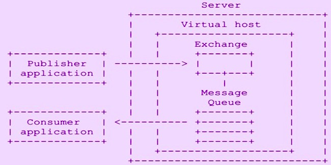

- 消息的生产者把消息投递到server上，经过virtual host到Exchage就可以了
- 消费者只需要和Message Queue进行监听和绑定即可，这就实现了消费者和生产者的解耦
- 生产者和消费者是通过路由来关联的
- 通过routingkey来关联Exchage和MQ
- 消息的生产者将消息发送给Exchage上的某个Routingkey，消费者在队列中订阅某个Routingkey的消息，这个时候Exchage就将两个Routingkey一样的生产和消费连接在了一起

**AMQP名词解释**

- server：又称Broker，就是我们的rabbitmq服务
- Connection：就是连接
- Channel：网络通信，每个Channel代表一个会话
- Message：消息体
- Virtual host：虚拟地址，可以理解为一个工作空间，或者一个文件夹，进行逻辑隔离
  - 一个VH下可以有多个Exchange和queue
  - 同一个VH下不能有相同名称的Exchage和queue存在
- Exchage：接收消息进行队列数据的绑定
- Binding：Exchage和Queue之间的虚拟连接，Binding中包含Routingkey
- Routingkey：路由规则，消息的暗号
- Queue：存放消息的具体地方

**RabbitMQ消息的流转**

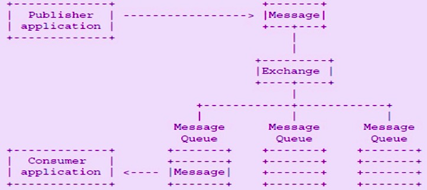

## 2. RabbitMQ服务搭建使用

操作系统使用centOS 7.x

```shell
# 1.安装需要的辅助工具
yum -y install build-essential openssl openssl-devel unixODBC unixODBC-devel make gcc gcc-c++ kernel-devel m4 ncurses-devel tk tc xz
# 2.下载安装包
wget www.rabbitmq.com/releases/erlang/erlang-18.3-1.el7.centos.x86_64.rpm
wget http://repo.iotti.biz/CentOS/7/x86_64/socat-1.7.3.2-5.el7.lux.x86_64.rpm
wget www.rabbitmq.com/releases/rabbitmq-server/v3.6.5/rabbitmq-server-3.6.5-1.noarch.rpm
# 3.按照顺序安装rpm包,使用rpm一键安装将环境变量也一并处理好
rpm -ivh erlang-18.3-1.el7.centos.x86_64.rpm 
rpm -ivh socat-1.7.3.2-5.el7.lux.x86_64.rpm
rpm -ivh rabbitmq-server-3.6.5-1.noarch.rpm
# 4.修改用户登录与心跳检测的频率
vi /usr/lib/rabbitmq/lib/rabbitmq_server-3.6.5/ebin/rabbit.app
将{loopback_users, [<<"guest">>]}, 修改为{loopback_users, [guest]},
将heartbeat修改为10秒
# 5.启动Rabbitmq
/etc/init.d/rabbitmq-server start | stop | status | restart
rabbitmq-server start &
# 6.安装一个端口访问工具
yum -y install lsof
lsof -i:5672
# 7.启动控制台
rabbitmq-plugins list # 查看rabbitmq都有哪些插件
rabbitmq-plugins enable rabbitmq_management # 启动管理控制台插件
lsof -i:15672 # 管理控制台的端口是15672
# 8.登录访问控制台
http://192.168.1.100:15672
```

**RabbitMQ常用命令**

```shell
# 关闭应用
rabbitmqctl stop_app
# 启动应用
rabbitmqctl start_app
# 节点状态
rabbitmqctl status
# 添加用户密码
rabbitmqctl add_user username password
# 修改用户密码
rabbitmqctl change_password username password
# 列出所有用户
rabbitmqctl list_users
# 删除用户
rabbitmqctl delete_user username
# 列出用户权限
rabbitmqctl list_user_permissions username
# 清除用户权限
rabbitmqctl clear_permissions -p vhostpath username
# 设置用户权限
# 三个*对应：configure write read
rabbitmqctl set_permissions -p vhostpath username ".*" ".*" ".*"
rabbitmqctl set_permissions -p / gavin ".*" ".*" ".*"
# 列出所有虚拟主机
rabbitmqctl list_vhosts
# 创建虚拟主机
rabbitmqctl add_vhost vhostpath
# 列出虚拟主机的权限
rabbitmqctl list_permissions -p vhostpath
# 删除虚拟主机
rabbitmqctl delete_vhost vhostpath
# 查看所有队列
rabbitmqctl list_queues
# 清除队列里的消息
rabbitmqctl -p vhostpath purge_queue queueName
# 清除所有数据
rabbitmqctl reset # 这个动作最好在MQ服务停掉后操作
```

## 3. RabbitMQ整合Springboot进行消息收发

### 3.1. 创建工程

- 提供消息对象的项目：放消息对象的

```java
import lombok.Data;

import java.io.Serializable;

@Data
public class OrderInfo implements Serializable {
  	//消息对象需要序列化
    private static final long serialVersionUID = 4084996990296644842L;
    private String id;
    private String order_name;
    //消息id是用来生成一个消息的唯一id，通过消息id能找到这个消息的业务信息
    private String message_id;
}
```

- provider项目：消息发送方
- receive项目：消息接收方

### 3.2. 发送方的设置

**POM依赖**

**消息体的工程依赖**

```xml
		<dependency>
			<groupId>com.icoding.basic</groupId>
			<artifactId>rmq-basic</artifactId>
			<version>1.0-SNAPSHOT</version>
		</dependency>
```

**AMQP的依赖**

```xml
		<dependency>
			<groupId>org.springframework.boot</groupId>
			<artifactId>spring-boot-starter-amqp</artifactId>
		</dependency>
```

Yaml的配置

```yaml
spring:
  rabbitmq:
    host: 39.99.219.219
    username: guest
    password: guest
    virtual-host: /
    connection-timeout: 15000
```

编写发送类

```java
import com.icoding.basic.po.OrderInfo;
import org.springframework.amqp.rabbit.connection.CorrelationData;
import org.springframework.amqp.rabbit.core.RabbitTemplate;
import org.springframework.beans.factory.annotation.Autowired;
import org.springframework.stereotype.Component;

@Component
public class OrderSender {

    @Autowired
    RabbitTemplate rabbitTemplate;

    public void sendOrder(OrderInfo orderInfo) throws Exception{
        /**
         * exchange: 交换机名字,是个你自己定义的字符串
         * routingkey: 队列关联的key,是个你自己定义的字符串
         * object: 要传输的消息对象
         * correlationData: 消息的唯一id
         */
        CorrelationData correlationData = new CorrelationData();
        correlationData.setId(orderInfo.getMessage_id());
        rabbitTemplate.convertAndSend("order-exchange","order.update",orderInfo,correlationData);
    }
}
```

**这个时候还不能发送消息，因为还没有创建exchange，可以在控制台创建exchange**

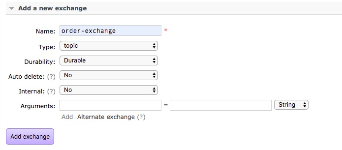

- type是exchage的routingkey的绑定类型
- Durability：消息是否持久化
- Auto delete：如果设置为yes则当exchange最后一个绑定的队列被删除后，就会自动删除
- Internal：如果设置为yes，是RabbitMQ的内部使用，不提供给外部，自己编写erlang语言做扩展时使用
- Arguments：扩展AMQP的自定义参数

**创建消息队列**

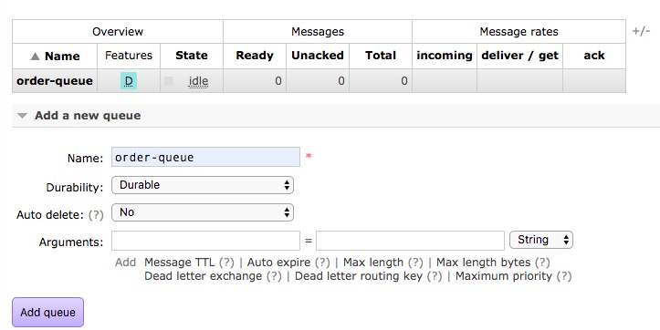

**在exchange里创建Binding并输入routingkey**

- 这里的routingkey就是我们的一个接收规则

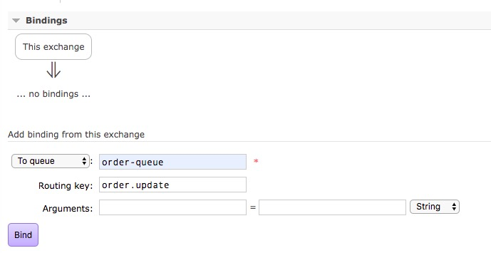

这个时候再启动消息的发送MQ就能接收到消息了

```java
import com.icoding.basic.po.OrderInfo;
import com.icoding.provider.provider.OrderSender;
import org.junit.jupiter.api.Test;
import org.springframework.beans.factory.annotation.Autowired;
import org.springframework.boot.test.context.SpringBootTest;

@SpringBootTest
class RmqProviderApplicationTests {

	@Autowired
	OrderSender orderSender;

	@Test
	void contextLoads() {
		OrderInfo orderInfo = new OrderInfo();
		orderInfo.setId("10001");
		orderInfo.setOrder_name("消息队列RabbitMQ从入门到精通");
		orderInfo.setMessage_id("MS99999");
		try {
			System.out.println("***********开始发送************");
			orderSender.sendOrder(orderInfo);
			System.out.println("-----------发送完成------------");
		}catch (Exception ex){
			ex.printStackTrace();
		}
	}
}
```


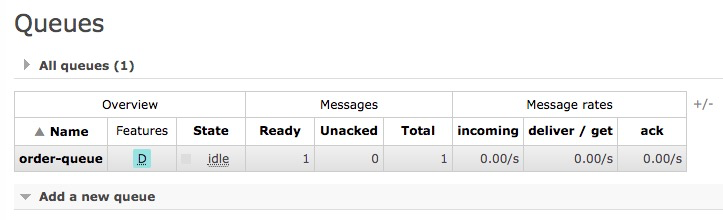

### 3.3. 接收方的设置

**POM依赖**

```xml
        <dependency>
            <groupId>org.springframework.boot</groupId>
            <artifactId>spring-boot-starter-amqp</artifactId>
        </dependency>
        <dependency>
            <groupId>com.icoding.basic</groupId>
            <artifactId>rmq-basic</artifactId>
            <version>1.0-SNAPSHOT</version>
        </dependency>
```

yaml设置

```yaml
spring:
  rabbitmq:
    host: 39.99.219.219
    username: guest
    password: guest
    virtual-host: /
    connection-timeout: 15000
    listener: #消费端配置
      simple:
        concurrency: 5 #初始化并发数
        max-concurrency: 10 #最大并发数据
        auto-startup: true #自动开启监听
        prefetch: 1 #每个并发连接同一时间最多处理几个消息，限流设置
        acknowledge-mode: manual #签收模式,设置为手动
```

编写接收的实现类

```java
import com.icoding.basic.po.OrderInfo;
import com.rabbitmq.client.Channel;
import org.springframework.amqp.rabbit.annotation.*;
import org.springframework.messaging.handler.annotation.Headers;
import org.springframework.messaging.handler.annotation.Payload;
import org.springframework.stereotype.Component;

import java.util.Map;

@Component
public class OrderReceiver {

    @RabbitListener(bindings = @QueueBinding(
            value = @Queue(value = "order-queue",durable = "true",autoDelete = "false"),
            exchange = @Exchange(value = "order-exchange",durable = "true",type = "topic"),
            key = "order.update"
        )
    )
    @RabbitHandler
    public void onOrderMessage(@Payload OrderInfo orderInfo, @Headers Map<String,Object> headers, Channel channel) throws Exception{
        System.out.println("************消息接收开始***********");
        System.out.println("Order Name: "+orderInfo.getOrder_name());
    }
}
```


## 4. 消息接收的应答模式ACK和NACK的使用

- ACK就是手动签收的标示，如果消息的签收模式设置成为了手工模式，在MQ没有接收到ACK信息时都是Unacked的状态，并且消息还在队列中，这个时候消息不回重试，不会再主动发给消费者
- 如果在进行业务操作的时候，我们系统业务流程中出现了未知业务异常，比如里面某个服务环节出现网络超时的情况，这个时候如果签收，是不是业务根本没有达成，消息还消费掉了，这就无法补偿了，如果我没签收，这个时候消息就停留在这个队列里了，这个时候如果想要重试再次接收消息难道要重启服务吗？
- NACK：将消息重回队列，如果我们发现异常，就可以调用NACK来将消息重回队列，他会重回到队尾
  - 比如说执行的过程中发现异常，我们可以在catch里进行重回队列让消息再次执行
  - 一般在业务中，我们重回队列执行的过程中会设置一个最大重回次数（重回计数可以使用redis），如果超过这个次数就执行ACK并进行记录，记录这个消息没有执行成功

```java
import com.icoding.basic.po.OrderInfo;
import com.rabbitmq.client.Channel;
import org.springframework.amqp.rabbit.annotation.*;
import org.springframework.amqp.support.AmqpHeaders;
import org.springframework.messaging.handler.annotation.Headers;
import org.springframework.messaging.handler.annotation.Payload;
import org.springframework.stereotype.Component;
import java.util.Map;

@Component
public class OrderReceiver {

    int flag = 0;

    @RabbitListener(bindings = @QueueBinding(
            value = @Queue(value = "order-queue",durable = "true",autoDelete = "false"),
            exchange = @Exchange(value = "order-exchange",durable = "true",type = "topic"),
            key = "order.*"
        )
    )
    @RabbitHandler
    public void onOrderMessage(@Payload OrderInfo orderInfo, @Headers Map<String,Object> headers, Channel channel) throws Exception{
        System.out.println("************消息接收开始***********");
        System.out.println("Order Name: "+orderInfo.getOrder_name());
        Long deliverTag = (Long)headers.get(AmqpHeaders.DELIVERY_TAG);
        //ACK进行签收，第一个参数是标识，第二个参数是批量接收为fasle
        //channel.basicAck(deliverTag,false);
        if(flag>3){
            //说明执行了3次都没有成功
            //消息确认
            channel.basicAck(deliverTag,false);
            //记录这个消息的日志或数据到DB/Redis/file
        }else {
            //可以设置时延迟几秒
            flag = flag+1;
          	//前两个参数和上面ACK一样，第三个参数是否重回队列
            channel.basicNack(deliverTag, false, true);
        }
    }
}
```

## 5. Exchange交换机Type详解

- **direct** : 点对点直连的概念，比如我在binding里设置了一个routingkey是order.update，这个时候我们发送消息的routingkey就必须是order.update，如果不是order.update，这个消息就接收不到
- **topic** : 点对点直连的概念，但是他支持routingkey的模糊匹配，可以在我们的routingke写匹配符
  - *：代表一个单词
  - #：代表没有或多个单词
  - 这个匹配符用在我们binding里，既可以写在routingkey的前面也可以写在routingkey的后面（order.*/#.insert）
- **fanout**：只要exchange进行binding了消息队列，就直接将消息传给消息队列了，因为不绑定任何的routingkey所以是转发消息最快的（广播方式）
- header：根据消息header头来判断，较少使用

## 6. 消息队列的TTL设置和使用

**什么是TTL：Time To Live**，也就是生存时间

- RabbitMQ是支持消息过期机制的，如果你设置了消息的TTL，这个消息没有及时消费，这个消息就丢了，或者说消失了
- 队列整体的消息过期时间，就是一个Time box，给这个队列设置一个过期时间，那么这个队列里的消息从进入队列开始计算，达到了这个时间如果还没有消费就直接丢掉了
  - x-message-ttl : 消息队列的整体消息的TTL，单位是毫秒
  - x-expires ：消息队列空闲的市场，如果空闲超过这个时间就会自动删除，单位毫秒
  - x-max-length ：消息队列存放消息的总消息数，如果超过会挤掉最早的那个数据
  - x-max-length-bytes ：消息队列的最大容量，新消息过来如果容量不够会删除最早的消息，如果还不够，再删一条次最早的消息

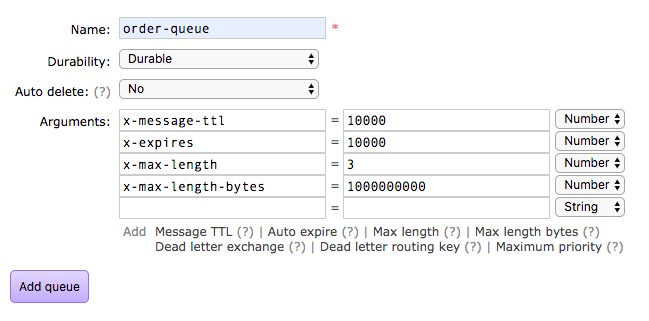

- 如果我只想某个消息按时间过期，那么就不能使用消息队列的TTL，就要对消息本身进行TTL
  - 在发送端进行消息过期设置

```java
import com.icoding.basic.po.OrderInfo;
import org.springframework.amqp.AmqpException;
import org.springframework.amqp.core.Message;
import org.springframework.amqp.core.MessagePostProcessor;
import org.springframework.amqp.rabbit.connection.CorrelationData;
import org.springframework.amqp.rabbit.core.RabbitTemplate;
import org.springframework.beans.factory.annotation.Autowired;
import org.springframework.stereotype.Component;

@Component
public class OrderSender {

    @Autowired
    RabbitTemplate rabbitTemplate;

    public void sendOrder(OrderInfo orderInfo) throws Exception{
        /**
         * exchange: 交换机名字
         * routingkey: 队列关联的key
         * object: 要传输的消息对象
         * correlationData: 消息的唯一id
         */
        CorrelationData correlationData = new CorrelationData();
        correlationData.setId(orderInfo.getMessage_id());
        //在这里设置message的TTL
        MessagePostProcessor messagePostProcessor = new MessagePostProcessor() {
            @Override
            public Message postProcessMessage(Message message) throws AmqpException {
                message.getMessageProperties().setExpiration("5000");
                return message;
            }
        };
        //将messagePostProcessor加入到参数中
        rabbitTemplate.convertAndSend("order-exchange","order.update",orderInfo,messagePostProcessor,correlationData);
    }
}
```

## 7. 死信队列详解及进入死信队列的机制

首先要看一下什么是死信：当一个消息**无法被消费**时就变成了死信

死信是怎么形成的：消息在没有被消费前就失效的就属于死信

一个系统中是没有无缘无故生成的消息，如果这个消息失效了没有了，是不是可能导致业务损失，如果这种消息我们需要记录或补偿，将这种消息失效的时候放到一个队列中，待我们人工补偿和消费，这个放死信的队列就是死信队列

希望我们的消息在失效的时候进入到死信队列中

我们的死信队列其实也是一个正常队列，只是赋予了他这个概念

死信队列的另一功能就是延迟消息

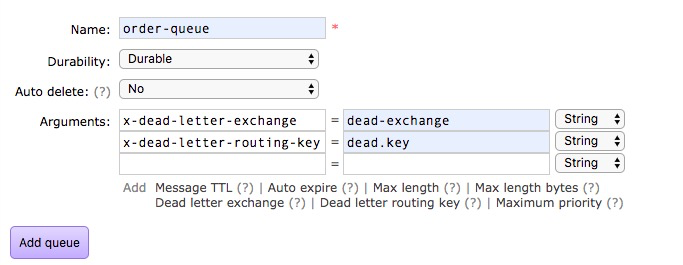

x-dead-letter-exchange ：这个参数就是指定死信队列的Exchange的名字，这个Exchange就是一个普通的Exchange，需要手工创建

x-dead-letter-routing-key ：这个参数就是指定死信队列的Routingkey，这个routingkey需要自己创建好队列和Exchange进行binding时填入

> redis的keyevent通过pub/sub机制来订阅信息的，如果sub端在pub发布信息之后订阅就会导致信息丢失，而我们的死信因为时队列所以无所谓什么时候消费

## 8. RabbitMQ镜像集群构建

我们再来看一下镜像集群的结构

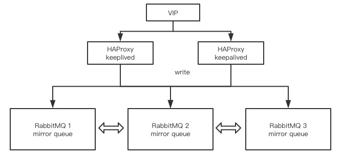

所有的RabbitMQ都是平行结构，在搭建的过程中有一个加入主机的概念

所有机器的服务和控制台都应该提前安装好

```shell
# 单机安装参考上次课程
# 0.给集群中的服务设置hostname和IP的映射
vi /etc/hostname
RMQ146
vi /etc/hosts
192.168.0.146 RMQ146
192.168.0.159 RMQ159
192.168.0.160 RMQ160
# 1.先停掉三个节点的服务
rabbitmqctl stop
# 2.进行文件同步将RMQ146上的文件复制给159和160，相当于服务中的cookie文件
scp /var/lib/rabbitmq/.erlang.cookie root@192.168.0.159:/var/lib/rabbitmq/
scp /var/lib/rabbitmq/.erlang.cookie root@192.168.0.160:/var/lib/rabbitmq/
# 3.三台机器启动服务
rabbitmq-server -detached
# 4.其他节点加入集群，相当于寻址操作，slave加入master
159: rabbitmqctl stop_app
159: rabbitmqctl join_cluster rabbit@RMQ146
159: rabbitmqctl start_app
160: rabbitmqctl stop_app
160: rabbitmqctl join_cluster rabbit@RMQ146
160: rabbitmqctl start_app
# 5.查看集群的状态，可以在任何节点上执行
rabbitmqctl cluster_status
```

> 注意：在云上操作注意开放端口，涉及端口：5672，15672，25672，4369
>
> 加入集群的时候以IP方式可能会报错：join_cluster rabbit@192.168.0.146 ，这个地方必须是hostname

**还需要一个镜像队列数据复制开通的命令**

- 将集群中所有队列设置成镜像队列，让数据进行互相复制，状态一致
- master节点上有个一个消息，其他节点上也会同步

```shell
# 在集群的任何节点执行都可以
rabbitmqctl set_policy ha-all "^" '{"ha-mode":"all"}'
```

**将节点设置成内存模式**

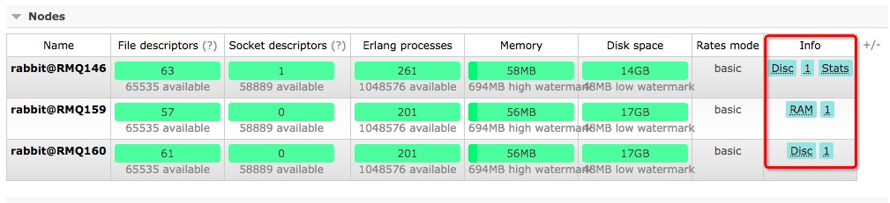

```shell
# 可以停掉服务后进行修稿
# 在需要修改的机器上
rabbitmqctl stop_app
rabbitmqctl change_cluster_node_type ram
rabbitmqctl start_app
```

**如何将节点从集群中去掉**

```shell
# 先停掉自己，在自己机器上执行
rabbitmqctl stop_app
# 去其他live的机器将刚刚停掉机器移除
rabbitmqctl forget_cluster_node rabbit@RMQ159
# 在加入集群的时候就设置成RAM模式
# 在要加入的节点上执行
rabbitmqctl join_cluster --ram rabbit@RMQ146
```

## 9. 集群核心参数配置

- tcp_listerners : 端口
- disk_free_limit : 磁盘的低水位线，高于磁盘水平线就不能写入数据了，单位是byte
  - 三台机器如果一台20G，一台15G，一台30G，他们是镜像关系，最小的机器就是磁盘的底线
- vm_memory_high_watermark : 内存的最高水位线，默认值0.4，为内存总量的40%


## 10. 镜像集群宕机恢复方式

RabbitMQ在镜像集群中，机器其实是平行关系，所有的节点都是互相复制的

**场景描述：**

A是Master

B是Slave

A正常运行，B宕机了，只需要启动B即可，B就会自动加入集群

A和B都宕机了，只要A在B之前启动就可以了

A和B都宕机了，A启动不起来了，即便是B启动了，有可以B直接启动不了啦

B和C都加入了A为Master的集群，这个时候都需要将B和C从A的集群中forget，B和C启动不起来了

```shell
# 服务都不可用的情况下，这个命令是无法执行
rabbitmqctl forget_cluster_node rabbit@RMQ146
```

RabbitMQv3.2版本以后提供了一个离线清除集群节点的命令参数，也就是节点无法启动状态下

```shell
# rabbitmq会在当前这个无法启动的节点上Mock一个虚拟节点来提供服务，实现cluster的forget
rabbitmqctl forget_cluster_node --offline rabbit@RMQ146
```

## 11. 使用HAProxy实现镜像集群负载均衡

HAProxy是一款提供高可用的负载均衡器（之前大家都是使用的Nginx居多，upstream反向代理实现负载均衡非常容易），HAProxy可以基于TCP四层（Lvs也是TCP四层的），HTTP七层（Nginx是HTTP七层）的负载均衡应用代理软件，免费高速可靠的一种LBS解决方案

HAProxy的并发连接完全可以支持以万为单位的

### 11.1. HAProxy性能最大化的原因

- 单进程，降低了上下文的切换开销和内存占用
- 单缓冲机制能以不复制任何数据的方式下完成读写操作，这会大大节约CPU时钟和内存带宽
- HAProxy可以实现零复制的零启动
- 树形存储，使用弹性二叉树
- 内存分配器在固定大小的内存池中实现即时内存分配，减少创建会话的时长

### 11.2. HAProxy和Nginx的最大区别

**Nginx**

**优点：**

1、工作在网络7层之上，可针对http应用做一些分流的策略，如针对域名、目录结构，它的正规规则比HAProxy更为强大和灵活，所以，目前为止广泛流行。

2、Nginx对网络稳定性的依赖非常小，理论上能ping通就能进行负载功能。

3、Nginx安装与配置比较简单，测试也比较方便，基本能把错误日志打印出来。

4、可以承担高负载压力且稳定，硬件不差的情况下一般能支撑几万次的并发量。

5、Nginx可以通过端口检测到服务器内部的故障，如根据服务器处理网页返回的状态码、超时等，并会把返回错误的请求重新提交到另一个节点。

6、不仅仅是优秀的负载均衡器/反向代理软件，同时也是强大的Web应用服务器。可作为静态网页和图片服务器，在高流量环境中稳定性也很好。

7、可作为中层反向代理使用。

**缺点：**

1、适应范围较小，仅能支持http、https、Email协议。

2、对后端服务器的健康检查，只支持通过端口检测，不支持url来检测

3、负载均衡策略比较少：轮询、权重、IP_hash、url_hash

**HAProxy**

**优点：**

1、HAProxy是支持虚拟主机的，可以工作在4、7层(支持多网段)

2、HAProxy的优点能够补充Nginx的一些缺点，比如支持Session的保持，Cookie的引导；同时支持通过获取指定的url来检测后端服务器的状态。

3、HAProxy跟LVS类似，本身就只是一款负载均衡软件；单纯从效率上来讲HAProxy会比Nginx有更出色的负载均衡速度，在并发处理上也是优于Nginx的。

4、HAProxy支持TCP协议的负载均衡转发，可以对MySQL读进行负载均衡，对后端的MySQL节点进行检测和负载均衡。

5、HAProxy负载均衡策略非常多，HAProxy的负载均衡算法现在具体有如下8种

- roundrobin：轮询
- leastconn：连接数最少的服务器优先接收连接
- static-rr：每个服务器根据权重轮流使用
- source：对请求源IP地址进行哈希
- uri：表示根据请求的URI左端（问号之前）进行哈希
- url_param：在HTTP GET请求的查询串中查找<param>中指定的URL参数，基本上可以锁定使用特制的URL到特定的负载均衡器节点的要求
- hdr(name)：在每个HTTP请求中查找HTTP头<name>，HTTP头<name>将被看作在每个HTTP请求，并针对特定的节点；如果缺少头或者头没有任何值，则用roundrobin代替
- rdp-cookie（name）：为每个进来的TCP请求查询并哈希RDP cookie<name>；该机制用于退化的持久模式，可以使同一个用户或者同一个会话ID总是发送给同一台服务器。如果没有cookie，则使用roundrobin算法代替

**缺点：**

1、不支持POP/SMTP协议

2、不支持SPDY协议

3、不支持HTTP cache功能。现在不少开源的lb项目，都或多或少具备HTTP cache功能。

4、重载配置的功能需要重启进程，虽然也是soft restart，但没有Nginx的reaload更为平滑和友好。

5、多进程模式支持不够好

### 11.3. 安装HAProxy

HAProxy+Keepalived（负载均衡节点的高可用）

```shell
# 安装依赖
yum -y install gcc gcc-c++
# 下载安装包
wget https://www.haproxy.org/download/1.6/src/haproxy-1.6.15.tar.gz
# 解压
tar -zxvf haproxy-1.6.15.tar.gz -C /usr/local/
# 进入安装目录
cd /usr/local/haproxy-1.6.15/
# 安装 linux31可以使用 uname -r 查看
make TARGET=linux31 PREFIX=/usr/local/haproxy
make install PREFIX=/usr/local/haproxy
mkdir /etc/haproxy

# 赋权用户和组授权
groupadd -r -g 149 haproxy
useradd -g haproxy -r -s /sbin/nologin -u 149 haproxy

# 核心配置文件的创建
touch /etc/haproxy/haproxy.cfg
```

### 11.4. haproxy.cfg配置文件编写

```shell
global
    log 127.0.0.1 local0 info  # 日志存储到127.0.0.1,以local0输入info级别
    maxconn 4096 # 最大连接数,要考虑到ulimit -n的大小限制
    chroot /usr/local/haproxy   # haproxy的安装目录
    user haproxy
    group haproxy
    daemon
    nbproc 2 # 进程数
    pidfile /var/run/haproxy.pid # pid文件位置

defaults
    log global
    mode tcp # 使用tcp4层代理模式
    option tcplog
    option dontlognull
    retries 3
    # 在使用基于cookie定向时，一旦后端某一server宕机时，会将会话重新定向至某一上游服务器，必须使用的选项
    option redispatch
    maxconn 4096
    timeout connect 5s
    timeout client 60s #客户端空闲超时时间
    timeout server 15s #服务端超时时间

listen rabbitmq_cluster
    bind 0.0.0.0:5672
    mode tcp
    balance roundrobin #采用轮询机制,还可以是其他的负载均衡方式
		#rabbitmq集群节点配置,inter每隔3秒对MQ集群做健康检查,
    server RMQ164 192.168.0.164:5672 check inter 3000 rise 2 fall 2
    server RMQ165 192.168.0.165:5672 check inter 3000 rise 2 fall 2
#配置haproxy web监控,查看统计信息
listen stats
    bind 192.168.0.168:8999 #这里得配置内网IP，然后用外网IP访问即可
    mode http
    option httplog
    stats enable
    #设置haproxy监控地址为http://39.101.209.123:8999/rabbitmq-stats
    stats uri /rabbitmq-stats
    stats refresh 3s
```

将上面的配置文件内容放入 /etc/haproxy/haproxy.cfg中

启动HAProxy

```shell
# 进入安装目录
cd /usr/local/haproxy/sbin
./haproxy -f /etc/haproxy/haproxy.cfg
```

## 12. 使用Federation跨机房多活集群模式

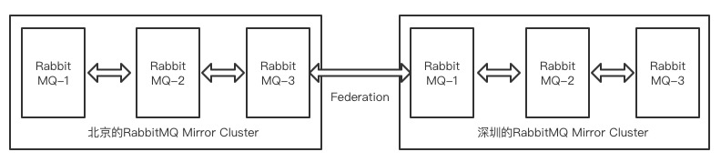

```shell
# 首先准备两个非集群节点
rabbitmq-plugins list
# rabbitmq_federation               
# rabbitmq_federation_management
# 两台联通的机器都要启动这两个插件
rabbitmq-plugins enable rabbitmq_federation
rabbitmq-plugins enable rabbitmq_federation_management
```

启用成功后可以到控制台进行验证

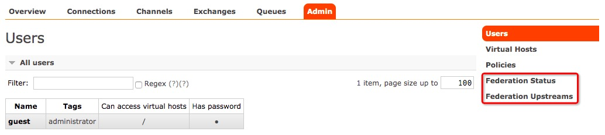

通过federation的配置来进行数据通道搭建

这个时候你需要自己定义一个上游节点upstream(166节点)，一个下游节点downstream(167节点)，federation是单向发送的，相当于消息发送到upstream的一个exchange上，然后转发到downstream的queue上

**1、**在下游节点创建一个exchage和一个queue和binding的routingkey，用来进行数据接收

**2、**在下游节点建立federation upstream规则和上游节点进行数据同步

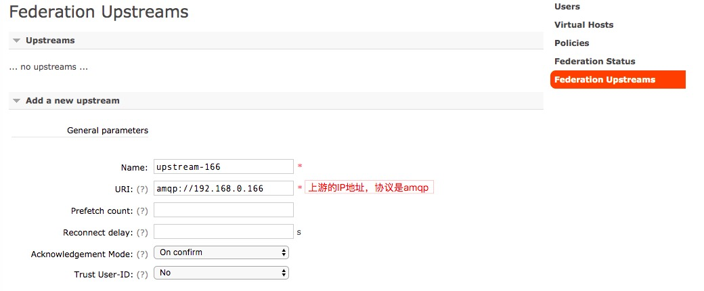

**3、**进入下游节点的federation status没有任何数据，需要建立策略来保证通道连通

**4、**进入下游节点的Policy菜单，Pattern是个正则表达式，这里表示以down开头的exchange和queue都匹配

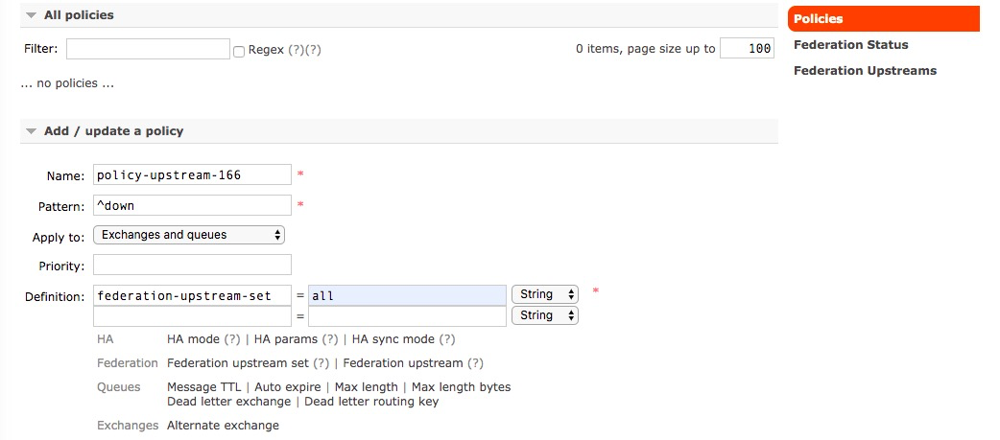

**5、**这个时候看exchange和queue，规则就应用上了

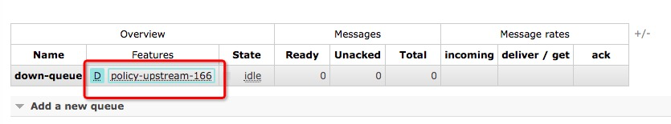

**6、**这个时候去federation status看，发现上游连接已经连接上了

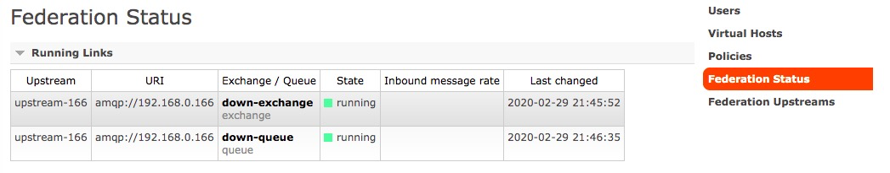

**7、**这个时候我们先去看上游的overview

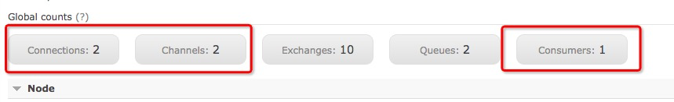

**8、**再看上游的exchange和queue就已经根据下游配置的upstream和policy规则将exchange和queue创建好了


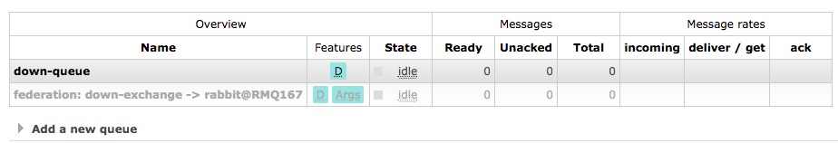

灰色的这个重定向exchange不能发送消息，如果要发送则在down-exchange上进行发送

**9、**我们在上游的down-exchange发送一条消息，进行测试

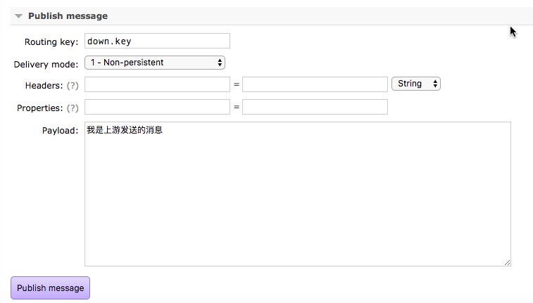

可以在下游查看这条消息

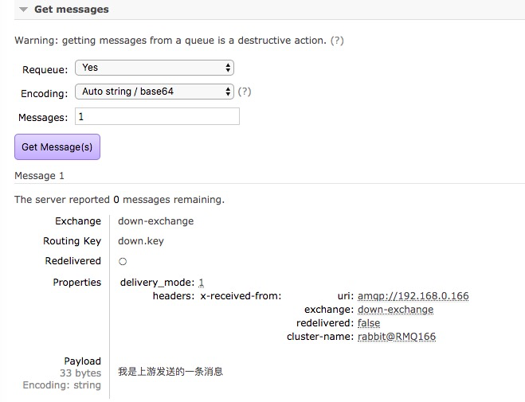

**10、**因为上游及节点只是一个中转，如果上游及诶单也要消息down-exchange里的消息怎么办？

只需要在本地建立一个binding关系就好

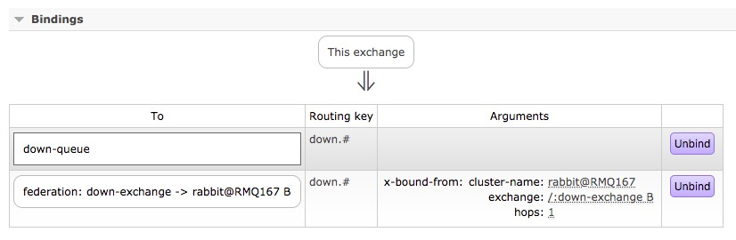

## 13. 上下游数据的消费是否互相影响

上游同时接收到的数据消费后不影响下游发送过过去的信息

## 14. 消息延迟发送机制的实现

delay的应用场景：用户下了个单，30分钟后如果没有支付，我就将订单关闭，5分钟一轮询（29分钟+5）

### 14.1. 通过死信队列来实现

在消息发送的时候设置消息的TTL，并将该消息发送到一个没有人消费的队列上，将这个没有人消费的队列配置成死信触发队列：x-dead-letter-exchange、x-dead-letter-routing-key 当消息超过TTL后转发发给一个具体的执行队列，这个执行队列的消息需要监听和消费，当消息一进来就消费掉，这个消息的TTL就是delay的时长

### 14.2. 通过延时插件实现消息延时发送

#### 14.2.1. 延时插件的配置

```shell
# 这个插件默认是不带的，需要下载，需要确保大版本和rabbitmq一致
wget https://dl.bintray.com/rabbitmq/community-plugins/3.6.x/rabbitmq_delayed_message_exchange/rabbitmq_delayed_message_exchange-20171215-3.6.x.zip
unzip rabbitmq_delayed_message_exchange-20171215-3.6.x.zip
mv rabbitmq_delayed_message_exchange-20171215-3.6.x.ez /usr/lib/rabbitmq/lib/rabbitmq_server-3.6.5/plugins/
# 解压并移动到plugins目录后先看一下是否成功,插件是热加载的,不用停服务
rabbitmq-plugins list
rabbitmq-plugins enable rabbitmq_delayed_message_exchange
```

应用完毕后看是否加载成功，去控制台看add exchange，是否有延迟交换机了

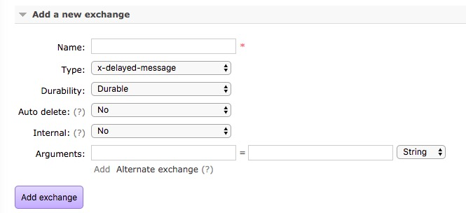

**注意：如果是集群需要所有机器都加载这个插件**

#### 14.2.2. 创建延时交换机

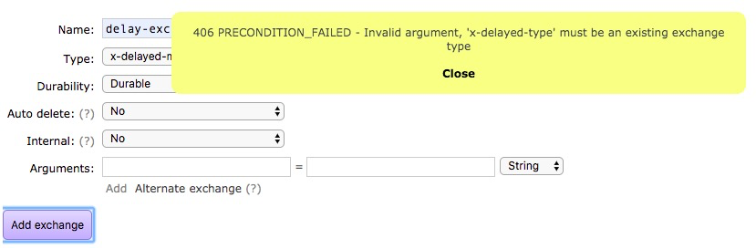

出现的提示意思是需要你通过arguments来指定延迟交换机的type匹配类型

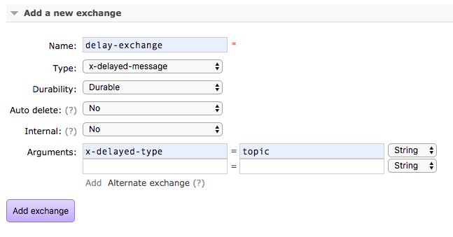

#### 14.2.3. 创建延时消息

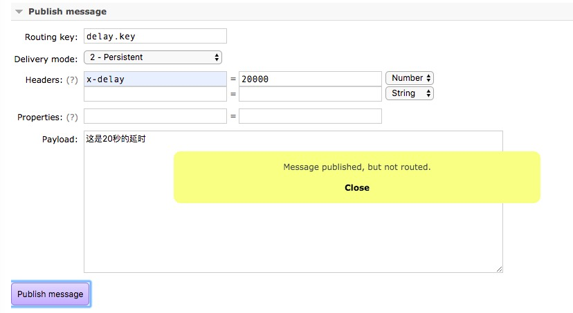

20秒后数据是能进入队列的，为什么提示not routed？

因为是延时队列，是发送到exchange成功了，但还没有到时间的时候exchange没有进行routing操作

## 15. springboot实现延时信息的收发

**接收方**

```java
import com.icoding.basic.po.OrderInfo;
import com.rabbitmq.client.Channel;
import org.springframework.amqp.rabbit.annotation.*;
import org.springframework.amqp.support.AmqpHeaders;
import org.springframework.messaging.handler.annotation.Headers;
import org.springframework.messaging.handler.annotation.Payload;
import org.springframework.stereotype.Component;
import java.util.Map;

@Component
public class OrderReceiver {

    int flag = 0;

    @RabbitListener(bindings = @QueueBinding(
            value = @Queue(value = "delay-queue-other",durable = "true",autoDelete = "false"),
            exchange = @Exchange(value = "delay-exchange-other",durable = "true",type = "x-delayed-message",arguments = {
                    @Argument(name = "x-delayed-type",value = "topic")
            }),
            key = "delay.#"
        )
    )
    @RabbitHandler
    public void onOrderMessage(@Payload OrderInfo orderInfo, @Headers Map<String,Object> headers, Channel channel) throws Exception{
        System.out.println("************消息接收开始***********");
        System.out.println("Order Name: "+orderInfo.getOrder_name());
        Long deliverTag = (Long)headers.get(AmqpHeaders.DELIVERY_TAG);
        //ACK进行签收，第一个参数是标识，第二个参数是批量接收为fasle
        //channel.basicAck(deliverTag,false);
        //前两个参数和上面一样，第三个参数是否重回队列
        channel.basicAck(deliverTag,false);
    }
}
```

**发送方**

```java
import com.icoding.basic.po.OrderInfo;
import org.springframework.amqp.AmqpException;
import org.springframework.amqp.core.Message;
import org.springframework.amqp.core.MessagePostProcessor;
import org.springframework.amqp.rabbit.connection.CorrelationData;
import org.springframework.amqp.rabbit.core.RabbitTemplate;
import org.springframework.beans.factory.annotation.Autowired;
import org.springframework.stereotype.Component;

@Component
public class OrderSender {

    @Autowired
    RabbitTemplate rabbitTemplate;

    public void sendOrder(OrderInfo orderInfo) throws Exception{
        /**
         * exchange: 交换机名字
         * routingkey: 队列关联的key
         * object: 要传输的消息对象
         * correlationData: 消息的唯一id
         */
        CorrelationData correlationData = new CorrelationData();
        correlationData.setId(orderInfo.getMessage_id());
        MessagePostProcessor messagePostProcessor = new MessagePostProcessor() {
            @Override
            public Message postProcessMessage(Message message) throws AmqpException {
                message.getMessageProperties().getHeaders().put("x-delay",20000);
                return message;
            }
        };
        rabbitTemplate.convertAndSend("delay-exchange-other","delay.key",orderInfo,messagePostProcessor,correlationData);
    }
}
```


## 16. 什么是生产端的可靠性投递

**消费端：**之前在做消费端的消息确认的时候有ACK和NACK的机制，来确保消息的消费应答

**生产端：**provider将消息发送给broker，在这个环节如何保证消息的可靠投递

如果因为投递不成功，那么消息的消费就更无从谈起

**如何做到可靠性投递**

- 首先要保障消息的成功发出
- 保障MQ节点（Broker）的成功接收
- 发送端发送消息后也要有一个broker确认应答
- 完善的消息补偿机制
  - 如果要保证100%消息投递成功，就必须要有补偿机制
  - 补偿就需要知道消息发送是否成功的状态
  - 消息发送失败后，需要考虑重发或其他方式

**生产端的可靠性投递，解决就是保证消息要到达消息队列中**

## 17. 常用的可靠性投递方案有哪些

- 第一种：对消息状态进行标记
  - 将消息的内容和消息的状态计入到DB中，比如发送中，发送成功
  - 对于没有发送成功的进行轮询操作，然后重试
  - 重新发送需要考虑消息的异常重发次数，如果异常一直存在，那么消息不停的发送就会占用服务带宽和计算资源，这个时候就需要将消息不再补偿了
- 第二种：通过消息的延迟投递，做二次确认，回调检查

##  18. 可靠性方案一：消息落库进行状态标记保证可靠投递

**可靠性方案流程设计图**

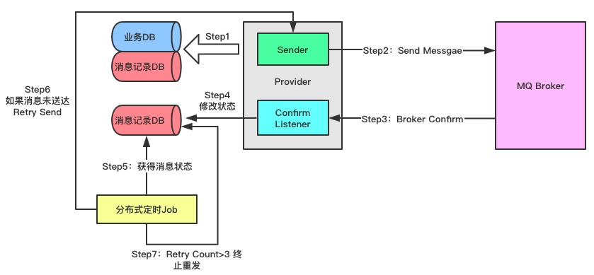

0、一开始要有一个业务DB和MQDB（记录你消息体内容和消息状态的数据库，你自己创建的），前期如果系统规模比较小，就可以合并，MQ记录只是数据库中的一张表

1、第一步将orderInfo进行业务数据的落库，

2、第二步业务落库后就通过Sender发送消息给Broker，发送消息后就将消息体和消息状态记录到MQDB中（发送中，发送完成），并且会接收到Broker返回的消息投递确认状态（需要代码支持）

3、第三步消息发送方接收Broker返回的消息和网络状态的异常

4、第四步，如果消费发送确认失败应该调用业务来将MQDB消息的状态**更新为发送失败**，如果发送状态成功就将MQDB中的记录更新为成功

5、第五步，使用分布式定时Job来对我们的消息进行判断，只要是消息状态不是我们发送成功的都需要进行重新发送

6、第六步，定时Job可以直接将没有发送成功的消息体从MQDB中取出来给到Sender来进行重新发送，如果我们刚发送了一个消息，还没有接收到消息确认并修改消息状态时，**这个时候刚好轮询拿出这一条消息，这就需要对发送的消息做一个重试的时间间隔的验证（消息记录在落库的时候需要记录发送时间），记录拿出来之后根据发送时间和当前时间计算超过一个间隔时间长度才重新发送**

7、还有一种极端的情况，routingkey被不小心删除了，肯定无法投递成功，这个时候就需要有个重试次数了，需要在消息的记录里有一个字段做计数器，重试一次加1一次，在进行重试的时候需要判断这个重试计数器，如果重试计数器大于我们要求的重试数量，就需要再更新一个字段（重试超次数的字段），如果这个字段状态为1，我们也不再进行重试，**每次触发重试后都需要将发送时间更新成最新的时间**，确保下次拿到这个数据时和当前时间比对时间间隔不会因为这个而重复发送

8、人工补偿：对于这些重试次数超过还没有发送成功的消息，就需要统计出来进行人工分析和补偿了

9、还需要消费端进行消息的NACK重回队列策略

10、消费端也需要将消息状态进行同步到MQDB中，如果成功就更新消息状态为接收成功，如果超过重试次数则更新状态为消费重试超标，这个消费超标的状态也需要最后统计出来进行人工补偿

11、至此方案一的发送和消费的100%可靠投递方案就完成

**这个方案有什么问题吗？**

- MQDB如果使用MySQL或其他的数据库进行存储，就导致数据量很大，数据库压力，导致时效性差
- 轮询查询的时候由于发送状态他的变化不大，所以数据会查询比较慢，这个时候就需要将发送成功的数据定期归档

## 19. 可靠性方案二：消息延迟投递，二次确认保证可靠投递

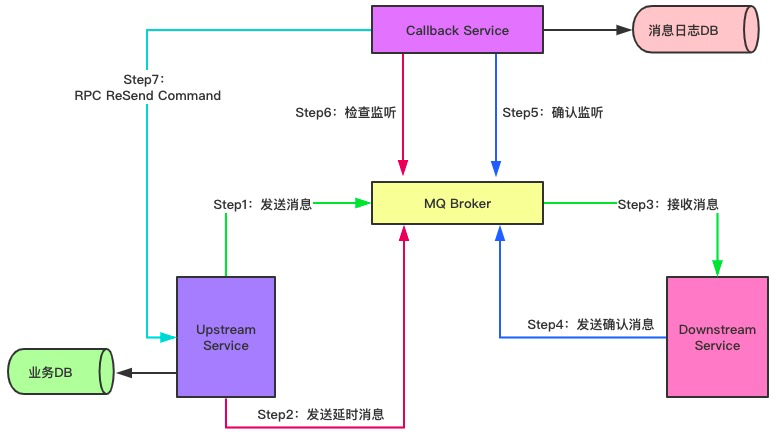

**方案二和方案一的核心区别在于：有消息的上下游了**

**Upstream是生产端、Downstream是消费端**

0、首先还是业务数据先落库

1、业务数据落库完成开始我们的发送，将消息发送给下游消费者

2、当发送业务消息的同时发送一个延时业务消息（这个延时的长度取决于你认为的消息需要执行时间间隔）这个延时业务消息的内容和业务消息是要基本一致的

3、下游消费端接收消息

4、当下游消费端接收消息并完成消费后会发送一个新的消息给Broker

5、外部有一个callback service来接收下游发送的消费确认成功的消息

6、callback service接收到下游发送的消费确认成功的消息后会将消息消费的成功状态记录进消息日志DB中

7、这个时候恰巧延时消息到了callback service触发他的检查服务，根据这个消息的id去消息日志DB中查询是否消费成功了，如果消息日志DB中消息消费成功则完成此次消息发送

8、如果callback service检查监听没有发现消息执行成功的记录则会给消息发送的上游调用RPC来做Retry

9、如果进行Retry，要么retry的时候就把消息体带上，要没从数据库中查询数据然后进行重新发送并发送延时消息

10、如果重试一直不成功，这个时候就可以通过callback service结合消息日志DB来做消息重试的记录，如果超过我们的要求数量就不再调用Retry

11、人工补偿：在消息日志DB中把重试次数超过我们要求的记录导出进行补偿

**这个方案直接将发送和消费一并进行了可靠性投递保障**

## 20. 生产环境中消费端如何接收多个队列的消息

我们的消息队列就相当于一个数据暂存的容器，有点像一个表，正常使用中会在系统代码中创建交换机和队列吗？

一般不会在代码里创建，直接在消息队列控制台或提前创建好

还有一个问题：我们之前是使用的一个序列化的对象来存储消息体内容的，实际工作中为了降低消息的复杂度，一般使用json格式的字符串进行传输，两端约定好json的格式然后解析就好

**消息按照字符串来接收，如果一个消费端需要接收多个队列的消息可以创建多个实现类**

```java
import com.rabbitmq.client.Channel;
import org.springframework.amqp.rabbit.annotation.*;
import org.springframework.amqp.support.AmqpHeaders;
import org.springframework.messaging.handler.annotation.Headers;
import org.springframework.messaging.handler.annotation.Payload;
import org.springframework.stereotype.Component;
import java.util.Map;

@Component
public class OrderReceiver {


    @RabbitListener(queues = "order-queue-1")
    @RabbitHandler
    public void onOrderMessage(@Payload String orderInfo, @Headers Map<String,Object> headers, Channel channel) throws Exception{
        System.out.println("************消息接收开始***********");
        System.out.println("Order Info: "+orderInfo);
        Long deliverTag = (Long)headers.get(AmqpHeaders.DELIVERY_TAG);
        channel.basicAck(deliverTag,false);
    }
}
```

## 21. 消息发送端如何接收交换机返回的回调应答的

yaml要加入一些新的参数配置，需要打开确认响应开关

```yaml
spring:
  rabbitmq:
    host: 39.98.151.138
    username: guest
    password: guest
    virtual-host: /
    connection-timeout: 15000
    publisher-confirms: true
    publisher-returns: true
    template:
      mandatory: true
```

发送消息的ConfirmCallback和ReturnCallback使用

```java
import org.springframework.amqp.core.Message;
import org.springframework.amqp.rabbit.connection.CorrelationData;
import org.springframework.amqp.rabbit.core.RabbitTemplate;
import org.springframework.amqp.rabbit.core.RabbitTemplate.ConfirmCallback;
import org.springframework.amqp.rabbit.core.RabbitTemplate.ReturnCallback;
import org.springframework.beans.factory.annotation.Autowired;
import org.springframework.stereotype.Component;

@Component
public class OrderSender {

    @Autowired
    RabbitTemplate rabbitTemplate;

    public void sendOrder(String orderInfo,String message_id) throws Exception{
        /**
         * exchange: 交换机名字
         * routingkey: 队列关联的key
         * object: 要传输的消息对象
         * correlationData: 消息的唯一id
         */
        CorrelationData correlationData = new CorrelationData();
        correlationData.setId(message_id);
        //设置callback内容
        rabbitTemplate.setConfirmCallback(confirmCallback);
        rabbitTemplate.setReturnCallback(returnCallback);
        rabbitTemplate.convertAndSend("order-exchange-2","order.3.key",orderInfo,correlationData);
    }
    //exchange返回调用
    final ConfirmCallback confirmCallback = new ConfirmCallback() {
        @Override
        public void confirm(CorrelationData correlationData, boolean b, String s) {
            System.out.println("==========消息publish成功的ID: " + correlationData.getId());
            System.out.println("==========消息是否发布成功: " + b);
            System.out.println("==========失败的异常信息: " + s);
        }
    };

    final ReturnCallback returnCallback = new ReturnCallback() {
        @Override
        public void returnedMessage(Message message, int replayCode, String replayText, String exchange, String routingkey) {
            System.out.println("******replayCode: "+replayCode);
            System.out.println("******replayText: "+replayText);
            System.out.println("******exchange: "+exchange);
            System.out.println("******routingkey: "+routingkey);
        }
    };
}
```

## 22. 消费端幂等性问题解决

无论消息端接收到多少一样的消息，都只产生一个消费结果

为了确保发送端的投递成功，我们都会进行消息的补偿，有可能消息补偿的过程中会多发送几次消息导致重复

这个时候就需要提前考虑消费端的幂等问题

**消费端的幂等性保障方案**

- 唯一ID+业务码在数据库中做主键来做去重
- 为执行的内容做前置条件，类似MySQL的version乐观锁
- 利用Redis的原子性去实现

**唯一ID+业务码在数据库中做主键来做去重**

- 利用的数据库里的主键约束
  - 会对数据库产生异常压力
  - 如果业务量并发较大会导致数据库夯住
- 优点：实现简单方便
- 缺点：高并发下数据库就会成为瓶颈
- 缺陷：只能用来做insert的幂等
- 解决方案：将ID进行分库分表通过hash路由的算法将压力分摊到多个数据库中

**为执行的内容做前置条件**

- 给数据更新前增加一个前置的条件
- 你的操作不是原子隔离的，当你的查询前置条件和更新的过程中有可能其他线程已经更新完成了
- 需要将拿到的前置条件做为更新的条件之一来做操作，如果在你之前已经更新了这个前置条件，那么你的更新就会不成功

**利用Redis的原子性去实现**

- 这里就涉及分布式锁的概念了
- 第一个进入并拿到锁的线程，在锁内部先判断是否已消费，如果没有消费则操作并记录这个消息ID已消费
- 并发过程中的线程如果拿不到锁，就直接中止消费，如果有延时消息过来，这个线程能拿到锁，但拿到后要去查询这个Measge_ID是否消费过，如果已经消费了，就中止消费

## 23. 消费端的消息可靠性如何保障

消费端面向的是消息队列中已经有的消息

- 如果消费端监听消费成功，并手动发送ACK响应，那么这个消息就肯定完成了消费
- 如果出现异常可以通过NACK将消息重回队尾变成Ready状态然后再次消费
- 可以通过NACK来进行Retry和重试次数验证，并且在验证的过程中如果超过次数就将这个消息发送到一个人工补偿消息队列或持久化对象中等待人工补偿