[TOC]

##  目录

- [1. 分布式消息队列应用场景分析](#1-分布式消息队列应用场景分析)
- [2. 分布式消息队列应用需要思考的问题](#2-分布式消息队列应用需要思考的问题)
- [3. 主流消息队列分析及选型](#3-主流消息队列分析及选型)
- [4. ActiveMQ集群架构原理分析](#4-ActiveMQ集群架构原理分析)
- [5. RabbitMQ集群架构原理解析](#5-RabbitMQ集群架构原理解析)
- [6. RocketMQ集群架构原理解析](#6-RocketMQ集群架构原理解析)
- [7. kafka高性能原因分析](#7-kafka高性能原因分析)

# 分布式消息队列架构设计分析

## 1. 分布式消息队列应用场景分析

ActiveMQ、RabbitMQ、RocketMQ、zeroMQ、kafka

- RabbitMQ
- kafka

**消息队列的应用场景分析**

- 异步缓冲

  - 有一些业务是可以通过异步来操作的，只要做到最终一致性而不是强一致性，就可以通过MQ来做

  - 场景举例：用户在平台上注册了账号，会发邮件和短信通知

    - 串行处理

      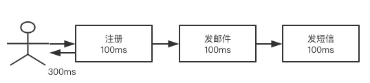

    - 并行处理

      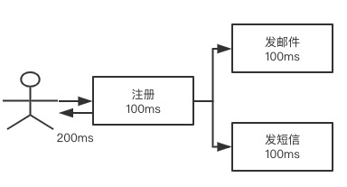

    消息队列解决这个问题

    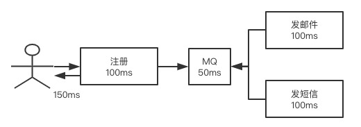

- 服务解耦

  - 服务强依赖：将服务解耦后通过dubbo或springcloud进行服务的直连和访问都是强依赖

  - 服务弱依赖：服务间的消息通过一种中间件来进行缓存，然后再使用

    - 不代表弱依赖就可以失败
    - 一定要保证上游消息的可靠投递

  - 场景描述

    订单系统----库存系统（进行库存的设置）

    强依赖模式：

    1、假如库存系统无法访问，订单扣减库存就会失败，导致数据不一致

    2、如果你同新启动线程来保证时效，不能保证这个线程成功执行

    通过消息队列解决

    订单将信息写入--->MQ（只需要保证写入是100%的可靠）

    库存系统读取--->MQ

    通过消息队列解决问题，所有的数据都是一个弱一致性的过程，只要能确保某个节点或时间点单位数据最终一致即可

- 削峰填谷

  - 当我们的下游服务处理不过来的时候，就可以将这些消息缓存在一个地方，逐步处理
  - 将短暂一段时间的业务挤压在后面非业务高峰期逐步执行完，就是削峰填谷的过程
  - **场景说明：秒杀**

  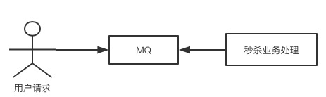

- 消息通讯

  - 点对点的消息通讯

    A只能发给B，相当于私聊（redis里的list）

  - 发布订阅的方式

    A可以发布给所有订阅了这个消息的用户，相当于聊天室（redis pub/sub）

## 2. 分布式消息队列应用需要思考的问题

- 消息发布端的可靠性投递
  - 如果业务和钱相关，这个消息就一定不能丢失
  - 需要做到消息生产端的100%投递，就一定要有消息的补偿机制
- 消费端的幂等
  - 生产端做到可靠性投递，就可能会重复投递消息
  - 消费端消费了两次或多次同一个数据，就可能会导致数据不一致
  - 随意无论消费端重复消费多少次，都应该只能有一个结果
- MQ本身需要考虑的内容
  - HA：高可用
  - 低延迟：虽然MQ是用于弱依赖，也不能因为MQ导致延迟过大
  - 可靠性：数据是否完整
  - 堆积能力：这个MQ是否能够扛下你的业务量级
  - 扩展性：是否能够支持横向扩展

## 3. 主流消息队列分析及选型

### 3.1. 业界流行的消息队列

- ActiveMQ
  - 比较经典，时间比较久的一款MQ
  - apache旗下的
- RabbitMQ
  - Rabbit科技公司开发的MQ
  - 使用erlang开发的
- RocketMQ
  - alibaba开源的一款MQ
  - 也交给apache，也是Java开发的
- kafka
  - 主要关注的是高吞吐量和海量数据存储
  - kafka是apache开发
  - 用scala和Java编写

### 3.2. 如何进行技术选型

需要关注的地方

- 各个MQ的性能特点，优缺点，相应的业务场景
  - 比如ActiveMQ适用于传统公司，不太适合高并发的、海量的业务数据场景
  - 比如RabbitMQ的横向扩展能力就不是非常强
- 集群的架构模式：分布式、可扩展、高可用、可维护性等
- 综合成本、人员学习成本
  - 如果对消息的可靠性和依赖不是特别高，就可以使用kafka
  - kafka可以在很廉价机器上有者很高的吞吐和性能表现
- 未来的规划和数据兼容的方向

## 4. ActiveMQ集群架构原理分析

JMS规范（Java Message Service），JMS只是接口，没有给予实现

- JMS
- Provider：消息生产者
- Consumer：消息消费者
- PTP：点对点模型
- Pub/Sub：发布/订阅模型
- Queue：消息队列
- Topic：主题目标
- ConnectionFactory：JMS创建链接的工厂
- Connection：JMS客户端到JMS Provider链接
- Destination：消息的目的地（dest）
- Session：会话

**消息投递模式**

- PTP：点对点模型（一发发送只有一发接收）
- Pub/Sub：发布/订阅模型（一发发送多方接收）

**ActiveMQ各项指标**

- 服务性能：大数据高并发场景下力不从心
- 数据存储：默认是用kahadb存储（索引文件形式），也可以使用google leveldb（内存数据存储）或者使用MySQL，Oracle进行消息存储
- 集群架构：ActiveMQ可以和zookeeper构建主备集群模式，或者多套主备搭建集群

**ActiveMQ的集群结构**

**Master-Slave：主备模式**

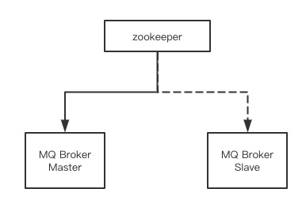

zookeeper的作用就是当master宕机，进行及时切换到slave

主备模式是无法满足分布式的

**Netword**

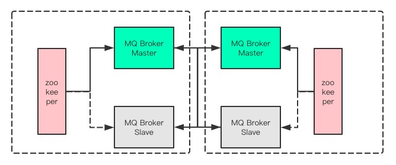

- 这种方案要有两套或多套Master-Slave集群进行搭建
- 多套集群直接相关交叉配置
- 这种方法可能会导致资源浪费

## 5. RabbitMQ集群架构原理解析

- 主备模式

  master-slave结构，可以理解为热备份，master负责读写，master宕机后就会切换到slave，对业务不会造成太大的影响，master和slave之间是通过复制（ActiveMQ是通过zookeeper）

  RabbitMQ的主备复制是通过自己内部的机制来进行

  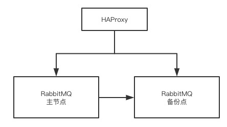

- 远程模式

  将数据传输到外部节点，当数据处理不过来时可以用这个分流一部分数据，结构简单但配置复杂，使用的不多

  主要应用的场景是：对不同数据中心进行复制时使用，可以跨地域的让两个MQ集群互联

- 镜像模式

  业界对RabbtiMQ使用比较多的架构模式

  高可以的数据复制过程

  HAProxy：就是一个专门的提供负载均衡的中间件

  keepalived：就支持VRRP的一个心跳检测工具

  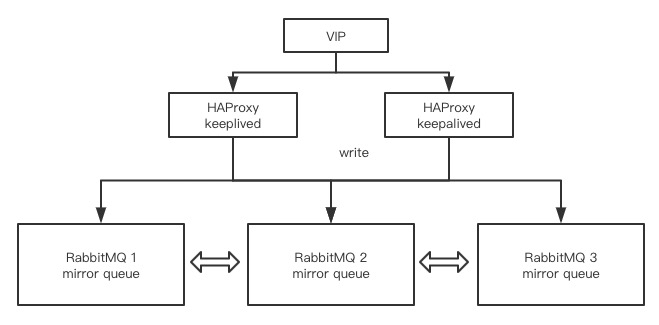

  镜像队列集群的缺陷是无法进行横向扩容，因为每个节点都是一个完整的互相复制的节点，并且镜像节点过多会使MQ负担增加，一个数据写入后复制到多个节点会使吞吐量下降

- 多活模式

  DNS：就是一个IP域名的解析服务

  LBS：负载均衡服务（Nginx、HAProxy、Lvs、SLB）

  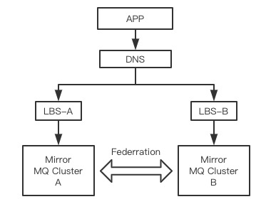

  Federation：在消息队列之间提供信息传输的高性能插件，使用AMQP协议，可以支持连接双方的不同版本

  MQ访问

## 6. RocketMQ集群架构原理解析

- 支持集群、负载均衡，水平扩展
- 亿级别的消息堆积能力
- 采用的是zeroCopy零拷贝、顺序写盘
- 用NameServer代替了zookeeper
- 集群的架构模型
  - 单点模式
  - 主从模式
  - 双主模式
  - 多主多从模式

## 7. kafka高性能原因分析

**Kafka的介绍**

- kafka是linkedIn开源的分布式消息系统，归给Apache的顶级项目
- kafka主要特点是基于Pull的模式来处理消息的消费的，追求高吞吐量，一开始的目的就是来做日志传输的收集的
- kafka不支持事务，对消息的丢失，错误没有太严格的要求
- 高并发业务场景很好有用到事务的

**kafka的特点**

- 跨平台
- 分布式
- 实时性
- 伸缩性

**kafka高性能的原因**

- 顺序写：顺序写磁盘，可以提供磁盘的利用率
- Page Cache：来提升吞吐量
- zeroCopy
- 后台的异步操作，主动Flush
- 预读的策略，IO的调度

**Page Cache**

- Page Cache是OS实现的一种主要的磁盘缓存机制，以此来减少对磁盘I/O的操作
- 将磁盘文件缓存到内存中（MySQL->Redis）
- 如果要从磁盘中读取1.txt，OS不是直接到磁盘而是到PageCache，如果PageCache里有就拿走了，如果没有就向磁盘发出请求，通过I/O获取数据，获取数据后先放入PageCache然后再给需要的请求
- 写入数据的时候先判单PageCache里有没有，没有先写入PageCache，然后OS将PageCache的数据刷到磁盘中（MySQL-Redis，先写MySQL后写Redis）

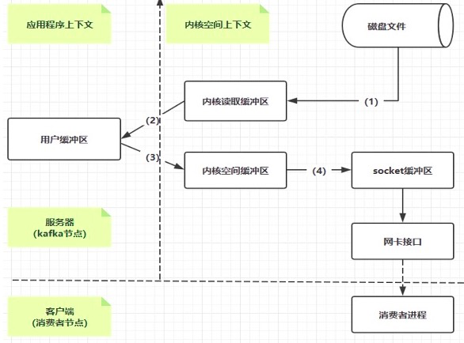

**ZeroCopy**

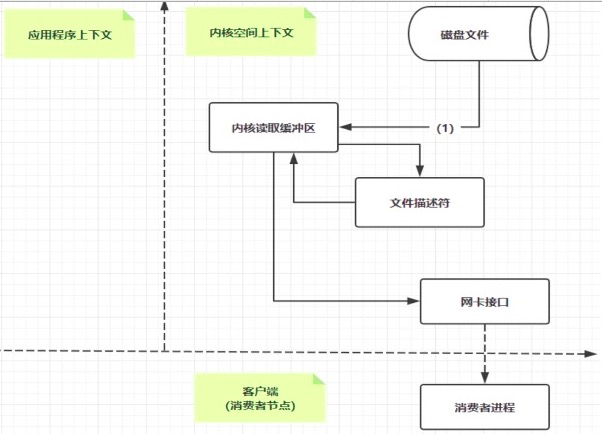

零拷贝其实就是将磁盘文件主机copy到内存中传输给socket而省去中间在磁盘内存中来回拷贝复制的过程，降低了上下文切换的过程，大大提高了应用程序的性能

**Kafka的集群模式**

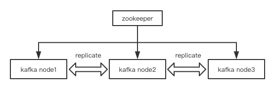

- 通过zookeeper来实现集群的配置
- 大部分都是内存级别的副本复制，磁盘是异步做的一个备份

