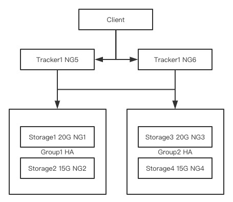

[TOC]

## 目录

- [1、后台管理系统架构设计](#1后台管理系统架构设计)
- [2、产品管理业务代码实现](#2产品管理业务代码实现)
- [3、FastDFS分布式文件系统实现文件存储](#3FastDFS分布式文件系统实现文件存储)
- [4、Springboot整合FastDFS](#4Springboot整合FastDFS)
- [5、搭建FastDFS分布式文件系统集群](#5搭建FastDFS分布式文件系统集群)


## 后台管理系统搭建&FastDFS

### 1、后台管理系统架构设计

#### 1.1. 业务架构分析

业务核心特点：

- 业务逻辑核心是围绕产品管理，订单管理，对接WMS
- 首页轮播管理
- 基于订单的报表系统
- 员工权限管理，操作轨迹记录
- 客户信息管理，收货地址管理
- 文件信息管理
- 定时任务管理，外围的邮件，提醒服务

系统的功能展示特征：

- 多以表单，表格，菜单，列表，报表形式展示
- 功能交互单一，所见即所得

业务架构的拆解

- 产品管理
  - 集合
  - 产品信息
  - 产品图片
  - 产品特征
- 订单管理
  - 订单信息汇总
  - 订单的地址修改
  - 订单操作记录
- 员工信息管理
- 权限管理
  - 菜单管理
  - 角色管理
- 客户信息管理

#### 1.2. 应用架构分析

拆分module

- im-admin-web：鉴权，权限管理，员工管理，thymeleaf
- im-product-manage
- im-order-manage
- im-customer-manage
- im-file-manage：fastDFS / OSS / S3

#### 1.3. 技术架构分析

- Springboot
- mybatis/tk-mapper/mybatis-plus
- thymeleaf
- shiro/springsecurity
- fastDFS/OSS

#### 1.4 数据架构分析

- MySQL 1主2从架构
- binlog=row
- slowlog=3s
- 定时mysqldump
- 1从实时HA，1从延时2小时

### 2、产品管理业务代码实现

代码在GitHub上下载

[https://github.com/scdzyc/icodingedu-mall-study](https://github.com/scdzyc/icodingedu-mall-study)

### 3、FastDFS分布式文件系统实现文件存储



1、gcc基础环境安装

```shell
#tracker,storage机器 都需要安装
yum -y install gcc automake autoconf libtool make
yum -y install gcc gcc-c++
```

2、libfastcommon安装

```shell
#tracker,storage机器 都需要安装
cd /usr/local/src
wget https://github.com/happyfish100/libfastcommon/archive/master.zip
yum -y install unzip
unzip master.zip
cd libfastcommon-master
./make.sh && ./make.sh install

ln -s /usr/lib64/libfastcommon.so /usr/local/lib/libfastcommon.so
ln -s /usr/lib64/libfdfsclient.so /usr/local/lib/libfdfsclient.so
ln -s /usr/lib64/libfdfsclient.so /usr/lib/libfdfsclient.so
```

3、FastDFS文件安装

```shell
#tracker,storage机器 都需要安装
cd /usr/local/src
wget https://github.com/happyfish100/fastdfs/archive/master.zip
unzip master.zip
cd fastdfs-master
./make.sh && ./make.sh install
```

检查两个脚本，将/usr/local/bin修改为/usr/bin

```shell
vi /etc/init.d/fdfs_storaged  #/usr/local/bin修改为/usr/bin
vi /etc/init.d/fdfs_trackerd  #/usr/local/bin修改为/usr/bin
```

4、配置跟踪器tracker

```shell
#创建tracker的数据文件/日志目录
mkdir /usr/local/mydata
cd /etc/fdfs
cp tracker.conf.sample tracker.conf
vi tracker.conf
#修改配置如下
disabled=false #启用配置文件
port=22122 #设置tracker的端口号
base_path=/usr/local/mydata #设置tracker的数据文件和日志目录
http.server_port=8080 #设置http端口号HTTP port on this tracker server

#启动tracker服务
/usr/bin/fdfs_trackerd /etc/fdfs/tracker.conf start #restart
```

5、配置存储器storage

```shell
#创建存放storage 数据/日志文件目录
mkdir /usr/local/mydata
cd /etc/fdfs
cp storage.conf.sample storage.conf
vi storage.conf
#修改配置如下
disabled=false #启用配置文件 
group_name=group1 #组名，根据实际情况修改，集群分组
port=23000 #设置storage的端口号
base_path=/usr/local/mydata #设置storage的日志目录
store_path_count=1 #存储路径个数，需要和store_path个数匹配 
store_path0=/usr/local/mydata #存储路径，配置多块硬盘会用到
tracker_server=192.168.0.112:22122 #tracker服务器的IP地址和端口号
http.server_port=8888 #设置http端口号the port of the web server on this storage server

#启动
/usr/bin/fdfs_storaged /etc/fdfs/storage.conf start
```

6、FastDFS本机测试

```shell
cd /etc/fdfs
cp client.conf.sample client.conf
vi /etc/fdfs/client.conf
#修改配置文件
base_path=/usr/local/mydata
tracker_server=192.168.0.112:22122 #文件通过tracker上传
#/usr/bin/fdfs_test client.conf地址 upload 上传文件地址路径
/usr/bin/fdfs_test /etc/fdfs/client.conf upload /usr/local/icoding.jpg
```

**搭建http服务进行图片访问**

> FastDFS Version 4.05 remove embed HTTP support
>
> 如果是单机则不需要安装 fastdfs-nginx-module，直接做目录映射即可

**安装Nginx提供http支持**

1、安装PCRE rewrite模块需要使用到的正则表达式模块

```shell
cd /usr/local/src
wget https://ftp.pcre.org/pub/pcre/pcre-8.43.tar.gz
tar -zxvf pcre-8.43.tar.gz
cd pcre-8.43
./configure
make && make install
```

2、安装zlib：用于对数据进行解压缩。网站之间通信时数据先压缩再传输，通过消耗CPU的方式来节省网络带宽

```shell
cd /usr/local/src
wget http://zlib.net/zlib-1.2.11.tar.gz
tar -zxvf zlib-1.2.11.tar.gz
cd zlib-1.2.11
./configure
make && make install
```

3、安装openssl：用于网站加密通讯

```shell
cd /usr/local/src
wget http://www.openssl.org/source/old/1.0.2/openssl-1.0.2e.tar.gz
tar -zxvf openssl-1.0.2e.tar.gz
cd openssl-1.0.2e
./config
make && make install
```

4、安装Nginx

```shell
cd /usr/local/src
wget http://nginx.org/download/nginx-1.9.9.tar.gz
tar -zxvf nginx-1.9.9.tar.gz
cd nginx-1.9.9
./configure --prefix=/usr/local/nginx
make && make install
```

5、配置映射到storage目录，暂时不集成fastdfs-nginx-module也是可以访问的

**错误配置**

```shell
location ~/group1/M00 {
      root /usr/local/mydata/data;
}
```

**正确配置**

```shell
location ~/group1/M00 {
	  rewrite ^/group1/M00/(.*)$ /$1 break;
    root /usr/local/mydata/data;
}
```

6、可以通过Nginx直接映射路径访问，为什么需要安装fastdfs-nginx-module？

FastDFS 通过Tracker 服务器,将文件放在 Storage 服务器存储，但是同组存储服务器之间需要进入文件复制，有同步延迟的问题。假设Tracker服务器将文件上传到了192.168.1.135，上传成功后文件ID 已经返回给客户端。此时 FastDFS 存储集群机制会将这个文件同步到同组存储 192.168.1.136，在文件还没有复制完成的情况下，客户端如果用这个文件ID在192.168.1.136上取文件,就会出现文件无法访问的错误。而fastdfs-nginx-module可以重定向文件连接到源服务器取文件,避免客户端由于复制延迟导致的文件无法访问错误。

开始下载并编译安装fastdfs-nginx-module模块

```shell
cd /usr/local/src
wget https://github.com/happyfish100/fastdfs-nginx-module/archive/master.zip
unzip master.zip
cd fastdfs-nginx-module-master/src
vi config
#将/usr/local替换为/usr,这里一定要替换,有两个地方需要改
cp mod_fastdfs.conf /etc/fdfs/
vi /etc/fdfs/mod_fastdfs.conf
#修改配置文件
base_path=/usr/local/mydata
tracker_server=172.105.120.105:22122 #（默认为tracker:22122）
storage_server_port=23000 #（默认配置为23000）
group_name=group1 #（默认配置为group1）
url_have_group_name = true #（默认为false）
store_path0=/usr/local/mydata #(默认为/home/yuqing/fastdfs)
```

安装Nginx模块

```shell
#进入Nginx的sbin目录先停掉Nginx
cd /usr/local/nginx/sbin
./nginx -s stop
cd /usr/local/src/nginx-1.9.9
./configure --prefix=/usr/local/nginx --add-module=/usr/local/src/fastdfs-nginx-module-master/src
make && make install

#复制多媒体文件
cp /usr/local/src/fastdfs-master/conf/http.conf /etc/fdfs/
cp /usr/local/src/fastdfs-master/conf/mime.types /etc/fdfs/
```

修改nginx.conf

```shell
location ~/group([0-9])/M00 {
      root /usr/local/mydata/data;
      ngx_fastdfs_module;
}
```

启动Nginx测试访问路径即可

### 4、Springboot整合FastDFS

```yaml
fdfs:
  tracker-list:
    - 47.92.127.93:22122
```

```xml
        <dependency>
            <groupId>com.github.tobato</groupId>
            <artifactId>fastdfs-client</artifactId>
        </dependency>
```

```java
@Autowired
FastFileStorageClient storageClient;

StorePath storePath_first_src = storageClient.uploadFile(productVo.getFirst_image_src().getInputStream(),productVo.getFirst_image_src().getSize(),"jpg",null);
```

### 5、搭建FastDFS分布式文件系统集群

同组注意group_name一样

不同组注意新建group_name

```properties
    upstream fdfsgroup1 {
        server 39.100.251.231 max_fails=2;
        server 39.100.255.19 max_fails=2;
    }
   
    
    upstream fdfsgroup2 {
        server 39.98.130.185 max_fails=2;
        server 39.100.159.247 max_fails=2;
    }

    server {
        listen       80;
        server_name  localhost;

        #charset koi8-r;

        #access_log  logs/host.access.log  main;

        location /group1/M00 {
                proxy_pass http://fdfsgroup1;
        }

        location /group2/M00 {
                proxy_pass http://fdfsgroup2;
        }
```