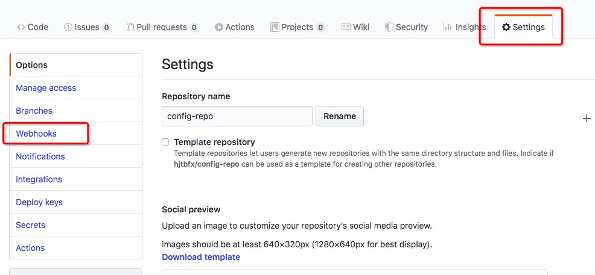
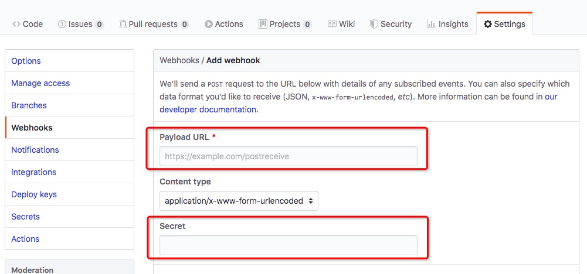

[TOC]

## 目录

- [1. 配置中心在微服务中的应用](#1-配置中心在微服务中的应用)
- [2. 直连式配置中心实施](#2-直连式配置中心实施)
- [3. 配置中心配置项动态刷新](#3-配置中心配置项动态刷新)
- [4. 配置中心高可用架构实现](#4-配置中心高可用架构实现)
- [5. 配置中心的信息加密方式](#5-配置中心的信息加密方式)
- [6. 总线式配置架构思考](#6-总线式配置架构思考)
- [7. 消息总线在微服务中的应用](#7-消息总线在微服务中的应用)
- [8. BUS和消息队列的集成方式](#8-BUS和消息队列的集成方式)
- [9. 实现总线式架构的配置中心](#9-实现总线式架构的配置中心)
- [10. GitHub配置更改后自动同步更新](#10-GitHub配置更改后自动同步更新)


# SpringCloud配置中心服务与BUS总线

## 1. 配置中心在微服务中的应用

### 1.1. 系统中常用的文件配置都是如何设置的

- 程序中硬编码
  - 在代码中写死一个文件的配置项
  - 如果使用绝对路径，更换了开发电脑会出现地址无法使用的问题
  - 如果代码在windows上开发，部署到linux上就要在上线前修改配置文件路径
- 配置文件
  - 一般将不经常修改的内容放到配置文件中
  - 比如将端口号配置到yaml或properties文件中

- 环境变量
  - 比如JDK的环境变量就是操作系统层面的配置
  - 线上启动tomcat时会加入一下启动参数来启动服务

- 数据库/缓存存储
  - 将属性配置到数据库或缓存中
  - 在数据库或缓存中进行灵活设置

### 1.2. 这些配置有什么缺点和不足

- 格式不统一
  - yaml
  - json
  - properties
  - 使用哪种根据个人选择即可
- 没有版本控制
  - 如果在yaml或properties中还能依赖git/svn进行版本控制
  - 如果是配置在数据库中则脱离了版本控制的束缚，修改则完全没有轨迹

- 基于静态配置
  - 如果是hardcode方式或配置文件方式则需要先修改再发布完成修改实现

- 分布零散
  - 从架构的层面考虑，各个微服务团队放飞自我百花齐放，方式不同格式不同，出现问题也不同
  - 没有统一的管理，比如几个项目都要连接数据库，如果数据库产生一些连接改变，就要修改所有项目的驱动串，通知所有的项目方进行修改

### 1.3. 在进行配置统一管理前先对配置项进行一下分类

#### 1.3.1. 配置项的静态内容

- 环境配置
  - 数据库连接
  - Eureka的注册中心
  - MQ的连接串
  - 搜索引擎连接串
  - 应用命，端口
- 安全配置
  - 连接的密码
  - 公钥私钥
  - 对这些配置还要进行加解密

#### 1.3.2. 配置项的动态内容

- 功能控制
  - 在代码里配置开关，传统的灰度发布方法，很灰度发布对应的就是灰度测试（金丝雀测试）
  - 人工熔断开关
  - 蓝绿发布
  - 数据源切换
- 业务规则
  - 当日汇率
  - 动态文案
  - 规则引擎参数：当前折扣系数，国际物流费用（drools规则引擎）
- 应用参数
  - 网关层要访问的黑白名单
  - 缓存过期时间配置

### 1.4. 配置项的功能定义

- 高可用
- 版本管理
- 访问权限控制
- 动态推送变更
- 内容加密
- 配置分离的中心化管理思想

### 1.5. Config Server核心功能

- 统一配置：提供了一个中心化配置方案，将各个项目中的配置内容集中在Config Server端进行管理
- 环境隔离：Config Server提供了多种环境隔离机制，可以根据需要进行配置加载
- 动态刷新：支持运行期改变配置进行业务动态配置，以及功能的动态开关
- 配置加密解密，定向推送等功能

## 2. 直连式配置中心实施

### 2.1. 配置文件设置

直连配置中心的工作模式非常简单，Config Server直接从配置库（GitHub）中拉取配置同步到各个Server中来进行直连式配置

**首先在GitHub上创建repo然后创建两个配置文件**

**命名规则：**

应用名-环境名.yaml / 应用名-环境名.properties

我们创建开发环境的文件名为：config-consumer-dev.yaml

```yaml
info: 
  profile: dev

name: config-dev
words: this is a development environment
```

创建生产环境的文件名：config-consumer-prod.yaml

```yaml
info: 
  profile: prod

name: config-prod
words: this is a production environment
```

### 2.2. 搭建config-server

创建一个config目录，在目录中创建一个config-sever的module

指定POM导入config-server

config-server和eureka-server很像就是一个中心化配置服务所以加入的依赖就一个

```xml
<?xml version="1.0" encoding="UTF-8"?>
<project xmlns="http://maven.apache.org/POM/4.0.0"
         xmlns:xsi="http://www.w3.org/2001/XMLSchema-instance"
         xsi:schemaLocation="http://maven.apache.org/POM/4.0.0 http://maven.apache.org/xsd/maven-4.0.0.xsd">
    <parent>
        <artifactId>spring-cloud-project</artifactId>
        <groupId>com.icodingedu</groupId>
        <version>1.0-SNAPSHOT</version>
        <relativePath>../../pom.xml</relativePath>
    </parent>
    <modelVersion>4.0.0</modelVersion>
    <packaging>jar</packaging>
    <artifactId>config-server</artifactId>
    <name>config-server</name>

    <dependencies>
        <dependency>
            <groupId>org.springframework.cloud</groupId>
            <artifactId>spring-cloud-config-server</artifactId>
        </dependency>
    </dependencies>
</project>
```

创建application启动类

```java
package com.icodingedu.springcloud;

import org.springframework.boot.WebApplicationType;
import org.springframework.boot.autoconfigure.SpringBootApplication;
import org.springframework.boot.builder.SpringApplicationBuilder;
import org.springframework.cloud.config.server.EnableConfigServer;

@SpringBootApplication
@EnableConfigServer
public class ConfigServerApplication {

    public static void main(String[] args) {
        new SpringApplicationBuilder(ConfigServerApplication.class)
                .web(WebApplicationType.SERVLET)
                .run(args);
    }
}
```

这次我们设置yaml配置文件

```yaml
spring:
  application:
    name: config-server
  cloud:
    config:
      server:
        git:
          uri: https://github.com/hjtbfx/config-repo.git
          force-pull: true # 强制拉取资源文件
#          search-paths: dev,prod* 支持csv格式配置多个路径同时获取,还支持*作为通配符
#          username:
#          password:
server:
  port: 60001
```

启动config-server使用PostMan拉取配置文件

```shell
# GET 
# config-consumer/dev 就是我们的命名规范application-profile
http://localhost:60001/config-consumer/dev
```

返回数据内容

```json
{
    "name": "config-consumer",
    "profiles": [
        "dev"
    ],
    "label": null,
    "version": "598ccaf69010b4ebbf13558fc3cb21f0212ceb3a",
    "state": null,
    "propertySources": [
        {
            "name": "https://github.com/hjtbfx/config-repo.git/config-consumer-dev.yaml",
            "source": {
                "info.profile": "dev",
                "name": "config-dev",
                "words": "this is a development environment"
            }
        }
    ]
}
```

并且在config-server的控制台还会输出一个本地资源的路径

```shell
2020-04-06 23:56:56.262  INFO 4610 --- [io-60001-exec-2] o.s.c.c.s.e.NativeEnvironmentRepository  : Adding property source: file:/var/folders/bs/t5hqbzl52r18nfyx3v0dc0k80000gn/T/config-repo-6888460700345550079/config-consumer-dev.yaml
```

如果要获取repo仓库中不同路径下的文件，可以这样访问

```shell
http://localhost:60001/config-consumer/dev/master
```

如果只想获得文件内容

```shell
# 其实这也是一个通配符方式,返回yaml格式数据
http://localhost:60001/config-consumer-dev.yaml
# 同理可得,返回properties格式数据
http://localhost:60001/config-consumer-dev.properties
# 返回json格式数据
http://localhost:60001/config-consumer-dev.json
# 这里就说明config并不要求你在github要把所有格式保存了，他会按照你的要求进行统一
```

如果我们的文件不在repo的根目录下，可以在前面加上路径

```shell
http://localhost:60001/master/config-consumer-dev.yaml
```

通配的格式如下

```shell
http://localhost:60001/{application}/{profile}/{label}
http://localhost:60001/{application}-{profile}.json(.yaml .properties)
```

### 2.3. Client直连配置中心

在config目录下创建config-client的module

引入POM依赖

```xml
<?xml version="1.0" encoding="UTF-8"?>
<project xmlns="http://maven.apache.org/POM/4.0.0"
         xmlns:xsi="http://www.w3.org/2001/XMLSchema-instance"
         xsi:schemaLocation="http://maven.apache.org/POM/4.0.0 http://maven.apache.org/xsd/maven-4.0.0.xsd">
    <parent>
        <artifactId>spring-cloud-project</artifactId>
        <groupId>com.icodingedu</groupId>
        <version>1.0-SNAPSHOT</version>
        <relativePath>../../pom.xml</relativePath>
    </parent>
    <modelVersion>4.0.0</modelVersion>
    <packaging>jar</packaging>
    <artifactId>config-client</artifactId>
    <name>config-client</name>

    <dependencies>
        <dependency>
            <groupId>org.springframework.boot</groupId>
            <artifactId>spring-boot-starter-web</artifactId>
        </dependency>
        <dependency>
            <groupId>org.springframework.cloud</groupId>
            <artifactId>spring-cloud-starter-config</artifactId>
        </dependency>
    </dependencies>
</project>
```

创建application启动类，只需要springboot启动类即可

```java
package com.icodingedu.springcloud;

import org.springframework.boot.WebApplicationType;
import org.springframework.boot.autoconfigure.SpringBootApplication;
import org.springframework.boot.builder.SpringApplicationBuilder;

@SpringBootApplication
public class ConfigClientApplication {

    public static void main(String[] args) {
        new SpringApplicationBuilder(ConfigClientApplication.class)
                .web(WebApplicationType.SERVLET)
                .run(args);
    }
}
```

创建controller实现配置获取的两种方式

```java
package com.icodingedu.springcloud.controller;

import org.springframework.beans.factory.annotation.Value;
import org.springframework.web.bind.annotation.GetMapping;
import org.springframework.web.bind.annotation.RestController;

@RestController
public class ConfigController {

    //直接从外部github上的配置文件加载
    @Value("${name}")
    private String name;

    //从外部将配置注入到本地配置文件,再从本地加载
    @Value("${myWords}")
    private String words;

    @GetMapping("/name")
    public String getName(){
        return name;
    }

    @GetMapping("/words")
    public String getWords(){
        return words;
    }
}
```

定义配置文件：bootstrap.yaml

为什么是bootstrap文件，而不是application，因为bootstrap的加载早于application，而且application在这里是要被写入属性的，所以需要在之前加载配置，因此要使用bootstrap配置

```yaml
spring:
  application:
    name: config-client
  cloud:
    config:
      uri: http://localhost:60001
      profile: prod # 这个应该是从外部注入的,比如启动tomcat是传入参数来确定是什么环境
      label: master
server:
  port: 60002
myWords: ${words}
```

这样配置是启动不起来的原因是这里直接使用了spring.application.name作为applicationName了，要么和github上一致要么在下面spring.cloud.config里重写一下name

```shell
spring:
  application:
    name: config-client
  cloud:
    config:
      uri: http://localhost:60001
      profile: prod # 这个应该是从外部注入的,比如启动tomcat是传入参数来确定是什么环境
      label: master
      name: config-consumer
server:
  port: 60002
myWords: ${words}
```

## 3. 配置中心配置项动态刷新

还在原来的config-client项目中进行修改

在POM中增加依赖

```xml
        <dependency>
            <groupId>org.springframework.boot</groupId>
            <artifactId>spring-boot-starter-actuator</artifactId>
        </dependency>
```

项目中创建一个新的controller

```java
package com.icodingedu.springcloud.controller;

import org.springframework.beans.factory.annotation.Value;
import org.springframework.cloud.context.config.annotation.RefreshScope;
import org.springframework.web.bind.annotation.GetMapping;
import org.springframework.web.bind.annotation.RequestMapping;
import org.springframework.web.bind.annotation.RestController;

@RestController
@RequestMapping("refresh")
//允许bean在运行期更新值,进入源码看下注释
@RefreshScope
public class RefreshController {

    @Value("${words}")
    private String words;

    @GetMapping("/words")
    public String getWords(){
        return words;
    }
}
```

修改配置文件yaml配置开放Actuator的内容

```yaml
spring:
  application:
    name: config-client
  cloud:
    config:
      uri: http://localhost:60001
      profile: prod # 这个应该是从外部注入的,比如启动tomcat是传入参数来确定是什么环境
      label: master
      name: config-consumer
server:
  port: 60002
myWords: ${words}


management:
  security:
    enabled: false
  endpoints:
    web:
      exposure:
        include: "*"
  endpoint:
    health:
      show-details: always
```

 **测试配置变更情况**

1、我们到github里将words数据进行修改，添加一些内容

2、通过controller访问：http://localhost:60002/refresh/words 获得的数据还是历史未修改的值

3、需要通过actuator来进行刷新，在config-client端进行刷行

```shell
# POST 请求
http://localhost:60002/actuator/refresh
# 请求后会在控制台输出更新信息
```

4、再次访问就会产生更新信息了：http://localhost:60002/refresh/words

5、这种方式就可以进行不同服务器的功能开关了：对多台服务器中的某几台进行刷行，功能就只在这几台服务上打开，这样就做到手工灰度发布了

## 4. 配置中心高可用架构实现

- 方案1

  使用Eureka注册中心来实现配置中心的高可用，将所有的配置中心注册到Eureka中，利用Eureka的服务发现，服务续约服务剔除来维护配置中心，配置调用方通过Eureka拿到配置中心列表再通过Ribbon负载均衡访问具体的配置中心即可

- 方案2

  如果我们单独使用配置中心，系统中没有使用Eureka，可以在网关层做负载均衡，搭建多个配置中心接入到负载均衡的网关，可以是Nginx/HAProxy/Lvs，对于网关层HA可以配套keepalived的VIP进行HA，也可以直接使用LB的云服务进行使用

既然我们是在springcloud环境中，就来看下如何借助Eureka实现配置中心高可用的

创建一个新的module用来实现配置中心的高可用：config-server-eureka，证明这个配置中行集成了eureka

在POM中导入两个依赖

```xml
<?xml version="1.0" encoding="UTF-8"?>
<project xmlns="http://maven.apache.org/POM/4.0.0"
         xmlns:xsi="http://www.w3.org/2001/XMLSchema-instance"
         xsi:schemaLocation="http://maven.apache.org/POM/4.0.0 http://maven.apache.org/xsd/maven-4.0.0.xsd">
    <parent>
        <artifactId>spring-cloud-project</artifactId>
        <groupId>com.icodingedu</groupId>
        <version>1.0-SNAPSHOT</version>
        <relativePath>../../pom.xml</relativePath>
    </parent>
    <modelVersion>4.0.0</modelVersion>
    <packaging>jar</packaging>
    <artifactId>config-server-eureka</artifactId>
    <name>config-server-eureka</name>

    <dependencies>
        <dependency>
            <groupId>org.springframework.cloud</groupId>
            <artifactId>spring-cloud-config-server</artifactId>
        </dependency>
        <dependency>
            <groupId>org.springframework.cloud</groupId>
            <artifactId>spring-cloud-starter-netflix-eureka-client</artifactId>
        </dependency>
    </dependencies>
</project>
```

创建application实现类

```java
package com.icodingedu.springcloud;

import org.springframework.boot.WebApplicationType;
import org.springframework.boot.autoconfigure.SpringBootApplication;
import org.springframework.boot.builder.SpringApplicationBuilder;
import org.springframework.cloud.client.discovery.EnableDiscoveryClient;
import org.springframework.cloud.config.server.EnableConfigServer;

@SpringBootApplication
@EnableConfigServer
@EnableDiscoveryClient
public class ConfigServerEurekaApplication {

    public static void main(String[] args) {
        new SpringApplicationBuilder(ConfigServerEurekaApplication.class)
                .web(WebApplicationType.SERVLET)
                .run(args);
    }
}
```

创建application.yaml，需要配置eureka的client加入到eureka-server中

```yaml
spring:
  application:
    name: config-server-eureka
  cloud:
    config:
      server:
        git:
          uri: https://github.com/hjtbfx/config-repo.git
          force-pull: true # 强制拉取资源文件
#          search-paths: dev,prod* 支持csv格式配置多个路径同时获取,还支持*作为通配符
#          username:
#          password:
eureka:
  client:
    serviceUrl:
      defaultZone: http://localhost:20001/eureka/
server:
  port: 60003
```

可以按顺序启动eureka-server、config-server-eureka了

**我们来修改前面创建的config-client项目**

**先修改POM，加入eureka的服务发现依赖**

```xml
        <dependency>
            <groupId>org.springframework.cloud</groupId>
            <artifactId>spring-cloud-starter-netflix-eureka-client</artifactId>
        </dependency>
```

**修改启动类增加eureka的服务发现注解**

```java
package com.icodingedu.springcloud;

import org.springframework.boot.WebApplicationType;
import org.springframework.boot.autoconfigure.SpringBootApplication;
import org.springframework.boot.builder.SpringApplicationBuilder;
import org.springframework.cloud.client.discovery.EnableDiscoveryClient;

@SpringBootApplication
@EnableDiscoveryClient
public class ConfigClientApplication {

    public static void main(String[] args) {
        new SpringApplicationBuilder(ConfigClientApplication.class)
                .web(WebApplicationType.SERVLET)
                .run(args);
    }
}
```

**修改config-client的bootstrap.yaml的配置文件**

- 修改config下的uri连接到eureka服务
- 将eureka服务发现加入到配置中

```yaml
spring:
  application:
    name: config-client
  cloud:
    config:
#      uri: http://localhost:60001
      discovery:
        enabled: true
        service-id: config-server-eureka
      profile: prod # 这个应该是从外部注入的,比如启动tomcat是传入参数来确定是什么环境
      label: master
      name: config-consumer
eureka:
  client:
    serviceUrl:
      defaultZone: http://localhost:20001/eureka/
server:
  port: 60002
myWords: ${words}


management:
  security:
    enabled: false
  endpoints:
    web:
      exposure:
        include: "*"
  endpoint:
    health:
      show-details: always
```

这样就可进行测试了，启动服务然后进行验证即可


## 5. 配置中心的信息加密方式

之前都是明文保存，比如用户名，密码（社会工程学）

config是如何做密码加密和解密，通过config的encrypt的功能加密明文生成密文，然后把密文放到github上，需要在密文前加一个标识{cipher}，config 发现有这样的标识，就会启动解密

加密的密钥的方式：对称密钥、非对称密钥

我们是用对称加密来进行config的加解密

- 对JDK（Java Cryptography Extension）进行一定的优化，替换JDK端的JCE组件，因为springcloud的config在进行加解密的时候要用到JCE组件
- 在JDK8u161之后的版本不需要升级（7u171以后不需要升级，6u16以后不需要升级）
- 为什么要升级JCE，自带的JDK加密算法位数都不超过256位，需要手工替换
- JCE解压后将里面的两个Jar包放到jdk-home/jre/lib/security目录

在**config-server-eureka**中增加bootstrap.yaml

```yaml
# 在bootstrap中增加对称加密的key
encrypt:
  key: 19491001
```

通过encrypt进行加密

```shell
# POST 明文：icodingedu is very well!
http://localhost:60003/encrypt
# 获得密文
289765ddfd0a7aaf747f59c549cf81a76dce270067a22b91b7ed3259d41a7c550b9de1a2c913b5a3f99ecf779a66f327
# 如何解密
# POST 密文
http://localhost:60003/decrypt
```

如果在系统中自动解密，则需要将密文加上{cipher}进行密文标识

```shell
# Github里
introduce: '{cipher}289765ddfd0a7aaf747f59c549cf81a76dce270067a22b91b7ed3259d41a7c550b9de1a2c913b5a3f99ecf779a66f327'
```

在config-client获取introduce和没有加密的配置一样，正常获取即可

## 6. 总线式配置架构思考

如果我们的config-client是对外提供负载均衡服务的，有60002，60012，60022三台服务，这时我们配置更新了，如果需要三台机器都更新配置，是否需要在每台服务上都执行一遍actuator/refresh？如果需要全部更新则需要在三台机器上都执行

在软件工程领域有这样一句名言：**计算机科学领域的任何问题都可以通过增加一个间接的中间层来解决**

- 响应事件：对变更事件做出响应
- 消息事件：各个服务节点都可以从这个组件中消费事件

自己如果做：程序订阅一个更新调用actuator/refresh

SpringCloud bus + config + github搭建一套总线式的配置中心

## 7. 消息总线在微服务中的应用

BUS-消息总线：代理了将消息变更发送给所有服务节点的角色

Stream组件代理了大部分消息中间件的通信服务，BUS在实际应用中大多是为了应对消息广播的场景

- BUS底层还需要依赖消息中间件来完成消息的分发
- 对于总线式的配置中心架构有两个问题要解决
  - 谁来发起变更：是由服务节点config-server，还是config-client？
  - 何时发起变更：是手工发起变更，还是每次github上更改后自动推送？

## 8. BUS和消息队列的集成方式

### 8.1. 集成方式

前面我们了解了Bus的工作方式，在动手改造配置中心之前，我们先来了解一下Bus有哪些接入方式。
Spring的组件一向是以一种插件式的方式提供功能，将组件自身和我们项目中的业务代码隔离，使得我们更换组件的成本可以降到最低。Spring Cloud Bus也不例外，它的底层消息组件非常容易替换，替换过程不需要对业务代码引入任何变更。Bus就像一道隔离了底层消息组件和业务应用的中间层，比如我们从RabbitMQ切换为Kafka的时候，只需要做两件事就好了：

1. 在项目pom中替换依赖组件
2. 更改配置文件里的连接信息

### 8.2. 接入RabbitMQ

RabbitMQ是实现了AMQP（Advanced Message Queue Protocal）的开源消息代理软件，也是大家平时项目中应用最广泛的消息分发组件之一。同学们在分布式章节应该已经深入了解了消息队列的使用，这里我们就不再赘述了。

接入RabbitMQ的方式很简单，我们只要在项目中引入以下依赖：

```xml
<dependency>
	<groupId>org.springframework.cloud</groupId>
	<artifactId>spring-cloud-starter-bus-amqp</artifactId>
</dependency>
```

点进去查看这个依赖的pom，你会发现它依赖了`spring-cloud-starter-stream-rabbit`，也就是说Stream组件才是真正被用来发送广播消息到RabbitMQ的，Bus这里只是帮我们封装了整个消息的发布和监听动作。

接下来我们看下项目中所需的具体配置：

```yaml
spring:
  rabbitmq:
    host: localhost
    port: 5672
    username: guest
    password: guest
```

上面配置分别指定了RabbitMQ的地址、端口、用户名和密码，以上均采用RabbitMQ中的默认配置。

### 8.3. 接入Kafka

要使用Kafka来实现消息代理，只需要把上一步中引入的spring-cloud-starter-bus-amqp依赖替换成spring-cloud-starter-bus-kafka依赖

```xml
<dependency>
    <groupId>org.springframework.cloud</groupId>
    <artifactId>spring-cloud-starter-bus-kafka</artifactId>
</dependency>
```

如果大家的Kafka和ZooKeeper都运行在本地，并且采用了默认配置，那么不需要做任何额外的配置，就可以直接使用。但是在生产环境中往往Kafka和ZooKeeper会部署在不同的环境，所以就需要做一些额外配置：

| 属性                                               | 含义                               |
| :------------------------------------------------- | :--------------------------------- |
| spring.cloud.stream.kafka.binder.brokers           | Kafka服务节点（默认localhost）     |
| spring.cloud.stream.kafka.binder.defaultBrokerPort | Kafka端口（默认9092）              |
| spring.cloud.stream.kafka.binder.zkNodes           | ZooKeeper服务节点（默认localhost） |
| zspring.cloud.stream.kafka.binder.defaultZkPort    | ZooKeeper端口（默认2181）          |

## 9. 实现总线式架构的配置中心

### 9.1. Config Server搭建

创建bus目录，然后创建一个config-bus-server

添加POM文件依赖

```xml
<?xml version="1.0" encoding="UTF-8"?>
<project xmlns="http://maven.apache.org/POM/4.0.0"
         xmlns:xsi="http://www.w3.org/2001/XMLSchema-instance"
         xsi:schemaLocation="http://maven.apache.org/POM/4.0.0 http://maven.apache.org/xsd/maven-4.0.0.xsd">
    <parent>
        <artifactId>spring-cloud-project</artifactId>
        <groupId>com.icodingedu</groupId>
        <version>1.0-SNAPSHOT</version>
        <relativePath>../../pom.xml</relativePath>
    </parent>
    <modelVersion>4.0.0</modelVersion>
    <packaging>jar</packaging>
    <artifactId>config-bus-server</artifactId>
    <name>config-bus-server</name>

    <dependencies>
        <dependency>
            <groupId>org.springframework.cloud</groupId>
            <artifactId>spring-cloud-config-server</artifactId>
        </dependency>
        <dependency>
            <groupId>org.springframework.cloud</groupId>
            <artifactId>spring-cloud-starter-netflix-eureka-client</artifactId>
        </dependency>
        <dependency>
            <groupId>org.springframework.cloud</groupId>
            <artifactId>spring-cloud-starter-bus-amqp</artifactId>
        </dependency>
        <dependency>
            <groupId>org.springframework.boot</groupId>
            <artifactId>spring-boot-starter-actuator</artifactId>
        </dependency>
    </dependencies>
</project>
```

我们看一下bus-amqp这个依赖有什么玄机，进去后看到他里面还藏着一个stream-rabbit的组件，所有bus其实就是一个空壳子，他在通信的时候引入的是stream-rabbit这个适配层

```xml
  <dependencies>
    <dependency>
      <groupId>org.springframework.cloud</groupId>
      <artifactId>spring-cloud-starter-stream-rabbit</artifactId>
      <version>3.0.3.RELEASE</version>
      <scope>compile</scope>
    </dependency>
    <dependency>
      <groupId>org.springframework.cloud</groupId>
      <artifactId>spring-cloud-bus</artifactId>
      <version>2.2.1.RELEASE</version>
      <scope>compile</scope>
    </dependency>
  </dependencies>
```

创建启动类application

```java
package com.icodingedu.springcloud;

import org.springframework.boot.WebApplicationType;
import org.springframework.boot.autoconfigure.SpringBootApplication;
import org.springframework.boot.builder.SpringApplicationBuilder;
import org.springframework.cloud.client.discovery.EnableDiscoveryClient;
import org.springframework.cloud.config.server.EnableConfigServer;

@SpringBootApplication
@EnableConfigServer
@EnableDiscoveryClient
public class ConfigBusServerApplication {

    public static void main(String[] args) {
        new SpringApplicationBuilder(ConfigBusServerApplication.class)
                .web(WebApplicationType.SERVLET)
                .run(args);
    }
}
```

配置application.yaml和bootstrap.yaml，可以从config-server-eureka项目中copy过来

在application.yaml里修改application name并添加rabbitmq的连接字符串，开放actuator的所有endpoint

可以从config-client里复制actuator的内容

- application.name
- server.port
- rabbitmq
- actuator

```yaml
spring:
  application:
    name: config-bus-server
  rabbitmq:
    host: 39.98.81.253
    port: 5672
    username: guest
    password: guest
  cloud:
    config:
      server:
        git:
          uri: https://github.com/hjtbfx/config-repo.git
          force-pull: true # 强制拉取资源文件
#          search-paths: dev,prod* 支持csv格式配置多个路径同时获取,还支持*作为通配符
#          username:
#          password:
eureka:
  client:
    serviceUrl:
      defaultZone: http://localhost:20001/eureka/
server:
  port: 60011
  
management:
  security:
    enabled: false
  endpoints:
    web:
      exposure:
        include: "*"
  endpoint:
    health:
      show-details: always
```

启动测试一下：RabbitMQ要提前启动好

eureka-server、config-server-bus

测试一下配置是否能拿到：http://localhost:60011/config-consumer/prod

测试一下actuator：http://localhost:60011/actuator

```shell
# 下面我们将使用actuator的这个更新来进行批量通知更新
# 如果只想更新部分节点则可以使用{destination}路径参数
http://localhost:60011/actuator/bus-refresh/{destination}
```

### 9.2. Config Client搭建

在bus目录下创建一个config-bus-client

创建POM依赖，可以从config-client里复制过来

```xml
<?xml version="1.0" encoding="UTF-8"?>
<project xmlns="http://maven.apache.org/POM/4.0.0"
         xmlns:xsi="http://www.w3.org/2001/XMLSchema-instance"
         xsi:schemaLocation="http://maven.apache.org/POM/4.0.0 http://maven.apache.org/xsd/maven-4.0.0.xsd">
    <parent>
        <artifactId>spring-cloud-project</artifactId>
        <groupId>com.icodingedu</groupId>
        <version>1.0-SNAPSHOT</version>
        <relativePath>../../pom.xml</relativePath>
    </parent>
    <modelVersion>4.0.0</modelVersion>
    <packaging>jar</packaging>
    <artifactId>config-bus-client</artifactId>
    <name>config-bus-client</name>

    <dependencies>
        <dependency>
            <groupId>org.springframework.boot</groupId>
            <artifactId>spring-boot-starter-web</artifactId>
        </dependency>
        <dependency>
            <groupId>org.springframework.cloud</groupId>
            <artifactId>spring-cloud-starter-config</artifactId>
        </dependency>
        <dependency>
            <groupId>org.springframework.boot</groupId>
            <artifactId>spring-boot-starter-actuator</artifactId>
        </dependency>
        <dependency>
            <groupId>org.springframework.cloud</groupId>
            <artifactId>spring-cloud-starter-netflix-eureka-client</artifactId>
        </dependency>
        <dependency>
            <groupId>org.springframework.cloud</groupId>
            <artifactId>spring-cloud-starter-bus-amqp</artifactId>
        </dependency>
        <!-- 如果使用kafka只需要改一下依赖即可,业务代码层不同调整
        <dependency>
            <groupId>org.springframework.cloud</groupId>
            <artifactId>spring-cloud-starter-bus-kafka</artifactId>
        </dependency>
        -->
    </dependencies>
</project>
```

启动类和实现类可以直接从config-client里复制过来

application启动类

```java
package com.icodingedu.springcloud;

import org.springframework.boot.WebApplicationType;
import org.springframework.boot.autoconfigure.SpringBootApplication;
import org.springframework.boot.builder.SpringApplicationBuilder;
import org.springframework.cloud.client.discovery.EnableDiscoveryClient;

@SpringBootApplication
@EnableDiscoveryClient
public class ConfigBusClientApplication {

    public static void main(String[] args) {
        new SpringApplicationBuilder(ConfigBusClientApplication.class)
                .web(WebApplicationType.SERVLET)
                .run(args);
    }
}
```

把config-client里的controller都copy过来，这个bus推送在代码上是没有什么感知，只会在yaml配置上有所不同，我们来进行一下yaml的配置，可以从config-client里把yaml复制过来进行修改

- application.name
- service-id
- server.port
- rabbitmq
- stream：设置默认的底层消息中间件（比如项目使用了两个消息中间件，这里就可以只指定一个）

```yaml
spring:
  application:
    name: config-bus-client
  rabbitmq:
    host: 39.98.81.253
    port: 5672
    username: guest
    password: guest
  cloud:
    stream:
      default-binder: rabbit
    config:
      #      uri: http://localhost:60001
      discovery:
        enabled: true
        service-id: config-bus-server
      profile: prod # 这个应该是从外部注入的,比如启动tomcat是传入参数来确定是什么环境
      label: master
      name: config-consumer
eureka:
  client:
    serviceUrl:
      defaultZone: http://localhost:20001/eureka/
server:
  port: 60012
myWords: ${words}

management:
  security:
    enabled: false
  endpoints:
    web:
      exposure:
        include: "*"
  endpoint:
    health:
      show-details: always
```

启动两个config-bus-client进行测试

先看一下现有的words值

http://localhost:60012/refresh/words

http://localhost:60013/refresh/words

然后去github上修改words值，修改后再访问并没有改变

这是时候我们去config-bus-server上进行更新

```shell
# POST
# http://localhost:60011/actuator/bus-refresh
# 返回204就说明全部更新完成了
```

现在去访问多个config-bus-client看看效果，更新完成没，已全部更新

也可以发送到某个client节点，在具体的config-bus-client节点上执行

```shell
# POST
# http://localhost:60012/actuator/bus-refresh
# 这样也会触发所有节点更新
```

可以指定某个具体服务的具体端口进行更新，这个就要使用{destination}参数了

```shell
# POST 将请求发送到confi-bus-server上
# http://localhost:60011/actuator/bus-refresh/config-bus-client:60014
# {destination}参数格式：serverName:serverPort
# 也可以在端口上使用通配符,让这个服务的所有的端口都更新
# http://localhost:60011/actuator/bus-refresh/config-bus-client:*
```

注意：bus会在rabbitmq上自动创建exchagne、queue、routingkey

## 10. GitHub配置更改后自动同步更新

通过github的webhook机制（就是第三方的回调接口，当配置参数修改后github会主动调用你预留的接口）

通过github触发更新需要以下几步

1、在config-server上设置encrypt.key

2、将上一步的key添加到Github仓库中

3、配置webhook url



我们需要填写以下两个内容



Payload URL：http://45.89.90.12:60011/actuator/bus-refresh

这个地址的IP一定是公网上可以访问的IP或域名

Secret：encrypt.key里设置的值，我们项目中是19491001

很多webhook都要求回调的地址是https的，确保安全

自动推送需要注意的点：

- 无法进行灰度测试：改动一提交就全部更新，如果不小心修改了配置改错了，所有服务器都团灭了
- 定点推送：webhook的url是写死的，所以无法做到实时变更

如果借助github的webhook的实现自动更新并能实时修改目标节点

- 我们做一个更新的中间层，把这个中间层的url给到webhook
- 这个url调用中间层需要更新的节点或全局更新，这个节点和全局更新可以配置
- 先确认好中间层的更新范围，再去修改配置