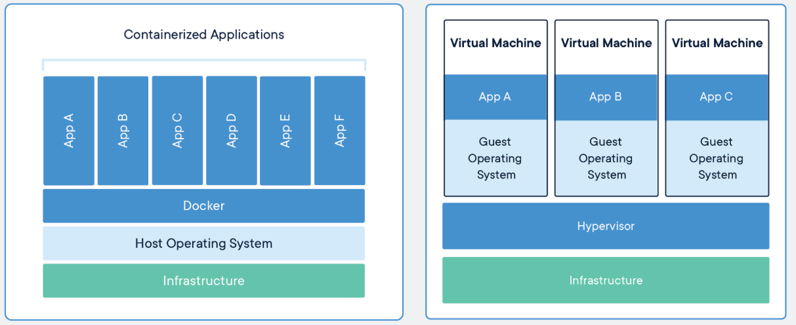
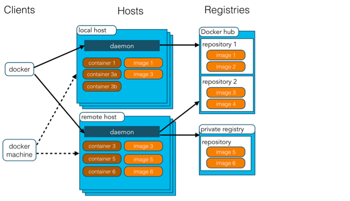
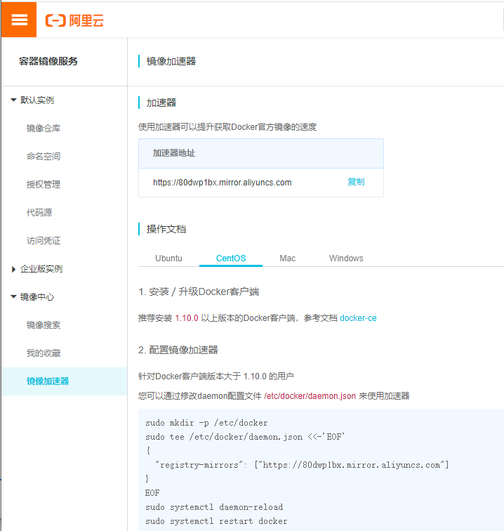
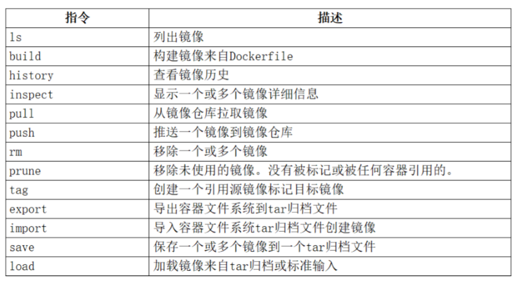
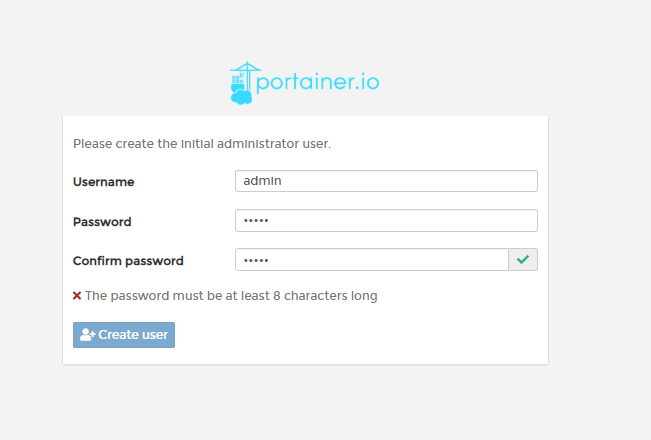
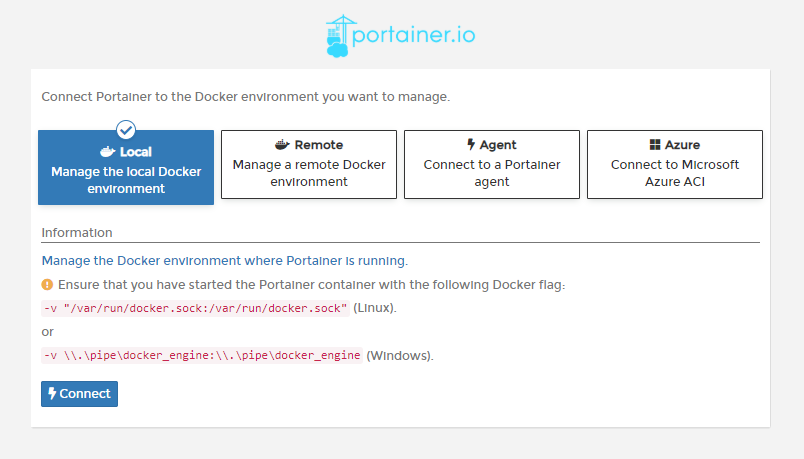
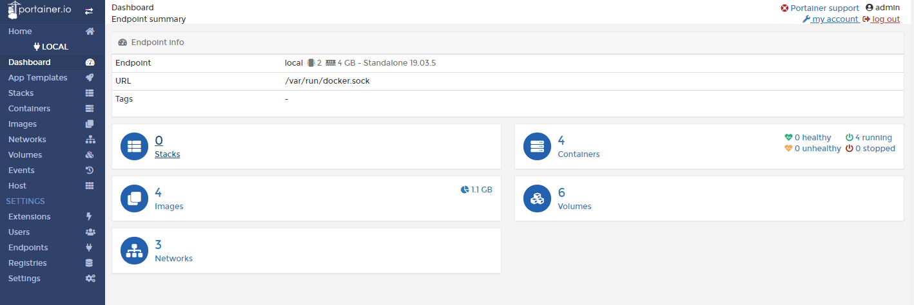

[TOC]

[1. 什么是Docker](#1- 什么是Docker)

#  Docker 容器技术入门与进阶


使用docker一定要连接网络才能操作

> 1、firewalld的基本使用
>
> 启动： systemctl start firewalld
>
> 关闭： systemctl stop firewalld 
>
> 查看状态： systemctl status firewalld 
>
> 开机禁用  ： systemctl disable firewalld 
>
> 开机启用  ： systemctl enable firewalld


##  1. 什么是Docker

> 了解虚拟化技术

**什么是Docker** 

1：使用最广泛的开源容器. 

2：一种操作系统的虚拟化技术 linux 内核

3：依赖于Linux内核特性:NameSpace和Cgroups 

4：一个简单的应用程序打包工具
**作用和目的**
1：提供简单的应用程序打包工具 

2：开发人员和运维人员职责逻辑分离

3：多环境保持一致。消除了环境的差异。 

**Docker的应用场景**

1：应用程序的打包和发布 

2：应用程序隔离

3：持续集成 

4：部署微服务

5：快速搭建测试环境

 6：提供PaaS平台级产品 

**Docker的特点**

1：上手快

2：职责的逻辑分类

3：快速高效的开发生命周期 

4：鼓励使用面向服务的架构 


##  2. 容器技术与虚拟化技术对比

> Docker 与虚拟机的不同点



与传统的虚拟机相比，Docker优势体现为启动速度快、占用体积小

**虚拟机：**

1：基础设施Infrastructure，它可以是你的个人电脑，数据中心的服务器或者云主机 个人电脑

2：Host os当前的操作系统，比如windows和linux系统等。 windows10

3：hypervisor:是一种虚拟化技术。可以在主操作系统之上运行多个不同的操作系统。比如 vmware和virturebox等。  vmware

4：Guest os 就是虚拟子系统也就是我们的centos。 centos7

5：Bins、Libs安装应用需要依赖的组件和环境。比如gcc,gcc++或者yum等。 ssh

 6：App 安装我们对应的应用，比如：mysql,tomcat.jdk等。应用安装之后，就可以在各个操作系 统分别运行应用了，这样各个应用就是相互隔离的。mysql

**Docker容器：**

1：基础设施Infrastructure。 

2：Host os当前的操作系统，比如windows和linux系统等。

3：Docker Engine：负责和底层的系统进行交互和共享底层系统的资源。取代了Hypevisor.它是 运行在操作系统之上的后台进程，负责管理Docker容器。

4：各种依赖，对于Docker，应用的所有依赖都打包在Docker镜像中，Docker容器是基于 Docker镜像创建的。

5：应用，应用的源代码与他的依赖都打包在Docker镜像中，不同的应用需要不同的Docker镜 像，不同的应用运行在不同的Docker容器中，它们是相互隔离的。

**对比表格**

|                  |             虚拟机             |          容器          |
| :--------------: | :----------------------------: | :--------------------: |
| **占用磁盘空间** |          非常大，GB级          |     小，MB甚至KB级     |
|   **启动速度**   |           慢，分钟级           |        快，秒级        |
|   **运行形态**   |       运行于Hypervisor上       |  直接运行在宿主机内核  |
|    **并发性**    | 一台宿主机上十几个，最多几十个 | 上百个，甚至数百上千个 |
|     **性能**     |           逊于宿主机           |   接近宿主机本地进程   |
|  **资源利用率**  |               低               |           高           |

**总结**

1. 秒级的交付和部署 
2. 保证环境一致性 
3. 高效的资源利用
4. 弹性的伸缩
5. 动态调度迁移成本低

Docker守护进程可以直接与主操作系统进行通信，为各个Docker容器分配资源，它还可以将容器与主 操作系统隔离，并将各个容器互相隔离，虚拟机启动需要数分钟，而Docker容器可以在毫秒内启动，由 于没有臃肿的的从操作系统，Docker可以节省大量的磁盘控制以及其他系统资源。


##  3. Docker组件

###  1. cs架构程序

> docker 架构



1. **Docker是一个客户端-服务器（C/S）架构程序**

    它是docker的用户界面，可以接受用户命令和配置标识，并与docker daemon通信，==其实就是在screat 或者 xhsell中输入的docker命令==。

2. **Docker Daemon 守护进程**

    它是一个运行在宿主机（Docker Host）的后台进程，可以通过docker客户端与之通信。 

3. **Docker Image镜像**
   在docker中，每一个应用都会做成一个镜像文件。这个镜像文件最后会把它安装到容器中，然后运行在 docker的进程中，同一种镜像可以复刻多份容器去运行。类似于java语言中的：==类==。 比如我又一个镜像假如是MYSQL镜像。我基于这个镜像可以创建N多个容器，而这些容器可以在我们的 宿主机上去运行。

> 镜像从何而来？
>
> 从Registries而来。也是仓库的意思，也就是说所有的镜像都会从仓库里或者，这个远程仓库的地 址是什么呢？
>
> https://hub.docker.com/search?q=&type=image 或者你自己建立一个本地仓库来完成镜像的存储。
>
> ==为什么不使用dockerhub提供的额镜像而使用国内的提供的docker仓库或者自己搭建，是因为国 外卸载镜像的时候有带宽限制。速度会非常的慢。这也是为什么说一定要链接网络的原因==

1. **Docker Container 容器** 

   容器是镜像可以运行的实例，镜像和容器的关系有点类似于java语言中的：==对象==

2. **Registry** 

   它是一个集中存储与分发镜像的服务。一个Docker Registry可以包含多个docker仓库，每个仓库可以 包含多个镜像标签，每个标签对应一个docker镜像。

   Docker Registry可分为公有docker register和私有docker registry，最常用的docker registry就是 docker hub.也就是默认的docker registry。 

###  2. 镜像与容器

**镜像（image）**

镜像是基于联合文件系统的一种层式结构，由一系列指令一步一步构建出来 

**容器（container）**

镜像是静态的，镜像的每一层都只是可读的，而容器是动态的里面运行着我们指 定的应用，容器里面的应用可能会新建一个文件，修改一个目录，这些操作所带来的改变并不会作用到 镜像里面，因为镜像只是可读的。所以通过镜像创建容器就是在镜像上加一个可读写的层。

###  3. 仓库

Docker用Registry来保存用户构建的镜像。Registry分为公共和私有两种。Docker公司运营公共的 Registry叫做Docker Hub。  

[https://hub.docker.com/](https://hub.docker.com/)


##  4. Docker安装

> 环境
>
> Linux环境中的Centos7.x以上版本

###  1. 安装Docker

```sh
#yum 包更新到最新 
yum update
#安装需要的软件包， yum-util 提供yum-config-manager功能，另外两个是devicemapper驱动 依赖的
yum install -y yum-utils device-mapper-persistent-data lvm2
#设置yum源为阿里云 
yum-config-manager --add-repo http://mirrors.aliyun.com/dockerce/linux/centos/docker-ce.repo
#安装docker
yum install docker-ce -y
#安装后查看docker版本 
docker -v

```

###  2. Docker卸载

```shell
# 查询docker安装过的包
yum list installed | grep docker
# 删除安装包
yum remove docker-ce.x86_64 ddocker-ce-cli.x86_64 -y
# 删除镜像/容器等
rm -rf /var/lib/docker
```

### 3. 设置ustc镜像源

ustc是老牌的linux镜像服务提供者了，还在遥远的ubuntu 5.04版本的时候就在用。ustc的docker镜像 加速器速度很快。ustc docker mirror的优势之一就是不需要注册，是真正的公共服务。

[ https://lug.ustc.edu.cn/wiki/mirrors/help/docker](https://lug.ustc.edu.cn/wiki/mirrors/help/docker)

操作：

```shell
# 编辑该文件： 
mkdir -p /etc/docker 
vim /etc/docker/daemon.json 

# 在该文件中输入如下内容： 
{ 
	"registry-mirrors": ["https://docker.mirrors.ustc.edu.cn"] 
}
# 配置多个如下： 
{ 
    "registry-mirrors": ["https://docker.mirrors.ustc.edu.cn"], 
    "registry-mirrors": ["https://0wrdwnn6.mirror.aliyuncs.com"] 
}

# 或者执行
curl -sSL https://get.daocloud.io/daotools/set_mirror.sh | sh -s http://bc437cce.m.daocloud.io

```

**阿里云镜像加速器：**

阿里云镜像服务



即

```shell
sudo mkdir -p /etc/docker
sudo tee /etc/docker/daemon.json <<-'EOF'
{
  "registry-mirrors": ["https://80dwp1bx.mirror.aliyuncs.com"]
}
EOF
sudo systemctl daemon-reload
sudo systemctl restart docker
```


##  5. Docker的启动&停止

```shell
# 启动docker： 
systemctl start docker
# 停止docker： 
systemctl stop docker 
# 重启docker： 
systemctl restart docker
# 查看docker状态： 
systemctl status docker
# 开机启动：   
systemctl enable docker 
systemctl unenable docker
# 查看docker概要信息 
docker info
# 查看docker帮助文档 
docker --help
```


##  6. Docker镜像操作命令



1. 查看镜像

   ```shell
   docker images
   docker images ls
   ```

   > REPOSITORY：镜像名称 
   >
   > TAG：镜像标签  （默认是可以省略的,也就是latest） 
   >
   > IMAGE ID：镜像ID 
   >
   > CREATED：镜像的创建日期（不是获取该镜像的日期） 
   >
   > SIZE：镜像大小 
   >
   > >  这些镜像都是存储在Docker宿主机的/var/lib/docker目录下 

2. 搜索镜像

   如果在网络中查找需要的镜像

   ```shell
   docker search 镜像名称
   ```

   > NAME：仓库名称 
   >
   > DESCRIPTION：镜像描述 
   >
   > STARS：用户评价，反应一个镜像的受欢迎程度 
   >
   > OFFICIAL：是否官方 
   >
   > AUTOMATED：自动构建，表示该镜像由Docker Hub自动构建流程创建的

3. 拉取镜像

   ```shell
   # 格式：docker pull 镜像名称[:TAG]
   # 例如，我要下载centos7镜像 
   docker pull centos:7 
   docker pull redis 
   docker pull tomcat:8.5.47-jdk8-openjdk
   ```

   

4. 删除镜像

   ```shell
   docker rmi 镜像ID 
   docker rmi 镜像名称 
   docker rmi 镜像名称:tag 
   docker rmi `docker images -q` 删除所有镜像（谨慎操作）
   
   ```

**小结**

1：查看 docker images 

2：下载镜像的命令： docker pull 镜像名称[:TAG] 如果TAG不指定，那么下载的最新版本，就相当于自 动增加： :latest

3：删除镜像：docker rmi 镜像名称|镜像ID


##  7. 容器创建与启动

### 1. 查看容器

```shell
#查看最后一次运行的容器 
docker ps -l
#查看运行容器 
docker ps 
#查看所有容器 
docker ps -a 
#进入容器 其中字符串为容器ID: 
docker exec -it d27bd3008ad9 /bin/bash 
#停用全部运行中的容器: 
docker stop $(docker ps -q) 
#删除全部容器： 
docker rm $(docker ps -aq) 
#一条命令实现停用并删除容器： 
docker stop $(docker ps -q) & docker rm $(docker ps -aq)
```


### 2. 创建容器

`docker run` 参数说明

`docker run --help`

|            指令             |                             描述                             |
| :-------------------------: | :----------------------------------------------------------: |
|      -i, -interactive       |                            交互式                            |
|          -t, --tty          |                        分配一个伪终端                        |
|         -d, -detach         |                        运行容器到后台                        |
|      -a, -attach list       |                       附加到运行的容器                       |
|          --dns lis          |                        设置DNS服务器                         |
|       -e, --env list        |                         设置环境变量                         |
|       --env-file list        |                       从文件读取环境变                       |
|      -p, -publish lis       |                     发布容器端口到主 机                      |
|      -P , -publish-all      |                        设置容器主机名                        |
|         --ip string         |               指定容器IP，只能 用于自定义网络                |
|         --link list         |                    添加连接到另一个 容器                     |
|          --network          |                     连接容器到一个网 络                      |
|        --mount mount        |                    挂载宿主机分区到 容器                     |
|      -v, -volume list       |                    挂载宿主机目录到 容器                     |
|      --restart string       |             容器退出时重启策 略，默认no [always              |
|       --add-host list       |               添加其他主机到容 器中/etc/hosts                |
|      **资源限制指令**       |                                                              |
|        -m, --memory         |                   容器可以使用的最大内存量                   |
|        --memory-swap        |          允许交换到磁盘的内存量，一般是memory的2倍           |
| --memory-swappiness=<1-100> |             容器使用SWAP分区交换的百分比(默认-1)             |
|    --memory-reservation     | 内存软限制，Docker检测主机容器争用或内存不 足时所激活的软限制，使用此选项，值必须设置 低于—memory，以使其优先 |
|     --oom-kill-disable      | 当宿主机内存不足时，内核会杀死容器进程。建议设置了--memoey选项再禁用OOM，如没有设置，主机可能会耗尽内存 |
|           --cpus            |              限制容器可以使用多少可用的CPU资源               |
|        --cpuset-spus        |                  限制容器可以使用特定的CPU                   |
|        --cpu-shares         | 设置为大于或小于默认2014值，以增加或减少容器的权重，并使其可以访问主机CPU周期是更大或更小 |

```shell
#创建容器命令：docker run
 #表示运行容器
 -i
 #表示容器启动后会进入其命令行。加入这两个参数后，容器创建就能登录进去。即分配一个伪终端。
 -t 
 #为创建的容器命名
 --name 
 #表示目录映射关系（前者是宿主机目录，后者是映射到容器上的目录），可以使用多个－v做多个目录或 文件映射。注意：最好做目录映射，在宿主机上做修改，然后共享到容器上
 -v 
 # 在run后面加上-d参数,则会创建一个守护式容器在后台运行（这样创建容器后不会自动登录容器，如果 只加-i -t两个参数，创建后就会自动进去容器）
 -d
 #表示端口映射，前者是宿主机端口，后者是容器内的映射端口。可以使用多个-p做多个端口映射
 -p

```

创建容器的示例：

1. 交互式创建容器(创建后就进去容器内部)

   ```shell
   docker run -it --name 容器名称 镜像名称:标签 /bin/bash 
   # 这时我们通过ps命令查看，发现可以看到启动的容器，状态为启动状态  
   #退出当前容器 
   exit
   ```

   

2. 守护式创建(默认自动启动你的容器)

   ```shell
   docker run -di --name 容器名称 镜像名称:标签 
   # 登录守护式容器方式： 
   docker exec -it 容器名称 (或者容器ID)  /bin/bash
   
   ```

   

#### 2.1 容器命令

相关命令

| 指令       | 描述                                         |
| :--------- | :------------------------------------------- |
| ls         | 列出容器                                     |
| inspect    | 显示一个或多个容器详细信息                   |
| attach     | 附件本地标准输入、输出和错误到一个运行的容器 |
| exec       | 在运行容器中执行命令                         |
| commit     | 创建一个新镜像来自一个容器                   |
| cp         | 拷贝文件/文件夹到一个容器                    |
| logs       | 获取一个容器日志                             |
| port       | 列出或指定容器端口映射                       |
| stats      | 显示容器资源使用统计                         |
| top        | 显示一个容器运行的进程                       |
| update     | 更新一个或多个容器配置                       |
| stop/start | 停止/启动一个或多个容器                      |
| rm         | 删除一个或多个容器                           |

```shell
#停止容器： 
docker stop 容器名称（或者容器ID） 
docker stop 容器名称（或者容器ID） ，容器名称（或者容器ID）

#重启容器： 
docker restart 容器名称（或者容器ID） 
docker restart 容器名称（或者容器ID） ，容器名称（或者容器ID）

# 启动容器： 
docker start 容器名称（或者容器ID）   
docker start 容器名称（或者容器ID）容器名称（或者容器ID）

# 删除容器 
docker rm 容器名称（或者容器ID)
docker rm 容器名称（或者容器ID） 容器名称（或者容器ID） 
docker rm -f $(docker ps -q -a) 删除所有容器

# 查询启动日志 
docker logs -f 容器id(容器名字)

```

> 删除容器前，一定要先停止运行的容器


==**异常**==

```shell
# 出现如下类似错误 #COMMAND_FAILED: '/sbin/iptables -t nat -A DOCKER -p tcp -d 0/0 --dport 8111 -j DNAT --to-destination 172.17.0.6:8111 ! -i docker0' failed: iptables: No chain/target/match by that name.

# 网卡重新设置
pkill docker 
iptables -t nat -F 
ifconfig docker0 down 
brctl delbr docker0 
systemctl start docker 
# 重启docker后解决
```

查看容器资源利用率

```shell
docker stats 容器id|名字
```


##  8. 容器操作：网络

默认情况下Docker采用的是：桥接模式

**桥接模式 brige**

注： -p 是 --pushlish的缩写

```shell
docker run -di --name mytomcat -p 8080:8080 tomcat:8.5.47-jdk8-openjdk 
#等价于 
#docker run -di --name mytomcat --publish 8080:8080 tomcat:8.5.47-jdk8-openjd
```

**host模式，使用--net=host指定**

> 但如果启动容器的时候使用host模式，那么这个容器将不会获得一个独立的Network Namespace，而是和宿主机共用一个Network Namespace。容器将不会虚拟出自己的网卡，配 置自己的IP等，而是使用宿主机的IP和端口

```she
docker run -it --name mytomcat --net=host tomcat:8.5.47-jdk8-openjdk
```

一定要关闭宿主机的防火墙

```shell
systemctl disabled firewalld 
systemctl stop firewalld
```


##  9. 容器操作：文件拷贝&目录(文件)挂载

###  1. 文件拷贝

如果我们需要将文件拷贝到容器内可以使用cp命令

```shell
# 格式：docker cp 需要拷贝的文件或目录 容器名称:容器目录   
docker cp hello.txt mynginx:/usr/local
#也可以将文件从容器内拷贝出来
# 格式：docker cp 容器名称:容器目录 需要拷贝的文件或目录
docker cp mynginx:/usr/local/hello.txt hello.txt

```

### 2. 目录(文件)挂载

> 目录挂载其实就是目录映射
>
> 修改宿主机的文件，会自动修改容器内部的文件

我们可以在创建容器的时候，将宿主机的目录与容器内的目录进行映射，这样我们就可以通过修改宿主 机某个目录的文件从而去影响容器。

创建容器 添加-v参数 后边为 ==宿主机目录:容器目录==	如：

```shell
# 例
docker run -di -v /usr/local/myhtml:/usr/local/myhtml --name=mycentos3 centos:7
# 例
docker run -d -it --name=nginx-test --mount src=nginxvol,dst=/usr/share/nginx/html nginx 
#或者 
docker run -d -it --name=nginx-test -v nginx-vol:/usr/share/nginx/html nginx
```

查看IP和相关的安装信息和目录

```shell
# 格式：docker inspect [容器名|容器ID]
docker inspect tomcat
docker inspect nginx
```

**完整命令： --mount以容器为主**

1. 创建一个卷

   ```shell
   docker volume create volume-name
   ```

2. 查看卷

   ```shell
   docker volume ls
   ```

3. 查看卷详细信息

   ```shell
   docker volume inspect volume-name
   ```

4. 创建一个nginx的目录挂载和卷的映射

   ```shell
   docker run -d -it --name mynginx --mount src=my-nginx-vol.dst=/usr/share/nginx/html -p 90:80 nginx
   ```

   核心代码： ==--mount src=my-nginx-vol.dst=/usr/share/nginx/html==


##  10. Portainer：Docker轻量级图形页面管理

> docker 图形化管理提供了很多工具，有Portainer、Docker UI、Shipyard等等，本文主要介绍 Portainer


**介绍**

Portainer是一个开源、轻量级Docker管理用户界面，基于Docker API，提供状态显示面板、应用模 板快速部署、容器镜像网络数据卷的基本操作（包括上传下载镜像，创建容器等操作）、事件日志显 示、容器控制台操作、Swarm集群和服务等集中管理和操作、登录用户管理和控制等功能。功能十分全 面，基本能满足中小型单位对容器管理的全部需求

**创建容器**

```shell
# 官方镜像下载
docker pull portainer/portainer 

#创建数据卷
docker volume create portainer_data 

#运行容器
docker run -d -p 9999:9000 -v /var/run/docker.sock:/var/run/docker.sock -v portainer_data:/data portainer/portainer 
#参数说明
-d # 容器再后台运行
-p 9000:9000 # 宿主机9000端口映射到容器中的9000端口
-v /var/run/docker.sock:/var/run/docker.sock #把宿主机的Docker守护进程(Docker daemon)默认 监听的Unix域套接字挂载到容器中
-v portainer_data:/data # 把宿主机portainer_data数据卷挂载到容器/data目录

# 查看容器进程
docker ps -l
```

**访问服务**

- 访问方式：http://IP:9999 ，首次登录需要注册用户，给用户admin设置密码，如下图：



单机版本选择“Local"，点击Connect即可连接到本地docker，如下图：



注意：从上图可以看出，有提示需要挂载本地 /var/run/docker.socker与容器内 的/var/run/docker.socker连接。因此，在启动时必须指定该挂载文件。

进入后可以对容器、镜像、网络、数据卷等进行管理，如下图：




参考地址：[https://blog.51cto.com/ganbing/2083051]( https://blog.51cto.com/ganbing/2083051)


##  11. Docker容器的备份与迁移

1. 容器保存为镜像

   ```shell
   docker commit mynginx mynginx_i 
   # 目的 (主要的作用就是配置好的一些容器，可以得到复用，就不需要重新再次配置了)
   ```

2. 导出容器(了解)

   ```shell
   docker export [容器ID|Name] > xxx.tar 
   #或 
   docker export -o xxx.tar [容器ID|Name]
   
   ```

   导入

   ```shell
   #格式：docker import xxx.tar newname:tag 
   #比如： 
   docker import redis.tar myredis:self
   ```

   

3. 镜像备份(==注意保存在当前执行命令的宿主机上的目录中==)

   ```shell
   docker save -o mynginx.tar mynginx_i
   # 或
   docker save redis > redis.tar
   ```

   

4. 镜像恢复与迁移

   ```shell
   docker load -i mynginx.tar
   # 或
   docker load < redis.tar
   ```

   

##  12. Dockerfile构建镜像（==重点==）

>  ? 什么是Dockerfile
>
> Dockerfile是由一系列命令和参数构成的脚本，这些命令应用于基础镜像并最终创建一个新的镜像。
>
>  1、对于开发人员：可以为开发团队提供一个完全一致的开发环境；
>
>  2、对于测试人员：可以直接拿开发时所构建的镜像或者通过Dockerfile文件构建一个新的镜像开始工作 了； 
>
> 3、对于运维人员：在部署时，可以实现应用的无缝移植


1. 常用命令

   | 命令                             | 作用                                                         |
   | -------------------------------- | ------------------------------------------------------------ |
   | FROM image_name:tag              | 定义了使用哪个基础镜像启动构建流程                           |
   | MAINTAINER user_name             | 声明镜像的创建者                                             |
   | ENV key value                    | 设置环境变量 (可以写多条)                                    |
   | RUN command                      | 是Dockerfile的核心部分(可以写多条)                            |
   | ADD source_dir/file dest_dir/file  | 将宿主机的文件复制到容器内，如果是一个压缩文件，将会在复 制后自动解压 |
   | COPY source_dir/file dest_dir/file | 和ADD相似，但是如果有压缩文件并不能解压                      |
   | WORKDIR path_dir                 | 设置工作目录                                                 |


2. 案例：使用脚本创建镜像

```shell
# 步骤：
#（1）创建目录 
mkdir –p /usr/local/dockerjdk8
#（2）下载jdk-8u171-linux-x64.tar.gz并上传到服务器（虚拟机）中的/usr/local/dockerjdk8目录
# (3)找到基础镜像
docker pull centos:7

#（4）创建文件Dockerfile 
vi Dockerfile 
#依赖镜像名称和ID 
FROM centos:7 
#指定镜像创建者信息 
MAINTAINER ITCAST 
#切换工作目录 
WORKDIR /usr 
RUN mkdir /usr/local/java 
RUN mkdir /usr/local/tomcat
#ADD 是相对路径jar,把java添加到容器中 
ADD jdk-8u211-linux-x64.tar.gz /usr/local/java/ 
ADD tomcat.tar.gz /usr/local/tomcat/ 
ADD tomcat /usr/local/tomcat/
#配置java环境变量 
ENV JAVA_HOME /usr/local/java/jdk1.8.0_211 
ENV JRE_HOME $JAVA_HOME/jre 
ENV PATH $JAVA_HOME/bin:$PATH

#（5）执行命令构建镜像 
docker build -t='jdk1.8' .
#注意后边的空格和点，不要省略
#（6）查看镜像是否建立完成 
docker images 
#或者 
java -version
```

> ==注意==
>
> 创建文件Dockerfile 这里的D必须死大写，名称是固定的


##  13. Docker的registry私服搭建

1. 私有仓库搭建和配置

   ```shell
   # 拉取私有仓库镜像（此步省略） 
   docker pull registry
   
   # 启动私有仓库容器 
   docker run -di --name=registry -p 5000:5000 registry
   
   # 打开浏览器 输入地址http://192.168.189.141:5000/v2/_catalog看到{"repositories": []} 表示私有仓库搭建成功并且内容为空
   
   # 修改daemon.json
   vi /etc/docker/daemon.json
   # 添加以下内容，保存退出。
   {
   	"insecure-registries":["192.168.189.141:5000"]
   }
   # 此步用于让 docker信任私有仓库地址
   
   # 重启docker 服务 
   systemctl restart docker
   
   ```

   

2. 镜像上传至私有仓库

   ```shell
   # 标记此镜像为私有仓库的镜像 
   docker tag jdk1.8 192.168.189.141:5000/jdk1.8
   # 再次启动私服容器 
   docker start registry
   # 上传标记的镜像 
   docker push 192.168.189.141:5000/jdk1.8
   
   ```


#  结束

问题：==**bash:vim:command not found**==

> 安装vim
>
> ```shell
> yum -y install vim
> ```

查看各种操作系统相关信息

```shell
# 1.Linux查看当前操作系统版本信息  
cat /proc/version 
#Linux version 2.6.32-696.el6.x86_64 (mockbuild@c1bm.rdu2.centos.org) (gcc version 4.4.7 20120313 (Red Hat 4.4.7-18) (GCC) ) #1 SMP Tue Mar 21 19:29:05 UTC 2017 

# 2.Linux查看版本当前操作系统内核信息 
uname -a 
#Linux localhost.localdomain 2.4.20-8 #1 Thu Mar 13 17:54:28 EST 2003 i686 athlon i386 GNU/Linux 

# 3.linux查看版本当前操作系统发行信息 
cat /etc/issue 
#或 
cat /etc/centos-release 
#CentOS release 6.9 (Final) 

# 4.Linux查看cpu相关信息，包括型号、主频、内核信息等 
cat /etc/cpuinf
```

