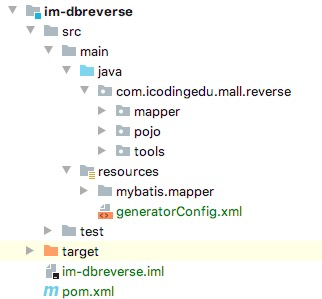

[TOC]

## 目录

- [分布式系统架构搭建](#分布式系统架构搭建)
  - [1、项目前期知识回顾及DoR](#1项目前期知识回顾及DoR)
  - [2、系统技术栈及工程规划](#2系统技术栈及工程规划)
  - [3、系统数据库结构分析及工具使用](#3系统数据库结构分析及工具使用)
  - [4、统一接口及及异常数据返回](#4统一接口及及异常数据返回)
  - [5、数据库逆向工程应用](#5数据库逆向工程应用)
  - [6、系统分布式架构设计](#6系统分布式架构设计)
  - [7、Dubbo实现分布式服务架构](#7Dubbo实现分布式服务架构)
- [分布式架构实践：使用Dubbo实现服务治理](#分布式架构实践使用Dubbo实现服务治理)
  - [1、什么是分布式系统架构，演进的各个阶段](#1什么是分布式系统架构演进的各个阶段)
  - [2、使用Dubbo实现服务治理，Dubbo的应用场景](#2使用Dubbo实现服务治理Dubbo的应用场景)
  - [3、Dubbo的应用架构及内部结构调用关系](#3Dubbo的应用架构及内部结构调用关系)
  - [4、基于Springboot搭建Dubbo环境和服务](#4基于Springboot搭建Dubbo环境和服务)
  - [5、Dubbo服务治理之服务高可用](#5Dubbo服务治理之服务高可用)
  - [6、Dubbo实现服务负载均衡机制&粘滞连接](#6Dubbo实现服务负载均衡机制&粘滞连接)
  - [7、Dubbo实现集群&服务容错](#7Dubbo实现集群&服务容错)
  - [8、Dubbo实现服务降级：Admin管理降级，Mock返回，本地存根主动降级](#8Dubbo实现服务降级Admin管理降级Mock返回本地存根主动降级)
  - [9、Dubbo实现版本控制灰度发布：version，group](#9Dubbo实现版本控制灰度发布versiongroup)
  - [10、Dubbo实现隐式传参](#10Dubbo实现隐式传参)
- [Dubbo集成&分布式锁实现](#Dubbo集成&分布式锁实现)
  - [1、Dubbo启用高速序列化](#1Dubbo启用高速序列化)
  - [2、集成Dubbo的其他方式，group聚合应用](#2集成Dubbo的其他方式group聚合应用)
  - [3、Dubbo服务化配置最佳使用实践](#3Dubbo服务化配置最佳使用实践)
  - [4、单应用场景下的锁机制](#4单应用场景下的锁机制)
  - [5、分布式场景下的锁机制](#5分布式场景下的锁机制)


## 分布式系统架构搭建

### 1、项目前期知识回顾及DoR

springboot、vue、thymeleaf、swagger、MySQL、MyBatis、Nginx、FastDFS，这些技术栈后续在项目实战中均会体现

### 2、系统技术栈及工程规划

将整个系统基于模块化开发，拆分成为各个业务模块，为后续的分布式微服务调用做基础

代码托管至GitHub：https://github.com/hjtbfx/icodingedu-mall-study.git

#### 2.1. 基础模块

##### 2.1.1. im-parent

**依赖包管理模块**

该模块主要对系统中所有使用到的依赖包进行管理，作为系统所有工程的父级依赖及依赖包版本管理工具

创建：以Module形式的maven工程


***创建的Module不是Maven项目可以在项目的POM文件上鼠标右键将其设置为maven项目***

**im-parent模块需要做的事情**

- 将springboot的父依赖放入
- 将packaging设置为pom形式
- 加入整个项目现在及将来要使用的依赖包版本和依赖管理

**POM文件**

```xml
<?xml version="1.0" encoding="UTF-8"?>
<project xmlns="http://maven.apache.org/POM/4.0.0"
         xmlns:xsi="http://www.w3.org/2001/XMLSchema-instance"
         xsi:schemaLocation="http://maven.apache.org/POM/4.0.0 http://maven.apache.org/xsd/maven-4.0.0.xsd">
    <modelVersion>4.0.0</modelVersion>
    <parent>
        <groupId>org.springframework.boot</groupId>
        <artifactId>spring-boot-starter-parent</artifactId>
        <version>2.2.2.RELEASE</version>
        <relativePath/> <!-- lookup parent from repository -->
    </parent>
    <groupId>com.icodingedu.mall</groupId>
    <artifactId>im-parent</artifactId>
    <version>1.0-SNAPSHOT</version>
    <packaging>pom</packaging>

    <properties>
        <project.build.sourceEncoding>UTF-8</project.build.sourceEncoding>
        <project.reporting.outputEncoding>UTF-8</project.reporting.outputEncoding>
        <java.version>1.8</java.version>
        <!--dubbo-->
        <dubbo-starter.version>2.7.3</dubbo-starter.version>
        <kryo.version>4.0.2</kryo.version>
        <kryo-serializers.version>0.45</kryo-serializers.version>
        <!--zookeeper-->
        <zkclient.version>0.11</zkclient.version>
        <curator-framework.version>2.12.0</curator-framework.version>
        <curator-recipes.version>2.12.0</curator-recipes.version>
        <zookeeper.version>3.4.14</zookeeper.version>
        <!--MyBatis Mapper-->
        <mybatis.version>2.1.1</mybatis.version>
        <mapper.version>4.1.5</mapper.version>
        <mybatis-generator.version>1.3.2</mybatis-generator.version>
        <pagehelper-starter.version>1.2.13</pagehelper-starter.version>
        <!--log-->
        <xml-apis.version>1.4.01</xml-apis.version>
        <commons-lang3.version>3.9</commons-lang3.version>
        <log4j-starter.version>1.3.8.RELEASE</log4j-starter.version>
        <!--local file fastDFS-->
        <fileupload.version>1.4</fileupload.version>
        <io.version>2.6</io.version>
        <fastdfs.version>1.26.7</fastdfs.version>
        <!--hystrix-->
        <hystrix.version>2.2.1.RELEASE</hystrix.version>
        <hystrix-dashboard.version>2.2.1.RELEASE</hystrix-dashboard.version>
    </properties>

    <dependencyManagement>
        <dependencies>
            <dependency>
                <groupId>com.101tec</groupId>
                <artifactId>zkclient</artifactId>
                <version>${zkclient.version}</version>
            </dependency>
            <dependency>
                <groupId>org.apache.dubbo</groupId>
                <artifactId>dubbo-spring-boot-starter</artifactId>
                <version>${dubbo-starter.version}</version>
            </dependency>

            <dependency>
                <groupId>org.apache.curator</groupId>
                <artifactId>curator-framework</artifactId>
                <version>${curator-framework.version}</version>
            </dependency>
            <dependency>
                <groupId>org.apache.curator</groupId>
                <artifactId>curator-recipes</artifactId>
                <version>${curator-recipes.version}</version>
            </dependency>
            <dependency>
                <groupId>org.apache.zookeeper</groupId>
                <artifactId>zookeeper</artifactId>
                <version>${zookeeper.version}</version>
            </dependency>

            <dependency>
                <groupId>org.mybatis.spring.boot</groupId>
                <artifactId>mybatis-spring-boot-starter</artifactId>
                <version>${mybatis.version}</version>
            </dependency>

            <dependency>
                <groupId>xml-apis</groupId>
                <artifactId>xml-apis</artifactId>
                <version>${xml-apis.version}</version>
            </dependency>

            <dependency>
                <groupId>org.apache.commons</groupId>
                <artifactId>commons-lang3</artifactId>
                <version>${commons-lang3.version}</version>
            </dependency>

            <dependency>
                <groupId>org.springframework.boot</groupId>
                <artifactId>spring-boot-starter-log4j</artifactId>
                <version>${log4j-starter.version}</version>
            </dependency>

            <dependency>
                <groupId>com.github.pagehelper</groupId>
                <artifactId>pagehelper-spring-boot-starter</artifactId>
                <version>${pagehelper-starter.version}</version>
            </dependency>

            <dependency>
                <groupId>tk.mybatis</groupId>
                <artifactId>mapper</artifactId>
                <version>${mapper.version}</version>
            </dependency>

            <dependency>
                <groupId>org.mybatis.generator</groupId>
                <artifactId>mybatis-generator-core</artifactId>
                <version>${mybatis-generator.version}</version>
            </dependency>

            <dependency>
                <groupId>commons-fileupload</groupId>
                <artifactId>commons-fileupload</artifactId>
                <version>${fileupload.version}</version>
            </dependency>

            <dependency>
                <groupId>commons-io</groupId>
                <artifactId>commons-io</artifactId>
                <version>${io.version}</version>
            </dependency>

            <dependency>
                <groupId>com.github.tobato</groupId>
                <artifactId>fastdfs-client</artifactId>
                <version>${fastdfs.version}</version>
            </dependency>

            <dependency>
                <groupId>com.esotericsoftware</groupId>
                <artifactId>kryo</artifactId>
                <version>${kryo.version}</version>
            </dependency>

            <dependency>
                <groupId>de.javakaffee</groupId>
                <artifactId>kryo-serializers</artifactId>
                <version>${kryo-serializers.version}</version>
            </dependency>

            <dependency>
                <groupId>org.springframework.cloud</groupId>
                <artifactId>spring-cloud-starter-netflix-hystrix</artifactId>
                <version>${hystrix.version}</version>
            </dependency>
            <dependency>
                <groupId>org.springframework.cloud</groupId>
                <artifactId>spring-cloud-starter-netflix-hystrix-dashboard</artifactId>
                <version>${hystrix-dashboard.version}</version>
            </dependency>
        </dependencies>
    </dependencyManagement>
</project>
```

##### 2.1.2. im-api

**存放所有的bean和接口**

im-api模块也是创建一个maven的module，主要用来存放bean数据和后续所有业务模块的接口

将bean和接口抽离是为了使各个业务模块更面向业务，将公共使用的实体类、pojo、接口集中管理，便于进行服务注册的发现的调用

由于要存放bean，因此需要导入的Lombok依赖和后面tk-mybatis生成pojo的依赖

```xml
<?xml version="1.0" encoding="UTF-8"?>
<project xmlns="http://maven.apache.org/POM/4.0.0"
         xmlns:xsi="http://www.w3.org/2001/XMLSchema-instance"
         xsi:schemaLocation="http://maven.apache.org/POM/4.0.0 http://maven.apache.org/xsd/maven-4.0.0.xsd">
    <modelVersion>4.0.0</modelVersion>
    <parent>
        <artifactId>im-parent</artifactId>
        <groupId>com.icodingedu.mall</groupId>
        <version>1.0-SNAPSHOT</version>
    </parent>
    <groupId>com.icodingedu.mall</groupId>
    <artifactId>im-api</artifactId>
    <version>1.0-SNAPSHOT</version>

    <dependencies>
        <dependency>
            <groupId>org.projectlombok</groupId>
            <artifactId>lombok</artifactId>
        </dependency>
        <dependency>
            <groupId>tk.mybatis</groupId>
            <artifactId>mapper</artifactId>
        </dependency>
    </dependencies>
</project>
```

##### 2.1.3. im-common-util

存放所有业务模块公共的依赖（springboot启动依赖）以及工具类，统一API返回工具类，统一异常输出

```xml
<?xml version="1.0" encoding="UTF-8"?>
<project xmlns="http://maven.apache.org/POM/4.0.0"
         xmlns:xsi="http://www.w3.org/2001/XMLSchema-instance"
         xsi:schemaLocation="http://maven.apache.org/POM/4.0.0 http://maven.apache.org/xsd/maven-4.0.0.xsd">
    <modelVersion>4.0.0</modelVersion>
    <parent>
        <artifactId>im-parent</artifactId>
        <groupId>com.icodingedu.mall</groupId>
        <version>1.0-SNAPSHOT</version>
    </parent>
    <groupId>com.icodingedu.mall</groupId>
    <artifactId>im-common-util</artifactId>
    <version>1.0-SNAPSHOT</version>

    <dependencies>
        <dependency>
            <groupId>org.springframework.boot</groupId>
            <artifactId>spring-boot-starter-web</artifactId>
        </dependency>
        <dependency>
            <groupId>org.springframework.boot</groupId>
            <artifactId>spring-boot-starter-test</artifactId>
            <exclusions>
                <exclusion>
                    <groupId>org.junit.vintage</groupId>
                    <artifactId>junit-vintage-engine</artifactId>
                </exclusion>
            </exclusions>
        </dependency>
    </dependencies>
</project>
```

1、加入统一API返回

- 创建Package：com.icodingedu.mall.common

- 打开项目的类序列化id设置自动生成序列化id


```java
package com.icodingedu.mall.common;

import java.io.Serializable;

public class R implements Serializable {
    private static final long serialVersionUID = 7874608936453437793L;
    private static final int SUCCESS_CODE = 200;
    private static final String SUCCESS_MSG = "SUCCESS";
    
    private int code = SUCCESS_CODE;
    private String msg = SUCCESS_MSG;
    private Object data = null;

    public R() {
    }

    public static R returnOK(){
        return new R();
    }

    public static R returnOK(int code, String msg){
        R response = new R();
        response.setCode(code);
        response.setMsg(msg);
        return  response;
    }

    public static R returnOK(int code, String msg, Object data){
        R response = new R();
        response.setCode(code);
        response.setMsg(msg);
        response.setData(data);
        return  response;
    }

    public static R returnFAIL(int code, String msg){
        R response = new R();
        response.setCode(code);
        response.setMsg(msg);
        return  response;
    }

    public static R returnFAIL(int code, String msg, Object data){
        R response = new R();
        response.setCode(code);
        response.setMsg(msg);
        response.setData(data);
        return  response;
    }

    public int getCode() {
        return this.code;
    }

    public String getMsg() {
        return this.msg;
    }

    public Object getData() {
        return this.data;
    }

    public void setCode(int code) {
        this.code = code;
    }

    public void setMsg(String msg) {
        this.msg = msg;
    }

    public void setData(Object data) {
        this.data = data;
    }
}
```

2、加入统一的异常信息返回处理

```java
package com.icodingedu.mall.common;

import org.springframework.web.bind.annotation.ControllerAdvice;
import org.springframework.web.bind.annotation.ExceptionHandler;
import org.springframework.web.bind.annotation.ResponseBody;

@ControllerAdvice
public class MyExceptionHandler {
    
    //Exception异常处理，也可以细化到具体的异常
    @ResponseBody
    @ExceptionHandler(Exception.class)
    //这里将统一返回结合在一起用
    public R handleException(Exception e){
        //这里的code可以根据业务需要自行编写
        return R.returnFAIL(500,e.getMessage());
    }
}
```

##### 2.1.4. im-web-util

存放对接静态前端页面的controller相关依赖，例如我们的后台管理系统界面使用thymeleaf进行开发，这里就需要引入thymeleaf的依赖

```xml
<?xml version="1.0" encoding="UTF-8"?>
<project xmlns="http://maven.apache.org/POM/4.0.0"
         xmlns:xsi="http://www.w3.org/2001/XMLSchema-instance"
         xsi:schemaLocation="http://maven.apache.org/POM/4.0.0 http://maven.apache.org/xsd/maven-4.0.0.xsd">
    <modelVersion>4.0.0</modelVersion>
    <parent>
        <artifactId>im-parent</artifactId>
        <groupId>com.icodingedu.mall</groupId>
        <version>1.0-SNAPSHOT</version>
    </parent>
    <groupId>com.icodingedu.mall</groupId>
    <artifactId>im-web-util</artifactId>
    <version>1.0-SNAPSHOT</version>

    <dependencies>
        <dependency>
            <groupId>org.springframework.boot</groupId>
            <artifactId>spring-boot-starter-thymeleaf</artifactId>
        </dependency>
    </dependencies>
</project>
```

##### 2.1.5. im-service-util

存放后端业务服务模块相关依赖包，比如数据库依赖，MyBatis，PageHelper

```xml
<?xml version="1.0" encoding="UTF-8"?>
<project xmlns="http://maven.apache.org/POM/4.0.0"
         xmlns:xsi="http://www.w3.org/2001/XMLSchema-instance"
         xsi:schemaLocation="http://maven.apache.org/POM/4.0.0 http://maven.apache.org/xsd/maven-4.0.0.xsd">
    <modelVersion>4.0.0</modelVersion>
    <parent>
        <artifactId>im-parent</artifactId>
        <groupId>com.icodingedu.mall</groupId>
        <version>1.0-SNAPSHOT</version>
    </parent>
    <groupId>com.icodingedu.mall</groupId>
    <artifactId>im-service-util</artifactId>
    <version>1.0-SNAPSHOT</version>

    <dependencies>
        <dependency>
            <groupId>com.github.pagehelper</groupId>
            <artifactId>pagehelper-spring-boot-starter</artifactId>
        </dependency>
        <dependency>
            <groupId>org.mybatis.spring.boot</groupId>
            <artifactId>mybatis-spring-boot-starter</artifactId>
        </dependency>
        <dependency>
            <groupId>org.springframework.boot</groupId>
            <artifactId>spring-boot-starter-jdbc</artifactId>
        </dependency>
        <dependency>
            <groupId>mysql</groupId>
            <artifactId>mysql-connector-java</artifactId>
            <scope>runtime</scope>
        </dependency>
    </dependencies>
</project>
```

> 以上的基础模块框架已经搭建完毕，后续需要新增其他内容再根据场景进行分类加入即可

#### 2.2. 业务模块


按照上面的业务流程图，先完成后台业务管理功能模块，后台业务功能模块先以产品为主线

##### 2.2.1. im-admin-web

后台管理系统业务模块，使用thymeleaf集成功能页面，主要包含：鉴权，权限管理，员工管理，thymeleaf页面

因此基础模块都需要导入，**对于业务系统均需要创建为springboot项目**

pom依赖修改如下

```xml
<?xml version="1.0" encoding="UTF-8"?>
<project xmlns="http://maven.apache.org/POM/4.0.0" xmlns:xsi="http://www.w3.org/2001/XMLSchema-instance"
	xsi:schemaLocation="http://maven.apache.org/POM/4.0.0 https://maven.apache.org/xsd/maven-4.0.0.xsd">
	<modelVersion>4.0.0</modelVersion>
	<parent>
		<artifactId>im-parent</artifactId>
		<groupId>com.icodingedu.mall</groupId>
		<version>1.0-SNAPSHOT</version>
	</parent>
	<groupId>com.icodingedu.mall</groupId>
	<artifactId>im-admin-web</artifactId>
	<version>0.0.1-SNAPSHOT</version>
	<name>im-admin-web</name>
	<description>im-admin-web</description>

	<properties>
		<java.version>1.8</java.version>
	</properties>

	<dependencies>
		<dependency>
			<groupId>com.icodingedu.mall</groupId>
			<artifactId>im-api</artifactId>
			<version>1.0-SNAPSHOT</version>
		</dependency>
		<dependency>
			<groupId>com.icodingedu.mall</groupId>
			<artifactId>im-common-util</artifactId>
			<version>1.0-SNAPSHOT</version>
		</dependency>
		<dependency>
			<groupId>com.icodingedu.mall</groupId>
			<artifactId>im-web-util</artifactId>
			<version>1.0-SNAPSHOT</version>
		</dependency>
		<dependency>
			<groupId>com.icodingedu.mall</groupId>
			<artifactId>im-service-util</artifactId>
			<version>1.0-SNAPSHOT</version>
		</dependency>
	</dependencies>

	<build>
		<plugins>
			<plugin>
				<groupId>org.springframework.boot</groupId>
				<artifactId>spring-boot-maven-plugin</artifactId>
			</plugin>
		</plugins>
	</build>
</project>
```

#####2.2.2. im-product-manage

产品信息管理模块，对外提供产品相关信息的查询上传等功能，输入后端服务

因此只需要引用：im-parent, im-api, im-common-util, im-service-util，依然是springboot工程

```xml
<?xml version="1.0" encoding="UTF-8"?>
<project xmlns="http://maven.apache.org/POM/4.0.0" xmlns:xsi="http://www.w3.org/2001/XMLSchema-instance"
         xsi:schemaLocation="http://maven.apache.org/POM/4.0.0 https://maven.apache.org/xsd/maven-4.0.0.xsd">
    <modelVersion>4.0.0</modelVersion>
    <parent>
        <artifactId>im-parent</artifactId>
        <groupId>com.icodingedu.mall</groupId>
        <version>1.0-SNAPSHOT</version>
    </parent>
    <groupId>com.icodingedu.mall</groupId>
    <artifactId>im-product-manage</artifactId>
    <version>0.0.1-SNAPSHOT</version>
    <name>im-product-manage</name>
    <description>im-product-manage</description>

    <properties>
        <java.version>1.8</java.version>
    </properties>

    <dependencies>
        <dependency>
            <groupId>com.icodingedu.mall</groupId>
            <artifactId>im-api</artifactId>
            <version>1.0-SNAPSHOT</version>
        </dependency>
        <dependency>
            <groupId>com.icodingedu.mall</groupId>
            <artifactId>im-common-util</artifactId>
            <version>1.0-SNAPSHOT</version>
        </dependency>
        <dependency>
            <groupId>com.icodingedu.mall</groupId>
            <artifactId>im-service-util</artifactId>
            <version>1.0-SNAPSHOT</version>
        </dependency>
    </dependencies>
    
    <build>
        <plugins>
            <plugin>
                <groupId>org.springframework.boot</groupId>
                <artifactId>spring-boot-maven-plugin</artifactId>
            </plugin>
        </plugins>
    </build>
</project>
```

> 至此系统框架已经搭建完成，只待业务填充了

### 3、系统数据库结构分析及工具使用

数据脚本在代码库的sql-file文件夹下，使用PDMan建模工具可以管理数据库版本


### 4、统一接口及及异常数据返回

公共代码已经提取到im-common-util中，只需要在接口返回时调用即可，异常信息返回会自动加载

### 5、数据库逆向工程应用

#### 5.1. 逆向工程使用

单独创建一个逆向工程用来生成pojo，mapper，mapper.xml



pom导入依赖如下

```xml
<?xml version="1.0" encoding="UTF-8"?>
<project xmlns="http://maven.apache.org/POM/4.0.0"
         xmlns:xsi="http://www.w3.org/2001/XMLSchema-instance"
         xsi:schemaLocation="http://maven.apache.org/POM/4.0.0 http://maven.apache.org/xsd/maven-4.0.0.xsd">
    <modelVersion>4.0.0</modelVersion>
    <parent>
        <artifactId>im-parent</artifactId>
        <groupId>com.icodingedu.mall</groupId>
        <version>1.0-SNAPSHOT</version>
    </parent>
    <groupId>com.icodingedu.com</groupId>
    <artifactId>im-dbreverse</artifactId>
    <version>1.0-SNAPSHOT</version>

    <dependencies>
        <dependency>
            <groupId>com.icodingedu.mall</groupId>
            <artifactId>im-api</artifactId>
            <version>1.0-SNAPSHOT</version>
        </dependency>
        <dependency>
            <groupId>com.icodingedu.mall</groupId>
            <artifactId>im-common-util</artifactId>
            <version>1.0-SNAPSHOT</version>
        </dependency>
        <dependency>
            <groupId>com.icodingedu.mall</groupId>
            <artifactId>im-service-util</artifactId>
            <version>1.0-SNAPSHOT</version>
        </dependency>
        <dependency>
            <groupId>org.mybatis.generator</groupId>
            <artifactId>mybatis-generator-core</artifactId>
        </dependency>
    </dependencies>
</project>
```

逆向工程配置文件generatorConfig.xml，放在resource下

```xml
<?xml version="1.0" encoding="UTF-8"?>
<!DOCTYPE generatorConfiguration
        PUBLIC "-//mybatis.org//DTD MyBatis Generator Configuration 1.0//EN"
        "http://mybatis.org/dtd/mybatis-generator-config_1_0.dtd">

<generatorConfiguration>
    <context id="MysqlContext" targetRuntime="MyBatis3Simple" defaultModelType="flat">
        <property name="beginningDelimiter" value="`"/>
        <property name="endingDelimiter" value="`"/>

        <!-- 通用mapper所在目录 -->
        <plugin type="tk.mybatis.mapper.generator.MapperPlugin">
            <property name="mappers" value="com.icodingedu.mall.reverse.tools.MyMapper"/>
        </plugin>

        <jdbcConnection driverClass="com.mysql.cj.jdbc.Driver"
                        connectionURL="jdbc:mysql://localhost:3306/icoding-mall"
                        userId="root"
                        password="gavin">
        </jdbcConnection>

        <!-- 对应生成的pojo所在包 -->
        <javaModelGenerator targetPackage="com.icodingedu.mall.reverse.pojo" targetProject="/Users/gavin/Documents/ideaworkspace/icodingedu-mall-study/im-dbreverse/src/main/java"/>

		<!-- 对应生成的mapper.xml所在目录 -->
        <sqlMapGenerator targetPackage="mybatis/mapper" targetProject="/Users/gavin/Documents/ideaworkspace/icodingedu-mall-study/im-dbreverse/src/main/resources"/>

		<!-- 配置mapper对应的java映射 -->
        <javaClientGenerator targetPackage="com.icodingedu.mall.reverse.mapper" targetProject="/Users/gavin/Documents/ideaworkspace/icodingedu-mall-study/im-dbreverse/src/main/java" type="XMLMAPPER"/>

        <!-- 数据库表 -->
		<table tableName="im_product"></table>
        <table tableName="im_product_images"></table>
        <table tableName="im_product_inventory"></table>
    </context>
</generatorConfiguration>
```

逆向生成类

```java
package com.icodingedu.mall.reverse.tools;

import org.mybatis.generator.api.MyBatisGenerator;
import org.mybatis.generator.config.Configuration;
import org.mybatis.generator.config.xml.ConfigurationParser;
import org.mybatis.generator.internal.DefaultShellCallback;
import org.springframework.util.ResourceUtils;

import java.io.File;
import java.util.ArrayList;
import java.util.List;


public class GeneratorDisplay {

	public void generator() throws Exception {

		List<String> warnings = new ArrayList<String>();
		boolean overwrite = true;
		//指定 逆向工程配置文件
		File configFile = ResourceUtils.getFile("classpath:generatorConfig.xml");
		ConfigurationParser cp = new ConfigurationParser(warnings);
		Configuration config = cp.parseConfiguration(configFile);
		DefaultShellCallback callback = new DefaultShellCallback(overwrite);
		MyBatisGenerator myBatisGenerator = new MyBatisGenerator(config,
				callback, warnings);
		myBatisGenerator.generate(null);
	} 
	
	public static void main(String[] args) throws Exception {
		try {
			GeneratorDisplay generatorSqlmap = new GeneratorDisplay();
			generatorSqlmap.generator();
		} catch (Exception e) {
			e.printStackTrace();
		}
	}
}
```

以上逆向工程生成pojo、mapper、mapper.xml完毕后

- pojo类和MyMapper接口复制到im-api模块中


- mapper和mapper.xml复制到需要使用的模块

这里只逆向了产品信息，直接复制到im-product-manage里即可，复制后的代码参考GitHub

#### 5.2. 逆向工程应用

##### 5.2.1. 使用tk-mapper实现CRUD

**将mapper和mapper.xml导入后im-product-manage注意bean和mapper的资源路径要重新引用**

im-product-manage的yaml文件

```yaml
server:
  port: 8091
  tomcat:
    uri-encoding: UTF-8
spring:
  datasource:
    username: root
    password: gavin
    url: jdbc:mysql://localhost:3306/icoding-mall?useUnicode=true&characterEncoding=UTF-8
    driver-class-name: com.mysql.cj.jdbc.Driver
    type: com.zaxxer.hikari.HikariDataSource
    hikari:
      connection-timeout: 30000     #等待分配连接最大时长，毫秒，默认30秒
      minimum-idle: 5               #最小连接数
      maximum-pool-size: 20         #最大连接数,推荐的公式：((core_count * 2) + effective_spindle_count)
      auto-commit: true             #自动提交
      idle-timeout: 600000          #连接闲置的最大时长，毫秒，默认10分钟
      pool-name: DataSourceHikariCP #自定义名字
      max-lifetime: 1800000 #一个连接的生命时长（毫秒），超时而且没被使用则被释放（retired），缺省:30分钟
      connection-test-query: select 1 #测试活跃sql
#使用tk-mybatis缺省可以不加
mapper:
  mappers: com.icodingedu.mall.api.service.MyMapper
  not-empty: false
  identity: MYSQL
#使用pagehelper缺省可以不加
pagehelper:
  helper-dialect: mysql
  reasonable: true
  support-methods-arguments: false
```

使用tk-mybatis需要在启动类上加入注解扫包

```java
@MapperScan("com.icodingedu.mall.product.mapper")
```

**接口实现**

```java
package com.icodingedu.mall.api.service;

import com.icodingedu.mall.api.bean.ImProduct;
import java.util.List;

public interface ProductService {
    List<ImProduct> queryProductList(int pageNum,int pageSize);
}
```

**实现类**

```java
package com.icodingedu.mall.product.service.impl;

import com.github.pagehelper.PageHelper;
import com.icodingedu.mall.api.bean.ImProduct;
import com.icodingedu.mall.api.service.ProductService;
import com.icodingedu.mall.product.mapper.ImProductMapper;
import org.springframework.beans.factory.annotation.Autowired;
import org.springframework.stereotype.Service;

import java.util.List;

@Service
public class ProductServiceImpl implements ProductService {

    @Autowired
    ImProductMapper imProductMapper;

    @Override
    public List<ImProduct> queryProductList(int pageNum,int pageSize) {
        PageHelper.startPage(pageNum,pageSize);
        List<ImProduct> imProductList = imProductMapper.selectAll();
        return imProductList;
    }
}
```

**controller**

```java
package com.icodingedu.mall.product.controller;

import com.github.pagehelper.PageInfo;
import com.icodingedu.mall.api.bean.ImProduct;
import com.icodingedu.mall.api.service.ProductService;
import com.icodingedu.mall.common.R;
import org.springframework.beans.factory.annotation.Autowired;
import org.springframework.stereotype.Controller;
import org.springframework.web.bind.annotation.GetMapping;
import org.springframework.web.bind.annotation.ResponseBody;

import java.util.List;

@Controller
public class ProductController {

    @Autowired
    ProductService productService;

    @GetMapping("/productlist")
    @ResponseBody
    public R queryAllProduct(){
        List<ImProduct> imProductList = productService.queryProductList(1,3);
        PageInfo<ImProduct> productPageInfo = new PageInfo<ImProduct>(imProductList);
        return R.returnOK(200,"成功",productPageInfo);
    }
}
```

> 至此一个完整的调用已完成，调用关系也已验证完成

### 6、系统分布式架构设计

系统在分布式前是以单体垂直集群模式运行，一个系统内业务功能互相影响


这个时候就需要将业务按照功能模块进行拆分


### 7、Dubbo实现分布式服务架构

Dubbo就是用来实现服务治理的框架，具体内容下次课程详细讲解


## 分布式架构实践：使用Dubbo实现服务治理

### 1、什么是分布式系统架构，演进的各个阶段


4个方面的问题：高可用、高并发、高性能，服务如何管理

- 客户端如何访问这么多的服务（nginx，tomcat多外暴http端口？）

  通过API网关，dubbo，zuul

- 服务与服务之间是如何通信的？

  - 同步通信（http，RPC）
  - 异步通信（MQ）

- 这么多的服务如何管理

  - 服务治理：什么时候服务上线，什么时候服务下线，这就需要服务的注册与发现

- 如果垂直架构里某个功能模块出现宕机或不可用，这个时候我们已经分布式了

  - 容错重试机制
  - 服务的降级：**写库存、同步支付信息**、邮件或其他方式同步给用户
  - 服务限流
  - 服务熔断

### 2、使用Dubbo实现服务治理，Dubbo的应用场景


### 3、Dubbo的应用架构及内部结构调用关系


##### 节点角色说明

| 节点        | 角色说明                               |
| ----------- | -------------------------------------- |
| `Provider`  | 暴露服务的服务提供方                   |
| `Consumer`  | 调用远程服务的服务消费方               |
| `Registry`  | 服务注册与发现的注册中心               |
| `Monitor`   | 统计服务的调用次数和调用时间的监控中心 |
| `Container` | 服务运行容器                           |

**Dubbo对于服务的管理和支持，可以理解为让远程调用就像我们本地调用一样简单**


### 4、基于Springboot搭建Dubbo环境和服务

管理中心


zookeeper搭建好

1、下载zookeeper修改配置

dataDir=/Users/gavin/Documents/zookeeper-alone/data
dataLogDir=/Users/gavin/Documents/zookeeper-alone/log

2、启动在bin目录下：./zkServer.sh start

启动dubbo-admin：java -jar dubbo-admin-0.0.1-SNAPSHOT.jar

```properties
server.port=7001
spring.velocity.cache=false
spring.velocity.charset=UTF-8
spring.velocity.layout-url=/templates/default.vm
spring.messages.fallback-to-system-locale=false
spring.messages.basename=i18n/message
spring.root.password=root
spring.guest.password=guest

dubbo.registry.address=zookeeper://127.0.0.1:2181
#注意注册中心地址
```

#### 4.1. provider的配置

依赖包放在im-common-util下

```xml
        <dependency>
            <groupId>org.apache.dubbo</groupId>
            <artifactId>dubbo-spring-boot-starter</artifactId>
        </dependency>

        <dependency>
            <groupId>com.101tec</groupId>
            <artifactId>zkclient</artifactId>
        </dependency>
        <dependency>
            <groupId>org.apache.curator</groupId>
            <artifactId>curator-framework</artifactId>
        </dependency>
        <dependency>
            <groupId>org.apache.curator</groupId>
            <artifactId>curator-recipes</artifactId>
        </dependency>
        <dependency>
            <groupId>org.apache.zookeeper</groupId>
            <artifactId>zookeeper</artifactId>
            <exclusions>
                <exclusion>
                    <groupId>org.slf4j</groupId>
                    <artifactId>slf4j-log4j12</artifactId>
                </exclusion>
            </exclusions>
        </dependency>
```

做yaml配置

```yaml
dubbo:
  application:
    name: product-manage
  protocol:
    name: dubbo
    port: 20880
  registry:
    protocol: zookeeper
    address: 127.0.0.1:2181
  scan:
    base-packages: com.icodingedu.mall
#也可以不扫包，用@EnableDubbo在启动类上
```

托管实现类

```java
import org.apache.dubbo.config.annotation.Service;
@Service
@Component
```

#### 4.2. consumer配置

yaml配置

```yaml
dubbo:
  application:
    name: admin-web
  protocol:
    name: dubbo
  registry:
    protocol: zookeeper
    address: 127.0.0.1:2181
  consumer:
    check: false
```

consumer调用，调用传递的对象需要序列化

```java
public class ImProduct implements Serializable {
    private static final long serialVersionUID = -4298312059463116715L;
```

调用方式

```java
@Controller
public class RouterController {

    @Reference
    ProductService productService;

    public R getProductList(){
        return R.returnOK(200,"ok",productService.queryProductList(1,3));
    }
}
```

### 5、Dubbo服务治理之服务高可用

如果运行中zookeeper挂了，还是可以消费dubbo暴露的服务

如果zookeeper实现集群后，任意一台宕机后会自动切换到另一台

虽然可以继续访问暴露的服务，但不能新注册了

### 6、Dubbo实现服务负载均衡机制&粘滞连接

配置的调用顺序

- 方法级优先，接口级次之，最后是全局
- 如果级别一样，则消费方优先，提供方次之


两个都可以通过配置进行处理

```java
    @Reference(loadbalance = "roundrobin",sticky=true) //固定到一个服务上
    ProductService productService;
```

### 7、Dubbo实现集群&服务容错

服务容错


### 8、Dubbo实现服务降级：Admin管理降级，Mock返回，本地存根主动降级

Mock数据配置，也是在consumer端

```java
//这个是在调用的接口注解
@Reference(mock = "com.icodingedu.mall.admin.service.impl.ProductServiceMock")

//Mock实现类
public class ProductServiceMock implements ProductService {
    @Override
    public List<ImProduct> queryProductList(int pageNum, int pageSize) {
        List<ImProduct> imProductList = new ArrayList<ImProduct>();
        ImProduct imProduct = new ImProduct();
        imProduct.setProductTitle("Mock Product");
        imProductList.add(imProduct);
        return imProductList;
    }
}
```

本地存根就可以做到主动降级，在消费者consumer端

```java
@Reference(mock = "com.icodingedu.mall.admin.service.impl.ProductServiceMock",stub = "com.icodingedu.mall.admin.service.impl.ProductServiceStub")
    ProductService productService;

//stub的实现类
public class ProductServiceStub implements ProductService {

    //远端调用的服务
    private final ProductService productService;
    //dubbo会通过这个有参的构造函数注入远程调用
    public ProductServiceStub(ProductService productService){
        this.productService = productService;
    }

    @Override
    public List<ImProduct> queryProductList(int pageNum, int pageSize) {
        System.out.println("==============stub service=============");
        return productService.queryProductList(pageNum,pageSize);
    }
}
```

### 9、Dubbo实现版本控制灰度发布：version，group

如果说有一个功能我还处于测试中，这个时候我们上线了希望只让一部分人使用

```java
@Reference(version = "2.0.0")
@Reference(group = "gp1")
```

```java
@Service(version = "2.0.0")
@Reference(group = "gp2")
```

group和version类似，但是group提供一个分组合并的功能

### 10、Dubbo实现隐式传参

```java
//consumer
RpcContext.getContext().setAttachment("id","gavin-admin-web");
//provider
String appid = RpcContext.getContext().getAttachment("id");
```


## Dubbo集成&分布式锁实现

### 1、Dubbo启用高速序列化

Java序列化本质就是将Java对象保存成二进制字节码

作用就是通过网络传输进行相应的转码

dubbo远程调用序列化默认的方式是**hessian2**

在进行服务化的过程中：要优化服务间调用

- 网络之间的带宽和速度，网络结构
- 传输数据本身的大小：json（gzip压缩）

RPC远程调用优化：序列化的加速

1、引用jar包因为provider和consumer都要用，放在common里

```xml
<dependency>
  <groupId>com.esotericsoftware</groupId>
  <artifactId>kryo</artifactId>
</dependency>

<dependency>
  <groupId>de.javakaffee</groupId>
  <artifactId>kryo-serializers</artifactId>
</dependency>
```

2、provider和consumer都要开启kryo

```yaml
dubbo:
  protocol:
    serialization: kryo
```

在consumer端额外指定我们的序列化声明（因为要多次取，存只放一次）

```yaml
dubbo:
  protocol:
    serialization: kryo
    optimizer: com.icodingedu.mall.product.service.impl.SerializationOptimizerImpl
```

序列化实现代码

```java
import com.icodingedu.mall.api.bean.ImProduct;
import org.apache.dubbo.common.serialize.support.SerializationOptimizer;

import java.util.Collection;
import java.util.LinkedList;
import java.util.List;

public class SerializationOptimizerImpl implements SerializationOptimizer {
    @Override
    public Collection<Class> getSerializableClasses() {
        List<Class> classes = new LinkedList<Class>();
        classes.add(ImProduct.class);
        return classes;
    }
}
```

### 2、集成Dubbo的其他方式，group聚合应用

1、yaml集成方式

- yaml配置协议
- 注解来引用
- 启动类@EnableDubbo或yaml扫包

2、xml集成方式

provider创建xml文件

```xml
<beans xmlns:xsi="http://www.w3.org/2001/XMLSchema-instance"
       xmlns:dubbo="http://dubbo.apache.org/schema/dubbo"
       xmlns="http://www.springframework.org/schema/beans"
       xsi:schemaLocation="http://www.springframework.org/schema/beans http://www.springframework.org/schema/beans/spring-beans.xsd
       http://dubbo.apache.org/schema/dubbo http://dubbo.apache.org/schema/dubbo/dubbo.xsd">
    <dubbo:application name="product-manage"/>
    <dubbo:registry address="zookeeper://127.0.0.1:2181"/>
    <dubbo:protocol name="dubbo" port="20880"/>
    <bean id="productService" class="com.icodingedu.mall.product.service.impl.ProductServiceImpl"/>
    <dubbo:service interface="com.icodingedu.mall.api.service.ProductService" ref="productService"/>
</beans>
```

启动类加入配置扫描

```java
@ImportResource(locations = "classpath:provider.xml")
```

consumer创建xml文件

```xml
<beans xmlns:xsi="http://www.w3.org/2001/XMLSchema-instance"
       xmlns:dubbo="http://dubbo.apache.org/schema/dubbo"
       xmlns="http://www.springframework.org/schema/beans"
       xsi:schemaLocation="http://www.springframework.org/schema/beans http://www.springframework.org/schema/beans/spring-beans.xsd
       http://dubbo.apache.org/schema/dubbo http://dubbo.apache.org/schema/dubbo/dubbo.xsd">
    <dubbo:application name="admin-web"/>
    <dubbo:registry address="zookeeper://127.0.0.1:2181"/>
    <dubbo:reference id="productService" check="false" interface="com.icodingedu.mall.api.service.ProductService"/>
</beans>
```

启动类加入配置扫描

```java
@ImportResource(locations = "classpath:consumer.xml")
```

group分组聚合的概念

1、provider多个接口但实现结果的group不同

2、consumer可以通过 group="gp1,gp2" merger="true" 将结果做合并

***group 可以在yaml和xml形式下实现分组，但分组合并必须要在xml下***

### 3、Dubbo服务化配置最佳使用实践

既然Dubbo是专注服务治理的，dubbo（SPI自己集成）比springcloud（全家桶）在微服务上有较大的差异

就要在服务的调用和提供上做好规划

**在 Provider 端尽量多配置 Consumer 端属性**

作为提供方，是最能够知道资源到底有多少的？consumer和provider已经是系统内部治理了

### 4、单应用场景下的锁机制


在这种情况下如何处理呢？

1、数据库乐观锁：数据更新状态发生变化后就停止更新，使用version记录的方式

```sql
select * from im_product_inventory where variants_id="v1001"; /**version=10**/
update im_product_inventory set inventory=inventory-1,version=version+1 where variants_id="v1001" and version=10;
```

优点：防止脏数据写入

缺点：没有顺序概念的，没有等待机制，共同抢夺资源，版本异常并不代表数据就无法实现，并且并发会对数据库带来压力

2、悲观锁

假设数据肯定会冲突，使用悲观锁一定要关闭自动自动提交set autocommit=0;

```sql
/**开始事务**/
begin transaction;
select inventory from product_inventory where id=1 for update;
/**开始修改**/
update product_inventory set inventory=inventory-1 where id=1;
/**提交事务**/
commit;
```

> 一定要注意：select .... for update，MySQL InneDB默认是行锁，行级锁都是基于索引实现的，如果查询条件不是索引列，会把整个表锁组，原因是如果没有索引就会扫整个表，就会锁表

优点：单任务，事务的隔离原子性

缺点：数据库效率执行低下，容易导致系统超时锁表

***随着互联网系统的三高架构：高并发、高性能、高可用的提出，悲观锁用的越来越少***

3、程序方式

```java
synchronized(this){}
```

并发等待，并且只有一个线程能进入


### 5、分布式场景下的锁机制

乐观锁悲观锁解决方案


1、分布式锁应该具备哪些条件

- 在分布式系统环境下，一个方法在同一时间只能被一个机器一个线程执行
- 高可用的获取锁和释放锁
- 高性能的获取与释放锁
- 具备可重入特性（多个线程同时进入也要保证不出错误）
- 具备锁失效机制，防止死锁
- 具备非阻塞特性，即便没有获取到锁也要能返回锁失效

2、分布式锁有哪些实现方式

- 使用Redis内存数据来实现分布式锁
- zookeeper来实现分布式锁
- Chubby：Google，Paxos算法解决

3、通过Redis实现分布式锁理解基本概念（作业：回去用下面的业务逻辑进行代码实现）

分布式锁有三个核心要素：加锁、解锁、锁超时

- 加锁：操作资源先去Redis里查是否有锁这个资源
  - get？setnx命令，key可以用资源的唯一标识，比如库存id，value？
  - 如果这个key存在就返回给用户：目前资源紧张请等待。或者循环访问直到可以使用为止
- 解锁：操作完成后通过del释放锁，这个时候另一个线程就能重新获取锁
- 锁超时：如果JVM1在执行业务过程中宕机了，这个时候锁就驻留Redis中无法释放，这个时候就会死锁，JVM2就永远无法执行了，这个时候就需要通过expire 10超时来设置锁的生命周期了

以上三步只是简单的实现了分布式锁的逻辑，上面三个操作有几个致命问题

1、非原子性操作

- setnx  ，JVM1宕机了，expire
- 需要在加锁的时候就把超时时间一并设置成功

2、误删锁

自己的锁因为超时而删除，这个时候下一个线程创建了一个新锁，新锁会被上一个线程锁删除，怎么办

- 锁是谁的吧？value存UUID，线程ID
- 删除的时候判断这个锁里的UUID或线程ID是不是自己，是的话才删除

3、执行的先后顺序

我的执行线程以外还需要一个守护线程，锁超时时间是10秒，每隔9秒或更短来检测一下执行线程是否完成，如果没有完成就延长锁的失效时间，给他续命

