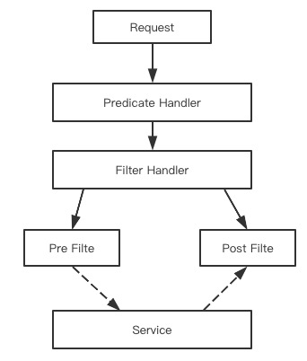

[TOC]

## 目录

- [1. 服务网关在微服务中的应用](#1-服务网关在微服务中的应用)
- [2. 第二代网关Gateway](#2-第二代网关gateway)
- [3. Gateway快速落地实施](#3-gateway快速落地实施)
- [4. 路由功能详解](#4-路由功能详解)
- [5. 断言功能详解](#5-断言功能详解)
- [6. 实现断言的配置](#6-实现断言的配置)
- [7. 通过After断言实现定时秒杀](#7-通过after断言实现定时秒杀)
- [8. 过滤器原理和生命周期](#8-过滤器原理和生命周期)
- [9. 自定义过滤器实现接口计时功能](#9-自定义过滤器实现接口计时功能)
- [10. 权限认证方案分析](#10-权限认证方案分析)
- [11. 实现服务网关层JWT鉴权](#11-实现服务网关层jwt鉴权)
- [12. 实现服务网关层统一异常返回](#12-实现服务网关层统一异常返回)
- [13. 实现服务网关限流](#13-实现服务网关限流)


# SpringCloud服务网关

# 1. 服务网关在微服务中的应用

## 1.1. 对外服务的难题

微服务的应用系统体系很庞大，光是需要独立部署的基础组件就有注册中心、配置中心、服务总线、Turbine和监控大盘dashboard、调用链追踪和链路聚合，还有kafka和MQ之类的中间件，再加上拆分后的零散微服务，一个系统轻松就有20多个左右部署包

都微服务了，所有的业务对外都是实现单一原则，这就导致服务节点和服务数增多，一个整体的链路需要整合很多服务进行组合使用

还有一个问题就是安全性，如果让所有服务都引入安全验证，把所有的接口都加上安全验证，要更换成OAuth2.0，这个时候让所有的服务提供者都变更？

## 1.2. 微服务的传达室

我们就给微服务引入一层专事专办的中间层-传达室

1、访问控制：看你是否有权进入，拒绝无权来访者

2、引导指路：问你做什么，给你指路，就是路由

网关层作为唯一的对外服务，外部请求不直接访问服务层，由网关层承接所有HTTP请求，我们会将gateway和nginx一同使用

### 1.2.1. 访问控制

- 拦截请求：识别header中的授权令牌信息，如果没有登录信息就返回403
- 鉴权：对令牌进行验证，如果令牌失败或过期就拒绝服务

### 1.2.2. 路由规则

- URL映射：大多数情况下我们给到服务调用方的地址是一个虚拟路由地址，对应的真实地址是由路由规则进行映射
- 服务寻址：URL映射好了之后，如果服务端有多个节点，对于服务集群应该服务访问，需要实现负载均衡策略了（SpringCloud中gateway借助Eureka的服务发现通过Ribbon实现负载均衡）

# 2. 第二代网关Gateway

**Gateway的标签**

- Gateway是Spring官方主推的组件
- 底层是基于Netty构建，一个字概括就是快
- 由spring开源社区直接贡献开源力量的

**Gateway可以做什么**

- 路由寻址
- 负载均衡
- 限流
- 鉴权

Gateway VS zuul（第一代网关是Netflix出品）

|                 | Gateway          | zuul 1.x           | zuul 2.x                         |
| --------------- | ---------------- | ------------------ | -------------------------------- |
| 靠谱性          | 官方背书指出     | 开创者，曾经靠谱   | 一直跳票，千呼万唤始出来         |
| 性能            | Netty            | 同步阻塞，性能慢   | Netty                            |
| QPS             | 超30000          | 20000左右          | 20000-30000                      |
| SpringCloud     | 已整合           | 已整合             | 暂无整合到组件库计划，但可以引用 |
| 长连接keepalive | 支持             | 不支持             | 支持                             |
| 编程体验        | 略复杂           | 同步模型，比较简单 | 略复杂                           |
| 调试&链路追踪   | 异步模型，略复杂 | 同步方式，比较容易 | 异步模型，略复杂                 |

新的项目果断选择Gateway

# 3. Gateway快速落地实施

- 创建gateway项目，引入依赖
- 连接Eureka基于服务发现自动创建路由规则
- 通过Actuator实现动态路由

导入POM依赖

```xml
<?xml version="1.0" encoding="UTF-8"?>
<project xmlns="http://maven.apache.org/POM/4.0.0"
         xmlns:xsi="http://www.w3.org/2001/XMLSchema-instance"
         xsi:schemaLocation="http://maven.apache.org/POM/4.0.0 http://maven.apache.org/xsd/maven-4.0.0.xsd">
    <parent>
        <artifactId>spring-cloud-learn</artifactId>
        <groupId>com.icodingedu.springcloud</groupId>
        <version>1.0-SNAPSHOT</version>
        <relativePath>../../pom.xml</relativePath>
    </parent>
    <modelVersion>4.0.0</modelVersion>
    <packaging>jar</packaging>
    <artifactId>gateway-server</artifactId>
    <name>gateway-server</name>

    <dependencies>
        <dependency>
            <groupId>org.springframework.boot</groupId>
            <artifactId>spring-boot-starter-actuator</artifactId>
        </dependency>
        <dependency>
            <groupId>org.springframework.cloud</groupId>
            <artifactId>spring-cloud-starter-netflix-eureka-client</artifactId>
        </dependency>
        <dependency>
            <groupId>org.springframework.cloud</groupId>
            <artifactId>spring-cloud-starter-gateway</artifactId>
        </dependency>
        <!--redis limiter flow-->
        <dependency>
            <groupId>org.springframework.boot</groupId>
            <artifactId>spring-boot-starter-data-redis-reactive</artifactId>
        </dependency>
    </dependencies>
</project>
```

application启动类

```java
package com.icodingedu.springcloud;

import org.springframework.boot.SpringApplication;
import org.springframework.boot.autoconfigure.SpringBootApplication;
import org.springframework.cloud.client.discovery.EnableDiscoveryClient;

@SpringBootApplication
@EnableDiscoveryClient
public class GatewayServerApplication {

    public static void main(String[] args) {
        SpringApplication.run(GatewayServerApplication.class,args);
    }
}
```

application.yaml配置

```yaml
spring:
  application:
    name: gateway-server
  cloud:
    gateway:
      discovery:
        locator:
          enabled: true
server:
  port: 65000
eureka:
  client:
    serviceUrl:
      defaultZone: http://localhost:20001/eureka/
management:
  security:
    enabled: false
  endpoints:
    web:
      exposure:
        include: "*"
  endpoint:
    health:
      show-details: always
```

启动服务：eureka-server、feign-client-advanced（启动三个）、gateway-server

启动后访问：http://localhost:65000/actuator/gateway/routes

可以得到动态加载的eureka路由规则

通过自动路由规则负载均衡实现：http://localhost:65000/FEIGN-CLIENT/sayhello

访问服务的路径希望是小写的

```yaml
spring:
  application:
    name: gateway-server
  cloud:
    gateway:
      discovery:
        locator:
          enabled: true
          lower-case-service-id: true # 增加这个
```

gateway动态路由规则配置

```json
# POST
# http://localhost:65000/actuator/gateway/routes/myrouter
{
    "predicates": [
        {
            "name": "Path",
            "args": {
                "_genkey_0": "/myrouter-path/**"
            }
        }
    ],
    "filters": [
        {
            "name": "StripPrefix",
            "args": {
                "_genkey_0": "1"
            }
        }
    ],
    "uri": "lb://FEIGN-CLIENT",
    "order": 0
}
# DELETE删除路由规则
# http://localhost:65000/actuator/gateway/routes/myrouter
```

先删除路由表，再删除服务

# 4. 路由功能详解

## 4.1. 路由的组成结构

Gateway中可以有多个Route，一个Route就是一套包含完整转发规则的路由，主要由三部分组成

- **断言集合** 断言是路由处理的第一个环节，它是路由的匹配规则，它决定了一个网络请求是否可以匹配给当前路由来处理。之所以它是一个集合的原因是我们可以给一个路由添加多个断言，当每个断言都匹配成功以后才算过了路由的第一关。有关断言的详细内容将在下一小节进行介绍
- **过滤器集合** 如果请求通过了前面的断言匹配，那就表示它被当前路由正式接手了，接下来这个请求就要经过一系列的过滤器集合。过滤器的功能就是八仙过海各显神通了，可以对当前请求做一系列的操作，比如说权限验证，或者将其他非业务性校验的规则提到网关过滤器这一层。在过滤器这一层依然可以通过修改Response里的Status Code达到中断效果，比如对鉴权失败的访问请求设置Status Code为403之后中断操作。有关过滤器的详细内容将在后面的小节介绍
- **URI** 如果请求顺利通过过滤器的处理，接下来就到了最后一步，那就是转发请求。URI是统一资源标识符，它可以是一个具体的网址，也可以是IP+端口的组合，或者是Eureka中注册的服务名称

## 4.2. 负载均衡

对最后一步寻址来说，如果采用基于Eureka的服务发现机制，那么在Gateway的转发过程中可以采用服务注册名的方式来调用，后台会借助Ribbon实现负载均衡（可以为某个服务指定具体的负载均衡策略），其配置方式如：`lb://FEIGN-SERVICE-PROVIDER/`，前面的lb就是指代Ribbon作为LoadBalancer。

## 4.3. 工作流程



- **Predicate Handler** （断言）具体承接类是RoutePredicateHandlerMapping。首先它获取所有的路由（配置的routes全集），然后依次循环每个Route，把应用请求与Route中配置的所有断言进行匹配，如果当前Route所有断言都验证通过，Predict Handler就选定当前的路由。这个模式是典型的职责链。
- **Filter Handler** 在前一步选中路由后，由FilteringWebHandler将请求交给过滤器，在具体处理过程中，不仅当前Route中定义的过滤器会生效，我们在项目中添加的全局过滤器（Global Filter）也会一同参与。同学们看到图中有Pre Filter和Post Filter，这是指过滤器的作用阶段，我们在稍后的章节中再深入了解
- **寻址** 这一步将把请求转发到URI指定的地址，在发送请求之前，所有Pre类型过滤器都将被执行，而Post过滤器会在调用请求返回之后起作用。有关过滤器的详细内容将会在稍后的章节里讲到。

# 5. 断言功能详解

Predicate接受一个判断条件，返回true或false的布尔值，告知调用方判断结果，也可以通过and、or、negative（非）三个操作符来将多个Predicate，对所有来的Request进行条件判断

只要网关接收到请求立即触发断言，满足所有的断言后才进入Filter阶段

Gateway给我们提供了十几种内置断言，常用的就下面几种

## 5.1. Path匹配

```java
.router(r -> r.path("/gateway/**"))
  						.uri("lb://FEIGN-CLIENT")
)
.router(r -> r.path("/baidu"))
  						.uri("https://www.baidu.com")
)  
```

## 5.2. Method断言

```java
.router(r -> r.path("/gateway/**"))
  						.and().method(HttpMethod.GET)
  						.uri("lb://FEIGN-CLIENT")
)
```

## 5.3. RequestParam断言

```java
.router(r -> r.path("/gateway/**"))
  						.and().method(HttpMethod.GET)
  						.and().query("name","icodingedu")
  						.and().query("age")
  						.uri("lb://FEIGN-CLIENT")
)
//这里的age仅需要有age这个参数即可，至于值是什么不关心，但name的值必须是icodingedu
```

## 5.4. Header断言

```java
.router(r -> r.path("/gateway/**"))
  						.and().header("Authorization")
  						.uri("lb://FEIGN-CLIENT")
)
//header中必须包含一个Authorization属性，也可以传入两个参数，锁定值
```

## 5.5. Cookie断言

```java
.router(r -> r.path("/gateway/**"))
  						.and().cookie("name","icodingedu")
  						.uri("lb://FEIGN-CLIENT")
)
//cookie是几个参数断言中唯一一个必须指定值的断言
```

## 5.6. 时间片匹配

时间片匹配有三种模式：Before、After、Between，这个指定了在什么时间范围内容路由才生效

```java
.router(r -> r.path("/gateway/**"))
  						.and().after("具体时间")
  						.uri("lb://FEIGN-CLIENT")
)
```

# 6. 实现断言的配置

断言配置可以在yaml和java代码里都能够实现

**在yaml里配置一个，rotues这部分**

```yaml
spring:
  application:
    name: gateway-server
  cloud:
    gateway:
      discovery:
        locator:
          enabled: true
          lower-case-service-id: true
      routes:
      - id: feignclient
        uri: lb://FEIGN-CLIENT
        predicates:
        - Path=/gavinyaml/**
        filters:
        - StripPrefix=1
```

配置完成后：http://localhost:65000/actuator/gateway/routes

**在Java程序里进行配置**

创建一个config包，建立一个配置类

```java
package com.icodingedu.springcloud.config;

import org.springframework.cloud.gateway.route.RouteLocator;
import org.springframework.cloud.gateway.route.builder.RouteLocatorBuilder;
import org.springframework.context.annotation.Bean;
import org.springframework.context.annotation.Configuration;
import org.springframework.core.annotation.Order;
import org.springframework.http.HttpMethod;

@Configuration
public class GatewayConfiguration {

    @Bean
    @Order
    public RouteLocator customerRoutes(RouteLocatorBuilder builder){
        return builder.routes()
                .route(r -> r.path("/gavinjava/**")
                        .and().method(HttpMethod.GET)
                        .and().header("name")
                        .filters(f -> f.stripPrefix(1)
                            .addResponseHeader("java-param","gateway-config")
                        )
                        .uri("lb://FEIGN-CLIENT")
                ).build();
    }
}
```

# 7. 通过After断言实现定时秒杀

geteway调用的是feign-client的业务，我们就到feign-client-advanced里创建一个controller实现

这里面要使用到的product需要提前在feign-client-intf中定义好

```java
package com.icodingedu.springcloud.pojo;
import lombok.Builder;
import lombok.Data;

@Data
@Builder
public class Product {
    private Long productId;
    private String description;
    private Long stock;
}
```

feign-client-advanced中创建GatewayController

```java
package com.icodingedu.springcloud.controller;

import com.icodingedu.springcloud.pojo.Product;
import lombok.extern.slf4j.Slf4j;
import org.springframework.web.bind.annotation.GetMapping;
import org.springframework.web.bind.annotation.RequestMapping;
import org.springframework.web.bind.annotation.RestController;

import java.util.Map;
import java.util.concurrent.ConcurrentHashMap;

@RestController
@Slf4j
@RequestMapping("gateway")
public class GatewayController {
    //我们就构建一个简易的数据存储,Product需要在feign-client-intf中定义
    public static final Map<Long, Product> items = new ConcurrentHashMap<>();

    @GetMapping("detail")
    public Product getProduct(Long pid){
        //如果第一次没有先创建一个
        if(!items.containsKey(pid)){
            Product product = Product.builder().productId(pid)
                                .description("very well!")
                                .stock(100L).build();
            //没有才插入数据
            items.putIfAbsent(pid,product);
        }
        return items.get(pid);
    }

    @GetMapping("placeOrder")
    public String buy(Long pid){
        Product product = items.get(pid);
        if(product==null){
            return "Product Not Found";
        }else if(product.getStock()<=0L){
            return "Sold Out";
        }
        synchronized (product){
            if(product.getStock()<=0L){
                return "Sold Out";
            }
            product.setStock(product.getStock()-1);
        }
        return "Order Placed";
    }
}
```

回到Gateway-sever项目，按照时间顺延方式定义

```java
package com.icodingedu.springcloud.config;

import org.springframework.cloud.gateway.route.RouteLocator;
import org.springframework.cloud.gateway.route.builder.RouteLocatorBuilder;
import org.springframework.context.annotation.Bean;
import org.springframework.context.annotation.Configuration;
import org.springframework.core.annotation.Order;
import org.springframework.http.HttpMethod;

import java.time.ZonedDateTime;

@Configuration
public class GatewayConfiguration {

    @Bean
    @Order
    public RouteLocator cutomerRoutes(RouteLocatorBuilder builder){
        return builder.routes()
                .route(r -> r.path("/gavinjava/**")
                    .and().method(HttpMethod.GET)
                    .and().header("name")
                    .filters(f -> f.stripPrefix(1)
                        .addResponseHeader("java-param","gateway-config")
                    )
                    .uri("lb://FEIGN-CLIENT")
                )
                .route(r -> r.path("/secondkill/**")
                    .and().after(ZonedDateTime.now().plusSeconds(20))
                    .filters(f -> f.stripPrefix(1))
                    .uri("lb://FEIGN-CLIENT")
                )
                .build();
    }
}
```

也可以定义精确的时间节点值

```java
    @Bean
    @Order
    public RouteLocator cutomerRoutes(RouteLocatorBuilder builder){
        LocalDateTime ldt = LocalDateTime.of(2020, 4, 11, 16, 11, 10);
        return builder.routes()
                .route(r -> r.path("/gavinjava/**")
                    .and().method(HttpMethod.GET)
                    .and().header("name")
                    .filters(f -> f.stripPrefix(1)
                        .addResponseHeader("java-param","gateway-config")
                    )
                    .uri("lb://FEIGN-CLIENT")
                )
                .route(r -> r.path("/secondkill/**")
                    .and().after(ZonedDateTime.of(ldt,ZoneId.of("Asia/Shanghai")))
                    .filters(f -> f.stripPrefix(1))
                    .uri("lb://FEIGN-CLIENT")
                )
                .build();
    }
```

# 8. 过滤器原理和生命周期

**过滤器的实现方式**

只需要实现两个接口：GatewayFilter、Ordered

**过滤器类型**

**Header过滤器**：可以增加和减少header里的值

**StripPrefix过滤器**：

```java
.router(r -> r.path("/gateway/**"))
  						.filters(f -> f.stripPrefix(1))
  						.uri("lb://FEIGN-CLIENT")
)
```

假如请求的路径：/gateway/sample/update，如果没有stripPrefix过滤器，http://FEIGN-CLIENT/gateway/sample/update，他的作用就是将第一个路由路径截取掉

**PrefixPath过滤器**：它和StripPrefix作用相反

```java
.router(r -> r.path("/gateway/**"))
  						.filters(f -> f.prefixPath("go"))
  						.uri("lb://FEIGN-CLIENT")
)
```

/gateway/sample/update 变成 /go/gateway/sample/update

**RedirectTo过滤器：**

```java
.filters(f -> f.redirect(303,"https://www.icodingedu.com"))
// 遇到错误是30x的直接过滤跳转
```

# 9. 自定义过滤器实现接口计时功能

 去到gateway-server项目中进行修改，创建一个filter的package

```java
package com.icodingedu.springcloud.filter;

import lombok.extern.slf4j.Slf4j;
import org.springframework.cloud.gateway.filter.GatewayFilter;
import org.springframework.cloud.gateway.filter.GatewayFilterChain;
import org.springframework.core.Ordered;
import org.springframework.stereotype.Component;
import org.springframework.util.StopWatch;
import org.springframework.web.server.ServerWebExchange;
import reactor.core.publisher.Mono;

//Ordered是指定执行顺序的接口
@Slf4j
@Component
public class TimerFilter implements GatewayFilter, Ordered {
    @Override
    public Mono<Void> filter(ServerWebExchange exchange, GatewayFilterChain chain) {
        //给接口计时并能打出很漂亮的log
        StopWatch timer = new StopWatch();
        timer.start(exchange.getRequest().getURI().getRawPath());//开始计时
        //我们还可以对调用链进行加工,手工放入请求参数
        exchange.getAttributes().put("requestTimeBegin",System.currentTimeMillis());
        return chain.filter(exchange).then(
            //这里就是执行完过滤进行调用的地方
           Mono.fromRunnable(() -> {
               timer.stop();
               log.info(timer.prettyPrint());
           })
        );
    }

    @Override
    public int getOrder() {
        return 0;
    }
}
```

拿上TimerFilter去到GatewayConfiguration里设置自定义filter

```java
package com.icodingedu.springcloud.config;

import com.icodingedu.springcloud.filter.TimerFilter;
import org.springframework.beans.factory.annotation.Autowired;
import org.springframework.cloud.gateway.route.RouteLocator;
import org.springframework.cloud.gateway.route.builder.RouteLocatorBuilder;
import org.springframework.context.annotation.Bean;
import org.springframework.context.annotation.Configuration;
import org.springframework.core.annotation.Order;
import org.springframework.http.HttpMethod;

import java.time.LocalDateTime;
import java.time.ZoneId;
import java.time.ZonedDateTime;

@Configuration
public class GatewayConfiguration {

//    @Autowired
//    private TimerFilter timerFilter;

    @Bean
    @Order
    public RouteLocator customerRoutes(RouteLocatorBuilder builder){
        LocalDateTime ldt1 = LocalDateTime.of(2020,4,12,22,6,30);
        LocalDateTime ldt2 = LocalDateTime.of(2020,4,12,23,6,35);
        return builder.routes()
                .route(r -> r.path("/gavinjava/**")
                        .and().method(HttpMethod.GET)
                        .and().header("name")
                        .filters(f -> f.stripPrefix(1)
                            .addResponseHeader("java-param","gateway-config")
//                            .filter(timerFilter)
                        )
                        .uri("lb://FEIGN-CLIENT")
                )
                .route(r -> r.path("/secondkill/**")
                        //.and().after(ZonedDateTime.of(ldt, ZoneId.of("Asia/Shanghai")))
                        .and().between(ZonedDateTime.of(ldt1, ZoneId.of("Asia/Shanghai")),ZonedDateTime.of(ldt2, ZoneId.of("Asia/Shanghai")))
                        .filters(f -> f.stripPrefix(1))
                        .uri("lb://FEIGN-CLIENT")
                )
                .build();
    }
}
```

全局Filter就是把filter的继承从GatewayFilter换成GlobalFilter

# 10. 权限认证方案分析

## 10.1. 传统单应用的用户鉴权

从我们开始学JavaEE的时候，就被洗脑式灌输了一种权限验证的标准做法，那就是将用户的登录状态保存到HttpSession中，比如在登录成功后保存一对key-value值到session，key是userId而value是用户后台的真实ID。接着创建一个ServletFilter过滤器，用来拦截需要登录才能访问的资源，假如这个请求对应的服务端session里找不到userId这个key，那么就代表用户尚未登录，这时候可以直接拒绝服务然后重定向到用户登录页面。

大家应该都对session机制比较熟悉，它和cookie是相互依赖的，cookie是存放在用户浏览器中的信息，而session则是存放在服务器端的。当浏览器发起服务请求的时候就会带上cookie，服务器端接到Request后根据cookie中的jsessionid拿到对应的session。

由于我们只启动一台服务器，所以在登录后保存的session始终都在这台服务器中，可以很方便的获取到session中的所有信息。用这野路子，我们一路搞定了各种课程作业和毕业设计。结果一到工作岗位发现行不通了，因为所有应用都是集群部署，在一台机器保存了的session无法同步到其他机器上。那我们有什么成熟的解决方案吗？

## 10.2. 分布式环境下的解决方案

### 10.2.1. 同步Session

- Session复制是最容易先想到的解决方案，我们可以把一台机器中的session复制到集群中的其他机器。比如Tomcat中也有内置的session同步方案，但是这并不是一个很优雅的解决方案，它会带来以下两个问题：

  - **Timing问题** 同步需要花费一定的时间，我们无法保证session同步的及时性，也就是说，当用户发起的两个请求分别落在不同机器上的时候，前一个请求写入session的信息可能还没同步到所有机器，后一个请求就已经开始执行业务逻辑了，这不免引起脏读幻读。
  - **数据冗余** 所有服务器都需要保存一份session全集，这就产生了大量的冗余数据

### 10.2.2. 反向代理：绑定IP或一致性Hash

这个方案可以放在Nignx网关层做的，我们可以指定某些IP段的请求落在某个指定机器上，这样一来session始终只存在一台机器上。不过相比前一种session复制的方法来说，绑定IP的方式有更明显的缺陷：

- **负载均衡** 在绑定IP的情况下无法在网关层应用负载均衡策略，而且某个服务器出现故障的话会对指定IP段的来访用户产生较大影响。对网关层来说该方案的路由规则配置也极其麻烦。
- **IP变更** 很多网络运营商会时不时切换用户IP，这就会导致更换IP后的请求被路由到不同的服务节点处理，这样一来就读不到前面设置的session信息了

为了解决第二个问题，可以通过一致性Hash的路由方案来做路由，比如根据用户ID做Hash，不同的Hash值落在不同的机器上，保证足够均匀的分配，这样也就避免了IP切换的问题，但依然无法解决第一点里提到的负载均衡问题

### 10.2.3. Redis解决方案

这个方案解决了前面提到的大部分问题，session不再保存在服务器上，取而代之的是保存在redis中，所有的服务器都向redis写入/读取缓存信息。

在Tomcat层面，我们可以直接引入tomcat-redis-session-manager组件，将容器层面的session组件替换为基于redis的组件，但是这种方案和容器绑定的比较紧密。另一个更优雅的方案是借助spring-session管理redis中的session，尽管这个方案脱离了具体容器，但依然是基于Session的用户鉴权方案，这类Session方案已经在微服务应用中被淘汰了。

## 10.3. 分布式Session的解决方案

### 10.3.1. OAuth 2.0

OAuth 2.0是一个开放授权标准协议，它允许用户让第三方应用访问该用户在某服务的特定私有资源，但是不提供账号密码信息给第三方应用

拿微信登录第三方应用的例子来说：

- **Auth Grant** 在这一步Client发起Authorization Request到微信系统（比如通过微信内扫码授权），当身份验证成功后获取Auth Grant
- **Get Token** 客户端拿着从微信获取到的Auth Grant，发给第三方引用的鉴权服务，换取一个Token，这个Token就是访问第三方应用资源所需要的令牌
- **访问资源** 最后一步，客户端在请求资源的时候带上Token令牌，服务端验证令牌真实有效后即返回指定资源

我们可以借助Spring Cloud中内置的`spring-cloud-starter-oauth2`组件搭建OAuth 2.0的鉴权服务，OAuth 2.0的协议还涉及到很多复杂的规范，比如角色、客户端类型、授权模式等。

### 10.3.2. JWT鉴权

JWT也是一种基于Token的鉴权机制，它的基本思想就是通过用户名+密码换取一个Access Token

**鉴权流程**

相比OAuth 2.0来说，它的鉴权过程更加简单，其基本流程是这样的：

1. 用户名+密码访问鉴权服务
   - 验证通过：服务器返回一个Access Token给客户端，并将token保存在服务端某个地方用于后面的访问控制（可以保存在数据库或者Redis中）
   - 验证失败：不生成Token
2. 客户端使用令牌访问资源，服务器验证令牌有效性
   - 令牌错误或过期：拦截请求，让客户端重新申请令牌
   - 令牌正确：允许放行

**Access Token中的内容**

JWT的Access Token由三个部分构成，分别是Header、Payload和Signature，我们分别看下这三个部分都包含了哪些信息：

- **Header** 头部声明了Token的类型（JWT类型）和采用的加密算法（HS256）

```json
{
  'typ': 'JWT',
  'alg': 'HS256'
}
```

- **Payload** 这一段包含的信息相当丰富，你可以定义Token签发者、签发和过期时间、生效时间等一系列属性，还可以添加自定义属性。服务端收到Token的时候也同样可以对Payload中包含的信息做验证，比如说某个Token的签发者是“Feign-API”，假如某个接口只能允许“Gateway-API”签发的Token，那么在做鉴权服务时就可以加入Issuer的判断逻辑。
- **Signature** 它会使用Header和Payload以及一个密钥用来生成签证信息，这一步会使用Header里我们指定的加密算法进行加密

目前实现JWT的开源组件非常多，如果决定使用这个方案，只要添加任意一个开源JWT实现的依赖项到项目的pom文件中，然后在加解密时调用该组件来完成

**目前来说应用比较广泛的三种方案就是JWT、OAuth和spring-session+redis**


# 11. 实现服务网关层JWT鉴权

通过以下几步完成鉴权操作

- 创建auth-service（登录，鉴权等服务）
- 添加JwtService类实现token创建和验证
- 网关层集成auth-service（添加AuthFilter到网关层，如果没有登录则返回403）

在gateway里创建一个auth-service-api

添加POM依赖

```xml
<?xml version="1.0" encoding="UTF-8"?>
<project xmlns="http://maven.apache.org/POM/4.0.0"
         xmlns:xsi="http://www.w3.org/2001/XMLSchema-instance"
         xsi:schemaLocation="http://maven.apache.org/POM/4.0.0 http://maven.apache.org/xsd/maven-4.0.0.xsd">
    <parent>
        <artifactId>spring-cloud-project</artifactId>
        <groupId>com.icodingedu</groupId>
        <version>1.0-SNAPSHOT</version>
        <relativePath>../../pom.xml</relativePath>
    </parent>
    <modelVersion>4.0.0</modelVersion>
    <packaging>jar</packaging>
    <artifactId>auth-service-api</artifactId>
    <name>auth-service-api</name>

    <dependencies>
        <dependency>
            <groupId>org.springframework.boot</groupId>
            <artifactId>spring-boot-starter-web</artifactId>
        </dependency>
        <dependency>
            <groupId>org.springframework.cloud</groupId>
            <artifactId>spring-cloud-starter-openfeign</artifactId>
        </dependency>
    </dependencies>
</project>
```

创建一个entity包，创建一个账户实体对象

```java
package com.icodingedu.springcloud.entity;

import com.sun.tracing.dtrace.ArgsAttributes;
import lombok.AllArgsConstructor;
import lombok.Builder;
import lombok.Data;
import lombok.NoArgsConstructor;

@Data
@Builder
@NoArgsConstructor
@AllArgsConstructor
public class Account implements Serializable {

    private String username;

    private String token;

    //当token接近失效的时候可以用refreshToken生成一个新的token
    private String refreshToken;
}
```

在entity包下，创建一个AuthResponse类

```java
package com.icodingedu.springcloud.entity;

public class AuthResponse {

    public static final Long SUCCESS = 1L;

    public static final Long INCORRECT_PWD = 1000L;

    public static final Long USER_NOT_FOUND = 1001L;
  
  	public static final Long INVALID_TOKEN = 1002L;
}
```

在entity包下创建一个AuthResponse处理结果类

```java
package com.icodingedu.springcloud.tools;

import com.icodingedu.springcloud.pojo.Account;
import lombok.AllArgsConstructor;
import lombok.Builder;
import lombok.Data;
import lombok.NoArgsConstructor;

@Data
@Builder
@NoArgsConstructor
@AllArgsConstructor
public class AuthResponse {

    private Account account;

    private Long code;
}
```

创建一个service包在里面创建接口AuthService

```java
package com.icodingedu.springcloud.service;

import com.icodingedu.springcloud.entity.AuthResponse;
import org.springframework.cloud.openfeign.FeignClient;
import org.springframework.web.bind.annotation.GetMapping;
import org.springframework.web.bind.annotation.PostMapping;
import org.springframework.web.bind.annotation.RequestParam;
import org.springframework.web.bind.annotation.ResponseBody;

@FeignClient("auth-service")
public interface AuthService {

    @PostMapping("/login")
    @ResponseBody
    public AuthResponse login(@RequestParam("username") String username,
                              @RequestParam("password") String password);

    @GetMapping("/verify")
    @ResponseBody
    public AuthResponse verify(@RequestParam("token") String token,
                               @RequestParam("username") String username);

    @PostMapping("/refresh")
    @ResponseBody
    public AuthResponse refresh(@RequestParam("refresh") String refreshToken);
}
```

创建服务实现的auth-service的module，还是放在gateway目录下

导入POM依赖

```xml
<?xml version="1.0" encoding="UTF-8"?>
<project xmlns="http://maven.apache.org/POM/4.0.0"
         xmlns:xsi="http://www.w3.org/2001/XMLSchema-instance"
         xsi:schemaLocation="http://maven.apache.org/POM/4.0.0 http://maven.apache.org/xsd/maven-4.0.0.xsd">
    <parent>
        <artifactId>spring-cloud-project</artifactId>
        <groupId>com.icodingedu</groupId>
        <version>1.0-SNAPSHOT</version>
        <relativePath>../../pom.xml</relativePath>
    </parent>
    <modelVersion>4.0.0</modelVersion>
    <packaging>jar</packaging>
    <artifactId>auth-service</artifactId>
    <name>auth-service</name>

    <dependencies>
        <dependency>
            <groupId>org.springframework.boot</groupId>
            <artifactId>spring-boot-starter-web</artifactId>
        </dependency>
        <!--redis用来存放生成的token和refresh token的,本地token要启动-->
        <dependency>
            <groupId>org.springframework.boot</groupId>
            <artifactId>spring-boot-starter-data-redis</artifactId>
        </dependency>
        <!--jwt-->
        <dependency>
            <groupId>com.auth0</groupId>
            <artifactId>java-jwt</artifactId>
            <version>3.7.0</version>
        </dependency>
        <dependency>
            <groupId>com.icodingedu</groupId>
            <artifactId>auth-service-api</artifactId>
            <version>${project.version}</version>
        </dependency>
        <dependency>
            <groupId>org.springframework.cloud</groupId>
            <artifactId>spring-cloud-starter-netflix-eureka-client</artifactId>
        </dependency>
        <dependency>
            <groupId>org.springframework.boot</groupId>
            <artifactId>spring-boot-starter-actuator</artifactId>
        </dependency>
    </dependencies>
</project>
```

创建启动类application

```java
package com.icodingedu.springcloud;

import org.springframework.boot.WebApplicationType;
import org.springframework.boot.autoconfigure.SpringBootApplication;
import org.springframework.boot.builder.SpringApplicationBuilder;
import org.springframework.cloud.client.discovery.EnableDiscoveryClient;

@EnableDiscoveryClient
@SpringBootApplication
public class AuthServiceApplication {

    public static void main(String[] args) {
        new SpringApplicationBuilder(AuthServiceApplication.class)
                .web(WebApplicationType.SERVLET)
                .run(args);
    }
}
```

创建一个service包，建立JwtService类

```java
package com.icodingedu.springcloud.service;

import com.auth0.jwt.JWT;
import com.auth0.jwt.algorithms.Algorithm;
import com.auth0.jwt.interfaces.JWTVerifier;
import com.icodingedu.springcloud.entity.Account;
import lombok.extern.slf4j.Slf4j;
import org.springframework.stereotype.Service;

import java.util.Date;

@Slf4j
@Service
public class JwtService {
    //生产环境中应该从外部加密后传入
    private static final String KEY = "you must change it";
    //生产环境中应该从外部加密后传入
    private static final String ISSUER = "icodingedu";
    //定义个过期时间
    private static final long TOKEN_EXP_TIME = 60000;
    //定义传入的参数名
    private static final String USERNAME = "username";

    /**
     * 生成token
     * @param account 账户信息
     * @return token
     */
    public String token(Account account){
        //生成token的时间
        Date now = new Date();
        //生成token所要用到的算法
        Algorithm algorithm = Algorithm.HMAC256(KEY);

        String token = JWT.create()
                .withIssuer(ISSUER) //发行方,解密的时候依然要验证,即便拿到了key不知道发行方也无法解密
                .withIssuedAt(now) //这个key是在什么时间点生成的
                .withExpiresAt(new Date(now.getTime() + TOKEN_EXP_TIME)) //过期时间
                .withClaim(USERNAME,account.getUsername()) //传入username
                //.withClaim(ROLE,"roleName") 还可以传入其他内容
                .sign(algorithm); //用前面的算法签发
        log.info("jwt generated user={}",account.getUsername());
        return token;
    }

    /**
     * 验证token
     * @param token
     * @param username
     * @return
     */
    public boolean verify(String token,String username){
        log.info("verify jwt - user={}",username);
        try{
            //加密和解密要一样
            Algorithm algorithm = Algorithm.HMAC256(KEY);
            //构建一个验证器:验证JWT的内容,是个接口
            JWTVerifier verifier = JWT.require(algorithm)
                    .withIssuer(ISSUER) //前面加密的内容都可以验证
                    .withClaim(USERNAME,username)
                    .build();
            //这里有任何错误就直接异常了
            verifier.verify(token);
            return true;
        }catch (Exception ex){
            log.error("auth failed",ex);
            return false;
        }
    }
}
```

创建controller包，建立JwtController类

```java
package com.icodingedu.springcloud.controller;

import com.icodingedu.springcloud.entity.Account;
import com.icodingedu.springcloud.entity.AuthResponse;
import com.icodingedu.springcloud.entity.AuthResponseCode;
import com.icodingedu.springcloud.service.AuthService;
import com.icodingedu.springcloud.service.JwtService;
import lombok.extern.slf4j.Slf4j;
import org.springframework.beans.factory.annotation.Autowired;
import org.springframework.data.redis.core.RedisTemplate;
import org.springframework.web.bind.annotation.*;

import java.util.UUID;

@RestController
@Slf4j
public class JwtController implements AuthService{

    @Autowired
    private JwtService jwtService;

    @Autowired
    private RedisTemplate redisTemplate;

    @Override
    public AuthResponse login(String username, String password) {
        Account account = Account.builder()
                .username(username)
                .build();
        //TODO 0-这一步需要验证用户名和密码,一般是在数据库里,假定验证通过了
        //1-生成token
        String token = jwtService.token(account);
        account.setToken(token);
        //这里保存拿到新token的key
        account.setRefreshToken(UUID.randomUUID().toString());

        //3-保存token,把token保存起来在refresh时才知道更新关联哪个token
        redisTemplate.opsForValue().set(account.getRefreshToken(),account);

        //2-返回token
        return AuthResponse.builder()
                .account(account)
                .code(AuthResponseCode.SUCCESS)
                .build();
    }

    @Override
    public AuthResponse verify(String token, String username) {

        boolean flag = jwtService.verify(token, username);

        return AuthResponse.builder()
                .code(flag?AuthResponseCode.SUCCESS:AuthResponseCode.INVALID_TOKEN)
                .build();
    }

    @Override
    public AuthResponse refresh(String refreshToken) {
        //当使用redisTemplate保存对象时,对象必须是一个可被序列化的对象
        Account account = (Account) redisTemplate.opsForValue().get(refreshToken);
        if(account == null){
            return AuthResponse.builder()
                    .code(AuthResponseCode.USER_NOT_FOUND)
                    .build();
        }
        String token = jwtService.token(account);
        account.setToken(token);
        //更新新的refreshToke
        account.setRefreshToken(UUID.randomUUID().toString());
        //将原来的删除
        redisTemplate.delete(refreshToken);
        //添加新的token
        redisTemplate.opsForValue().set(account.getRefreshToken(),account);

        return AuthResponse.builder()
                .account(account)
                .code(AuthResponseCode.SUCCESS)
                .build();
    }
}
```

设置application配置文件

```properties
spring.application.name=auth-service
server.port=65100

eureka.client.serviceUrl.defaultZone=http://localhost:20001/eureka/

spring.redis.host=localhost
spring.redis.database=0
spring.redis.port=6379

info.app.name=auth-service
info.app.description=test

management.security.enabled=false
management.endpoints.web.exposure.include=*
management.endpoint.health.show-details=always
```

可以启动验证一下：先启动eureka-server，再启动auth-server

在PostMan里进行验证：login，verify，refresh都测试一下

**开始改造gateway-sever**

POM里引入依赖，增加下面三个依赖

```xml
        <!--因为spring cloud gateway是基于webflux的,如果需要web则是导入spring-boot-starter-webflux而不是spring-boot-starter-web-->
        <dependency>
            <groupId>com.icodingedu</groupId>
            <artifactId>auth-service-api</artifactId>
            <version>${project.version}</version>
            <exclusions>
                <exclusion>
                    <groupId>org.springframework.boot</groupId>
                    <artifactId>spring-boot-starter-web</artifactId>
                </exclusion>
            </exclusions>
        </dependency>
				<!--工具类,进行一下StringUtil的操作-->
        <dependency>
            <groupId>org.apache.commons</groupId>
            <artifactId>commons-lang3</artifactId>
            <version>3.5</version>
        </dependency>
        <dependency>
            <groupId>com.auth0</groupId>
            <artifactId>java-jwt</artifactId>
            <version>3.7.0</version>
        </dependency>
```

创建一个新的类：AuthFilter

```java
package com.icodingedu.springcloud.filter;

import com.icodingedu.springcloud.entity.AuthResponse;
import com.icodingedu.springcloud.service.AuthService;
import lombok.extern.slf4j.Slf4j;
import org.apache.commons.lang3.StringUtils;
import org.springframework.beans.factory.annotation.Autowired;
import org.springframework.cloud.gateway.filter.GatewayFilter;
import org.springframework.cloud.gateway.filter.GatewayFilterChain;
import org.springframework.core.Ordered;
import org.springframework.http.HttpHeaders;
import org.springframework.http.HttpStatus;
import org.springframework.http.server.reactive.ServerHttpRequest;
import org.springframework.http.server.reactive.ServerHttpResponse;
import org.springframework.stereotype.Component;
import org.springframework.web.client.RestTemplate;
import org.springframework.web.server.ServerWebExchange;
import reactor.core.publisher.Mono;

@Slf4j
@Component
public class AuthFilter implements GatewayFilter, Ordered {

    private static final String AUTH = "Authorization";
    private static final String USERNAME = "icodingedu-username";
    
    @Autowired
    private RestTemplate restTemplate;

    @Override
    public Mono<Void> filter(ServerWebExchange exchange, GatewayFilterChain chain) {
        log.info("Auth Start");
        ServerHttpRequest request = exchange.getRequest();
        HttpHeaders header = request.getHeaders();
        String token = header.getFirst(AUTH);
        String username = header.getFirst(USERNAME);

        ServerHttpResponse response = exchange.getResponse();
        if(StringUtils.isBlank(token)){
            log.error("token not found");
            response.setStatusCode(HttpStatus.UNAUTHORIZED);
            return response.setComplete();
        }

        String path = String.format("http://auth-service/verify?token=%s&username=%s",token,username);
        AuthResponse resp = restTemplate.getForObject(path,AuthResponse.class);


        if(resp.getCode() != 1L){
            log.error("invalid token");
            response.setStatusCode(HttpStatus.FORBIDDEN);
            return response.setComplete();
        }
        //将用户信息再次存放在请求的header中传递给下游
        ServerHttpRequest.Builder mutate = request.mutate();
        mutate.header(USERNAME,username);
        ServerHttpRequest buildRequest = mutate.build();

        //如果响应中需要放数据，可以放在response的header中
        response.setStatusCode(HttpStatus.OK);
        response.getHeaders().add("icoding-user",username);

        return chain.filter(exchange.mutate()
                            .request(buildRequest)
                            .response(response)
                            .build());
    }

    @Override
    public int getOrder() {
        return 0;
    }
}
```

给gateway-server的application启动类加上RestTemplate实现

```java
package com.icodingedu.springcloud;

import org.springframework.boot.SpringApplication;
import org.springframework.boot.autoconfigure.SpringBootApplication;
import org.springframework.cloud.client.discovery.EnableDiscoveryClient;
import org.springframework.cloud.client.loadbalancer.LoadBalanced;
import org.springframework.context.annotation.Bean;
import org.springframework.web.client.RestTemplate;

@SpringBootApplication
@EnableDiscoveryClient
public class GatewayServerApplication {

    @Bean
    @LoadBalanced
    public RestTemplate restTemplate(){
        return new RestTemplate();
    }

    public static void main(String[] args) {
        SpringApplication.run(GatewayServerApplication.class,args);
    }
}
```

AuthFilter注入到configuration中的，只需要注入并加入过滤器即可

# 12. 实现服务网关层统一异常返回

## 12.1. 异常的种类

网关层的异常分为以下两种：

- **调用请求异常** 通常由调用请求直接抛出的异常，比如在订单服务中直接报错

  `throw new RuntimeException("error")`

- **网关层异常** 由网关层触发的异常，比如Gateway通过服务发现找不到可用节点，或者任何网关层内部的问题。这部分异常通常是在实际调用请求发起之前发生的。

在以上两种问题中，网关层只应该关注第二个点，也就是自身异常。在实际应用中我们应该尽量保持网关层的“纯洁性”并且做好职责划分，Gateway只要做好路由的事情，不要牵扯到具体业务层的事儿，最好也不要替调用请求的异常操心。对于业务调用中的异常情况，如果需要采用统一格式封装调用异常，那就交给每个具体服务去定义结构，让各自业务方和前端页面协调好异常消息的结构。

但是在实际项目中，不能保证每个接口都实现了异常封装，如果想给前台页面一个统一风格的JSON格式异常结构，那就需要让Gateway做一些分外的事儿，比如拦截Response并修改返回值。（还是强烈建议让服务端自己定义异常结构，因为Gateway本身不应该对这些异常做额外封装只是原封不动的返回）

Gateway已经将网关层直接抛出的异常（没有调用远程服务之前的异常）做了结构化封装，对于POST的调用来说其本身也会返回结构化的异常信息，但是对于GET接口的异常来说，则是直接返回一个HTML页面，前端根本无法抓取具体的异常信息。所以我们这里主要聚焦在如何处理**调用请求异常**。

## 12.2. 自定义异常封装

装饰器编程模式+代理模式，给Gateway加一层处理，改变ResponseBody中的数据结构

**代理模式 - BodyHackerFunction接口**

在最开始我们先定义一个代理模式的接口

```java
package com.icodingedu.springcloud.tools;

import org.reactivestreams.Publisher;
import org.springframework.core.io.buffer.DataBuffer;
import org.springframework.http.server.reactive.ServerHttpResponse;
import reactor.core.publisher.Mono;

import java.util.function.BiFunction;

public interface BodyHackerFunction extends
        BiFunction<ServerHttpResponse, Publisher<? extends DataBuffer>, Mono<Void>> {
}
```

这里引入代理模式是为了将装饰器和具体业务代理逻辑拆分开来，在装饰器中只需要依赖一个代理接口，而不需要和具体的代理逻辑绑定起来

**装饰器模式 - BodyHackerDecrator**

接下来我们定义一个装饰器类，这个装饰器继承自ServerHttpResponseDecorator类，我们这里就用装饰器模式给Response Body的构造过程加上一层特效

```java
package com.icodingedu.springcloud.tools;

import org.reactivestreams.Publisher;
import org.springframework.core.io.buffer.DataBuffer;
import org.springframework.http.server.reactive.ServerHttpResponse;
import org.springframework.http.server.reactive.ServerHttpResponseDecorator;
import reactor.core.publisher.Mono;

public class BodyHackerHttpResponseDecorator extends ServerHttpResponseDecorator {

    /**
     * 负责具体写入Body内容的代理类
     */
    private BodyHackerFunction delegate = null;

    public BodyHackerHttpResponseDecorator(BodyHackerFunction bodyHandler, ServerHttpResponse delegate) {
        super(delegate);
        this.delegate = bodyHandler;
    }

    @Override
    public Mono<Void> writeWith(Publisher<? extends DataBuffer> body) {
        return delegate.apply(getDelegate(), body);
    }
}
```

这个装饰器的构造方法接收一个BodyHancker代理类，其中的关键方法writeWith就是用来向Response Body中写入内容的。这里我们覆盖了该方法，使用代理类来托管方法的执行，而在整个装饰器类中看不到一点业务逻辑，这就是我们常说的单一职责。

**创建Filter**

```java
package com.icodingedu.springcloud.filter;

import com.icodingedu.springcloud.tools.BodyHackerFunction;
import com.icodingedu.springcloud.tools.BodyHackerHttpResponseDecorator;
import lombok.extern.slf4j.Slf4j;
import org.springframework.cloud.gateway.filter.GatewayFilter;
import org.springframework.cloud.gateway.filter.GatewayFilterChain;
import org.springframework.core.Ordered;
import org.springframework.http.HttpHeaders;
import org.springframework.http.server.reactive.ServerHttpRequest;
import org.springframework.stereotype.Component;
import org.springframework.web.server.ServerWebExchange;
import reactor.core.publisher.Flux;
import reactor.core.publisher.Mono;

@Component
@Slf4j
public class ErrorFilter implements GatewayFilter, Ordered {

    @Override
    public Mono<Void> filter(ServerWebExchange exchange, GatewayFilterChain chain) {
        final ServerHttpRequest request = exchange.getRequest();
        // TODO 这里定义写入Body的逻辑
        BodyHackerFunction delegate = (resp, body) -> Flux.from(body)
                .flatMap(orgBody -> {
                    // 原始的response body
                    byte[] orgContent = new byte[orgBody.readableByteCount()];
                    orgBody.read(orgContent);

                    String content = new String(orgContent);
                    log.info("original content {}", content);

                    // 如果500错误，则替换
                    if (resp.getStatusCode().value() == 500) {
                        content = String.format("{\"status\":%d,\"path\":\"%s\"}",
                                resp.getStatusCode().value(),
                                request.getPath().value());
                    }

                    // 告知客户端Body的长度，如果不设置的话客户端会一直处于等待状态不结束
                    HttpHeaders headers = resp.getHeaders();
                    headers.setContentLength(content.length());
                    return resp.writeWith(Flux.just(content)
                            .map(bx -> resp.bufferFactory().wrap(bx.getBytes())));
                }).then();

        // 将装饰器当做Response返回
        BodyHackerHttpResponseDecorator responseDecorator = new BodyHackerHttpResponseDecorator(delegate, exchange.getResponse());

        return chain.filter(exchange.mutate().response(responseDecorator).build());
    }

    @Override
    public int getOrder() {
        // WRITE_RESPONSE_FILTER的执行顺序是-1，我们的Hacker在它之前执行
        return -2;
    }
}
```

在这个Filter中，我们定义了一个装饰器类BodyHackerHttpResponseDecorator，同时声明了一个匿名内部类(代码TODO部分)，实现了BodyHackerFunction代理类的Body替换逻辑，并且将这个代理类传入了装饰器。这个装饰器将直接参与构造Response Body。

我们还覆盖了getOrder方法，是为了确保我们的filter在默认的Response构造器之前执行

我们对500的HTTP Status做了特殊定制，使用我们自己的JSON内容替换了原始内容，同学们可以根据需要向JSON中加入其它参数。对于其他非500 Status的Response来说，我们还是返回初始的Body。

我们在feign-client-advanced的GatewayController中定一个500的错误方法进行测试

```java
    @GetMapping("/valid")
    public String valid(){
        int i = 1/0;
        return "Page Test Success";
    }
```

ErrorFilter的注入方式同之前的过滤器一样

# 13. 实现服务网关限流

创建一个限流配置类RedisLimiterConfiguration

```java
package com.icodingedu.springcloud.config;

import org.springframework.cloud.gateway.filter.ratelimit.KeyResolver;
import org.springframework.cloud.gateway.filter.ratelimit.RedisRateLimiter;
import org.springframework.context.annotation.Bean;
import org.springframework.context.annotation.Configuration;
import org.springframework.context.annotation.Primary;
import reactor.core.publisher.Mono;

@Configuration
public class RedisLimiterConfiguration {
    // ID: KEY 限流的业务标识
    // 我们这里根据用户请求IP地址进行限流
    @Bean
    @Primary //一个系统不止一个KeyResolver
    public KeyResolver remoteAddressKeyResolver(){
        return exchange -> Mono.just(
            exchange.getRequest()
                    .getRemoteAddress()
                    .getAddress()
                    .getHostAddress()
        );
    }

    @Bean("redisLimiterUser")
    @Primary
    public RedisRateLimiter redisRateLimiterUser(){
        //这里可以自己创建一个限流脚本,也可以使用默认的令牌桶
        //defaultReplenishRate:限流桶速率,每秒10个
        //defaultBurstCapacity:桶的容量
        return new RedisRateLimiter(10,60);
    }

    @Bean("redisLimiterProduct")
    public RedisRateLimiter redisRateLimiterProduct(){
        //这里可以自己创建一个限流脚本,也可以使用默认的令牌桶
        //defaultReplenishRate:限流桶速率,每秒10个
        //defaultBurstCapacity:桶的容量
        return new RedisRateLimiter(20,100);
    }
}
```

配置application.yaml 中的redis信息

```yaml
spring:
  application:
    name: gateway-server
  redis:
    host: localhost
    port: 6379
    database: 0
  main:
    allow-bean-definition-overriding: true
```

在GatewayConfiguration中进行配置加入RedisLimiter的配置

```java
package com.icodingedu.springcloud.config;

import com.icodingedu.springcloud.filter.AuthFilter;
import com.icodingedu.springcloud.filter.ErrorFilter;
import com.icodingedu.springcloud.filter.TimerFilter;
import org.springframework.beans.factory.annotation.Autowired;
import org.springframework.beans.factory.annotation.Qualifier;
import org.springframework.cloud.gateway.filter.ratelimit.KeyResolver;
import org.springframework.cloud.gateway.filter.ratelimit.RateLimiter;
import org.springframework.cloud.gateway.route.RouteLocator;
import org.springframework.cloud.gateway.route.builder.RouteLocatorBuilder;
import org.springframework.context.annotation.Bean;
import org.springframework.context.annotation.Configuration;
import org.springframework.core.annotation.Order;
import org.springframework.http.HttpMethod;

import java.time.LocalDateTime;
import java.time.ZoneId;
import java.time.ZonedDateTime;

@Configuration
public class GatewayConfiguration {

//    @Autowired
//    private TimerFilter timerFilter;

    @Autowired
    private AuthFilter authFilter;

    @Autowired
    private ErrorFilter errorFilter;

    @Autowired
    private KeyResolver hostNameResolver;

    @Autowired
    @Qualifier("redisLimiterUser")
    private RateLimiter rateLimiterUser;

    @Bean
    @Order
    public RouteLocator customerRoutes(RouteLocatorBuilder builder){
        LocalDateTime ldt1 = LocalDateTime.of(2020,4,12,22,6,30);
        LocalDateTime ldt2 = LocalDateTime.of(2020,4,12,23,6,35);
        return builder.routes()
                .route(r -> r.path("/gavinjava/**")
                        .and().method(HttpMethod.GET)
//                        .and().header("name")
                        .filters(f -> f.stripPrefix(1)
                            .addResponseHeader("java-param","gateway-config")
//                            .filter(timerFilter)
//                            .filter(authFilter)
                            .filter(errorFilter)
                            .requestRateLimiter(
                                c -> {
                                    c.setKeyResolver(hostNameResolver);
                                    c.setRateLimiter(rateLimiterUser);
                                })
                        )
                        .uri("lb://FEIGN-CLIENT")
                )
                .route(r -> r.path("/secondkill/**")
                        //.and().after(ZonedDateTime.of(ldt, ZoneId.of("Asia/Shanghai")))
                        .and().between(ZonedDateTime.of(ldt1, ZoneId.of("Asia/Shanghai")),ZonedDateTime.of(ldt2, ZoneId.of("Asia/Shanghai")))
                        .filters(f -> f.stripPrefix(1))
                        .uri("lb://FEIGN-CLIENT")
                )
                .build();
    }
}
```

# 