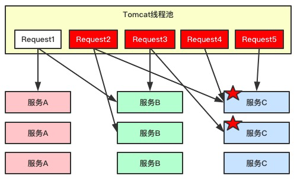
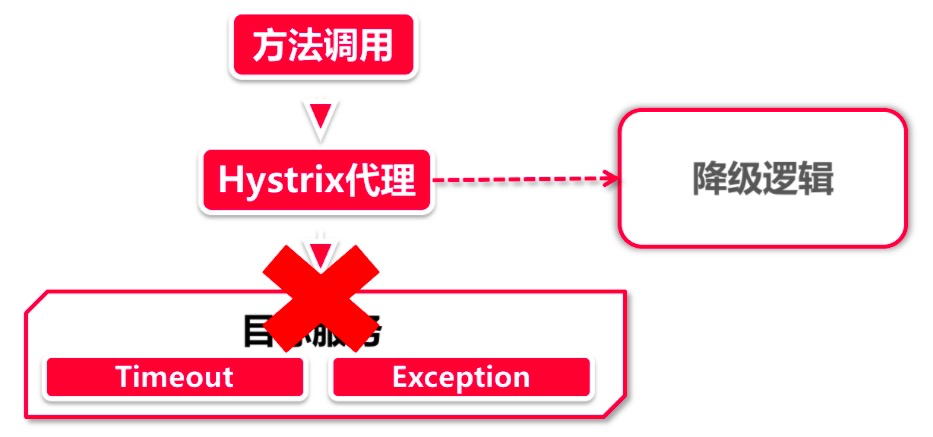
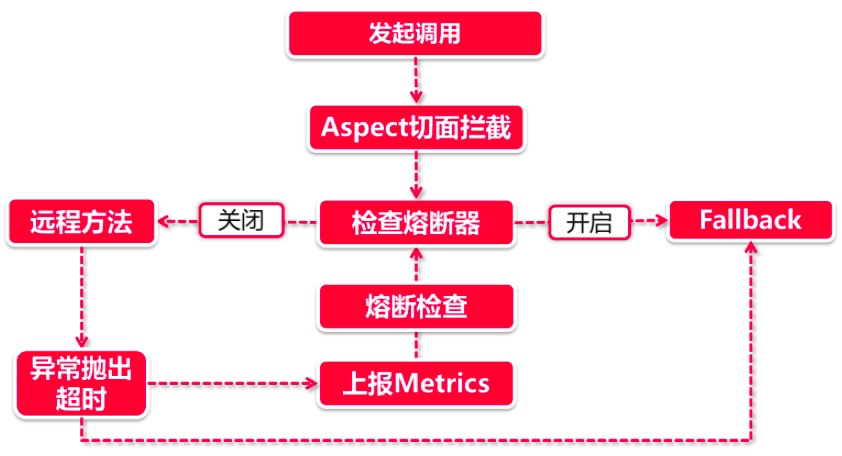

[TOC]

## 目录

- [1. 服务故障场景分析](#1-服务故障场景分析)
- [2. Hystrix体系架构核心功能解析](#2-Hystrix体系架构核心功能解析)
- [3. 服务降级的常用方案](#3-服务降级的常用方案)
- [4. Feign+Hystrix实现fallback降级方案](#4-Feign+Hystrix实现fallback降级方案)
- [5. Hystrix实现timeout降级](#5-Hystrix实现timeout降级)
- [6. RequetCache降压实现](#6-RequetCache降压实现)
- [7. 多级降级实现](#7-多级降级实现)
- [8. Hystrix超时配置和Ribbon超时重试共用的问题](#8-Hystrix超时配置和Ribbon超时重试共用的问题)
- [9. 熔断器核心机制理解分析](#9-熔断器核心机制理解分析)
- [10. Feign集成Hystrix熔断器](#10-Feign集成Hystrix熔断器)
- [11. 主链路降级熔断规划](#11-主链路降级熔断规划)
- [12. 线程隔离机制](#12-线程隔离机制)
- [13. Turbine聚合信息服务](#13-Turbine聚合信息服务)
- [14. Turbine集成Dashboard](#14-Turbine集成Dashboard)
- [15. 熔断器核心机制理解分析](#15-熔断器核心机制理解分析)


# SpringCloud服务降级熔断

## 1. 服务故障场景分析

缓存雪崩我们在之前的课程中都已经掌握过了，我们看一下另一个雪崩，那就服务雪崩

### 1.1. 服务雪崩的场景分析


**先来看一下这个场景：**

- 首先我们有三组服务对外提供服务，服务C的业务压力最小所以只有一个节点
- 从访问的线程池中来了5个请求到达服务，互相的调用关系如图所示，直接访问服务或间接调用

**目前异常场景出现了：**

- 如果我们的服务C由于代码原因或数据库连接池耗光导致访问非常慢，那么调用服务C的业务就会收到timeout的响应
- 这是所有到服务C的业务都timeout了，如果我们不做管控，这个timeout就会蔓延到服务B，进而到服务A，整条链路就会蔓延整个服务集群，所有请求的5个request直接团灭
- 这个时候如果不对服务做任何处理，新进来的业务请求也只是送人头而已

### 1.2. 线程池耗尽场景分析



**场景分析：**

- 请求从Tomcat中发起进行服务调用，会同时调用多个
- 这个时候服务C的应用处于一种时好时坏的状态，调用他的请求就会被夯在那里进行等待
- 虽然在调用C的同时也会调用其他服务，但由于C调用等待时间较长，这就导致请求一直挂起
- 挂起的请求多了后，并发的连接增大，Tomcat的连接池资源就会耗尽

**这个时候如何处理，就需要通过线程隔离来解决**

### 1.3. 生产环境故障发生流程

在生产环境中系统故障发生的严重状态一般有以下几步

- 访问延迟
- 服务不可用404/503/504
- 造成资损

这里就要再次提到主链路的概念了，如果商品详情页的评价模块挂了几分钟，这没有问题，但如果商品下单流程挂了几分钟，那就会导致资金损失了

熔断和降级的核心目的就是为了保障系统的主链路稳定

如何降低故障影响

- 隔离异常服务：降低串联影响做到线程级隔离
- 服务减压：服务快速失败触发熔断机制
- 备选方案：通过降级机制确保主链路可用的情况下实现系统最小可用性

## 2. Hystrix体系架构核心功能解析

> 《断舍离》，是日本作家山下英子的著作，这本书传达了一种生活理念。断=不买、不收取不需要的东西。舍=处理掉堆放在家里没用的东西。离=舍弃对物质的迷恋，让自己处于宽敞舒适，自由自在的空间。

对过往不迷恋，拿得起放得下，这样的生活哲学确实可以帮助人们度过一些困难时期。我们知道Hystrix也是为了帮服务节点度过他们的困难时期（缓解异常、雪崩带来的影响），它也有同样一套佛系的设计理念，分别对应Hystrix中三个特色功能

1. **断** - 熔断
2. **舍** - 降级
3. **离** - 线程隔离

### 2.1. 服务降级（舍）

微服务架构强调高可用，但并非高一致性，在一致性方面远比不上银行的大型机系统。也就是说，在日常服务调用阶段会出现一系列的调用异常，最常见的就是服务下线。举个例子：重启服务节点的时候，服务下线指令发送到注册中心后，这时还没来得及通过服务发现机制同步到客户端，因此某些服务调用请求依然会发送到这台机器，但由于服务已经下线，最终调用方只能无功而返，404 Not Found。

再举一个破坏力更大的例子。前面我们讲到了服务的雪崩效应，大家可能只听说过缓存雪崩，其实雪崩效应不仅仅针对缓存，它更大的危害是在大规模分布式应用上。我们举一个真实的案例，电商系统很多模块都依赖营销优惠服务，比如商品详情页、搜索列表页、购物车页和下单页面都依赖营销服务来计算优惠价格，因此这个服务承载的负载压力可谓非常之高。我们设想，假如这个服务出现了异常，导致响应超时，那么所有依赖它的下游系统的响应时间都会被拉长，这就引发了一个滚雪球的雪崩效应，由最上游的系统问题，引发了一系列下游系统响应超时，最终导致整个系统被拖垮。



服务降级用来应对上面的几种情况再合适不过了，假如HystrixClient调用目标请求的时候发生异常（exception），这时Hystrix会自动把这个请求转发到降级逻辑中，由服务调用方来编写异常处理逻辑。对响应超时的场景来说，我们可以通过配置Hystrix的超时等待时间（和Ribbon的timeout是两个不同配置），把超时响应的服务调用也当做是异常情况，转发到fallback逻辑中进行处理。

### 2.2. 服务熔断（断）

服务熔断是建立在服务降级之上的一个异常处理措施，你可以将它看做是服务降级的升级版。服务降级需要等待HTTP请求从服务节点返回异常或超时，再转向fallback逻辑，但是服务熔断引入了一种叫“断路器/熔断器”的机制，当断路器打开的时候，对服务的调用请求不会发送到目标服务节点，直接转向fallback逻辑。


断路器的打开/关闭有很多的判断标准，我们在服务熔断小节里再深入探讨。（好吧，这里我先剧透一点好了，比如我们可以这样设置：每10个请求，失败数量达到8个的时候打开断路器）。

同学可能会问了，假如断路器打开之后，就这么一直开着吗？当然不是了，一直开着多浪费电啊。服务一时失败，不代表一直失败，Hystrix也有一些配置规则，会主动去判断断路器关闭的时机。在后续章节，我们再来深入学习断路器的状态流转过程，我会带大家通过Turbine监控大盘，查看Hystrix断路器的开启关闭。

断路器可以显著缓解由QPS（Query Per Second，每秒访问请求，用来衡量系统当前压力）激增导致的雪崩效应，由于断路器打开后，请求直接转向fallback而不会发起服务调用，因此会大幅降低承压服务的系统压力。

### 2.3. 线程隔离（离）

大家知道Web容器通常有一个线程池来接待来访请求，如果并发量过高，线程池被打满了就会影响后面请求的响应。在我们应用内部，假如我们提供了3个微服务，分别是A，B，C。如果请求A服务的调用量过多，我们会发现所有可用线程都会逐渐被Service A占用，接下来的现象就是服务B和服务C没有系统资源可供调用。


Hystrix通过线程隔离的方案，将执行服务调用的代码与容器本身的线程池（比如tomcat thread pool）进行隔离，我们可以配置每个服务所需线程的最大数量，这样一来，即便一个服务的线程池被吃满，也不会影响其他服务。

与线程隔离相类似的还有“信号量”技术，稍后的小节我们会对两个技术做一番对比，看看这两个技术方案适合在哪些业务场景里应用。

## 3. 服务降级的常用方案

### 3.1. 静默处理

所谓的静默处理，就是什么也不干，在fallback逻辑中直接返回一个空值Null。

同学们可能会问，那我用try-catch捕捉异常不也是能达到一样的效果吗？其实不然，首先try-catch只能处理异常抛出的情况，并不能做超时判定。其次，使用try-catch就要在代码里包含异常处理块，我们在程序设计时讲究单一职责和开闭原则。既然有了专门的fallback处理类，这个工作还是交给fallback来吧，这样你的业务代码也会很清爽。

### 3.2. 默认值处理

默认值处理实际上就是说个谎话，在并不确定真实结果的情况下返回一个默认值

假如在商品详情页调用营销优惠接口时发生了故障，无法返回正确的计算结果，这里我们就可以在fallback逻辑中返回商品原价，作为打折后的价格，这样就相当于返回了一个没有打折优惠的计算结果。

这种方式下接口的返回值并不是真实的，因此不能应用在某些核心主链路中。举个例子，比如下单页面就是核心主链路，是最终确定订单价格的关键步骤。假如我们对订单优惠计算采用了默认值的方式，那么就会实际造成用户损失。因此，这里面的优惠计算决不能返回默认值，一定要得出真实结果，如果无法获取那么宁可返回异常中断下单操作。

同学们可能会问，那为什么商品详情页可以用默认值降级，而下单页面不能呢？这就要讲到主链路的规划，简单来说，电商平台的用户购物行为是一个漏斗模型，上宽下窄，用户流量在漏斗口最多，在尾部最少，越接近尾部的流量被转化为购物行为的比例就越高，因此越到后面对降级的容忍度就越低。商品搜索和商品详情页处于漏斗的上部，主要是导流端，在没有发生金钱往来的情况下我们可以容忍一定程度的降级误差。但对于下单页，这是整个漏斗模型的尾部，直接发生交易的环节，绝不能容忍任何金钱上的误差。老师在实际工作里设计商品详情页服务的时候，计算优惠访问返回的上限是1000ms，超过这个数字则自动降级为0优惠进行返回。

### 3.3. 恢复服务才是王道

这才称得上是正经的积极措施，fallback会尝试用各种方法获取正确的返回值，有这么几个常用场景。

1. **缓存异常**：假如因为缓存故障无法获取数据，在fallback逻辑中可以转而访问底层数据库（这个方法不能用在热点数据上，否则可能把数据库打挂，或者引发更大范围的服务降级和熔断，要谨慎使用）。反过来如果数据库发生故障，也可以在fallback里访问缓存，但要注意数据一致性
2. **切换备库**：一般大型应用都会采用主从+备库的方式做灾备，假如我们的主从库都发生了故障，往往需要人工将数据源切换到备份数据库，我们在fallback中可以先于人工干预之前自动访问备库数据。这个场景尽量限定在核心主链路接口上，不要动不动就去访问备库，以免造成脏读幻读。
3. **重试**：Ribbon可以处理超时重试，但对于异常情况来说（比如当前资源被暂时锁定），我们可以在fallback中自己尝试重新发起接口调用
4. **人工干预**：有些极其重要的接口，对异常不能容忍，这里可以借助fallback启动人工干预流程，比如做日志打点，通过监控组件触发报警，通知人工介入

### 3.4. 一错再错-多次降级

在某种情况下，fallback里由于各种问题又出现一个异常来。这时我们可以做二次降级，也就是在fallback中再引入一个fallback。当然，你也可以引入三四五六七八更多层的降级，对应一些复杂的大型应用，比如淘系很多核心系统，多级降级是很常见的，根据系统故障的严重程度采取更精细粒度的降级方案。

那假如这一连串降级全部都失败了，难道要牢底坐穿不成？对这种一错再错无药可救的顽固分子，Hystrix也没有办法，只好放你走了，将异常抛到最外层。

### 3.5. Request Cache

Request Cache并不是让你在fallback里访问缓存，它是Hystrix的一个特殊功能。我们可以通过@CacheResult和@CacheKey两个注解实现，配置如下

```java
@CacheResult
@HystrixCommand
public Friend requestCache(@CacheKey Integer id) {
}
```

@CacheResult注解的意思是该方法的结果可以被Hystrix缓存起来，@CacheKey指定了这个缓存结果的业务ID是什么。在一个Hystrix上下文范围内，如果使用相同的参数对@CacheResult修饰的方法发起了多次调用，Hystrix只会在首次调用时向服务节点发送请求，后面的几次调用实际上是从Hystrix的本地缓存里读取数据。

Request Cache并不是由调用异常或超时导致的，而是一种主动的可预知的降级手段，严格的说，这更像是一种性能优化而非降级措施。

## 4. Feign+Hystrix实现fallback降级方案

创建一个新的目录hystrix，在该目录下创建hystrix-fallback项目模块

我们这个新的模块还是一个服务调用者，参考前面的feign-consumer-advanced的引入POM依赖，注意要添加hystrix的依赖包了

```xml
<?xml version="1.0" encoding="UTF-8"?>
<project xmlns="http://maven.apache.org/POM/4.0.0"
         xmlns:xsi="http://www.w3.org/2001/XMLSchema-instance"
         xsi:schemaLocation="http://maven.apache.org/POM/4.0.0 http://maven.apache.org/xsd/maven-4.0.0.xsd">
    <parent>
        <artifactId>spring-cloud-project</artifactId>
        <groupId>com.icodingedu</groupId>
        <version>1.0-SNAPSHOT</version>
        <relativePath>../../pom.xml</relativePath>
    </parent>
    <modelVersion>4.0.0</modelVersion>
    <packaging>jar</packaging>
    <artifactId>hystrix-fallback</artifactId>
    <name>hystrix-fallback</name>

    <dependencies>
        <dependency>
            <groupId>org.springframework.cloud</groupId>
            <artifactId>spring-cloud-starter-netflix-eureka-client</artifactId>
        </dependency>
        <dependency>
            <groupId>org.springframework.boot</groupId>
            <artifactId>spring-boot-starter-web</artifactId>
        </dependency>
        <dependency>
            <groupId>org.springframework.boot</groupId>
            <artifactId>spring-boot-starter-actuator</artifactId>
        </dependency>
        <dependency>
            <groupId>com.icodingedu</groupId>
            <artifactId>feign-client-intf</artifactId>
            <version>${project.version}</version>
        </dependency>
        <dependency>
            <groupId>org.springframework.cloud</groupId>
            <artifactId>spring-cloud-starter-netflix-hystrix</artifactId>
        </dependency>
    </dependencies>
</project>
```

我们需要定义一个可以抛出异常的Feign接口调用

先去Feign-client-intf里新建立一个error接口

```java
    @GetMapping("/error")
    String error();
```

再去feign-client-advanced里实现这个方法

```java
    @Override
    public String error() {
        throw new RuntimeException("mouse droppings");
    }
```

再回到hystrix-fallback里进行applicaiton代码的编写

```java
package com.icodingedu.springcloud;

import org.springframework.boot.WebApplicationType;
import org.springframework.boot.autoconfigure.SpringBootApplication;
import org.springframework.boot.builder.SpringApplicationBuilder;
import org.springframework.cloud.client.circuitbreaker.EnableCircuitBreaker;
import org.springframework.cloud.client.discovery.EnableDiscoveryClient;
import org.springframework.cloud.openfeign.EnableFeignClients;

@SpringBootApplication
@EnableDiscoveryClient
@EnableFeignClients
//断路器
@EnableCircuitBreaker
public class HystrixFallbackApplication {

    public static void main(String[] args) {
        new SpringApplicationBuilder(HystrixFallbackApplication.class)
                .web(WebApplicationType.SERVLET)
                .run(args);
    }
}
```

在hystrix-fallback中新建一个service包，在里面创建一个MyService的Interface

```java
package com.icodingedu.springcloud.service;

import org.springframework.cloud.openfeign.FeignClient;

@FeignClient(name = "feign-client")
public interface MyService extends IServiceAdvanced {
}
```

在hystrix-fallback中新建一个业务包hystrix，在里面创建一个业务类Fallback

```java
package com.icodingedu.springcloud.hystrix;

import com.icodingedu.springcloud.pojo.PortInfo;
import com.icodingedu.springcloud.service.MyService;
import lombok.extern.slf4j.Slf4j;
import org.springframework.stereotype.Component;

//Fallback其实就是我们的容错类
@Slf4j
@Component
public class Fallback implements MyService {
    @Override
    public String error() {
        log.info("********* sorry ********");
        return "I am so sorry!";
    }
    //下面的方法都暂时不管,只针对error方法做实现
    @Override
    public String sayHello() {
        return null;
    }

    @Override
    public PortInfo sayHello(PortInfo portInfo) {
        return null;
    }

    @Override
    public String retry(int timeout) {
        return null;
    }
}
```

再回到MyService接口里加上降级处理的实现类

```java
package com.icodingedu.springcloud.service;

import com.icodingedu.springcloud.hystrix.Fallback;
import org.springframework.cloud.openfeign.FeignClient;
//这是一个整体容错方案,接口里的所有方法都进行了容错管理都需要在上面的Fallback类里实现容错
@FeignClient(name = "feign-client",fallback = Fallback.class)
public interface MyService extends IServiceAdvanced {
}
```

创建controller调用实现

```java
package com.icodingedu.springcloud.controller;

import com.icodingedu.springcloud.service.MyService;
import org.springframework.web.bind.annotation.GetMapping;
import org.springframework.web.bind.annotation.RestController;

import javax.annotation.Resource;

@RestController
public class HystrixController {

    @Resource
    private MyService myService;


    @GetMapping("/fallback")
    public String fallback(){
       return myService.error();
    }
}
```

配置properties文件

```properties
spring.application.name=hystrix-consumer
server.port=50001
# 允许bean的注解重载
spring.main.allow-bean-definition-overriding=true
eureka.client.serviceUrl.defaultZone=http://localhost:20001/eureka/
# 开启feign下的hystrix功能
feign.hystrix.enabled=true
# 是服务开启服务降级
hystrix.command.default.fallback.enabled=true
```

测试启动顺序

eureka-server、feign-client-advanced、hystrix-fallback

测试结果是feign-client-advanced出现：java.lang.RuntimeException: mouse droppings 异常

而hystrix-fallback则返回降级后的返回 I am so sorry !

测试结果：调用产生异常后就会返回降级的实现内容

## 5. Hystrix实现timeout降级

在controller里加入一个timeout的方法，还是用之前的retry方法

```java
    @GetMapping("/timeout")
    public String timeout(int second){
        return myService.retry(second);
    }
```

在Fallback类里将降级方法实现了

```java
    @Override
    public String retry(int timeout) {
        return "Yout are late !";
    }
```

properties里配置超时降级机制

```properties
# 配置全局超时
hystrix.command.default.execution.timeout.enabled=true
# 全局超时时间，默认是1000ms
hystrix.command.default.execution.isolation.thread.timeoutInMilliseconds=2000
# 超时以后终止线程
hystrix.command.default.execution.isolation.thread.interruptOnTimeout=true
# 取消的时候终止线程
hystrix.command.default.execution.isolation.thread.interruptOnFutureCancel=true


# 这里把ribbon的超时重试机制也拿进来
# 每台机器最大的重试次数
feign-client.ribbon.MaxAutoRetries=0
# 可以重试的机器数量
feign-client.ribbon.MaxAutoRetriesNextServer=0
# 连接请求超时的时间限制ms
feign-client.ribbon.ConnectTimeout=1000
# 业务处理的超时时间ms
feign-client.ribbon.ReadTimeout=5000
# 默认是false,默认是在get上允许重试
# 这里是在所有HTTP Method进行重试,这里要谨慎开启,因为POST,PUT,DELETE如果涉及重试就会出现幂等问题
feign-client.ribbon.OkToRetryOnAllOperations=false
```

重启hystrix-fallback进行测试，发现超时没有返回达到配置的2秒就直接降级了

**刚刚是对全局进行的超时配置，如果想要对具体方法实现如下**

```properties
# 将default替换成MyService
# 具体方法的超时时间
hystrix.command.MyService#retry(int).execution.isolation.thread.timeoutInMilliseconds=4000
```

这块如果不知到这个参数怎么写的可以在main里输出一下：MyService#retry(int)

```java
    public static void main(String[] args) throws NoSuchMethodException {
        System.out.println(Feign.configKey(MyService.class,
                MyService.class.getMethod("retry",int.class)
                ));
    }
```

**也可以通过注解的方式实现具体方法的超时降级，下面会讲到**

## 6. RequetCache降压实现

Request Cache并不是由调用异常或超时导致的，而是一种主动的可预知的降级手段，严格的说，这更像是一种性能优化而非降级措施

代码直接开撸，在hytrix-fallback里创建一个RequestCacheService

```java
package com.icodingedu.springcloud.service;

import com.icodingedu.springcloud.pojo.PortInfo;
import com.netflix.hystrix.contrib.javanica.cache.annotation.CacheKey;
import com.netflix.hystrix.contrib.javanica.cache.annotation.CacheResult;
import lombok.extern.slf4j.Slf4j;
import org.springframework.beans.factory.annotation.Autowired;

@Service
@Slf4j
public class RequestCacheService {

    @Resource
    private MyService service;
		//这里就是将结果缓存并根据参数值来进行k-v的缓存对应
    @CacheResult
  	@HystrixCommand(commandKey = "cacheKey")
    public PortInfo requestCache(@CacheKey String name){
        log.info("request cache name "+ name);
        PortInfo portInfo = new PortInfo();
        portInfo.setName(name);
        portInfo.setPort("2020");
        portInfo = service.sayHello(portInfo);
        log.info("after request cache name "+name);
        return portInfo;
    }
}
```

**超时降级的方法key另一种配置方式**

```shell
注意这里的@HystrixCommand(commandKey = "cacheKey")
这个cacheKey就可以用在上面的具体方法超时时间上，但还要配套fallbackMethod的方法
hystrix.command.cacheKey.execution.isolation.thread.timeoutInMilliseconds=2000
```

编写controller的实现

```java
@Autowired
private RequestCacheService requestCacheService;

@GetMapping("/cache")
public PortInfo requestCache(String name){
  //缓存存放在hystrix的上下文中,需要初始化上下文,上下文打开后执行完还要关闭context.close();
  //使用try-catch-finally里去context.close();掉
  //或者使用lombok的@Cleanup注解,默认调用close方法,如果默认不是close方法而是其他方法关闭
  //可以这样来设置@Cleanup("shutup")
  @Cleanup HystrixRequestContext context = HystrixRequestContext.initializeContext();

  //我们在这里调用两次看看执行过程
  PortInfo portInfo = requestCacheService.requestCache(name);
  portInfo = requestCacheService.requestCache(name);
  return portInfo;
}
```

properties里可以配置也可以不配置

```properties
# 默认requestCache是打开状态
hystrix.command.default.requestCache.enabled=true
```

重启后进行测试发现，feign-client-advanced的控制台只被调用了一次，这样就可以将远程调用需要K-V缓存的内容放到一个hystrix上下文中进行调用，只要调用参数值一样，无论调用多少次返回值都是从缓存中取这样就能提升一定的性能不用每次都进行远程调用了

## 7. 多级降级实现

**去到Fallback类里再创建两个降级的实现方法**

```java
    @Override
    //降级方法的参数要保持一致
    @HystrixCommand(fallbackMethod = "fallback2")
    public String error() {
        log.info("********* sorry ********");
        throw new RuntimeException("first fallback");
    }
    @HystrixCommand(fallbackMethod = "fallback3")
    public String fallback2(){
        log.info("********* sorry again ********");
        throw new RuntimeException("first fallback again");
    }
    public String fallback3(){
        log.info("********* sorry again 2 ********");
        return "success sorry again 2!";
    }
```

**通过注解配置实现timeout超时降级**

去到controller里添加一个方法

```java
    @GetMapping("/timeout2")
    @HystrixCommand(
        fallbackMethod = "timeoutfallback",
      	//可以忽略不进行降级的异常
      	ignoreExceptions = {IllegalArgumentException.class},
      	//这个commandProperties是一个数组,所以可以配置多个HystrixProperty
        commandProperties = {
            @HystrixProperty(name = "execution.isolation.thread.timeoutInMilliseconds",value = "6000")
        }
    )
    public String timeout2(int second){
        return myService.retry(second);
    }
		//这个是降级的实现方法
    public String timeoutfallback(int second){
        return "timeout success "+second;
    }
```

这里需要注意的是在注解上添加的超时和配置文件里配置的全局超时设置之间的时间关系

## 8. Hystrix超时配置和Ribbon超时重试共用的问题

Feign集成了Ribbon和Hystrix两个组件，它俩都各自有一套超时配置，那到底哪个超时配置是最终生效的那个呢

我们先来复习一下Ribbon的超时时间计算公式：

```shell
最大超时时间=（连接超时时间+接口超时时间）*（当前节点重试次数+1）*（换节点重试次数+1）
```

**假如经过上述计算，Ribbon的超时时间是2000ms**，那么Hystrix的超时时间应该设置成多少才合理呢？我们先来看看Hystrix的默认全局配置

```shell
hystrix.command.default.execution.isolation.thread.timeoutInMilliseconds=1000
```

以上全局配置设置了Hystrix的熔断时间为1000ms。这里Hystrix的超时时间设置比Ribbon配置的时间短，那么不等Ribbon重试结束，Hystrix判定超时后就会直接执行熔断逻辑。因此，Hystrix和Ribbon是一个共同作用的关系，谁先到达超时指标就会率先起作用。

**通常来讲，Hystrix的熔断时间要比Ribbon的最长超时时间设置的略长一些，这样就可以让Ribbon的重试机制充分发挥作用，以免出现还没来得及重试就进入fallback逻辑的情况发生。**

那如果我们有一些接口对响应时间的要求特别高，比如说商品详情页接口，元数据必须在2s以内加载返回，那我们怎么针对方法设置更细粒度的Hystrix超时限制？

- 这个时候我们就需要以方法为维度来设置服务降级时间而不是直接应用全局配置了

- 方法级别的降级时间优先级是高于全局应用级别的，即便是方法超时时长>全局超时时长，也是走方法级别的超时时间

  ```shell
  # 具体方法的超时时间
  hystrix.command.MyService#retry(int).execution.isolation.thread.timeoutInMilliseconds=6000
  # 超时时间
  hystrix.command.default.execution.isolation.thread.timeoutInMilliseconds=3000
  ```

- 方法上实现超时时间配置有三种方法

  - 通过方法签名配置：MyService#retry(int)
  - 通过commandKey配置
  - 通过注解配置@HystrixProperty

## 9. 熔断器核心机制理解分析

服务熔断是建立在降级之上的强力手段，是进击的降级，对于调用后进入降级处理的业务反复fallback就需要启用熔断机制了，不再进行远程调用，待什么时候服务恢复了再恢复远程调用访问



以上流程中省略了服务降级部分的业务，我们只关注熔断部分。

1. **发起调用-切面拦截**：由于熔断器是建立在服务降级的基础上，因此在前面的触发机制上和服务降级流程一模一样。在向@HystrixCommand注解修饰的方法发起调用时，将会触发由Aspect切面逻辑
2. **检查熔断器**：当熔断状态开启的时候，直接执行进入fallback，不执行远程调用
3. **发起远程调用-异常情况**：还记得前面服务降级小节里讲到的，服务降级是由一系列的回调函数构成的，当远程方法调用抛出异常或超时的时候，这个异常情况将被对应的回调函数捕捉到
4. **计算Metrics**：这里的Metrics指的是衡量指标，在异常情况发生后，将会根据断路器的配置计算当前服务健康程度，如果达到熔断标准，则开启断路开关，后续的请求将直接进入fallback流程里

**熔断器有三个状态阶段：**

1. **熔断器open状态**：远程服务关闭状态，服务在一定时间内不得发起外部调用，访问服务调用者直接进入fallback里处理
2. **熔断器half-open状态**：在fallback里待的也够久了，给一个改过自新的机会，可以尝试发起真实的服务调用，但这一切都在监视下进行，一旦远程调用不成功无论是否达到熔断的阈值则直接熔断，等待下次尝试调用的机会
3. **熔断器closed**：上一步尝试进行远程调用成功了，那便关闭熔断，开始正常远程访问

**熔断器的判断阀值：**

主要从两个维度判断熔断器是否开启：

- 在一定时间窗口内，发生异常的请求数量达到临界值
- 在一定时间窗口内，发生异常的请求数量占请求总数量达到一定比例

其中时间窗口的大小也是可以配置的，而且我们还可以指定half-open判定的时间间隔，比如说熔断开启10秒以后进入half-open状态，此时就会让一个请求发起调用，如果成功就关闭熔断器。

## 10. Feign集成Hystrix熔断器

这一节比较轻松，只需要通过配置来进行熔断设置即可

```properties
# 熔断的前提条件(请求的数量),在一定的时间窗口内,请求达到5个以后,才开始进行熔断判断
hystrix.command.default.circuitBreaker.requestVolumeThreshold=5
# 失败请求数达到50%则熔断开关开启
hystrix.command.default.circuitBreaker.errorThresholdPercentage=50
# 当熔断开启后经过多少秒再进入半开状态,放出一个请求进行远程调用验证,通过则关闭熔断不通过则继续熔断
hystrix.command.default.circuitBreaker.sleepWindowInMilliseconds=15000
# 配置时间窗口
hystrix.command.default.metrics.rollingStats.timeInMilliseconds=20000


# 开启或关闭熔断的功能
hystrix.command.default.circuitBreaker.enabled=true
# 强制开启熔断开关
hystrix.command.default.circuitBreaker.forceOpen=false
# 强制关闭熔断开关
hystrix.command.default.circuitBreaker.forceClosed=false
```

**要把retry的全局延时降级时间调整成2秒进行测试**

1秒正常，2秒降级进行测试，验证阈值的百分比触发条件

> 作业：
>
> 上面配置的是基于全局的熔断器，如何配置基于某个方法的熔断机制
>
> 可以参考超时降级的配置方法，将配置文件中default换成具体key，通过注解实现的方式

## 11. 主链路降级熔断规划


- 首先是识别主链路
- 根据主链路分析主线流程和业务底线以及故障恢复

## 12. 线程隔离机制

- 线程池拒绝

  这一步是线程隔离机制直接负责的，假如当前商品服务分配了10个线程，那么当线程池已经饱和的时候就可以拒绝服务，调用请求会收到Thread Pool Rejects，然后将被转到对应的fallback逻辑中。其实控制线程池中线程数量是由多个参数共同作用的，我们分别看一下

  - coreSize：核心线程数（**默认为10**）
  - maximumSize：设置最大允许的线程数（**默认也是10**），这个属性需要打开allowMaximumSizeToDivergeFromCoreSize之后才能生效，后面这个属性允许线程池中的线程数扩展到maxinumSize个
  - queueSizeRejectionThreshold：这个属性经常会被忽略，这是控制队列最大阈值的，**Hystrix默认设置了5**。即便把maximumSize改大，但因为线程队列阈值的约束，你的程序依然无法承载很多并发量。所以当你想改大线程池的时候，需要这两个属性一同增大
  - keepAliveTimeMinutes：这个属性和线程回收有关，我们知道线程池可以最大可以扩展到maximumSize，当线程池空闲的时候，多余的线程将会被回收，这个属性就指定了线程被回收前存活的时间。**默认2分钟**，如果设置的过小，可能会导致系统频繁回收/新建线程，造成资源浪费

- **线程Timeout**：我们通常情况下认为延迟只会发生在网络请求上，其实不然，在Netflix设计Hystrix的时候，就有一个设计理念：调用失败和延迟也可能发生在远程调用之前（比如说一次超长的Full GC导致的超时，或者方法只是一个本地业务计算，并不会调用外部方法），这个设计理念也可以在Hystrix的Github文档里也有提到。因此在方法调用过程中，如果同样发生了超时，则会产生Thread Timeout，调用请求被流转到fallback

- **服务异常/超时**：这就是我们前面学习的的服务降级，在调用远程方法后发生异常或者连接超时等情况，直接进入fallback

**代码实现：**在service包下创建一个业务类来做测试

```java
package com.icodingedu.springcloud.service;

import com.icodingedu.springcloud.pojo.PortInfo;
import com.netflix.hystrix.*;
import lombok.extern.slf4j.Slf4j;

@Slf4j
public class GetPortInfoCommand extends HystrixCommand<PortInfo> {

    private String name;

    public GetPortInfoCommand(String name) {
        super(Setter.withGroupKey(HystrixCommandGroupKey.Factory.asKey("GetPortInfoCommandPool"))
                .andCommandKey(HystrixCommandKey.Factory.asKey("GetPortInfoCommandKey"))
                .andThreadPoolKey(HystrixThreadPoolKey.Factory.asKey(name))
                .andCommandPropertiesDefaults(
                        HystrixCommandProperties.Setter()
                        .withExecutionIsolationStrategy(HystrixCommandProperties.ExecutionIsolationStrategy.THREAD)
                        .withExecutionTimeoutInMilliseconds(25000)
                        //.withExecutionIsolationSemaphoreMaxConcurrentRequests(3)
                )
                .andThreadPoolPropertiesDefaults(
                        HystrixThreadPoolProperties.Setter()
                        .withCoreSize(3)
                        .withQueueSizeRejectionThreshold(1)
                )
        );
        this.name = name;
    }

    @Override
    protected PortInfo run() throws Exception {
        log.info("********进入线程池******");
        Thread.sleep(20000);
        PortInfo portInfo = new PortInfo();
        portInfo.setName(name);
        portInfo.setPort("99999");
        log.info("********执行完毕******");
        return portInfo;
    }
}
```

controller层进行验证，创建一个方法

```java
    @GetMapping("/command")
    public String portInfoCommand(){
        com.netflix.hystrix.HystrixCommand<PortInfo> hystrixCommand = new GetPortInfoCommand("gavin.huang");
        PortInfo portInfo = hystrixCommand.execute();
        return "success "+portInfo.getName()+" --- "+portInfo.getPort();
    }
```

**线程隔离原理**

- 线程池技术：它使用Hystrix自己内建的线程池去执行方法调用，而不是使用Tomcat的容器线程
- 信号量技术：它直接使用Tomcat的容器线程去执行方法，不会另外创建新的线程，信号量只充当开关和计数器的作用。获取到信号量的线程就可以执行方法，没获取到的就转到fallback

**从性能角度看**

- 线程池技术：涉及到线程的创建、销毁和任务调度，而且CPU在执行多线程任务的时候会在不同线程之间做切换，我们知道在操作系统层面CPU的线程切换是一个相对耗时的操作，因此从资源利用率和效率的角度来看，线程池技术会比信号量慢
- 信号量技术：由于直接使用Tomcat容器线程去访问方法，信号量只是充当一个计数器的作用，没有额外的系统资源消费，所以在性能方面具有明显的优势

**信号量实现只需要修改service 的两个地方**

```java
//在service的构造方法里将THREAD改成SEMAPHORE
//增加信号量控制.withExecutionIsolationSemaphoreMaxConcurrentRequests(3)
//下面线程池的内容注释掉即可
		public GetPortInfoCommand(String name) {
        super(Setter.withGroupKey(HystrixCommandGroupKey.Factory.asKey("GetPortInfoCommandPool"))
                .andCommandKey(HystrixCommandKey.Factory.asKey("GetPortInfoCommandKey"))
                .andThreadPoolKey(HystrixThreadPoolKey.Factory.asKey(name))
                .andCommandPropertiesDefaults(
                        HystrixCommandProperties.Setter()
                        .withExecutionIsolationStrategy(HystrixCommandProperties.ExecutionIsolationStrategy.SEMAPHORE)
                        .withExecutionTimeoutInMilliseconds(25000)
                        .withExecutionIsolationSemaphoreMaxConcurrentRequests(3)
                )
//                .andThreadPoolPropertiesDefaults(
//                        HystrixThreadPoolProperties.Setter()
//                        .withCoreSize(3)
//                        .withQueueSizeRejectionThreshold(1)
//                )
        );
        this.name = name;
    }
```

## 13. Turbine聚合信息服务

Turbine需要连接了服务注册中心获取服务提供者列表以便进行相应信息聚合

在hystrix目录下创建一个hystrix-turbine的module

导入POM依赖，和hystrix-fallback基本一样，只需要把feign-client-intf依赖去掉并加入turbine的依赖即可

```xml
<?xml version="1.0" encoding="UTF-8"?>
<project xmlns="http://maven.apache.org/POM/4.0.0"
         xmlns:xsi="http://www.w3.org/2001/XMLSchema-instance"
         xsi:schemaLocation="http://maven.apache.org/POM/4.0.0 http://maven.apache.org/xsd/maven-4.0.0.xsd">
    <parent>
        <artifactId>spring-cloud-project</artifactId>
        <groupId>com.icodingedu</groupId>
        <version>1.0-SNAPSHOT</version>
        <relativePath>../../pom.xml</relativePath>
    </parent>
    <modelVersion>4.0.0</modelVersion>
    <packaging>jar</packaging>
    <artifactId>hystrix-turbine</artifactId>
    <name>hystrix-turbine</name>

    <dependencies>
        <dependency>
            <groupId>org.springframework.cloud</groupId>
            <artifactId>spring-cloud-starter-netflix-eureka-client</artifactId>
        </dependency>
        <dependency>
            <groupId>org.springframework.boot</groupId>
            <artifactId>spring-boot-starter-web</artifactId>
        </dependency>
        <dependency>
            <groupId>org.springframework.boot</groupId>
            <artifactId>spring-boot-starter-actuator</artifactId>
        </dependency>
        <dependency>
            <groupId>org.springframework.cloud</groupId>
            <artifactId>spring-cloud-starter-netflix-hystrix</artifactId>
        </dependency>
        <dependency>
            <groupId>org.springframework.cloud</groupId>
            <artifactId>spring-cloud-starter-netflix-turbine</artifactId>
        </dependency>
    </dependencies>
</project>
```

编写application启动类

```java
package com.icodingedu.springcloud;

import org.springframework.boot.WebApplicationType;
import org.springframework.boot.autoconfigure.EnableAutoConfiguration;
import org.springframework.boot.builder.SpringApplicationBuilder;
import org.springframework.cloud.client.discovery.EnableDiscoveryClient;
import org.springframework.cloud.netflix.hystrix.EnableHystrix;
import org.springframework.cloud.netflix.turbine.EnableTurbine;

@EnableDiscoveryClient
@EnableHystrix
@EnableTurbine
@EnableAutoConfiguration
public class HystrixTurbineApplication {

    public static void main(String[] args) {
        new SpringApplicationBuilder(HystrixTurbineApplication.class)
                .web(WebApplicationType.SERVLET)
                .run(args);
    }
}
```

配置propertie的配置文件

```properties
spring.application.name=hystrix-turbine
server.port=50002
eureka.client.serviceUrl.defaultZone=http://localhost:20001/eureka/

# 指定需要监控的服务名
turbine.app-config=hystrix-consumer
turbine.cluster-name-expression="default"
# 将端口和hostname作为区分不同服务的条件,默认只用hostname,默认方式在本地一个IP下就区分不开了
turbine.combine-host-port=true
# turbine通过这个路径获取监控数据,所以监控的服务也要开放这个路径监控
turbine.instanceUrlSuffix.default=actuator/hystrix.stream
turbine.aggregtor.clusterConfig=default
```

去到hystrix-fallback项目中打开actuator的配置

```properties
# actuator暴露接口
management.security.enabled=false
management.endpoints.web.exposure.include=*
management.endpoint.health.show-details=always
```

去到浏览打开项目hystrix-fallback的actuator路径进行查看

http://localhost:50001/actuator  可以看到所有监控的信息

http://localhost:50001/actuator/hystrix.stream  可以看到一个长连接的ping在不断返回结果

**现在启动hystrix-turbine项目**

http://localhost:50002/turbine.stream  访问这个路径

从这个页面发现turbine自己并不生产数据，只是将数据进行收集

## 14. Turbine集成Dashboard

创建一个hystrix-dashboard的module

导入POM依赖

```xml
<?xml version="1.0" encoding="UTF-8"?>
<project xmlns="http://maven.apache.org/POM/4.0.0"
         xmlns:xsi="http://www.w3.org/2001/XMLSchema-instance"
         xsi:schemaLocation="http://maven.apache.org/POM/4.0.0 http://maven.apache.org/xsd/maven-4.0.0.xsd">
    <parent>
        <artifactId>spring-cloud-project</artifactId>
        <groupId>com.icodingedu</groupId>
        <version>1.0-SNAPSHOT</version>
        <relativePath>../../pom.xml</relativePath>
    </parent>
    <modelVersion>4.0.0</modelVersion>
    <packaging>jar</packaging>
    <artifactId>hystrix-dashboard</artifactId>
    <name>hystrix-dashboard</name>

    <dependencies>
        <dependency>
            <groupId>org.springframework.cloud</groupId>
            <artifactId>spring-cloud-starter-netflix-hystrix</artifactId>
        </dependency>
        <dependency>
            <groupId>org.springframework.cloud</groupId>
            <artifactId>spring-cloud-starter-netflix-hystrix-dashboard</artifactId>
        </dependency>
    </dependencies>
</project>
```

创建application启动类

```java
package com.icodingedu.springcloud;

import org.springframework.boot.WebApplicationType;
import org.springframework.boot.autoconfigure.SpringBootApplication;
import org.springframework.boot.builder.SpringApplicationBuilder;
import org.springframework.cloud.netflix.hystrix.dashboard.EnableHystrixDashboard;

@EnableHystrixDashboard
@SpringBootApplication
public class HystrixDashboardApplication {

    public static void main(String[] args) {
        new SpringApplicationBuilder(HystrixDashboardApplication.class)
                .web(WebApplicationType.SERVLET)
                .run(args);
    }
}
```

创建properties配置文件

```properties
spring.application.name=hystrix-dashboard
server.port=50003

# hystrix监控路径:这个是一台服务的监控检查
# http://localhost:50001/actuator/hystrix.stream
# turbine监控路径:这是整合多台服务的监控检查
# http://localhost:50002/turbine.stream
```

分别启动eureka-server、feign-client-advanced、hystrix-fallback、hystrix-turbine、hystrix-dashboard
按照顺序启动完毕后登录：http://localhost:50003/hystrix

## 15. 熔断器核心机制理解分析

频繁出错的应用，应该快速失败，不要占用系统，快速失败后不再进行远程调用了，直接进行本地访问，待远程恢复后再进行访问


以上流程中省略了服务降级部分的业务，我们只关注熔断部分。

1. **发起调用-切面拦截**：由于熔断器是建立在服务降级的基础上，因此在前面的触发机制上和服务降级流程一模一样。在向@HystrixCommand注解修饰的方法发起调用时，将会触发由Aspect切面逻辑
2. **检查熔断器**：当熔断状态开启的时候，直接执行进入fallback，不执行远程调用
3. **发起远程调用-异常情况**：还记得前面服务降级小节里讲到的，服务降级是由一系列的回调函数构成的，当远程方法调用抛出异常或超时的时候，这个异常情况将被对应的回调函数捕捉到
4. **计算Metrics**：这里的Metrics指的是衡量指标，在异常情况发生后，将会根据断路器的配置计算当前服务健康程度，如果达到熔断标准，则开启断路开关，后续的请求将直接进入fallback流程里

**熔断器有三个状态阶段：**

1. **熔断器open状态**：远程服务关闭状态，服务在一定时间内不得发起外部调用，访问服务调用者直接进入fallback里处理
2. **熔断器half-open状态**：在fallback里待的也够久了，给一个改过自新的机会，可以尝试发起真实的服务调用，但这一切都在监视下进行，一旦远程调用不成功无论是否达到熔断的阈值则直接熔断，等待下次尝试调用的机会
3. **熔断器closed**：上一步尝试进行远程调用成功了，那便关闭熔断，开始正常远程访问

**熔断器的判断阀值：**

主要从两个维度判断熔断器是否开启：

- 在一定时间窗口内，发生异常的请求数量达到临界值
- 在一定时间窗口内，发生异常的请求数量占请求总数量达到一定比例

其中时间窗口的大小也是可以配置的，而且我们还可以指定half-open判定的时间间隔，比如说熔断开启10秒以后进入half-open状态，此时就会让一个请求发起调用，如果成功就关闭熔断器。
