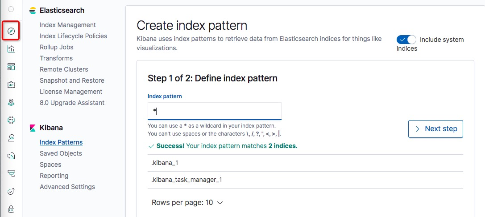
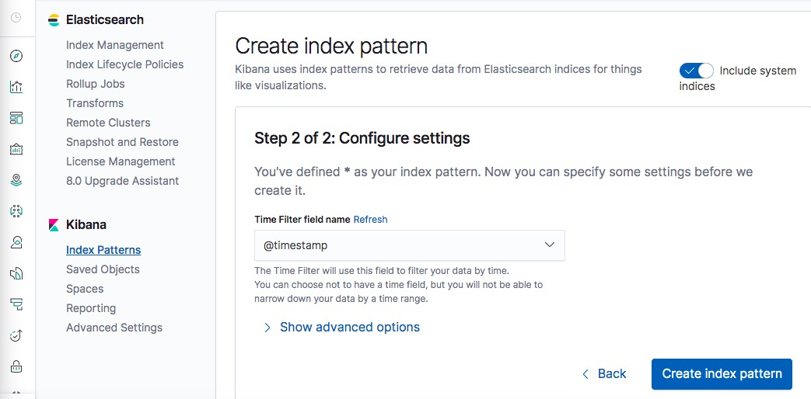

[TOC]

## 目录

- [1. 链路追踪在微服务中的作用](#1-链路追踪在微服务中的作用)
- [2. 链路追踪的基本功能](#2-链路追踪的基本功能)
- [3. Sleuth的链路追踪介绍](#3-sleuth的链路追踪介绍)
- [4. Sleuth的体系架构设计原则](#4-Sleuth的体系架构设计原则)
- [5. 调用链路数据模型](#5-调用链路数据模型)
- [6. 整合Sleuth追踪调用链路](#6-整合Sleuth追踪调用链路)
- [7. 什么是Zipkin](#7-什么是Zipkin)
- [8. 搭建配置Zipkin服务](#8-搭建配置Zipkin服务)
- [9. 实现Zipkin服务高可用](#9-实现Zipkin服务高可用)
- [10. Sleuth集成ELK实现日志检索](#10-Sleuth集成ELK实现日志检索)


# SpringCloud微服务调用链追踪

## 1. 链路追踪在微服务中的作用

微服务之间的调用关系是网状的

根本无法用人力梳理出上线游调用关系，通过调用链追踪技术进行调用关系梳理，得处调用拓扑图，理清上下游关系以及更细粒度的时间报表

- 谁是你的大客户，调用你的次数最多
- 你的服务在每个环节的响应时间是多少

## 2. 链路追踪的基本功能

- 分布式环境下的链路追踪
- 获知Timing信息：还可以根据执行时间的多少触发相应的预警信息
- 定位链路功能：对于整个链路有一个traceId，通过这个id可以获取整个链路的信息
- 信息的收集和展示

## 3. Sleuth的链路追踪介绍

HTTP-->服务A-->服务D-->服务C-->服务F

用户请求访问了服务A，接着服务A又在内部先后调用了服务D，C和F，在这里Sleuth的工作就是通过一种“打标”的机制，将这个链路上的所有被访问到的服务打上一个相同的标记，这样我们只要拿到这个标记，就很容易可以追溯到链路上下游所有的调用

借助Sleuth的链路追踪能力，我们还可以完成一些其他的任务，比如说：

1. **线上故障定位**：结合Tracking ID寻找上下游链路中所有的日志信息（这一步还需要借助一些其他开源组件）
2. **依赖分析梳理**：梳理上下游依赖关系，理清整个系统中所有微服务之间的依赖关系
3. **链路优化**：比如说目前我们有三种途径可以导流到下单接口，通过对链路调用情况的统计分析，我们可以识别出转化率最高的业务场景，从而为以后的产品设计提供指导意见。
4. **性能分析**：梳理各个环节的时间消耗，找到性能瓶颈，为性能优化、软硬件资源调配指明方向


## 4. Sleuth的体系架构设计原则

**Sleuth的设计理念**

- **无业务侵入** 如果说接入某个监控组件还需要改动业务代码，那么我们认为这是一个“高侵入性”的组件。Sleuth在设计上秉承“低侵入”的理念，不需要对业务代码做任何改动，即可静默接入链路追踪功能
- **高性能** 一般认为在代码里加入完善的log（10行代码对应2条log）会降低5%左右接口性能（针对非异步log框架），而通过链路追踪技术在log里做埋点多多少少也会影响性能。Sleuth在埋点过程中力求对性能影响降低到最小，同时还提供了“采样率配置”来进一步降低开销（比如说开发人员可以设置只对20%的请求进行采样）

**哪些数据需要埋点**

每一个微服务都有自己的Log组件（slf4j，logback等各不相同），当我们集成了Sleuth之后，它便会将链路信息传递给底层Log组件，同时Log组件会在每行Log的头部输出这些数据，这个埋点动作主要会记录两个关键信息：

- **链路ID** 当前调用链的唯一ID，在这次调用请求开始到结束的过程中，所有经过的节点都拥有一个相同的链路ID
- **单元ID** 在一次链路调用中会访问不同服务器节点上的服务，每一次服务调用都相当于一个独立单元，也就是说会有一个独立的单元ID。同时每一个独立单元都要知道调用请求来自哪里（就是对当前服务发起直接调用的那一方的单元ID，我们记为Parent ID）

比如这里服务A是起始节点，所以它的Event ID（单元ID）和Trace ID（链路ID）相同，而服务B的前置节点就是A节点，所以B的Parent Event就指向A的Event ID。而C在B的下游，所以C的Parent就指向B。A、B和C三个服务都有同一个链路ID，但是各自有不同的单元ID。

**数据埋点之前要解决的问题**

看起来创建埋点数据是件很容易的事儿，但是想让这套方案在微服务集群环境下生效，我们还需要先解决两个核心问题：

- **Log系统集成** 如何让埋点信息加入到业务Log中？
- **埋点信息的传递** 我们知道SpringCloud中的调用都是通过HTTP请求来传递的，那么上游调用方是如何将链路ID等信息传入到下游的呢？

**MDC**

MDC（Mapped Diagnostic Context，映射调试上下文）是 log4j 和 logback 提供的一种方便在多线程条件下记录日志的功能

MDC是通过InheritableThreadLocal来实现的，它可以携带当前线程的上下文信息。它的底层是一个Map结构，存储了一系列Key-Value的值。Sleuth就是借助Spring的AOP机制，在方法调用的时候配置了切面，将链路追踪数据加入到了MDC中，这样在打印Log的时候，就能从MDC中获取这些值，填入到Log Format中的占位符里。

## 5. 调用链路数据模型

Sleuth从一个调用请求开始直到结束，不管中途又调用了多少外部服务，从头到尾一直贯穿一个ID。

- **Trace** 它就是从头到尾贯穿整个调用链的ID，我们叫它Trace ID，不管调用链路中途访问了多少服务节点，在每个节点的log中都会打印同一个Trace ID
- **Span** 它标识了Sleuth下面一个基本的工作单元，每个单元都有一个独一无二的ID。比如服务A发起对服务B的调用，这个事件就可以看做一个独立单元，生成一个独立的ID。

Span不单单只是一个ID，它还包含一些其他信息，比如时间戳，它标识了一个事件从开始到结束经过的时间，我们可以用这个信息来统计接口的执行时间。

我们知道了Trace ID和Span ID，问题就是如何在不同服务节点之间传递这些ID。在Eureka的服务治理下所有调用请求都是基于HTTP的，那我们的链路追踪ID也一定是HTTP请求中的一部分。把ID加在HTTP哪里呢，一来GET请求压根就没有Body，二来加入Body还有可能影响后台服务的反序列化。那加在URL后面呢？似乎也不妥，因为某些服务组件对URL的长度可能做了限制（比如Nginx可以设置最大URL长度）。

那剩下的只有Header了！Sleuth正是通过Filter向Header中添加追踪信息，我们来看下面表格中Header Name和Trace Data的对应关系：

| HTTP Header Name  | Trace Data                          | 说明           |
| :---------------- | :---------------------------------- | :------------- |
| X-B3-TraceId      | Trace ID                            | 链路全局唯一ID |
| X-B3-SpanId       | Span ID                             | 当前Span的ID   |
| X-B3-ParentSpanId | Parent Span ID                      | 前一个Span的ID |
| X-Span-Export     | Can be exported for sampling or not | 是否可以被采样 |

在调用下一个服务的时候，Sleuth会在当前的Request Header中写入上面的信息，这样下游系统就很容易识别出当前Trace ID以及它的前置Span ID是什么

## 6. 整合Sleuth追踪调用链路

创建sleuth-trace-a、sleuth-trace-b、sleuth-trace-c模块，先创建一个sleuth-trace-a

导入POM依赖

```xml
<?xml version="1.0" encoding="UTF-8"?>
<project xmlns="http://maven.apache.org/POM/4.0.0"
         xmlns:xsi="http://www.w3.org/2001/XMLSchema-instance"
         xsi:schemaLocation="http://maven.apache.org/POM/4.0.0 http://maven.apache.org/xsd/maven-4.0.0.xsd">
    <parent>
        <artifactId>spring-cloud-project</artifactId>
        <groupId>com.icodingedu</groupId>
        <version>1.0-SNAPSHOT</version>
        <relativePath>../../pom.xml</relativePath>
    </parent>
    <modelVersion>4.0.0</modelVersion>
    <packaging>jar</packaging>
    <artifactId>sleuth-trace-a</artifactId>
    <name>sleuth-trace-a</name>

    <dependencies>
        <dependency>
            <groupId>org.springframework.cloud</groupId>
            <artifactId>spring-cloud-starter-netflix-eureka-client</artifactId>
        </dependency>
        <dependency>
            <groupId>org.springframework.boot</groupId>
            <artifactId>spring-boot-starter-web</artifactId>
        </dependency>
        <dependency>
            <groupId>org.springframework.boot</groupId>
            <artifactId>spring-boot-starter-actuator</artifactId>
        </dependency>
        <dependency>
            <groupId>org.springframework.cloud</groupId>
            <artifactId>spring-cloud-starter-sleuth</artifactId>
        </dependency>
    </dependencies>
</project>
```

创建application启动类

```java
package com.icodingedu.springcloud;

import org.springframework.boot.WebApplicationType;
import org.springframework.boot.autoconfigure.SpringBootApplication;
import org.springframework.boot.builder.SpringApplicationBuilder;
import org.springframework.cloud.client.discovery.EnableDiscoveryClient;
import org.springframework.cloud.client.loadbalancer.LoadBalanced;
import org.springframework.context.annotation.Bean;
import org.springframework.web.client.RestTemplate;

@EnableDiscoveryClient
@SpringBootApplication
public class SleuthTraceAApplication {

    @Bean
    @LoadBalanced
    public RestTemplate restTemplate(){
        return new RestTemplate();
    }

    public static void main(String[] args) {
        new SpringApplicationBuilder(SleuthTraceAApplication.class)
                .web(WebApplicationType.SERVLET)
                .run(args);
    }
}
```

创建controller实现集成sleuth

```java
package com.icodingedu.springcloud.controller;

import lombok.extern.slf4j.Slf4j;
import org.springframework.beans.factory.annotation.Autowired;
import org.springframework.web.bind.annotation.GetMapping;
import org.springframework.web.bind.annotation.RestController;
import org.springframework.web.client.RestTemplate;

@RestController
@Slf4j
public class SleuthController {

    @Autowired
    private RestTemplate restTemplate;

    @GetMapping("/traceA")
    public String traceA(){
        log.info("--------------TraceA");
        return restTemplate.getForEntity("http://sleuth-traceB/traceB",String.class).getBody();
    }
}
```

创建配置文件，可以从auth-service中复制一部分

```properties
spring.application.name=sleuth-traceA
server.port=65501

eureka.client.serviceUrl.defaultZone=http://localhost:20001/eureka/

logging.file=${spring.application.name}.log

# 采样率,1就表示100%,0.8表示80%
spring.sleuth.sampler.probability=1

management.security.enabled=false
management.endpoints.web.exposure.include=*
management.endpoint.health.show-details=always
```

添加logback-spring.xml配置文件

```xml
<?xml version="1.0" encoding="UTF-8"?>
<!--该日志将日志级别不同的log信息保存到不同的文件中 -->
<configuration>
    <include resource="org/springframework/boot/logging/logback/defaults.xml" />

    <springProperty scope="context" name="springAppName"
                    source="spring.application.name" />

    <!-- 日志输出位置 -->
    <property name="LOG_FILE" value="${BUILD_FOLDER:-build}/${springAppName}" />

    <!-- 日志格式 -->
    <property name="CONSOLE_LOG_PATTERN"
              value="%clr(%d{HH:mm:ss.SSS}){faint} %clr(${LOG_LEVEL_PATTERN:-%5p}) %clr(${PID:- }){magenta} %clr(---){faint} %clr([%15.15t]){faint} %m%n${LOG_EXCEPTION_CONVERSION_WORD:-%wEx}}" />

    <!-- 控制台输出 -->
    <appender name="console" class="ch.qos.logback.core.ConsoleAppender">
        <filter class="ch.qos.logback.classic.filter.ThresholdFilter">
            <level>INFO</level>
        </filter>
        <!-- 日志输出编码 -->
        <encoder>
            <pattern>${CONSOLE_LOG_PATTERN}</pattern>
            <charset>utf8</charset>
        </encoder>
    </appender>

    <!-- 日志输出级别 -->
    <root level="INFO">
        <appender-ref ref="console" />
    </root>

</configuration>
```

sleuth-trace-b和sleuth-trace-c和sleuth-trace-a类似，修改controller和properties文件即可

## 7. 什么是Zipkin

**Why Zipkin**

我们先思考一个问题：Sleuth空有一身本领，可是没个页面可以show出来，而且Sleuth似乎只是自娱自乐在log里埋点，却没有一个汇聚信息的能力，不方便对整个集群的调用链路进行分析。Sleuth目前的情形就像Hystrix一样，也需要一个类似Turbine的组件做信息聚合+展示的功能。在这个背景下，Zipkin就是一个不错的选择。

Zipkin是一套分布式实时数据追踪系统，它主要关注的是时间维度的监控数据，比如某个调用链路下各个阶段所花费的时间，同时还可以从可视化的角度帮我们梳理上下游系统之间的依赖关系。

**Zipkin由来**

Zipkin也是来源于Google发布的一篇有关分布式监控系统论文（论文名称《Dapper, a Large-Scale Distributed Systems Tracing Infrastructure》），Twitter基于该论文研发了一套开源实现-Zipkin

**Zipkin的核心功能**

Zipkin的主要作用是收集Timing维度的数据，以供查找调用延迟等线上问题。所谓Timing其实就是开始时间+结束时间的标记，有了这两个时间信息，我们就能计算得出调用链路每个步骤的耗时。Zipkin的核心功能有以下两点

1. **数据收集** 聚合客户端数据
2. **数据查找** 通过不同维度对调用链路进行查找

Zipkin分为服务端和客户端，服务端是一个专门负责收集数据、查找数据的中心Portal，而每个客户端负责把结构化的Timing数据发送到服务端，供服务端做索引和分析。这里我们重点关注一下“Timing数据”到底用来做什么，前面我们说过Zipkin主要解决调用延迟情况的线上排查，它通过收集一个调用链上下游所有工作单元的独立用时，Zipkin就能知道每个环节在服务总用时中所占的比重，再通过图形化界面的形式，让开发人员知道性能瓶颈出在哪里。

Zipkin提供了多种维度的查找功能用来检索Span的耗时，最直观的是通过Trace ID查找整个Trace链路上所有Span的前后调用关系和每阶段的用时，还可以根据Service Name或者访问路径等维度进行查找。

## 8. 搭建配置Zipkin服务

### 8.1. zipkin基础服务搭建

创建一个zipkin-server的module

导入POM依赖

```xml
<?xml version="1.0" encoding="UTF-8"?>
<project xmlns="http://maven.apache.org/POM/4.0.0"
         xmlns:xsi="http://www.w3.org/2001/XMLSchema-instance"
         xsi:schemaLocation="http://maven.apache.org/POM/4.0.0 http://maven.apache.org/xsd/maven-4.0.0.xsd">
    <parent>
        <artifactId>spring-cloud-project</artifactId>
        <groupId>com.icodingedu</groupId>
        <version>1.0-SNAPSHOT</version>
        <relativePath>../../pom.xml</relativePath>
    </parent>
    <modelVersion>4.0.0</modelVersion>
    <packaging>jar</packaging>
    <artifactId>zipkin-server</artifactId>
    <name>zipkin-server</name>

    <dependencies>
        <dependency>
            <groupId>io.zipkin.java</groupId>
            <artifactId>zipkin-server</artifactId>
            <version>2.8.4</version>
        </dependency>

        <dependency>
            <groupId>io.zipkin.java</groupId>
            <artifactId>zipkin-autoconfigure-ui</artifactId>
            <version>2.8.4</version>
        </dependency>
    </dependencies>
    <build>
        <plugins>
            <plugin>
                <groupId>org.springframework.boot</groupId>
                <artifactId>spring-boot-maven-plugin</artifactId>
                <configuration>
                    <mainClass>com.icodingedu.springcloud.ZipkinServerApplication</mainClass>
                </configuration>
                <executions>
                    <execution>
                        <goals>
                            <goal>repackage</goal>
                        </goals>
                    </execution>
                </executions>
            </plugin>
        </plugins>
    </build>
</project>
```

创建application启动类

```java
package com.icodingedu.springcloud;

import org.springframework.boot.WebApplicationType;
import org.springframework.boot.autoconfigure.SpringBootApplication;
import org.springframework.boot.builder.SpringApplicationBuilder;
import zipkin.server.internal.EnableZipkinServer;

@SpringBootApplication
@EnableZipkinServer
public class ZipkinServerApplication {

    public static void main(String[] args) {
        new SpringApplicationBuilder(ZipkinServerApplication.class)
                .web(WebApplicationType.SERVLET)
                .run(args);
    }
}
```

设置application.properties配置文件

```properties
spring.application.name=zipkin-server
server.port=65503
spring.main.allow-bean-definition-overriding=true
# 关闭后台窗口输出的一些无效错误日志
management.metrics.web.server.auto-time-requests=false
```

SpringCloud F版以后都可以通过jar包的形式直接启动了，下载地址如下

https://dl.bintray.com/openzipkin/maven/io/zipkin/java/zipkin-server/

下载最新版的：zipkin-server-2.12.9-exec.jar

然后 java -jar zipkin-server-2.12.9-exec.jar 运行即可

访问地址：http://localhsot:9411 默认端口9411

### 8.2. 服务集成zipkin

在sleuth-trace-a、sleuth-trace-b、sleuth-trace-c模块集成zipkin服务

增加POM依赖

```xml
        <dependency>
            <groupId>org.springframework.cloud</groupId>
            <artifactId>spring-cloud-starter-zipkin</artifactId>
        </dependency>
```

增加properties的属性

```properties
# zipkin地址
spring.zipkin.base-url=http://localhost:65503
# 采样率,1就表示100%,0.8表示80% 采样率和zipkin是一对同时生效的
# spring.sleuth.sampler.probability=1
```

## 9. 实现Zipkin服务高可用

给zipkin的POM中加入eureka-client的依赖

```xml
        <dependency>
            <groupId>org.springframework.cloud</groupId>
            <artifactId>spring-cloud-starter-netflix-eureka-client</artifactId>
        </dependency>
				<!--把启动类加上:Application的-->
				<configuration>
        		<mainClass>com.icodingedu.springcloud.ZipkinServerApplication</mainClass>
        </configuration>
```

因为要做高可用，所以在Application启动类上要加入Eureka的注解

```java
@SpringBootApplication
@EnableZipkinServer
@EnableDiscoveryClient
public class ZipkinServerApplication {

    public static void main(String[] args) {
        new SpringApplicationBuilder(ZipkinServerApplication.class)
                .web(WebApplicationType.SERVLET)
                .run(args);
    }
}
```

application配置文件里增加注册中心配置

```properties
eureka.client.serviceUrl.defaultZone=http://localhost:20001/eureka/
```

zipkin已经注册到eureka中了

这时就需要将traceA、traceB之前连接的ip地址更换成服务名并开启自动发现服务

```shell
# zipkin地址
spring.zipkin.sender.type=web
spring.zipkin.discovery-client-enabled=true
spring.zipkin.locator.discovery.enabled=true
spring.zipkin.base-url=http://ZIPKIN-SERVER/
```

## 10. Sleuth集成ELK实现日志检索

```shell
# 1-安装Elasticsearch
# 2-安装kibana
# 3-配置Logstash
# 解压Logstash在根目录创建新的配置文件目录
mkdir sync
vi logstash-log-sync.conf

input {
  tcp {
    port => 5044
    codec => json_lines
  }
}

output {
  elasticsearch {
    hosts => ["192.168.0.200:9200"]
  }
}
```

去到Kibanan创建日志查询工具





创建完毕后，还是通过discover点击进入查询页面

**将Sleuth的数据对接进ELK**

- 引入Logstash的依赖到Sleuth项目中
- 配置日志文件，将所有日志以json格式输出到Logstash

引入POM依赖

```xml
        <dependency>
            <groupId>net.logstash.logback</groupId>
            <artifactId>logstash-logback-encoder</artifactId>
            <version>5.2</version>
        </dependency>
```

将traceA和traceB、traceC项目中日志模版增加Logstash日志输出部分，Logstash日志输出级别

```xml
<?xml version="1.0" encoding="UTF-8"?>
<!--该日志将日志级别不同的log信息保存到不同的文件中 -->
<configuration>
    <include resource="org/springframework/boot/logging/logback/defaults.xml" />

    <springProperty scope="context" name="springAppName"
                    source="spring.application.name" />

    <!-- 日志输出位置 -->
    <property name="LOG_FILE" value="${BUILD_FOLDER:-build}/${springAppName}" />

    <!-- 日志格式 -->
    <property name="CONSOLE_LOG_PATTERN"
              value="%clr(%d{HH:mm:ss.SSS}){faint} %clr(${LOG_LEVEL_PATTERN:-%5p}) %clr(${PID:- }){magenta} %clr(---){faint} %clr([%15.15t]){faint} %m%n${LOG_EXCEPTION_CONVERSION_WORD:-%wEx}}" />

    <!-- 控制台输出 -->
    <appender name="console" class="ch.qos.logback.core.ConsoleAppender">
        <filter class="ch.qos.logback.classic.filter.ThresholdFilter">
            <level>INFO</level>
        </filter>
        <!-- 日志输出编码 -->
        <encoder>
            <pattern>${CONSOLE_LOG_PATTERN}</pattern>
            <charset>utf8</charset>
        </encoder>
    </appender>

    <!-- Logstash -->
    <!-- 为logstash输出的JSON格式的Appender -->
    <appender name="logstash"
              class="net.logstash.logback.appender.LogstashTcpSocketAppender">
        <destination>39.99.216.16:5044</destination>
        <!-- 日志输出编码 -->
        <encoder
                class="net.logstash.logback.encoder.LoggingEventCompositeJsonEncoder">
            <providers>
                <timestamp>
                    <timeZone>UTC</timeZone>
                </timestamp>
                <pattern>
                    <pattern>
                        {
                        "severity": "%level",
                        "service": "${springAppName:-}",
                        "trace": "%X{X-B3-TraceId:-}",
                        "span": "%X{X-B3-SpanId:-}",
                        "exportable": "%X{X-Span-Export:-}",
                        "pid": "${PID:-}",
                        "thread": "%thread",
                        "class": "%logger{40}",
                        "rest": "%message"
                        }
                    </pattern>
                </pattern>
            </providers>
        </encoder>
    </appender>

    <!-- 日志输出级别 -->
    <root level="INFO">
        <appender-ref ref="console" />
        <appender-ref ref="logstash" />
    </root>

</configuration>
```

配置完数据源去启动Logstash并指定刚刚创建的配置文件

```shell
# 进入logstash/bin目录下
./logstash -f /usr/local/logstash/sync/logstash-log-sync.conf
```