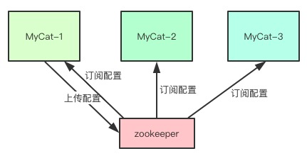
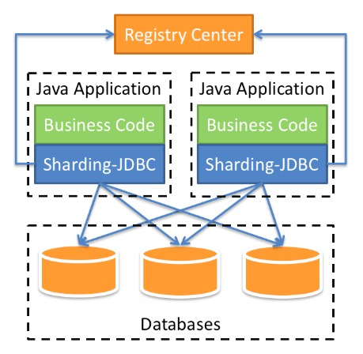

[TOC]

[目录](#)

- [1. 数据切分方案分析](#1-数据切分方案分析)
- [2. 垂直切分、水平切分方案分析](#2-垂直切分水平切分方案分析)
- [3. 整体分片方案的总结](#3-整体分片方案的总结)
- [4. 再看读写分离](#4-再看读写分离)
- [5. MyCat整体应用分析](#5-MyCat整体应用分析)
- [6. MyCat安装使用](#6-MyCat安装使用)
- [7. MyCat分片核心配置](#7-MyCat分片核心配置)
- [8. MyCat读写分离多主库配置切换](#8-MyCat读写分离多主库配置切换)
- [9. MyCat枚举分片规则](#9-MyCat枚举分片规则)
- [10. MyCat取模分片规则](#10-MyCat取模分片规则)
- [11. MyCat时间分片规则](#11-MyCat时间分片规则)
- [12. MyCat全局表配置](#12-MyCat全局表配置)
- [13. MyCat子表管理](#13-MyCat子表管理)
- [14. MyCat安全机制应用](#14-MyCat安全机制应用)
- [15. 通过zookeeper实现MyCat的HA配置](#15-通过zookeeper实现MyCat的HA配置)
- [16. 通过zookeeper实现MyCat的HA配置同步](#16-通过zookeeper实现MyCat的HA配置同步)
- [17. sharding-jdbc应用背景介绍](#17-sharding-jdbc应用背景介绍)
- [18. sharding-jdbc和springboot集成应用](#18-sharding-jdbc和springboot集成应用)
- [19. sharding-jdbc广播表配置使用](#19-sharding-jdbc广播表配置使用)
- [20. sharding-jdbc绑定表配置使用](#20-sharding-jdbc绑定表配置使用)
- [21. sharding-jdbc没有配置表但数据库有这个表](#21-sharding-jdbc没有配置表但数据库有这个表)
- [22. sharding-jdbc实现读写分离](#22-sharding-jdbc实现读写分离)


# 海量数据存3储与访问瓶颈解决方案:数据切分(分库分表)

## 1. 数据切分方案分析

对于数据库来讲，他永远是系统中最关键的核心环节和瓶颈

- 保护数据库：增加缓存（redis、ES）
- MySQL本身的分区表只是对磁盘进行了高效利用

水平扩展，多数据中心（各个数据中心，互相是一个备份节点）

如果数据库做到了分布式的架构？就需要有一个中间件，对数据进行二次加工合并

## 2. 垂直切分、水平切分方案分析

### 2.1. 垂直切分

通过业务分解将一个数据库中多个表，拆分成多台数据库

解耦：拆分

比如说：后端进行数据报表聚合的时候

各个功能模块之间的交互越统一、越少越好，这样耦合度就降低了

垂直切分后往往还会存在跨库的join访问现象，绝对不允许（业务A-数据库A直接访问业务B的数据库）需要通过接口访问业务B的数据库

优先：

- 业务拆分后规则清晰，业务明确
- 系统之间容易扩展和整合
- 数据维护简单

缺点：

- 部分业务无法join，只能通过接口调用实现，提升了系统的复制度
- 跨库的事务难以处理
- 垂直切分后，某些业务表依旧很大，仍然存在单体性能瓶颈

### 2.2. 水平切分

水平切分要比垂直切分复杂多了，水平拆分时一定要先制定拆分规则

典型的拆分规则：

- 通过id求模
- 按照时间进行拆分
- 其他字段的枚举或范围

优点：

- 解决了单表大数据，高并发的性能问题
- 如果拆分规则封装好，对于应用端几乎是透明的，开发人员无需关心拆分细节
- 提高了系统的稳定性和负载能力

缺点：

- 拆分规则很难抽象
- 分片的事务一致性难以解决
- 二次扩展时，数据迁移维护难度大

## 3. 整体分片方案的总结

无论是垂直还是水平分片都有共同的缺点

- 分布式事务问题
- 跨库的join问题
- 多数据源的管理

针对这些问题，思路有两种

1、客户端模式：在业务应用内，自己管理数据源，直接访问你需要的数据，自己在业务模块内做数据整合

2、中间代理模式：中间代理统一管理所有数据源，数据库层对开发人员完全透明，开发人员无需关注拆分细节，正常访问数据表即可

基于这两种模式，目前成熟的第三方软件中间件

- MyCat：中间代理模式
- sharding-jdbc：客户端模式

## 4. 再看读写分离

- 80%都是查询，slow_sql，20%是数据更新操作
- 对于数据库来讲，其实是数据备份在业务应用上的体现
- MySQL（同步、半同步、异步）在备份库做查询，就将这80%的查询压力引入到备份库上了
- 数据库要实现热切话需要双主结构，两个Master互为主从

## 5. MyCat整体应用分析

### 5.1. 什么是MyCat

MyCat是基于阿里开源产品Cobar用Java研发的数据库中间件，它其实就是一个开源的分布式数据库系统，它直接就可以使用MySQL的命令行访问，不是单纯的MySQL代理，它后端也支持oracle，MSSQL，DB2，无论后端接入什么数据库引擎，MyCat都是一个支持SQL的数据代理

### 5.2. 应用场景

- 支持单纯的读写分离配置，可以做到热切换
- 分库分表，对于超过1000w的数据表价值就体现出来了，最大支持1000亿数据
- 支持多租户

### 5.3. MyCat中的基本概念

- 逻辑库（Schema）

  比如user数据库，后面对接了两个MySQL，user_185，user_186

- 逻辑表（table）

  全局表？所有分片上都有这个表的数据，便于进行数据关联，不同进行跨库操作

- 分片节点（dataNode）

  具体要分配数据的节点

- 节点主机（dataHost）

  具体的物理数据库

- 分配规则（rule）

  以什么方式和规则来进行分片

- 全局序列号（sequence）

## 6. MyCat安装使用

实验环境：

两台centos 7.x主机，分别安装MySQL数据库v5.7

一台centos 7.x主机，安装MyCat服务

```shell
# 0.MyCat的主机要安装jdk
# 1.下载MyCat安装包
wget http://dl.mycat.io/1.6.7.3/20190828135747/Mycat-server-1.6.7.3-release-20190828135747-linux.tar.gz
tar -zxvf Mycat-server-1.6.7.3-release-20190828135747-linux.tar.gz
# 2.进入conf进行配置
vi server.xml
```

先配置用户

```xml
        <user name="root" defaultAccount="true">
                <property name="password">123456</property>
                <property name="schemas">user</property>
        </user>
```

设置dataHost连接数据库

vi schema.xml

```xml
        <dataHost name="DB185" maxCon="1000" minCon="10" balance="0"
                          writeType="0" dbType="mysql" dbDriver="native" switchType="1"  slaveThreshold="100">
                <heartbeat>select user()</heartbeat>
                <!-- can have multi write hosts -->
                <writeHost host="M1" url="192.168.0.185:3306" user="gavin"
                                   password="123456">
                        <!-- can have multi read hosts -->
                        <!-- <readHost host="hostS2" url="192.168.1.200:3306" user="root" password="xxx" /> -->
                </writeHost>
                <!-- <writeHost host="hostS1" url="localhost:3316" user="root"
                                   password="123456" /> -->
                <!-- <writeHost host="hostM2" url="localhost:3316" user="root" password="123456"/> -->
        </dataHost>
```

我们有两个dataHost，所以还需要再copy一个节点

```xml
        <dataHost name="DB186" maxCon="1000" minCon="10" balance="0"
                          writeType="0" dbType="mysql" dbDriver="native" switchType="1"  slaveThreshold="100">
                <heartbeat>select user()</heartbeat>
                <!-- can have multi write hosts -->
                <writeHost host="M2" url="192.168.0.186:3306" user="gavin"
                                   password="123456">
                        <!-- can have multi read hosts -->
                        <!-- <readHost host="hostS2" url="192.168.1.200:3306" user="root" password="xxx" /> -->
                </writeHost>
                <!-- <writeHost host="hostS1" url="localhost:3316" user="root"
                                   password="123456" /> -->
                <!-- <writeHost host="hostM2" url="localhost:3316" user="root" password="123456"/> -->
        </dataHost>
```

设置dataNode

database要和数据库里的名字一致

```xml
<dataNode name="dn185" dataHost="DB185" database="user_185" />
<dataNode name="dn186" dataHost="DB186" database="user_186" />
```

设置schema来进行数据库表的分片，表名要和数据库里的名字一致

```xml
<schema name="TESTDB" checkSQLschema="true" sqlMaxLimit="100">
  <!-- auto sharding by id (long) -->
  <table name="user_info" dataNode="dn185,dn186" rule="auto-sharding-long" />
</schema>
```

启动mycat

```shell
./bin/mycat console
# jvm 1    | Caused by: io.mycat.config.util.ConfigException: Illegal table conf : table [ USER_INFO ] rule function [ rang-long ] partition size : 3 > table datanode size : 2, please make sure table datanode size = function partition size
# 分片规则配置查找
rule="auto-sharding-long"
vi rule.xml
# 这个columns就是数据库分片的列
        <tableRule name="auto-sharding-long">
                <rule>
                        <columns>id</columns>
                        <algorithm>rang-long</algorithm>
                </rule>
        </tableRule>
# 通过rang-long分片方法找分片规则
        <function name="rang-long"
                class="io.mycat.route.function.AutoPartitionByLong">
                <property name="mapFile">autopartition-long.txt</property>
        </function>
vi autopartition-long.txt
# K=1000,M=10000.
0-500M=0
500M-1000M=1
#1000M-1500M=2
# 如果大于这个返回写不进去会报错
```

再次启动

```shell
# jvm 1    | Caused by: io.mycat.config.util.ConfigException: SelfCheck###  schema user refered by user root is not exist!
vi schema.xml
<schema name="user" checkSQLschema="true" sqlMaxLimit="100">
# Caused by: io.mycat.config.util.ConfigException: SelfCheck###  schema TESTDB refered by user user is not exist!
vi server.xml
        <user name="user">
                <property name="password">user</property>
                <property name="schemas">user</property>
                <property name="readOnly">true</property>
        </user>
```

再次启动就ok了

## 7. MyCat分片核心配置

### 7.1. server.xml的核心配置

- 配置了MyCat的用户名，密码，权限，schema
- 相当于给MySQL创建用户
- 如果有多个schema就以csv的形式写入

```xml
        <user name="root" defaultAccount="true">
                <property name="password">123456</property>
                <property name="schemas">user,product,order</property>
        </user>
```

多少个schema就要在schema.xml里配置多少个schema标签

```shell
# 可以直接用mysql客户端进行连接
mysql -uroot -p -P8066 -h192.168.0.184
```

### 7.2. schema.xml的核心配置

- 配置dataNode（包括写host和读host）
- 配置dataHost
- 配置schema进行表的分片规则指定

```shell
<dataHost name="DB186" maxCon="1000" minCon="10" balance="0" writeType="0" dbType="mysql" dbDriver="native" switchType="1"  slaveThreshold="100">
# name:随意命名，只要和dataNode对应即可
# maxCon:最大连接数
# minCon:最小连接数
# balance="0":不开启读写分离，所有的读都发送到writeHost上
# balance="1":开启读写分离，全部的readHost和stand by writeHost参与读操作，如果我们是双主双从的模式（M1->S1,M2->S2,并且M1和M2互为主备，实际在写入的时候M2时不写数据的，只是做备份）M2,S1,S2都会负责均衡读操作
# balance="2":开启读写分离，所有的读操作都随机落在writeHost、readHost上
# balance="3":开启读写分离，所有的读操作都随机落在readHost上
# writeType="0":所有写操作会发送到配置的第一个writeHost上，如果第一个挂了，第二个还活着，就直接写入第二个writeHost，第一个重启后虽然配置在上面但实际顺序会放在下面
# switchType="-1":表示不自动切换writeHost
# switchType="1":自动切换
# switchType="2":根据MySQL的主从同步状态决定是否切换

<dataNode name="dn185" dataHost="DB185" database="user_185" />
# name:随意命名，只要和schema里的table对应即可
# database:数据库里实际的名字

<schema name="user" checkSQLschema="true" sqlMaxLimit="100">
</schema>
# checkSQLschema="true":会将select * from user.user_info更换为select * from user_info
# sqlMaxLimit:为了避免让自己查询负担过重，会对查询结果进行自动加limit，只对分片表有效，如果你SQL自己设置了limit也会失效
<table name="user_info" dataNode="dn185,dn186" rule="auto-sharding-long" />
# 每个表都要写一个table的
# name:这个name就是表名，和dataHost对应的数据库里的表名要一模一样
# dataNode:表明要分片数据节点
# rule:就是分片规则对应rule.xml
```

### 7.3. 生产环境如何动态变更配置

生产环境肯定不能 ./mycat console

```shell
./bin/mycat start
```

mycat针对系统线上运行有一个管理端口，专门做线上配置更新的

```shell
reload @@config;
# 如果更新了数据源必须用config_all
reload @@config_all;
```


## 8. MyCat读写分离多主库配置切换

读写分离配置

```xml
        <dataHost name="HOST187" maxCon="1000" minCon="10" balance="1"
                          writeType="0" dbType="mysql" dbDriver="native" switchType="1"  slaveThreshold="100">
                <heartbeat>select user()</heartbeat>
                <!-- can have multi write hosts -->
                <writeHost host="M1" url="192.168.0.187:3306" user="gavin"
                                   password="123456">
                        <!-- can have multi read hosts -->
                        <readHost host="S1" url="192.168.0.186:3306" user="gavin" password="123456" />
                </writeHost>
                <writeHost host="M2" url="192.168.0.189:3306" user="gavin"
                                   password="123456" />
        </dataHost>
```

## 9. MyCat枚举分片规则

```shell
# 分片规则在rule.xml
# 修改schema里的分片规则
<schema name="user_db" checkSQLschema="true" sqlMaxLimit="100">
    <!-- auto sharding by id (long) -->
    <table name="user_info" dataNode="dn1,dn2" rule="sharding-by-intfile" />
</schema>
# rule.xml设置分片的数据列
        <tableRule name="sharding-by-intfile">
              <rule>
                    <columns>province_id</columns>
                    <algorithm>hash-int</algorithm>
              </rule>
        </tableRule>
        <function name="hash-int"
                class="io.mycat.route.function.PartitionByFileMap">
                <property name="mapFile">partition-hash-int.txt</property>
                <property name="defaultNode">0</property>
        </function>
# 修改partition-hash-int.txt配置枚举
10000=0
10001=0
10010=1
10011=1
如果枚举值不在范围内怎么办：
在function加上<property name="defaultNode">0</property>
# 0代表不在枚举范围内默认落到ds0节点,1代表不在枚举范围内默认落到ds1节点
```

## 10. MyCat取模分片规则

```shell
# 1.修改schema的table分片规则
<schema name="user_db" checkSQLschema="true" sqlMaxLimit="100">
    <!-- auto sharding by id (long) -->
    <table name="user_info" dataNode="dn1,dn2" rule="mod-long" />
</schema>
# 2.修改rule里的分片列
        <tableRule name="mod-long">
                <rule>
                        <columns>user_id</columns>
                        <algorithm>mod-long</algorithm>
                </rule>
        </tableRule>
# 3.修改取模节点数
        <function name="mod-long" class="io.mycat.route.function.PartitionByMod">
                <!-- how many data nodes -->
                <property name="count">2</property>
        </function>
```

## 11. MyCat时间分片规则

```shell
# schema里要添加表并设定时间分片规则
<schema name="user_db" checkSQLschema="true" sqlMaxLimit="100">
  <!-- auto sharding by id (long) -->
  <table name="user_info" dataNode="dn1,dn2" rule="mod-long" />
  <table name="login_info" dataNode="dn1,dn2" rule="my-sharding-by-date" />
</schema>
# rule.xml里自己设定的规则
<tableRule name="my-sharding-by-date"> 
	<rule>
		<columns>login_date</columns>
		<algorithm>sharding-by-date</algorithm>
	</rule>
</tableRule>

<function name="sharding-by-date" class="io.mycat.route.function.PartitionByDate">
	<property name="dateFormat">yyyy-MM-dd</property> 
	<property name="sBeginDate">2020-03-14</property>
	<property name="sEndDate">2020-03-15</property>
	<property name="sPartionDay">1</property> 
</function>
# columns :标识将要分片的表字段
# algorithm :分片函数
# dateFormat :日期格式
# sBeginDate :开始日期
# sEndDate:结束日期
# sPartionDay:分区天数，即默认从开始日期算起，分隔1天一个分区
# 如果配置了 sEndDate 则代表数据达到了这个日期的分片后后循环从开始分片插入
```

## 12. MyCat全局表配置

数据库里有很多表是做配置的，需要设置成全局表

```xml
# province_info 就是全局表
<schema name="user_db" checkSQLschema="true" sqlMaxLimit="100">
  <!-- auto sharding by id (long) -->
  <table name="user_info" dataNode="dn1,dn2" rule="mod-long" />
  <table name="login_info" dataNode="dn1,dn2" rule="my-sharding-by-date" />
  <table name="province_info" dataNode="dn1,dn2" type="global" />
</schema>
```

## 13. MyCat子表管理

我们的订单信息：保存的订单的整体信息，比如收货人地址和订单金额

订单详情又是另外一张表，如果order-A对应的order-itemA这两张表，不在一个节点上就会出现跨库

子表管理：通过MyCat自身的配置将子表和父表绑定在一起，子表的分片规则跟着父表走

```xml
<schema name="user_db" checkSQLschema="true" sqlMaxLimit="100">
  <!-- auto sharding by id (long) -->
    <table name="user_info" dataNode="dn1,dn2" rule="mod-long" />
    <table name="login_info" dataNode="dn1,dn2" rule="my-sharding-by-date" />
    <table name="province_info" dataNode="dn1,dn2" type="global" />
    <table name="order_info" dataNode="dn1,dn2" rule="auto-sharding-long">
      	<childTable name="order_item" joinKey="order_id" parentKey="id"/>
    </table>
</schema>
```

## 14. MyCat安全机制应用

**用户的登录权限**

```shell
# server.xml 进行用户访问设置的
        <user name="user">
                <property name="password">user</property>
                <property name="schemas">user_db</property>
                <property name="readOnly">true</property>
                <property name="benchmark">2</property>
        </user>
# benchmark:当连接达到这里设置的值，就拒绝这个用户连接，0或者不设置就表示不限制
```

**schema中表的操作权限**

```shell
        <user name="root" defaultAccount="true">
                <property name="password">123456</property>
                <property name="schemas">user_db,product_db</property>

                <privileges check="true">
                        <schema name="user_db" dml="0110" >
                                <table name="user_info" dml="0000"></table>
                                <table name="order_info" dml="1111"></table>
                        </schema>
                </privileges>
                <privileges check="true">
                        <schema name="product_db" dml="0110" >
                                <table name="product_info" dml="0000"></table>
                                <table name="catelog_info" dml="1111"></table>
                        </schema>
                </privileges>
        </user>
# dml的四位数分别代表
insert(0/1),update(0/1),select(0/1),delete(0/1)
```

**黑白名单设置**

MyCat可以通过设置白名单建立防火墙

```shell
# MyCat白名单可以通过*来指定IP通配符,使用通配符后就不验证用户了
<firewall>
  <whitehost>
    <host host="192.168.0.187" user="root"/>
    <host host="192.168.0.187" user="user"/>
    <host host="192.168.0.188" user="root"/>
  </whitehost>
</firewall>
```

MyCat通过黑名单设置数据表访问

```shell
<firewall>
	<blacklist check="true">
		<property name="deleteAllow">false</property>
	</blacklist>
</firewall>
```

黑白名单一起设置

```shell
<firewall>
  <whitehost>
    <host host="192.168.0.187" user="root"/>
    <host host="192.168.0.187" user="user"/>
    <host host="192.168.0.188" user="root"/>
  </whitehost>
  <blacklist check="true">
		<property name="deleteAllow">false</property>
	</blacklist>
</firewall>
```

## 15. 通过zookeeper实现MyCat的HA配置

MyCat就是一个数据库的中间代理层

MyCat能够实现多个writeHost热切换，只要你配置了双主的MySQL结构，就能实现两个写入节点的热切换

多个MyCat机器

如果是内网：keepalived(VIP)+HAProxy(x2)+MyCat*2(mysql -uroot -p都是通过TCP连接)

如果是阿里云：SLB（阿里云的负载均衡器）+MyCat*2

MyCat-A，MyCat-B（同时连接了dataHost1，dataHost2）

如果有多个MyCat镜像节点，那么配置就显得比较繁琐，同步过程比较麻烦，需要手工同步并进行reload

这个时候如果有个一个统一的配置中心可以只修改一个地方，就可以同步所有节点

这个时候就可以使用zookeeper，可以针对zookeeper开发一个MyCat的中心配置功能

zookeeper就是用来进行多台MyCat的配置同步的

## 16. 通过zookeeper实现MyCat的HA配置同步

通过MyCat的HA，多个MyCat实现高可用，我们的多台服务的配置就需要同步

配置同步就需要借助zookeeper，将mycat的配置文件同步到zookeeper上

```shell
# 0.安装好zookeeper
# 1.在mycat/conf目录下修改myid.properties
loadZk=true
zkURL=127.0.0.1:2181  # 如果是集群就以csv格式
clusterId=mycat-cluster-1
myid=mycat_fz_01
clusterSize=2
clusterNodes=mycat_fz_01,mycat_fz_02
#server  booster  ;   booster install on db same server,will reset all minCon to 2
type=server
boosterDataHosts=dataHost1

# 2.mycat在执行zookeeper配置上传时是在conf/zkconf下找配置上传到zookeeper
# 将server.xml,schema.xml,rule.xml,autopartition-long.txt复制进zkconf

# 3.将zkconf里的配置通过mycat提供的脚本上传到myid.properties指定的zookeeper地址中
mycat/bin/init_zk_data.sh
# -bash: ./init_zk_data.sh: /bin/bash^M: bad interpreter: No such file or directory
sed -i 's/\r$//' init_zk_data.sh # 将windows文件的回车和换行更换为linux
# 执行后看到done就说明上传成功
# 通过ZooInspector去看zookeeper的节点信息
ZooInspector下载路径
wget https://issues.apache.org/jira/secure/attachment/12436620/ZooInspector.zip
在build目录下执行
java -jar zookeeper-dev-ZooInspector.jar
启动后配置zookeeper的ip:port即可127.0.0.1:2181

# 4.Mycat启动cluster在zookeeper上同步配置需要至少3台机器，启动另两个节点
# 另外两个节点的配置只需要配置myid.properties
# 启动这两个节点将配置从zookeeper上拉下来后需要再重启一下加载配置以便正常访问

# 5.配置的过程
1.mycat各个节点会向zookeeper订阅节点的变化
2.如果节点变化了，就将变化的内容load下来更新conf中相关的配置
3.并对服务进行reload
```



如果我们自己使用zookeeper来进行配置的集中管理，如何设计

1.通过业务代码将需要管理的配置更改成json格式上传zookeeper

2.各个业务节点watch我们的zookeeper的znode，当znode发生变化我们的业务节点就会接收到变更通知

3.接收到变更后就可以触发业务了

## 17. sharding-jdbc应用背景介绍

- sharding-jdbc是一个分布式的关系数据库中间件

- sharding-jdbc已经进入apche孵化器http://shardingsphere.apache.org/

- 客户端代理模式，不需要搭建服务，只需要后端数据库搭建好就ok了

- 在应用程序端进行sharding-jdbc的设置就行

- 定位于一个轻量级java框架，以jar包提供服务的

- 可以理解为增强版的jdbc驱动

- 完全兼容主流的ORM框架

  

- sharding-jdbc提供4种配置

  - Java API
  - yaml
  - springboot的properties
  - spring的命名空间

- 与MyCat的区别

  - MyCat是服务端的代理，模拟了一个逻辑数据库
  - Sharding-jdbc是客户端的代理，整合jdbc成为了一个更强大的数据驱动
  - 实际开发中如何选择：如果公司有DBA或数据库运维人员，就使用MyCat，如果只有开发建议使用sharding-jdbc在程序端维护
  - MyCat不支持在一个库内进行水平切分，sharding-jdb支持在一个库内进行数据切分

- 名词解释

  - 逻辑表：相当于多个物理表的合并表
  - 真实表：实际存放数据的分片表
  - 数据节点：存储数据的MySQL节点
  - 绑定表：相当于MyCat的子表的概念
  - 广播表：相当于MyCat的全局表

## 18. sharding-jdbc和springboot集成应用

搭建数据结构

```sql
CREATE TABLE `order_info_1` (
  `id` int(11) NOT NULL,
  `order_amount` decimal(10,2) NOT NULL,
  `order_status` int(1) NOT NULL,
  `user_id` int(11) NOT NULL,
  PRIMARY KEY (`id`)
) ENGINE=InnoDB DEFAULT CHARSET=utf8mb4;
```

先导入POM依赖

```xml
<dependency>
  <groupId>org.apache.shardingsphere</groupId>
  <artifactId>sharding-jdbc-spring-boot-starter</artifactId>
  <version>4.0.0-RC2</version>
</dependency>
```

通通过application.properties配置数据源和分片规则

```properties
# 定义两个数据节点
spring.shardingsphere.datasource.names=ds0,ds1
# 对数据节点进行驱动设置
spring.shardingsphere.datasource.ds0.type=com.zaxxer.hikari.HikariDataSource
spring.shardingsphere.datasource.ds0.driver-class-name=com.mysql.jdbc.Driver
spring.shardingsphere.datasource.ds0.url=jdbc:mysql://39.99.182.22:3306/shard_order
spring.shardingsphere.datasource.ds0.username=gavin
spring.shardingsphere.datasource.ds0.password=123456

spring.shardingsphere.datasource.ds1.type=com.zaxxer.hikari.HikariDataSource
spring.shardingsphere.datasource.ds1.driver-class-name=com.mysql.jdbc.Driver
spring.shardingsphere.datasource.ds1.url=jdbc:mysql://39.100.33.54:3306/shard_order
spring.shardingsphere.datasource.ds1.username=gavin
spring.shardingsphere.datasource.ds1.password=123456
# 配置分库分表的规则，这里使用表达式进行数据切分
spring.shardingsphere.sharding.tables.order_info.actual-data-nodes=ds$->{0..1}.order_info_$->{1..2}
spring.shardingsphere.sharding.tables.order_info.database-strategy.inline.sharding-column=user_id
spring.shardingsphere.sharding.tables.order_info.database-strategy.inline.algorithm-expression=ds$->{user_id % 2}
spring.shardingsphere.sharding.tables.order_info.table-strategy.inline.sharding-column=id
spring.shardingsphere.sharding.tables.order_info.table-strategy.inline.algorithm-expression=order_info_$->{id % 2 + 1}
```

测试代码

```java
import org.junit.jupiter.api.Test;
import org.springframework.beans.factory.annotation.Autowired;
import org.springframework.boot.test.context.SpringBootTest;
import org.springframework.jdbc.core.JdbcTemplate;

@SpringBootTest
class ShardingjdbcProjectApplicationTests {

    @Autowired
    JdbcTemplate jdbcTemplate;

    @Test
    void contextLoads() {
        String sql = "insert into order_info(id,order_amount,order_status,user_id) values(2,188.66,1,2)";
        int i = jdbcTemplate.update(sql);
        System.out.println("*************执行完成，影响行数:"+i);

    }

}
//'shardingDataSource' threw exception; nested exception is java.lang.IllegalArgumentException: jdbcUrl is required with driverClassName.
```

这个错误修改

```properties
# 将这个配置
spring.shardingsphere.datasource.ds0.url=jdbc:mysql://39.99.182.22:3306/shard_order
# 改成下面的
spring.shardingsphere.datasource.ds0.jdbcUrl=jdbc:mysql://39.99.182.22:3306/shard_order
```

查询数据

```java
    @Test
    void queryTest(){
        String query = "select * from order_info";
        List<Map<String,Object>> result = jdbcTemplate.queryForList(query);
        for (Map<String,Object> val: result) {
            System.out.println("========="+val.get("id")+"---"+val.get("order_amount")+"---"+val.get("user_id"));

        }
    }
```

## 19. sharding-jdbc广播表配置使用

相当于是MyCat中的全局表，主要是应用于配置数据的表

先在两个数据库上创建广播表province_info

```sql
CREATE TABLE `province_info` (
  `id` int(11) NOT NULL,
  `name` varchar(255) NOT NULL,
  PRIMARY KEY (`id`)
) ENGINE=InnoDB DEFAULT CHARSET=utf8mb4;
```

在properties上增加配置

```shell
# 设置广播表，表名和数据库里的一致
spring.shardingsphere.sharding.broadcast-tables=province_info
```

测试代码

```java
    @Test
    void broadcastInsert(){
        String sql = "insert into province_info(id,name) values(1,'beijing')";
        int i = jdbcTemplate.update(sql);
        System.out.println("*************执行完成，影响行数:"+i);
    }

    @Test
    void queryBroadcast(){
        String query = "select * from province_info";
        List<Map<String,Object>> result = jdbcTemplate.queryForList(query);
        for (Map<String,Object> val: result) {
            System.out.println("========="+val.get("id")+"---"+val.get("name"));

        }
    }
```

## 20. sharding-jdbc绑定表配置使用

一个order_info的主表还需要关联order_item的子表，先在两个库上分别创建两个order_item的表

```sql
CREATE TABLE `order_item_1` (
  `id` int(11) NOT NULL,
  `product_name` varchar(255) NOT NULL,
  `user_id` int(11) NOT NULL,
  `order_id` int(11) NOT NULL,
  PRIMARY KEY (`id`)
) ENGINE=InnoDB DEFAULT CHARSET=utf8mb4;
```

配置properties增加order_item的配置

```properties
# 增加子表的分片规则，要让子表和父表在一个库一个表序列中，就需要增加父表的分库分表字段并按照父表的分库分表规则进行切分
spring.shardingsphere.sharding.tables.order_item.actual-data-nodes=ds$->{0..1}.order_item_$->{1..2}
spring.shardingsphere.sharding.tables.order_item.database-strategy.inline.sharding-column=user_id
spring.shardingsphere.sharding.tables.order_item.database-strategy.inline.algorithm-expression=ds$->{user_id % 2}
spring.shardingsphere.sharding.tables.order_item.table-strategy.inline.sharding-column=order_id
spring.shardingsphere.sharding.tables.order_item.table-strategy.inline.algorithm-expression=order_item_$->{order_id % 2 + 1}

# 绑定关系说明，让sharding-jdbc知道这两个是绑定表，加速关联查询
spring.shardingsphere.sharding.binding-tables=order_info,order_item
```

插入数据测试

```java
    @Test
    void orderItemInsert() {
        String sql = "insert into order_item(id,product_name,user_id,order_id) values(1,'java',2,2)";
        int i = jdbcTemplate.update(sql);
        System.out.println("*************执行完成，影响行数:"+i);

    }
```

## 21. sharding-jdbc没有配置表但数据库有这个表

```java
    @Test
    void queryGb(){
        String query = "select * from gb1";
        List<Map<String,Object>> result = jdbcTemplate.queryForList(query);
        for (Map<String,Object> val: result) {
            System.out.println("========="+val.get("id")+"---"+val.get("name"));

        }
    }
//gb1在两个数据库中都有同名表，但配置里没有进行配置，就会报错
java.lang.IllegalStateException: Missing the data source name: 'null'
```

分库分表是在你已经对数据库进行垂直拆分后才进行优化

你的业务模块已经服务化了，或者已经独立配置了，再对你的数据库单表进行分片规则应用

## 22. sharding-jdbc实现读写分离

主要是properties的配置

```properties
# 声明主机从机的标识
spring.shardingsphere.datasource.names=master0,master1,master0slave0,master1slave0
# 配置主机数据源
spring.shardingsphere.datasource.master0.type=com.zaxxer.hikari.HikariDataSource
spring.shardingsphere.datasource.master0.driver-class-name=com.mysql.jdbc.Driver
spring.shardingsphere.datasource.master0.jdbcUrl=jdbc:mysql://39.99.182.22:3306/shard_order
spring.shardingsphere.datasource.master0.username=gavin
spring.shardingsphere.datasource.master0.password=123456
# 配置从机数据源
spring.shardingsphere.datasource.master0slave0.type=com.zaxxer.hikari.HikariDataSource
spring.shardingsphere.datasource.master0slave0.driver-class-name=com.mysql.jdbc.Driver
spring.shardingsphere.datasource.master0slave0.jdbcUrl=jdbc:mysql://39.100.34.208:3306/shard_order
spring.shardingsphere.datasource.master0slave0.username=gavin
spring.shardingsphere.datasource.master0slave0.password=123456
# 配置主机数据源
spring.shardingsphere.datasource.master1.type=com.zaxxer.hikari.HikariDataSource
spring.shardingsphere.datasource.master1.driver-class-name=com.mysql.jdbc.Driver
spring.shardingsphere.datasource.master1.jdbcUrl=jdbc:mysql://39.100.33.54:3306/shard_order
spring.shardingsphere.datasource.master1.username=gavin
spring.shardingsphere.datasource.master1.password=123456
# 配置从机数据源
spring.shardingsphere.datasource.master1slave0.type=com.zaxxer.hikari.HikariDataSource
spring.shardingsphere.datasource.master1slave0.driver-class-name=com.mysql.jdbc.Driver
spring.shardingsphere.datasource.master1slave0.jdbcUrl=jdbc:mysql://47.92.3.35:3306/shard_order
spring.shardingsphere.datasource.master1slave0.username=gavin
spring.shardingsphere.datasource.master1slave0.password=123456
# 配置表分片规则，还是使用ds0,ds1来进行切分,ds是数据节点
spring.shardingsphere.sharding.tables.order_info.actual-data-nodes=ds$->{0..1}.order_info_$->{1..2}
spring.shardingsphere.sharding.tables.order_info.database-strategy.inline.sharding-column=user_id
spring.shardingsphere.sharding.tables.order_info.database-strategy.inline.algorithm-expression=ds$->{user_id % 2}
spring.shardingsphere.sharding.tables.order_info.table-strategy.inline.sharding-column=id
spring.shardingsphere.sharding.tables.order_info.table-strategy.inline.algorithm-expression=order_info_$->{id % 2 + 1}

# ds0对应的主从数据源管理
spring.shardingsphere.sharding.master-slave-rules.ds0.master-data-source-name=master0
spring.shardingsphere.sharding.master-slave-rules.ds0.slave-data-source-names=master0slave0
# 多个slave的负载方式：轮询方式
# spring.shardingsphere.sharding.master-slave-rules.ds0.load-balance-algorithm-type=round_robin

# ds1对应的主从数据源管理
spring.shardingsphere.sharding.master-slave-rules.ds1.master-data-source-name=master1
spring.shardingsphere.sharding.master-slave-rules.ds1.slave-data-source-names=master1slave0
# 多个slave的负载方式：随机方式
# spring.shardingsphere.sharding.master-slave-rules.ds1.load-balance-algorithm-type=random
```

