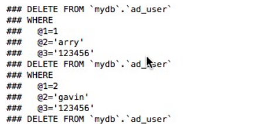
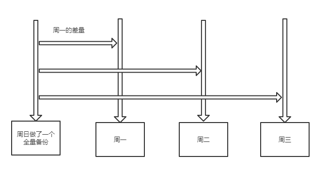
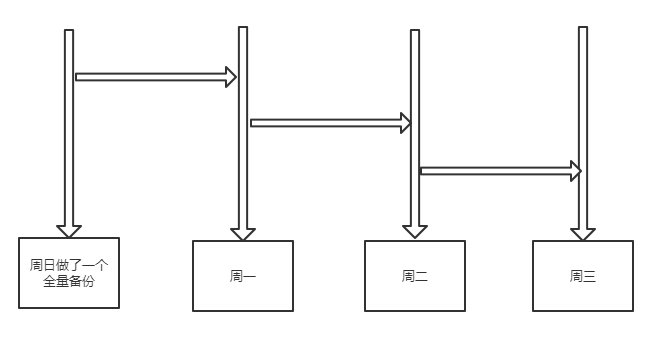
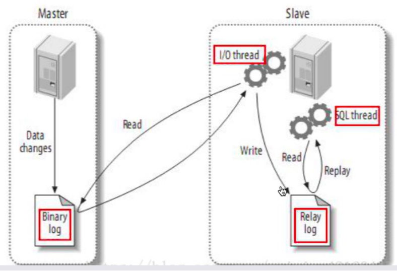
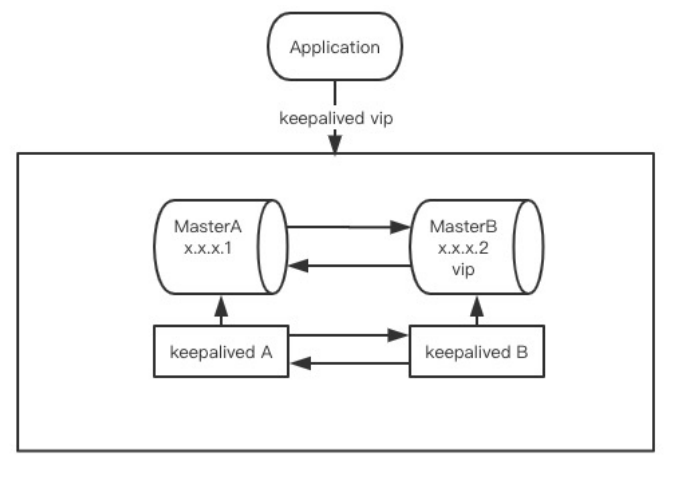
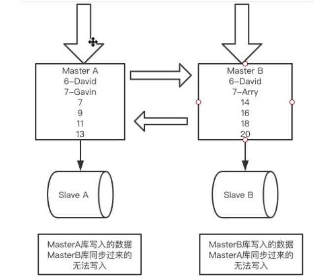

[TOC]

## 目录

- [1、MySQL安装](#1MySQL安装)
- [2、MySQL数据库介绍](#2MySQL数据库介绍)
- [3、MySQL日志设置](#3MySQL日志设置)
- [4、MySQL备份恢复](#4MySQL备份恢复)
  - [4.1. Binlog日志深入分析](#4.1-Binlog日志深入分析)
  - [4.2. 对备份的正确认识](#4.2-对备份的正确认识)
  - [4.3. 线上数据备份恢复策略实施](#4.3-线上数据备份恢复策略实施)
- [5、MySQL索引优化&数据库规范](#5MySQL索引优化&数据库规范)
  - [5.1. MySQL索引优化](#5.1-MySQL索引优化)
  - [5.2.  数据库设计规范](#5.2-数据库设计规范)
- [6、分区表应用](#6分区表应用)
  - [6.1. 什么是分区表](#6.1-什么是分区表)
  - [6.2. 为什么使用分区表](#6.2-为什么使用分区表)
  - [6.3. 分区表类型及使用](#6.3-分区表类型及使用)
  - [6.4. 应用场景](#6.4-应用场景)
- [7、MySQL 高可用HA实现](#7MySQL高可用HA实现)
  - [7.1. 什么是数据库高可用](#7.1-什么是数据库高可用)
    - [7.2.1. 配置主从服务(binlog⽇志点position方式)](#7.2.1-配置主从服务(binlog⽇志点position方式))
    - [7.2.2. 配置主从服务（ GTID的⽅式）](#7.2.2-配置主从服务(GTID的⽅式))
    - [7.2.3. 数据主从复制⽅式的容灾处理](#7.2.3-数据主从复制⽅式的容灾处理)
  - [7.2. MySQL数据库的高可用实现-主从](#7.2-MySQL数据库的高可用实现-主从)
  - [7.3. MySQL高可用集群双主复制模式(基于GTID)](#7.3-MySQL高可用集群双主复制模式(基于GTID))


# MySQL架构分析与实战


## 1、MySQL安装 ##

查询系统中已有的MySQL

```shell
rpm -qa|grep mysql
```

如果有卸载MySQL并删除相关文件（这里是基于默认安装的）

```shell
yum remove -y mysql mysql-libs mysql-common
rm -rf /var/lib/mysql
rm -rf /etc/my.cnf
```

安装v5.6 MySQL

```shell
wget http://dev.mysql.com/get/mysql-community-release-el6-5.noarch.rpm
rpm -ivh mysql-community-release-el6-5.noarch.rpm
yum install -y mysql-community-server

```

方式二：

```bash
#下载
wget https://dev.mysql.com/get/Downloads/MySQL-5.7/mysql-5.7.28-1.el7.x86_64.rpm-bundle.tar
wget http://mirrors.sohu.com/mysql/MySQL-5.7/mysql-5.7.28-el7-x86_64.tar.gz
#解压
tar -xvf mysql-5.7.28-1.el7.x86_64.rpm-bundle.tar
#安装前环境清理
rpm -qa | grep mariadb
rpm -qa | grep mysql
rpm -e --nodeps xxxx #卸载
#安装(依次执行)
rpm -ivh mysql-community-common-5.7.28-1.el7.x86_64.rpm
rpm -ivh mysql-community-libs-5.7.28-1.el7.x86_64.rpm
rpm -ivh mysql-community-client-5.7.28-1.el7.x86_64.rpm
rpm -ivh mysql-community-server-5.7.28-1.el7.x86_64.rpm #(一处)
#一处遇到error ：libaio
yum install libaio # 然后在执行一处


```


配置MySQL

```
vim /etc/my.cnf
```

启动MySQL

```shell
service mysqld start
```

启动二

```bash
#启动Mysql服务 : 
systemctl start mysqld
systemctl restart mysqld
#查看MySQL服务器的状态: 
systemctl status mysqld
#设置开机启动:
systemctl enable mysqld
# 生成随机密码   K8d8meeEcC:&
grep 'temporary password' /var/log/mysqld.log
#初始化默认密码
#https://blog.csdn.net/hello_world_qwp/article/details/79551789
#登录
mysql -u root -p 屏幕上的随机密码
ALTER USER 'root'@'localhost' IDENTIFIED BY 'SHSac@2018';
#允许root用户在任何地方进行远程登录，并具有所有库任何操作权限
GRANT ALL PRIVILEGES ON *.* TO 'root'@'%' IDENTIFIED BY 'SHSac@2018' WITH GRANT OPTION;
#刷新权限
FLUSH PRIVILEGES;
```


设置root密码

```shell
/usr/bin/mysqladmin -u root password '123456'
```

```mysql
# 显示库，选择使用库
show databases;
use xxdatabase;
```

## 2、MySQL数据库介绍 ##

**数据库应用**

- 不同的业务系统一定要独立授权用户

where条件解析顺序

- MySQL是从左向右执行where条件（查询优化器会去优化where条件，但效果不一定）
- Oracle是从右向左执行where条件

**SQL执行顺序**

FROM

ON

JOIN

WHERE

GROUP BY

HAVING

SELECT columns

DISTINCT

ORDER BY

LIMIT

**全文索引**

- 只有在MyISAM引擎上才能使用
- CHAR、VARCHAR、TEXT字段才能使用


**SQL的执行过程**

客户端

连接器：管理连接、做权限验证 username、password

查询缓存：key-value 如果有就直接返回，全SQL匹配

- preparestatement：args string
- statement：string
- 如果数据表发生结构变化及数据内容变化，MySQL会立即清空对应表缓存
- MySQL 8.0 直接删除了，彻底没了
- 会在结构返回前做一次权限验证

分析器

- 词法分析：错别字
- 语法分析：语法结构
- Preparestatement、#{}

优化器：执行计划生产，索引选择

执行器：操作引擎

- 如果你对这个表没有权限，就会返回错误 grant
- 从数据引擎里取数据

**MySQL**

- MyISAM：查询和插入的高速引擎，但不支持事务
- InnoDB：v5.5 支持事务支持行锁
- ISAM：5.0以后就不装了
- Memory：内存引擎，速度快，但掉电丢失数据
- Falcon：InnoDB的替代方向
- Archive：归档引擎，只支持写入和查询，适合大数据量，将数据压缩后存储
- CSV

```mysql
show engines;
show tables;
show table status like '%user_role%' \G;
```

**MySQL存储的物理结构**

- MySQL是通过文件系统对数据和索引进行存储的
- MySQL从物理结构上可以分为日志文件和数据索引文件
- MySQL在linux下默认安装文件路径 /var/lib/mysql


## 3、MySQL日志设置 ##

**日志文件**

MySQL通过日志记录数据库的操作和错误信息，常用到的日志：错误日志、查询日志、慢查询日志、二进制日志Binlog

```sql
show variables like '%log%';
```

**错误日志**

默认是开启的

```sql
log_error=/var/log/mysqld.log
log_warnings=1
```

log_warnings：是否开启警告信息一并写入错误日志 否-0|是-1

log_warnings>1 : 将失败的连接，拒绝访问相关信息也记录到错误日志中

**查询日志**

- 在mysql中被称为general log
- 会记录所有操作，无论对错
- 存放方式有三种
  - 日志   general_log_file    /var/lib/mysql/MySQL.log 
  - 将查询日志存入mysql.general_log表中
  - 同时存放

- 三种方式的配置项
  - log_output  FILE|TABLE|FILE,TABLE

```sql
general_log=ON
log_output=FILE
```

**慢查询日志**

```mysql
show variables like '%slow%';
# 默认是关闭的
slow_query_log=OFF 
# 日志文件位置(本机默认)
slow_query_log_file= /var/lib/mysql/scdzyc-slow.log
# 记录条件-时间 (5.7默认2)
slow_launch_time=2
```


目录授权

```sql
chown -R mysql:mysql /usr/local/slowfile/
```

mysqldumpslow使用

- -s排序规则，降序，-t 2显示结果前两行
- c ：执行次数
- l ： 锁定时间
- r ： 返回记录
- t ：执行时间
- al、ar、at

**percona-toolkit使用**

可以直接对日志进行时间的区间查询

**Binlog二进制日志**

默认是关闭的，需要通过配置进行开启

```sql
log_bin=mysql-bin
```


## 4、MySQL备份恢复

###  4.1. Binlog日志深入分析

#### 4.1.1. Binlog参数配置 ####

```shell
#mysql-bin是basename，mysql-bin-000001.log
log_bin=mysql-bin
binlog_format=statement|row

#查看binlog 日志文件大小
show variables like '%binlog_size%'; #如果⼀个事务超过binlon⼤⼩不会写⼊下⼀个

#每个binlog⽇志⽂件⼤⼩
max_binlog_size=1024m 
#binlog的过期时间
expire_logs_days=7 
#DML操作不频繁 <=1m, DML频繁且事务⼤ 2-4m
binlog_cache_size=32768 
#32位4G，64位16P
max_binlog_cache_size=xxxx #32位4G，64位16P

```

Binlogํ有三种记录模式：

- statement：SBR：delete from mytable 、update（基于⼀个简单的回放）
  - create table 
  - insert 
  - update 
  - delete 
  - insert update table set a=1

statement⾥⾯⾯只有操作语句是⾮注释的，其他的说明都是#注释的

如果是mysqldump 1、找到这个表最初的记录表结构，和当时的数据，把这个数据insert全部拿出来 2、insert into，备份的时间点和出事的那个阶段咋办？

- row：RBR：update、delete=10，展示出10条更改前和更改后的语句

这个时候使⽤show binlog来查看已经看不到语句

```sql
show binlog events in 'mysql-bin.000003'; --#?是否还有⽤
-- 导出查看
mysqlbinlog --base64-output=decode-rows -v mysql-bin.000003
```


```sql
mysqlbinlog --base64-output=decode-rows -vv mysql-bin.000003 #增加数据类型了
```



- mixed：MBR：90%都是statement的模式

  > 90%的语句都是以statement模式进⾏的

**MySQ-Binlog操作命令**

```mysql
#查看mysql binlog
mysql>  show binlog events in 'mysql-bin.000001';
# 格式
mysql>  show binlog events [IN 'log_name'][FROM pos][LIMIT [offset,]
row_count];

 #⽣成⼀个新binlog
mysql> flush logs;
 #查看系统binlog数 1
mysql> show binary logs;
```


####  4.1.2. Binlog⽇志的正确打开⽅式

```sql
show binlog events in 'mysql-bin.000002'
 
show binlog events [IN 'log_name'][FROM pos][LIMIT [offset,row_count];

mysqlbinlog --no-defaults --database=mydb --base64-output=decode-rows -v --
start-position=123 --stop-position=456 mysql-bin.000002

mysqlbinlog --no-defaults --database=mydb --base64-output=decode-rows -v --
start-datetime='2019-12-11 16:30:00' --stop-datetime='2019-12-11 16:31:00'
mysql-bin.000003

```

###  4.2. 对备份的正确认识

- 全量备份：对应时间的数据是全量的⼀个备份 
- 差异备份：周⽇做了⼀次



- 增量备份



- 时间点恢复

  上⾯三个备份节点都是⼀个定时的数据补偿，在定时备份完成后⾄任意备份时间节点前，这段时间出现 问题需要Binlog能做的事情了


- 热备

  数据库的读写操作均可正常进⾏，是要通过备份⼯具，myisam引擎不⽀持热备，innoDB⽀持热备

- 温备

  数据库只能进⾏读操作，不能进⾏写操作

- 冷备

  要让数据库停机

- 物理备份

  直接copy数据⽂件

- 逻辑备份

  将数据库⾥的数据导出进⾏备份的⽅式就是逻辑备份


####  4.2.1. MySQL常⽤的备份⼯具

- mysqldump 
  - mysql⾃带的备份⼯具，是逻辑备份 
  - innodb可以使⽤mysqldump进⾏热备 
  - myisam可以使⽤mysqldump进⾏温备 
  - 如果数据量较⼩可以使⽤
- xtrabackup
  - Percona提供
  -  是⼀种物理备份⼯具 
  - ⽀持完全备份，差异备份，增量备份
- select语句直接备份
  - select * from a into outfile '/usr/local/a.bak'
- cp 命令
  - 只能进⾏冷备

####  4.2.2. 数据⼀致性的理解

- 数据⼀致性 

  热备：数据库还依旧可以读写 

  4:00 进⾏定时备份，假设你的数据⾮常多，需要备份10-20分钟 ⼩刘账户余额在4点有200元，4点10分的时候，他转出了50元 假如在4点10分前还没有备份到余额表，4点11分开始备份余额表 

- 在备份场景下如何保证数据⼀致性 
  - 第⼀种⽅式，在备份的时候给所有表加锁，只能读不能写 
    - 如果锁表的时候可以把写⼊的数据先放⼊MQ或缓存，待备份完成补偿进数据库，还有 就是要考虑及时读的问题 
  - 第⼆种⽅式：在备份开始的时候就对数据库的所有数据进⾏⼀个“快照”，快照记录了开始备份 的那⼀刻的数据状态


####  4.2.3. 使⽤mysqldump备份

- 缺点：当数据位浮点型，会出现精度丢失
- 如果要进⾏并⾏备份可以使⽤mydumper/myloader

```shell
mysqldump -uroot -p123456 --databases mydb > mydb.sql #导出带数据库的备份脚本
mysqldump -uroot -p123456 --databases mydb ad_user > mydb.sql #导出数据库指定表
mysqldump -uroot -p123456 --all-databases > mydb.sql #导出所有数据库
mysqldump -uroot -p123456 -d mydb > mydb.sql #导出数据库的所有表结构
mysqldump -uroot -p123456 -d mydb ad_user > mydb.sql #导出数据库的某个表结构
```

- --master-data

  某个时间全量备份：每天晚上4点-中间12点数据挂了-明天晚上4点之间这段时间就需要时间点恢复 前天晚上4点全量+4点-12点的binlog（如果知道4点备份的那个position） 能够在我们导出数据的时候在我们的脚本⾥带上全量结束的position --master-data=0|1|2 

  1：如果主库被删除了，从库也会被删除，拿着备份⽂件去从库告知从库执⾏完从什么位置开始同 步 

  2：只记录备份的position，可以⽤这个位置快速导出binlog的语句

- --flush-logs

  在备份的那个时点新建⼀个binlog

- 其他常⽤选项

  - --routines ：存储过程 
  - --triggers ： 触发器 
  - --events ： 事件


#### 4.2.4.  不同存储引擎下如何进⾏备份

- innodb

  热备：需要在mysqldump⾥加⼊⼀个参数：--single-transaction 会基于备份⽣成⼀个独⽴的事务，专⻔进⾏对应时点快照数据处理的

  ```shell
  mysqldump -uroot -p123456 --master-data=2 --single-transaction --routines -
  -triggers --events --databases mydb > mydb.sql
  ```

-  myisam

  温备：因为这个引擎不能⽀持事务，要保证数据⼀致性要锁表：--lock-tables

  ```shell
  mysqldump -uroot -p123456 --master-data=2 --lock-tables --routines --
  triggers --events --databases mydb > mydb.sql
  
  # --lock-all-tables # 锁表
  #--all-databases # 配置导出所有数据库 
  ```


### 4.3. 线上数据备份恢复策略实施

####  4.3.1 备份流程的设计

- 备份⼯具 
- 备份⽅式 

1、考虑数据量：做备份⼯具的选型 

- 数据量较⼩的情况下：mysqldump逻辑备份，导出的是SQL 
- 如果我们数据量⾮常⼤：xtrabackup 

2、考虑我们的时间点补偿 

- 从上⼀个全量备份时点到现在这个阶段的数据 
- Binlog：statement，row，mixed 

3、做我们的备份⽅案 

- 全量备份 crontab -e （cron语法）定时执⾏备份脚本，时间选择在业务量⼩的时点（记录我们的 备份的position） 
- 增量：binlog（statement和mixed模式，我们的SQL都是线性且可执⾏的） 
- statement和mixed的增量适⽤于正常情况下数据库⽆法打开使⽤或数据⽂件损坏 
- row特别适合单表数据异常恢复 
- ⼀定要确保线上不会出现直接执⾏的SQL

#### 4.3.2. 数据恢复流程

案例1：statement，mixed 

student（id,score）：4点100⾏数据，第⼆天8点的时候更新⼀条score，所有⼈score全变成90 

- mysqldump：可以去到⽂件⾥找到student表把insert全部拿出来 
- xtrabackup：先要恢复到⼀个新数据库 
- 把4-8点间所有涉及这个student表的DML除select外，还最后我出错的这个SQL外，所有SQL全部 拿出来 
- 按照这个顺序：4点student所有数据执⾏->执⾏Binlog⾥的SQL 

案例2：row 

- 找到position，通过mysqlbinlog导出变更的数据，只能⽤代码去调整他的记录变更为恢复的SQL 
- 如果数据库不可⽤需要恢复 
  - ⽂件转移到新数据库：物理备份 
  - 如果数据⽂件⽆法启动 
  - mysqldump全量+row模式下的增量（调整起来就⾮常费劲） 

**在备份的基础上，如果条件允许⼀定要做主从HA** 

- 主机：row 
- 从机：statement

#### 4.3.3.  statement模式下数据恢复


##  5、MySQL索引优化&数据库规范

### 5.1. MySQL索引优化

- SQL及索引：⾼质量的SQL，避免索引失效 
- 数据库表结构：范式，⾄少要符合3NF 
- 系统配置MySQL，Linux 
- 硬件

#### 5.1.1  Explain执⾏计划分析

explain的⽤法

```sql
explain select * from employee where age=40 and name='张⻜'
```

explain的作⽤:

- 查看表的读取顺序 
- 读取操作类型 
- 哪些索引可⽤ 
- 表之间关联 
- 每张表有哪些索引被优化器执⾏

type

- system 
- const 
- eq_ref 
- ref 
- range 
- index 
- ALL

> 查询的效果从上到下越来越差


#### 5.1.2. 索引命中策略分析

- 最左匹配原则 
- 在索引字段上加⼊函数：不⾛索引 
- is null/is not null：不⾛索引 
- 覆盖索引：key-value都在索引⾥，如果select columns直接使⽤的是索引列就直接使⽤覆盖索引 
- 只要索引条件和or挨着：就⽤不上
-  `!= / <>`  能否能应⽤索引，不能

#### 5.1.3.  索引分析总结

**优势：** 

1、提⾼查询速度 

2、表连接的时候，加速连接 

3、保证数据唯⼀：唯⼀索引 

**劣势:**

1、修改和增加数据时会提升开销 

2、索引还会占⽤物理空间 

3、在进⾏⼤量的insert或update、delete时，速度会变慢 

**适合建⽴索引** 

1、数据差异化较⼤ 

2、频繁查询的列，where条件⾥经常⽤到的 

3、常⽤的表关联字段 

4、查询中统计或分组的字段 

**不适合的** 

1、记录值特别少 

2、值变化特别⼩，重复率⾼ 

3、经常增删改的表

#### 5.1.4.  数据库出现问题后如何死⽽不僵

```sql
 show processlist;
 kill pid;
```


### 5.2. 数据库设计规范

做架构到底是在做什么？ 

**抽象能⼒** 

抽象-->具象

- 逻辑设计
  - 1、具体内容：设计数据库的⼀个逻辑结构，与具体的DBMS⽆关，主要反映业务逻辑
  - 2、设计步骤：⽤关系模型 
  - 3、使⽤⼯具来模型化：E-R图 
    - 矩形：实体对象 1:m，n:m，1:1 
    - 椭圆：属性
    -  线：关系的连接 
    - 菱形：关系 
  - 4、实体关系模型 通过表格实现：字段名，类型，⻓度，约束 实体的实例化和泛化 
  - 5、⾄少满⾜3NF

- 物理设计
  - 对具体数据库进⾏选型：oracle，mysql 
  - 表的字段及存储结构

#### 5.2.1. 数据库命名规范

- 所有数据库对象名称：⼩写加下花线分割 
  - MySQL对象名称在默认情况下是⼤⼩写敏感 
  - MySQL的对像其实都是⼀个⽂件，⽽linux⽂件名是⼤⼩写敏感 
  - Dbname / dbname，MyTable / mytable 
  - 开发⾮常麻烦
-  所有MySQL数据库对象名称禁⽌使⽤MySQL保留关键字 
  - ⼀定要提前准备⼀份对应版本的关键字表 
  - 建表的时候没问题，但SQL查询就挂了  
- 所有的数据库对象名称：⻅名知义，但最⻓不要超过32个字符（不要中英⽂混合） 
- 所有临时表命名：tmp_tablename_20191215 
- 所有的备份表：bak_tablename_20191215 
- 索引：idx_ pk_ 
- 所有存储类型相同的列名以及⻓度必须保持⼀致 
  - order：product_title 50 
  - erp_instock: product_title 50

#### 5.2.2. 数据库设计规范

- 正常情况下建议使⽤innoDB，v5.6版本后默认都是innoDB 
- 字符集 
  - UTF-8 
  - 统⼀字符集避免乱码 
  - UTF-8的字符集是⼀个汉字3个字节：varchar(255) UTF-8 255*3=765字节 
- 加⼊注释 
- 控制单表的数据量⼤⼩：⾏ 
  - 对于⽇志数据，进⾏归档 
  - 对于业务数据进⾏分库分表 
- 分区表谨慎使⽤ 
- 控制表宽度 
  - 虽然表没有⾏限制，但列最多4096 
  - 如果列多了，占⽤内存和I/O会⾮常⼤ 
- 禁⽌在表中建⽴预留字段：varchar_column，order_second_no，remark，memo 
  - varchar类型 
  - 违背上⾯的命名规则 
  - 时间久了，不看业务代码，完全是魔⻤字段 
- 禁⽌在数据库⾥存放图⽚、⽂件、⼆进制⽂件 
  - 如果要⽤blob、Text存⼤⽂件，select colums.... 
  - 如何避免select * ，外键表单独放单⽂件 
- 禁⽌对线上环境进⾏压⼒测试 
  - 会产⽣⼤量的垃圾数据和⽇志⽂件 
- 禁⽌从开发环境、测试环境连接⽣产数据库

#### 5.2.3.  数据库索引设计规范

- 单张表索引数量建议不超过5个，如果列多可以适当增加 
  - 索引过多：SQL在进⾏优化器评估的时候会有更⼤的开销 
  - 绝对不允许给表的每⼀列都建⽴索引 
- 每个innodb表都必须有⼀个主键，innoDB表就是⼀个索引组织表
  - 表数据的实际存储顺序只能有⼀种，innoDB是按照主键进⾏存放的 
  - 如果没有主键，mysql会优先选择第⼀个⾮空唯⼀索引来做主键 
  - 如果上⾯这个没有，mysql会⾃动⽣成⼀个36个字节的主键，但性能不好 
  - 不能使⽤更新频繁的列和联合索引做主键，主键不断变，数据的存放顺序就会不断变化 
  - 不要使⽤UUID、MD5、HASH等做主键，不能保证这些值是按顺序增⻓的。如果⽣成较⼩的 字符串就会导致不断变化数据存储的位置，影响I/O性能
- 要在哪些列上建⽴索引：没有最好只有最适合
  - explain 
  - where后 
  - join的连接列
  -  筛选项最⼤的放在索引做左侧
- 避免建⽴冗余和重复索引 
- 对于频繁查询的数据列，优先考虑使⽤覆盖索引 
- 尽量避免加⼊外键约束 
  - 因为外键写⼊的时候会降低存储效率 
  - 但要给这些关联字段加索引

#### 5.2.4. 数据库字段设计规范

- 优先选择符合存储需要的最⼩数据类型 

  - INT来存放时间戳 
  - varchar(255) '⻓袖衬衫' 

- 避免使⽤TEXT，BLOB数据类型 

  - 如果⾮要使⽤可以单独拉出来做关联表 
  - 这两个类型上没有默认值 

- 避免使⽤ENUM数据类型 

  - 修改则需要使⽤ALTER语句 

- 尽可能把所有列定义为NOT NULL 

  - 如果为NULL，索引需要额外的空间来保存 

- ⽇期格式尽量不要⽤字符串保存 

  - 不能⽤⽇期函数进⾏计算和⽐较 
  - ⽤字符串占⽤的空间更多 

  1970-01-01 00:00:00-2038-01-19 03:14:07 

  int来保存：4294967295 

- 财务相关的数据⽤Decimal类型来进⾏计算

#### 5.2.5. 数据库SQL开发规范

- 在程序中使⽤PrepareStatement，#{} 
  - 降低词法和语法分析器的重复执⾏
  - 防⽌SQL注⼊ 
- 合理和充分的利⽤表上的索引 
  - 避免前后%
  - 使⽤left join或not exists来优化not in（not in⽆法使⽤索引）
- 程序连接不同数据库使⽤不同的账号，禁⽌跨库操作 
  - 应⽤A---B 应⽤D---C：跨库访问最好调⽤业务层 
  - 如果账号被注⼊，也只注⼊⼀个库 
- 禁⽌使⽤select *（但是依旧这么做） 
- 禁⽌使⽤不含列名的insert into tableName values('','',''); 
- 避免使⽤⼦查询，可以把⼦查询优化为join操作 ⼦
  - 查询的结果集⽆法使⽤索引 
  - ⼦查询会产⽣临时表操作，如果查询量⼤则会严重影响效率 
- 避免使⽤join关联太多表 
  - ⼤查询拆⼩查询，由我们的程序来去做关联和合并 
  - 进⾏表数据冗余 
  - 有⼀定的转换 
- 减少同数据库的交互次数 
- 使⽤in代替or，in能⽤索引，or⽤不上 
- 禁⽌⽤order by rand() 
- where中不要对列进⾏函数计数：列⽆法使⽤索引了 
- UNION ALL和UNION 
  - 如果我们的数据明显不重复，就使⽤UNION ALL 

程序=数据结构+算法

#### 5.2.6.  数据库操作⾏为规范

- ⼤批量的数据操作会严重造成数据延迟
  -  数据分批执⾏ 
  - v5.7 format_binlog：row 
- 对⼤表结构的操作会导致锁表 
  - 对于⼤表的操作：pt-online-schema-change （PERCONA） 
  - 原理 
    - 创建新表结构 
    - 复制旧表数据到新表 
    - 在原表上加⼊触发器确保数据同步 
    - 所有操作进⾏完毕后对原表进⼊⼀个很短的时间锁 
    - 把原表名进⾏修改，再改新表名 
    - 删除原表名 
    - 原⼦性操作分割进⾏了 
- 禁⽌对普通⽤户授予super权限 
- 对于程序遵循最⼩权限原则


## 6、分区表应用 ##


### 6.1. 什么是分区表 ###

正常的表存放方式

```shell
customer_login_log.frm #保存了每个表的元数据，包括表结构以及相应的定义，⽆论是什么数据引擎都有这个⽂件
customer_login_log.ibd #innodb的存放数据⽂件和索引的地⽅

customer_login_log.MYD # myisam表
customer_login_log.MYI # myisam表
```

分区表：customer_login_log.ibd 这个文件会有多个

- 在MySQL v5.1版本后就开始⽀持分区表功能

  ```sql
  show variables like '%partition%';
  ```

- MySQL v5.6（含）版本后使⽤这个命令，看系统是否⽀持分区

  ```sql
  show plugins;
  ```

### 6.2. 为什么使用分区表

- 经常遇到上千万甚⾄上亿的记录表数据 
- 查询困难，⽽且历史数据其实是不太关⼼的
- 要进⾏归档了？如何归档？
  - ⼀年前的数据通过where < 20190101 00:00:00 查出来insert进arch，bak
  - mysqldump 是可以加where条件
  - 原表的历史数据要删除？delete table where time? 删除不要的 
    - 我们3年的数据，只留近半年的：零晨4点你delete 
      - innodb数据是由b+树组织的，如果delete where只会标记改数据被删除，不会真 正删除，将来插⼊数据的时候空间可复⽤，磁盘⽂件⼤⼩不会缩⼩ 
      - mysql > OPTIMIZE table my_table_name; 
    - 把要的数据导出，创建新表，不要的数据备份，旧表drop
- 如果我们有这样⼀种⽂件组织形式：2017年的数据放⼀个⽂件，2018年的数据放⼀个⽂件， 2019，这个时候就可以按照⽂件进⾏删除了，并且可以指定数据⽂件查询范围，就会提升查询效 率

### 6.3. 分区表类型及使用

**分区表类型**

- HASH分区 
- LIST分区 
- RANGE分区 
- KEY分区

**HASH分区** 

- 根据MOD(分区键)的值把数据存储到表的不同分区中 

- 基本可以平均分布于各个分区 

- HASH分区的键值必须是INT类型，可以通过函数转为INT类型

  ```mysql
  CREATE TABLE `customer_login_log` (
   `customer_id` int(10) unsigned NOT NULL COMMENT '登录⽤户ID',
   `login_time` datetime NOT NULL COMMENT '⽤户登录时间',
   `login_ip` int(10) unsigned NOT NULL COMMENT '登录IP',
   `login_type` tinyint(4) NOT NULL COMMENT '登录类型:0未成功 1成功'
  ) ENGINE=InnoDB DEFAULT CHARSET=utf8
  PARTITION BY HASH(customer_id) PARTITIONS 4;
  ```

  使用函数进行INT输出

  ```mysql
  CREATE TABLE `customer_login_log` (
   `customer_id` int(10) unsigned NOT NULL COMMENT '登录⽤户ID',
   `login_time` timestamp NOT NULL COMMENT '⽤户登录时间', #注意这⾥的数据类型
   `login_ip` int(10) unsigned NOT NULL COMMENT '登录IP',
   `login_type` tinyint(4) NOT NULL COMMENT '登录类型:0未成功 1成功'
  ) ENGINE=InnoDB DEFAULT CHARSET=utf8
  PARTITION BY HASH(UNIX_TIMESTAMP(login_time)) PARTITIONS 4;
  ```

**LIST分区**

- 按照分区键取值的列表进⾏分区 

- 各分区的列表值不能重复 

- 每⼀⾏数据必须能找到对应的分区列表，否则插⼊失败

  ```mysql
  CREATE TABLE `customer_login_log` (
   `customer_id` int(10) unsigned NOT NULL COMMENT '登录⽤户ID',
   `login_time` datetime NOT NULL COMMENT '⽤户登录时间',
   `login_ip` int(10) unsigned NOT NULL COMMENT '登录IP',
   `login_type` tinyint(4) NOT NULL COMMENT '登录类型:0未成功 1成功'
  ) ENGINE=InnoDB DEFAULT CHARSET=utf8
  PARTITION BY LIST(login_type)(
   PARTITION p0 VALUES in (1,3,5,7,9),
   PARTITION p1 VALUES in (2,4,6,8)
  );
  ```

**RANG范围分区**

- 根据分区键值保存到不同表中 

- 多个分区要连续，不能重叠 

- 要完全封⼝则需要使⽤MAXVALUE

  ```mysql
  CREATE TABLE `customer_login_log` (
   `customer_id` int(10) unsigned NOT NULL COMMENT '登录⽤户ID',
   `login_time` datetime NOT NULL COMMENT '⽤户登录时间',
   `login_ip` int(10) unsigned NOT NULL COMMENT '登录IP',
   `login_type` tinyint(4) NOT NULL COMMENT '登录类型:0未成功 1成功'
  ) ENGINE=InnoDB DEFAULT CHARSET=utf8
  PARTITION BY RANGE(YEAR(login_time))(
   PARTITION p0 VALUES LESS THAN (2017),
   PARTITION p1 VALUES LESS THAN (2018),
   PARTITION p2 VALUES LESS THAN (2019),
   PARTITION p3 VALUES LESS THAN (2020),
   PARTITION p4 VALUES LESS THAN MAXVALUE
  );
  ```

  

**转换函数**

```mysql
ABS()
CEILING() (see CEILING() and FLOOR())
DAY()
DAYOFMONTH()
DAYOFWEEK()
DAYOFYEAR()
DATEDIFF()
EXTRACT() (see EXTRACT() function with WEEK specifier)
FLOOR() (seeCEILING() and FLOOR())
HOUR()
MICROSECOND()
MINUTE()
MOD()
MONTH()
QUARTER()
SECOND()
TIME_TO_SEC()
TO_DAYS()
TO_SECONDS()
UNIX_TIMESTAMP() (permitted beginning with MySQL 5.6.1 and fully supported
beginning with MySQL 5.6.3, with TIMESTAMP columns)
WEEKDAY()
YEAR()
YEARWEEK()
```


#### 6.3.1 分区表操作命令 ####

```mysql
#查看是否支持分区
mysql> show variables like '%partition%'; 	#v5.1-
mysql> show plugins;						#v5.6-

# 查看表是否创建成功
mysql> explain partitions select * from customer_login_log;

# 查看分区表存放数据量
mysql> select table_name,partition_name,partition_description,table_rows from information_schema.`PARTITIONS` where table_name='customer_login_log';

#查看某个分区数据
mysql> select * from customer_login_log partition(p1);
mysql> select * from customer_login_log partition(p1) where login_type=5;


#=========================================================================
#添加分区
ALTER TABLE customer_login_log ADD PARTITION(PARTITION p4 VALUES LESS THAN(2021))

#！ 如果一个表不是分区表现在想变成分区表
# >数据量不大可以使用这种方式
ALTER TABLE customer_login_log PARTITION BY RANGE(YEAR(login_time))(
 PARTITION p0 VALUES LESS THAN (2017),
 PARTITION p1 VALUES LESS THAN (2018),
 PARTITION p2 VALUES LESS THAN (2019),
 PARTITION p3 VALUES LESS THAN (2020)
);
# >数据量大，创建分区表(和此表结构相同) -> 同步数据 -> 切换表
```

### 6.4. 应用场景

**RANGE 分区-归档**

⽇志数据进⾏备份的时候 

在MySQL v5.7版本后加⼊了⼀个分区交换的概念 

- 表结构要相同 

- 归档的这个表不能是分区表 

- 归档表不能有外键约束 

- ARCHIVE

  ```mysql
  #归档表
  CREATE TABLE `arch_customer_login_log_2016` (
   `customer_id` int(10) unsigned NOT NULL COMMENT '登录⽤户ID',
   `login_time` datetime NOT NULL COMMENT '⽤户登录时间',
   `login_ip` int(10) unsigned NOT NULL COMMENT '登录IP',
   `login_type` tinyint(4) NOT NULL COMMENT '登录类型:0未成功 1成功'
  ) ENGINE=InnoDB DEFAULT CHARSET=utf8;
  ```

  ```mysql
  #交换
  ALTER TABLE customer_login_log exchange PARTITION p0 WITH TABLE arch_customer_login_log_2016;
  #设置归档表引擎
  ALTER TABLE arch_customer_login_log_2016 ENGINE=ARCHIVE;
  ```

  删除分区文件

  ```mysql
  #删除分区文件
  ALTER TABLE customer_login_log DROP PARTITION p0;
  ```

​	

**问题1**

如果一个表不是分区表并已经有数据了，还能不能变成分区表

可以

```mysql
ALTER TABLE customer_login_log PARTITION BY RANGE(YEAR(login_time))(
 PARTITION p0 VALUES LESS THAN (2017),
 PARTITION p1 VALUES LESS THAN (2018),
 PARTITION p2 VALUES LESS THAN (2019),
 PARTITION p3 VALUES LESS THAN (2020)
);
```

变成分区表后，数据是否按照分区重新排列？

会重排数据，但数据量⼤的情况下I/O消耗很⼤ 

这种数据量⼤的表，要按照修改表结构的⽅式来进⾏分区表操作 

- 建⽴新结构相同的分区表 
- 数据导⼊ 
- 表名切换

**问题2**

既然把表分开了，那我们分区表最⼤有多少个：1024

分区表的限制和注意事项：

- 如果表⾥有主键必须包含分区表的分区键 
- 很多时候，使⽤分区表就不要使⽤主键，建⽴主键后可能会影响性能 
- 不要建⽴过多的分区 
- 分区表不⽀持外键 
- 分区规则必须要提前设⽴好，否则修改很麻烦

**⽇志表的特质** 

- 记录⾮常的多，⾮常的⼤ 
- 明显的时间区间特征 
- 查询频次低，就近时间点查询频次⾼ 
- 需要定期归档转储

在这样的表结构下分区表就是我们的最佳实践


## 7、MySQL高可用HA实现 ##

1. 数据库⾼可⽤分析 
   - ⾼可⽤的衡量标准 
   - 数据库实现⾼可⽤的⼏种⽅式 
   - MySQL数据库实现⾼可⽤ 
2. MySQL主从复制的容灾处理 
   - MySQL⽀持的复制⽅式分析 
   - 主从场景切换⽅式 
   - 主从结构如何实现容灾

### 7.1. 什么是数据库高可用

#### 7.1.1. 什么是高可用集群

N+1: N就是集群，1 就是高可用，高可用的核心就是冗余，集群是保证服务最低使用的标准

#### 7.1.2. 高可用集群的衡量标准

⼀般是通过系统的可靠性和可维护性来衡量的 

MTTF：平均⽆故障时间，这是衡量可靠性的 

MTTR：衡量系统的可维护性的 HA=MTTF/(MTTF+MTTR)*100% 

SLA：99.999%：表示⼀年故障时间/宕机时间不超过6分钟

#### 7.1.3. 实现高可用的三种方式

- 主从方式（非对称）

  这种⽅式的组织形式通常都是通过两个节点和⼀个或多个服务器，其中⼀台作为主节点 (active)，另⼀台作为备份节点（standy），备份节点应该随时都在检测主节点的健康状况，当 主节点发⽣故障，服务会⾃动切换到备份节点保障服务正常运⾏

- 对称方式

  两个节点，都运⾏着不同的服务且相互备份，相互检测对⽅的健康，当任意⼀个节点发⽣故障，这 个节点上的服务就会⾃动切换到另⼀节点

- 多机方式

  包含多个节点多个服务，每个节点都要备份运⾏不同的服务，出现问题⾃动迁移

### 7.2. MySQL数据库的高可用实现-主从

- 资源： 两台同版本(避免出现一些奇怪的问题)的MySQL数据库
- 主从实现的内部运行原理和机制
  - First Step：主数据库服务器会把数据的修改记录记录进binlog⽇志，binlog⼀定要打开
  - Second Step：从库的I/O进⾏读取主库的binlog内容后存⼊⾃⼰的Relay Log中继⽇志中，这 个I/O线程会和主库建⽴⼀个普通的客户端连接，然后主库启动⼀个⼆进制转储线程，I/O线 程通过转储线程读取binlog更新事件，同步完毕后I/O进⼊sleep，有新的更新会再唤醒 
    - Relay Log和Binlog的格式是⼀样的，可以⽤mysqlbinlog读取，也可show 
    - mysql> show relaylog events in 'relay-log.000001'; 
    - ⽬前数据库有两种复制⽅式 
      - binlog⽇志点position 
      - GTID⽅式也要依赖binlog 
  - Third Step：从服务器的SQL进程会从Relay Log中读取事件并在从库中重放 从服务器执⾏重放操作时是可以在配置⾥声明是否写⼊服务器的binlog⽇志中



#### 7.2.1. 配置主从服务(binlog⽇志点position方式)

 **Binlog的⽇志点⽅式配置主从同步**

- 配置主从服务器参数 
- 在Master服务器上创建⽤于复制并授权的数据库账号 
- 备份Master数据库并初始化Slave服务器数据 
- 启动复制链路

**Master服务配置**

```shell
chown -R mysql:mysql /usr/local/binlog/
#配置⽂件
server_id=163
log_bin=/usr/local/binlog/mysql-bin
```

**Slave服务配置**

```shell
server_id=196
log_bin=/usr/local/binlog/mysql-bin
relay_log=/usr/local/relaylog/relay-bin
#当slave宕机后，如果relay log损坏了，导致⼀部分中继⽇志没有处理，则放弃所有未完成的，重新获取执⾏，保证完整性
relay_log_recovery=1
#让从库数据只读，super⽤户，super_read_only=on
read_only=on
#从库的复制链路服务不会随数据库重启⽽重启，需要⼿动启动
skip_slave_start=on
#确保数据⼀致性，通过innoDB的崩溃恢复机制来保护哦
master_info_repository=TABLE
relay_log_info_repository=TABLE
#select * from mysql.slave_master_info;
#select * from mysql.slave_relay_log_info;
```

**主库授权**

```mysql
use msyql;
# 授权并创建用户
grant replication slave on *.* to 'syncuser'@'117.48.201.34' identified by '123456';
#> grant replication slave on *.* to 'syncuser'@'120.24.251.165' identified by '123456';
flush privileges;
#@IP 从库ip

#(v5.7以后密码策略严格) 需要修改
set global validate_password_policy=LOW;
set global validate_password_length=6;

#扩展 删除用户及权限
drop user '用户名'@'%';
drop user '用户名'@'localhost';
```

**初始化数据**

```shell
mysqldump -uroot -p123456 --master-data=2 --single-transaction --routines -
-triggers --events --databases mydb > mydb.sql
```

**创建复制链路**

```mysql
CHANGE MASTER TO
MASTER_HOST='192.168.0.102',
MASTER_PORT=3306,
MASTER_USER='syncuser',
MASTER_PASSWORD='123456',
MASTER_LOG_FILE='mysql-bin.000001',
MASTER_LOG_POS=8122;

# MASTER_LOG_POS 	为主从复制起点,(初始化后的位置),如果不初始化可以从0开始
# MASTER_HOST		Master主机地址
# MASTER_PORT		Master主机端口
# MASTER_USER		Master用户
# MASTER_PASSWORD	Master用户密码
# MASTER_LOG_FILE	Master binlog文件

# 启动Slave
start slave;
# 查看Slave状态
show slave status \G;
# 停止slave服务
stop slave;
```

**从库的binlog是否写⼊？**

-  默认情况下是不写⼊的：因为写⼊binlog会消耗I/O，所以性能会下降，如果需要在从库上恢复数 据就到Relay Log⾥进⾏导出处理 
- 直接在从库上操作更⾏语句则会写⼊binlog 
- 如果就是需要写⼊？在从库的my.cnf : log_slave_updates=on #开启同步并写⼊binlog 
- 开启同步并写⼊binlog应⽤于从到从的情况

**同步部分表**

修改配置文件

```properties
#============Master配置⽂件
#不同步哪些数据库
binlog-ignore-db=mysql
binlog-ignore-db=test
binlog-ignore-db=information_schema
#同步哪些库
binlog-do-db=game
binlog-do-db=mydb
#==========Slave配置⽂件
#复制哪些数据库
replicate-do-db=mydb
replicate-do-db=game
#不复制哪些数据库
replicate-ignore-db=mysql
replicate-ignore-db=test
--replicate-wild-ignore-table=foo%.bar% 
#不复制使⽤表名称以开头foo且表名称以开头的表的更新bar

```

#### 7.2.2. 配置主从服务(GTID的⽅式) ####

与binlog日志点的方式一致

不同点：

- 主从服务器的参数有不同的地⽅

  ```properties
  #在上⾯的基础上，需要给主从服务器都加上
  gtid_mode=on
  #开启强制GTID的⼀致性确保事务
  enforce_gtid_consistency=on 
  ```

- GTID下复制链路的启动

  ```mysql
  CHANGE MASTER TO
  MASTER_HOST='192.168.0.102',
  MASTER_PORT=3306,
  MASTER_USER='syncuser',
  MASTER_PASSWORD='123456',
  MASTER_AUTO_POSITION=1;
  ```

- 启动GTID后以下数据库操作不可⽤
  - create table tableName.... select 
  - 在⼀个事务中创建临时表 
  - 在⼀个transaction中更新innoDB表和myisam表

#### 7.2.3. 数据主从复制⽅式的容灾处理

##### 7.2.3.1. MySQL⽀持的复制格式

-  基于语句的复制（statement）
  - 优点：记录少，只记录执⾏语句，易懂 
  - 缺点：insert into table1(create_time) values(now())，这个now就不是当时的时间了
- 基于⾏复制（row）
  - 优点：⼏乎没有基于⾏复制⽆法处理的场景 
  - 缺点：数据量太⼤了
- 混合类型的复制（MIXED）
  - mixed格式默认采⽤statement，⽐如⽤到UUID()，ROW_COUNT()

##### 7.2.3.2. 主从切换

// TODO

##### 7.2.3.3. MySQL主从复制模式 #####

- 异步复制

  MySQL默认就是异步复制，性能最好，但主从复制的数据不⼀致性概率最⼤

- 同步复制

  当客户端发过来⼀个请求后，只有当所有的从库都写到Relay Log中，才回复给前端事务完成，性能最差，但⼀致性很强

- 半同步复制

  ⾄少⼀个从库完成Relay Log写⼊后就返回事务完成给前端

  ```mysql
  # 主从上都要安装
  mysql> install plugin rpl_semi_sync_master soname='semisync_master.so';
  
  #两个配置
  rpl_semi_sync_master_enabled
  rpl_semi_sync_master_timeout #单位是毫秒，如果主库等待从库回复超过这个时间就⾃动切换为异步
  ```

**问题？** 

- 做过主从复制，主从⼀般都是实时的同步的？ 
- update tableName set score=99; 
- 从库是不是也会被直接更新掉？
-  ⼀般情况下，我的从库对数据的实时性要求都不是⾮常⾼ 
- 如果我们有⼀个从库更新可以延时10分钟 
- 如果运⽓好，在你拿到10分钟前的数据和你更新之间这个表没有操作，是不是完美解决？ 
- 设置⼀个从库，将延迟时间设置成我们能处理和反应的周期⻓度即可

**延时同步**

如果在条件允许下，可以设置一台延时同步的 Slave，出现问题能够及时停止，恢复数据

```mysql
mysql> stop slave;
mysql> change master to master_delay=600; #单位是秒, SQL_Delay: 600
mysql> start slave;
```

```shell
#=============日志配置项=====================
#查询日志，默认不开启
general_log=ON
general_log_file=/var/log/mysql/mysql_general.log

slow_query_log=ON
slow_query_lof_file=/var/log/mysql/mysql_slow.log

#Binlog
log_bin=/var/log/mysql/binlog/mysql-bin
binlog_format=statement

#v5.7+开启binlog,必须配置server_id
server_id=34

#Slave 配置
#relaylog开启，文件目录/名
relay_log=/var/log/mysql/relaylog/relay-bin
#relaylog损坏，则放弃所有未完成，重新获取
relay_log_recovery=1
read_only=ON
#从库的复制链路服务，不会主动开启，需要手动
skip_slave_start=ON
#确保数据一致性，通过innodb的崩溃恢复机制来保护
master_info_repository=TABLE
relay_log_info_repository=TABLE

# 密码 iIU-ZHv75#j3
```


### 7.3. MySQL高可用集群双主复制模式(基于GTID) ###



为什么，⽹上有很多的教程，讲keepalived，都是在局域⽹或虚拟机上？阿⾥云ECS不⽀持浮动IP 

- 阿⾥云提⼯单，让其开通havip（⾼可⽤虚拟ip） 
- 到专有VPC⽹络⾼可⽤虚拟IP去创建⾼可⽤虚拟IP 
- 这个虚拟IP使⽤在keepalived⾥，keepalived在阿⾥服务器上只能设置单播⽅式 

GTID主从同步，从库会和主库进⾏GTID的⽐对，如果从库⾥没有就会从主库的Binlog⾥取，如果有就 不会同步了 

双主的情况下会出现什么问题？

- 双主模式下，如果是自增ID，将其初始值设置成不一样

```shell
auto_increment_offset=1 #初始值
auto_increment_increment=2 #增⻓量
```

- 双主都要开启binlog写入

```shell
log_slave_updates=on
```



#### **7.3.1. 配置 基本一致(部分不一致)** ####

```shell
# binlog 配置
server_id=106						# ！不一致
log_bin=/usr/local/binlog/mysql-bin 
binlog_format=row
expire_logs_days=10
max_binlog_size=500m

# 中继配置
relay_log=/usr/local/relaylog/relay-bin
relay_log_recovery=1
#read_only=on #制度，双主模式不起动
# 手动启动slave
skip_slave_start=on

master_info_repository=TABLE
relay_log_info_repository=TABLE
#binlog 忽略库
binlog-ignore-db=information_schema
binlog-ignore-db=mysql
binlog-ignore-db=performance_schema
binlog-ignore-db=sys
#复制忽略库
replicate-ignore-db=information_schema
replicate-ignore-db=mysql
replicate-ignore-db=performance_schema
replicate-ignore-db=sys
#慢查询
slow_query_log=on
slow_query_log_file=/usr/local/slowlog/slow.log
slow_launch_time=5
# 开启GTID
gtid_mode=on
enforce_gtid_consistency=on
# 自增长id设置
auto_increment_offset=1			# 起始值 ！不一致
auto_increment_increment=2
# slave binlog 写入，双主都要开启
log_slave_updates=on
```


#### 7.3.2. 复制链路 ####

```mysql
mysql>
CHANGE MASTER TO
MASTER_HOST='117.48.201.34',
MASTER_PORT=3306,
MASTER_USER='syncuser',
MASTER_PASSWORD='123456',
MASTER_AUTO_POSITION=1;

mysql>
CHANGE MASTER TO
MASTER_HOST='120.24.251.165',
MASTER_PORT=3306,
MASTER_USER='syncuser',
MASTER_PASSWORD='123456',
MASTER_AUTO_POSITION=1;
```

**问题**

1. Got fatal error 1236 from master when reading data from binary log: 'Could not find first log file n

```mysql
#日志点方式
#165
CHANGE MASTER TO MASTER_LOG_FILE='mysql-bin.000002',MASTER_LOG_POS=234;
#34
CHANGE MASTER TO MASTER_LOG_FILE='mysql-bin.000001',MASTER_LOG_POS=194;


# binlog 文件出现问题导致问题
#GTID 方式
stop slave;
reset master;
show master status;
reset slave;
start slave;
show slave status;

INSERT INTO actor VALUES(2,'NICK','WAHLBERG','2006-02-15 04:34:33')
```

2. 双主 binlog 使用相同的方式记录(row|statement)

#### 7.3.3. 集群架构分析 ####

**MHA集群结构**

Master High Availiability 是⼀款开源的MySQL⾼可⽤程序

**MMM集群结构**

MMM Master-Master repliaciton manger for MySQL 是⼀套⽀持双主的故障切换管理的的第三⽅软件，是Perl开发的，虽然是双主模式，但同⼀业务时间只 允许⼀个节点进⾏写⼊操作

**其他集群结构**

- MySQL+DRDB 
- MySQL+MGR架构 
- MySQL官⽅Cluster架构

**单体业务应⽤产品分析到项⽬实施**

1、项⽬或产品需求过来了，你们是怎么做的？

2、做的过程中如果对我们的产品功能需求进⾏分析？ 

3、如何形成书⾯的内容进⾏汇报 

BOSS过来说我们要做个什么？最头⼤的问题是什么？ 

开发⼈员经常性的⼀种⾏为习惯：希望明确好需求你说咋做我们就咋做 

你作为公司的技术负责⼈，你需不需要⾯对需求，你需不需要⾯对所有的环节？ 

很多开发⼈员害怕写⽂档，为什么害怕写⽂档，只有真正落到纸⾯上，你才会认真思考 脑海⾥的东⻄是⽆法结构化的 

没有⽂档你就没有真正去深思这个东⻄真的是否可⾏ 

开发还有⼀个习惯：到哪个公司后都会说，咱们有没有这⽅⾯的模版？