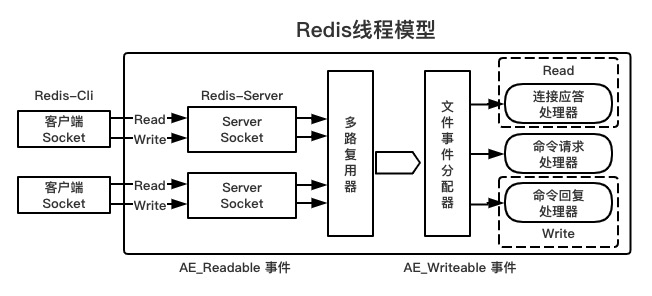
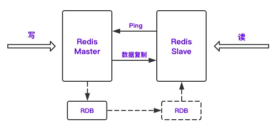
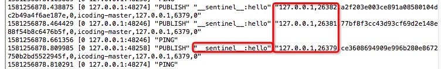
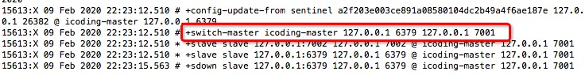
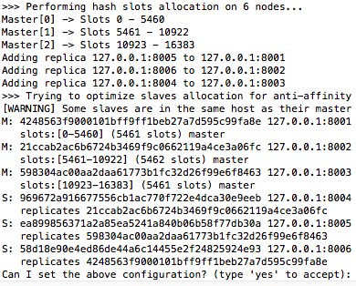

[TOC]

## 目录

- [分布式缓存Redis应用实战-1](#分布式缓存redis应用实战-1)
  - [0. 分布式架构的分析](#0-分布式架构的分析)
  - [1. 分布式缓存分析及选型](#1-分布式缓存分析及选型)
  - [2. Redis安装及常用数据类型命令](#2-redis安装及常用数据类型命令)
  - [3. Redis线程模型](#3-redis线程模型)
  - [4. Redis发布与订阅](#4-redis发布与订阅)
  - [5. Redis持久化RDB](#5-redis持久化rdb)
- [分布式缓存Redis应用实战-2](#分布式缓存redis应用实战-2)
  - [1. Redis高级数据类型GEO&HyperLogLog详解](#1-redis高级数据类型geohyperloglog详解)
  - [2. Redis事务机制&乐观锁](#2、eedis事务机制乐观锁)
  - [3. Redis内部事件订阅机制keyspace&keyevent](#3-redis内部事件订阅机制keyspacekeyevent)
  - [4. Redis持久化RDB&AOF模式分析](#4-Redis持久化rdb&aof模式分析)
  - [5. Redis主从架构](#5-redis主从架构)
- [分布式缓存Redis应用实战-3](#分布式缓存redis应用实战-3)
  - [1. Springboot实现Redis事件订阅](#1-springboot实现redis事件订阅)
  - [2. Redis内存缓存过期机制](#2-redis内存缓存过期机制)
  - [3. Redis哨兵机制和实现原理分析](#3-redis哨兵机制和实现原理分析)
  - [4. Redis分布式集群搭建](#4-redis分布式集群搭建)
- [分布式缓存Redis应用实战-4](#分布式缓存redis应用实战-4)
  - [1. Redis-Cluster常用命令使用](#1-redis-cluster常用命令使用)
  - [2. Springboot整合集群访问](#2-springboot整合集群访问)
  - [3. Redis性能监控](#3-redis性能监控)
  - [4. Redis缓存穿透解决方案](#4-redis缓存穿透解决方案)
  - [5. Redis雪崩解决方案](5-redis雪崩解决方案)
  - [6. Redisson实现分布式锁机制](#6-redisson实现分布式锁机制)
  - [7. Redis涉及的面试题分析](#7-redis涉及的面试题分析)


# 分布式缓存Redis应用实战-1

## 0. 分布式架构的分析

### 分布式架构的概述

分而治之，比一个节点要无论是计算能力还是存储能力，都要提升很多

**分布式架构的优点**

- 业务结偶
- 系统模块化，可重用化高
- 提升系统的并发量
- 优化了运维部署的效率（Pre，dubbo：Mock）

分布式架构的缺点

- 架构复杂（人员学习成本高）
- 多个子系统部署复杂
- 系统之间通信耗时
- 调试排错复杂

**设计原则**

- 异步解构
- 幂等要一致 N*1（定时任务，8点去数据库把A+1）：分布式锁来解决
- 拆分原则
- 融合分布式的中间件：Redis、ES、MQ
- 容错高可用

## 1. 分布式缓存分析及选型

核心状态化的节点：DB，80%都是来源于查询，20%才是写操作

### 1.1. 什么是NoSQL

- Not Only SQL
- 横向扩展更加方便
- HA（集群）
- 持久化
- NoSQL常见的分类
  - key-value：Redis、Memcache
  - 列存储：Hbase
  - 文档型：MongoDB
  - 图形：Neo4J、FlockDB

### 1.2.什么是Redis

- NoSQL
- 分布式缓存中间件
- key-value存储
- 海量数据访问
- 数据是存在内存里的，读取更块
- 支持水平扩展

### 1.3. Redis VS Memcache VS Ehcache

- Ehcache
  - 优点
    - Java开发的
    - 基于JVM缓存
    - 简单、方便：hibernate和Mybatis都有集成
  - 缺点
    - 不支持集群（更适合单机应用）
    - 不支持分布式
- Memcache
  - 优点
    - 简单的key-value存储
    - 内存使用率高
    - 多核，多线程
  - 缺点
    - 无法容灾
    - 无法持久化
- Redis
  - 优点
    - 丰富的数据结构
    - 持久化
    - 主从同步，故障转移
    - 支持集群3.x以后
  - 缺点
    - 单线程（大量数据存储的时候性能会降低）
    - 单核（无法充分利用CPU的多核性能，建议使用多实例）

### 2. Redis安装及常用数据类型命令

#### 2.1. 单机安装

```shell
yum -y install gcc-c++
#解压后的根目录
make && make install
#/usr/local/bin redis-server /usr/local/redis/redis.conf
mkdir /usr/local/redis
cp redis.conf /usr/local/redis/
vi redis.conf
daemonize yes #后台运行
bind 0.0.0.0 #不限制ip访问
requirepass icoding #密码
#将redis安装包util下的redis_init_script
cp redis_init_script /etc/init.d/redisd
vi redisd
CONF="/usr/local/redis/${REDISPORT}.conf" #配置文件的路径
PASSWORD=icoding
$CLIEXEC -p $REDISPORT -a $PASSWORD shutdown
#给redisd授权
chmod 777 redisd
```

### 2.2. Redis String命令

```shell
keys *
keys abc*
#redis-cli keys "a*" | xargs redis-cli del
set age 18 #没有则创建，有则覆盖
setnx age 18 #没有则创建，有什么都不做
type age #获取类型
get/del key #获取删除数据
set key value ex time #设置值的时候同时设置过期时间s
ttl key #还剩多久，-1永不过时，-2过去，正数就是还剩多少秒
append age gavin #追加字符串
strlen key #获取字符串长度

incr/decr key #给value+1/-1，如果key不存在则创建并将值设置为1
incrby/decrby key step #不存则创建一个-step/+step

getrange key start end # end=-1 表示到最后
setrange key start newdata # 替换

mset key1 value1 key2 value2 # 不支持过期时间同时设置
mget key1 key2 # 连续取值
msetnx key1 value1 key2 value2

#我们的Redis可以当成一个数据库，甲方1，甲方2，甲方3，就可以使用redis的库的概念
#databases 16

keys
flushdb #他是原子性的，一旦执行就无法回头，删除当前db下所有数据
flushall #删除所有数据库的数据
config
rename-command CONFIG "icodingconfig"
rename-command KEYS "icodingkeys"
rename-command FLUSHDB "icodingflushdb"
rename-command FLUSHDB ""
rename-command FLUSHALL "icodingflushall"
```

### 2.3. Redis操作hash类型

```shell
# 比如对象
user {
	name : icoding
	age : 18
	sex : male
}
hset/hsetnx user name icoding age 18 sex male
hget user name
hmset user name icoding age 18
hmget user name age sex
hgetall user
hincrby user age 2
hincrbyfloat user age 2.2
hlen user
hexists user age # 判断属性是否存在
hkeys user #获取所有属性
hvals user #获取所有value
hdel user name #删除属性
```

### 2.4. Redis操作list类型

```shell
#list对象[]
lpush userList v1 v2 v3 v4 v5 #从左边开始压栈
rpush userList v1 v2 v3 v4 v5 #从右边开始压栈
lpop
rpop
llen userList
lindex userList index #直接获取下标对应的值
lset userList index value
linsert userList before/after pivot(栈内的具体值) value
lrem userList num value #删除几个相同数据的value
ltrim userList start end
```

### 2.5. Redis操作Set类型

```shell
sadd userSet v1 v2 v3 v4 val5 val5 #保存集合并去重
smembers userSet #获取值，但顺序和写入不一定相同
scard userSet #获取集合数量
sismember userSet value #看value是否存在于集合中
srem userSet val1 val2 #删除集合值
spop userSet 2 #随机出栈2个
srandmember userSet 2 #随机展示两个
smove k1 k2 v2 #将集合k1中的v2移动到k2中
sinter k1 k2 #交集，交叉的值
sunion k1 k2 #并集并去重
```

### 2.6. Redis操作zset类型

```shell
zadd zk1 10 apple 20 peach 30 banana 40 pear 50 cherry #设置有分数的集合
zrange zk1 0 -1 withscores #根据位置获取数据并显示分数
zcard zk1 #获得集合数量
zrank zk1 banana #获取值的下标
zscore zk1 apple #获取值的分数
zcount zk1 10 30 #统计分数区间有的数据个数
zrangebyscore zk1 10 40 #获取分数内的值
zrangebyscore zk1 10 40 limit 13  #在分数的基础上再进行下标的区间的过滤
zrangebyscore zk1 (10 (40 #获取分数内的值不包含边界
zrem zk1 apple #删除集合中的值
```

## 3. Redis的线程模型

Redis是一个单进程的应用



每一条到达服务端的命令都不会立即执行，所有命令都会进入一个队列中，所以Redis不会产生并发问题

为什么Redis是单线程模型效率还这么高

1、纯内存访问：数据放在内存中，内存的响应时间100纳秒

2、非阻塞I/O：Redis采用epoll作为I/O多路复用技术的实现，再加上Redis自身的事件处理模型将epoll中的连接、读写、关闭都转换为了事件，不在I/O上浪费过多时间

3、采用单线程，避免了不必要的上下文切换和竞争条件

由于模型的本身机制，因此尽量不要和redis交互大数量的内容

**什么是多路复用**

假如你是一个老师，让30个学生回答问题，如何在学生昨晚后检查是否正确？

1、第一种：A，B，C，D按顺序轮询

2、第二种：老师身上有查克拉会分身，分了30分身去处理

3、第三种：你在讲台上问谁回来完毕，谁举手去回答谁，这就是I/O复用模型了

## 4. Redis的发布与订阅

有点像消息，但这个订阅是阻塞式的，我要一直等

```shell
subscribe java php c #订阅，要早于发布之前阻塞执行
publish java springboot #发布消息
psubscribe java* #订阅统配频道
```

## 5. Redis的持久化

MySQL的定时备份和增量备份

### 5.1. RDB模式

#### 5.1.1. RDB模式分析

1、什么是RDB

每隔一段时间，把内存中的数据写入磁盘，恢复的时候，他会自动从工作区拿出来进行恢复

2、RDB的优劣势

**优势**

- 每隔一段时间，全量备份
- 备份简单，可以直接传输文到其他地方
- 备份的过程中会fork一个新的进程来进行文件的存储

**劣势**

- 发生故障时，会丢失上次备份到当前时间的数据
- fork的进程会和父进程一摸一样，会导致内存随时膨胀两倍

#### 5.1.2. RDB配置文件

```shell
save 900 1 #900秒内变更1次才触发bgsave
save 300 10
save 60 10000
# 如果不想开启RDB，就是配置成 save ""
dbfilename dump.rdb #rdb保存的文件名
dir ./ #就是存放我们RDB备份文件的目录
#yes：如果save过程出错了则停止Redis写操作
#no：没所谓save是否出错
stop-writes-on-bgsave-error yes
#开启RDB压缩
rdbcompression yes
#进行CRC64算法校验，有10%的性能损耗
rdbchecksum yes
```

#### 5.1.3. 手动备份RDB

手动触发有两个命令

- save命令

在执行的时候会阻塞Redis的服务，直到RDB文件完成才会释放我们Redis进程恢复读写操作

- bgsave命令

执行bgsave的时候会在后台fork一个进程进行RDB的生成，不影响主进程的业务操作

#### 5.1.4. 使用RDB恢复数据

只需要将dump.rdb移动到我们redis.conf配置的dir（dir ./）目录下，就会在Redis启动的时候自动加载数据到内存，但是Redis在加载RDB过程中是阻塞的，直到加载完毕才能恢复操作

```shell
redis-cli> config get dir
```


# 分布式缓存Redis应用实战-2

1、Redis高级数据类型GEO&HyperLogLog详解
2、Redis事务机制&乐观锁
3、Redis内部事件订阅机制keyspace&keyevent
4、Springboot实现Redis事件订阅
5、Redis持久化RDB&AOF模式分析
6、Redis主从架构
7、Redis内存缓存过期机制
8、Redis哨兵机制和实现原理分析
9、Redis分布式集群搭建

## 1. Redis高级数据类型GEO&HyperLogLog详解

### 1.1. zset扩展类型geo

#### 1.1.1. GEO功能介绍

GEO功能是在Redis 3.2版本后提供的，支持存储地理坐标的一个数据结构，可以用来做类似摇一摇，附近的人，周边搜索的功能

```shell
# 语法类型
geoadd key 经度 纬度 成员 [经度 纬度 成员...]
# geoadd命令必须以标准的x y member结构来接受参数，必须先输入经度后输入纬度
```

geoadd能够记录的坐标是有限：

- 非常接近两级的区域无法索引
- 精确的坐标限制是由 EPSG:900913等坐标系统定义
- 经度：-180到180度之间
- 纬度：-85.05117878到85.05117878度之间
- 如果超出这个范围则会报错

#### 1.1.2. 新增和查询

```shell
# 添加一批城市
geoadd china:city 116.408 39.904 beijing 121.445 31.213 shanghai 113.265 23.108 guangzhou 114.109 22.544 shenzhen 108.969 34.285 xian 108.55 34.09 changan 
# 查询
geopos china:city beijing shanghai
```

#### 1.1.3. 获得节点间距离

```shell
geodist china:city shanghai beijing km
```

unit:

- m : 米
- km ：千米
- mi ：英里
- ft ： 英尺
- 默认是m
- 会有0.5%的误差

#### 1.1.4. 周边搜索

```shell
georadius china:city 121.445 31.213 1300 km withdist withcoord
georadius china:city 121.445 31.213 1300 km withdist withcoord asc count 3
georadiusbymember china:city beijing 1300 km withdist withcoord asc count 3
```

- withdist : 返回节点距离
- withcoord : 带上坐标

```shell
#节点hash
geohash china:city xian changan
1) "wqj7p9ku9e0"
2) "wqj1yjgswk0"
```

#### 1.1.5. 删除节点

```shell
zrem china:city changan
```

#### 1.1.6. 业务实现

x y name1 x y nam2

x y canyin:123 x y canyin:456

### 1.2. hyperloglog

这个数据类型其实就做了一件事，统计不重复的数据量

比如要记录我们网站的UV量

```shell
sadd 20200208 1 2 3 4 5 6 5 4 3 2 1
scard 20200208
```

只用来存放基数

```shell
pfadd 20200207 1 2 3 4 5 6 5 4 3 2 1 #添加记录基数
pfadd 20200206 1 2 3 4 5 6 7 8 9 10
pfcount 20200206 #返回基数
pfmerge 202002 20200206 20200207 #pfmerge newkey sourcekey1 sourcekey2 合并生成了一个新key，原来的key不会消失
```

还有一个问题

- hyperloglog是一个基数估算算法，有一定误差的
- 误差值在0.81%
- hyperloglog的key占用空间很小只有12K，而你用set就需要把这些value都要保存，set存一年数据有多大

## 2. Redis事务&乐观锁

### 2.1. Redis事务

场景描述：

就是我们的数据操作是一个原子性的

```shell
# 看一下redis的场景
# client A           		client B
set name icoding(1)     set name icodingedu(2)
get name(3)             get name
# 这个时候数据就串了
```

事务需要边界

```shell
multi # 开启事务
set name icoding
get name
exec # 执行事务

discard # 回滚事务
```

**事务执行过程中错误回退机制**

- 如果命令错误则自动回滚
- 如果命令正确但语法错误，正确的语句都会被执行

### 2.2. Redis的乐观锁

业务场景距离

库存：store 1000-->100 / + 1000（三个业务人员incrby）

数据的状态：如果在你修改前已经被修改了，就不能再修改成功了？

```shell
# watch key1 key2 命令
# 只要在事务外watch了一个key或多个key，在事务还没有执行完毕的时候，watch其中的key被修改后，整个事务回滚
set store 10
watch store
multi
incrby store 100
get store
exec
```

- watch在事务执行完毕后就释放了
- watch的key如果在事务执行过程中失效了，事务也不受watch影响
- watch只能在事务外执行
- 客户端如果断开，watch也就失效了

## 3. Redis内部事件订阅机制keyspace&keyevent

```shell
# 进入redis的客户端
subscribe java php #订阅了两个通道
pubstribe java springboot #发布通道
psubscribe j* p* #通配频道
```

### 3.1. 应用的业务场景

订单超时2小时未支付，需要关闭，如何实现？

1、Quartz来做任务调度，定时执行巡检任务，5分钟巡检一次，会有4分59秒的巡检超时

2、Timer，java的定时器，秒为单位，数据量大的时候性能就成瓶颈了

3、Quartz+Timer ，Quartz拿出5分钟内将要充实的订单，然后在启用多线程以Timer每秒的方式去检查，但业务功能就比较复杂了

4、有没有一种功能，有个hook能通知我们我失效了？通知我执行业务

5、假设：expire 7200 秒过期后通知我，这就是实现了第4种方案了？

Redis在2.8版本后，推出keyspace notifcations特性，类似数据库的trigger触发器

keyspace notifications是基于sub/pub发布订阅机制的，可以接收对数据库中影响key操作的所有事件：比如del、set、expire(过期时间)

### 3.2. 接收的事件类型

有两种：keyspace、keyevent

keyspace : 是key触发的事件的具体操作

keyevent : 是事件影响的键名

```shell
# pub这个动作是系统自动发布的
127.0.0.1:6379> del mykey
# 数据库0会发布以下两个信息
publish __keyspace@0__:mykey del
publish __keyevent@0__:del mykey
```

### 3.3. 开启系统通知

redis.conf配置文件里

```shell
# 这都是配置项
#  K     Keyspace events, published with __keyspace@<db>__ prefix.
#  E     Keyevent events, published with __keyevent@<db>__ prefix.
#  g     Generic commands (non-type specific) like DEL, EXPIRE, RENAME, ...
#  $     String commands
#  l     List commands
#  s     Set commands
#  h     Hash commands
#  z     Sorted set commands
#  x     Expired events (events generated every time a key expires)
#  e     Evicted events (events generated when a key is evicted for maxmemory)
#  A     Alias for g$lshzxe, so that the "AKE" string means all the events.
```

```shell
# 开关 在redis.conf配置里
notify-keyspace-events "" #默认空字符串，是关闭状态
notify-keyspace-events "KEx" #配置文件里只配置了space和event的expried事件，就只自动发布这个事件
```

统配订阅

```shell
notify-keyspace-events "KEA"
set username gavin ex 10 #set事件,expire事件
psubscribe __key*@*__:*
#返回事件通知
4) "set"
1) "pmessage"
2) "__key*@*__:*"
3) "__keyevent@0__:set"
4) "username"
1) "pmessage"
2) "__key*@*__:*"
3) "__keyspace@0__:username"
4) "expire"
1) "pmessage"
2) "__key*@*__:*"
3) "__keyevent@0__:expire"
4) "username"

1) "pmessage"
2) "__key*@*__:*"
3) "__keyspace@0__:username"
4) "expired"
1) "pmessage"
2) "__key*@*__:*"
3) "__keyevent@0__:expired"
4) "username"

subscribe __keyevent@0__:expired
```

### 3.4. Springboot订阅通知

```xml
        <dependency>
            <groupId>org.springframework.boot</groupId>
            <artifactId>spring-boot-starter-data-redis</artifactId>
        </dependency>
```


## 4. Redis持久化RDB&AOF模式分析

### 4.1. RDB已经讲过了

> 上次的课程内容放进来就行

### 4.2. AOF模式分析

RDB会丢失最后一次备份和系统宕机之间的数据，可能你觉得无所谓，所以就需要增量备份的过程了，什么Redis的增量备份，就是AOF，优点像MySQL的Binlog

#### 4.2.1 AOF的特点

**特点**

- 以日志形式来记录用户的请求和写操作，读操作不会记录
- 文件是追加的形式而不是修改的形式
- redis的aof恢复其实就是从头到尾执行一遍

**优势**

- AOF更加耐用，可以以秒为单位进行备份，如果发生问题，之丢失一秒的数据
- 以log日志的方式进行存放和追加数据，如果磁盘已经很满了，会执行redis-check-aof工具
- 当aof文件太大的时候，redis在后台会自动重写aof，相当于把redis的aof文件进行压缩
- AOF日志包含所有写操作，便于redis的恢复

**劣势**

- 相同的数据，AOF比RDB大
- AOF比RDB同步慢
- 一旦AOF文件出现问题，数据就会不完整

#### 4.2.2. AOF配置文件

```shell
#开启AOF
appendonly yes 
#AOF的文件名设置
appendfilename "appendonly.aof"
# aof同步备份的频率设置
# no : 写入aof文件，不等待磁盘同步
# everysec ：每秒讲写操作备份，推荐使用
# always ：每次操作都会备份，数据是安全和完成，但性能会比较差
appendfsync everysec
# 重写的时候是否要同步，yes则不同步，no同步阻塞可以保证数据安全
no-appendfsync-on-rewrite no
# 重写机制(压缩机制):避免文件越来越大,将key的重复值合并,重写的时候会触发fork一个新进程来操作
# 触发条件就是下面两个都满足才触发
# 上面配置no,重写触发后会fork进程并阻塞主进程无法写入导致等待,所以两个值可以设置小点让重写快速阻塞完毕
# 1.现有的文件比上次多出100%：上次压缩完2G，现在已经4G了如果是50%就是3G
auto-aof-rewrite-percentage 100
# 2.现有的文件已经超过100mb了
auto-aof-rewrite-min-size 100mb
```

### 4.3. 到底是使用RDB还是AOF

Redis在RDB和AOF同时开启的过程中，重启后会优先加载AOF文件

- AOF文件在开启后就会自动创建一个空文件
- 重启后Redis会优先加载AOF：默认是以秒为单位进行保存的，在逻辑上比RDB的数据完整

解决方案：

```shell
# 在redis客户端在线更改
config get appendonly
config set appendonly yes
```

## 5. Redis主从架构

### 5.1. 主从原理分析



主从出现的原因

- 高并发
  - 官方数据表示Redis的读数据11w/s左右，写速度是8w/s左右
  - Redis尽量少写多读，符合缓存的适用要求
  - 可以通过主从架构来进行读写分离
- HA
  - 如果有一个以上的从库就会对节点进行备份

同步的过程中一定要开启持久化

- 如果master出现宕机内存丢失，从库也会删除
- master进行功能性重启，内存数据丢失，也会同步给slave

主从复制原理

- 当slave第一次连接时，会触发全量同步，如果已经连接过了，只会同步新增数据
- 全量备份分为落盘和不落盘两种形式，默认是落盘

```shell
# 不落盘复制配置 yes不落盘，no落盘
repl-diskless-sync no
# 等待其他slave连接的一个时间周期，单位是秒
repl-diskless-sync-delay 5
```

- 支持断点续传
- 如果从库过多会导致占用带宽较大，所以从不易过多

主从的结构除了一对多，还可以是树形的，树形结构用的比较少


### 5.2. 主从设置

```shell
# 可以通过命令看一下主从信息，v5.x版本前从是用slave表示，之后换成replication
# master和slave节点都可以查看
info replication
#=====================通用=============================
daemonize yes #后台运行
bind 0.0.0.0 #不限制ip访问
requirepass icoding #密码
dir /usr/local/redis #数据目录
#=================master===========================
# 是否禁止复制tcp链接的tcp nodelay参数，可传递yes或者no。
# 默认是no，即使用tcp nodelay,允许小包的发送。对于延时敏感型，同时数据传输量比较小的应用，开启TCP_NODELAY选项无疑是一个正确的选择
# 如果master设置了yes来禁止tcp nodelay设置，在把数据复制给slave的时候，会减少包的数量和更小的网络带宽。
# 但是这也可能带来数据的延迟。
# 默认我们推荐更小的延迟，但是在数据量传输很大的场景下，建议选择yes。
# 默认开启并配置为no,在master上添加
repl-disable-tcp-nodelay no
# 复制缓冲区大小，这是一个环形复制缓冲区，用来保存最新复制的命令。
# 这样在slave离线的时候，不需要完全复制master的数据，如果可以执行部分同步，只需要把缓冲区的部分数据复制给slave，就能恢复正常复制状态。
# 缓冲区的大小越大，slave离线的时间可以更长，复制缓冲区只有在有slave连接的时候才分配内存。
# 没有slave的一段时间，内存会被释放出来，默认1m。
# 默认没有开启,在master上配置
repl-backlog-size 5mb
# master没有slave一段时间会释放复制缓冲区的内存，repl-backlog-ttl用来设置该时间长度。
# 单位为秒。
# 默认没有开启,在master上配置
repl-backlog-ttl 3600
# redis提供了可以让master停止写入的方式，如果配置了min-slaves-to-write，健康的slave的个数小于N，mater就禁止写入。
# master最少得有多少个健康的slave存活才能执行写命令。
# 这个配置虽然不能保证N个slave都一定能接收到master的写操作，但是能避免没有足够健康的slave的时候，master不能写入来避免数据丢失。
# 设置为0是关闭该功能，默认也是0。
# 默认没有开启，在master上配置
min-replicas-to-write 2
# 延迟小于min-replicas-max-lag秒的slave才认为是健康的slave。
# 默认没有开启，在master上配置
min-replicas-max-lag 10
#==========================slave============================
# 修改slave的redis.conf
replicaof 192.168.1.100 6379 #master的ip，master的端口
# 在slave配置上添加
masterauth icoding #主机的访问密码
# yes 主从复制中，从服务器可以响应客户端请求
# no 主从复制中，从服务器将阻塞所有请求，有客户端请求时返回“SYNC with master in progress”；
# 默认开启yes,在slave上配置
replica-serve-stale-data yes
# slave节点只允许read 默认就是 yes
# 这个配置只对slave节点才生效，对master节点没作用
# 默认开启并配置为yes,在slave上配置
replica-read-only yes 
# slave根据指定的时间间隔向master发送ping请求
# 时间间隔可以通过 repl-ping-replica-period 来设置，默认10秒
# 默认没有开启,在slave的配置上打开
repl-ping-replica-period 10
# 复制连接超时时间。
# master和slave都有超时时间的设置。
# master检测到slave上次发送的时间超过repl-timeout，即认为slave离线，清除该slave信息。
# slave检测到上次和master交互的时间超过repl-timeout，则认为master离线。
# 需要注意的是repl-timeout需要设置一个比repl-ping-slave-period更大的值，不然会经常检测到超时。
# 默认没有开启,在slave的配置上打开
repl-timeout 60
# 当master不可用，Sentinel会根据slave的优先级选举一个master。
# 最低的优先级的slave，当选master。
# 而配置成0，永远不会被选举。
# 注意：要实现Sentinel自动选举，至少需要2台slave。
# 默认开启，在slave上配置
replica-priority 100

```


# 分布式缓存Redis应用实战-3

## 1. Springboot实现Redis事件订阅

```xml
<dependency>
  <groupId>org.springframework.boot</groupId>
  <artifactId>spring-boot-starter-data-redis</artifactId>
</dependency>
```

yaml

```yaml
spring:
  redis:
    host: 127.0.0.1
    port: 6379
    password: pwd
```

监听器

```java
import com.icodingedu.service.MessageReceiver;
import org.springframework.context.annotation.Bean;
import org.springframework.context.annotation.Configuration;
import org.springframework.data.redis.connection.RedisConnectionFactory;
import org.springframework.data.redis.listener.PatternTopic;
import org.springframework.data.redis.listener.RedisMessageListenerContainer;
import org.springframework.data.redis.listener.adapter.MessageListenerAdapter;

@Configuration
public class RedisMessageConfig {

    @Bean
    RedisMessageListenerContainer container(RedisConnectionFactory connectionFactory, MessageListenerAdapter listenerAdapter){
        RedisMessageListenerContainer container = new RedisMessageListenerContainer();
        container.setConnectionFactory(connectionFactory);
        //订阅channel
        container.addMessageListener(listenerAdapter,new PatternTopic("__keyevent@*__:expired"));
        return container;
    }

    @Bean
    MessageListenerAdapter listenerAdapter(MessageReceiver receiver){
        return new MessageListenerAdapter(receiver,"receiveMessage");
    }
}
```

监听结构输出

```java
import org.springframework.stereotype.Service;

@Service
public class MessageReceiver {
    //接收消息的方法
    public void receiveMessage(String message){
        System.out.println(message);
    }
}
```

## 2. Redis内存缓存过期机制

Redis是一个内存数据，持久化仅仅是做备份和HA的

key一般会有两种操作：不设置过期时间，设置过期时间（无论是否设置，只要你的业务内容足够复杂内容足够多，Redis主机的内存是永远的不够的，假定目前你的企业Redis的配置还停留在主从阶段）

- 影响存储大小的是不是你的主机内存？是1，不是2
- 如果内存不够了，放满了，Redis怎么处理？无法存入1，有其他方法的2

Redis内存的删除机制

- 主动删除（定期删除）
  - 只要设置了expire，redis会默认1秒抽查10次，来巡检这些过期的key，把它删除掉来释放内存
  - 在redis.conf文件里有个叫：hz的配置（hz 10）过大CPU负担比较重
- 被动删除：
  - redis内部在访问每个key的时候，会调用一个内部方法：expireIfNeeded()，如果过期就会返回nil，拿空间换时间
- 如果你的key大部分没有设置过期时间，内存满了怎么办？

Redis提供一套内存淘汰机制：MEMORY MANAGEMENT

```shell
# master 8G slave 6G
# 服务不是只运行redis这个服务，还有linux本身的内核swap，这个是可以给操作系统留一些余量
# maxmemory <bytes> 设定redis可用内存大小 
# 内存淘汰规则
# maxmemory-policy noeviction 但Redis默认就是这个配置
# volatile-lru -> 在那些设置了expire的缓存中，清除最少使用的旧缓存，可以保存新缓存
# allkeys-lru -> 清除最少用的旧缓存：推荐使用
# volatile-lfu -> Evict using approximated LFU among the keys with an expire set.
# allkeys-lfu -> Evict any key using approximated LFU.
# volatile-random -> Remove a random key among the ones with an expire set.
# allkeys-random -> 在所有缓存中随机删除：不推荐的
# volatile-ttl -> Remove the key with the nearest expire time (minor TTL)
# noeviction -> 缓存永不过期
```

## 3. Redis哨兵机制和实现原理分析

问题：Master挂了，如何保证可用性，实现继续写

现象：slave的数据还有，需要手动把slave升级成master，需要去修改程序的配置了，很不方便，啥时候的挂的？

解决：Redis本身就提供了一个机制-Sentinel哨兵

**什么是哨兵**

Redis的sentinel机制是用于管理多个redis服务器的，sentinel会执行以下四个任务

- 服务监控：负载监控redis master和slave进程是否正常工作
- 消息通知：master如果挂了，哨兵可以根据你配置的脚本来调用发送通知
- 故障转移：master node挂了，sentinel会从slave里选举一个node成为master，会让剩下的slave follow到新master上并从新master复制数据
- 配置中心：如果故障发生转移了，sentinel可以通知客户端，新的master地址的端口是什么

### 3.1. 配置哨兵

```shell
# redis的安装根目录下，有个sentinel.conf
# 部署三个哨兵节点，同时监控一组redis服务（只有一个节点其实也可以，但风险）
# bind 127.0.0.1 192.168.1.1
# 测试的时候放开访问保护
protected-mode no
port 26379 #默认是26379
daemonize yes
pidfile /var/run/redis-sentinel-26379.pid #pid 集群要区分开
logfile /usr/local/redis-6379/sentinel/redis-sentinel.log #日志，非常重要
dir /usr/local/redis-6379/sentinel #工作空间
# sentinel监控的核心配置
# 最后一个2，quorum,>=2个哨兵主观认为master下线了，master才会被客观下线，才会选一个slave成为master
sentinel monitor icoding-master 127.0.0.1 6379 2
# master访问密码
sentinel auth-pass icoding-master icoding
# sentinel主观认为master挂几秒以上才会触发切换
sentinel down-after-milliseconds icoding-master 3000
# 所有slave同步新master的并行同步数量，如果是1就一个一个同步，在同步过程中slave节点是阻塞的，同步完了才会放开
sentinel parallel-syncs icoding-master 1
# 同一个master节点failover之间的时间间隔
sentinel failover-timeout icoding-master 180000
```

配置完毕进行启动

```shell
redis-sentinel sentinel.conf
# 如果要搭建集群，只需要将刚刚配置的sentinel.conf复制到其他节点即可
```

哨兵集群部署的约定

- 哨兵集群至少3个节点
- 最好三个节点在不同的物理机器上
- 一组哨兵最好只监控一组主从

### 3.2. 查看哨兵信息

```shell
redis-cli -p 26379 #通过哨兵的端口进入
sentinel master icoding-master
sentinel slaves icoding-master
sentinel sentinels icoding-master #查看哨兵信息
```

### 3.3. 哨兵故障转移的原理

#### 3.3.1. 主观宕机和客观宕机

S_DOWN和O_DOWN

- S_DOWN (Subjectively Down) 主观宕机
  - 一个哨兵根据配置的主观宕机秒数，认为一个master宕机了，就是主观宕机
  - sentinel down-after-milliseconds icoding-master 3000 就是这个配置
  - 哨兵ping主机，然后返回超过上面设置的时间就认为主观宕机了
- O_DOWN(Objectively Down) 客观宕机
  - 如果quorum数量的哨兵觉得一个master宕机了，就是客观宕机

#### 3.3.2. 哨兵集群是如何自动发现的

刚刚创建哨兵集群的时候并没手动设置之间的关联

```shell
通过pub/sub机制来实现的，每个哨兵都会pub一个__sentinel__:hello并通过sub来获取和感知有多少个同组redis监控的哨兵
并且信息里会携带host ip runid,并让其他哨兵感知到 
```



#### 3.3.3. slave->master选举算法

**会考虑的slave选举的信息**

- 和master断开的时长
- slave的优先级：replica-priority 100
- 复制的offset位移程度
- run_id

如果slave和master连接断开超过：down-after-milliseconds icoding-master这个配置的10倍以上绝对不考虑

**slave的选举排序顺序**

1、按照slave优先级进行排序，replica priority越低，优先级越高

2、如果replica priority级别相同，看offset越靠后（复制的内容多少），优先级越高

3、如果上面两个条件都一样，这个时候看run_id ,run_id字符排序越靠前越优先

**先选一个执行主从的sentinel，这个sentinel在根据主从选举算法进行选举**

#### 3.3.4. quorum和majority

每次哨兵要做主从切换，首先需要quorum数据的哨兵认为O_DOWN，然后选举一个哨兵来做主从切换，这个哨兵要得到majority数量哨兵的授权，才能正式切换

如果quorum<majority，如果5个哨兵，maj就是3个，qu就是2个

如果quorum>=majority，必须quorum数量的哨兵都授权

#### 3.3.5. configuration epoch

监控的版本号，这个时候所有的哨兵都会记录一套当前的主从关系，这个关系的变更，切换版本号

一个执行哨兵完成了主从切换后，就会通过pub/sub机制来传播给其他哨兵

### 3.4. 哨兵故障转移的实现

关闭6379的master服务



**哨兵故障转移的实现方式**

依赖于config命令的，我们可能会改成imconfig

```shell
# 可以通过这个命令来修改成无redis修改后的config命令
# SENTINEL rename-command mymaster CONFIG IMCONFIG
```

实现切换的机制

```shell
1. 通过config命令修改redis.conf的主从关系
   修改自己的sentinel.conf的主机监控命令
2. 在sentinel.conf配置的最下端写入当前主从的版本，供所有哨兵进行使用
sentinel leader-epoch icoding-master 1
sentinel known-replica icoding-master 127.0.0.1 7002
sentinel known-replica icoding-master 127.0.0.1 6379
sentinel known-sentinel icoding-master 127.0.0.1 26379 ce3608694909e996b280e8672750b2bd5522945f
sentinel known-sentinel icoding-master 127.0.0.1 26382 a2f203e003ce891a08580104dc2b49a4f6ae187e
sentinel current-epoch 1
```

### 3.5. 哨兵的故障通知机制

```shell
# sentinel notification-script <master-name> <script-path>
# 当我们master出现sdown和odown都会触发
sentinel notification-script icoding-master /usr/local/redis/nofity.sh


# sentinel client-reconfig-script mymaster /var/redis/reconfig.sh
# 会带有一些参数：主从切换新旧地址的参数
# <master-name> <role> <state> <from-ip> <from-port> <to-ip> <to-port>
sentinel client-reconfig-script icoding-master /usr/local/redis/configer.sh
```

### 3.6. 哨兵转移过程中的问题

- 异步复制的时候，master的数据还没有复制给slave，这个时候哨兵切换slave成为master后就会丢失这些数据（新master会把他的数据同步到其他slave：清空其他slave进行同步）

- 脑裂：哨兵的网络和master断开了，但我们master还在运行，这个时候客户端写入旧master的时候就会丢失

  old-master<-->client 是连接的，这个时候old-master就没有slave，可以通过以下两个配置来缓解

  - min-replicas-to-write 2
  - min-replicas-max-lag 10

  new-master---slave1/slave2

### 3.7. 程序如何确保访问有效

如果我们直接连接master还是不能解决故障转移的问题

这个时候就需要连接我们哨兵ip port

```yaml
spring:
  redis:
    host: 127.0.0.1
    password: icoding
    sentinel:
      master: icoding-master
      nodes: 39.99.199.5:26379,39.99.199.5:26381,39.99.199.5:26382
```

## 4. Redis分布式集群搭建

提问：

我们前面讲主从，讲哨兵体现出Redis分布式缓存的特性没？

背景：

主从复制（哨兵），虽然主从能提升读的并发，但是单个master容量是有限的，内存数据达到一定程度就会有瓶颈，无论多少套主从，master的容量都是最终的瓶颈

如果解决：

需要支持内存的水平扩展了，这个时候就需要使用集群了

**集群解决的问题**

- 高可以
- 高并发
- 访问/存储水平扩展

### 4.1. Redis集群配置

```shell
# redis.conf
# 单机配置
daemonize yes
dir /usr/local/cluster/8001
bind 0.0.0.0
requirepass icoding
masterauth icoding #集群创建会自动搭建主从关系，所以不要手工配置replicaof
port 8001
pidfile /var/run/redis_8001.pid
# 开启集群配置
cluster-enabled yes
# 集群每个节点都需要的配置文件
cluster-config-file nodes-8001.conf
# master超时时间，超过后主备切换
cluster-node-timeout 3000
# 开启AOF
appendonly yes
# 批量修改文件端口
.,$ s/8001/8006/g
# 整个批处理文件
chmod 777 cluster.sh
redis-server /usr/local/redis-cluster/8001/redis.conf
redis-server /usr/local/redis-cluster/8002/redis.conf
redis-server /usr/local/redis-cluster/8003/redis.conf
redis-server /usr/local/redis-cluster/8004/redis.conf
redis-server /usr/local/redis-cluster/8005/redis.conf
redis-server /usr/local/redis-cluster/8006/redis.conf
```

搭建集群

```shell
# Redis 3.x开始有集群，redis-trib.rb
# Redis 5.x使用redis-cli就可以了
# 集群创建的命令
# --cluster-replicas 1 每个master有几个slave
redis-cli -a icoding --cluster create 127.0.0.1:8001 127.0.0.1:8002 127.0.0.1:8003 127.0.0.1:8004 127.0.0.1:8005 127.0.0.1:8006 --cluster-replicas 1
# 查看集群信息
redis-cli -a icoding --cluster check 127.0.0.1:8001
# 查看集群命令帮助
redis-cli -a icoding --cluster help
```



问题：

set key value 所有节点都写的1，写一个节点的2

登录8001节点 set key value 是否一定写入8001，一定1，不一定2

```shell
(error) MOVED 12539 127.0.0.1:8003 
# 报这个错误的原因是我们以单机方式登录，而不是集群方式
# 单机登录节点
redis-cli -a icoding -p 8001
# 集群登录节点
redis-cli -c -a icoding -p 8001
set key value
get key
127.0.0.1:8001> cluster info
127.0.0.1:8001> cluster nodes
keys * # 在集群状态下只能拿到当前节点的所有数据
#-> Redirected to slot [12539] located at 127.0.0.1:8003
```

### 4.2.  Slot槽点

**Slot就是支持分布式存储的核心**

Redis集群创建后会创建16384个slot**（slots不能改就是16384个）**，并且根据集群的master数据平均分配给master

- 如果有3个master，16384/3=（大约）5460个
- 当你往redis集群中插入数据时，数据只存一份，不一定在你登录节点上，redis集群会使用crc16(key)mod16384来计算这个key应该放在那个hash slot中
- 获取数据的时候也会根据key来取模，就知道在哪个slot上了，也就能redirect了
- 一个slot其实就是一个文件夹，就能存很多key

集群如何实现分布式

- 每个master只保存mod后的slot数据
- 如果要扩展，再加入一个，只需要给这个新节点再分一些slot就行了，但注意无论多少个node，**slots总数不变都是16384**
- 8g(2460)，8g(2460)，8g(2460)，这个时候加入一个16g(4000) 16g(5000)：total-16384
- slot移动，slot里的数据也跟着移动
- 一个master节点是否内存装满，是slots数量多少还是slot里存放的文件多少导致的？

集群的搭建建议

- 建议是奇数个，至少3个master几点
- 主从切换：节点间会相互通信，一半以上的节点ping不通某个节点，就认为这个master挂了，这个时候从节点顶上
- 什么时候整个集群不可用
  - 如果集群中任意master挂掉，且没有slave顶上，集群就进入fail状态
  - 如果超半数以上的master挂掉，无论是否有slave，集群都进入fail状态

### 4.3. 新增节点Master/Slave

```shell
#add-node       new_host:new_port existing_host:existing_port
#                 --cluster-slave
#                 --cluster-master-id <arg>
# 新增主节点
redis-cli -a icoding --cluster add-node 127.0.0.1:8007 127.0.0.1:8001
# 加入后可以通过cluster nodes来查看
127.0.0.1:8001> cluster nodes
# 给8007分配slot
# --cluster-from 从哪个节点来分配slot，这里只能写node_id,就是cluster nodes获得id，from可以是一个节点也可以是多个节点
# --cluster-to 到8007节点，同样是node_id
# --cluster-slots 从from节点一共分多少slot，并且from中的node是平均分这个总数的 4096/3
# --cluster-yes 不用提示直接执行
redis-cli -a icoding --cluster reshard 127.0.0.1:8001 --cluster-from 4248563f9000101bff9ff1beb27a7d595c99fa8e,21ccab2ac6b6724b3469f9c0662119a4ce3a06fc,598304ac00aa2daa61773b1fc32d26f99e6f8463 --cluster-to 75b831369eedd8b5fe0aee4b2819f573ae0592a2 --cluster-slots 4096 --cluster-yes
# 给8007增加8008的slave节点
redis-cli -a icoding --cluster add-node 127.0.0.1:8008 127.0.0.1:8001 --cluster-slave --cluster-master-id 75b831369eedd8b5fe0aee4b2819f573ae0592a2
```

### 4.4. 节点下线

场景：5组Redis，10个节点，要改成3组，6个节点

```shell
# 下线节点，现有考虑把slots分给其他节点，这就是在做数据迁移
# 我这一次分配，也可以分批移动给多个节点，我要下架8001/8006
redis-cli -a icoding --cluster reshard 127.0.0.1:8002 --cluster-from 4248563f9000101bff9ff1beb27a7d595c99fa8e --cluster-to 21ccab2ac6b6724b3469f9c0662119a4ce3a06fc --cluster-slots 4096 --cluster-yes
# 检查一下8001的slot是否全部转移走
127.0.0.1:8002> cluster nodes
# 删除8001节点，这里的节点建议写成删除节点
redis-cli -a icoding --cluster del-node 127.0.0.1:8001 4248563f9000101bff9ff1beb27a7d595c99fa8e
# 删除8006节点，这里的节点建议写成删除节点
redis-cli -a icoding --cluster del-node 127.0.0.1:8006 58d18e90e4ed86de44a6c14455e2f24825924e93
```

线上保险操作

1、先把集群中的每个节点的RDB，AOF文件备份

2、复制一套同设备和参数的集群，把数据恢复到里面，演练一下（如果可以把演练的结果转正更好）

3、演练没有问题，这个时候进行操作


# 分布式缓存Redis应用实战-4

## 1. Redis-Cluster常用命令使用

```shell
# redis-cli --cluster查看帮助
redis-cli --cluster help
# 给新加入的node分配slot,all代表所有master节点
redis-cli -a icoding --cluster reshard 127.0.0.1:8001 --cluster-from all --cluster-to 60709ef9ee8238811115c38970468af8b611643a --cluster-slots 4000 --cluster-yes
# cluster命令,是执行在redis-cli,一定要先登录到集群中
# 新增master节点
cluster meet 127.0.0.1 8007
# 使用rebalance命令来自动平均分配slot
# --cluster-threshold 1 只要不均衡的slot数量超过1，就触发rebanlance
# --cluster-use-empty-masters 没有slot槽点的节点也参数均分
redis-cli -a icoding --cluster rebalance 127.0.0.1:8001 --cluster-threshold 1 --cluster-use-empty-masters
# cluster命令,是执行在redis-cli,一定要先登录到集群中
# 新增slave节点
# REPLICATE <node-id> -- Configure current node as replica to <node-id>.
# 前提是这个副本节点要先在集群中
cluster meet 127.0.0.1 8008
# 加入后切换到新增的slave 8008
cluster replicate 60709ef9ee8238811115c38970468af8b611643a
```

## 2. Springboot整合集群访问

```yaml
spring:
  redis:
    password: icoding
    cluster:
      nodes: 127.0.0.1:8001,127.0.0.1:8002,127.0.0.1:8003,127.0.0.1:8004,127.0.0.1:8005,127.0.0.1:8006,127.0.0.1:8007,127.0.0.1:8008
```

## 3. Redis性能监控

```shell
# redis-benchmark检查redis的并发性能的
# -c 100个连接
# -n 500个请求
# 主要是测试redis主机的一个本地性能
redis-benchmark -h 127.0.0.1 -p 8001 -a icoding -c 100 -n 500
```

slowlog慢查询日志

```shell
# redis.conf配置
# 设置慢查询的时间下限，超过多少微秒的进行记录
slowlog-log-slower-than 10000
# 慢产讯对应的日志长度，单位：命令数
slowlog-max-len 128
```

slowlog慢查询日志查看

```shell
# redis-cli客户端下
# 查看慢查询
127.0.0.1:6379> slowlog get
# 获取慢查询条目
127.0.0.1:6379> slowlog len
# 重置慢查询日志
127.0.0.1:6379> slowlog reset
```

## 4. Redis缓存穿透解决方案

### 4.1. 缓存穿透的场景

get传参数，参数一般是id，如果这个id是一个无效id

```java
String key = request.getParameter("key");
List<BuyCart> list = new ArrayList();
//习惯性会用json来保存结构数据
String cartJson = redisOperator.get(key);
if(StringUtls.isBlank(cartJson)){
  //redis里面没有保存这个key
  list = cartService.getCarts(key);
  //从数据库里查出来然后写入redis
  if(list!=null&&list.size()>0){
  	redisOperator.set("cartId:"+key,JsonUtils.objectToJson(list));
  }else{
    redisOperator.set("cartId:"+key,JsonUtils.objectToJson(list),10*60);
  }
}else{
  //redis里有值
  list = JsonUtils.jsonToList(list));
}
```

假如我系统被人攻击了，如何攻击？

get传参数，传N个无效的id

### 4.2. 布隆过滤器bloomfilter

>  之前讲了一个hyperloglog，保存不重复的基数个数：比如记录访问的UV，我只需要个数

**场景描述**

比如我们一个新闻客户端，不断的给用户推荐**新**的新闻，推荐去重，还要高效

这个时候你想到Redis，能实时推送并快速去重

用户A：1 2 3 4 5 6（2 7 9）每个用户都应该有一个浏览的历史记录：一旦时间长了，是不是数据量就非常大

如果用户量也很大怎么办？

这个时候我们的布隆过滤器就登场了

**总结一下**

- 布隆过滤器可以判断数据是否存在
- 并且可以节省90%以上的存储空间
- 但匹配精度会有一点不准确（**涉及空间和时间的转换**：0.01%）

#### 4.2.1. 布隆过滤器的运行场景

它本身是一个二进制的向量，存放的就是0，1

比如我们新建一个长度为16的布隆过滤器


所以布隆过滤器的精度是取决于bloom的存储大小的的，如果长度越大，精度就越高

**布隆过滤器的特征**

- 精度是取决于bloom的存储大小的的，如果长度越大，精度就越高
- 只能判断数据是否一定不存在，而无法判断数据是否一定存在
- bloom的存储节点不能删除，一旦删除就影响其他节点数据的特征了

**布隆过滤器存储的节点数据一定是历史数据**

#### 4.2.2. 布隆过滤器的使用

到入google的guava的POM

```xml
        <dependency>
            <groupId>com.google.guava</groupId>
            <artifactId>guava</artifactId>
            <version>28.2-jre</version>
        </dependency>
```

BloomFilter的代码测试

```java
public class BloomFilterTest {
    public static void main(String[] args) {
    		//字符集，bf的存储长度一般是你要存放的数据量1.5-2倍，期望的误判率
        BloomFilter bf = BloomFilter.create(Funnels.stringFunnel(Charset.forName("utf-8")),100000,0.0001);
        for(int i=0;i<100000;i++){
            bf.put(String.valueOf(i));
        }
        int flag = 0;
        for(int i=100000;i<200000;i++){
            if(bf.mightContain(String.valueOf(i))){
                flag++;
            }
        }
        System.out.println("误判了："+flag);

    }
}
```

#### 4.2.3. Redis集成布隆过滤器

Redis官方提供的布隆过滤器支持的是到了Redis4.x以后提供的插件功能

```shell
# 下载bloomfilter的插件
wget https://github.com/RedisLabsModules/rebloom/archive/v1.1.1.tar.gz
# 解压
make
# 去到redis的配置文件对我们的过滤器进行添加
loadmodule /usr/local/software/RedisBloom-1.1.1/rebloom.so
# 创建bloomfilter并添加一个值
# 默认过滤器长度为100，精度0.01 : MBbloom
bf.add users value1 #可以不断添加到同一个key
bf.madd users value1 value2
# 判断一个值是否存在
bf.exists users value1
# 判断多个值是否存在
bf.mexists users value1 value2 value3
# 手工建立bloomfliter的配置
bf.reserve userBM 0.001 10000
```

#### 4.2.4. Java集成Redis BloomFilter

先导入依赖

```xml
<dependency>
  <groupId>com.redislabs</groupId>
  <artifactId>jrebloom</artifactId>
  <version>1.2.0</version>
</dependency>
```

Java的bloomfilter调用

```java
import io.rebloom.client.Client;

public class RedisBloomFilterTest {
    public static void main(String[] args) {
        Client bloomClient = new Client("127.0.0.1",6379);
        //先创建bloomfilter
        bloomClient.createFilter("userFilter",1000,0.001);
        bloomClient.add("userFilter","gavin");
        System.out.println("bloomfilter："+bloomClient.exists("userFilter","gavin"));
    }
}
```

#### 4.2.5. 布隆过滤器的使用总结

- 布隆过滤器如果初始值过大会占用较大空间，过小会误差率高，使用前估计好元素数量
- error_rate越小，占用空间就越大
- 只能判断数据是否一定不存在，而无法判断数据是否一定存在
- 可以节省90%的存储空间
- 但匹配精度会有一点不准确（**涉及空间和时间的转换**：0.01%）
- 布隆过滤器只能add和exists不能delete

```shell
help @generic
```

## 5. Redis雪崩解决方案

### 5.1. 什么是Redis雪崩

- 雪崩是基于数据库，所有原理应该到Redis的查询全到DB，并且是同时到达

- 缓存在同一时间大量的key过期（key）
- 多个用户同时请求并到达数据，而且这个请求只有一个是有意义的，其他的都是重复无用功

### 5.2. Redis雪崩解决方案

- 缓存用不过期：冰封了
- 过期时间错开（可以在key创建时加入一个1-10分钟的随机数给到key）
- 多缓存数据结合（不要直接打到DB上，可以在DB上再加一个搜索引擎）
- 在代码里通过锁解决（synchronized，分布式锁zookeeper）

## 6. Redisson实现分布式锁机制

分布式锁的核心

- 加锁
- 锁删除：一定不能因为锁提前超时导致删除非自己的锁
- 锁超时：如果业务没有执行完就应该给锁延时

```xml
<dependency>
  <groupId>org.redisson</groupId>
  <artifactId>redisson-spring-boot-starter</artifactId>
  <version>3.12.1</version>
</dependency>
```

Java实现代码

```java
@Configuration
public class controller {

    @Autowired
    RedissonClient redissonClient;

    @GetMapping("/redisson")
    @ResponseBody
    public String redissonLock(){
        RLock rLock = redissonClient.getLock("orderId");
        System.out.println("开启锁**********");
        try {
            //如果有锁等待5秒，加锁后持有30秒
            rLock.tryLock(5, 30, TimeUnit.SECONDS);
            System.out.println("获取锁*********");
        }catch (Exception ex){
            ex.printStackTrace();
        } finally {
            System.out.println("释放锁*********");
            rLock.unlock();
        }
        return "redisson";
    }
}
```

redisson默认就是加锁30秒，建议也是30秒以上，默认的lockWatchdogTimeout会每隔10秒观察一下，待到20秒的时候如果主进程还没有释放锁，就会主动续期30秒

## 7. Redis涉及的面试题分析

1. 什么是 Redis?

   看第一课，redis的介绍以及它的优势的劣势，他的单线程机制

2. Redis 的数据类型？

   string（json）、hash（购物车）、list（队列、栈，lpush，rpop）、set（去重集合）、zset（有权重的排序集合）

3. 使用 Redis 有哪些好处？

   - 速度快，内存数据库
   - 丰富的数据类型
   - 支持事务
   - 丰富的特性操作：比如缓存和过期时间

4. Redis 相比 Memcached 有哪些优势？

   看第一课，对比中有

5. Memcached 与 Redis 的区别都有哪些？

   看第一课，对比中有

6. Redis 是单进程单线程的吗？为何它那么快那么高效？

   多路复用：多路是指多个网络连接，复用是指复用一个线程

7. 一个字符串类型的值能存储最大容量是多少？

   512MB，但是不建议存储这么大，复用会阻塞线程

8. Redis 的持久化机制是什么？各自的优缺点？

   RDB、AOF

   - RDB是定时全量备份，每次都会讲内存中的所有数据写入文件，所以备份比较慢
   - 会fork一个新进程进行快照存储
   - RDB数据无法保存备份到宕机间的数据：bgsave 1/save 2：bgsave
   - AOF的备份相当于一个操作日志备份，只记录写命令，并以追加的方式写入文件
   - 同数据量下AOF比RDB要大，这个时候会根据我们配置的重写规则触发fork来压缩AOF文件
   - 同时开启RDB和AOF时，优先使用AOF，如果线上没有开AOF，config set appendfile yes

9. Redis 常见性能问题和解决方案有哪些?

   建议关闭master的RDB，开启AOF，slave开RDB

   master->slave->slave->slave

10. Redis 过期键的删除策略？

    定时删除、惰性删除

11. Redis 的回收策略（淘汰策略）?

    内存的淘汰机制

12. 为什么Redis 需要把所有数据放到内存中？

    读写速度快

13. Redis 的同步机制了解么？

    第一次连接是全量，后面是增量，RDB同步到slave

14. Pipeline 有什么好处，为什么要用 Pipeline？

    将Redis的多次查询放到一起，节省带宽

15. 是否使用过 Redis 集群，集群的原理是什么？

    Redis Sentinel：HA

    Redis Cluster：HA、分布式

16. Redis 集群方案什么情况下会导致整个集群不可用？

    - master节点挂掉，并没有slave顶上，slot在线不足16384个
    - 半数以上master挂了，无论是否有slave都会fail

17. Redis 支持的 Java 客户端都有哪些？官方推荐用哪个？

    jedis、redisson、lettuce，推荐redisson

18. Jedis 与 Redisson 对比有什么优缺点？

    redisson更希望大家关注业务，jedis相当于一个java版的redis-cli

19. Redis 如何设置密码及验证密码？

    配置文件

    auth -a

20. 说说 Redis 哈希槽的概念？

    redis cluster的时候会通过crc16校验key放在16384个slot中其中一个，get时会根据crc16算出，如果key不在当前节点会redirect到存放节点

21. Redis 集群的主从复制模型是怎样的？

    每个节点都至少是N+1

22. Redis 集群会有写操作丢失吗？为什么？

    - 过期key被清理
    - 内存不足时，被内存规则清理
    - 主库写入数据时宕机
    - 哨兵切换时（脑裂）

23. Redis 集群之间是如何复制的？

    master节点上数据是不进行复制的

    master-slave

    - 完整同步
    - 部分同步
    - 都是异步的

24. Redis 集群最大Slot个数是多少？

    16384

25. Redis 集群如何选择数据库？

    select 0-15

    单机默认：16个数据库，可以修改

    集群：只有1个数据库

26. 怎么测试 Redis 的连通性？

    发一个ping  返回 pong

27. 怎么理解 Redis 事务？

    开我们课件，原子性，watch乐观锁

28. Redis 事务相关的命令有哪几个？

    multi、exec、discard、watch

29. Redis key 的过期时间和永久有效分别怎么设置？

    expire、persist

30. Redis 如何做内存优化？

    尽量使用hash来进行数据结构搭建，而不是string的json

31. Redis 回收进程如何工作的？

    取决于maxmemory的设置，如果没有设置，到内存最大值触发maxmemory-policy

32. 都有哪些办法可以降低 Redis 的内存使用情况呢？

    好好利用hash、list、set、zset

33. Redis 的内存用完了会发生什么？

    maxmeory-policy

34. 一个 Redis 实例最多能存放多少的 keys？List、Set、Sorted Set他们最多能存放多少元素？

    理论上是2的32次方个，其实一般受限于内存大小

35. MySQL 里有 2000w 数据，Redis 中只存 20w 的数据，如何保证Redis 中的数据都是热点数据？

    - 业务场景
    - 限制内存大小，主动触发allkeys-lru

36. Redis 最适合的场景是什么？

    - session会话保存
    - 页面数据缓存
    - 队列list，只能支持一个消费者
    - 计数器
    - 订阅机制

37. 假如 Redis 里面有 1 亿个 key，其中有 10w 个 key 是以某个固定的已知的前缀开头的，如何将它们全部找出来？

    keys abc*

38. 如果有大量的 key 需要设置同一时间过期，一般需要注意什么？

    可能会雪崩

    在加入key 的过期时间时，增加一个随机时间点，让key过期分散一些

39. 使用过 Redis 做异步队列么，你是怎么用的？

    lpush/rpop：只能支持一个消费者

    sub/pub：可以支持多人订阅

40. 使用过 Redis 分布式锁么，它是什么回事？

    加锁、释放锁、锁超时（redisson）

41. 如何预防缓存穿透与雪崩？

    看今天上面的内容
