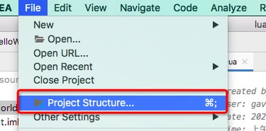

[TOC]

##  目录

- [1. 分布式限流概述](#1-分布式限流概述)
- [2. 分布式限流的几种纬度](#2-分布式限流的几种纬度)
- [3. 分布式限流的主流方案](#3-分布式限流的主流方案)
- [4. 限流方案常用算法分析](#4-限流方案常用算法分析)
- [5. 使用Guava RateLimiter实现客户端限流](#5-使用GuavaRateLimiter实现客户端限流)
- [6. 使用Nginx实现分布式限流](#6-使用Nginx实现分布式限流)
- [7. 基于Redis+Lua的分布式限流](#7-基于Redis+Lua的分布式限流)
- [8. Redis+Lua实现分布式限流服务](#8-Redis+Lua实现分布式限流服务)
- [9. 限流方法封装成注解进行使用](#9-限流方法封装成注解进行使用)
- [10. 分布式限流设计中要注意的问题](#10-分布式限流设计中要注意的问题)


# 分布式限流设计

## 1. 分布式限流概述

我们先一起想一下大家在日常生活中有没有被限流的经历

降低系统压力最有效的方式就是减少访问流量，就是把用户拒之门外。比如说，我可以给用户一句“服务正忙”的提示，将用户请求丢弃不管。但是这种方式又不太友好，那怎样才能通过看不出的方式把用户流量限制住呢？答案在这里：

大家在过年过节的时候应该都买过火车票，应该都经历过12306让你从验证图里找出你完全分不清的两个人

这就是赤裸裸的限流方法：业务限流。

当你面对这么一堆验证码图片，不管你怎么选，即使你用毕生所学选出了正确答案，提交后依然都会被告知你选错了。要么就是让你面对一堆鬼都看不出是什么东西的图片。不要怀疑自己的智商，其实，这就是网站业务限流的高明之处。在拷问用户智商的同时，通过这种“故意”刁难的手段，光明正大地限制访问流量，从而大幅降低系统的访问压力，真不得不敬佩产品经理的智(良)慧(心)。

## 2. 分布式限流的几种纬度

对一般的限流场景来说它具有两个维度的信息：

- **时间**：限流基于某段时间范围或者某个时间点，也就是我们常说的“时间窗口”，比如对每分钟、每秒钟的时间窗口做限定
- **资源**：基于可用资源的限制，比如设定最大访问次数，或最高可用连接数

上面两个维度结合起来看，限流就是在某个时间窗口对资源访问做限制，比如设定每秒最多100个访问请求。但在真正的场景里，我们不止设置一种限流规则，而是会设置多个限流规则共同作用，主要的几种限流规则如下：


### 2.1. QPS和连接数控制

针对上图中的连接数和QPS(query per second)限流来说，我们可以设定IP维度的限流，也可以设置基于单个服务器的限流。在真实环境中通常会设置多个维度的限流规则，比如设定同一个IP每秒访问频率小于10，连接数小于5，再设定每台机器QPS最高1000，连接数最大保持200。更进一步，我们可以把某个服务器组或整个机房的服务器当做一个整体，设置更high-level的限流规则，这些所有限流规则都会共同作用于流量控制。

在稍后的小节里，我们的实践Demo部分将主要围绕在QPS和连接数控制的限流规则。

### 2.2. 传输速率

对于“传输速率”大家都不会陌生，比如资源的下载速度。有的网站在这方面的限流逻辑做的更细致，比如普通注册用户下载速度为100k/s，购买会员后是10M/s，这背后就是基于用户组或者用户标签的限流逻辑。

在稍后的小节我们会给大家展示如何在Nginx中限制传输速度。

### 2.3. 黑白名单

黑白名单是各个大型企业应用里很常见的限流和放行手段，而且黑白名单往往是动态变化的。举个例子，如果某个IP在一段时间的访问次数过于频繁，被系统识别为机器人用户或流量攻击，那么这个IP就会被加入到黑名单，从而限制其对系统资源的访问，这就是我们俗称的“封IP”。

我们平时见到的爬虫程序，比如说爬知乎上的美女图片，或者爬券商系统的股票分时信息，这类爬虫程序都必须实现更换IP的功能，以防被加入黑名单。有时我们还会发现公司的网络无法访问12306这类大型公共网站，这也是因为某些公司的出网IP是同一个地址，因此在访问量过高的情况下，这个IP地址就被对方系统识别，进而被添加到了黑名单。使用家庭宽带的同学们应该知道，大部分网络运营商都会将用户分配到不同出网IP段，或者时不时动态更换用户的IP地址。

白名单就更好理解了，相当于御赐金牌在身，可以自由穿梭在各种限流规则里，畅行无阻。比如某些电商公司会将超大卖家的账号加入白名单，因为这类卖家往往有自己的一套运维系统，需要对接公司的IT系统做大量的商品发布、补货等等操作。

### 2.4. 分布式环境

所谓的分布式限流，其实道理很简单，一句话就可以解释清楚。分布式区别于单机限流的场景，它把整个分布式环境中所有服务器当做一个整体来考量。比如说针对IP的限流，我们限制了1个IP每秒最多10个访问，不管来自这个IP的请求落在了哪台机器上，只要是访问了集群中的服务节点，那么都会受到限流规则的制约。

从上面的例子不难看出，我们必须将限流信息保存在一个“中心化”的组件上，这样它就可以获取到集群中所有机器的访问状态，目前有两个比较主流的限流方案：

- **网关层限流** 将限流规则应用在所有流量的入口处
- **中间件限流** 将限流信息存储在分布式环境中某个中间件里（比如Redis缓存），每个组件都可以从这里获取到当前时刻的流量统计，从而决定是拒绝服务还是放行流量

## 3. 分布式限流的主流方案

### 3.1. 客户端限流

说起Guava大家一定不陌生，它是Google出品的一款工具包（com.google.guava），我们经常用它做一些集合操作比如`Lists.newArrayList()`，它最早源于2007年的"Google Collections Library"项目。Guava不甘于将自己平凡的一生都耗费在Collections上面，于是乎它开始了转型，慢慢扩展了自己在Java领域的影响力，从反射工具、函数式编程、安全验证、数学运算等等方面，都提供了相应的工具包。

在限流这个领域中，Guava也贡献了一份绵薄之力，在其多线程模块下提供了以RateLimiter为首的几个限流支持类。我们前面提到了，Guava是一个客户端组件，也就是说它的作用范围仅限于“当前”这台服务器，不能对集群以内的其他服务器施加流量控制


比如目前我有2台服务器[Server 1，Server 2]，这两台服务器都部署了一个登陆服务，假如我希望对这两台机器的流量进行控制，比如将两台机器的访问量总和控制在每秒20以内，如果用Guava来做，只能独立控制每台机器的访问量<=10。

尽管Guava不是面对分布式系统的解决方案，但是其作为一个简单轻量级的客户端限流组件，非常适合来讲解限流算法，稍后的章节我们将使用Guava做一个热身，让大家对限流的算法理论有了大致的了解以后，再学习其他的分布式限流方案。

### 3.2. 网关层限流

在整个分布式系统中，服务网关，作为整个分布式链路中的第一道关卡，承接了所有用户来访请求

我们将系统流量的分布层次抽象成一个简单的漏斗模型来看


上面是一个最普通的流量模型，从上到下的路径依次是：

1. 用户流量从网关层转发到后台服务
2. 后台服务承接流量，调用缓存获取数据
3. 缓存中无数据，则访问数据库

为什么说它是一个漏斗模型，因为流量自上而下是逐层递减的，在网关层聚集了最多最密集的用户访问请求，其次是后台服务。然后经过后台服务的验证逻辑之后，刷掉了一部分错误请求，剩下的请求落在缓存上，如果缓存中没有数据才会请求漏斗最下方的数据库，因此数据库层面请求数量最小（相比较其他组件来说数据库往往是并发量能力最差的一环，虽然数据库可以做主从方式读写分离，但单机并发量也无法和Redis、Kafka之类的组件相比）

如果在上面这个漏斗模型中做流量限制，在网关层再适合不过了，因为它是整个访问链路的源头，是所有流量途径的第一站。目前主流的网关层有以软件为代表的Nginx，还有Spring Cloud中的Gateway和Zuul这类网关层组件，也有以硬件+软件为代表的F5

### 3.3. 中间件限流

在分布式系统业务中如果服务之间的调用还是用Nginx这类中间件容器肯定是不便于管理的，那么就需要一个类似中心节点的地方存储限流数据。如果我希望控制接口的访问速率为每秒100个请求，那么我就需要将当前1s内已经接收到的请求的数量保存在某个地方，并且可以让集群环境中所有节点都能访问。那我们可以用什么技术来存储这个临时数据呢？Redis是一个非常不错的选择。

Redis简直就是为服务端限流量身打造的利器。利用Redis过期时间特性，我们可以轻松设置限流的时间跨度（比如每秒10个请求，或者每10秒10个请求）。同时Redis还有一个特殊方式–Lua脚本编程，我们可以将限流逻辑编写成一段脚本植入到Redis中，这样就将限流的重任从服务层完全剥离出来，同时Redis强大的并发量特性以及高可用集群架构也可以很好的支持庞大集群的限流访问。

### 3.4. 限流组件

除了上面介绍的几种方式以外，目前也有一些开源组件提供了类似的功能，比如Sentinel就是一个不错的选择。Sentinel是阿里出品的开源组件，并且包含在了Spring Cloud Alibaba组件库中，后面在微服务部分将详细讲解Sentinel在分布式限流中的应用。

## 4. 限流方案常用算法分析

无论是Guava还是Nginx、Redis限流。到最后都是应用几种具体的限流算法

常见的限流算法们挑选令牌桶算法、漏桶算法、滑动窗口和计数器算法来讲一下

### 4.1. 令牌桶算法

Token Bucket令牌桶算法是目前应用最为广泛的限流算法，顾名思义，它有以下两个关键角色：

1. **令牌** 获取到令牌的Request才会被处理，其他Requests要么排队要么被直接丢弃
2. **桶** 用来装令牌的地方，所有Request都从这个桶里面获取令牌


#### 4.1.1. 令牌生成

这个流程涉及到令牌生成器和令牌桶，前面我们提到过令牌桶是一个装令牌的地方，既然是个桶那么必然有一个容量，也就是说令牌桶所能容纳的令牌数量是一个固定的数值。

对于令牌生成器来说，它会根据一个预定的速率向桶中添加令牌，比如我们可以配置让它以每秒100个请求的速率发放令牌，或者每分钟50个。注意这里的发放速度是匀速，也就是说这50个令牌并非是在每个时间窗口刚开始的时候一次性发放，而是会在这个时间窗口内匀速发放。

令牌发放器就是一个水龙头，假如在下面接水的桶子满了，那么自然这个水（令牌）就流到了外面。在令牌发放过程中也一样，令牌桶的容量是有限的，如果当前已经放满了额定容量的令牌，那么新来的令牌就会被丢弃掉。

**思考题**：大家知道为什么要匀速发放吗？先自己思考一下。在这一章的最后一个小节里，我们再来探讨匀速限流和非匀速限流的区别，以及这里面可能会踩到的坑。

#### 4.1.2. 令牌获取

每个访问请求到来后，必须获取到一个令牌才能执行后面的逻辑。假如令牌的数量少，而访问请求较多的情况下，一部分请求自然无法获取到令牌，那么这个时候我们可以设置一个“缓冲队列”来暂存这些多余的请求。

缓冲队列其实是一个可选的选项，并不是所有应用了令牌桶算法的程序都会实现队列。当有缓存队列存在的情况下，那些暂时没有获取到令牌的请求将被放到这个队列中排队，直到新的令牌产生后，再从队列头部拿出一个请求来匹配令牌。

当队列已满的情况下，这部分访问请求将被丢弃。在实际应用中我们还可以给这个队列加一系列的特效，比如设置队列中请求的存活时间，或者将队列改造为PriorityQueue，根据某种优先级排序，而不是先进先出。算法是死的，人是活的，先进的生产力来自于不断的创造，在技术领域尤其如此。

### 4.2. 漏桶算法


漏桶算法的前半段和令牌桶类似，但是操作的对象不同，令牌桶是将令牌放入桶里，而漏桶是将访问请求的数据包放到桶里。同样的是，如果桶满了，那么后面新来的数据包将被丢弃。

漏桶算法的后半程是有鲜明特色的，它永远只会以一个恒定的速率将数据包从桶内流出。打个比方，如果我设置了漏桶可以存放100个数据包，然后流出速度是1s一个，那么不管数据包以什么速率流入桶里，也不管桶里有多少数据包，漏桶能保证这些数据包永远以1s一个的恒定速度被处理。

### 4.3. 漏桶 vs 令牌桶的区别

根据它们各自的特点不难看出来，这两种算法都有一个“恒定”的速率和“不定”的速率。令牌桶是以恒定速率创建令牌，但是访问请求获取令牌的速率“不定”，反正有多少令牌发多少，令牌没了就干等。而漏桶是以“恒定”的速率处理请求，但是这些请求流入桶的速率是“不定”的。

从这两个特点来说，漏桶的天然特性决定了它不会发生突发流量，就算每秒1000个请求到来，那么它对后台服务输出的访问速率永远恒定。而令牌桶则不同，其特性可以“预存”一定量的令牌，因此在应对突发流量的时候可以在短时间消耗所有令牌，其突发流量处理效率会比漏桶高，但是导向后台系统的压力也会相应增多。

### 4.4. 滑动窗口和计数器


上图中黑色的大框就是时间窗口，我们设定窗口时间为5秒，它会随着时间推移向后滑动。我们将窗口内的时间划分为五个小格子，每个格子代表1秒钟，同时这个格子还包含一个计数器，用来计算在当前时间内访问的请求数量。那么这个时间窗口内的总访问量就是所有格子计数器累加后的数值。

比如说，我们在第一秒内有5个用户访问，第5秒内有10个用户访问，那么在0到5秒这个时间窗口内访问量就是15。如果我们的接口设置了时间窗口内访问上限是20，那么当时间到第六秒的时候，这个时间窗口内的计数总和就变成了10，因为1秒的格子已经退出了时间窗口，因此在第六秒内可以接收的访问量就是20-10=10个。

滑动窗口其实也是一种计算器算法，它有一个显著特点，当时间窗口的跨度越长时，限流效果就越平滑。打个比方，如果当前时间窗口只有两秒，而访问请求全部集中在第一秒的时候，当时间向后滑动一秒后，当前窗口的计数量将发生较大的变化，拉长时间窗口可以降低这种情况的发生概率

## 5. 使用GuavaRateLimiter实现客户端限流

### 5.1. 非阻塞式限流

POM依赖

```xml
        <dependency>
            <groupId>com.google.guava</groupId>
            <artifactId>guava</artifactId>
            <version>28.2-jre</version>
        </dependency>

        <dependency>
            <groupId>com.google.guava</groupId>
            <artifactId>guava</artifactId>
            <version>28.2-jre</version>
        </dependency>
```

Controller代码

```java
package com.icodingedu.limitproject.controller;

import com.google.common.util.concurrent.RateLimiter;
import lombok.extern.slf4j.Slf4j;
import org.springframework.stereotype.Controller;
import org.springframework.web.bind.annotation.GetMapping;
import org.springframework.web.bind.annotation.ResponseBody;

@Controller
@Slf4j
public class LimitController {
    //允许这个限流组件每秒发放两个令牌
    RateLimiter rateLimiter = RateLimiter.create(2.0);

    //非阻塞限流
    //count:是每秒消耗令牌数量
    @GetMapping("/tryAcquire")
    @ResponseBody
    public String tryAcquire(Integer count){
        //如果每秒消耗1个,一秒可以接收2次,消耗2个则1秒接收1个,消耗4个则需要2秒
        if(rateLimiter.tryAcquire(count)){
            log.info("success rate is {}",rateLimiter.getRate());
            return "success";
        }else{
            log.info("fail rate is {}",rateLimiter.getRate());
            return "fail";
        }
    }
}
```

增加请求的时间间隔

```java
package com.icodingedu.limitproject.controller;

import com.google.common.util.concurrent.RateLimiter;
import lombok.extern.slf4j.Slf4j;
import org.springframework.stereotype.Controller;
import org.springframework.web.bind.annotation.GetMapping;
import org.springframework.web.bind.annotation.ResponseBody;

import java.util.concurrent.TimeUnit;

@Controller
@Slf4j
public class LimitController {
    //允许这个限流组件每秒发放两个令牌
    RateLimiter rateLimiter = RateLimiter.create(2.0);

    //非阻塞限流
    //count:是每秒消耗令牌数量
    @GetMapping("/tryAcquireWithTimeout")
    @ResponseBody
    public String tryAcquireWithTimeout(Integer count,Integer timeout){
        //如果每秒消耗1个,一秒可以接收2次,消耗2个则1秒接收1个,消耗4个则需要2秒
        //timeout是指请求的时间间隔
        if(rateLimiter.tryAcquire(count,timeout, TimeUnit.SECONDS)){
            log.info("success rate is {}",rateLimiter.getRate());
            return "success";
        }else{
            log.info("fail rate is {}",rateLimiter.getRate());
            return "fail";
        }
    }
}

//测试方式PoStMAN
http://localhost:8080/tryAcquire?count=10&timeout=5
```

**这里需要注意的点：为什么限制了5秒，但第一次却直接返回了，这就涉及限流预热的问题了，首次执行直接返回，后续的执行调用按照时间间隔进行**

### 5.2. 阻塞式限流

```java
    //使用阻塞式进行限流
    @GetMapping("/acquire")
    @ResponseBody
    public String acqurie(Integer count){
        rateLimiter.acquire(count);
        log.info("success rate is {}",rateLimiter.getRate());
        return "success";
    }
```

令牌不够则等待令牌获取够了才执行后续内容

**目前使用Guava RateLimiter是单机限流，还不是分布式限流，只在单机限流访问**

## 6. 使用Nginx实现分布式限流

### 6.1. 来源IP限流

```shell
# 根据IP地址限制速度
# 1.第一个参数:$binary_remote_addr
#   binary_目的是缩写内存占用，remote_addr表示通过IP地址来限流
# 2.第二个参数 zone=iplimit:20m
#   iplimit是一块内存区域自定义名称(记录访问频率信息)，20m是指这块内存区域的大小
# 3.第三个参数 rate=1r/s
#   比如100r/m，标识访问的限流频率
limit_req_zone $binary_remote_addr zone=iplimit:20m rate=1r/s;

server {
	server_name limit.icodingedu.com;
	location /access-limit/ {
		proxy_pass http://127.0.0.1:8080/;
		# 1.zone=iplimit:引用zone中的变量
		# 2.burst=2,设置一个大小为2的缓冲区域,当大量请求到来时
		#   请求数量超过限流频率时,将其放入缓冲区
		# 3.nodelay:缓存区满了以后直接返回503
		limit_req zone=iplimit burst=2 nodelay;
	}
}
```

### 6.2. 服务器级别做限流

```shell
# 根据IP地址限制速度
# 1.第一个参数:$binary_remote_addr
#   binary_目的是缩写内存占用，remote_addr表示通过IP地址来限流
# 2.第二个参数 zone=iplimit:20m
#   iplimit是一块内存区域自定义名称(记录访问频率信息)，20m是指这块内存区域的大小
# 3.第三个参数 rate=1r/s
#   比如100r/m，标识访问的限流频率
limit_req_zone $binary_remote_addr zone=iplimit:20m rate=10r/s;

# 根据服务器级别做限流
limit_req_zone $server_name zone=serverlimit:10m rate=1r/s;

server {
	server_name limit.icodingedu.com;
	location /access-limit/ {
		proxy_pass http://127.0.0.1:8080/;
		# 1.zone=iplimit:引用zone中的变量
		# 2.burst=2,设置一个大小为2的缓冲区域,当大量请求到来时
		#   请求数量超过限流频率时,将其放入缓冲区
		# 3.nodelay:缓存区满了以后直接返回503
		limit_req zone=iplimit burst=2 nodelay;

		# 基于服务器级别的限制
		# 通常情况下,server级别的限流速率是最大的,这里做测试所以小
		limit_req zone=serverlimit burst=1 nodelay;
	}
}
```

### 6.3. 基于连接数的限制

```shell
# 根据IP地址限制速度
# 1.第一个参数:$binary_remote_addr
#   binary_目的是缩写内存占用，remote_addr表示通过IP地址来限流
# 2.第二哥参数 zone=iplimit:20m
#   iplimit是一块内存区域自定义名称(记录访问频率信息)，20m是指这块内存区域的大小
# 3.第三个参数 rate=1r/s
#   比如100r/m，标识访问的限流频率
limit_req_zone $binary_remote_addr zone=iplimit:10m rate=10r/s;

# 根据服务器级别做限流
limit_req_zone $server_name zone=serverlimit:10m rate=100r/s;

# 基于IP的连接数的配置
limit_conn_zone $binary_remote_addr zone=perip:10m;
# 基于服务器的连接数的配置
limit_conn_zone $server_name zone=perserver:10m;

server {
	server_name limit.icodingedu.com;
	location /access-limit/ {
		proxy_pass http://127.0.0.1:8080/;
		# 1.zone=iplimit:引用zone中的变量
		# 2.burst=2,设置一个大小为2的缓冲区域,当大量请求到来时
		#   请求数量超过限流频率时,将其放入缓冲区
		# 3.nodelay:缓存区满了以后直接返回503
		limit_req zone=iplimit burst=2 nodelay;

		# 基于服务器级别的限制
		# 通常情况下,server级别的限流速率是最大的,这里做测试所以小
		limit_req zone=serverlimit burst=1 nodelay;

		# 当前服务器同一时间保持的连接数
		limit_conn perserver 100;
		# 一个ip同一时间保持的连接数
		limit_conn perip 1;
		# 出现限流后的异常code
		# 对请求数做异常
		limit_req_status 504;
		# 对连接数做异常
		limit_conn_status 504;
	}
}
```

这里测试同一时间同一IP的连接数限制，访问一个传入5秒，另一个传入0秒看是否触发504

```java
    @GetMapping("/nginx-conn")
    @ResponseBody
    public String nginxConn(int sec){
        try {
            Thread.sleep(1000 * sec);
        }catch (Exception ex){
            ex.printStackTrace();
        }
        return "success";
    }
```

限制流量，将下载访问限流，在下载100m后进行限流

```shell
server {
	server_name limit.icodingedu.com;
	location /access-limit/ {
		proxy_pass http://127.0.0.1:8080/;
		# 1.zone=iplimit:引用zone中的变量
		# 2.burst=2,设置一个大小为2的缓冲区域,当大量请求到来时
		#   请求数量超过限流频率时,将其放入缓冲区
		# 3.nodelay:缓存区满了以后直接返回503
		limit_req zone=iplimit burst=2 nodelay;

		# 基于服务器级别的限制
		# 通常情况下,server级别的限流速率是最大的,这里做测试所以小
		limit_req zone=serverlimit burst=1 nodelay;

		# 当前服务器同一时间保持的连接数
		limit_conn perserver 100;
		# 一个ip同一时间保持的连接数
		limit_conn perip 1;
		# 出现限流后的异常code
		limit_req_status 504;
	}
	# 下载访问限流
	location /download/ {
		limit_rate_after 100m;
		limit_rate 256k;
	}
}
```

## 7. 基于Redis+Lua的分布式限流

### 7.1. 为什么选用Redis作为限流中间件

1. **性能** 前面的章节中大家已经系统学习了Redis，作为缓存组件，如果不采用持久化方案的话，Redis的大部分操作都是纯内存操作，性能十分优异
2. **线程安全** 只用单线程承接网络请求（其他模块仍然多线程），天然具有线程安全的特性，而且对原子性操作的支持非常到位
3. 限流服务不仅需要承接超高QPS，还需要保证限流逻辑的执行层面具备线程安全的特性。利用Redis的这些天然特性做限流，既能保证线程安全，也能保持良好的性能

**基于Redis限流的架构模式**

我们先来设想下Redis限流的工作模式，在一个限流场景中通常主要有三个角色


1. **限流请求** 需要被限流的对象
2. **限流规则** 定义一段程序或者脚本，当请求到来的时候执行
3. **存储介质** 用来存储限流信息的地方，比如令牌个数或者是访问请求的计数

在上面这个流程中，有一个需要大家思考的问题，那就是“限流逻辑”这块应该放到哪个地方。是放到服务入口里执行？还是放到Redis里执行？

我们假定这个服务入口就是我们的Java程序，在Java中执行一段限流逻辑并不会带来多大的性能压力，但是在一个限流逻辑里，我们往往需要发起多个Redis查询和修改指令，比如获取令牌这样一步，这里面就涉及到查询令牌、发放令牌等等步骤，这些步骤会发起多个Redis的请求指令，造成更多的网络开销。不光如此，我们还要保证这些操作是线程安全的，如此一来，在程序中就会涉及到资源锁定等复杂操作

那我们有没有一个更好的方案来规避这些问题呢？答案是肯定的，我们可以做这么一个假设，有这么一种脚本，它可以嵌入到Redis中去，那么对我们的系统来说就不用在一次限流控制中发送多次Redis访问命令，减少了大量不必要的网络开销，减轻了Redis的压力。假如Redis在执行这个脚本逻辑的过程中，是当做一个原子操作来做的，也就是说，脚本开始到结束的时间段内Redis都只盯着这个脚本执行，不会插入其他的命令，线程安全的问题也解决了，就类似数据库中的存储过程

### 7.2. Lua脚本介绍

Lua是一个很小巧精致的语言，它的诞生（1993年）甚至比JDK 1.0还要早。Lua是由标准的C语言编写的，它的源码部分不过2万多行C代码，甚至一个完整的Lua解释器也就200k的大小。

Lua往大了说是一个新的编程语言，往小了说就是一个脚本语言。对于有编程经验的同学，拿到一个Lua脚本大体上就能把业务逻辑理解了。不建议同学们花大工夫去学习Lua的技术细节，Lua就像Shell脚本一样，尽管简单，但是细节之处还是相当繁琐的。

> **学习Tips**：大家在学习一门技术的时候要有主线和支线之分。在我还在读书的时候，我周围很多同学是这样学技术的，买一本比砖头还厚的书（在十多年前纸质书籍还是主流），从第一页开始像推土机一样往后看，一个细节都不放过。事无巨细并不是一种好的学习方法，这就像很多女生喜欢用五颜六色的荧光笔在课本上划重点，划来划去一本书全部都是重点。花花绿绿，最后自己也分不清哪些是重点了。

- Lua可以进行嵌入式开发，插件开发
- Redis内置Lua解释器，执行过程原子性，支持脚本预编译
- 在IDEA中编写可以安装一个Lua插件：EmmyLua

### 7.3. Lua脚本简单示例

下载安装：http://www.lua.org/ftp/ 

```shell
# linux安装
wget http://www.lua.org/ftp/lua-5.3.5.tar.gz
tar -zxvf lua-5.3.5.tar.gz
cd lua-5.3.5
make linux test
make install
# MAC安装
wget http://www.lua.org/ftp/lua-5.3.5.tar.gz
tar -zxvf lua-5.3.5.tar.gz
cd lua-5.3.5
make macosx test
sudo make install
# make macosx test 之后出现下面内容说明安装成功了
# src/lua -v
# Lua 5.3.5  Copyright (C) 1994-2018 Lua.org, PUC-Rio
# sudo make instal 之后查看版本
# lua -v
# Lua 5.3.5  Copyright (C) 1994-2018 Lua.org, PUC-Rio
```

**安装Lua的插件到IDEA中**


**配置IDEA的Lua SDK**




添加完毕后创建项目即可，然后在项目里创建lua script写入脚本内容

创建一个HelloWorld.lua

```lua
print('hello world')
```

创建一个reteLimiter.lua

```lua
-- 模拟限流
-- 请求的key
local key = 'request key'
-- 限流的最大阀值=4
local limit = 4
-- 当前流量大小
local currentflow = 2
-- 是否超出流量阀值判断
if currentflow + 1 > limit then
    print 'reject'
    return false
else
    print 'accept'
    return true
end
```

### 7.4. 在Redis中加载Lua脚本

```shell
# eval执行lua脚本,script是lua脚本位置,numkeys是指定入参个数,后面key和arg是参数内容
127.0.0.1:6379> eval script numkeys key [key ...] arg [arg ...]

127.0.0.1:6379> eval "return 'hello reids+lua'" 0
# 根据实际输入值做参数输出
127.0.0.1:6379> eval "return {KEYS[1],ARGV[1],KEYS[2],ARGV[2]}" 2 Gavin Array 18 20

127.0.0.1:6379> eval "return {KEYS[1],KEYS[2],ARGV[1],ARGV[2]}" 2 Gavin Array 18 20

127.0.0.1:6379> eval "return {KEYS[1],ARGV[1],KEYS[2],ARGV[2]}" 0 Gavin Array 18 20
```

脚本预加载方式

```shell
127.0.0.1:6379> script load "return 'hello redis+lua'"
"53b2700be01e76aa1b060e09c828dae642520f2e"
127.0.0.1:6379> evalsha "53b2700be01e76aa1b060e09c828dae642520f2e" 0
# 连接字符串不能用+,要使用..加号是数学运算会报错
127.0.0.1:6379> script load "return 'hello redis+lua '..KEYS[1]"
127.0.0.1:6379> evalsha "84517612e8b0a51d40329e928629f8836489f725" 1 gavin 16

# 验证脚本id是否存在
127.0.0.1:6379> script exists "84517612e8b0a51d40329e928629f8836489f725"
# 清空缓存的脚本
127.0.0.1:6379> script flush
```

### 7.5. Redis+Lua限流组件封装

POM中加入redis的调用依赖

```xml
        <dependency>
            <groupId>org.springframework.boot</groupId>
            <artifactId>spring-boot-starter-data-redis</artifactId>
        </dependency>
```

创建Service建立脚本调用类

```java
package com.icodingedu.redislimiterproject.service;

import lombok.extern.slf4j.Slf4j;
import org.springframework.stereotype.Service;

@Service
@Slf4j
public class AccessLimiterService {
    /**
     *
     * @param key:业务唯一标识
     * @param limit:一秒内可以访问多少次
     */
    public void limitAccess(String key,Integer limit){
        //Request Lua Script
        //默认没有取到访问控制
        boolean acquire = false;
        if(!acquire){
            log.error("you access is block key is {}",key);
            throw new RuntimeException("You access is blocked");
        }
    }
}
```

再次改造Service类，引入真正的Redis脚本调用

```java
package com.icodingedu.redislimiterproject.service;

import com.google.common.collect.Lists;
import lombok.extern.slf4j.Slf4j;
import org.springframework.beans.factory.annotation.Autowired;
import org.springframework.data.redis.core.StringRedisTemplate;
import org.springframework.data.redis.core.script.RedisScript;
import org.springframework.stereotype.Service;

import javax.annotation.Resource;

@Service
@Slf4j
public class AccessLimiterService {

    @Autowired
    private StringRedisTemplate stringRedisTemplate;

    @Autowired
    private RedisScript<Boolean> rateLimitLua;

    /**
     *
     * @param key:业务唯一标识
     * @param limit:一秒内可以访问多少次
     */
    public void limitAccess(String key,Integer limit){
        //Request Lua Script
        //默认没有取到访问控制
        boolean acquire = stringRedisTemplate.execute(
                rateLimitLua,//Lua的脚本本身
                Lists.newArrayList(key),//Lua脚本中的key列表
                limit.toString()//Lua脚本的value列表
        );
        if(!acquire){
            log.error("you access is block key is {}",key);
            throw new RuntimeException("You access is blocked");
        }
    }
}
```

RedisConfiger类的配置

```java
package com.icodingedu.redislimiterproject.config;

import org.springframework.context.annotation.Bean;
import org.springframework.context.annotation.Configuration;
import org.springframework.core.io.ClassPathResource;
import org.springframework.data.redis.connection.RedisConnectionFactory;
import org.springframework.data.redis.core.RedisTemplate;
import org.springframework.data.redis.core.StringRedisTemplate;
import org.springframework.data.redis.core.script.DefaultRedisScript;

@Configuration
public class RedisConfiger {

    @Bean
    public RedisTemplate<String,String> redisTemplate(RedisConnectionFactory redisConnectionFactory){
        return new StringRedisTemplate(redisConnectionFactory);
    }

    @Bean
    public DefaultRedisScript loadRedisScript(){
        DefaultRedisScript redisScript = new DefaultRedisScript();
        //将lua脚本放到resource下
        redisScript.setLocation(new ClassPathResource("ratelimiter.lua"));
        redisScript.setResultType(java.lang.Boolean.class);//脚本通过返回true,限流返回false
        return redisScript;
    }
}
```

编写Lua脚本

```lua
-- 获取业务id
local busKey = KEYS[1]
redis.log(redis.LOG_DEBUG, 'key is', busKey)
-- 调用脚本传入的限流大小
local limit = tonumber(ARGV[1])

-- 获取当前流量大小,如果还没有就给默认值0
local count = tonumber(redis.call('get',busKey) or "0")

-- 是否超出流量限制
if count + 1 > limit then
    -- 超过了拒绝访问
    return false
else
    -- 没有超过给数量+1
    redis.call("incrby", busKey, 1)
    redis.call("expire", busKey, 1)
    return true
end
```

controller调用验证

```java
package com.icodingedu.redislimiterproject.controller;

import com.icodingedu.redislimiterproject.service.AccessLimiterService;
import org.springframework.beans.factory.annotation.Autowired;
import org.springframework.stereotype.Controller;
import org.springframework.web.bind.annotation.GetMapping;
import org.springframework.web.bind.annotation.ResponseBody;

@Controller
public class FlowController {

    @Autowired
    AccessLimiterService accessLimiterService;

    @GetMapping("/limiter")
    @ResponseBody
    public String redisRateLimiter(){
        accessLimiterService.limitAccess("service-key-001",1);
        return "success";
    }
}
```


## 8. Redis+Lua实现分布式限流服务

Nginx进行网关层限流如何设置跳转页面和返回Json提示

```shell
# 和location平台
				error_page 504 /504;
        location /504 {
                default_type application/json;
                add_header Content-Type 'text/html; charset=utf-8';
                return 200 '{"code":"666","msg":"访问高峰期..."}';
        }
# 跳转错误页面
error_page 504 https://www.baidu.com;
```

Service实现类

```java
package com.icodingedu.redislimiter.service;

import com.google.common.collect.Lists;
import lombok.extern.slf4j.Slf4j;
import org.springframework.beans.factory.annotation.Autowired;
import org.springframework.data.redis.core.StringRedisTemplate;
import org.springframework.data.redis.core.script.RedisScript;
import org.springframework.stereotype.Service;

@Service
@Slf4j
@Deprecated //标识这个类过期
public class AccessLimiterService {

    @Autowired
    private StringRedisTemplate stringRedisTemplate;

    @Autowired
    private RedisScript<Boolean> rateLimitLua;

    /**
     * @param key:业务唯一标识
     * @param limit:一秒内可以访问多少次
     */
    public void limitAccess(String key,Integer limit){
        //默认没有去到访问控制
        boolean acquire = stringRedisTemplate.execute(
                rateLimitLua,//Lua脚本本身
                Lists.newArrayList(key),//Lua脚本的key列表
                limit.toString() //Lua脚本的value列表
        );
        if(!acquire){
            log.error("yout accesss is block key is {}",key);
            throw new RuntimeException("You access is blocked");
        }
    }
}
```

Config实现

```java
package com.icodingedu.redislimiter.config;

import org.springframework.context.annotation.Bean;
import org.springframework.context.annotation.Configuration;
import org.springframework.core.io.ClassPathResource;
import org.springframework.data.redis.connection.RedisConnectionFactory;
import org.springframework.data.redis.core.RedisTemplate;
import org.springframework.data.redis.core.StringRedisTemplate;
import org.springframework.data.redis.core.script.DefaultRedisScript;

@Configuration
public class RedisConfiger {

    @Bean
    public RedisTemplate<String,String> redisTemplate(RedisConnectionFactory redisConnectionFactory){
        return new StringRedisTemplate(redisConnectionFactory);
    }

    @Bean
    public DefaultRedisScript loadRedisScript(){
        DefaultRedisScript redisScript = new DefaultRedisScript();
        //Lua脚本放到resource下
        redisScript.setLocation(new ClassPathResource("ratelimiter.lua"));
        redisScript.setResultType(java.lang.Boolean.class);
        return redisScript;
    }
}
```

Lua脚本放在Resource下

```lua
-- 获取业务id
local busKey = KEYS[1]

-- 调用闯入的限流大小
local limit = tonumber(ARGV[1])

-- 获取当前流量大小,如果没有就给默认值0
local count = tonumber(redis.call('get',busKey) or "0")

-- 是否超出流量限制
if count + 1 > limit then
    -- 超出了拒绝访问
    return false
else
    -- 没有超出就给当前访问量+1
    redis.call("incrby",busKey,1)
    redis.call("expire",busKey,1)
    return true
end
```

properties

```properties
spring.redis.port=6379
spring.redis.database=0
spring.redis.host=localhost
```

controller实现

```java
package com.icodingedu.redislimiter.controller;

import com.icodingedu.redislimiter.annotation.AccessLimiter;
import com.icodingedu.redislimiter.service.AccessLimiterService;
import org.springframework.beans.factory.annotation.Autowired;
import org.springframework.web.bind.annotation.GetMapping;
import org.springframework.web.bind.annotation.RestController;

@RestController
public class FlowController {

    @Autowired
    AccessLimiterService accessLimiterService;

    @GetMapping("/limiter")
    public String redisRateLimter(){
        accessLimiterService.limitAccess("server-key-001",1);
        return "success";
    }
}
```

## 9. 限流方法封装成注解进行使用

通过自己写的注解方式来实现Redis限流

加入AOP的POM

```xml
		<dependency>
			<groupId>org.springframework.boot</groupId>
			<artifactId>spring-boot-starter-aop</artifactId>
		</dependency>
```

annotation编写

```java
package com.icodingedu.redislimiter.annotation;

import java.lang.annotation.*;

@Retention(RetentionPolicy.RUNTIME)
@Documented
@Target({ElementType.METHOD})
public @interface AccessLimiter {
    int limit();
    String busKey() default "";
}
```

切面代码实现

```java
package com.icodingedu.redislimiter.annotation;

import com.google.common.collect.Lists;
import io.netty.util.internal.StringUtil;
import lombok.extern.slf4j.Slf4j;
import org.aspectj.lang.JoinPoint;
import org.aspectj.lang.annotation.Aspect;
import org.aspectj.lang.annotation.Before;
import org.aspectj.lang.annotation.Pointcut;
import org.aspectj.lang.reflect.MethodSignature;
import org.checkerframework.checker.units.qual.C;
import org.springframework.beans.factory.annotation.Autowired;
import org.springframework.data.redis.core.StringRedisTemplate;
import org.springframework.data.redis.core.script.RedisScript;
import org.springframework.stereotype.Component;

import java.lang.reflect.Method;
import java.util.Arrays;
import java.util.stream.Collectors;

@Component
@Slf4j
@Aspect
public class AccessLimiterAspect {

    @Autowired
    private StringRedisTemplate stringRedisTemplate;

    @Autowired
    private RedisScript<Boolean> rateLimitLua;


    //创建一个切面点
    //什么时候进入这个切面，只要用了AccessLimiter这个注解就被切点捕获
    @Pointcut("@annotation(com.icodingedu.redislimiter.annotation.AccessLimiter)")
    public void cut(){
        log.info("cut ratelimiter");
    }

    @Before("cut()")
    public void before(JoinPoint joinPoint){
        //切面中想获得注解的参数，通过反射拿到方法，再通过方法拿注解
        MethodSignature signature = (MethodSignature)joinPoint.getSignature();
        Method method = signature.getMethod();
        AccessLimiter accessLimiter = method.getAnnotation(AccessLimiter.class);
        if(accessLimiter==null){
            return;
        }
        String key = accessLimiter.busKey();
        Integer limit = accessLimiter.limit();
        if(StringUtil.isNullOrEmpty(key)){
            Class[] type = method.getParameterTypes();
            key = method.getName();//获得方法名
            if(type!=null){
                String paramTypes = Arrays.stream(type)
                                    .map(Class::getName)
                                    .collect(Collectors.joining(","));
                log.info("param type : "+paramTypes);
                key += "#"+paramTypes;
                log.info("*=key=* : "+key);
            }
        }

        //默认没有去到访问控制
        boolean acquire = stringRedisTemplate.execute(
                rateLimitLua,//Lua脚本本身
                Lists.newArrayList(key),//Lua脚本的key列表
                limit.toString() //Lua脚本的value列表
        );
        if(!acquire){
            log.error("yout accesss is block key is {}",key);
            throw new RuntimeException("You access is blocked");
        }
    }
}
```

controller实现

```java
package com.icodingedu.redislimiter.controller;

import com.icodingedu.redislimiter.annotation.AccessLimiter;
import com.icodingedu.redislimiter.service.AccessLimiterService;
import org.springframework.beans.factory.annotation.Autowired;
import org.springframework.web.bind.annotation.GetMapping;
import org.springframework.web.bind.annotation.RestController;

@RestController
public class FlowController {

    @Autowired
    AccessLimiterService accessLimiterService;

    @GetMapping("/limiter")
    public String redisRateLimter(){
        accessLimiterService.limitAccess("server-key-001",1);
        return "success";
    }

    @GetMapping("/annotation")
    @AccessLimiter(limit = 1)
    public String testAnnotation(String name,Integer age){
        return "success";
    }
}
```

## 10. 分布式限流设计中要注意的问题

### 10.1. 为什么要匀速生成令牌

Guava RateLimiter的方式，生成令牌来进行限流是通过匀速的方式生成

如果不是匀速的方式在每一秒开始的时候一下就生成完令牌会有什么问题？

- 令牌的利用率降低
- 并且等待新令牌的时间就会增加

### 10.2. 限流组件如果失效

当限流组件失效的时候，默认是不启用限流服务的

拒绝外部请求所带来的损失远大于放行请求暴露出的潜在破绽要大的多

### 10.3. 如何确定限流的上界

要进行系统的压力测试

压测不仅仅是无脑的打高流量找系统的极限，而是在一个合理的预估访问量级之下对系统进行全方位摸底，执行全链路压测，不仅仅是包含压力测试、故障演练、异地多活，弹性伸缩，服务降级等其他复杂流程的总和

所以在确定限流上界之前，要根据当前业务评估一个合理的访问量，再乘以一个系数（比如1.2）保证当前系统有一部分设计余量