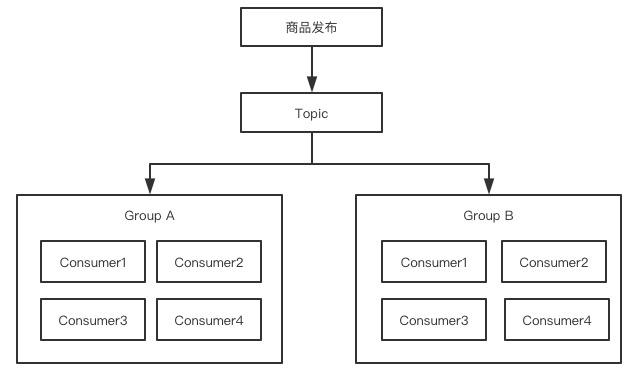
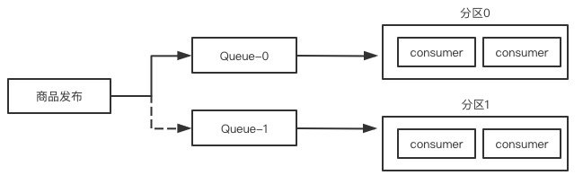
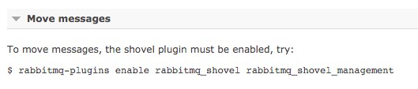
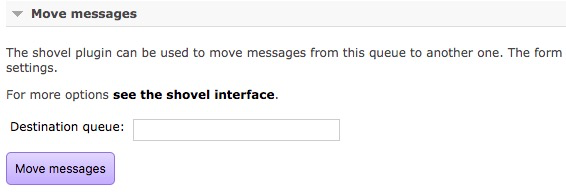

[TOC]

## 目录

- [1. 消息驱动在微服务中的应用](#1-消息驱动在微服务中的应用)
- [2. Stream体系结构](#2-Stream体系结构)
- [3. Stream快速落地](#3-Stream快速落地)
- [4. 实现Stream的消息发布订阅](#4-实现Stream的消息发布订阅)
- [5. 消费组和消息分区详解](#5-消费组和消息分区详解)
- [6. Stream实现延时消息](#6-Stream实现延时消息)
- [7. Stream实现本地重试](#7-Stream实现本地重试)
- [8. Stream实现消息重新入队](#8-Stream实现消息重新入队)
- [9. 异常情况导致消息无法消费的解决方案](#9-异常情况导致消息无法消费的解决方案)
- [10. Stream借助死信队列实现异常处理](#10-Stream借助死信队列实现异常处理)
- [11. 消息驱动中的降级和接口升版](#11-消息驱动中的降级和接口升版)


# SpringCloud消息组件-Stream

springcloud就是想通过这些全家桶的组件来屏蔽底层差异，使用springcloud的使用者只关注业务

## 1. 消息驱动在微服务中的应用

- 跨系统异步通信
  - 一般是公司内部使用消息队列来进行通信
  - 消息通信是非阻塞式，如果需要阻塞通信就需要HTTP或其他方式

- 系统应用解耦
- 流量削峰

## 2. Stream体系结构

SpringCloud Stream是基于SpringBoot构建的，专门为构建消息驱动服务设计的应用框架，它的底层是使用Spring Integration来为消息代理层提供网络连接支持的

- 应用模型：引入了三个角色，输入通道Input，输出通道Output和底层中间件的代理Binder（RMQ/Kafka）
- 适配层抽象：Stream将组件与底层中间件之间通信抽象成了Binder层，使得应用层不需要关心底层中间件是Kafka还是RabbitMQ，只关心自身业务逻辑即可
- 插件式的适配层：只需要将底层的依赖更换
- 持久化的发布订阅模型
- 消费组：Stream允许将多个consumer加入到一个消费组，如果有两个消费组同时订阅消费一个topic，这个topic的消息会下发到这两个消费者组，且组内无轮多少消费者一次只能有一个进行消费，组内进行负载均衡
- 消费分区：Strean支持在多个消费者实例之间创建分区，并将消息发送给指定的分区，分区内可以进行消息的负载均衡

## 3. Stream快速落地

创建一个新的stream目录，建立stream-server的module

创建POM依赖

```xml
<?xml version="1.0" encoding="UTF-8"?>
<project xmlns="http://maven.apache.org/POM/4.0.0"
         xmlns:xsi="http://www.w3.org/2001/XMLSchema-instance"
         xsi:schemaLocation="http://maven.apache.org/POM/4.0.0 http://maven.apache.org/xsd/maven-4.0.0.xsd">
    <parent>
        <artifactId>spring-cloud-project</artifactId>
        <groupId>com.icodingedu</groupId>
        <version>1.0-SNAPSHOT</version>
        <relativePath>../../pom.xml</relativePath>
    </parent>
    <modelVersion>4.0.0</modelVersion>
    <packaging>jar</packaging>
    <artifactId>stream-server</artifactId>
    <name>stream-server</name>

    <dependencies>
        <dependency>
            <groupId>org.springframework.boot</groupId>
            <artifactId>spring-boot-starter-web</artifactId>
        </dependency>
        <dependency>
            <groupId>org.springframework.boot</groupId>
            <artifactId>spring-boot-starter-actuator</artifactId>
        </dependency>
        <dependency>
            <groupId>org.springframework.cloud</groupId>
            <artifactId>spring-cloud-starter-stream-rabbit</artifactId>
        </dependency>
    </dependencies>
</project>
```

创建启动类application

```java
package com.icodingeud.springcloud;

import org.springframework.boot.WebApplicationType;
import org.springframework.boot.autoconfigure.SpringBootApplication;
import org.springframework.boot.builder.SpringApplicationBuilder;

@SpringBootApplication
public class StreamServerApplication {

    public static void main(String[] args) {
        new SpringApplicationBuilder(StreamServerApplication.class)
                .web(WebApplicationType.SERVLET)
                .run(args);
    }
}
```

创建消息体对象，新建一个entity包

```java
package com.icodingeud.springcloud.entity;

import lombok.AllArgsConstructor;
import lombok.Builder;
import lombok.Data;
import lombok.NoArgsConstructor;

@Data
@AllArgsConstructor
@NoArgsConstructor
@Builder
public class MessageBean {

    //生产者产生的消息体
    private String payload;
}
```

创建接收消息的业务对象，创建一个service包

```java
package com.icodingeud.springcloud.service;

import lombok.extern.slf4j.Slf4j;
import org.springframework.cloud.stream.annotation.EnableBinding;
import org.springframework.cloud.stream.annotation.StreamListener;
import org.springframework.cloud.stream.messaging.Sink;

@Slf4j
@EnableBinding(value = {
        Sink.class
})
public class StreamConsumer {
		//这里先使用stream给的默认topic
    @StreamListener(Sink.INPUT)
    public void consumer(Object payload){
        log.info("message consumed successfully, payload={}",payload);
    }
}
```

配置文件properties

```properties
spring.application.name=stream-server
server.port=63000
# RabbitMQ连接字符串
spring.rabbitmq.host=39.98.53.94
spring.rabbitmq.port=5672
spring.rabbitmq.username=guest
spring.rabbitmq.password=guest

management.security.enabled=false
management.endpoints.web.exposure.include=*
management.endpoint.health.show-details=always
```

启动项目后在rabbitMQ的queue中去查看创建了一个新的队列

## 4. 实现Stream的消息发布订阅

- 创建消息的Product服务，配置消息的topic
- 启动多个consumer节点测试消息广播

创建一个topic的包，建立自己的topic类

```java
package com.icodingeud.springcloud.topic;

import org.springframework.cloud.stream.annotation.Input;
import org.springframework.messaging.SubscribableChannel;

public interface MyTopic {

    String INPUT = "myTopic";

    //可以被订阅的通道
    //stream中input指接收消息端
    //output是生产发送消息端
    @Input(INPUT)
    SubscribableChannel input();
}
```

在consumer类里增加自己的topic接收，一个自定义的消息消费者就创建好了

```java
package com.icodingeud.springcloud.service;

import com.icodingeud.springcloud.topic.MyTopic;
import lombok.extern.slf4j.Slf4j;
import org.springframework.cloud.stream.annotation.EnableBinding;
import org.springframework.cloud.stream.annotation.StreamListener;
import org.springframework.cloud.stream.messaging.Sink;

@Slf4j
@EnableBinding(value = {
        Sink.class,
        MyTopic.class
})
public class StreamConsumer {
    //这里先使用stream给的默认topic
    @StreamListener(Sink.INPUT)
    public void consumer(Object payload){
        log.info("message consumed successfully, payload={}",payload);
    }

    @StreamListener(MyTopic.INPUT)
    public void consumerMyMessage(Object payload){
        log.info("My Message consumed successfully, payload={}",payload);
    }
}
```

接下来我们创建生产者，在MyTopic里定义消息生产者

```java
package com.icodingeud.springcloud.topic;

import org.springframework.cloud.stream.annotation.Input;
import org.springframework.cloud.stream.annotation.Output;
import org.springframework.messaging.MessageChannel;
import org.springframework.messaging.SubscribableChannel;

public interface MyTopic {

    String INPUT = "myTopic";

    //可以被订阅的通道
    //stream中input指接收消息端
    //output是生产发送消息端
    @Input(INPUT)
    SubscribableChannel input();

    //TODO 按照正常理解这里应该可以一样,我们先测试一下
    @Output(INPUT)
    MessageChannel output();
}
```

定义一个controller调用生产者来发送一条消息，创建一个controller的包

```java
package com.icodingeud.springcloud.controller;

import com.icodingeud.springcloud.topic.MyTopic;
import lombok.extern.slf4j.Slf4j;
import org.springframework.beans.factory.annotation.Autowired;
import org.springframework.messaging.support.MessageBuilder;
import org.springframework.web.bind.annotation.PostMapping;
import org.springframework.web.bind.annotation.RequestParam;
import org.springframework.web.bind.annotation.RestController;

@RestController
@Slf4j
public class StreamController {

    //这就是由stream给我完成注入和绑定了
    @Autowired
    private MyTopic producer;

    @PostMapping("send")
    public void sendMessage(@RequestParam("body") String body){
        producer.output().send(MessageBuilder.withPayload(body).build());
    }
}
```

再次启动项目，这个时候会出现错误

```shell
org.springframework.beans.factory.BeanDefinitionStoreException: Invalid bean definition with name 'myTopic' defined in com.icodingeud.springcloud.topic.MyTopic: bean definition with this name already exists
```

告诉你之前定义的myTopic重复了，虽然我们前面认为input和output应该用一个topic名，但这里相当于声明了两个一样名字的bean，spring启动会报错

两步处理

1、将input和output分开定义：但这里发送和接收就不在一个topic里了，就会导致各自发送和接收

```java
package com.icodingeud.springcloud.topic;

import org.springframework.cloud.stream.annotation.Input;
import org.springframework.cloud.stream.annotation.Output;
import org.springframework.messaging.MessageChannel;
import org.springframework.messaging.SubscribableChannel;

public interface MyTopic {

    String INPUT = "myTopic-consumer";
    
    String OUTPUT = "myTopic-producer";
    //可以被订阅的通道
    //stream中input指接收消息端
    //output是生产发送消息端
    @Input(INPUT)
    SubscribableChannel input();

    //TODO 按照正常理解这里应该可以一样,我们先测试一下
    @Output(OUTPUT)
    MessageChannel output();
}
```

2、通过配置文件将两个topic绑定到一起

```properties
# 将两个channel绑定到同一个topic上
spring.cloud.stream.bindings.myTopic-consumer.destination=mybroadcast
spring.cloud.stream.bindings.myTopic-producer.destination=mybroadcast
```

启动两个项目，去RMQ中看一下，发现mybroadcast其实就是exchange并绑定了两个queue

## 5. 消费组和消息分区详解

### 5.1. 消费组



在上面这个例子中，“商品发布”就是一个消息，它被放到了对应的消息队列中，有两拨人马同时盯着这个Topic，这两拨人马各自组成了一个Group，每次有新消息到来的时候，每个Group就派出一个代表去响应，而且是从这个Group中轮流挑选代表（负载均衡），这里的Group也就是我们说的消费者。

 ### 5.2. 消费分区



消费组相当于是每组派一个代表去办事儿，而消费分区相当于是专事专办，也就是说，所有消息都会根据分区Key进行划分，带有相同Key的消息只能被同一个消费者处理。

消息分区有一个预定义的分区Key，它是一个SpEL表达式。我们需要在配置文件中指定分区的总个数N，Stream就会为我们创建N个分区，这里面每个分区就是一个Queue（可以在RabbitMQ管理界面中看到所有的分区队列）。

当商品发布的消息被生产者发布时，Stream会计算得出分区Key，从而决定这个消息应该加入到哪个Queue里面。在这个过程中，每个消费组/消费者仅会连接到一个Queue，这个Queue中对应的消息只能被特定的消费组/消费者来处理。

### 5.3. 基于消息组实现轮询单播

先创建一个GroupTopic接口

```java
package com.icodingeud.springcloud.topic;

import org.springframework.cloud.stream.annotation.Input;
import org.springframework.cloud.stream.annotation.Output;
import org.springframework.messaging.MessageChannel;
import org.springframework.messaging.SubscribableChannel;

public interface GroupTopic {

    String INPUT = "group-consumer";

    String OUTPUT = "group-producer";

    @Input(INPUT)
    SubscribableChannel input();

    @Output(OUTPUT)
    MessageChannel output();
}
```

在controller里进行注入并加入消息生产者

```java
package com.icodingeud.springcloud.controller;

import com.icodingeud.springcloud.topic.GroupTopic;
import com.icodingeud.springcloud.topic.MyTopic;
import lombok.extern.slf4j.Slf4j;
import org.springframework.beans.factory.annotation.Autowired;
import org.springframework.messaging.support.MessageBuilder;
import org.springframework.web.bind.annotation.PostMapping;
import org.springframework.web.bind.annotation.RequestParam;
import org.springframework.web.bind.annotation.RestController;

@RestController
@Slf4j
public class StreamController {

    //这就是由stream给我完成注入和绑定了
    @Autowired
    private MyTopic producer;

    @Autowired
    private GroupTopic groupProducer;

    @PostMapping("send")
    public void sendMessage(@RequestParam("body") String body){
        producer.output().send(MessageBuilder.withPayload(body).build());
    }

    @PostMapping("sendgroup")
    public void sendGroupMessage(@RequestParam("body") String body){
        groupProducer.output().send(MessageBuilder.withPayload(body).build());
    }
}
```

创建消息消费者在consumer里进行添加

```java
package com.icodingeud.springcloud.service;

import com.icodingeud.springcloud.topic.GroupTopic;
import com.icodingeud.springcloud.topic.MyTopic;
import lombok.extern.slf4j.Slf4j;
import org.springframework.cloud.stream.annotation.EnableBinding;
import org.springframework.cloud.stream.annotation.StreamListener;
import org.springframework.cloud.stream.messaging.Sink;

@Slf4j
@EnableBinding(value = {
        Sink.class,
        MyTopic.class,
        GroupTopic.class
})
public class StreamConsumer {
    //这里先使用stream给的默认topic
    @StreamListener(Sink.INPUT)
    public void consumer(Object payload){
        log.info("message consumed successfully, payload={}",payload);
    }

    @StreamListener(MyTopic.INPUT)
    public void consumerMyMessage(Object payload){
        log.info("My Message consumed successfully, payload={}",payload);
    }

    @StreamListener(GroupTopic.INPUT)
    public void consumerGroupMessage(Object payload){
        log.info("Group Message consumed successfully, payload={}",payload);
    }
}
```

最后设置配置文件

```properties
spring.cloud.stream.bindings.group-consumer.destination=group-exchange
spring.cloud.stream.bindings.group-producer.destination=group-exchange
# 消费分组是对于消息的消费者来说的
spring.cloud.stream.bindings.group-consumer.group=Group-A
```

Group-A启动两个服务进行一下测试，看是否一次只接收一个消息并且是轮询接收

可以看一下这个在RMQ中的形式，其实是只创建了一个消息队列：group-exchange.Group-A

只有一个队列接收消息然后由stream转给其中一个消费者

可以把分组名改成Group-B后再创建两个端口实例测试一下，**每个消息被所有消费组中的一个消费者消费**

## 6. Stream实现延时消息

**前提：先要把RabbitMQ的延时插件：rabbitmq_delayed_message_exchange 安装好**

已安装插件查看命令：rabbitmq-plugins list

安装完成后在RMQ管理界面创建exchage那里可以看到type中增加了x-delayed-message类型就ok了

创建一个DelayedTopic

```java
package com.icodingeud.springcloud.topic;

import org.springframework.cloud.stream.annotation.Input;
import org.springframework.cloud.stream.annotation.Output;
import org.springframework.messaging.MessageChannel;
import org.springframework.messaging.SubscribableChannel;

public interface DelayedTopic {

    String INPUT = "delayed-consumer";

    String OUTPUT = "delayed-producer";

    @Input(INPUT)
    SubscribableChannel input();

    @Output(OUTPUT)
    MessageChannel output();
}
```

修改controller，加入DelayedTopic

```java
package com.icodingeud.springcloud.controller;

import com.icodingeud.springcloud.entity.MessageBean;
import com.icodingeud.springcloud.topic.DelayedTopic;
import com.icodingeud.springcloud.topic.GroupTopic;
import com.icodingeud.springcloud.topic.MyTopic;
import lombok.extern.slf4j.Slf4j;
import org.springframework.beans.factory.annotation.Autowired;
import org.springframework.messaging.support.MessageBuilder;
import org.springframework.web.bind.annotation.PostMapping;
import org.springframework.web.bind.annotation.RequestParam;
import org.springframework.web.bind.annotation.RestController;

@RestController
@Slf4j
public class StreamController {

    //这就是由stream给我们完成注入和绑定了
    @Autowired
    private MyTopic producer;

    @Autowired
    private GroupTopic groupProducer;

    @Autowired
    private DelayedTopic delayedProducer;

    @PostMapping("send")
    public void sendMessage(@RequestParam("body") String body){
        producer.output().send(MessageBuilder.withPayload(body).build());
    }

    @PostMapping("sendgroup")
    public void sendGroupMessage(@RequestParam("body") String body){
        groupProducer.output().send(MessageBuilder.withPayload(body).build());
    }

    @PostMapping("senddm")
    public void sendDelayedMessage(@RequestParam("body") String body,
                                   @RequestParam("second") Integer second){
        MessageBean messageBean = new MessageBean();
        messageBean.setPayload(body);
        log.info("***** 准备进入延迟发送队列.....");
        delayedProducer.output().send(MessageBuilder.withPayload(messageBean)
                                .setHeader("x-delay",1000 * second)
                                .build());
    }
}
```

修改consumer实现，增加DelayedTopic实现

```java
package com.icodingeud.springcloud.service;

import com.icodingeud.springcloud.entity.MessageBean;
import com.icodingeud.springcloud.topic.DelayedTopic;
import com.icodingeud.springcloud.topic.GroupTopic;
import com.icodingeud.springcloud.topic.MyTopic;
import lombok.extern.slf4j.Slf4j;
import org.springframework.cloud.stream.annotation.EnableBinding;
import org.springframework.cloud.stream.annotation.StreamListener;
import org.springframework.cloud.stream.messaging.Sink;

@Slf4j
@EnableBinding(value = {
        Sink.class,
        MyTopic.class,
        GroupTopic.class,
        DelayedTopic.class
})
public class StreamConsumer {
    //这里先使用stream给的默认topic
    @StreamListener(Sink.INPUT)
    public void consumer(Object payload){
        log.info("message consumed successfully, payload={}",payload);
    }

    @StreamListener(MyTopic.INPUT)
    public void consumerMyMessage(Object payload){
        log.info("My Message consumed successfully, payload={}",payload);
    }

    @StreamListener(GroupTopic.INPUT)
    public void consumerGroupMessage(Object payload){
        log.info("Group Message consumed successfully, payload={}",payload);
    }

    @StreamListener(DelayedTopic.INPUT)
    public void consumerDelayedMessage(MessageBean bean){
        log.info("Delayed Message consumed successfully, payload={}",bean.getPayload());
    }
}
```

增加配置文件

```properties
# 延迟消息配置
spring.cloud.stream.bindings.delayed-consumer.destination=delayed-exchange
spring.cloud.stream.bindings.delayed-producer.destination=delayed-exchange
# 声明exchange类型
spring.cloud.stream.rabbit.bindings.delayed-producer.producer.delayed-exchange=true
```

## 7. Stream实现本地重试

创建重试的Topic

```java
package com.icodingeud.springcloud.topic;

import org.springframework.cloud.stream.annotation.Input;
import org.springframework.cloud.stream.annotation.Output;
import org.springframework.messaging.MessageChannel;
import org.springframework.messaging.SubscribableChannel;

public interface ErrorTopic {

    String INPUT = "error-consumer";

    String OUTPUT = "error-producer";

    @Input(INPUT)
    SubscribableChannel input();
    
    @Output(OUTPUT)
    MessageChannel output();
}
```

修改controller进行消息发送

```java
    @Autowired
    private ErrorTopic errorProducer;

		//单机版错误重试
    @PostMapping("senderror")
    public void sendErrorMessage(@RequestParam("body") String body){
        errorProducer.output().send(MessageBuilder.withPayload(body).build());
    }
```

修改consumer

```java
package com.icodingeud.springcloud.service;

import com.icodingeud.springcloud.entity.MessageBean;
import com.icodingeud.springcloud.topic.DelayedTopic;
import com.icodingeud.springcloud.topic.ErrorTopic;
import com.icodingeud.springcloud.topic.GroupTopic;
import com.icodingeud.springcloud.topic.MyTopic;
import lombok.extern.slf4j.Slf4j;
import org.springframework.cloud.stream.annotation.EnableBinding;
import org.springframework.cloud.stream.annotation.StreamListener;
import org.springframework.cloud.stream.messaging.Sink;

import java.util.concurrent.atomic.AtomicInteger;

@Slf4j
@EnableBinding(value = {
        Sink.class,
        MyTopic.class,
        GroupTopic.class,
        DelayedTopic.class,
        ErrorTopic.class
})
public class StreamConsumer {

    //定一个一个线程安全的变量
    private AtomicInteger count = new AtomicInteger(1);

    //这里先使用stream给的默认topic
    @StreamListener(Sink.INPUT)
    public void consumer(Object payload){
        log.info("message consumed successfully, payload={}",payload);
    }

    @StreamListener(MyTopic.INPUT)
    public void consumerMyMessage(Object payload){
        log.info("My Message consumed successfully, payload={}",payload);
    }

    @StreamListener(GroupTopic.INPUT)
    public void consumerGroupMessage(Object payload){
        log.info("Group Message consumed successfully, payload={}",payload);
    }

    @StreamListener(DelayedTopic.INPUT)
    public void consumerDelayedMessage(MessageBean bean){
        log.info("Delayed Message consumed successfully, payload={}",bean.getPayload());
    }

    //异常重试单机版
    @StreamListener(ErrorTopic.INPUT)
    public void consumerErrorMessage(Object payload){
        log.info("****** 进入异常处理 ******");
        //计数器进来就自增1
        if(count.incrementAndGet() % 3 == 0){
            log.info("====== 完全没有问题! ======");
          	count.set(0);
        }else{
            log.info("----- what's your problem? -----");
            throw new RuntimeException("****** 整个人都不行了 ******");
        }
    }
}
```

配置properties文件

```properties
# 单机错误重试消息配置
spring.cloud.stream.bindings.error-consumer.destination=error-exchange
spring.cloud.stream.bindings.error-producer.destination=error-exchange
# 重试次数(本机重试,是在客户端这里不断重试而不会发回给RabbitMQ)
# 次数=1相当于不重试
spring.cloud.stream.bindings.error-consumer.consumer.max-attempts=2
```

**需要注意的点：**

- 本地重试，Consumer相当于从消息组件中处理了一个新消息。而Consumer重试的触发点是Stream本身，只是从业务逻辑层面进行重试，消费的是同一个消息。
- 而RMQ的NACK机制是将消息重回队列队首，这个重试是基于消息队列的，可以被其他Consumer拿到并进行消费的

## 8. Stream实现消息重新入队

首先要注意一点：Re-queue和前面的本地重试Retry是有冲突的，配置了Retry的消息就不会触发Re-queue

创建RequeueTopic

```java
package com.icodingeud.springcloud.topic;

import org.springframework.cloud.stream.annotation.Input;
import org.springframework.cloud.stream.annotation.Output;
import org.springframework.messaging.MessageChannel;
import org.springframework.messaging.SubscribableChannel;

public interface RequeueTopic {

    String INPUT = "requeue-consumer";

    String OUTPUT = "requeue-producer";

    @Input(INPUT)
    SubscribableChannel input();

    @Output(OUTPUT)
    MessageChannel output();
}
```

修改controller

```java
    @Autowired
    private RequeueTopic requeueProducer;

    @PostMapping("requeue")
    public void sendRequeueMessage(@RequestParam("body") String body){
        requeueProducer.output().send(MessageBuilder.withPayload(body).build());
    }
```

修改consumer

```java
@EnableBinding(value = {
        Sink.class,
        MyTopic.class,
        GroupTopic.class,
        DelayedTopic.class,
        ErrorTopic.class,
        RequeueTopic.class
})

    @StreamListener(RequeueTopic.INPUT)
    public void consumerRequeueMessage(Object payload){
        log.info("****** 进入入队异常处理 ******");
        try{
            Thread.sleep(3000);
        }catch (Exception ex){
            log.error("**** 延迟等待错误{} ****",ex);
        }
      	//让这个消息一直抛错
        throw new RuntimeException("****** 整个人都不行了 ******");
    }
```

修改配置文件properties

```properties
# 联机Requeue错误重试消息配置
spring.cloud.stream.bindings.requeue-consumer.destination=requeue-exchange
spring.cloud.stream.bindings.requeue-producer.destination=requeue-exchange
# 仅对当前consumer开启重新入队
spring.cloud.stream.rabbit.bindings.requeue-consumer.consumer.requeue-rejected=true
# 还要将本地重试次数设置为1,让其不要本地重试
spring.cloud.stream.bindings.requeue-consumer.consumer.max-attempts=1
# 增加一个消费者组,让其在一个组内进行消费
spring.cloud.stream.bindings.requeue-consumer.group=Group-Requeue
```

测试启动两个服务外，看是否入队后能被其他消费者消费

## 9. 异常情况导致消息无法消费的解决方案

顽固异常分为以下几类

- 消息被拒绝多次超过重试次数
- 消息过期，超过TTL
- 队列长度已满

对于架构师处理问题的态度和意识：一个都不能少

- 确保数据一致性，保留异常场景，人工介入
- 在RMQ场景中可以使用死信队列记录异常信息
- DLX：死信exchange
- DLK：死信queue

## 10. Stream借助死信队列实现异常处理

创建DlqTopic

```
package com.icodingeud.springcloud.topic;

import org.springframework.cloud.stream.annotation.Input;
import org.springframework.cloud.stream.annotation.Output;
import org.springframework.messaging.MessageChannel;
import org.springframework.messaging.SubscribableChannel;

public interface DlqTopic {

    String INPUT = "dlq-consumer";

    String OUTPUT = "dlq-producer";

    @Input(INPUT)
    SubscribableChannel input();

    @Output(OUTPUT)
    MessageChannel output();
}
```

controller中引入DlqTopic

```
    @Autowired
    private DlqTopic dlqProducer;

    //死信队列
    @PostMapping("dlq")
    public void sendDlqMessage(@RequestParam("body") String body){
        dlqProducer.output().send(MessageBuilder.withPayload(body).build());
    }
```

修改consumer中的内容

```
@EnableBinding(value = {
        Sink.class,
        MyTopic.class,
        GroupTopic.class,
        DelayedTopic.class,
        ErrorTopic.class,
        RequeueTopic.class,
        DlqTopic.class
})

    //死信队列
    @StreamListener(DlqTopic.INPUT)
    public void consumerDlqMessage(Object payload){
        log.info("****** DLK 进入异常处理 ******");
        //计数器进来就自增1
        if(count.incrementAndGet() % 3 == 0){
            log.info("====== DLK 完全没有问题! ======");
        }else{
            log.info("----- DLK what's your problem? -----");
            throw new RuntimeException("****** DLK 整个人都不行了 ******");
        }
    }
```

在配置文件中进行设置properties

```
# 死信队列配置
spring.cloud.stream.bindings.dlq-consumer.destination=dlq-exchange
spring.cloud.stream.bindings.dlq-producer.destination=dlq-exchange
spring.cloud.stream.bindings.dlq-consumer.consumer.max-attempts=2
spring.cloud.stream.bindings.dlq-consumer.group=Group-DLQ
# 默认创建一个exchange.dlq死信队列
spring.cloud.stream.rabbit.bindings.dlq-consumer.consumer.auto-bind-dlq=true
```

测试一下错误重试后的消息发送到死信队列中了，我们可以移动这个队列里的内容到另一个queue

但Move messages里提示需要安装两个插件



```
# rabbitmq_shovel
# rabbitmq_shovel_management
rabbitmq-plugins enable rabbitmq_shovel
rabbitmq-plugins enable rabbitmq_shovel_management
```

安装好后就是这样的内容显示了



可以移动到指定的queue中再次消费：dlq-exchange.Group-DLQ

## 11. 消息驱动中的降级和接口升版

创建一个FallbackTopic

```java
package com.icodingeud.springcloud.topic;

import org.springframework.cloud.stream.annotation.Input;
import org.springframework.cloud.stream.annotation.Output;
import org.springframework.messaging.MessageChannel;
import org.springframework.messaging.SubscribableChannel;

public interface FallbackTopic {

    String INPUT = "fallback-consumer";

    String OUTPUT = "fallback-producer";

    @Input(INPUT)
    SubscribableChannel input();

    @Output(OUTPUT)
    MessageChannel output();
}
```

在controller里进行设置

```java
    @Autowired
    private FallbackTopic fallbackProducer;

    //fallbackTopic
    @PostMapping("fallback")
    public void sendFallbackMessage(@RequestParam("body") String body,
                                    @RequestParam(value = "version",defaultValue = "1.0") String version){
        //假定我们调用接口的版本
        //生成订单placeOrder，placeOrderV2，placeOrderV3
        //可以在上游通过不同的queue来调用区分版本
        //也可以不改动上游只需要在调用时加上verison
        fallbackProducer.output().send(MessageBuilder
                .withPayload(body)
                .setHeader("version",version)
                .build());
    }
```

进入consumer进行设置

```java
@EnableBinding(value = {
        Sink.class,
        MyTopic.class,
        GroupTopic.class,
        DelayedTopic.class,
        ErrorTopic.class,
        RequeueTopic.class,
        DlqTopic.class,
        FallbackTopic.class
})

    //fallback + 升级版本
    @StreamListener(FallbackTopic.INPUT)
    public void consumerFallbackMessage(Object payload, @Header("version") String version){
        log.info("****** Fallback Are you ok? ******");
        //可以通过这样不同的版本走不同的业务逻辑
        if("1.0".equalsIgnoreCase(version)){
            log.info("====== Fallback 完全没有问题! ======");
        }else if("2.0".equalsIgnoreCase(version)){
            log.info("----- unsupported version -----");
            throw new RuntimeException("****** fallback version ******");
        }else{
            log.info("---- Fallback version={} ----",version);
        }
    }
```

修改配置文件properties

```properties
# fallback队列配置
spring.cloud.stream.bindings.fallback-consumer.destination=fallback-exchange
spring.cloud.stream.bindings.fallback-producer.destination=fallback-exchange
spring.cloud.stream.bindings.fallback-consumer.consumer.max-attempts=2
spring.cloud.stream.bindings.fallback-consumer.group=Group-Fallback
```

回到consumer里增加fallback的逻辑

```java
package com.icodingeud.springcloud.service;

import com.icodingeud.springcloud.entity.MessageBean;
import com.icodingeud.springcloud.topic.*;
import lombok.extern.slf4j.Slf4j;
import org.springframework.cloud.stream.annotation.EnableBinding;
import org.springframework.cloud.stream.annotation.StreamListener;
import org.springframework.cloud.stream.messaging.Sink;
import org.springframework.integration.annotation.ServiceActivator;
import org.springframework.messaging.Message;
import org.springframework.messaging.handler.annotation.Header;

import java.util.concurrent.atomic.AtomicInteger;

@Slf4j
@EnableBinding(value = {
        Sink.class,
        MyTopic.class,
        GroupTopic.class,
        DelayedTopic.class,
        ErrorTopic.class,
        RequeueTopic.class,
        DlqTopic.class,
        FallbackTopic.class
})
public class StreamConsumer {

    //定一个一个线程安全的变量
    private AtomicInteger count = new AtomicInteger(1);

    //这里先使用stream给的默认topic
    @StreamListener(Sink.INPUT)
    public void consumer(Object payload){
        log.info("message consumed successfully, payload={}",payload);
    }

    @StreamListener(MyTopic.INPUT)
    public void consumerMyMessage(Object payload){
        log.info("My Message consumed successfully, payload={}",payload);
    }

    @StreamListener(GroupTopic.INPUT)
    public void consumerGroupMessage(Object payload){
        log.info("Group Message consumed successfully, payload={}",payload);
    }

    @StreamListener(DelayedTopic.INPUT)
    public void consumerDelayedMessage(MessageBean bean){
        log.info("Delayed Message consumed successfully, payload={}",bean.getPayload());
    }

    //异常重试单机版
    @StreamListener(ErrorTopic.INPUT)
    public void consumerErrorMessage(Object payload){
        log.info("****** 进入异常处理 ******");
        //计数器进来就自增1
        if(count.incrementAndGet() % 3 == 0){
            log.info("====== 完全没有问题! ======");
            count.set(0);
        }else{
            log.info("----- what's your problem? -----");
            throw new RuntimeException("****** 整个人都不行了 ******");
        }
    }

    @StreamListener(RequeueTopic.INPUT)
    public void consumerRequeueMessage(Object payload){
        log.info("****** 进入入队异常处理 ******");
        try{
            Thread.sleep(3000);
        }catch (Exception ex){
            log.error("**** 延迟等待错误{} ****",ex);
        }
        throw new RuntimeException("****** 整个人都不行了 ******");
    }

    //死信队列
    @StreamListener(DlqTopic.INPUT)
    public void consumerDlqMessage(Object payload){
        log.info("****** DLK 进入异常处理 ******");
        //计数器进来就自增1
        if(count.incrementAndGet() % 3 == 0){
            log.info("====== DLK 完全没有问题! ======");
        }else{
            log.info("----- DLK what's your problem? -----");
            throw new RuntimeException("****** DLK 整个人都不行了 ******");
        }
    }

    //fallback + 升级版本
    @StreamListener(FallbackTopic.INPUT)
    public void consumerFallbackMessage(Object payload, @Header("version") String version){
        log.info("****** Fallback Are you ok? ******");
        //可以通过这样不同的版本走不同的业务逻辑
        if("1.0".equalsIgnoreCase(version)){
            log.info("====== Fallback 完全没有问题! ======");
        }else if("2.0".equalsIgnoreCase(version)){
            log.info("----- unsupported version -----");
            throw new RuntimeException("****** fallback version ******");
        }else{
            log.info("---- Fallback version={} ----",version);
        }
    }

    //exchange.group.errors
  	//配置一定要设置组名否则就找不到queue了,不设置组名是随机生成queue后缀
    @ServiceActivator(inputChannel = "fallback-exchange.Group-Fallback.errors")
    public void fallback(Message<?> message){
        log.info("**** Enter Fallback, Payload={}",message.getPayload());
    }
}
```