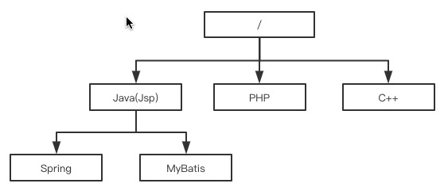
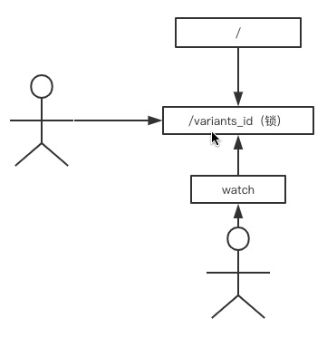

[TOC]


## zookeeper实现分布式锁

### 1、zookeeper内部结构

zookeeper是一种分布式协调的服务，通过简单的API解决我们的分布式协调问题

对于zookeeper来讲，其实就是一个树形的目录存储结构，但和目录不同的是节点本身也可以存放数据，每个节点就是一个znode



znode由以下四个部分组成

- data：znode存放数据的地方（一个znode节点能存放的数据大小被限制在1MB以内）
- ACL：访问权限
- stat：各种元数据
- child：当前节点的子节点引用

```shell
#bin目录下启动 ./zkServer.sh start
#bin目录下启动客户端 ./zkCli.sh 
ls / #列出目录信息
create /node_1 Java #创建节点及节点值
delete /node_1  #删除节点
rmr /node_1 #删除节点及子节点
set /node_1 Jsp #设置节点值
```

znode有这两个特性：一个是顺序（非顺序），一个是临时（持久）组合出了四种节点方式

- 顺序持久节点
- 非顺序持久节点
- 顺序临时节点
- 非顺序临时节点

**Zookeeper的事件通知**

就是zk自带的Watch机制，可以理解为注册在特定znode上的触发器，只要这个znode发生改变（删除，修改）会触发znode上注册的对应事件，请求获取这个节点Watch的节点就会收到异步的通知

### 2、zookeeper实现分布式锁的原理



- 加锁：创建临时非顺序节点
- 解锁：删除锁
- 锁失效：临时节点就是锁失效

### 3、zookeeper业务代码实现分布式锁

接口实现

```java
public interface ZookeeperLock {
    public void lock();
    public void unlock();
}
```

抽象类

```java
public abstract class AbstractZookeeperLock implements ZookeeperLock {

    protected String lock = "/";
    protected String zk_address = "127.0.0.1:2181";
    protected ZkClient zkClient = new ZkClient(zk_address);
    protected CountDownLatch countDownLatch;

    @Override
    public void lock() {
        //尝试获取锁
        if(tryLock()){
            //拿到锁
            System.out.println("获得锁成功........");
        }else{
            //获得锁失败，等待获取锁，阻塞
            waitLock();
            //等待结束获取锁
            lock();
        }
    }

    @Override
    public void unlock() {
        //创建的是临时节点
        //关闭连接来解锁
        if(zkClient!=null){
            //关闭连接就可以删除节点
            zkClient.close();
            System.out.println("关闭连接释放锁......");
        }
    }

    protected abstract boolean tryLock();
    protected abstract boolean waitLock();
}

```

实现类

```java
public class ZookeeperDistributeLock extends AbstractZookeeperLock {

    //初始化的时候就传递lock路径
    public ZookeeperDistributeLock(String lock_path){
        lock = lock_path;
    }

    @Override
    protected boolean tryLock() {
        try {
            //创建一个临时节点
            zkClient.createEphemeral(lock);
            System.out.println("创建节点成功.........");
            return true;
        }catch (Exception e){
            e.printStackTrace();
            System.out.println("创建节点失败.........");
            return false;
        }
    }

    @Override
    protected boolean waitLock() {
        IZkDataListener iZkDataListener = new IZkDataListener() {
            @Override
            public void handleDataChange(String s, Object o) throws Exception {

            }

            @Override
            public void handleDataDeleted(String s) throws Exception {
                if(countDownLatch!=null){
                    //倒计数器
                    countDownLatch.countDown();
                }
            }
        };
        //订阅一个数据改变的通知
        zkClient.subscribeDataChanges(lock,iZkDataListener);
        if(zkClient.exists(lock)){
            countDownLatch = new CountDownLatch(1);
            try {
                countDownLatch.await();
            }catch (Exception e){
                e.printStackTrace();
            }
        }
        //取消订阅
        zkClient.unsubscribeDataChanges(lock,iZkDataListener);
        return false;
    }
}
```

