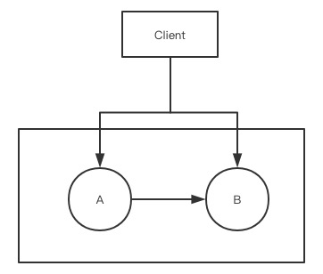
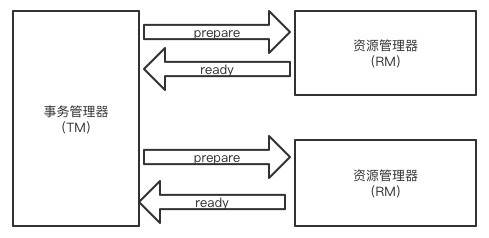
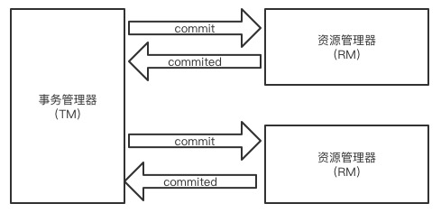
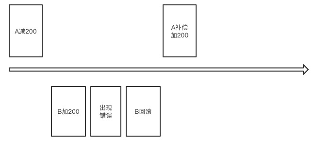

[TOC]

##  目录

- [1. 对于分布式事务的整体理解](#1-对于分布式事务的整体理解)
- [2. CAP原理解析](#2-CAP原理解析)
- [3. ACID原理和BASE原理](#3-ACID原理和BASE原理)
- [4. 分布式事务涉及的问题分析](#4-分布式事务涉及的问题分析)
- [5. 通过XA协议实现两阶段提交](#5-通过XA协议实现两阶段提交)
- [6. 使用Atomikos进行分布式事务](#6-使用Atomikos进行分布式事务)
- [7. MyCat实现分布式事务](#7-MyCat实现分布式事务)
- [8. Sharding-Jdbc实现分布式事务](#8-Sharding-Jdbc实现分布式事务)
- [9. 事务补偿机制TCC分析](#9-事务补偿机制TCC分析)
- [10. 事务补偿机制代码实现](#10-事务补偿机制代码实现)


# 分布式事务设计

## 1. 对于分布式事务的整体理解

在传统业务中，我们的数据库都是单机，数据库本身就提供ACID，由于业务量激增我们将数据分到多个库中，对数据库进行分库分表设计，一个逻辑表数据被分到多个数据库中，这个时候单个库的ACID就无法管理两个数据库了

这个时候就需要理解和掌握分布式事务的概念了

- CAP原理
- ACID原理和BASE原理
- 基于XA协议的两阶段提交
- 事务的补偿机制
  - 理解起来非常简单，但实现比较复杂
  - 操作多个数据库的时候，一个成功一个失败，成功的数据库就需要有一个补偿接口来进行成功操作的回滚，让数据恢复到初始状态
- 基于本地消息的最终一致性
- 基于MQ消息队列的最终一致性

## 2. CAP原理解析

- C-Consistent，一致性。操作成功后，所有节点看到的数据都是一样的
- A-Availability，可用性，服务全部一致可用，在规定时间内完成响应
- P-Partition tolerance，分区容错性。指分布式系统在遇到某个节点故障后，仍能够对外提供服务

CAP原理指出：这3个指标不可能同时满足，最多满足其中两个

- CA
- CP
- AP

我们之所以把系统架构设计成分布式系统，就是为了在某个节点不可用的情况，整个服务队外可用。这样就满足了P，如果不满足P，就一定不是一个分布式系统了



A和B是两个数据节点，A向B同步数据，并且作为一个整体对外提供服务，首先满足P了

A和B同步的过程中如果同步不能保证，那么这个结构就是一个AP结构

如果我们满足C，也就是说client无论访问A还是B得到的结果都是一致的，如果A和B数据同步出现延迟，只能确保A和B数据同步完成后才能对外提供服务，这个时候A就保证不了，这就是一个CP结构

## 3. ACID原理和BASE原理

A：原子性

C：一致性

I：隔离性

D：持久性

ACID是强一致性，ACID在CAP的原理中保证的是CA，因此对于ACID也在向BASE转变

**BASE是什么呢？**

Basically Available（基本可用）：分布式系统在出现故障后，允许损失部分可用性，保证核心可用，比如电商大促，服务降级的体现

Soft-state（软状态）：允许系统存在中间状态，中间状态是不会影响系统整体的可用性，比如到达各个分片的数据同步状态，允许这些数据有一段时间不同步

Eventually consistent（最终一致）：指系统中所有数据副本在经过一定时间后，最终达到一致的状态

BASE模型是ACID的反面，不同于ACID，BASE强调牺牲高一致性，从而获得可用性，数据允许一段时间不一致但最终一致就可以了

在分布式事务中都是依赖ACID或BASE模型实现的

- 基于XA的两段式提交协议和事务补偿机制都是基于ACID模型的
- 基于本地消息和基于MQ消息的最终一致性方式是基于BASE模型实现的

## 4. 分布式事务涉及的问题分析

**单一数据库结构中**

- ACID的强事务类型
- 所有数据表都在同一个数据库
- 数据库的事务得到很好的支持

分布式架构中

- 分布式系统中，业务拆成多个数据库
- 多个独立的数据库之间无法统一事务
- 有可能导致数据不一致
- 举个例子
  - 一个下单操作，通过积分购物
  - 执行顺序：用户的积分扣减，订单生成，库存扣减
  - 这个三个业务不会在一个数据中，就不能保证事务统一
  - 任何一个环节出错，其他环节都不会回滚

解决分布式事务的方案：

- 基于XA协议的两阶段：ACID的方式
- 事务补偿机制TCC：ACID的方式
- 基于本地消息表+定时任务的最终一致性：BASE方式
- 基于MQ的最终一致性方式：BASE方式

## 5. 通过XA协议实现两阶段提交

- XA是由X/Open组织提出的分布式事务规范
- 整体是由一个事务管理器（TM）和多个资源管理器（RM）组成
  - RM一般就是指我们的数据库
  - TM相当于程序中的数据源
- 提交分为两个阶段：prepare和commit

第一个阶段：prepare



TM告诉所有的RM进行准备，如果都返回ok了，才进行commit，一旦在准备阶段出现任何问题都会返回错误给到TM，TM就会回滚并结束操作

第二阶段：commit



到commit阶段如果第二个RM出现问题没有提交成功会返回一个状态到TM，而第一个RM已经完成的commit就不能回滚了，这个时候就需要人工介入了

XA协议的两阶段提交总结：

- 保证数据的一致性
- commit阶段如果出现问题，事务会不一致，需要人工处理
- XA协议的效率比较低，性能与本地事务相比相差10倍
- MySQL v5.7及以上版本均支持XA协议
- mysql-connector-java驱动要v5.0以上
- Java系统中，数据源采用Atomikos充当TM的角色

## 6. 使用Atomikos进行分布式事务

先准备环境：两台MySQLv5.7数据库

导入依赖

```xml
        <dependency>
            <groupId>org.springframework.boot</groupId>
            <artifactId>spring-boot-starter-jta-atomikos</artifactId>
        </dependency>
```

数据源配置代码加上了TM管理器

```java
package com.icodingedu.config;

import com.atomikos.icatch.jta.UserTransactionImp;
import com.atomikos.icatch.jta.UserTransactionManager;
import com.mysql.cj.jdbc.MysqlXADataSource;
import org.springframework.boot.jta.atomikos.AtomikosDataSourceBean;
import org.springframework.context.annotation.Bean;
import org.springframework.context.annotation.Configuration;
import org.springframework.transaction.jta.JtaTransactionManager;

import javax.sql.DataSource;
import javax.transaction.UserTransaction;

@Configuration
public class DB195Config {

    @Bean("db195")
    public DataSource db195(){
        MysqlXADataSource mysqlXADataSource = new MysqlXADataSource();
        mysqlXADataSource.setUser("gavin");
        mysqlXADataSource.setPassword("123456");
        mysqlXADataSource.setUrl("jdbc:mysql://39.100.17.31:3306/user_195");

        AtomikosDataSourceBean atomikosDataSourceBean = new AtomikosDataSourceBean();
        atomikosDataSourceBean.setXaDataSource(mysqlXADataSource);
        return atomikosDataSourceBean;
    }
		//这里就相当于一个TM，只加在一个config里就行
    @Bean("xaTransaction")
    public JtaTransactionManager jtaTransactionManager(){
        UserTransaction userTransaction = new UserTransactionImp();
        UserTransactionManager userTransactionManager = new UserTransactionManager();
        return new JtaTransactionManager(userTransaction,userTransactionManager);
    }
}
```

另一个数据源

```java
package com.icodingedu.config;

import com.mysql.cj.jdbc.MysqlXADataSource;
import org.springframework.boot.jta.atomikos.AtomikosDataSourceBean;
import org.springframework.context.annotation.Bean;
import org.springframework.context.annotation.Configuration;

import javax.sql.DataSource;

@Configuration
public class DB197Config {

    @Bean("db197")
    public DataSource db197(){
        MysqlXADataSource mysqlXADataSource = new MysqlXADataSource();
        mysqlXADataSource.setUser("gavin");
        mysqlXADataSource.setPassword("123456");
        mysqlXADataSource.setUrl("jdbc:mysql://39.100.19.243:3306/user_197");

        AtomikosDataSourceBean atomikosDataSourceBean = new AtomikosDataSourceBean();
        atomikosDataSourceBean.setXaDataSource(mysqlXADataSource);
        return atomikosDataSourceBean;
    }
}
```

调用代码

```java
package com.icodingedu.service;

import org.springframework.beans.factory.annotation.Qualifier;
import org.springframework.jdbc.core.JdbcTemplate;
import org.springframework.stereotype.Service;
import org.springframework.transaction.annotation.Transactional;

import javax.sql.DataSource;

@Service
public class DBService {

    @Transactional(transactionManager = "xaTransaction")
    public void insertTest(@Qualifier("db195")DataSource dataSource195,
                           @Qualifier("db197")DataSource dataSource197){
        JdbcTemplate jdbc195 = new JdbcTemplate(dataSource195);
        String sql1 = "insert into user_info(id,username) values(1,'gavin1')";
        int i = jdbc195.update(sql1);
        System.out.println("**************影响的行数:"+i);

        JdbcTemplate jdbc197 = new JdbcTemplate(dataSource197);
        String sql2 = "insert into user_info(id,username) values(1,'gavin1')";
        int i1 = jdbc197.update(sql2);
        System.out.println("**************影响的行数:"+i1);
    }
}
```

测试代码

```java
import com.icodingedu.service.DBService;
import org.junit.jupiter.api.Test;
import org.springframework.beans.factory.annotation.Autowired;
import org.springframework.beans.factory.annotation.Qualifier;
import org.springframework.boot.test.context.SpringBootTest;

import javax.sql.DataSource;

@SpringBootTest
class DistributeTransactionsApplicationTests {

    @Autowired
    DBService dbService;

    @Test
    void contextLoads(@Qualifier("db195") DataSource dataSource195,
                      @Qualifier("db197")DataSource dataSource197) {
        dbService.insertTest(dataSource195,dataSource197);
    }
}
```

## 7. MyCat实现分布式事务

默认客户端是不进行分布式事务的，需要自己手动开启分布式事务

```sql
set autocommit=0;
set xa=on;
insert into user_info(id,username) values(1,'gavin1'),(5000001,'gavin2');
commit;
```

通过MyBatis实现客户端调用

```xml
		<dependency>
			<groupId>org.mybatis.spring.boot</groupId>
			<artifactId>mybatis-spring-boot-starter</artifactId>
			<version>2.1.1</version>
		</dependency>
```

POJO

```java
package com.icodingedu.pojo;

import lombok.AllArgsConstructor;
import lombok.Data;
import lombok.NoArgsConstructor;

@Data
@NoArgsConstructor
@AllArgsConstructor
public class UserInfo {
    private int id;
    private String username;
}
```

mapper

```java
package com.icodingedu.mapper;

import com.icodingedu.pojo.UserInfo;
import org.apache.ibatis.annotations.Mapper;
import org.springframework.stereotype.Repository;

@Mapper
@Repository
public interface UserMapper {
    int addUser(UserInfo userInfo);
}
```

xml

```xml
<?xml version="1.0" encoding="UTF-8" ?>
<!DOCTYPE mapper
        PUBLIC "-//mybatis.org//DTD Mapper 3.0//EN"
        "http://mybatis.org/dtd/mybatis-3-mapper.dtd">
<mapper namespace="com.icodingedu.mapper.UserMapper">
    <insert id="addUser" parameterType="com.icodingedu.pojo.UserInfo">
        insert into user_info(id,username) values(#{id},#{username})
    </insert>
</mapper>
```

service

```java
package com.icodingedu.service;

import com.icodingedu.mapper.UserMapper;
import com.icodingedu.pojo.UserInfo;
import org.springframework.beans.factory.annotation.Autowired;
import org.springframework.stereotype.Service;
import org.springframework.transaction.annotation.Transactional;

@Service
public class MyCatService {

    @Autowired
    UserMapper userMapper;

    @Transactional(rollbackFor = Exception.class)
    public void addUser(){
        UserInfo userInfo1 = new UserInfo();
        userInfo1.setId(1);
        userInfo1.setUsername("gavin1");
        userMapper.addUser(userInfo1);

        UserInfo userInfo2 = new UserInfo();
        userInfo2.setId(5000001);
        userInfo2.setUsername("gavin2");
        userMapper.addUser(userInfo2);
    }
}
```

测试

```java
package com.icodingedu;

import com.icodingedu.service.MyCatService;
import org.junit.jupiter.api.Test;
import org.springframework.beans.factory.annotation.Autowired;
import org.springframework.boot.test.context.SpringBootTest;

@SpringBootTest
class MycatMybatisApplicationTests {

	@Autowired
	MyCatService myCatService;

	@Test
	void contextLoads() {
		myCatService.addUser();
	}

}
```

## 8. Sharding-Jdbc实现分布式事务

Sharding-Jdbc是自动支持分布式事务的，多个执行数据库的内容，只需要放在一个方法里，通过@Transactional(rollbackFor = Exception.class)设置即可实现

## 9. 事务补偿机制TCC分析

TCC分别对应Try、Confirm和Cancel三种操作实现的

- 针对每个操作，都要提前注册一个与其对应的补偿（撤销）操作
- 在执行失败后按照失败节向前补偿，撤销之前的操作
- 示例：A给B转账，A和B在两家不同的银行
  - A减200，B加200
  - 两个操作都要保持原子性
  - 存在分布式事务
  - 并且是不同的两个公司



注意的点：

- 补偿接口也有可能出错
- 需要循环调用补偿直到完成，循环次数需要计数，超过retry次数就记录并不再retry待人工处理

TCC的特点

- 优点：逻辑清晰，流程简单
- 缺点：数据的一致性比XA还要差，出错的点比较多

TCC属于应用层的一种补偿机制，需要大量的代码开发，对与开发人员要求比较高

## 10. 事务补偿机制代码实现

数据源config配置

DB195Config

```java
package com.icodingedu.config;

import com.atomikos.icatch.jta.UserTransactionImp;
import com.atomikos.icatch.jta.UserTransactionManager;
import com.mysql.cj.jdbc.MysqlDataSource;
import org.mybatis.spring.SqlSessionFactoryBean;
import org.mybatis.spring.annotation.MapperScan;
import org.springframework.beans.factory.annotation.Qualifier;
import org.springframework.context.annotation.Bean;
import org.springframework.context.annotation.Configuration;
import org.springframework.core.io.support.PathMatchingResourcePatternResolver;
import org.springframework.core.io.support.ResourcePatternResolver;
import org.springframework.jdbc.datasource.DataSourceTransactionManager;
import org.springframework.transaction.PlatformTransactionManager;
import org.springframework.transaction.jta.JtaTransactionManager;

import javax.sql.DataSource;
import javax.transaction.UserTransaction;

@Configuration
@MapperScan(value = "com.icodingedu.mapper.db195",sqlSessionFactoryRef = "factoryBean195")
public class DB195Config {

    @Bean("db195")
    public DataSource db195(){
        MysqlDataSource mysqlDataSource = new MysqlDataSource();
        mysqlDataSource.setUser("gavin");
        mysqlDataSource.setPassword("123456");
        mysqlDataSource.setUrl("jdbc:mysql://39.100.17.31:3306/user_195");
        return mysqlDataSource;
    }

    @Bean("factoryBean195")
    public SqlSessionFactoryBean factoryBean(@Qualifier("db195") DataSource dataSource) throws Exception{
        SqlSessionFactoryBean sessionFactoryBean = new SqlSessionFactoryBean();
        sessionFactoryBean.setDataSource(dataSource);

        ResourcePatternResolver patternResolver = new PathMatchingResourcePatternResolver();

        sessionFactoryBean.setMapperLocations(patternResolver.getResources("mybatis/db195/*.xml"));
        return sessionFactoryBean;
    }

    @Bean("tm195")
    public PlatformTransactionManager platformTransactionManager(@Qualifier("db195") DataSource dataSource){
        return new DataSourceTransactionManager(dataSource);
    }
}
```

DB197Config

```java
package com.icodingedu.config;

import com.mysql.cj.jdbc.MysqlDataSource;
import org.mybatis.spring.SqlSessionFactoryBean;
import org.mybatis.spring.annotation.MapperScan;
import org.springframework.beans.factory.annotation.Qualifier;
import org.springframework.context.annotation.Bean;
import org.springframework.context.annotation.Configuration;
import org.springframework.core.io.support.PathMatchingResourcePatternResolver;
import org.springframework.core.io.support.ResourcePatternResolver;
import org.springframework.jdbc.datasource.DataSourceTransactionManager;
import org.springframework.transaction.PlatformTransactionManager;

import javax.sql.DataSource;

@Configuration
@MapperScan(value = "com.icodingedu.mapper.db197",sqlSessionFactoryRef = "factoryBean197")
public class DB197Config {

    @Bean("db197")
    public DataSource db197(){
        MysqlDataSource mysqlDataSource = new MysqlDataSource();
        mysqlDataSource.setUser("gavin");
        mysqlDataSource.setPassword("123456");
        mysqlDataSource.setUrl("jdbc:mysql://39.100.19.243:3306/user_197");
        return mysqlDataSource;
    }

    @Bean("factoryBean197")
    public SqlSessionFactoryBean factoryBean(@Qualifier("db197") DataSource dataSource) throws Exception{
        SqlSessionFactoryBean sessionFactoryBean = new SqlSessionFactoryBean();
        sessionFactoryBean.setDataSource(dataSource);

        ResourcePatternResolver patternResolver = new PathMatchingResourcePatternResolver();

        sessionFactoryBean.setMapperLocations(patternResolver.getResources("mybatis/db197/*.xml"));
        return sessionFactoryBean;
    }

    @Bean("tm197")
    public PlatformTransactionManager platformTransactionManager(@Qualifier("db197") DataSource dataSource){
        return new DataSourceTransactionManager(dataSource);
    }
}
```

195Mapper

```java
package com.icodingedu.mapper.db195;

import com.icodingedu.pojo.UserInfo195;
import org.springframework.stereotype.Repository;

@Repository
public interface UserMapper195 {
    int update(UserInfo195 userInfo195);
    UserInfo195 queryById(int id);
}
```

197Mapper

```java
package com.icodingedu.mapper.db197;

import com.icodingedu.pojo.UserInfo197;
import org.springframework.stereotype.Repository;

@Repository
public interface UserMapper197 {
    int update(UserInfo197 userInfo197);
    UserInfo197 queryById(int id);
}
```

195 POJO

```java
package com.icodingedu.pojo;

import lombok.Data;
import org.springframework.stereotype.Component;

@Data
public class UserInfo195 {
    private int id;
    private String username;
    private int account;
}
```

197 POJO

```java
package com.icodingedu.pojo;

import lombok.Data;
import org.springframework.stereotype.Component;

@Data
public class UserInfo197 {
    private int id;
    private String username;
    private int account;
}
```

195 xml

```xml
<?xml version="1.0" encoding="UTF-8" ?>
<!DOCTYPE mapper
        PUBLIC "-//mybatis.org//DTD Mapper 3.0//EN"
        "http://mybatis.org/dtd/mybatis-3-mapper.dtd">
<mapper namespace="com.icodingedu.mapper.db195.UserMapper195">
    <update id="update" parameterType="com.icodingedu.pojo.UserInfo195">
        update user_info set account=#{account} where id=#{id}
    </update>
    <select id="queryById" resultType="com.icodingedu.pojo.UserInfo195">
        select * from user_info where id=#{id}
    </select>
</mapper>
```

197 xml

```xml
<?xml version="1.0" encoding="UTF-8" ?>
<!DOCTYPE mapper
        PUBLIC "-//mybatis.org//DTD Mapper 3.0//EN"
        "http://mybatis.org/dtd/mybatis-3-mapper.dtd">
<mapper namespace="com.icodingedu.mapper.db197.UserMapper197">
    <update id="update" parameterType="com.icodingedu.pojo.UserInfo197">
        update user_info set account=#{account} where id=#{id}
    </update>
    <select id="queryById" resultType="com.icodingedu.pojo.UserInfo197">
        select * from user_info where id=#{id}
    </select>
</mapper>
```

service

```java
package com.icodingedu.service;

import com.icodingedu.mapper.db195.UserMapper195;
import com.icodingedu.mapper.db197.UserMapper197;
import com.icodingedu.pojo.UserInfo195;
import com.icodingedu.pojo.UserInfo197;
import org.springframework.beans.factory.annotation.Autowired;
import org.springframework.stereotype.Service;
import org.springframework.transaction.annotation.Transactional;

import javax.annotation.Resource;

@Service
public class UserInfoService {

    @Autowired
    UserMapper195 userMapper195;

    @Autowired
    UserMapper197 userMapper197;

    @Transactional(transactionManager = "tm195")
    public void transfer(){
        UserInfo195 userInfo195 = userMapper195.queryById(1);
        userInfo195.setAccount(userInfo195.getAccount()-200);
        userMapper195.update(userInfo195);

        try {
            UserInfo197 userInfo197 = userMapper197.queryById(1);
            userInfo197.setAccount(userInfo197.getAccount() + 200);
            userMapper197.update(userInfo197);

            int i = 1 / 0;
        }catch (Exception ex){
            ex.printStackTrace();
            UserInfo197 userInfo197 = userMapper197.queryById(1);
            userInfo197.setAccount(userInfo197.getAccount() - 200);
            userMapper197.update(userInfo197);
            throw ex;
        }
        System.out.println("执行完毕********************");
        
    }
}
```

- 如果多个接口API怎么办？
- 不同的系统API调用是无法通过事务异常直接控制，补偿就更复杂了
- 整体设计对开发人员要求比较高
- TCC在实际生产中还是有很多难点的