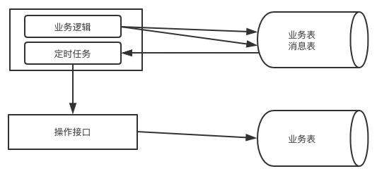
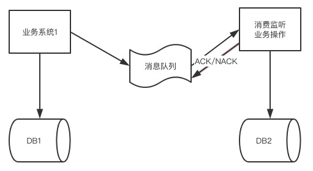
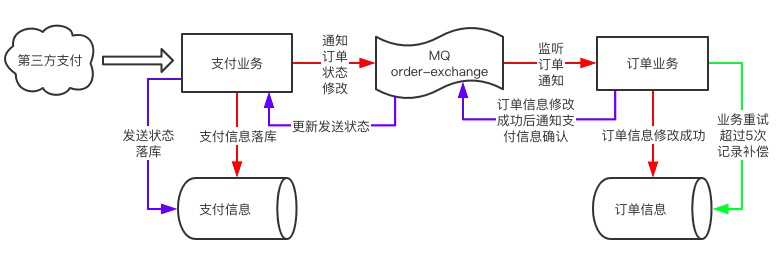

[TOC]

##  目录

- [1. 对于分布式事务的整体理解](#1-对于分布式事务的整体理解)
- [2. CAP原理解析](#2-CAP原理解析)
- [3. ACID原理和BASE原理](#3-ACID原理和BASE原理)
- [4. 分布式事务涉及的问题分析](#4-分布式事务涉及的问题分析)
- [5. 通过XA协议实现两阶段提交](#5-通过XA协议实现两阶段提交)
- [6. 使用Atomikos进行分布式事务](#6-使用Atomikos进行分布式事务)
- [7. MyCat实现分布式事务](#7-MyCat实现分布式事务)
- [8. Sharding-Jdbc实现分布式事务](#8-Sharding-Jdbc实现分布式事务)
- [9. 事务补偿机制TCC分析](#9-事务补偿机制TCC分析)
- [10. 事务补偿机制代码实现](#10-事务补偿机制代码实现)
- [11. 基于本地消息的最终一致性方案设计](#11-基于本地消息的最终一致性方案设计)
- [12. 基于本地消息的最终一致性代码实现](#12-基于本地消息的最终一致性代码实现)
- [13. 基于消息队列MQ的最终一致性方案设计](#13-基于消息队列MQ的最终一致性方案设计)
- [14. 基于消息队列MQ的最终一致性代码实现](#14-基于消息队列MQ的最终一致性代码实现)
- [15. 接口幂等性涉及的相关问题](#15-接口幂等性涉及的相关问题)
- [16. 保证幂等性的策略分析](#16-保证幂等性的策略分析)
- [17. 业务操作的幂等性分析](#17-业务操作的幂等性分析)
- [18. 幂等性的具体设计分析](#18-幂等性的具体设计分析)


# 分布式事务设计

## 1. 对于分布式事务的整体理解

在传统业务中，我们的数据库都是单机，数据库本身就提供ACID，由于业务量激增我们将数据分到多个库中，对数据库进行分库分表设计，一个逻辑表数据被分到多个数据库中，这个时候单个库的ACID就无法管理两个数据库了

这个时候就需要理解和掌握分布式事务的概念了

- CAP原理
- ACID原理和BASE原理
- 基于XA协议的两阶段提交
- 事务的补偿机制
  - 理解起来非常简单，但实现比较复杂
  - 操作多个数据库的时候，一个成功一个失败，成功的数据库就需要有一个补偿接口来进行成功操作的回滚，让数据恢复到初始状态
- 基于本地消息的最终一致性
- 基于MQ消息队列的最终一致性

## 2. CAP原理解析

- C-Consistent，一致性。操作成功后，所有节点看到的数据都是一样的
- A-Availability，可用性，服务全部一致可用，在规定时间内完成响应
- P-Partition tolerance，分区容错性。指分布式系统在遇到某个节点故障后，仍能够对外提供服务

CAP原理指出：这3个指标不可能同时满足，最多满足其中两个

- CA
- CP
- AP

我们之所以把系统架构设计成分布式系统，就是为了在某个节点不可用的情况，整个服务队外可用。这样就满足了P，如果不满足P，就一定不是一个分布式系统了


A和B是两个数据节点，A向B同步数据，并且作为一个整体对外提供服务，首先满足P了

A和B同步的过程中如果同步不能保证，那么这个结构就是一个AP结构

如果我们满足C，也就是说client无论访问A还是B得到的结果都是一致的，如果A和B数据同步出现延迟，只能确保A和B数据同步完成后才能对外提供服务，这个时候A就保证不了，这就是一个CP结构

## 3. ACID原理和BASE原理

A：原子性

C：一致性

I：隔离性

D：持久性

ACID是强一致性，ACID在CAP的原理中保证的是CA，因此对于ACID也在向BASE转变

**BASE是什么呢？**

Basically Available（基本可用）：分布式系统在出现故障后，允许损失部分可用性，保证核心可用，比如电商大促，服务降级的体现

Soft-state（软状态）：允许系统存在中间状态，中间状态是不会影响系统整体的可用性，比如到达各个分片的数据同步状态，允许这些数据有一段时间不同步

Eventually consistent（最终一致）：指系统中所有数据副本在经过一定时间后，最终达到一致的状态

BASE模型是ACID的反面，不同于ACID，BASE强调牺牲高一致性，从而获得可用性，数据允许一段时间不一致但最终一致就可以了

在分布式事务中都是依赖ACID或BASE模型实现的

- 基于XA的两段式提交协议和事务补偿机制都是基于ACID模型的
- 基于本地消息和基于MQ消息的最终一致性方式是基于BASE模型实现的

## 4. 分布式事务涉及的问题分析

**单一数据库结构中**

- ACID的强事务类型
- 所有数据表都在同一个数据库
- 数据库的事务得到很好的支持

分布式架构中

- 分布式系统中，业务拆成多个数据库
- 多个独立的数据库之间无法统一事务
- 有可能导致数据不一致
- 举个例子
  - 一个下单操作，通过积分购物
  - 执行顺序：用户的积分扣减，订单生成，库存扣减
  - 这个三个业务不会在一个数据中，就不能保证事务统一
  - 任何一个环节出错，其他环节都不会回滚

解决分布式事务的方案：

- 基于XA协议的两阶段：ACID的方式
- 事务补偿机制TCC：ACID的方式
- 基于本地消息表+定时任务的最终一致性：BASE方式
- 基于MQ的最终一致性方式：BASE方式

## 5. 通过XA协议实现两阶段提交

- XA是由X/Open组织提出的分布式事务规范
- 整体是由一个事务管理器（TM）和多个资源管理器（RM）组成
  - RM一般就是指我们的数据库
  - TM相当于程序中的数据源
- 提交分为两个阶段：prepare和commit

第一个阶段：prepare


TM告诉所有的RM进行准备，如果都返回ok了，才进行commit，一旦在准备阶段出现任何问题都会返回错误给到TM，TM就会回滚并结束操作

第二阶段：commit


到commit阶段如果第二个RM出现问题没有提交成功会返回一个状态到TM，而第一个RM已经完成的commit就不能回滚了，这个时候就需要人工介入了

XA协议的两阶段提交总结：

- 保证数据的一致性
- commit阶段如果出现问题，事务会不一致，需要人工处理
- XA协议的效率比较低，性能与本地事务相比相差10倍
- MySQL v5.7及以上版本均支持XA协议
- mysql-connector-java驱动要v5.0以上
- Java系统中，数据源采用Atomikos充当TM的角色

## 6. 使用Atomikos进行分布式事务

先准备环境：两台MySQLv5.7数据库

导入依赖

```xml
        <dependency>
            <groupId>org.springframework.boot</groupId>
            <artifactId>spring-boot-starter-jta-atomikos</artifactId>
        </dependency>
```

数据源配置代码加上了TM管理器

```java
package com.icodingedu.config;

import com.atomikos.icatch.jta.UserTransactionImp;
import com.atomikos.icatch.jta.UserTransactionManager;
import com.mysql.cj.jdbc.MysqlXADataSource;
import org.springframework.boot.jta.atomikos.AtomikosDataSourceBean;
import org.springframework.context.annotation.Bean;
import org.springframework.context.annotation.Configuration;
import org.springframework.transaction.jta.JtaTransactionManager;

import javax.sql.DataSource;
import javax.transaction.UserTransaction;

@Configuration
public class DB195Config {

    @Bean("db195")
    public DataSource db195(){
        MysqlXADataSource mysqlXADataSource = new MysqlXADataSource();
        mysqlXADataSource.setUser("gavin");
        mysqlXADataSource.setPassword("123456");
        mysqlXADataSource.setUrl("jdbc:mysql://39.100.17.31:3306/user_195");

        AtomikosDataSourceBean atomikosDataSourceBean = new AtomikosDataSourceBean();
        atomikosDataSourceBean.setXaDataSource(mysqlXADataSource);
        return atomikosDataSourceBean;
    }
		//这里就相当于一个TM，只加在一个config里就行
    @Bean("xaTransaction")
    public JtaTransactionManager jtaTransactionManager(){
        UserTransaction userTransaction = new UserTransactionImp();
        UserTransactionManager userTransactionManager = new UserTransactionManager();
        return new JtaTransactionManager(userTransaction,userTransactionManager);
    }
}
```

另一个数据源

```java
package com.icodingedu.config;

import com.mysql.cj.jdbc.MysqlXADataSource;
import org.springframework.boot.jta.atomikos.AtomikosDataSourceBean;
import org.springframework.context.annotation.Bean;
import org.springframework.context.annotation.Configuration;

import javax.sql.DataSource;

@Configuration
public class DB197Config {

    @Bean("db197")
    public DataSource db197(){
        MysqlXADataSource mysqlXADataSource = new MysqlXADataSource();
        mysqlXADataSource.setUser("gavin");
        mysqlXADataSource.setPassword("123456");
        mysqlXADataSource.setUrl("jdbc:mysql://39.100.19.243:3306/user_197");

        AtomikosDataSourceBean atomikosDataSourceBean = new AtomikosDataSourceBean();
        atomikosDataSourceBean.setXaDataSource(mysqlXADataSource);
        return atomikosDataSourceBean;
    }
}
```

调用代码

```java
package com.icodingedu.service;

import org.springframework.beans.factory.annotation.Qualifier;
import org.springframework.jdbc.core.JdbcTemplate;
import org.springframework.stereotype.Service;
import org.springframework.transaction.annotation.Transactional;

import javax.sql.DataSource;

@Service
public class DBService {

    @Transactional(transactionManager = "xaTransaction")
    public void insertTest(@Qualifier("db195")DataSource dataSource195,
                           @Qualifier("db197")DataSource dataSource197){
        JdbcTemplate jdbc195 = new JdbcTemplate(dataSource195);
        String sql1 = "insert into user_info(id,username) values(1,'gavin1')";
        int i = jdbc195.update(sql1);
        System.out.println("**************影响的行数:"+i);

        JdbcTemplate jdbc197 = new JdbcTemplate(dataSource197);
        String sql2 = "insert into user_info(id,username) values(1,'gavin1')";
        int i1 = jdbc197.update(sql2);
        System.out.println("**************影响的行数:"+i1);
    }
}
```

测试代码

```java
import com.icodingedu.service.DBService;
import org.junit.jupiter.api.Test;
import org.springframework.beans.factory.annotation.Autowired;
import org.springframework.beans.factory.annotation.Qualifier;
import org.springframework.boot.test.context.SpringBootTest;

import javax.sql.DataSource;

@SpringBootTest
class DistributeTransactionsApplicationTests {

    @Autowired
    DBService dbService;

    @Test
    void contextLoads(@Qualifier("db195") DataSource dataSource195,
                      @Qualifier("db197")DataSource dataSource197) {
        dbService.insertTest(dataSource195,dataSource197);
    }
}
```

## 7. MyCat实现分布式事务

默认客户端是不进行分布式事务的，需要自己手动开启分布式事务

```sql
set autocommit=0;
set xa=on;
insert into user_info(id,username) values(1,'gavin1'),(5000001,'gavin2');
commit;
```

通过MyBatis实现客户端调用

```xml
		<dependency>
			<groupId>org.mybatis.spring.boot</groupId>
			<artifactId>mybatis-spring-boot-starter</artifactId>
			<version>2.1.1</version>
		</dependency>
```

POJO

```java
package com.icodingedu.pojo;

import lombok.AllArgsConstructor;
import lombok.Data;
import lombok.NoArgsConstructor;

@Data
@NoArgsConstructor
@AllArgsConstructor
public class UserInfo {
    private int id;
    private String username;
}
```

mapper

```java
package com.icodingedu.mapper;

import com.icodingedu.pojo.UserInfo;
import org.apache.ibatis.annotations.Mapper;
import org.springframework.stereotype.Repository;

@Mapper
@Repository
public interface UserMapper {
    int addUser(UserInfo userInfo);
}
```

xml

```xml
<?xml version="1.0" encoding="UTF-8" ?>
<!DOCTYPE mapper
        PUBLIC "-//mybatis.org//DTD Mapper 3.0//EN"
        "http://mybatis.org/dtd/mybatis-3-mapper.dtd">
<mapper namespace="com.icodingedu.mapper.UserMapper">
    <insert id="addUser" parameterType="com.icodingedu.pojo.UserInfo">
        insert into user_info(id,username) values(#{id},#{username})
    </insert>
</mapper>
```

service

```java
package com.icodingedu.service;

import com.icodingedu.mapper.UserMapper;
import com.icodingedu.pojo.UserInfo;
import org.springframework.beans.factory.annotation.Autowired;
import org.springframework.stereotype.Service;
import org.springframework.transaction.annotation.Transactional;

@Service
public class MyCatService {

    @Autowired
    UserMapper userMapper;

    @Transactional(rollbackFor = Exception.class)
    public void addUser(){
        UserInfo userInfo1 = new UserInfo();
        userInfo1.setId(1);
        userInfo1.setUsername("gavin1");
        userMapper.addUser(userInfo1);

        UserInfo userInfo2 = new UserInfo();
        userInfo2.setId(5000001);
        userInfo2.setUsername("gavin2");
        userMapper.addUser(userInfo2);
    }
}
```

测试

```java
package com.icodingedu;

import com.icodingedu.service.MyCatService;
import org.junit.jupiter.api.Test;
import org.springframework.beans.factory.annotation.Autowired;
import org.springframework.boot.test.context.SpringBootTest;

@SpringBootTest
class MycatMybatisApplicationTests {

	@Autowired
	MyCatService myCatService;

	@Test
	void contextLoads() {
		myCatService.addUser();
	}

}
```

## 8. Sharding-Jdbc实现分布式事务

Sharding-Jdbc是自动支持分布式事务的，多个执行数据库的内容，只需要放在一个方法里，通过@Transactional(rollbackFor = Exception.class)设置即可实现

## 9. 事务补偿机制TCC分析

TCC分别对应Try、Confirm和Cancel三种操作实现的

- 针对每个操作，都要提前注册一个与其对应的补偿（撤销）操作
- 在执行失败后按照失败节向前补偿，撤销之前的操作
- 示例：A给B转账，A和B在两家不同的银行
  - A减200，B加200
  - 两个操作都要保持原子性
  - 存在分布式事务
  - 并且是不同的两个公司


注意的点：

- 补偿接口也有可能出错
- 需要循环调用补偿直到完成，循环次数需要计数，超过retry次数就记录并不再retry待人工处理

TCC的特点

- 优点：逻辑清晰，流程简单
- 缺点：数据的一致性比XA还要差，出错的点比较多

TCC属于应用层的一种补偿机制，需要大量的代码开发，对与开发人员要求比较高

## 10. 事务补偿机制代码实现

数据源config配置

DB195Config

```java
package com.icodingedu.config;

import com.atomikos.icatch.jta.UserTransactionImp;
import com.atomikos.icatch.jta.UserTransactionManager;
import com.mysql.cj.jdbc.MysqlDataSource;
import org.mybatis.spring.SqlSessionFactoryBean;
import org.mybatis.spring.annotation.MapperScan;
import org.springframework.beans.factory.annotation.Qualifier;
import org.springframework.context.annotation.Bean;
import org.springframework.context.annotation.Configuration;
import org.springframework.core.io.support.PathMatchingResourcePatternResolver;
import org.springframework.core.io.support.ResourcePatternResolver;
import org.springframework.jdbc.datasource.DataSourceTransactionManager;
import org.springframework.transaction.PlatformTransactionManager;
import org.springframework.transaction.jta.JtaTransactionManager;

import javax.sql.DataSource;
import javax.transaction.UserTransaction;

@Configuration
@MapperScan(value = "com.icodingedu.mapper.db195",sqlSessionFactoryRef = "factoryBean195")
public class DB195Config {

    @Bean("db195")
    public DataSource db195(){
        MysqlDataSource mysqlDataSource = new MysqlDataSource();
        mysqlDataSource.setUser("gavin");
        mysqlDataSource.setPassword("123456");
        mysqlDataSource.setUrl("jdbc:mysql://39.100.17.31:3306/user_195");
        return mysqlDataSource;
    }

    @Bean("factoryBean195")
    public SqlSessionFactoryBean factoryBean(@Qualifier("db195") DataSource dataSource) throws Exception{
        SqlSessionFactoryBean sessionFactoryBean = new SqlSessionFactoryBean();
        sessionFactoryBean.setDataSource(dataSource);

        ResourcePatternResolver patternResolver = new PathMatchingResourcePatternResolver();

        sessionFactoryBean.setMapperLocations(patternResolver.getResources("mybatis/db195/*.xml"));
        return sessionFactoryBean;
    }

    @Bean("tm195")
    public PlatformTransactionManager platformTransactionManager(@Qualifier("db195") DataSource dataSource){
        return new DataSourceTransactionManager(dataSource);
    }
}
```

DB197Config

```java
package com.icodingedu.config;

import com.mysql.cj.jdbc.MysqlDataSource;
import org.mybatis.spring.SqlSessionFactoryBean;
import org.mybatis.spring.annotation.MapperScan;
import org.springframework.beans.factory.annotation.Qualifier;
import org.springframework.context.annotation.Bean;
import org.springframework.context.annotation.Configuration;
import org.springframework.core.io.support.PathMatchingResourcePatternResolver;
import org.springframework.core.io.support.ResourcePatternResolver;
import org.springframework.jdbc.datasource.DataSourceTransactionManager;
import org.springframework.transaction.PlatformTransactionManager;

import javax.sql.DataSource;

@Configuration
@MapperScan(value = "com.icodingedu.mapper.db197",sqlSessionFactoryRef = "factoryBean197")
public class DB197Config {

    @Bean("db197")
    public DataSource db197(){
        MysqlDataSource mysqlDataSource = new MysqlDataSource();
        mysqlDataSource.setUser("gavin");
        mysqlDataSource.setPassword("123456");
        mysqlDataSource.setUrl("jdbc:mysql://39.100.19.243:3306/user_197");
        return mysqlDataSource;
    }

    @Bean("factoryBean197")
    public SqlSessionFactoryBean factoryBean(@Qualifier("db197") DataSource dataSource) throws Exception{
        SqlSessionFactoryBean sessionFactoryBean = new SqlSessionFactoryBean();
        sessionFactoryBean.setDataSource(dataSource);

        ResourcePatternResolver patternResolver = new PathMatchingResourcePatternResolver();

        sessionFactoryBean.setMapperLocations(patternResolver.getResources("mybatis/db197/*.xml"));
        return sessionFactoryBean;
    }

    @Bean("tm197")
    public PlatformTransactionManager platformTransactionManager(@Qualifier("db197") DataSource dataSource){
        return new DataSourceTransactionManager(dataSource);
    }
}
```

195Mapper

```java
package com.icodingedu.mapper.db195;

import com.icodingedu.pojo.UserInfo195;
import org.springframework.stereotype.Repository;

@Repository
public interface UserMapper195 {
    int update(UserInfo195 userInfo195);
    UserInfo195 queryById(int id);
}
```

197Mapper

```java
package com.icodingedu.mapper.db197;

import com.icodingedu.pojo.UserInfo197;
import org.springframework.stereotype.Repository;

@Repository
public interface UserMapper197 {
    int update(UserInfo197 userInfo197);
    UserInfo197 queryById(int id);
}
```

195 POJO

```java
package com.icodingedu.pojo;

import lombok.Data;
import org.springframework.stereotype.Component;

@Data
public class UserInfo195 {
    private int id;
    private String username;
    private int account;
}
```

197 POJO

```java
package com.icodingedu.pojo;

import lombok.Data;
import org.springframework.stereotype.Component;

@Data
public class UserInfo197 {
    private int id;
    private String username;
    private int account;
}
```

195 xml

```xml
<?xml version="1.0" encoding="UTF-8" ?>
<!DOCTYPE mapper
        PUBLIC "-//mybatis.org//DTD Mapper 3.0//EN"
        "http://mybatis.org/dtd/mybatis-3-mapper.dtd">
<mapper namespace="com.icodingedu.mapper.db195.UserMapper195">
    <update id="update" parameterType="com.icodingedu.pojo.UserInfo195">
        update user_info set account=#{account} where id=#{id}
    </update>
    <select id="queryById" resultType="com.icodingedu.pojo.UserInfo195">
        select * from user_info where id=#{id}
    </select>
</mapper>
```

197 xml

```xml
<?xml version="1.0" encoding="UTF-8" ?>
<!DOCTYPE mapper
        PUBLIC "-//mybatis.org//DTD Mapper 3.0//EN"
        "http://mybatis.org/dtd/mybatis-3-mapper.dtd">
<mapper namespace="com.icodingedu.mapper.db197.UserMapper197">
    <update id="update" parameterType="com.icodingedu.pojo.UserInfo197">
        update user_info set account=#{account} where id=#{id}
    </update>
    <select id="queryById" resultType="com.icodingedu.pojo.UserInfo197">
        select * from user_info where id=#{id}
    </select>
</mapper>
```

service

```java
package com.icodingedu.service;

import com.icodingedu.mapper.db195.UserMapper195;
import com.icodingedu.mapper.db197.UserMapper197;
import com.icodingedu.pojo.UserInfo195;
import com.icodingedu.pojo.UserInfo197;
import org.springframework.beans.factory.annotation.Autowired;
import org.springframework.stereotype.Service;
import org.springframework.transaction.annotation.Transactional;

import javax.annotation.Resource;

@Service
public class UserInfoService {

    @Autowired
    UserMapper195 userMapper195;

    @Autowired
    UserMapper197 userMapper197;

    @Transactional(transactionManager = "tm195")
    public void transfer(){
        UserInfo195 userInfo195 = userMapper195.queryById(1);
        userInfo195.setAccount(userInfo195.getAccount()-200);
        userMapper195.update(userInfo195);

        try {
            UserInfo197 userInfo197 = userMapper197.queryById(1);
            userInfo197.setAccount(userInfo197.getAccount() + 200);
            userMapper197.update(userInfo197);

            int i = 1 / 0;
        }catch (Exception ex){
            ex.printStackTrace();
            UserInfo197 userInfo197 = userMapper197.queryById(1);
            userInfo197.setAccount(userInfo197.getAccount() - 200);
            userMapper197.update(userInfo197);
            throw ex;
        }
        System.out.println("执行完毕********************");
        
    }
}
```

- 如果多个接口API怎么办？
- 不同的系统API调用是无法通过事务异常直接控制，补偿就更复杂了
- 整体设计对开发人员要求比较高
- TCC在实际生产中还是有很多难点的


## 11. 基于本地消息的最终一致性方案设计

- 采用BASE原理实现，保障事务的最终一致性
- 设计的过程中是否采用最终一致性需要根据业务来进行评估
- 基于本地消息的方式，将本事务外的操作，记录在消息表中
  - 举例：下订单-支付，这就是两个事务
- 其他事务提供操作接口（支付成功后如果直接调用订单接口）
- 定时轮询的方式将未执行的消息发送给操作接口
- 操作接口返回失败记录失败的标识，需要设置retry次数
- 超过retry的次数后不再进行消息发送并记录我们的失败状态
- 重试后没有成功的就可以通过人工补偿



这个图例的理解：

- 业务表/消息表：支付的业务和支付成功的通知
  - 支付相关信息记录到业务表
  - 将需要通知订单的消息记录到消息表中
  - 定时任务通过定时轮询消息表来获取哪个订单需要发送确认消息
  - 定时任务通过接口修改业务表状态
    - 如果成功更新消息表状态
    - 失败就不断轮询并记录轮询次数，超次数后标记并不再调用
- 业务表：这就是订单信息
  - 记录订单业务数据
  - 支付成功后订单状态
- 订单的支付状态在一段时间不一致，但最终一致

**基于本地消息的特点**

- 优点：
  - 将事务拆分没有同时操作两个数据库，每一步之操作自己的数据库，保证事务完整性
  - 避免了分布式事务，实现最终一致性
- 缺点：
  - 要注意重试时的幂等性操作

## 12. 基于本地消息的最终一致性代码实现

支付的消息表

```sql
CREATE TABLE `pay_msg` (
  `id` int(11) NOT NULL,
  `order_id` int(11) NOT NULL,
  `status` int(11) NOT NULL DEFAULT '0',
  `fail_count` int(11) NOT NULL DEFAULT '0',
  PRIMARY KEY (`id`)
) ENGINE=InnoDB DEFAULT CHARSET=utf8mb4;
```

支付的信息表

```sql
CREATE TABLE `user_account` (
  `id` int(11) NOT NULL,
  `username` varchar(255) NOT NULL,
  `account` int(11) NOT NULL,
  PRIMARY KEY (`id`)
) ENGINE=InnoDB DEFAULT CHARSET=utf8mb4;
```

订单信息表

```sql
CREATE TABLE `order_info` (
  `id` int(11) NOT NULL,
  `order_status` int(11) NOT NULL,
  `order_amount` int(11) NOT NULL,
  PRIMARY KEY (`id`)
) ENGINE=InnoDB DEFAULT CHARSET=utf8mb4;
```

POJO代码

```java
package com.icodingedu.pojo;

import lombok.Data;

@Data
public class PayMsg {
    private int id;
    private int order_id;
    private int status;
    private int fail_count;
}
```

```java
package com.icodingedu.pojo;

import lombok.Data;

@Data
public class UserAccount {
    private int id;
    private String username;
    private int account;
}

```

```java
package com.icodingedu.pojo;

import lombok.Data;

@Data
public class OrderInfo {
    private int id;
    private int order_status;
    private int order_amount;
}
```

Mapper代码

```java
package com.icodingedu.mapper.db195;

import com.icodingedu.pojo.PayMsg;
import org.springframework.stereotype.Repository;

import java.util.List;

@Repository
public interface PayMsgMapper {
    int insertPayMs(PayMsg payMsg);
    int updatePayMsg(PayMsg payMsg);
    List<PayMsg> queryNoSend();
    PayMsg queryForId(int order_id);
}
```

```java
package com.icodingedu.mapper.db195;

import com.icodingedu.pojo.UserAccount;
import org.springframework.stereotype.Repository;

@Repository
public interface UserAccountMapper {
    int updateUserAccount(UserAccount userAccount);
    UserAccount queryForId(int id);
}
```

```java
package com.icodingedu.mapper.db197;

import com.icodingedu.pojo.OrderInfo;
import org.springframework.stereotype.Repository;

@Repository
public interface OrderInfoMapper {
    int updateOrderInfo(OrderInfo orderInfo);
    OrderInfo queryForId(int id);
}
```

xml

```xml
<?xml version="1.0" encoding="UTF-8" ?>
<!DOCTYPE mapper
        PUBLIC "-//mybatis.org//DTD Mapper 3.0//EN"
        "http://mybatis.org/dtd/mybatis-3-mapper.dtd">
<mapper namespace="com.icodingedu.mapper.db195.PayMsgMapper">
    <insert id="insertPayMs" parameterType="com.icodingedu.pojo.PayMsg">
        insert into pay_msg(id,order_id,status,fail_count) values(#{id},#{order_id},#{status},#{fail_count})
    </insert>
    <update id="updatePayMsg" parameterType="com.icodingedu.pojo.PayMsg">
        update pay_msg set status=#{status},fail_count=#{fail_count} where id=#{id}
    </update>
    <select id="queryNoSend" resultType="com.icodingedu.pojo.PayMsg">
        select * from pay_msg where status=0
    </select>
    <select id="queryForId" resultType="com.icodingedu.pojo.PayMsg">
        select * from pay_msg where order_id=#{order_id}
    </select>
</mapper>
```

```xml
<?xml version="1.0" encoding="UTF-8" ?>
<!DOCTYPE mapper
        PUBLIC "-//mybatis.org//DTD Mapper 3.0//EN"
        "http://mybatis.org/dtd/mybatis-3-mapper.dtd">
<mapper namespace="com.icodingedu.mapper.db195.UserAccountMapper">
    <update id="updateUserAccount" parameterType="com.icodingedu.pojo.UserAccount">
        update user_account set account=#{account} where id=#{id}
    </update>
    <select id="queryForId" resultType="com.icodingedu.pojo.UserAccount">
        select * from user_account where id=#{id}
    </select>
</mapper>
```

```xml
<?xml version="1.0" encoding="UTF-8" ?>
<!DOCTYPE mapper
        PUBLIC "-//mybatis.org//DTD Mapper 3.0//EN"
        "http://mybatis.org/dtd/mybatis-3-mapper.dtd">
<mapper namespace="com.icodingedu.mapper.db197.OrderInfoMapper">
    <update id="updateOrderInfo" parameterType="com.icodingedu.pojo.OrderInfo">
        update order_info set order_status=#{order_status},order_amount=#{order_amount} where id=#{id}
    </update>
    <select id="queryForId" resultType="com.icodingedu.pojo.OrderInfo">
        select * from order_info where id=#{id}
    </select>
</mapper>
```

service

```java
package com.icodingedu.service;

import com.icodingedu.mapper.db197.OrderInfoMapper;
import com.icodingedu.pojo.OrderInfo;
import com.mysql.cj.x.protobuf.MysqlxCrud;
import org.springframework.beans.factory.annotation.Autowired;
import org.springframework.stereotype.Service;

@Service
public class OrderService {
    @Autowired
    OrderInfoMapper orderInfoMapper;

    /**
     *
     * @param order_id
     * @return:0-更新成功,1-订单不存在
     */
    public int handleOrder(int order_id){
        OrderInfo orderInfo = orderInfoMapper.queryForId(order_id);
        if(orderInfo==null){
            return 1;
        }
        orderInfo.setOrder_status(1);
        orderInfoMapper.updateOrderInfo(orderInfo);
        return 0;
    }
}
```

```java
package com.icodingedu.service;

import com.icodingedu.mapper.db195.PayMsgMapper;
import com.icodingedu.pojo.PayMsg;
import jdk.internal.dynalink.linker.LinkerServices;
import org.apache.http.client.methods.CloseableHttpResponse;
import org.apache.http.client.methods.HttpGet;
import org.apache.http.impl.client.CloseableHttpClient;
import org.apache.http.impl.client.HttpClientBuilder;
import org.apache.http.util.EntityUtils;
import org.springframework.beans.factory.annotation.Autowired;
import org.springframework.scheduling.annotation.Scheduled;
import org.springframework.stereotype.Service;

import java.util.List;

@Service
public class OrderNotifyService {

    @Autowired
    PayMsgMapper payMsgMapper;

    @Scheduled(cron = "0/5 * * * * ?")
    public void orderNotify() throws Exception{
        System.out.println("进入cron************");
        List<PayMsg> payMsgList = payMsgMapper.queryNoSend();
        if(payMsgList==null||payMsgList.size()==0){
            return;
        }
        for (PayMsg payMsg: payMsgList) {
            int order_id = payMsg.getOrder_id();
            //http://localhost:8080/handleorder?id=2001
            CloseableHttpClient httpClient = HttpClientBuilder.create().build();
            HttpGet httpGet = new HttpGet("http://localhost:8080/handleorder?id="+order_id);
            CloseableHttpResponse httpResponse = httpClient.execute(httpGet);
            String response = EntityUtils.toString(httpResponse.getEntity());
            System.out.println("************调用结果:"+response);
            if("success".equals(response)){
                payMsg.setStatus(1);
            }else{
                int count = payMsg.getFail_count();
                payMsg.setFail_count(count+1);
                if(count+1>5){
                    payMsg.setStatus(2);
                }
            }
            payMsgMapper.updatePayMsg(payMsg);
        }
    }
}
```

```java
package com.icodingedu.service;

import com.icodingedu.mapper.db195.PayMsgMapper;
import com.icodingedu.mapper.db195.UserAccountMapper;
import com.icodingedu.pojo.PayMsg;
import com.icodingedu.pojo.UserAccount;
import org.springframework.beans.factory.annotation.Autowired;
import org.springframework.stereotype.Service;
import org.springframework.transaction.annotation.Transactional;

@Service
public class PaymentService {

    @Autowired
    UserAccountMapper userAccountMapper;

    @Autowired
    PayMsgMapper payMsgMapper;
    /**
     *
     * @param uid
     * @param order_id
     * @param amount
     * @return:0-成功,1-用户不存在,2-余额不足
     */
    @Transactional(transactionManager = "tm195")
    public int payment(int uid,int order_id,int amount){
        UserAccount userAccount = userAccountMapper.queryForId(uid);
        if(userAccount==null){
            return 1;
        }
        int account = userAccount.getAccount();
        if(account<amount){
            return 2;
        }
        userAccount.setAccount(account-amount);
        userAccountMapper.updateUserAccount(userAccount);

        PayMsg payMsg = new PayMsg();
        payMsg.setId(1001);
        payMsg.setOrder_id(order_id);
        payMsg.setStatus(0);//0-未发送,1-发送成功,2-超次数
        payMsg.setFail_count(0);
        payMsgMapper.insertPayMs(payMsg);
        return 0;
    }
}
```

controller

```java
package com.icodingedu.controller;

import com.icodingedu.service.MsgSendService;
import com.icodingedu.service.PaymentService;
import org.springframework.beans.factory.annotation.Autowired;
import org.springframework.stereotype.Controller;
import org.springframework.web.bind.annotation.GetMapping;
import org.springframework.web.bind.annotation.ResponseBody;

@Controller
public class PaymentController {
    @Autowired
    PaymentService paymentService;

    @GetMapping("/payment")
    @ResponseBody
    public String payment(int uid,int orderid,int amount){
        int status = paymentService.payment(uid,orderid,amount);
        return "支付成功: "+status;
    }
}
```

```java
package com.icodingedu.controller;

import com.icodingedu.service.OrderService;
import org.springframework.beans.factory.annotation.Autowired;
import org.springframework.stereotype.Controller;
import org.springframework.web.bind.annotation.GetMapping;
import org.springframework.web.bind.annotation.ResponseBody;

@Controller
public class OrderController {

    @Autowired
    OrderService orderService;

    @GetMapping("/handleorder")
    @ResponseBody
    public String orderSet(int id){
        try {
            int flag = orderService.handleOrder(id);
            if (flag == 0) {
                return "success";
            } else {
                return "fail";
            }
        }catch (Exception ex){
            ex.printStackTrace();
            return "fail";
        }
    }
}
```

Application

```java
package com.icodingedu;

import org.springframework.boot.SpringApplication;
import org.springframework.boot.autoconfigure.SpringBootApplication;
import org.springframework.scheduling.annotation.EnableScheduling;

@SpringBootApplication
@EnableScheduling
public class TccTransactionApplication {

    public static void main(String[] args) {
        SpringApplication.run(TccTransactionApplication.class, args);
    }

}
```

## 13. 基于消息队列MQ的最终一致性方案设计

- 原理和流程类似我们的本本地消息
- 不同点
  - 本地消息表改为MQ
  - 定时任务的职责直接由MQ的消费者来担任了



基于MQ实现最终一致性的问题分析

- 不依赖于定时任务的周期验证，基于MQ更高效、更可靠
- 适合自己企业内部系统调用
- 不同企业的系统之间无法基于MQ，本地消息更适合（第三方应用一般都是通过网络访问）

具体逻辑实现

- 扣减余额后就发送订单更新消息通知给MQ
- 消费端接收消息成功后更新订单状态并返回ACK给MQ
- 如果消费端消费失败则NACK重回队列（回到队首）并记录消费失败次数，超过这个次数就ACK到MQ，然后人工在消息记录里进行补偿



## 14. 基于消息队列MQ的最终一致性代码实现

POM依赖

```xml
        <dependency>
            <groupId>org.springframework.boot</groupId>
            <artifactId>spring-boot-starter-amqp</artifactId>
        </dependency>
```

配置发送和接收

```yaml
spring:
  rabbitmq:
    host: 39.100.17.31
    port: 5672
    username: guest
    password: guest
    virtual-host: /
    connection-timeout: 10000
    listener:
      simple:
        concurrency: 1
        max-concurrency: 1
        auto-startup: true
        prefetch: 1
        acknowledge-mode: manual
```

POJO

```java
package com.icodingedu.pojo;

import lombok.Data;

@Data
public class ReceiveMsg {
    private int id;
    private int order_id;
    private int fail_count;
}
```

Mapper

```java
package com.icodingedu.mapper.db197;

import com.icodingedu.pojo.ReceiveMsg;
import org.springframework.stereotype.Repository;

@Repository
public interface ReceiveMsgMapper {
    int insert(ReceiveMsg receiveMsg);
    int update(ReceiveMsg receiveMsg);
    ReceiveMsg queryForOrderId(int order_id);
}
```

xml

```xml
<?xml version="1.0" encoding="UTF-8" ?>
<!DOCTYPE mapper
        PUBLIC "-//mybatis.org//DTD Mapper 3.0//EN"
        "http://mybatis.org/dtd/mybatis-3-mapper.dtd">
<mapper namespace="com.icodingedu.mapper.db197.ReceiveMsgMapper">
    <insert id="insert" parameterType="com.icodingedu.pojo.ReceiveMsg">
        insert into receive_msg(id,order_id,fail_count) values(#{id},#{order_id},#{fail_count})
    </insert>
    <update id="update" parameterType="com.icodingedu.pojo.ReceiveMsg">
        update receive_msg set fail_count=#{fail_count} where id=#{id}
    </update>
    <select id="queryForOrderId" resultType="com.icodingedu.pojo.ReceiveMsg">
        select * from receive_msg where order_id=#{order_id}
    </select>
</mapper>
```

controller

```java
package com.icodingedu.controller;

import com.icodingedu.service.MsgSendService;
import com.icodingedu.service.PaymentService;
import org.springframework.beans.factory.annotation.Autowired;
import org.springframework.stereotype.Controller;
import org.springframework.web.bind.annotation.GetMapping;
import org.springframework.web.bind.annotation.ResponseBody;

@Controller
public class PaymentController {
    @Autowired
    PaymentService paymentService;

    @Autowired
    MsgSendService msgSendService;

    @GetMapping("/payment")
    @ResponseBody
    public String payment(int uid,int orderid,int amount){
        int status = paymentService.payment(uid,orderid,amount);
        msgSendService.sendMessage("msg1001",String.valueOf(orderid));
        return "支付成功: "+status;
    }
}
```

service

```java
package com.icodingedu.service;

import org.springframework.amqp.rabbit.connection.CorrelationData;
import org.springframework.amqp.rabbit.core.RabbitTemplate;
import org.springframework.beans.factory.annotation.Autowired;
import org.springframework.stereotype.Service;

@Service
public class MsgSendService {
    @Autowired
    RabbitTemplate rabbitTemplate;

    public void sendMessage(String mid,String msg){
        CorrelationData correlationData = new CorrelationData();
        correlationData.setId(mid);
        rabbitTemplate.convertAndSend("order-exchange","receive.info",msg,correlationData);
    }
}
```

```java
package com.icodingedu.service;

import com.icodingedu.mapper.db197.ReceiveMsgMapper;
import com.icodingedu.pojo.ReceiveMsg;
import com.rabbitmq.client.Channel;
import org.springframework.amqp.rabbit.annotation.RabbitHandler;
import org.springframework.amqp.rabbit.annotation.RabbitListener;
import org.springframework.amqp.support.AmqpHeaders;
import org.springframework.beans.factory.annotation.Autowired;
import org.springframework.messaging.handler.annotation.Headers;
import org.springframework.messaging.handler.annotation.Payload;
import org.springframework.stereotype.Service;
import java.util.Map;

@Service
public class OrderReceiveService {

    @Autowired
    OrderService orderService;

    @Autowired
    ReceiveSendService receiveSendService;

    @Autowired
    ReceiveMsgMapper receiveMsgMapper;

    @RabbitListener(queues = "receive-queue")
    @RabbitHandler
    public void onOrderMessage(@Payload String orderid, @Headers Map<String,Object> headers, Channel channel) throws Exception{
        System.out.println("*********消息收到，开始消费*********");
        System.out.println("OrderID ："+orderid);
        Long deliverTag = (Long)headers.get(AmqpHeaders.DELIVERY_TAG);

        try{
            //订单状态发生了改变
            int flag = orderService.handleOrder(Integer.valueOf(orderid));
            if(flag==0){
                channel.basicAck(deliverTag,false);
                //通知发送端我接收到消息了
                receiveSendService.sendMessage("send1001",orderid);
            }else{
                ReceiveMsg receiveMsg = receiveMsgMapper.queryForOrderId(Integer.valueOf(orderid));
                if(receiveMsg==null){
                    receiveMsg = new ReceiveMsg();
                    receiveMsg.setId(3001);
                    receiveMsg.setFail_count(1);
                    receiveMsg.setOrder_id(Integer.valueOf(orderid));
                    receiveMsgMapper.insert(receiveMsg);
                    channel.basicNack(deliverTag,false,true);
                }else{
                    int fail_count = receiveMsg.getFail_count();
                    if(fail_count>5){
                        channel.basicAck(deliverTag,false);
                    }else{
                        receiveMsg.setFail_count(fail_count+1);
                        receiveMsgMapper.update(receiveMsg);
                        channel.basicNack(deliverTag,false,true);
                    }
                }
            }
        }catch (Exception ex){
            ex.printStackTrace();
            ReceiveMsg receiveMsg = receiveMsgMapper.queryForOrderId(Integer.valueOf(orderid));
            if(receiveMsg==null){
                receiveMsg = new ReceiveMsg();
                receiveMsg.setId(3001);
                receiveMsg.setFail_count(1);
                receiveMsg.setOrder_id(Integer.valueOf(orderid));
                receiveMsgMapper.insert(receiveMsg);
                channel.basicNack(deliverTag,false,true);
            }else{
                int fail_count = receiveMsg.getFail_count();
                if(fail_count>5){
                    channel.basicAck(deliverTag,false);
                }else{
                    receiveMsg.setFail_count(fail_count+1);
                    receiveMsgMapper.update(receiveMsg);
                    channel.basicNack(deliverTag,false,true);
                }
            }
        }
    }
}
```

```java
package com.icodingedu.service;

import org.springframework.amqp.rabbit.connection.CorrelationData;
import org.springframework.amqp.rabbit.core.RabbitAdmin;
import org.springframework.amqp.rabbit.core.RabbitTemplate;
import org.springframework.beans.factory.annotation.Autowired;
import org.springframework.stereotype.Service;

@Service
public class ReceiveSendService {

    @Autowired
    RabbitTemplate rabbitTemplate;

    public void sendMessage(String mid,String msg){
        CorrelationData correlationData = new CorrelationData();
        correlationData.setId(mid);
        rabbitTemplate.convertAndSend("order-exchange","send.confirm",msg,correlationData);
    }
}
```

```java
package com.icodingedu.service;

import com.icodingedu.mapper.db195.PayMsgMapper;
import com.icodingedu.pojo.PayMsg;
import com.rabbitmq.client.Channel;
import org.springframework.amqp.rabbit.annotation.RabbitHandler;
import org.springframework.amqp.rabbit.annotation.RabbitListener;
import org.springframework.amqp.support.AmqpHeaders;
import org.springframework.beans.factory.annotation.Autowired;
import org.springframework.messaging.handler.annotation.Headers;
import org.springframework.messaging.handler.annotation.Payload;
import org.springframework.stereotype.Service;

import java.util.Map;

@Service
public class SendReceiveService {

    @Autowired
    PayMsgMapper payMsgMapper;

    @RabbitListener(queues = "sendconfirm-queue")
    @RabbitHandler
    public void onOrderMessage(@Payload String orderid, @Headers Map<String,Object> headers, Channel channel) throws Exception{
        System.out.println("===========接收发送确认的消息============");
        System.out.println("=====orderid "+orderid);
        Long deliverTag = (Long)headers.get(AmqpHeaders.DELIVERY_TAG);
        PayMsg payMsg = payMsgMapper.queryForId(Integer.valueOf(orderid));
        if(payMsg!=null){
            payMsg.setStatus(1);
            payMsgMapper.updatePayMsg(payMsg);
            channel.basicAck(deliverTag,false);
        }
    }
}
```

## 15. 接口幂等性涉及的相关问题

经常遇到数据重复的问题

- 表单录入如何防止重复提交
- 微服务架构中，客户端重试如何防止重复提交

幂等性：f(f(x)) = f(x)

幂等元素运行多次，还等于它原来运算的结果

什么情况下需要幂等性

重复提交、接口重试、前端业务操作抖动

并不是所有的业务都需要幂等性，要根据实际业务确定是否需要幂等性

## 16. 保证幂等性的策略分析

保证幂等性的核心思想：通过一个唯一序号保证幂等（如果一个业务操作我们赋予它一个唯一业务id，如果这个业务操作内容一样，那么这个业务id就不变，这个时候有多个一模一样的业务id到后台，就可以进行判断了）

非并发情况下只需要查询这个业务单号是否有操作过，如果没有执行即可

并发情况整个过程用加锁来实现

## 17. 业务操作的幂等性分析

- Select：查询操作不需要考虑幂等，对数据不会产生任何影响，天然幂等
- Delete：删除操作，第一次修改成功后就不会有任何返回，后续啊不再执行了，也就不用考虑幂等了，但有一个问题，删除操作无论使用什么条件最后都转换到唯一id进行删除
- Update：这个就需要考虑幂等
  - 如果更新你的工资，20k，30k，update table set salary=30 where id=1001，这就不需要幂等
  - 如果是自增方式：update table set salary+10 where id=1001，需要设计幂等
- Insert：由于是新增操作没有唯一单号，就需要通过token的形式使用幂等
- 混合操作：如果这一组业务有一个唯一单号，就可以使用这个单号进行锁操作，如果没有就需要增肌token进行幂等设计

## 18. 幂等性的具体设计分析

- 修改操作的幂等设计
  - 修改数据前一定是先查询并获得数据了
  - 获得的数据里要加上版本号version、update_time
  - 修改的时候使用这个version作为条件，如果条件不符更新肯定不成功
  - 更新同时变更version
  - 实际上就是使用了乐观锁和update行锁实现幂等
- insert操作的幂等性设计
  - 根据唯一单号进行设计：比如限购，一个用于只能购买一个（uid+pid）给这个组合设置唯一索引
  - 没有唯一单号：用户提交数据或form表单事重复提交导致的数据重复录入
    - 通过token机制来解决
    - 在用户打开表单的同时生成一个唯一序列的token，提交数据时将token传递给后台
    - 对这个token进行加锁控制，未获得锁的操作全部结束业务
    - 为了保证其他重复提交不获得锁，可以不手动释放锁，待其自动超时释放

- 混合操作方式
  - 一整套混合业务操作可以统一使用token机制来加锁进行重复提交限制

