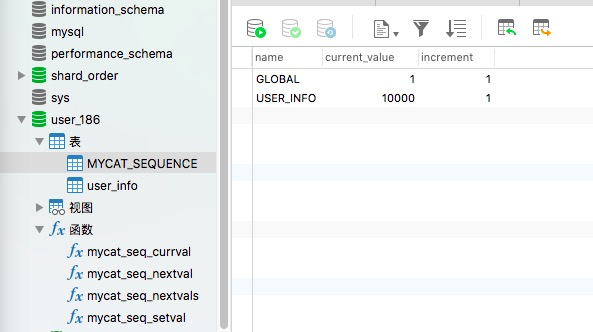

[TOC]

##  目录

- [1. 分布式全局id概述及引发的问题分析](#1-分布式全局id概述及引发的问题分析)
- [2. 通过UUID实现全局id](#2-通过UUID实现全局id)
- [3. MyCat的全局统一id序列设计](#3-MyCat的全局统一id序列设计)
- [4. MyCat本地文件方式实现统一id序列](#4-MyCat本地文件方式实现统一id序列)
- [5. MyCat通过数据库方式实现统一id序列](#5-MyCat通过数据库方式实现统一id序列)
- [6. 雪花算法实现的方式分析](#6-雪花算法实现的方式分析)
- [7. MyCat使用雪花算法生成全局id](#7-MyCat使用雪花算法生成全局id)
- [8. Sharding-Jdbc使用雪花算法生成全局id](#8-Sharding-Jdbc使用雪花算法生成全局id)


# 分布式全局id设计

## 1. 分布式全局id概述及引发的问题分析

- 一般在创建表的过程中会给表创建一个自增id，通过这个自增id来做到数据的唯一性
- 在分库分表的场景中如果自增id在同一个业务表中，都是从1开始就会导致主键id重复的情况
- 如果在自增id的条件下进行数据的关联和检索，就会出现业务数据重复的情况

## 2. 通过UUID实现全局id

- UUID通用的唯一识别码
- 使用UUID可以保证每一条记录的id都不同
- 缺点：只是一个单纯的id，没有实际的意义，长度是32位的，太长了没有有顺序，对于MySQL的innoDB引擎来讲，所有的表是一个索引组织表，UUID对这个就不太友好
- MyCat自身不支持UUID的自动填充方式，Sharding-Jdbc支持UUID自动填充的方式

sharing-jdbc需要使用的分片表，主键要设置为32位varchar

```sql
CREATE TABLE `order_info_1` (
  `id` varchar(32) NOT NULL,
  `order_amount` decimal(10,2) NOT NULL,
  `order_status` int(1) NOT NULL,
  `user_id` int(11) NOT NULL,
  PRIMARY KEY (`id`) USING BTREE
) ENGINE=InnoDB DEFAULT CHARSET=utf8mb4;
```

使用UUID自动设置column的值

```properties
spring.shardingsphere.datasource.names=ds0,ds1

spring.shardingsphere.datasource.ds0.type=com.zaxxer.hikari.HikariDataSource
spring.shardingsphere.datasource.ds0.driver-class-name=com.mysql.jdbc.Driver
spring.shardingsphere.datasource.ds0.jdbcUrl=jdbc:mysql://39.99.182.22/shard_order
spring.shardingsphere.datasource.ds0.username=gavin
spring.shardingsphere.datasource.ds0.password=123456

spring.shardingsphere.datasource.ds1.type=com.zaxxer.hikari.HikariDataSource
spring.shardingsphere.datasource.ds1.driver-class-name=com.mysql.jdbc.Driver
spring.shardingsphere.datasource.ds1.jdbcUrl=jdbc:mysql://39.100.17.31:3306/shard_order
spring.shardingsphere.datasource.ds1.username=gavin
spring.shardingsphere.datasource.ds1.password=123456

spring.shardingsphere.sharding.tables.order_info.actual-data-nodes=ds$->{0..1}.order_info_$->{1..2}
spring.shardingsphere.sharding.tables.order_info.database-strategy.inline.sharding-column=user_id
spring.shardingsphere.sharding.tables.order_info.database-strategy.inline.algorithm-expression=ds$->{user_id % 2}
spring.shardingsphere.sharding.tables.order_info.table-strategy.inline.sharding-column=user_id
spring.shardingsphere.sharding.tables.order_info.table-strategy.inline.algorithm-expression=order_info_$->{user_id % 2 + 1}

# 指定自动设置的column
spring.shardingsphere.sharding.tables.order_info.key-generator.column=id
spring.shardingsphere.sharding.tables.order_info.key-generator.type=UUID
```

使用UUID来进行分片，就需要自己扩展分片规则

需要将inline的规则改成standard的规则，自己是实现分片规则

```properties
spring.shardingsphere.sharding.tables.order_info.table-strategy.standard.sharding-column=id
# 具体的实现类的全包名路径
spring.shardingsphere.sharding.tables.order_info.table-strategy.standard.precise-algorithm-class-name=com.icodingedu.config.MyShardingRule
```

实现precise-algorithm-class-name的具体分片规则

```java
import org.apache.shardingsphere.api.sharding.standard.PreciseShardingAlgorithm;
import org.apache.shardingsphere.api.sharding.standard.PreciseShardingValue;

import java.util.Collection;

public class MyShardingRule implements PreciseShardingAlgorithm<String> {
    @Override
    public String doSharding(Collection<String> collection, PreciseShardingValue<String> preciseShardingValue) {
        String id = preciseShardingValue.getValue();
        System.out.println("********id.hashCode():"+id.hashCode());
        int mode = id.hashCode()%collection.size();//hashcode可能出现负数
        mode = Math.abs(mode);
        Object [] nodes = collection.toArray();
        return nodes[mode].toString();
    }
}
```

## 3. MyCat的全局统一id序列设计

MyCat可以看作是一个数据库，MyCat作为一个分布式数据库，也会因为你对分片表设置了自增id导致数据id重复

MyCat给出的解决方案：不使用物理数据库自带的自增id算法，他会从一个地方统一获取id进行中心化管理

- 可以使用业务代码获取Redis的incr来统一生成自增id（Redis是单线程原子性）
- 也可以使用MyCat自身的ID序列生成器来生成全局ID
- MyCat生成全局ID的方式
  - 本地文件方式：使用本地文件放入内存中进行管理，当MyCat重新部署时这个ID会从新计算，这就会导致重复
  - 数据库方式：将ID序列生成器放到数据库中记录（记录表只能放在其中一台物理库上）
  - 测试环境使用本地方式比较方便，线上多用数据库方式

- 统一id生成的优缺点
  - 优点：ID集中管理，避免重复
  - 缺点：并发量大的时候，ID生成器压力大

## 4. MyCat本地文件方式实现统一id序列

MyCat管理的表结构

```sql
CREATE TABLE `user_info` (
  `id` int(11) NOT NULL,
  `username` varchar(255) NOT NULL,
  PRIMARY KEY (`id`)
) ENGINE=InnoDB DEFAULT CHARSET=utf8mb4;
```

配置项

```shell
# 1.将server.xml里的配置进行修改0:本地文件方式
<property name="sequnceHandlerType">0</property>
# 2.修改conf下的配置文件:sequence_conf.properties
# 修改完要重启一下mycat
USER_INFO.HISIDS=
USER_INFO.MINID=1001
USER_INFO.MAXID=999999999
USER_INFO.CURID=1000
# 3.手动指定值
insert into user_info(id,username) values(
next value for mycatseq_USER_INFO,
'gavin-text'
)
2013 - Lost connection to MySQL server during query, Time: 2.788000s
# 4.这个问题需要将schema.xml里的checkSQLSchema改成false
<schema name="user_db" checkSQLschema="false" sqlMaxLimit="100">
# 5.重启mycat不会从头开始自增是因为CURID会记录当前id

# 6.自增id我们希望不写这一列就能插入
# 通过设置schema的table配置autoIncrement,primaryKey
<table name="user_info" autoIncrement="true" primaryKey="id" dataNode="DN186,DN195" rule="auto-sharding-long" />
reload @@config;
```

## 5. MyCat通过数据库方式实现统一id序列

```shell
# 1.将server.xml里的配置进行修改1:数据库方式
<property name="sequnceHandlerType">1</property>
# 2.要在数据库中创建一个存放id的表，只能放在一个物理数据库节点
conf/dbseq.sql
mysql> use user_186;
mysql> source dbseq.sql;
```



```shell
# 3.配置存放自增id的数据库的节点告知给MyCat
# sequence_db_conf.properties
USER_INFO=DN186

# 如果要实现自增id且自动设置，也需要将table中的autoIncrement和primaryKey设置好
<table name="user_info" autoIncrement="true" primaryKey="id" dataNode="DN186,DN195" rule="auto-sharding-long" />
```

## 6. 雪花算法实现的方式分析

- SnowFlake是由Twttier提出的分布式ID算法

- 是一个64bit的long型数字

- 引入了时间戳，保持自增

- SnowFlake数据结构

  - 第一位是0固定不变，表示是一个正数，如果是1就是负数
  - 41位时间戳：是当前时间减去你设置的开始时间的毫秒数，开始时间在雪花算法内部是可以设置的，最长的时间范围是69年
  - 5位机房id
  - 5位机器id：5位机房和5位机器id是唯一标识这个机器的序列，2的5次方=32，有的中间件干脆将这两个合并设置为10位，直接给机器id一个1024个变化
  - 12位序号：在同一个时间统一机器并发可以生成2的12次方的序列，也就是4096个不同
  - 极端情况下雪花算法的并发是一毫秒4096个

- 时间回调会引起重复

  你的当前系统时间比实际时间要早，这个是你发现了，你会把时间调回到之前，有一定概率出现时间重叠导致重复

- MyCat和Sharding-Jdbc都是支持雪花算法的
- Sharding-Jdbc可以设置最大的容忍回调时间，如果超过这个时间再获取雪花id回抛出异常

## 7. MyCat使用雪花算法生成全局id

```shell
# 1.将server.xml里的配置进行修改2:雪花算法方式
<property name="sequnceHandlerType">2</property>
# id由int(11)修改为bigint(19)

# 2.分片规则也要改下
将auto-sharding-long改成mod-long

# 3.可以在conf下sequence_time_conf.properties
WORKID=01
DATAACENTERID=01
这里的值不能超过0-31

# 如果要实现自增id且自动设置，也需要将table中的autoIncrement和primaryKey设置好
<table name="user_info" autoIncrement="true" primaryKey="id" dataNode="DN186,DN195" rule="mod-long" />
```

## 8. Sharding-Jdbc使用雪花算法生成全局id

```properties
spring.shardingsphere.datasource.names=ds0,ds1

spring.shardingsphere.datasource.ds0.type=com.zaxxer.hikari.HikariDataSource
spring.shardingsphere.datasource.ds0.driver-class-name=com.mysql.jdbc.Driver
spring.shardingsphere.datasource.ds0.jdbcUrl=jdbc:mysql://39.99.182.22/shard_order
spring.shardingsphere.datasource.ds0.username=gavin
spring.shardingsphere.datasource.ds0.password=123456

spring.shardingsphere.datasource.ds1.type=com.zaxxer.hikari.HikariDataSource
spring.shardingsphere.datasource.ds1.driver-class-name=com.mysql.jdbc.Driver
spring.shardingsphere.datasource.ds1.jdbcUrl=jdbc:mysql://39.100.17.31:3306/shard_order
spring.shardingsphere.datasource.ds1.username=gavin
spring.shardingsphere.datasource.ds1.password=123456

spring.shardingsphere.sharding.tables.order_info.actual-data-nodes=ds$->{0..1}.order_info_$->{1..2}
spring.shardingsphere.sharding.tables.order_info.database-strategy.inline.sharding-column=user_id
spring.shardingsphere.sharding.tables.order_info.database-strategy.inline.algorithm-expression=ds$->{user_id % 2}
spring.shardingsphere.sharding.tables.order_info.table-strategy.inline.sharding-column=id
spring.shardingsphere.sharding.tables.order_info.table-strategy.inline.algorithm-expression=order_info_$->{id % 2 + 1}

# 指定自动设置的column
spring.shardingsphere.sharding.tables.order_info.key-generator.column=id
spring.shardingsphere.sharding.tables.order_info.key-generator.type=snowflake
# 设置机房和机器id,这里是合并的一共10位
spring.shardingsphere.sharding.tables.order_info.key-generator.props.worker.id=666
# 最大的容忍回调时间间隔
spring.shardingsphere.sharding.tables.order_info.key-generator.props.max.tolerate.time.difference.milliseconds=100
```


