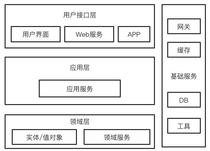
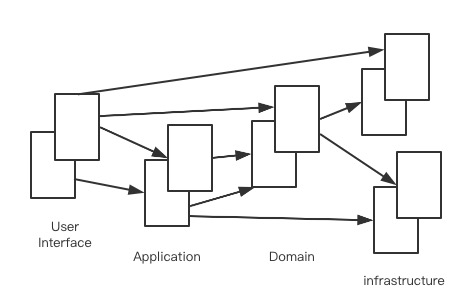

[TOC]

## [模块]

- [微服务架构设计开篇](#微服务架构设计开篇)

- [SpringCloud服务治理](./SpringCloud服务治理.md)

  

## 目录

- [1. 微服务中的“微”是什么](#1-微服务中的微是什么)

- [2. 微服务的核心思想](#2-微服务的核心思想)
- [3. 为什么要将应用微服务化](#3-为什么要将应用微服务化)
- [4. 微服务的拆分原则](#4-微服务的拆分原则)
- [5. 如何权衡微服务使用的利弊](#5-如何权衡微服务使用的利弊)
- [6. 微服务架构所面临的技术问题](#6-微服务架构所面临的技术问题)

- [7. SpringCloud和微服务架构的关系](#7-SpringCloud和微服务架构的关系)
- [8. SpringCloud核心组件介绍](#8-SpringCloud核心组件介绍)
- [9. SpringCloud的版本演进分析](#9-SpringCloud的版本演进分析)
- [10. 系统微服务的改造分析](#10-系统微服务的改造分析)
- [11. Domain领域的划分方法](#11-Domain领域的划分方法)

# 微服务架构设计开篇

## 1. 微服务中的“微”是什么

微服务的微

亚马逊的掌门人：双披萨原则（这个原则的本质就是建议保持小规模团队）

对于微服务的划分，什么粒度的微服务才是合适的？这个没有标准答案

- 假如你的用户只有几千不到1w，还需要划分服务吗？这种规模单体应用是最好的选择
- 微服务会增加运维和研发成本
- 当你的用户量达到上百万，这个时候微服务是一个更好的选择

## 2. 微服务的核心思想

支持外部业务压力的漏斗

动静分离（CDN）--->扩容（负载均衡）--->缓存（热数据Redis/搜索ES）--->服务降级--->限流

并不是你的项目中使用了微服务的开源技术，你的项目就是一个微服务架构了

所有的微服务中间件都是外功，什么是内功？

**第一个核心：拆**

微服务最直观的感受就是一个字：拆，应用微服务的第一步就是理清两个问题：拆什么？怎么拆？

业务架构、应用架构、技术架构、数据架构

**单一职责**

对于微服务结构：最适合的才是最好的，拆分的过程中的领域划分和粒度还是要结合自身业务进行考量

单一职责不仅涉及到服务拆分，在微服务领域，这种职责划分还涉及：数据库、开发、测试、发布运维都划分到一个领域模型中

**研发团队赋能**

研发团队要充分授权

**可独立部署**

每个微服务模块都应该可以独立打包，独立部署的应用

接口间调用要有过度方案

独立部署的问题：做全链路的end-to-end测试非常困难而且回归耗时，你的改动有可能导致上下游团队的系统BUG

## 3. 为什么要将应用微服务化

一般是通过Nginx实现反向代理来做负载均衡，通过众多的Web服务器实现HA集群，这些服务器都是通过N+1的方式进行部署

- 数据访问杂乱问题

  各个应用访问数据都是直接连接数据库的，通过各种join连接，数据模型变动会带来很多的业务变更影响

  通过微服务架构隔离变更影响，让其在自己的领域中进行变更处理

- 底层组件变更

  对于底层数据库变更，比如oracle换成MySQL，亦或改成MyCat或sharding-jdbc这种方式，这个时候业务就会出现较大的变动影响

  通过微服务将底层的业务领域模块抽离出来进行API接口+业务模型方式对外提供服务，这就是能在对应的领域模型里进行变更和修改了。

- 代码复用带来的维护成本

  - 总觉得别人的代码不好，自己rewrite一个，这就导致大量过期代码，其他人在调用时就不知道应该是用哪个了？很容入坑！
  - 总是认为小的改动不会有什么影响，接到一个需求发现之前有一个方法只需要稍微改动一下就ok，这个时候就改出bug了

- 快速上线抢占时间窗口

  短猛急的研发方式

  快速迭代：尽快上线，在这个场景下，对于微服务的领域模型来讲就再适合不过了

  异常回滚：对于微服务架构，回滚只局限在某个微服务范围内，只要把有问题的模块回滚掉就ok了，不会影响其他模块的发布节奏，但要考虑模块间的依赖关系，还要考虑一下下游依赖

## 4. 微服务的拆分原则

微服务的拆分没有一个绝对正确的答案，服务的拆分粒度要完全根据业务场景来规划，但随着业务的不断推进，原先的拆分方案也要做调整，可以参考一以下维度和模式

### 4.1. 按照压力模型来拆分

压力模型简单来说就是用户访问量，我们识别出超高访问量的业务，将这些业务拆分出来，如果不拆分，高压力业务就会导致整个服务挂掉，我们肯定不希望让这种情况影响到其他业务

举两个例子：

- **秒杀**：典型的低频突发流量的场景，这不是系统里的核心流程，但流量瞬时爆发很大
- **商品详情页**：是电商业务场景中并发量最大的业务模块

在具体规划的时候，尽量把压力模型拆解为以下三个维度

- **高频高并发场景：**例如商品详情页，QPS非常高
- **低频突发流程场景：**比如秒杀，比如新零售业务系统后台（线下商品和线上商品同步）也会出现高QPS的情况
- **低频低流量场景**：后台运营的编辑功能，商品上下架，内容管理

通常建议将高频高并发的场景单独拆出来，对于低频高并发的如果允许的情况下单独拆出，如果不能独立需要考虑流控以及补偿。

### 4.2. 按照业务模型拆分

主要从这三个维度考虑：主链路、领域模型、用户群体

#### 4.2.1. 主链路拆分

什么结果是这个系统产生的前提，这个结果产生的流程就是系统的主链路

在业务系统拆分和保障的过程中一定要确保主链路可用

- 异常容错：为主链路建立层次化的降级策略
- 调配资源：主链路一般都是高频场景，需要更多的资源倾斜
- 服务隔离：主链路是C位，要把辅助的业务和他隔离开

#### 4.2.2. 领域模型拆分

DDD（Domain-Driven Design）领域驱动设计

所谓领域模型其实就是一套各司其职的服务集合

我们在做微服务架构拆分的时候要确保我们的各个领域之间有清晰的界限

#### 4.2.3. 用户群体拆分

首先要了解系统有哪些用户，比如电商系统有买家、卖家，根据用户来进行前台后台业务系统的系统

#### 4.2.4. 前后台业务分离

前后台业务应用区分

## 5. 如何权衡微服务使用的利弊

**微服务的优点**

- 单一职责，独立部署，快速响应
- 边界清晰，不过度受制于技术栈（熔断可以用Hystrix，用sentinel）
- 更加精粒度的业务控制，对局部熔断和限流非常重要
- 不依赖于具体的数据模型，而是面向业务和领域模型

**微服务架构设计的缺点**

- 部署结构复杂，模块众多，部署复杂
- 依赖微服务的组件，依赖平台支撑，对研发人员的技术要求比较高
- 分布式问题，事务一致性
- 由于架构师对业务理解的程度不同，对系统拆分水平不一致导致拆分粒度过粗或过细都会降低架构的优越性

通过对微服务的优缺点理解可以得出：

业务规模要有一定的量，也就是成本和收益的博弈过程决定了是否做微服务改造

业务架构和领域模型的理解决定了我们怎么做微服务，如何拆分和拆分的粒度大小

## 6. 微服务架构所面临的技术问题

### 6.1. 服务治理和负载均衡

对于业务流量非常大的场景下，我们拆分后的微服务可以要调用多个微服务模型，这么多的服务哪个可用，哪个不可用，什么时候上线什么时候下线，服务的扩缩容都要很清楚的明白，这就是**服务治理**

在服务治理的场景下还需要**负载均衡**解决服务节点的访问问题

### 6.2. 服务容错

在服务不可用的情况下，下游服务要能够提供容错机制，就是服务的降级和熔断

### 6.3. 配置管理

大家在平时的项目中是怎么管理配置项的？使用配置文件？对于配置文件我们需要一个公共的配置中心来统一管理

### 6.4. 服务网关

通过微服务架构中服务的转发

### 6.5. 调用链追踪

对于最终的数据结果差异，在微服务架构里很难进行数据追踪查询错误

### 6.6. 消息驱动

RabbitMQ和kafka在调用的时候调用方式和ACK机制一样吗？通过一个公共的收发消息的模块来进行底层消息调用

### 6.7. 限流

我们需要在微服务阶段引入分布式限流的手段

## 7. SpringCloud和微服务架构的关系

我们应该选择哪些技术组件来组合实现微服务架构并完成微服务的改造，有没有一套业界的最佳实践来参考一下呢？答案是有的！

spring整合了各路优秀的开源组件，打包提供了一套最佳业界实践的解决方案组件集合，他就是微服务领域的圣经：springcloud（春云）

主要的两个组件来源地：Netflix和Alibaba

所有上面提到的这些微服务面临的技术问题都可以通过springcloud提供的组件进行简单的注解和配置实现并应用到系统中

**springcloud的生态系统的建立**

- 服务治理：Eureka、Consul、Nacos
- 负载均衡：Ribbon
- 消息调用：通过Feign调用远程接口就像调用本地应用一样
- 服务容错：Hystrixs
- 分布式配置中心：Config
- 消息推送：Bus
- 服务网关：Gateway
- 调用链路追踪：Sleuth
- 消息驱动：Stream
- 流量访问兵：Sentinel

## 8. SpringCloud核心组件介绍

Netflix

Alibaba

Spring Open Source

## 9. SpringCloud的版本演进分析

2015.3 Angel

2016.5 Brixton

2016.9 Camden

2017.4 Dalston

2017.11 Edgware

2018.6 Finchley

2019.1 Greenwich

2019.11 Hoxton SR3

**SpringCloud的版本升级的利弊权衡**

- 不能为新而新
- 新功能新组件是否能够应用到业务中提升业务产能
- 新版本是否有较大的Bug Fix和安全补丁
- 技术栈有一定的可扩展性
- 替换成本、开发的资源、运维成本
- 上下游系统的兼容性
- 对当前业务是否有影响

**项目技术栈升级，推荐方式**

- 定期的半年/一年的技术栈Review
- 只采用SR发布版，绝不冒进
- 持续关注新的大版本更新：新功能，新组件
- 全链路测试+回滚计划设定好

## 10. 系统微服务的改造分析

就一个字：拆

- 每个POM只引入自己用到的依赖：拆分POM依赖项
- 按照领域模块拆分：domain
- 公共组件剥离：common
- 平台中间件剥离：platform

## 11. Domain领域的划分方法

**贫血模型vs领域模型**

### 11.1. 贫血模型

什么是贫血模型？几乎80%的项目使用的都是贫血模型

所谓贫血模型，就是指Model中仅包换属性，不包含行为，采用这种设计时，需要分离出DB层（mapper/dao）专门用于数据库的操作（数据库作为状态数据的存储方）

**典型的包结构：**

po/bo/pojo；放的实体对象或持久化对象，仅包含属性和Get/Set方法，没有行为方法

dao/mapper：存放对数据库的访问的方法

service：存放业务行为实现

controller；提供对UI层访问的入口

- 贫血模型的优点很明显：

  1、被许多程序员掌握，许多教材采用的都是这种模型，对于初学者使用这种模型很自然，甚至很多程序员认为这才是最正统的业务模型

  2、它非常简单，对于不复杂的业务，工作的很好开发也迅速，只需要知道功能实现步骤就可以实现了

  3、事务边界相当清晰，一个service的每个方法都可以看作是一个事务，Service的每个方法都对应一个用例

- 缺点也非常明显

  1、所有业务都在service里维护，当业务越来越复杂，service会变得非常大，最终难以理解和维护

  2、将所有业务放在无状态的service中实际上是一种面向过程的设计，他在组织复杂业务时存在天然劣势，随着业务的复杂度提升，业务会在service中多个方法间互相调用

  3、当添加一个新的UI时，往往需要重新编写业务逻辑

### 11.2. 领域模型

一般包含如下包结构：

**infrastructure：**代表基础设施层，为其他各层提供基础资源服务，例如缓存，DB，网关服务

**application：**代表应用层，提供UI层的访问接口，作为事务的界限。实现服务的组合和编排

**domain：**代表领域层，domain包含两个包：model和service，model中包含模型对象和业务功能，service中包含一系列的领域服务，对于模型对象的分析不便放入某个模型对象中，就可以放入领域服务中

**领域模型的优点：**

1、领域模型采用OO设计，将业务行为落地真正的Model中，可以进行充分的服务编排

2、从领域的业务模型上做了分层和抽象，将核心业务逻辑做了统一，然后进行服务编排即可

**领域模型的缺点：**

1、对程序员的要求比较高，初学者对这种职责分配到多个协作对象中的方式极不适应

2、领域驱动建模要求对领域模型完全了解，只给出一个用例来实现领域模型是无法做到的，在建模初期需要和领域专家（业务方，需求方）充分沟通，错误的领域模型对项目的危害非常大，实现一个好的领域模型比较困难

3、对于简单的系统，使用领域模型杀鸡用牛刀了