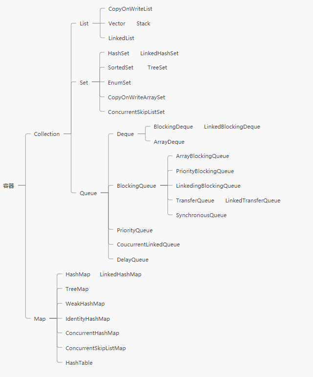

[TOC]

##  目录

- [1. 线程的基本概念](#1-线程的基本概念)
- [2. volatile与CAS与Atomic类](#2-volatile与CAS与Atomic类)
- [3. 线程同步新机制](#3-线程同步新机制)
- [4. 阶段性总结](#4-阶段性总结)
- [5. AQS源码分析与引用及ThreadLocal原理](#5-AQS源码分析与引用及ThreadLocal原理)
- [6. 并发容器](#6-并发容器)
- [7. 线程池](#7-线程池)
- [8. JMH与Disruptor](#8-JMH与Disruptor)


#  高并发与多线程

>上天：
>
>- 项目经验
>- 高并发 缓存 大流量 大数据量的架构设计
>
>入地：
>
>- 各种基础算法，各种基础的数据结构
>- JVM OS 线程 IO等内容


##  1. 线程的基本概念

### 1.1. 基本概念：

- 进程

  

- 线程

  作为一个进程里面最小的执行单元他就叫作一个线程，即一个程序里面不同的执行路径

- 协程/纤程

**用户态-内核态**

### 1.2. 线程

- 创建线程的方式

  - 继承 Thread
  - 实现 Runnable
  - 实现 Callable<T>

  > 线程池也是基于上面的方式

- 启动线程的方式

  ```java
  new Thread().start();
  new Thread(Runnable).start();
  new Thread(FutureTask(Callable)).start;
  // 线程池也是基于上面的方式
  ```

  

- 线程方法

  - sleep：睡眠，当前线程暂停一段时间让给别的线程去运行(等睡眠时间到了自动复活)
  - yield：当前线程正在执行的时候停下来进入等待队列，回到等待队列的线程依旧有可能立马又开始执行(取决于系统调度算法)
  - join：在当前线程加入调用join的线程，当前线程等待，等待调用线程完成，当前线程继续执行

- 线程状态

  

  - new 新建状态
  - Ready 就绪状态
  - Running 运行状态
  - Teminated 结束状态
  - TimeWaiting 等待/Waiting 等待/Blocked阻塞状态

  > 关闭线程不能使用，会出现很多问题


### 1.3. synchronized

早期的JDK（1.6以前）synchronized 的底层实现是重量级，效率非常低，在jdk1.6以后进行了优化，有了锁升级

无锁 -> 偏向锁 -> 自旋锁 -> 重量级锁

对象头上的两位标识所状态[00-无锁，01-偏向锁，10-轻量级锁，11-重量级锁]

HotSpot 实现：

**偏向锁**：第一个去访问某把锁的线程，如：sync(Obj)，来了之后再这个Obj的头上面markdown记录这个线程。(如果只有第一个线程访问的时候实际上是没有给这个Obj加锁的，在内部实现的时候，只是记录这个线程的ID)

**自旋锁**：偏向锁如果有线程竞争的话，就升级为自旋锁(占用cpu资源)

**重量级锁**：自旋锁转圈十次之后不成功，升级为重量级锁(需要去操作系统申请资源)


区分实际情况选择：

**执行时间短(加锁代码)，线程数少 -- 用自旋锁**

**执行时间长(加锁代码)，线程数多 --用系统锁**

参考：[https://blog.csdn.net/baidu_38083619/article/details/82527461](https://blog.csdn.net/baidu_38083619/article/details/82527461)

## 2. volatile与CAS与Atomic类

### 2.1. volatile

使用 volatile ，将会强制所有线程都会去堆内存支取running的值(可见性)

但是，volatile 并不能保证多个线程共同修改running变量时所带来的不一致问题，也就是说volatile不能替代synchronized

- 保证线程可见性
  - MESI 缓存一致性协议
- 禁止指令重排序
  - DCL(Double Check Lock)单例

###  2.2. CAS

**无锁优化，自旋，乐观锁**

- Compare And Set

- cas(V, Expected, NewValue)

  - if V == E

    V = new 

    otherwise try again or fail 

  - CPU 原语支持

java.util.concurrent.atomic.Atomic***类,即cas实现

**ABA问题**

解决：加version版本号

如果是基础类型，基本没什么问题，

如果是引用类型，就有问题需要解决

cas支持使用Unsafe类

**Unsafe类**

Unsafe ： C C++的指针

- 直接操作内存

  allocateMemory  putXX  freeMemory  pageSize

- 直接生成类实例

  allocateInstance

- 直接操作类或实例变量

  objectFieldOffset

  getInt

  getObject

- CAS相关操作

  compareAndSetObject Int Long

  weakCompareAndSetObject Int Long (新版本)

##  3. 线程同步新机制

> sysnchronized 锁
>
> atomicXXX 基于CAS
>
> longadder 分段锁

### 3.1. ReentrantLock

**可重入锁**

synchronized 也是可重入锁

```java
Lock lock = new ReentrantLock();
lock.lock();//加锁
lock.unlock();//解锁
// 
lock.tryLock();
lock.tryLock(time, timeUnit);
```

`lock.tryLock()` 尝试锁定，不管锁定与否，方法继续执行，可以根据tryLock的返回值判断是否锁定，也可以指定tryLock时间

`lock.lockInterruptibly()` 可以被打断的加锁，(使用`thread.interrupt()`打断)

**公平锁**

谁等在前面，谁先执行（先等先执行）

```java
// 参数为true，表示为公平锁
Lock lock = new ReentrantLock(true)
```

###  3.2. CountDownLatch

CountDown 叫倒数，latch 是门栓的意思

```java
// Number 数量的倒数
CountDownLatch latch = new CountDownLatch(number);
//for(int i : number) {
	//业务操作
	//latch.countDown();// 计数减1
//}
latch.await();// 等待
// 等latch数量为0，执行下面业务逻辑

```

`latch.await()` 等待(阻塞)直到latch数量为 0

`latch.countDown()` 计数减 1

###  3.3. CyclicBarrier

直译：循环栅栏

```java
CyclicBarrier barrier = new CyclicBarrier(10);
CyclicBarrier barrier = new CyclicBarrier(10,Runnable);
barrier.await();
```

`barrier.await()` 等待线程数达到指定数量，执行Runnable (如果没有这个参数就是什么都不做)

###  3.4. Phaser

jdk1.7

直译：阶段

```java
// 继承Phaser，实现自己的MyPhaser
Phaser phaser = new MyPhaser();
// 数量指定注册数量
phaser.bulkRegister(number);
// 到达等待通知(即进入下一阶段需要等待)
phaser.arriveAndAwaitAdvance();
// 到达，取消注册，不需要进入下一阶段
phaser.arriveAndDeregister();
```


使用场景：分阶段，多线程共同参与

等待指定线程数量达到 -> 执行一个阶段 . . .

**遗传算法**

###  3.5. ReadWriteLock

读写锁

- 共享锁  读锁

- 排它锁  写锁

```java
// 创建读写锁
ReadWriteLock readWriteLock = new ReentrantReadWriteLock();
Lock readLock = readWriteLock.readLock();
Lock writeLock = readWriteLock.writeLock();
```

### 3.6. Semaphore

直译：信号灯

```java
// 允许的数量(参数是信号量，这里是2)
Semaphore s = new Semaphore(2);
// 取得信号(信号量-1)，阻塞方法
s.acquire();
//释放信号(信号量+1)
s.release();
```

默认是非公平的，可以设置为公平，第二个参数

```java
Semaphore s = new Semaphore(2，true);
```

**用来限流**

###  3.7. Exchanger

交换器

```java
Exchanger<String> exhanger = new Exchanger<>();
exhanger.exchange("交换的数据");
```

`exhanger.exchange()` 阻塞方法，交换只能两两进行

### 3.8. LockSupport

`LockSupport.park()` 在线程执行中阻塞

`LockSupport.unpark(thread)` 使指定线程继续运行 

> 注意：unpark() 可以先于 park() 调用(park()不再有效)

方法实现是由Usafe类(c和c++语言实现)实现的，原理：通过一个变量作为一个标识符，变量值在0，1之间来回切换，当这个变量大于0的时候线程就获得“令牌”，park 和 unpark 方法就是在改变这个变量的值，达到线程的阻塞和唤醒

##  4. 阶段性总结

synchronized 和 ReentrantLock的不同？

​	synchronized：系统自带、系统自动加锁、自动解锁、不可以出现多个不同的等待队列，默认进行四种锁状态的升级

​	 ReentrantLock：需要手动加锁、手动解锁、可以出现多个不同的等待队列，CAS的实现


###  4.2. 淘宝面试题

> 1、实现一个容器，提供两个方法，add、size, 写两个线程，线程1 添加10个元素到容器中，线程2 实现监控元素的个数，当个数到5 时，线程2 给出提示并结束

使用volatile 程序是**不够理想的**

```java
package com.cy.test;

import java.util.Collections;
import java.util.LinkedList;
import java.util.List;
import java.util.concurrent.TimeUnit;

/**
 * AliMianShi class
 *
 * @author yanchuan
 * @module com.cy.test
 * @blame yanchuan
 * @since 20/04/03 09:51
 */
public class AliMianShi {

    // 线程不安全
//    List lists = new LinkedList();

    // 表面看没有问题，但是由于size的统计与元素添加分开且没有加锁，仍旧会出现问题
//    volatile List lists = new LinkedList();

    // 有锁保证同步，volatile关键字对于对象会存在问题，这样仍然会有问题
    /*volatile*/ List lists = Collections.synchronizedList(new LinkedList());
    public  void add(Object o){lists.add(o);}

    public int size(){return lists.size();}


    public static void main(String[] args) {

        AliMianShi m = new AliMianShi();

        new Thread(() -> {
            for (int i = 0; i < 10; i++) {
                m.add(i);
                System.out.println(i);
                try {
                    TimeUnit.SECONDS.sleep(1);
                }catch(Exception e){}
            }
        }).start();
        new Thread(() -> {
            while (true){
                if(m.size() == 5) {
                    System.out.println("监控线程结束");
                    return;
                }
            }
        }).start();
    }
}
```

使用Lock.await(),Lock.notify() **重点关注**

```java
package com.cy.test;

import java.util.LinkedList;
import java.util.List;
import java.util.concurrent.TimeUnit;

/**
 * AliInterview_Notify class
 *
 * @author yanchuan
 * @module com.cy.test
 * @blame yanchuan
 * @since 20/04/03 11:22
 */
public class AliInterview_Notify {

    List lists = new LinkedList();

    public void add(Object o) {lists.add(o);}

    public int size() {return lists.size(); }

    public static void main(String[] args) throws Exception {
        AliInterview_Notify n = new AliInterview_Notify();
        Object lock = new Object();
        Thread t1 = new Thread(() -> {
            for (int i = 0; i < 10; i++) {
                synchronized (lock){
                    n.add(10);
                    System.out.println(i);
                    if(n.size() == 5){
                        try {
                            //TimeUnit.MILLISECONDS.sleep(10);
                            lock.notify();
                            lock.wait();
                        }catch(Exception e) {}
                    }
                }

            }
        });

        Thread t2 = new Thread(() -> {
                synchronized (lock){
                    if(n.size() != 5) {
                        try {
                            lock.wait();
                        }catch(Exception e) {}
                    }
                    System.out.println("监控执行");
                    lock.notify();
                    return;
                }
        });
        t1.start();
        t2.start();
    }
}

```

使用CountDownLatch实现

```java
package com.cy.test;

import java.util.LinkedList;
import java.util.List;
import java.util.concurrent.CountDownLatch;

/**
 * Alinterview_CountDwonLatch class
 *
 * @author yanchuan
 * @module com.cy.test
 * @blame yanchuan
 * @since 20/04/03 11:52
 */
public class Alinterview_CountDwonLatch {

    List lists = new LinkedList();

    public void add(Object o) {lists.add(o);}

    public int size() {return lists.size(); }

    public static void main(String[] args) {

        Alinterview_CountDwonLatch c = new Alinterview_CountDwonLatch();

        CountDownLatch latch1 = new CountDownLatch(5);
        CountDownLatch latch2 = new CountDownLatch(1);

        Thread t1 = new Thread(() -> {
            for (int i = 0; i < 10; i++) {
                c.add(i);
                System.out.println(i);
                latch1.countDown();
                try{
                    if(c.size() == 5) {
                        latch2.await();
                    }
                }catch(Exception e) {}
            }
        });

        Thread t2 = new Thread(() -> {
            try{
                latch1.await();
                System.out.println("监控中执行");
                latch2.countDown();
                return;
            }catch(Exception e) {}
        });

        t1.start();
        t2.start();
    }
}

```


使用LockSupport 实现

```java
package com.cy.test;

import java.util.LinkedList;
import java.util.List;
import java.util.concurrent.locks.LockSupport;

/**
 * AliInterview_LockSupport class
 *
 * @author yanchuan
 * @module com.cy.test
 * @blame yanchuan
 * @since 20/04/03 12:04
 */
public class AliInterview_LockSupport {

    List lists = new LinkedList();

    public void add(Object o) {lists.add(o);}

    public int size() {return lists.size(); }

    static Thread t1 = null,t2 = null;

    public static void main(String[] args) {
        AliInterview_LockSupport ls = new AliInterview_LockSupport();


        t1 = new Thread(() -> {
            for (int i = 0; i < 10; i++) {
                ls.add(i);
                System.out.println(i);
                if(ls.size() == 5) {
                    LockSupport.unpark(t2);
                    LockSupport.park();

                }
            }
        });

        t2 = new Thread(() -> {
            if(ls.size() != 5) {
                LockSupport.park();
            }
            System.out.println("监控执行");
            LockSupport.unpark(t1);

        });
		// 启动顺序
        t2.start();
        t1.start();
    }
}

```


> 2、写一个固定容量的同步容器，拥有put和get方法，以及getCount方法，能够支持2 个生产者线程以及10个消费者线程的阻塞调用

唤醒所有wait线程

```java
package com.scdzyc.example;

import java.util.List;
import java.util.concurrent.CountDownLatch;
import java.util.concurrent.atomic.AtomicInteger;

/**
 * 写一个固定容量的同步容器，拥有put和get方法，以及getCount方法，能够支持2 个生产者线程以及10个消费者线程的阻塞调用
 */
public class Test_Inteview02<T> {

    List<T> lists = new LinkedList();

    final int MAX_COUNT = 10;
    final int MIN_COUNT = 0;
    int count = 0;
    static AtomicInteger integer = new AtomicInteger();

    public synchronized void put(T o) {
        while (getCount() == MAX_COUNT){
            try {
                this.wait();
            } catch (InterruptedException e) {
                e.printStackTrace();
            }
        }
        lists.add(o);
        ++count;
        this.notifyAll();
        System.out.println(Thread.currentThread().getName()+" PUT");
    }

    public synchronized T get() {
        while(getCount() == MIN_COUNT){
            try {
                this.wait();
            } catch (InterruptedException e) {
                e.printStackTrace();
            }
        }
        T last = getLastAndRemove();
        System.out.println(Thread.currentThread().getName()+" GET");
        this.notifyAll();
        return last;
    }

    public int getCount() {
        return count;
    }
    private T getLastAndRemove() {
        int lastIndex = count - 1;
        T t = lists.get(lastIndex);
        lists.remove(lastIndex);
        --count;
        return t;
    }

    public static void main(String[] args) {
        Test_Inteview02<Integer> test = new Test_Inteview02();
        CountDownLatch latch = new CountDownLatch(12);

        for (int i = 0; i < 10; i++) {
            new Thread(() -> {
                for (int j = 0; j < 5 ; j++) {
                    Integer integer = test.get();
                    System.out.println("值："+integer);
                }
                latch.countDown();
            },"c"+i).start();
        }
        // 生产者线程
        for (int i = 1; i < 3; i++) {
            new Thread(() -> {
                for (int j = 1; j < 26; j++) {
                    test.put(integer.getAndIncrement());
                }
                latch.countDown();
            },"p"+i).start();
        }
        try {
            latch.await();
            System.out.println("最终容器的size：" + test.getCount());
        } catch (InterruptedException e) {
            e.printStackTrace();
        }

    }
}

```

多个等待对列，唤醒相应等待对列的线程(**必须掌握**)

```java
package com.scdzyc.example;

import java.util.LinkedList;
import java.util.List;
import java.util.concurrent.CountDownLatch;
import java.util.concurrent.atomic.AtomicInteger;
import java.util.concurrent.locks.Condition;
import java.util.concurrent.locks.Lock;
import java.util.concurrent.locks.ReentrantLock;

/**
 * 写一个固定容量的同步容器，拥有put和get方法，以及getCount方法，能够支持2 个生产者线程以及10个消费者线程的阻塞调用
 */
public class Test_Inteview02<T> {

    List<T> lists = new LinkedList();

    final int MAX_COUNT = 10;
    final int MIN_COUNT = 0;
    int count = 0;
    static AtomicInteger integer = new AtomicInteger();
	// 
    private Lock lock = new ReentrantLock();
    // 本质就是创建两个等待对列
    Condition producer = lock.newCondition();
    Condition consumer = lock.newCondition();
    /**
     *  注意    producer.await() 进入等待
     *         producer.signalAll() 唤醒
     * 不能使用 producer.wait()/notifyAll
     * @param o
     */

    public void put(T o) {

        try{
            lock.lock();
            while (getCount() == MAX_COUNT){
                producer.await();
            }
            lists.add(o);
            ++count;
            consumer.signalAll();
            System.out.println(Thread.currentThread().getName()+" PUT");
        }catch(Exception e){}finally {
            lock.unlock();
        }

    }

    public T get() {
        T last = null;
        try{
            lock.lock();
            while(getCount() == MIN_COUNT){
                try {
                    consumer.await();
                } catch (InterruptedException e) {}
            }
            last = getLastAndRemove();
            System.out.println(Thread.currentThread().getName()+" GET");
            producer.signalAll();
        }catch(Exception e) {}finally {
            lock.unlock();
        }
        return last;
    }

    public int getCount() {
        return count;
    }
    private T getLastAndRemove() {
        int lastIndex = count - 1;
        T t = lists.get(lastIndex);
        lists.remove(lastIndex);
        --count;
        return t;
    }

    public static void main(String[] args) {
        Test_Inteview02<Integer> test = new Test_Inteview02();
        CountDownLatch latch = new CountDownLatch(12);

        for (int i = 0; i < 10; i++) {
            new Thread(() -> {
                for (int j = 0; j < 5 ; j++) {
                    Integer integer = test.get();
                    System.out.println("值："+integer);
                }
                latch.countDown();
            },"c"+i).start();
        }
        // 生产者线程
        for (int i = 1; i < 3; i++) {
            new Thread(() -> {
                for (int j = 1; j < 26; j++) {
                    test.put(integer.getAndIncrement());
                }
                latch.countDown();
            },"p"+i).start();
        }
        try {
            latch.await();
            System.out.println("最终容器的size：" + test.getCount());
        } catch (InterruptedException e) {
            e.printStackTrace();
        }

    }
}
```


###  4.3. 源码阅读方法

> 读源码很难！理解别人的思路！
>
> - 数据结构基础
>
> - 设计模式

源码阅读原则

- 跑不起来不读
- 解决问题就好-目的性
- 一条线索到底
- 无关细节略过
- 一般不读静态
- 一般动态读法

读源码先读骨架

## 5. AQS源码分析与引用及ThreadLocal原理

AQS：`java.util.concurrent.locks.AbstractQueuedSynchronizer`

AQS源码：

​	Templatle Methed

​	Callback Function

​	父类默认实现

​	子类具体实现


以 ReentrantLock 的lock()开始

重点属性：`voaltile int state` 

> ？通过AQS是如何设置链表尾巴的来理解AQS为什么效率这么高
>
> 使用了CAS操作，`compareAndSetTail(oldTail,node)`参数node就作为新的Tail，这样就不需要把原来的链表上锁

> ？为什么是双向链表
>
> 当添加一个线程节点的时候，需要看前一个节点的状态，如果前一个节点是持有线程的过程中，这个时候当前线程就需要在队列中等待，如果前一个节点已经取消掉了，那当前线程就可以越过这个线程，不用去考虑他的状态了

细节：

jdk1.9新增的 VarHandle 类(句柄)

- 可以实现普通属性原子操作
- 比反射快，直接操作二进制码

### 5.1. ThreadLocal

ThreadLocal 里的对象时**线程独有**的，就是线程用TreadLocal只能自己设置对象(值)，并且只有自己线程才能访问

```java
static ThreadLocal<T> tl = new ThreadLocal<>();
// 设置值(对象)
tl.set(T);
// 获取值(对象)
T o = tl.get();

// 注意：线程独有，A线程设置，A线程获取
```

> ？为什么使用ThreadLocal
>
> 如：spring声明式事务，保证使用同一个Connection

**ThreadLocal 的问题**：

在线程池中，线程的重用会出现问题

### 5.2. Java的四种引用

- 强引用

  普通(默认)就是强引用，只要有被引用，就不会回收

- 软引用

  SoftReference

  如果是软引用，当内存不够用时，就会被回收 [软引用非常适合缓存]

- 弱引用

  WeakReference

  只要有gc发生，就会被回收 [一般用在容器中—>ThreadLocal用完后，手动调用remove()方法(避免内存泄漏)]，

- 虚引用

  PhantomReference

  管理堆外内存，一个对象(这个对象不能使用get方法获取)，一个队列(当对象被回收时，对象会被放入队列)

  用途：通过检测队列，可以知道对象(堆外内存空间)是否已被回收，然后回收内存

  

## 6. 并发容器

jdk中容器(看源码)【面试高频】涉及数据结构、算法



这里面最重要的是**阻塞队列**，他的实现初衷就是为了线程池、高并发做准备

Vector Hashtable 

- 自带锁，现在基本不使用

ConcurrentHashMap，在写方面与Hashtable，SynchronziedMap差不多，但是在读方面性能很好

多线程场景下使用容器，多考虑queue，而不是List

CopyOnWrite 写时复制

BlockingQueue 阻塞队列

队列提供了一系列对多线程友好的API

> Queue 和 List 的区别
>
> - 对线程友好的API ：offer，peek，poll
> - BlockingQueue增加的API：put， take【阻塞】


## 7. 线程池

> 面试题：两个线程，第一个线程是从1到26，第二个线程是从A一直到Z，两个线程同时运行，交替输出，顺序打印？

1. LockSupport实现
2. synchronized ，wait、notify实现
3. Lock，await、signal实现
4. CAS实现
5. BlockingQueue 实现
6. PipedStream 实现(了解)
7. TransferQueue实现

>  Semaphore、Exchanger 实现不了

线程池接口：

- Executor：任务的定义
- ExecutorService：继承Executor，完善了整个任务的生命周期

Callable：Runnable + return

Future：存储执行的将来才会产生的结果

FutureTask：Future + Runnable 

CompletableFuture 管理多个Future【关注】

两种线程池：

- ThreadPoolExecutor 普通线程池

  七参数构造：

  ```java
  public ThreadPoolExecutor(
      int corePoolSize,		//核心线程数
      int maximumPoolSize,	//最大线程数
      long keepAliveTime,		//空闲时间(回收线程[超出核心线程数的线程])
      TimeUnit unit,			//时间单位
      BlockingQueue<Runnable> workQueue,	//任务队列
      ThreadFactory threadFactory,		//线程工厂(创建线程)可自定义实现
      RejectedExecutionHandler handler	// 拒绝策略(默认四种)-可自定义实现
  	){
  	// DO SOMETHING                          
  }
  
  ```

  **默认拒绝策略**

  - Abrot					抛异常
  - Discard			    扔掉，不抛异常
  - DsicardOldest	扔掉排队时间最久的
  - CallerRuns		  调用者处理任务

- ForkJoinPool

  - 分解汇总的任务
  - 用很少的线程可以执行很多的任务(子任务)，TPE做不到先执行子任务
  - CPU密集型

**源码阅读解析**：

回顾：

- Executor 

- ExecutorService
- AbstractExecutor
- ThreadPoolExecutor 【七参数构造】

Executors：工具类-线程池工厂

- SingleThreadExecutor 单线程线程池，队列数最大Integer-Max

  > 为什么要有单线程线程池？
  >
  > 任务队列，生命周期管理

- CacheThreadPool  最大线程数-integer-Max，syncQueue
- FixedThreadPool 固定线程数，队列最大Integer-Max

> Cache VS Fixed ?

> 线程池线程数量：如果过多，最终特闷会竞争稀缺的处理器和内存，浪费大量时间在上下文切换，反之，数量过少，处理器的一些核可能就无法充分利用
>
> Brian Goetz建议：
>
> N~threads~ = N~CPU~ * U~CPU~ * (1 + W / C)
>
> N~CPU~：处理器的核的数目可通过`Runtime.getRuntime().availableProcessors()`
>
>  U~CPU~：是期望的CPU利用率(该值应该介于0 - 1之间)
>
> W/C：是等待时间(wait)和计算时间(compatation)的比率

- ScheduledThreadPool 定时任务线程池，使用的是DelayedWorkQueue

  > interview: 假如提供一个闹钟服务，订阅这个服务的人特别多，10亿，怎么优化？
  >
  > 分发到多个边缘节点，由节点提供服务

concurrent VS parallel

并发是指任务提交，并行是指任务执行

并行是并发的子集

- WorkStealingPool 每个线程都有自己单独的队列 ，使用work stealing算法(当一个线程的队列无任务可以拿到其他线程的队列的任务)  push，pop，poll
  - ForkJoinPool 适用于将大任务拆分成小任务 --> 汇总

## 8. JMH与Disruptor

#### 8.1. JMH

Java Microbenchmark Harness

微基准测试,测试某个方法的性能到底是好或者不好，换了方法实现之后他的性能如何，这个测试框架2013年由JIT开发出来，后来归到OpenJDK下面

[官网：http://openjdk.java.net/projects/code-tools/jmh](http://openjdk.java.net/projects/code-tools/jmh)

创建JMH测试(七步骤)：

1. 创建maven项目，添加依赖
   - jmh-core（jmh的核心）
   - jmh-generator-annprocess（注解处理包）
2. idea安装JMH插件 JMH plugin v1.0.3
3. 由于用到了注解，打开运行程序注解配置
4. 定义需要测试类PS（ParallelStream）
5. 写单元测试
6. 运行测试类
7. 阅读测试报告

**JMH中的基本概念**

1. Warmup

   预热，由于JVM中对于特定代码会存在优化(本地化)，预热对测试结构很重要

2. Mesurement

   总共执行多少次测试

3. Timeout

4. Threads

   线程数，由fork指定

5. Benchmark mode

   基准测试的模式

6. Benchmark

   测试那一段代码

#### 8.2. Disruptor

分裂、瓦解，内存里用于存放元素的一个高效率的队列

- 一个线程每秒处理600万订单
- 2011年Duke奖
- 速度最快的MQ
- 性能极高，无锁CAS，单机支持高并发

特点：无锁，高并发，环形Buffer，直接覆盖(不用清除)旧的数据，降低GC频率，用于生产者消费者模式(观察者模式-设计者角度)

Disruptor开发步骤：

1. 定义Event-队列中需要处理的元素

2. 定义Event工厂（EventFactory），用于填充队列

   > 这里涉及效率问题，disruptor初始化的时候，会调用Event工厂，对RingBuffer进行内存的提前分配GC产生频率会降低

3. 定义EventHandler（消费者），处理容器中的元素

构建Dsiruptor 参数：EventFactory，BufferSize，ThreadFactory

**ProducerType 生产者线程模式**

- MULTI		多线程模式(加锁)
- SINGLE       单线程模式(不加锁，效率高)

**等待策略**

- BlockintWaitStrategy：（常用）线程阻塞的方式，等待生产者唤醒，被唤醒后，再循环检查依赖的sequence是否已经被消费
- BusSpinWaitStrategy：线程一直自旋等待，可能比较耗CPU
- LiteBlockingWaitStrategy：线材更阻塞等待生产者唤醒，与BlockintWaitStrategy相比，区别在于signalNeeded.getAndSet，如果两个线程同时访问，一个访问waitor，一个访问signalAll，可以减少lock加锁次数
- LiteTimeoutBlockingWaitStrategy：与LiteBlockingWaitStrategy相比，设置了阻塞时间，超时后抛出异常
- PhasedBackoffWaitStrategy：根据时间参数和传入的等待策略来决定使用哪种策略
- TimeoutBlockingWaitStrategy：相对于BlockintWaitStrategy来说，设置了等待时间，超时后抛出异常
- YieldingWaitStrategy：（常用）尝试100次，然后Thread.yield()让出CPU
- SleepingWaitStrategy：（常用）sleep

**消费者异常处理**

默认：disruptor.setDefaultExceptiionHandler()

覆盖：disruptor.handlerExceptionFor().with()